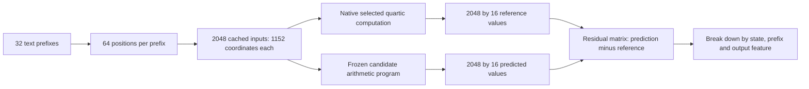
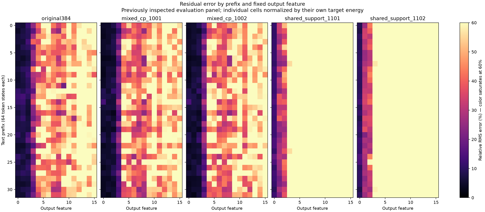

# How many examples were tested, and where does the remaining error live?

22 September 2026, 00:58 UTC. New CPU analysis of the existing evaluation panel; no candidate was trained or changed for this report.

**There were 2,048 token states, each with 16 output coordinates. There were not just 16 examples.** Those states come from 32 text prefixes, with 64 positions per prefix. The calibration panel contains another 6,144 states from 96 prefixes. Positions within a prefix are correlated, so these counts do not mean 2,048 or 6,144 independent documents.

**The residual is uneven across both examples and output features. The pooled 6.32% error of our best CP candidate hides roughly 37–62% relative errors on the twelve smallest output coordinates.** That matters for the goal of recovering reusable components even when those coordinates contribute little to the aggregate value loss.

## What exactly is being measured?

We are studying the last two bilinear MLPs, numbered 16 and 17 starting from zero, in the 18-block model. The selected target is the pure quartic contribution obtained by feeding the quadratic MLP16 contribution into both inputs of MLP17. Other residual, attention, bias and cross terms are outside this selected polynomial. Normalization and softcapping remain explicit in separate model-level intervention tests.

The input at each token state has 1,152 coordinates. We measure 16 fixed scalar projections of this quartic output, along the output writers selected in the earlier compressed model. These are learned output directions, not 16 tokens, vocabulary entries, or established semantic concepts. Their vocabulary-space writers are orthonormal, which makes Euclidean error in these coordinates meaningful for this selected output subspace. It says nothing about error outside that subspace or after nonlinear final normalization.

Let the reference and prediction matrices be $Y$ and $\widehat Y$, each of shape $2048\times16$. The residual is

$$
R=\widehat Y-Y.
$$

The reported pooled error is

$$
e_{\mathrm{pooled}}=\frac{\|R\|_F}{\|Y\|_F}.
$$

This pools squared error and squared target magnitude before taking the ratio. It is not the mean of each state's percentage error. A large output feature or high-magnitude state receives more weight. Here “energy” means a sum of squared values, not variance about the mean.

## Do a few examples account for the error?

The following measurements use the same 2,048 reference states. CP means a sum of products of four learned linear forms. The shared candidates compute quadratic intermediates and reuse them in quartic products. These are the completed support-exchange candidates; the ongoing shared-direction optimization is not included.

| Candidate | Pooled error | Median per-state relative error | 99th percentile per-state error | Worst 10% of states: share of squared error |
| --- | ---: | ---: | ---: | ---: |
| original384 | 8.13% | 8.45% | 35.75% | 42.0% |
| mixed_cp_1001 | 6.32% | 6.03% | 34.20% | 43.4% |
| mixed_cp_1002 | 6.59% | 6.30% | 34.40% | 44.3% |
| shared_support_1101 | 20.37% | 22.06% | 55.90% | 44.0% |
| shared_support_1102 | 19.84% | 21.31% | 55.65% | 45.1% |

For CP seed 1001, the worst 1% of states (21 states, rounding up) account for 10.6% of squared error; the worst 5% account for 29.0%; the worst 10% account for 43.4%. That last set contains only 18.2% of target energy, so its error concentration is not explained solely by larger target magnitudes. The remaining 90% of states still account for 56.6% of error: this is not just one or two catastrophic examples.

Per-state percentage error has a denominator problem: a small target norm can produce a large percentage for a modest absolute miss. For that reason the machine-readable report also divides each residual norm by the *same* overall target RMS. For CP seed 1001, the median is then 4.48%, the 99th percentile 16.54%, and the maximum 27.36%. Using each state's own target norm, the maximum instead reaches 92.15%. These are different questions, not contradictory scores.

Aggregating by text prefix, CP seed 1001 has median error 5.69%, 90th percentile 9.12%, and worst-prefix error 12.18%. Seed 1002 has a similar pattern, with worst-prefix error 13.41%. The shared candidates have median prefix errors around 18–19% and worst-prefix errors around 29–30%; their failure is broader than a few isolated token states.

Two of the largest absolute residuals for CP seed 1001 occur at contexts ending in `Media Advisory, 4/` and `FilterMAG Oil Filter Magnet (SS365) $`. They account for about 0.91% and 0.79% of total squared error respectively. These are selected examples, not evidence of a discovered “date” or “price” failure category. The JSON includes twelve contexts per candidate for inspection.

## Which output variables are missed?

Feature numbers below refer to the fixed 16 output coordinates, numbered 0–15. They are not MLP channel numbers. For CP seed 1001:

| Output feature | Share of target energy | Relative error within feature | Share of total squared error |
| --- | ---: | ---: | ---: |
| 0 | 79.211% | 5.20% | 53.60% |
| 1 | 9.215% | 5.43% | 6.79% |
| 2 | 10.247% | 6.65% | 11.35% |
| 3 | 1.000% | 18.58% | 8.64% |
| 4 | 0.058% | 54.40% | 4.30% |
| 5 | 0.072% | 49.49% | 4.42% |
| 6 | 0.063% | 43.58% | 2.98% |
| 7 | 0.034% | 37.44% | 1.20% |
| 8 | 0.031% | 40.72% | 1.29% |
| 9 | 0.013% | 53.82% | 0.97% |
| 10 | 0.012% | 62.47% | 1.21% |
| 11 | 0.015% | 47.85% | 0.86% |
| 12 | 0.009% | 61.75% | 0.84% |
| 13 | 0.009% | 57.81% | 0.71% |
| 14 | 0.006% | 54.67% | 0.45% |
| 15 | 0.005% | 59.84% | 0.40% |

Features 0–2 carry about 98.67% of the target energy. That is why accurately fitting these three can produce a good pooled score while features 4–15 remain relatively inaccurate. Feature 0 produces the most absolute residual energy because it is so large; feature 10 has a much larger percentage miss but very little target energy. Both views are necessary.

The two CP restarts show similar feature-wise weaknesses. The heatmap below shows each text prefix against each output feature; each cell is normalized by that prefix-feature cell's own reference energy. Persistent bright columns indicate feature-level weaknesses across many prefixes. Bright cells can also reflect small denominators. The color scale saturates at 60%; larger errors are preserved numerically in the underlying results.

These measurements identify *output* coordinates with concentrated errors. They do not yet identify which of the 1,152 input variables causes the error. That requires residual gradients or controlled changes to input directions; correlations with inputs alone would not establish a causal explanation.

## Is the residual systematically biased or low-dimensional?

For CP seed 1001, the squared mean residual accounts for 28.0% of total squared error. After subtracting that mean, the largest residual principal component accounts for 50.5% of centered error energy, and the first three account for 73.9%. Seed 1002 gives 27.2%, 49.4%, and 74.0% respectively. Thus part of the error is systematic, and much of its variation is concentrated in a few output directions.

This does not demonstrate that a cheap correction generalizes. Subtracting an offset estimated on this evaluation panel would fit evaluation labels; it would also add a constant term to the current homogeneous quartic program. We have not applied that correction. A useful follow-up is to fit a permitted residual correction on calibration data and test it on new prefixes, charging its actual arithmetic cost.

The 30 states whose current token contains a newline have pooled all-16-output errors of 3.95% and 4.69% for the two CP candidates, compared with 6.54% and 6.77% elsewhere. This does not overturn earlier newline intervention failures or successes: those tests measure changes between states or final-logit effects after modifying a component, rather than this all-output value error. Only 30 newline states are present here.

## Is it costly to test more?

Evaluating each frozen candidate on all 2,048 cached states took **0.02–0.09 seconds on CPU with two threads** in this run. Loading the inputs, evaluating all five candidates, and computing numerical summaries took about 0.52 seconds, excluding plot generation and interpreter startup. These are observed warm local timings, not a GPU benchmark or a guarantee for larger panels.

The more expensive part is obtaining **new** hidden states and their native reference outputs: that requires loading/running the original model and computing the selected quartic target. Repeatedly scoring the same cached states does not add statistical evidence. More positions from the same prefix also add less diversity than new prefixes.

A sensible next panel would use 256 new prefixes at 64 positions each: 16,384 states, eight times this panel and eight times as many prefixes. The input cache alone would be about 72 MiB at float32, plus labels and metadata. Score the frozen candidates in chunks. Keep any new dataset separate from fitting and use prefix-level uncertainty estimates; for distribution shift, report separate domains and longer-context panels rather than pooling them invisibly. This larger panel is a proposed follow-up, not a result or completed capture in this report.

## What this changes about our assessment

The CP result remains an improvement in aggregate value reconstruction. It does **not** establish uniformly accurate recovery of all 16 components. The small output directions are a substantial remaining weakness, and the shared candidates also miss larger directions. Future comparisons should report pooled error, per-feature error, prefix and state tails, and intervention error together. Equal-feature or sensitivity-weighted fitting is a hypothesis to test alongside the existing objective, with new held-out evaluation; changing weights is not automatically an improvement.

Reproducibility: [CPU analysis script](../../direct_tensor_match/audit_candidate_residual_distribution.py), [full statistics and contexts](../../direct_tensor_match/CANDIDATE_RESIDUAL_DISTRIBUTION_V1.json), [one row per candidate and token state](../../direct_tensor_match/CANDIDATE_RESIDUAL_ROWS_V1.csv). Token hashes were checked against both cached inputs and reference labels. Feature energy sums and the residual mean/covariance decomposition were checked. No evaluation-label fitting was performed. This already-inspected panel supplies diagnostics, not fresh validation or a confidence interval.

## Follow-up: do the residual patterns transfer between panels?

A subsequent CPU check found that the two CP restarts' evaluation residuals have cosine similarity **0.956**. Averaging their predictions gives **6.38%** error, slightly worse than the better individual candidate, while needing both programs. These errors are largely shared rather than cancelling across these restarts.

Four output directions estimated from calibration residuals capture **84–85%** of evaluation residual energy. That suggests a small set of missing output effects, but we still need to discover input-dependent computations that predict their amplitudes. Projecting the *known evaluation residual* into those directions is an oracle diagnostic, not an implemented repair. Also, this energy-based view does not resolve the smaller features' relative errors.

The simplest proposed correction does not transfer well: subtracting the calibration mean residual improves the two evaluation errors only from **6.32% to 6.26%** and **6.59% to 6.52%**. A large evaluation bias alone therefore was not evidence of an easy fix. [Details and limitations](../../direct_tensor_match/RESIDUAL_SUBSPACE_TRANSFER_INTERPRETATION_V1.md).
