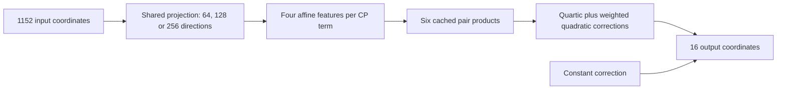

# A new arithmetic-program baseline: fewer linear coefficients, more product terms

22 September 2026, 01:34 UTC.

We now have a constructive baseline that reduces the input directions used by a fitted CP program and **analytically accounts for the discarded directions**. At 256 retained directions, storage falls from **2.39 million to 0.85 million coefficients**, with similar value and same-token response errors on opened panels. Native finite-removal testing is next; this is not an adopted circuit.

The target remains the 16-coordinate pure quartic contribution through the final two MLPs. The starting object is our fitted 512-term CP approximation, not the exact native tensor. Each term multiplies four linear input features and writes into shared output directions.

Assume the input follows the Gaussian mean and covariance used in the weight-matching experiments. Select a smaller input subspace from the parent's exact average derivative information. Retain those coordinates and average over the remaining Gaussian coordinates. This is a conditional expectation.

Averaging a product is not the same as multiplying averaged factors. Discarded directions contribute quadratic corrections and a constant. For retained affine features $l_i$ and discarded-factor covariances $c_{ij}$,

$$
E[F_{\mathrm{term}}\mid\text{retained inputs}]
=l_1l_2l_3l_4+\sum_{i<j}c_{ij}\prod_{k\notin\{i,j\}}l_k
+c_{12}c_{34}+c_{13}c_{24}+c_{14}c_{23}.
$$

Compute all six pair products once and reuse them. Two also form the quartic. This takes seven variable multiplications per term rather than nine for separate evaluation. Constant corrections combine into the output bias.

| Program | Stored coefficients | Variable products | Native value error, two starts | Feature-1 response error |
| --- | ---: | ---: | ---: | ---: |
| Original CP parent | 2.39 million | 1,536 | 7.38 / 7.58% | 9.72 / 11.78% |
| 64 directions | 0.24 million | 3,584 | 8.72 / 8.83% | 13.23 / 13.27% |
| 128 directions | 0.44 million | 3,584 | 7.79 / 7.93% | 11.37 / 12.18% |
| 256 directions | 0.85 million | 3,584 | 7.31 / 7.53% | 10.26 / 10.54% |

Value errors use the opened 256-document panel; responses use earlier same-token pairs. Small apparent improvements are exploratory, not established superiority.

These programs have more variable products but smaller dense linear projections. At rank 256, coefficient multiplications fall from about 2.37 million to 0.83 million, excluding the common output writer. This is a tradeoff under our different complexity penalties, not a win under every cost definition.

Matching the fitted parent under its Gaussian gives below 1% error at rank 256. That does not mean below 1% error against the native model. Component sensitivity errors remain above 10%, smaller outputs remain inaccurate, and semantic selectivity is unproved.

The construction passed independent integration controls on five toy structures. Float32 exports reproduce float64 predictions to below 4.6e-7 relative error. The next native test checks actual feature-removal effects with original normalization and softcap retained.

This is an explicit alternative to Tucker/HT fitting and generic graph edits: use a defined projection to propose a smaller input dictionary, then compile its correction terms with reuse. Whether those dictionaries contain interpretable computations remains a separate question.

[Derivation, operation accounting and limitations](../../direct_tensor_match/CONDITIONAL_CP_PROGRAMS_INTERPRETATION_V1.md) · [Measurements](../../direct_tensor_match/CONDITIONAL_CP_PROGRAMS_V1.json) · [Executable evaluator](../../direct_tensor_match/conditional_quartic_cp.py).
