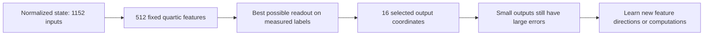

# Why we now need new computations, not just a different readout

22 September 2026, 04:17 UTC.

The two-stage direction remains: discover useful computations from folded weights, then simplify and share them in an arithmetic graph. The latest decisive result concerns the first stage: **the current learned feature dictionaries cannot accurately represent the smaller output components, even if we give their final readout the answers to every evaluation example.**

What are these objects? We are isolating the pure quartic contribution through the last two bilinear MLPs, layers 16 and 17 of the 18-block model. At each token, the input is a 1,152-dimensional normalized state. We observe this selected contribution along 16 fixed output directions. Those directions are neither 16 datapoints nor 16 identified semantic concepts. Each candidate computes 512 quartic scalar features and combines them into those 16 outputs. This excludes residual, attention, bias and mixed terms outside the selected path; it is not a replacement for the whole transformer.

Earlier fits left an ambiguity: did the Gaussian training metric choose the wrong output coefficients, or did the learned feature dictionary lack the needed computations? We tested the latter directly with an oracle. Keeping the 512 features fixed, solve unregularized least squares using all 16,384 opened text states and their native reference outputs. Separately do the same for 2,494 matched-state differences. This uses evaluation labels, so it is deliberately not a generalization result or an exported model.

Even those best readouts leave individual smaller outputs with **26–49% value error** and **26–46% response error**. Their pooled errors look much better: about 3.9% for values and 6.2% for responses. Large components still hide weaknesses in the smaller ones. Independent SVD and QR calculations agree, and the feature matrices have full numerical rank.

This does not rule out CP with different features, Tucker, HT, or a compact arithmetic graph. It specifically rules out repairing these two frozen dictionaries by readout tuning alone to reach 10% error per smaller output on these states. The numerical optimum is conditional on the dictionary and finite panel, not a theorem about the full model.

The graph stage has made a different kind of progress: linear-reader sharing and exact product reuse reduce computation while preserving the fitted parent. More aggressive quadratic sharing damages some finite responses. Those edits cannot repair information that the first-stage dictionary never represented adequately.

The queued native experiment therefore remains the relevant next step: learn new quartic features for output coordinates 4–15, compare Adam and Muon with two starts, and test value and response gains together. A separate queued removal audit will locate how errors change through normalization and readout. Its cache will also enable the prepared all-output FineWeb/code comparison. Neither queued result is available yet. Semantic selectivity, fresh OOD behavior and composition remain unproven.

[Exact definitions, limitations and results](../../direct_tensor_match/CURRENT_CP_ORACLE_CAPACITY_INTERPRETATION_V1.md).
