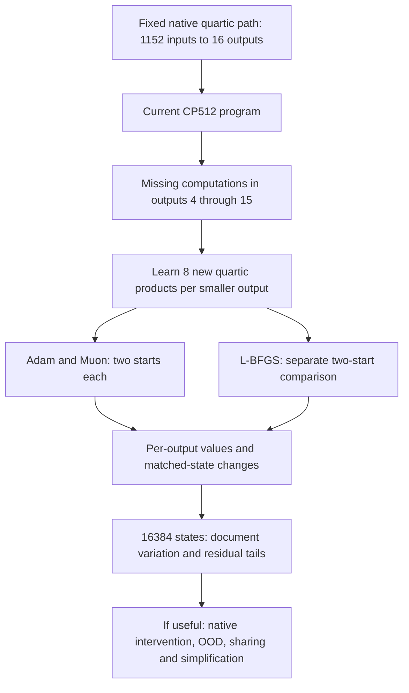

# What the latest experiments tell us about finding simpler circuits

22 September 2026, 05:18 UTC.

**The two-stage plan is unchanged: discover computations from the folded weights, then simplify their arithmetic graph. The latest work shows why a failed decomposition fit can be ambiguous.** It can fail because the chosen features lack needed computations, because the optimizer does not find them, or because the fitting metric rewards the wrong behavior. We now have separate evidence for these possibilities. We have not yet recovered circuits satisfying the full OOD, removal and reuse goal.

## What part of the model are we studying?

The recent optimizer experiments concern one selected path through the last two MLPs in the 18-block model: layers 16 and 17, numbered from zero. At one token position, let x be the 1152-dimensional normalized input to MLP16. Define

$$
m(x)=\lambda_{17,0}D_{16}[(L_{16}x)\odot(R_{16}x)],
\qquad
F_v(x)=w_v^\top D_{17}[(L_{17}m(x))\odot(R_{17}m(x))].
$$

Here L and R are the two input projections, D writes the channel products back to the residual stream, lambda is the native transport coefficient, and w_v is a fixed output reader. We use 16 such readers. Thus each text state supplies 1152 input coordinates and 16 reference output values. These 16 coordinates are selected output directions, not 16 examples, 16 native MLP channels or16 established concepts.

F is degree four because the quadratic MLP16 contribution enters both factors of MLP17. This isolates one algebraic term. It excludes other residual, attention, bias and cross terms. Actual normalization and the final softcap remain explicit in separate model-level checks.

The original full third-order target is a different object: folding the unembedding into a single bilinear MLP gives all vocabulary outputs as quadratic functions of the residual input. The selected 16-output quartic studies do not replace that broader objective.

## What we have learned

| Possible explanation for a bad fit | Evidence | Consequence |
| --- | --- | --- |
| The current feature dictionary misses computations | Even the best final readout fitted to all 16,384 evaluation answers leaves smaller outputs with 26–49% error. | Learn new feature directions; changing readout coefficients alone is insufficient for these dictionaries. |
| The optimizer fails despite sufficient capacity | On five known quartic structures in 1,152 dimensions, tested Adam recovers 2/10 cases below 5% error; scaled L-BFGS recovers 8/10. | Test L-BFGS on the native target before declaring its representation inadequate. |
| A tiny input subspace could simplify learning | It works on planted rank-four examples, but native residual derivatives have only 48–50% capture in 64 learned directions. | Keep the full native input space for the pending experiment. The toy's compact structure does not transfer automatically. |
| A good fitting metric guarantees text fidelity | Earlier Gaussian graph edits and conditional programs can score well while failing text responses or native removal. | Evaluate values, changes between states and actual model interventions separately. |

The L-BFGS result needs care. With the original objective scale, three toy fits stopped immediately because the numerical stopping condition treated the search direction as too small. Rescaling the objective fixed those stops without changing its optimum. The final 8/10 result used 281–311 evaluations; 7/10 succeeded within 251 evaluations. This is promising optimizer evidence, not proof that L-BFGS will recover native circuits or beat every tuned alternative.

The input-subspace result also has limited scope. It measures how residual derivatives are distributed under the calibration-informed Gaussian input model. It does not prove that no small nonlinear circuit exists. A circuit can use broad linear input directions while still having few products or shared intermediates.

## What is running next?

Each new quartic atom multiplies four learned linear forms. There are 96 added atoms, requiring 288 variable multiplications and 442,464 coefficients. This temporarily increases capacity equally across the optimizer comparison. It is a discovery experiment; it does not yet produce a smaller final program. Outputs 0–3 stay fixed, so this experiment cannot repair the earlier coordinate 1 removal failure.

The fitting loss uses exact contractions of the model weights under a Gaussian with calibration-derived mean and covariance. It does not fit text labels, but the covariance makes it data-informed. All candidates will be evaluated, including failed starts. We will inspect absolute errors as well as percentage gains, since improving a 60% error to 50% still leaves a poor component.

The evaluator reports which output coordinates fail, whether errors concentrate in a few states or documents, how much error is systematic bias, and whether changes between matched text states are preserved. The 16,384-state panel has already been inspected, so it is diagnostic evidence rather than fresh OOD confirmation.

A separate queued audit follows coordinate 1 removal through the polynomial numerator, normalization, unembedding and softcap. Its purpose is to locate where approximation errors change. **Neither native experiment has produced a terminal result at this report's timestamp.**

## How this connects back to Tucker, HT and graph sparsity

A narrow Tucker model assumes a small shared feature space. HT additionally organizes tensor slots into a hierarchy. Neither low rank nor sparse core entries automatically identifies a reusable semantic computation. Our final graph may instead use a broad input dictionary, locally simple quadratic forms, and shared intermediates. Count a reused computation once, while charging its linear coefficients and additions as well as its products.

For the full single-layer quadratic tensor, existing spectral bounds require at least 1,088 products for 10% folded coefficient error within products-of-linear-forms programs, versus 4,608 native products. This is a necessary bound, not a constructed solution. It explains why a very narrow fit can fail without excluding a useful sparse, broad-output circuit.

The next native results should tell us whether the tested extra computations recover meaningful missing behavior. Only after that should we spend further effort simplifying and interpreting them.

Sources within this project: [native optimizer protocol](../../direct_tensor_match/NATIVE_LOCAL_LBFGS_PLAN_V1.md), [larger-panel evaluation](../../direct_tensor_match/NATIVE_LOCAL_LBFGS_FOLLOWUP_PLAN_V1.md), [full quadratic bounds](../../direct_tensor_match/FULL_QUADRATIC_PRODUCT_BOUNDS_V1.md), and [fixed-dictionary capacity diagnosis](research_update_2026-09-22_0417_dictionary_capacity.md).
