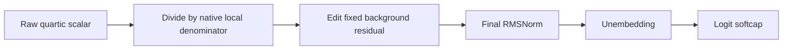

# Why the normalized removal can fail when the scalar looks accurate

22 September 2026, 05:59 UTC.

**All five failing lean-program removal cases have raw scalar error below 10%, but exceed 10% after applying the local normalization denominator.** The raw numerator metric underweights some states that matter more in the installed model. Final RMSNorm and the vocabulary readout change the weighting further. This is a concrete reason to keep normalization explicit when evaluating a folded polynomial.

## Which computation and candidates?

This concerns output coordinate 1 of the selected pure quartic path through MLP16 and MLP17. At each token, the native polynomial produces a scalar along a fixed output reader. We remove a fraction of that scalar along its fixed residual-stream writer, retain the original local normalization denominator and background residual, then apply the model's actual final RMSNorm, unembedding and softcap.

We compare the frozen CP parents and their full/lean conditional rank-256 approximations, two starts each. These are different candidates from the new output-local corrections: those change only coordinates 4–15 and cannot fix this coordinate-1 failure. None of these output coordinates is an established semantic concept.

The evaluation uses 16 FineWeb and 16 Python-standard-library documents, 239 states per document, with 25% and 100% removal, split into newline and other tokens. These are previously inspected documents. Different removal fractions on the same states are not independent examples.

## The five failing lean cases

Each percentage compares the candidate's error with the native reference at that particular interface. These are successive metrics, not additive components of one error budget.

| Seed / domain / removal | Raw scalar | After local denominator | After final RMSNorm | After unembedding | After softcap |
| --- | ---: | ---: | ---: | ---: | ---: |
| 1001 / FineWeb / 25% |8.16%|12.26%|14.91%|13.11%|13.00%|
| 1001 / FineWeb / 100% |8.16%|12.26%|14.66%|13.45%|13.18%|
| 1002 / FineWeb / 25% |7.92%|12.50%|15.43%|14.04%|13.95%|
| 1002 / FineWeb / 100% |7.92%|12.50%|14.76%|13.67%|13.42%|
| 1002 / Python / 25% |9.41%|10.52%|10.73%|11.30%|11.31%|

All five are in the non-newline stratum. The hypothesis that at least four failures already exceed 10% raw-scalar error fails: **zero do**. The separate prediction that every final/scalar error ratio lies between 0.5 and 2 also fails: a parent-program FineWeb newline case has 3.54% raw versus 7.59% final error, a ratio of 2.145. That case remains below the final 10% threshold; amplification and threshold failure are different facts.

## Why dividing both prediction and reference changes relative error

For scalar residual e_i, native scalar t_i and fixed positive denominator d_i, the two pooled errors are

$$
E_{\mathrm{raw}}^2=\frac{\sum_i e_i^2}{\sum_i t_i^2},
\qquad
E_{\mathrm{normalized}}^2=
\frac{\sum_i e_i^2/d_i^2}{\sum_i t_i^2/d_i^2}.
$$

Within one state, dividing both quantities cancels in their relative error. Across states, it changes the weights. States with smaller denominators matter more. Here d is the squared RMS scale because the bilinear layer uses two normalized input factors.

The CPU follow-up exactly replays these two metrics. In the FineWeb failure strata, the lowest-denominator 10% of states account for 46–50% of denominator-weighted residual energy, versus 28% of reference energy. In Python they account for 26% of residual versus 15% of reference energy. The registered hypothesis that this decile explains more than half of residual energy in every cell therefore fails.

Selecting the worst 10% by weighted error instead captures 76–77% of error on FineWeb and 51% on Python. So there is substantial state concentration, particularly on FineWeb, but small denominator alone does not universally isolate the failure. These are descriptive strata, not identified semantic conditions or causal input-variable attribution.

## Separate all-output domain check

Using the same cached inputs, we evaluated all 16 selected polynomial outputs, not just coordinate 1. Parent pooled error is 8.04–8.28% on FineWeb and 5.81–6.38% on Python. Both parents pass the registered aggregate domain-retention criterion. Yet smaller outputs range from 43–69% error on FineWeb and 21–81% on Python, so the criterion requiring every smaller output below 30% fails. The full/lean conditional variants preserve roughly the same pattern; their worst Python component reaches about 82%.

Lower pooled code error is not evidence of uniformly transferable components. Context length is matched across these domains, but differs from the earlier 65-token panel. The 155 FineWeb and 834 Python matched pairs share current token and position across documents; these finite differences are observational diagnostics, not causal interventions. The source documents are opened data, so this is not fresh OOD confirmation.

## What this changes

Raw scalar matching alone does not meet the native-removal objective. A future repair must account for the state-dependent denominator and downstream effect metric while preserving the declared background and writer. Merely tightening a raw numerator score has no demonstrated guarantee here. These measurements do not identify a successful repair or justify another readout-only sweep.

Instrumentation passed: final effects replay prior removal scores within 2.8e-17 absolute; native branch replay is below 4.8e-8 relative; zero edit produces exactly zero effect. All-output CPU labels replay the cached coordinate within 1.05e-6. The GPU capture/audit took about 3 seconds, and the cross-domain CPU evaluation about 5.9 seconds, excluding queue wait.

[Stage measurements](../../direct_tensor_match/REMOVAL_STAGE_GEOMETRY_V1.json) · [Registered stage hypotheses](../../direct_tensor_match/REMOVAL_STAGE_GEOMETRY_PLAN_V1.md) · [Denominator-state diagnosis](../../direct_tensor_match/DENOMINATOR_ERROR_V1.json) · [All-output domain measurements](../../direct_tensor_match/CROSS_DOMAIN_OUTPUTS_V1.json).
