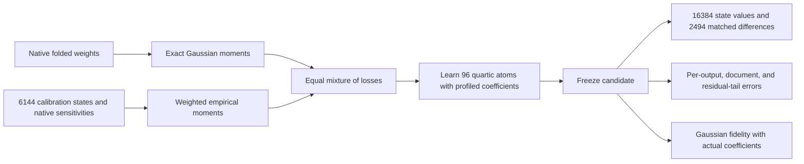

# Sample counts, remaining errors, and the next matched experiment

22 September 2026, 06:17 UTC. The hybrid experiment is queued, not completed. Numerical results below belong to the completed Gaussian-only experiment.

**Sixteen is the number of scalar output coordinates measured at each token position, not the number of examples.** We measure a selected degree-four contribution through MLP16 and MLP17, projected onto 16 fixed directions. Each input is a 1,152-dimensional normalized MLP16 state. Attention, other residual contributions, biases, and cross terms are outside this polynomial. These directions are not established semantic concepts.

Calibration uses 6,144 states from 96 documents; original evaluation uses 2,048 states from 32 documents. The larger panel has 16,384 states from 256 documents, each with 16 scalar targets. Positions within a document are correlated. This larger panel has already informed research decisions; it is not untouched OOD confirmation.

**The small pooled error conceals inaccurate components.** For Gaussian Adam seed 25001, pooled relative RMS error is 7.31%, while outputs 4–15 individually have 38.7–63.3% error. Their median document error is about 52% and the 90th percentile about 67%. The worst 1% of states carry 21% of squared residual, and the worst 10% carry 50%. Thus a tail exists, but errors are also widespread. Outputs 0–2 have 6.0–8.4% error; output 3 has 21.6% error.

Define the residual and per-output relative error as

$$
e_g(x)=\widehat F_g(x)-F_g(x),\qquad
\epsilon_g=\sqrt{\frac{\sum_n e_g(x_n)^2}{\sum_n F_g(x_n)^2}}.
$$

Pooled error sums numerator and denominator across outputs before taking their ratio, so high-energy outputs dominate. The small-output summary is the RMS of twelve separate relative errors. Neither quantity is the fraction of tokens predicted incorrectly. Attribution to input variables or semantic conditions remains unresolved; output-coordinate errors do not establish that attribution.

Scoring four candidates and their distributions on the cached larger panel took about 1.5 seconds. That excludes collecting states and native targets by running the original transformer. More cached evaluation is cheap; independent documents and contexts are more informative than repeatedly inspecting the same data.

**The queued experiment changes the fitting metric while holding capacity and optimization budget fixed.** Gaussian-only feature learning made modest gains; an earlier empirical sensitivity-only learner overfit. We now combine half exact Gaussian weight-matching loss with half empirical calibration loss, weighted by native logit sensitivity. These weights include normalization effects at the original model background. They define a tangent approximation, not exact finite-removal fidelity.

The CP512 parent stays fixed. Each of outputs 4–15 gets eight new products of four learned linear forms. Outputs 0–3 remain identical. Two Adam starts use learning rate 0.1 and 250 updates, matching the Gaussian baseline's seeds, initialization method, and capacity. The correction adds 288 scalar multiplications and 442,464 stored coefficients: discovery capacity, not a demonstrated smaller final circuit.

The primary registered prediction requires both starts to improve larger-panel small-output value and matched-difference errors by at least 15% relative to their corresponding Gaussian-only fits. The secondary requires retaining at least 90% of those fits' unregularized Gaussian explained residual energy. Gaussian fidelity uses actual exported coefficients, without refitting them to that metric. Favorable pooled error cannot replace component recovery.

All 15 planted moment/gradient checks and the native-shaped gradient/export smoke test pass. Calibration alignment passes after accounting for different hash conventions: state caches include 65 tokens per document; sensitivity caches hash 64 input tokens. A dry-run import-name error was fixed before enqueue. No native hybrid result exists yet.

Selective removal, sufficiency, reuse, stable identification, fresh OOD behavior, and literal simplicity remain required. This selected quartic experiment does not replace the full third-order tensor objective.

[Completed Gaussian results](research_update_2026-09-22_0555_native_residual_learning.md) · [Error distributions](../../direct_tensor_match/LOCAL_QUARTIC_FOLLOWUP_V1.json) · [Hybrid protocol](../../direct_tensor_match/HYBRID_LOCAL_QUARTIC_PLAN_V1.md) · [Frozen inputs and checks](../../direct_tensor_match/HYBRID_LOCAL_QUARTIC_NATIVE_INPUTS_V1.json).
