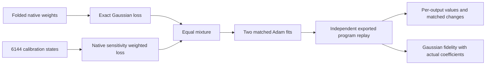

# Adding native sensitivity helps text fit, but does not recover the missing circuit

22 September 2026, 08:22 UTC.

**The hybrid experiment finished. It improves the weaker output components on text, but misses the registered improvement target and sacrifices substantial Gaussian fidelity.** Both starts show the same tradeoff. The independent exported-program replay passes. This is a valid negative result against the specified combined objective, with a useful partial improvement; it is not a recovered or adopted circuit.

## What part of the model did we approximate?

The model has18 blocks, residual width1152 and bilinear MLP width4608. We take the actual normalized state entering MLP16, compute its bias-free bilinear contribution, pass that contribution into both input factors of MLP17, and observe the resulting pure degree-four term in16 fixed output directions.

Those16 directions are scalar measurements of **one selected model contribution** at every token-position state. They are not16 datapoints,16 native neurons, or16 established semantic concepts. Other residual paths, attention, biases and mixed terms remain outside the selected polynomial. Normalization and final logit softcapping are explicit native operations, not replaced by this quartic fit.

The fixed CP512 baseline already approximates this target. The new correction adds eight quartic atoms to each of outputs4–15:

$$
\widehat F_g(x)=F_g^{\rm parent}(x)+\sum_{k=1}^{8}c_{gk}\prod_{s=1}^{4}(a_{gks}^{\top}x),\qquad g=4,\ldots,15.
$$

Outputs0–3 remain unchanged. Each atom multiplies four learned linear features. The correction adds288 variable multiplications and442,464 coefficients. It has the same capacity as the matched Gaussian-only correction, but is larger than the parent alone.

## What changed in fitting?

The Gaussian-only baseline matches the polynomial using exact Gaussian moment contractions of the folded weights. The hybrid objective uses equal parts of that loss and calibration text error weighted by native logit sensitivity. Sensitivity includes local normalization effects, but describes infinitesimal changes at the native background; it is not a guarantee for finite removal.

Both hybrid starts use Adam, learning rate0.1,250 updates,96 atoms and the same seeds as their Gaussian comparisons. The linear readout is solved analytically during fitting; input directions are learned. Selection uses calibration loss only. Fitting uses6,144 states from96 documents. Larger evaluation uses16,384 states from256 documents and2,494 matched token/position state pairs. These are already-opened research panels, not untouched OOD confirmation.

## Results and failed predictions

Each smaller-output score is the RMS of twelve per-output relative RMS errors. This prevents large outputs from dominating the comparison. Matched-response error measures differences between paired states; it is not a causal intervention test.

| Seed | Gaussian value error | Hybrid value error | Gaussian response error | Hybrid response error | Gaussian explained residual energy retained |
| --- | ---: | ---: | ---: | ---: | ---: |
|25001|52.59%|46.69%|54.08%|49.17%|54.88%|
|25002|52.54%|46.55%|54.13%|48.80%|55.59%|

The registered component target required **at least15% relative improvement in both values and responses, in both starts**. Actual value improvements are11.23%/11.39%, and response improvements9.09%/9.85%: **fail**. The separate requirement to retain at least90% of the Gaussian baseline's explained residual energy also **fails**. Retention here is the correction's reduction in Gaussian residual squared error relative to the fixed parent, divided by that reduction for its matched Gaussian correction. It is not the fraction of total native function energy preserved.

The pooled all-output error is about7.19%, but individual smaller-output errors remain about37–56%. Pooled error still conceals component failures. The worst1% of states now contain12.8–13.5% of smaller-output squared residual; the worst10% contain43.3–43.6%. The previous Gaussian seed25001 had roughly21% and50%, respectively. The tail improves, but substantial error remains spread through the panel.

Numerical integrity passes: export drift is below4e-7, and an independent CPU evaluator reproduces all16 value and response errors within1.2e-16. Protected outputs0–3 are exactly unchanged. GPU execution took237.8seconds. These checks reduce the likelihood that the negative result is an export/accounting bug; they do not prove convergence to the best possible feature directions or rule out other circuit structures.

## What this changes

The choice of fitting metric matters. The earlier feature-space metric audit showed sensitivity weighting can substantially change the value assigned to a computation. The hybrid result demonstrates a real text-versus-Gaussian tradeoff; it does not deliver the hoped-for improvement while preserving Gaussian fidelity.

We will not relabel the failed thresholds or select a new mixture using this evaluation panel. A registered CPU follow-up now compares the **functions and feature spans learned by the two starts**, accounting for changes of basis and scale. Similar error does not imply the same discovered computation.

That follow-up also fails its two scientific predictions. For each output, we compare the two eight-feature spaces by their canonical correlations: these measure whether combinations in one space can be reconstructed from combinations in the other. Every output has at least one poorly matched direction. The smallest correlation across outputs is about0.00003 under the Gaussian metric and0.00070 on text, versus the required0.9. This does not mean the spaces have no overlap; it means they are not the same eight-dimensional dictionary.

The aggregate correction functions are more similar: their cosines range0.44–0.80 under the Gaussian metric and0.70–0.93 on text. Only two of twelve text outputs exceed0.9; none do under the Gaussian metric. The requirement that every output pass in both metrics fails. No coefficients were refitted, all twelve outputs were included, and the identical-dictionary numerical control passes.

These are unstable candidate dictionaries rather than identified reusable circuit components. A common smaller subspace or another circuit representation is still possible, but the present results do not establish it. The graph stage should not merge features merely because two fits have similar aggregate error. The next direction should change the representation or source/context geometry, while keeping full-output coverage and literal arithmetic cost explicit, rather than repeat a minor mixture or optimizer sweep.

The full third-order tensor route remains part of the objective. This selected quartic experiment does not replace it, and neither output1's known finite-removal failure nor general OOD/selectivity/reuse is fixed here.

[Primary result](../../direct_tensor_match/HYBRID_LOCAL_QUARTIC_NATIVE_V1.json) · [Independent export audit](../../direct_tensor_match/HYBRID_EXPORT_AUDIT_V1.json) · [Registered protocol](../../direct_tensor_match/HYBRID_LOCAL_QUARTIC_PLAN_V1.md) · [Stability protocol](../../direct_tensor_match/HYBRID_FEATURE_STABILITY_PLAN_V1.md) · [Stability results](../../direct_tensor_match/HYBRID_FEATURE_STABILITY_V1.json) · [Metric review](../../THREE_HOURLY_MATHEMATICAL_REVIEW_2026-09-22_0808.md).
