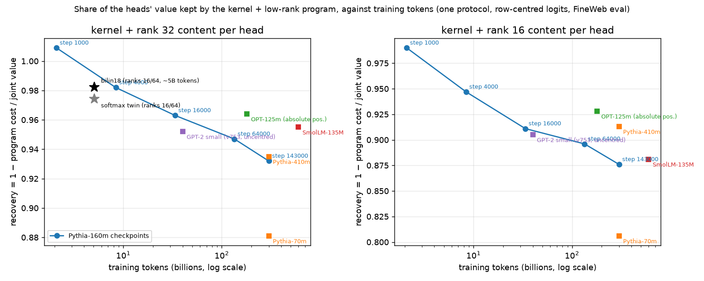

# Why are the bilinear models' attention heads so compressible? A multi-model ladder (22 September 2026)

**What you asked (22 Sep).** "Do try a few sets of pythia models, and then other models to continue to test the specific hypothesis of why we're seeing what we're seeing." The thing to explain: on bilin18 and its softmax twin, replacing every head's read-side (its query/key match) by a per-offset kernel plus a rank-16/64 content term keeps ~98% of what the heads are worth, while on GPT-2 small the same program at rank 32 keeps 95% and at rank 16 only 90%. Candidates: (H1) GPT-2's learned absolute positions vs bilin18's rotary; (H2) model size; (H3) training length; (H4) something about the bilinear/QK-normed architecture itself.

**Short answer.** Within one architecture (Pythia-160m, five checkpoints of the same run), compressibility falls steadily with training tokens: recovery at rank 32 goes 1.009 → 0.982 → 0.963 → 0.947 → 0.932 from 2B to 300B tokens. bilin18 was trained for roughly 5B tokens, and it lands almost exactly on that curve (0.982 at ~5B; the Pythia checkpoint at 8B is 0.982). So the most economical explanation of "why we see what we see" is **H3: the bilinear models are short-trained, and short-trained heads have simple read-sides.** Absolute positions (H1) are not the obstacle — OPT-125m, with learned absolute positions, is *more* compressible (0.964) than Pythia-160m with rotary (0.932) — and size (H2) is flat between 160m and 410m at the same token count (0.932 vs 0.935). There remain family-level shifts of a few hundredths that training length does not explain (OPT and SmolLM sit above the Pythia curve at their token counts); H4 cannot be separated from H3 with the models available, and I say below what would separate them.

**Update, 16:20 UTC (v788 landed) — the QK-normed long-trained control does NOT follow the training-length curve.** Qwen3-0.6B (per-head QK-norm over the head dimension, exactly bilin18's arrangement; rotary; 128-dim heads; ~36T tokens) recovers **0.966 at rank 32 of 128 and 0.933 at rank 16**. That is the softmax twin's curve (0.965 at 24 of 128, 0.949 at 16), not Pythia's (0.932 at rank 32 of 64 after 300B tokens). The preregistered predictions that a 7000×-longer-trained model would be expensive (rank 32 < 0.96, rank 16 < 0.93) both failed as written. So training length explains the Pythia checkpoints but not the bilinear models: the one thing Qwen3 shares with bilin18 and its twin and with none of Pythia, GPT-2, OPT or SmolLM is per-head QK-norm. The pair control that separates "QK-norm" from "the Qwen recipe" — Qwen2.5-0.5B, same family and data lineage, ~18T tokens, no QK-norm, 64-dim heads, tokenises these rows identically — is queued as v791 (preregistered: rank 32 of 64 < 0.945, rank 16 < 0.93 under the QK-norm story).

## The protocol (one protocol for every model)

Identical to the softmax-replication note, with one fix that the Pythia models forced.

- **Value of a head** = CE added when its output is replaced by its mean over 480 FineWeb rows; **joint value** = all heads mean-ablated at once; **recovery** of a program = 1 − (program's CE cost) / joint value.
- **Program per head**, applied to the pre-softmax logits: off-diagonal logit(i, j) := κ_h(i−j) + [P_r(i, j) − κ_r(i−j)], κ_h a per-offset kernel, P_r the head's own logit from rank-r factored query/key maps. Kernels and factors fitted jointly by Adam (300 steps), early-stopped on a validation split, snapshotted at the validation minimum; costs measured on 192 held-out rows; then the 24 most valuable heads are mean-ablated inside the program to check the program preserves what each head is worth (Spearman / median ratio).
- **The fix: row-centring.** Softmax does not see a constant added to a whole query row, but Pythia's raw logits carry row constants of 10⁴–10⁵ (the "massive activation" tokens). Estimating per-offset kernels on raw logits mixes those constants in, and the program collapsed (Pythia-160m recovery 0.64). Every kernel is now estimated on row-centred logits (mean over keys 1 ≤ j < i subtracted) and the program adds each row's native mean back; the first-token ("sink") column and the diagonal stay native. With centring Pythia-160m goes to 0.932. bilin18 has no softmax, so this was never an issue there; on GPT-2 it changes little and in the other direction (0.952 uncentred, 0.945 centred at rank 32; 0.905 vs 0.893 at rank 16) — GPT-2's row constants are small, and the uncentred per-offset mean is the slightly better kernel there. The ladder's conclusions do not depend on which GPT-2 number is used.
- **Same text everywhere**: the same FineWeb rows, decoded from the GPT-2 tokenisation and re-tokenised per model (512-token rows). Evaluation CE is in each model's own tokens, so absolute CEs are not comparable across tokenisers; recoveries are.

## The numbers

| model | positions | tokens trained | native CE | joint value | rank 32: cost / recovery | rank 16: cost / recovery | values preserved (Spearman / median ratio, top 24) | kernel-matrix energy in top-4 shapes |
|---|---|---|---|---|---|---|---|---|
| Pythia-160m step 1000 | rotary (¼ dims) | 2.1B | 4.646 | 2.041 | −0.019 / **1.009** | +0.021 / 0.990 | 0.97 / 0.96 | 0.975 |
| Pythia-160m step 4000 | rotary | 8.4B | 3.794 | 2.898 | +0.053 / **0.982** | +0.152 / 0.947 | 0.86 / 0.98 | 0.960 |
| Pythia-160m step 16000 | rotary | 34B | 3.549 | 3.164 | +0.118 / **0.963** | +0.281 / 0.911 | 0.85 / 1.02 | 0.961 |
| Pythia-160m step 64000 | rotary | 134B | 3.447 | 3.245 | +0.172 / **0.947** | +0.336 / 0.896 | 0.77 / 1.09 | 0.947 |
| Pythia-160m final | rotary | 300B | 3.473 | 3.118 | +0.213 / **0.932** | +0.388 / 0.876 | 0.69 / 0.96 | 0.974 |
| Pythia-1b final (v773, preregistered) | rotary (head dim 256) | 300B | 2.947 | 3.683 | +0.265 / **0.928** | +0.358 / 0.903 | 0.70 / 1.13 | 0.977 |
| Pythia-1b step 4000 (v774, preregistered) | rotary (head dim 256) | 8.4B | 3.488 | 3.380 | +0.105 / **0.969** | +0.191 / 0.944 | 0.82 / 0.98 | 0.973 |
| Pythia-70m final | rotary | 300B | 3.869 | 2.673 | +0.319 / 0.881 | +0.518 / 0.806 | 0.94 / 1.10 | 0.982 |
| Pythia-70m step 4000 (v772, preregistered) | rotary | 8.4B | 4.062 | 2.771 | +0.059 / **0.979** | +0.169 / 0.939 | 0.89 / 0.99 | 0.969 |
| Pythia-160m-deduped final (v771, preregistered) | rotary | 300B (deduped Pile, ~1.5 epochs) | 3.429 | 3.169 | +0.221 / **0.930** | +0.424 / 0.866 | 0.88 / 1.06 | 0.983 |
| Pythia-410m final | rotary | 300B | 3.098 | 3.526 | +0.227 / 0.935 | +0.308 / 0.913 | 0.83 / 1.05 | 0.951 |
| Pythia-410m step 4000 (v770, preregistered) | rotary | 8.4B | 3.633 | 3.119 | +0.020 / **0.994** | +0.090 / 0.971 | 0.92 / 0.98 | 0.964 |
| OPT-125m | learned absolute | 180B | 3.435 | 3.215 | +0.116 / **0.964** | +0.233 / 0.928 | 0.66 / 1.07 | 0.992 |
| SmolLM-135M (v764) | rotary (full dims), GQA | 600B | 3.212 | 3.174 | +0.141 / **0.955** | +0.376 / 0.881 | 0.83 / 1.10 | 0.860 |
| GPT-2 small (v753 uncentred; v765 centred) | learned absolute | ~40B? (WebText, epochs unknown) | 3.398 | 3.345 | +0.160 / 0.952; centred +0.186 / 0.945 | +0.322 / 0.905; centred +0.357 / 0.893 | 0.54 / 0.85; centred 0.50 / 0.99 | 0.9996 |
| **bilin18** | rotary, QK-norm, squared attn | ~5B (9726 modded-nanogpt steps) | 3.132 | 3.996 | mixed ranks 16/64: +0.072 / **0.982** | — | 0.84 / 1.08 | 0.964 |
| **softmax twin** | rotary, QK-norm, softmax | ~5B | 3.114 | 3.388 | mixed ranks 16/64: +0.088 / **0.974** | — | 0.71 / 1.04 | 0.974 |
| **Qwen3-0.6B** (v788, preregistered; 128-dim heads, GQA 16/8) | rotary, per-head QK-norm, softmax | ~36T | 3.462 | 4.801 | +0.163 / **0.966** | +0.320 / 0.933 | 0.86 / 0.90 | 0.729 |

Data: 64 fit rows (kernels), 96 validation rows, 192 evaluation rows of 512 tokens; head values from 480 rows. Pythia's per-step token count is 2,097,152 (batch 1024 × 2048).

## What each comparison says

**Training length (H3) — supported, and it is the only factor with a clean monotone effect.** Same model, same data order, five checkpoints: recovery drops at every step, at both ranks, and the drop is roughly linear in log(tokens) (≈ −0.035 per decade at rank 32, −0.055 at rank 16). The kernel-only cost tells the same story from the other side: at step 1000 the kernels alone (no content) already recover 40% of the joint value; by the end they recover 21%. Early heads are mostly positional; content reads grow, and grow in rank, with training. The values-preserved column also degrades (Spearman 0.97 → 0.69): late in training the program not only costs more, it re-orders which heads matter.

Why the bilinear models look like the step-4000 checkpoint: 9726 modded-nanogpt steps at the default 0.5M-token batch is ≈5B tokens — between Pythia's step 1000 (2B) and step 4000 (8B). Their recoveries (0.982 / 0.974, at mixed ranks that average below 32) sit where the Pythia curve predicts. I do not think this is a coincidence.

**Data (not tokens)? — no.** Pythia-160m-deduped (same architecture, same 300B token count, deduplicated Pile seen ~1.5 times) lands at 0.930 / 0.866 against the standard model's 0.932 / 0.876 (preregistered as < 0.95 / < 0.90 — passed). What was seen does not matter here; how long it was seen for does.

**Absolute positions (H1) — falsified as the explanation of GPT-2.** OPT-125m has learned absolute positions and no rotary, and is the most compressible of the long-trained models (0.964). Pythia-160m has rotary and is the least (0.932). GPT-2 small's 0.952 is in between. Whatever makes GPT-2 harder than bilin18, it is not that positions are absolute.

**Size (H2) — flat from 160m to 1b at 300B tokens; 70m is an outlier the other way.** At 300B tokens, 160m → 410m moves recovery 0.932 → 0.935 (rank 32) and 0.876 → 0.913 (rank 16; the bigger model's heads have more headroom for rank 16 to be enough). Pythia-70m is *less* compressible (0.881): with only 6 layers × 8 heads, each head carries more, and its per-head content is denser. So size does not rescue the bilinear models' number — a 160m Pythia trained as long as they were would be just as simple. At step 4000 the 410m model is at 0.994 / 0.971 (preregistered ≥0.96 / ≥0.92 — passed), so the descent with tokens is the same at 2.5× the size; if anything the bigger model starts simpler at rank 16 (0.971 vs 160m's 0.947) and ends simpler (0.913 vs 0.876), a small size effect in the *opposite* direction to what would be needed to explain the bilinear models. Pythia-1b at step 4000 (head dim 256, 6× the 160m size) is at 0.969 / 0.944 (preregistered ≥0.96 / ≥0.92 — passed), a little below the 160m/410m step-4000 points; a rank-32 content term is a smaller fraction of a 256-dim head than of a 64-dim one, so some drop with head width is expected. The 1b final checkpoint is at 0.928 / 0.903 (preregistered < 0.95 / < 0.92 — passed): the same 300B-token floor as 160m (0.932) and 410m (0.935), at 6× the size. Size does not buy compressibility at any scale from 70m to 1b. And the 70m outlier is a late-training effect, not a size effect: at step 4000 Pythia-70m is on the curve (0.979 / 0.939, preregistered as ≥0.96 / ≥0.92 — passed). One more thing the table shows: it is tokens, not the loss reached. Pythia-70m final (CE 3.87, 300B tokens) and Pythia-160m at step 4000 (CE 3.79, 8B tokens) are at nearly the same loss, and their recoveries are 0.881 and 0.982.

**Family-level shifts — real, unexplained, small.** At matched tokens OPT-125m (180B) sits ~0.02 above the Pythia curve and SmolLM (600B) ~0.03 above it. Two things I can see in the data: OPT is strongly sink-anchored (kernels-only costs +5.05 with the sink column also replaced, +1.62 with it kept native — the first-token column carries most of the read-side work, and the program keeps it native), and SmolLM has one head (9.3) worth 1.03 nats on its own, a third of the joint value, which the program preserves at rank 32. Both features make a model *look* more compressible under this program, because the parts that carry the load are the parts the program does not touch. I would not read those shifts as architecture-level simplicity.

**Architecture (H4) — cannot be separated from H3 with these models.** The bilinear models differ from Pythia in four ways at once (QK-norm, bilinear MLPs, squared/softmax attention, ~5B tokens on FineWeb). Before v788 the token count alone predicted their recovery to within the noise between checkpoints. **v788 separates them: Qwen3-0.6B, a QK-normed rotary softmax model trained ~36T tokens, is as cheap as the twin (0.966 at rank 32 of 128; 0.933 at 16), where H3 predicted Pythia-like 0.93 or worse.** Two more facts from that run: its kernel matrix is not four-shaped (top-4 energy 0.729, preregistered ≥ 0.90 failed) and it is the most sink-anchored model in the ladder (kernels-only costs +7.47 with the sink column replaced, +2.41 with it native), so its cheapness is not "positional heads"; its 336 heads' values are very concentrated (2.6: 3.32 nats, 1.5: 3.03, 0.3: 1.93 of a 4.80 joint), and the rank-32 program preserves them (Spearman 0.86, median ratio 0.90). What Qwen3 shares with bilin18 and the twin, and with none of the expensive models, is per-head QK-norm — which bounds every query and key to the same sphere, so a head's logit is a cosine and cannot lean on a few large-norm directions. Whether that, or the Qwen family's recipe, is the cause is what the queued pair (v791, Qwen2.5-0.5B: no QK-norm, otherwise the same lineage) decides.

## Two things to keep in mind

- **Evaluation is in-distribution for the bilinear models** (trained on FineWeb, evaluated on FineWeb) and out-of-distribution for the others (Pile, WebText, SmolLM-corpus). That could inflate the bilinear recoveries a little, but it cannot produce the Pythia checkpoint curve, which is the evidence for H3.
- **Every number is recovery relative to a mean-ablation value on 192 rows.** Joint values differ (2.0 to 4.0 nats), so a 0.03 difference in recovery is 0.06–0.12 nats. The Pythia checkpoint steps are 0.02–0.03 apart in recovery and monotone in both ranks, which is well above the run-to-run variation I have seen (±0.005 between re-fits of the same model).

## Two follow-ups on the mechanism (later on 22 Sep)

**It is not the shape of any one head's spectrum (v775).** I measured, for every head in all 17 models, how many directions its query-key form really uses: the participation ratio of the singular values of W_Q^T W_K, both raw and weighted by the covariance of the head's input. Raw, every model is nearly full rank (median PR 50–59 of 64). Input-weighted, every model is ~8–12 of 64 (Pythia-1b, with 256-dim heads, ~25) — the low rank the programs exploit lives in the activations, not the weights, and it is the same across the ladder: bilin18 7.7, GPT-2 8.7, Pythia-160m 9.2, OPT 8.8, SmolLM 6.2. The median PR does not move monotonically along the Pythia-160m training curve (8.1, 8.5, 9.1, 11.7, 9.2) and does not predict recovery across models (Spearman −0.13). Preregistered: 1 of 5 (the bilin18 ≤ step-4000 comparison), the rest failed as written. So whatever changes with training is not "the typical head reads more directions".

**The descent is diffuse and sits partly in heads that mean ablation says are worthless (v776).** Taking the fitted rank-32 programs for Pythia-160m at step 1000 and at the end, and applying them one head at a time: at step 1000 no head's program costs anything (sum over heads −0.06; every head at or below native). At the end the per-head costs sum to +0.25 (the joint program costs +0.21, so they are nearly additive) but they are spread thin: half the total needs 23 heads; 46 heads cost more than 0.002; the largest is head 1.10 at +0.024. And 0.108 of the 0.253 comes from the 83 heads whose mean-ablation value is under 0.01 — heads that are individually redundant but whose read-side the program still gets wrong in a way that costs. Cost tracks value only weakly (Spearman 0.45). Layers 0–1 carry the most (+0.084). Preregistered 3 of 5 (the "few heads" and "cost tracks value" bars failed as written — which is the finding).

What I take from the pair: as training proceeds, many heads each pick up a little content-dependence the kernel + rank-32 program misses, including heads that barely matter on their own; nothing about the typical head's spectrum changes.

**Part of that is the fit, but per-head optimality does not compose (v777 5/5, v780 2/5).** Fitting the six costliest heads one at a time (all others native), the same rank-32 program costs 60% less than the joint fit gave it: summed +0.062 → +0.024; head 1.10 goes from +0.024 to +0.003 (below its 0.006 value); at full rank (64, the content term exact) every head is at zero, and rank 8 is worse than rank 32 for all six. So the joint 300-step fit of 144 heads under-fits the late-training model, and **the ladder's late-training recoveries are lower bounds set partly by optimisation**. This does not undo the checkpoint curve — the early checkpoints reach ~1.0 under the *same* fit budget, so the model got harder to fit as it trained — but it means the gap between 0.93 and 0.98 is not all "content the class cannot express". A 4×-longer joint fit (v778, preregistered 3/5) settles what kind of limit it is: more steps do **not** help — the validation minimum arrives at step 200 and held-out cost climbs from +0.226 to +0.565 by step 1200, ending at recovery 0.928, no better than the 300-step 0.932. So the joint fit is not step-starved, it is gradient-starved per head: 144 heads share 8 rows per step, and a head worth 0.006 gets almost no signal, while one head at a time with the same budget converges. Quadrupling the tokens per step (v779, preregistered 3/5) barely moves it either: recovery 0.935 against 0.932, minimum at step 100, overfitting after. Neither more steps nor more data per step fixes the joint fit, while fitting one head at a time does — so it is the sharing of one objective across 144 heads that starves the small contributors, not the budget. And the decisive rung says the picture is not "the fit is just too weak": refitting **all 144** heads one at a time (v780, warm-started from the joint snapshot) improved every head in isolation — the isolated costs fall from +0.253 to +0.168, 40 heads better, none worse — yet applying the refined programs **together** is worse than the jointly fitted ones they came from: +0.213 → +0.266, recovery 0.932 → 0.915. The heads' program errors are not independent; the joint fit finds a mutually compensating solution that per-head optimality destroys. So the joint number is not simply a floor set by weak optimisation — it is the best available *coordinated* answer, and the per-head gains are real but unusable on their own. A short joint polish from the refined programs (v781, 4/5) settles it: it converges straight back to +0.2129, against +0.2140 for the same polish started from the joint programs — the same point from both starts. So **~0.93 at rank 32 is what this program class can do on a 300B-token model**, not a floor set by weak optimisation: four different fitting regimes (300 steps, 1200 steps, 4× batch, per-head + polish) all land between 0.915 and 0.935. The remaining question is rank, not optimisation, and v782 (preregistered 2/5) prices it: on the final checkpoint recovery goes 0.932 (rank 32) → 0.947 (rank 40) → 0.955 (rank 48) of a 64-dimensional head. Both bars (0.95 at rank 40, 0.96 at rank 48) failed as written, which is the point — **a 300B-token model needs most of its read-side directions**. At rank 48 the program stores 11.6M numbers against the heads' native 14.2M: a 1.2× saving, where bilin18 at 0.982 saves 3.7×. (Caveat: both v782 arms took their validation minimum at the last step, so the higher-rank fits had not plateaued; they are lower bounds by a little.) The same ladder at the early checkpoint (v783, preregistered 5/5) gives the other end: at 8.4B tokens the same model reaches **0.960 at rank 20** and **0.970 at rank 24**, storing 4.9M and 5.8M numbers against the same 14.2M native.

| | rank for ≈0.95–0.96 recovery | share of the 64-dim head | numbers stored vs native |
|---|---|---|---|
| Pythia-160m at 8.4B tokens | 20 | 31% | 4.9M / 14.2M (2.9×) |
| GPT-2 small at ~40B tokens | ~34 (40 → 0.961, 48 → 0.972) | ~53% | 9.7M / 14.2M (1.5×) |
| Pythia-160m at 300B tokens | ~44 (48 → 0.955) | ~70% | 11.6M / 14.2M (1.2×) |
| Pythia-1b at 300B tokens (256-dim heads) | 64 → 0.950 (96 → 0.966) | 25% | 37.8M / 134.2M (3.5×) |
| Qwen3-0.6B at ~36T tokens (128-dim heads, per-head QK-norm) | 32 → 0.966 (16 → 0.933) | 25% (12.5%) | 33.3M / 117.4M (3.5×); 16.7M (7.0×) |
| softmax twin (bilinear family) at ~5B tokens | 16 of 128 → 0.949 (24 → 0.965) | 12.5% (19%) | 6.7M / 47.8M (7.1×); 10.0M (4.8×) |

That is the ladder's finding without any CE in it: **training multiplies the read-side rank a head needs by about 2.3×**, and turns a 3× compression into a 1.2× one. The bilinear models' 0.974–0.982 were measured at mixed ranks (16 for cheap heads, 64 for valuable ones) on a 128-dim head, so they are not yet on this axis; v784 places it: at **uniform rank 24 of its 128-dimensional head — 19%** — the twin recovers **0.965**, storing 10.0M numbers against its heads' native 47.8M, a 4.8× saving (values preserved at Spearman 0.82, median ratio 1.03). So on the same axis the bilinear family at ~5B tokens is comparable in *share of head dimension* to Pythia at 8.4B tokens (31% for 0.96), and far away from the same architecture trained to 300B (70%). At rank 16 — 12.5% of its head, and a *smaller absolute rank* than either Pythia point despite twice the head width — it still recovers 0.949 with a 7.1× saving (v785, 5/5). GPT-2 small is now measured too (v786, 5/5: rank 40 → 0.961, rank 48 → 0.972), and it lands where its token count says it should — between the two Pythia points. So on absolute rank the ordering is twin 16 < Pythia-early 20 < GPT-2 ~34 < Pythia-late ~46, monotone in training tokens across three different architectures. The head-width caveat is now measured rather than guessed (v787, 4/5). Pythia-1b — same family, same 300B tokens, but 256-dim heads — reaches 0.950 at rank 64, i.e. **25%** of its head width where the 64-dim 160m needed ~70%. So neither measure is width-invariant: going from 64-dim to 256-dim heads at fixed training, the *absolute* rank needed rises (46 → 64) while the *fraction* falls (70% → 25%). The twin still wins on both against both Pythia points (16 < 46 and 16 < 64; 12.5% < 70% and < 25%), so the ordering survives, but "share of the head" is not a clean axis on its own and I would not quote it without the width alongside.

## What the ladder does not change

The results Logan asked about earlier still stand: the four-shape kernel dictionary is a rotation-invariant fact about the kernel *matrix* (its rank-4 energy), not a claim that particular shapes are canonical; the compression comes from the low-rank content term, with the kernels 83k of the program's 25.9M numbers; and the softmax twin replicates bilin18, so squared attention is not what makes the heads simple. This note's first answer — the bilinear models are simple because they are early in training — held for every model until v788; Qwen3 shows a long-trained QK-normed model is just as simple, so the answer is now: early training *or* per-head QK-norm, and v791 decides which.

## Runs

v755/v756 (uncentred Pythia-160m/70m, kept as controls), v760–v762 (Pythia 160m/70m/410m, centred), v766–v769 (Pythia-160m steps 4000/1000/16000/64000), v763 (OPT-125m), v764 (SmolLM-135M; re-run with a corrected bar: preregistered top-4 energy ≥0.90 and ≥0.96 / ≥0.92 recoveries FAILED as written — 0.860, 0.955 / 0.881), v771 (Pythia-160m-deduped, 5/5 preregistered), v772 (Pythia-70m step 4000, 5/5 preregistered), v770 (Pythia-410m step 4000, 5/5 preregistered), v774 (Pythia-1b step 4000, 5/5 preregistered), v773 (Pythia-1b final, 5/5 preregistered), v775 (QK spectrum census, 1/5), v776 (per-head isolated program costs, 3/5), v777 (isolated fits, 5/5), v778 (long joint fit, 3/5), v779 (4× batch, 3/5), v780 (sequential refit, 2/5), v781 (joint polish, 4/5), v782 (rank 40/48, 2/5), v783 (early-checkpoint rank ladder, 5/5), v784 (twin at uniform rank 24, 5/5), v785 (uniform rank 16, 5/5), v786 (GPT-2 rank 40/48, 5/5), v787 (Pythia-1b head-width control, 4/5), v788 (Qwen3-0.6B, 2/5: preregistered rank-32 < 0.96, rank-16 < 0.93 and top-4 kernel energy ≥ 0.90 all FAILED as written — 0.966 / 0.933 / 0.729; replay and value-preservation passed), v791 (Qwen2.5-0.5B, the no-QK-norm pair, queued), v765 (GPT-2 centred; landed after a rotary-branch crash was fixed: preregistered ≥0.96 / ≥0.92 recoveries FAILED as written, 0.945 / 0.893). Results in `basis_aligned/bilinear_quotient/circuits/followups/{pythia*,opt125m,smollm135m,gpt2_*}_v7xx_result.json`; scripts `ops/run_pythia_all_v76x.py`, `ops/run_hf_all_v763/4.py`, `ops/run_gpt2_all_v765.py`, backends `ops/{pythia,hf,gpt2}_backend.py`.
