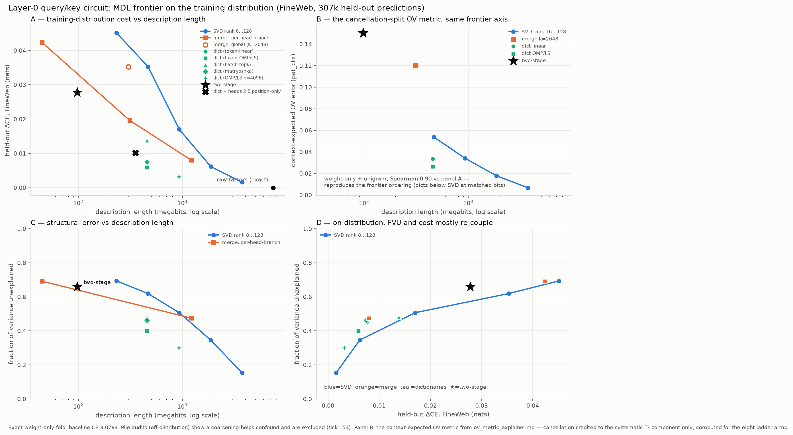
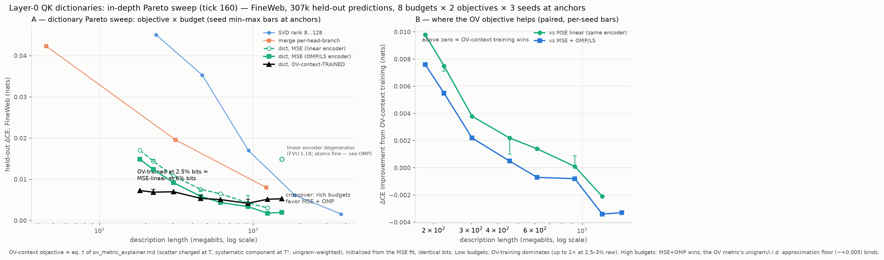
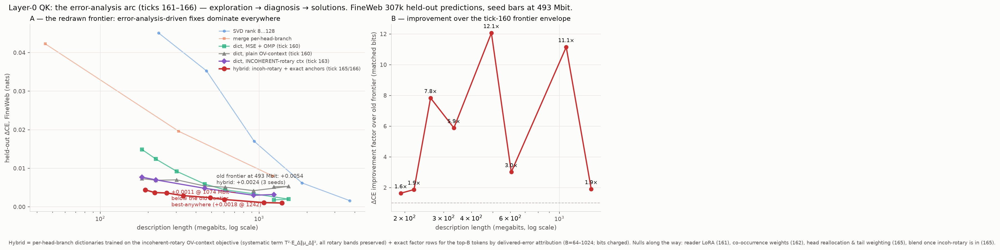
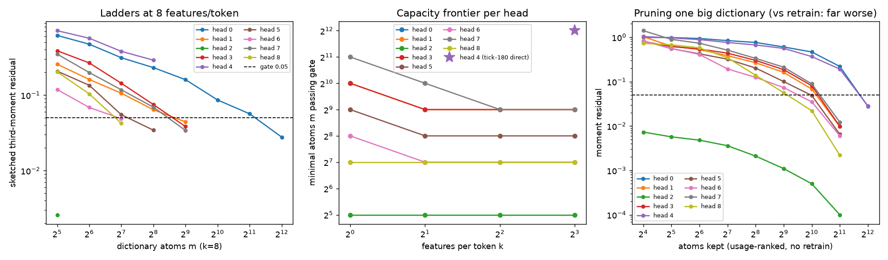

# Layer-0 query/key MDL decomposition — results (ticks 150–155, 2026-07-21/22)

**Program:** two-stage minimum-description-length decomposition of the embedding as read by the
first query/key circuit of bilin18 (546M-parameter bilinear-attention model, no softmax).
Stage one = vocabulary merge ("tokens that attend the same are the same token"); stage two =
sparse dictionary ("each token is a sparse combination of sub-patterns"). Everything is
**weight-only**: the object is the exact layer-0 fold (verified to ~1e-15 against the reference
forward); data enters only the held-out evaluation.

**TLDR:** The sparse-dictionary hypothesis wins. A per-head-branch dictionary of 1024 atoms with
8 active per token reproduces the circuit at **+0.006 held-out cross-entropy on the training
distribution using 6.1% of the raw bits** — six times better than matched-bits SVD, and equal to
an SVD spending four times the bits. The dictionary atoms are interpretable and surprisingly
semantic. Two headline-shaping methodology findings along the way: audit on the **training
distribution** (off-distribution Pile audits have a real coarsening-helps confound), and plain
factor-level FVU is the best cheap proxy for behavioral cost (energy-weighted / OV-composed
metrics do worse).

---

## 1. The object

At layer 0 the query/key input is exactly the RMS-normed embedding, so the circuit folds in
closed form: per branch and head, unit-RMS factor tables `q̂(t), k̂(t)` of shape (V=50304, 128).
The vocab-by-vocab score map per head-branch **is** the product of these factor tables (through
the rotary cosine/sine expansion), so decomposing the factors decomposes the map losslessly —
and the map is rank ≤ 128 *by construction* (it factors through the head), so "rank-128 SVD" is
the exact object (7,417.6 megabits), not a baseline. The baseline is the **rank-r bits frontier**.

Rows for merging/coding: `cat([q̂[:,h], k̂[:,h]])` — (V, 256) per head-branch, 18 head-branches
(9 heads × 2 bilinear branches). Gates: fold vs reference forward max error 1.3e-15; the
uncompressed-factors arm audits at ΔCE +0.0000 on every audit set used.

## 2. Methodology finding: audit on the training distribution

The first three audits (16 seqs → 8k preds; 128 seqs → 65k preds; 512 seqs → 262k preds) were all
**Pile**, and produced sign-unstable, sometimes *negative* ΔCE for compressed arms. The 600-seq
**FineWeb** audit (307k preds — the model's training distribution) resolved it:

| arm | Pile-big (262k) | FineWeb (307k) |
|---|---|---|
| svd rank 16 | +0.014 | +0.035 |
| svd rank 64 | **−0.022** | +0.006 |
| dict n=1024 k=8 OMP/LS | −0.011 | +0.006 |
| merge K=2048 per-head-branch | −0.003 | +0.020 |

Coarsening the layer-0 QK circuit genuinely *helps* on off-distribution text (a regularization
effect), while on the training distribution every compression has an honest positive cost that is
nearly monotone in bits. **All headline numbers below are FineWeb.** (This also retro-explains the
whole negative-ΔCE saga in LOG ticks 151–153 — part noise, part distribution.)

## 3. The frontier

*Panel A — held-out ΔCE (FineWeb) vs description length, log scale. Blue = SVD rank frontier,
orange = stage-one merges, teal = stage-two dictionaries, star = the (retracted) two-stage
composition, black dot = exact raw factors. Panel B — structural error (fraction of variance
unexplained) vs bits. Panel C — the two error measures against each other: on-distribution they
mostly re-couple.*

Full FineWeb table (baseline CE 3.0763; raw object 7,417.6 Mbit):

| arm | Mbit | % raw | ΔCE (FineWeb) | factor FVU |
|---|---|---|---|---|
| svd rank 8 | 233 | 3.1% | +0.045 | 0.69 |
| svd rank 16 | 466 | 6.3% | +0.035 | 0.62 |
| svd rank 32 | 932 | 12.6% | +0.017 | 0.51 |
| svd rank 64 | 1864 | 25.1% | +0.006 | 0.35 |
| svd rank 128 | 3728 | 50.3% | +0.002 | 0.15 |
| merge K=256 per-head-branch | 45 | 0.6% | +0.042 | 0.69 |
| merge K=2048 per-head-branch | 312 | 4.2% | +0.020 | — |
| merge K=8192 per-head-branch | 1220 | 16.4% | +0.008 | 0.47 |
| merge K=2048 **global** partition | 303 | 4.1% | +0.035 | 0.66 |
| **dict n=1024 k=8, OV-context-TRAINED** (tick 159; linear encoder, trained on eq. † of `ov_metric_explainer.md`) | **455** | **6.1%** | **+0.005** | — |
| **dict n=1024 k=8, OMP/least-squares** | **455** | **6.1%** | **+0.006** | **0.40** |
| dict n=1024 k=8, linear encoder | 455 | 6.1% | +0.008 | 0.46 |
| dict n=1024 k=8, matryoshka | 455 | 6.1% | +0.008 | 0.46 |
| dict n=1024 k=8, batch-top-k | 455 | 6.1% | +0.014 | 0.48 |
| **dict n=4096 k=8, OMP/least-squares** | **923** | **12.4%** | **+0.003** | **0.30** |
| two-stage merge2048 → dict 512/8 | 98 | 1.3% | +0.028 | 0.66 |

Commentary:

- **Dictionaries Pareto-dominate every family.** At 6.1% of raw bits the OMP dictionary matches
  svd r64's quality at a quarter of its bits; at 12.4% it beats svd r32 five-fold. The token rows
  really are better modeled as sparse combinations of sub-patterns than as a low-rank subspace.
- **Stage one (merge) is real but modest**: per-head-branch clustering beats the SVD curve at low
  bits (+0.042 at 0.6% vs svd r8's +0.045 at 3.1%), but dictionaries beat both.
- **Per-head-branch structure matters**: one global vocabulary partition shared by all 18
  head-branches costs +0.035 where 18 independent partitions cost ~+0.020 at the same bits —
  "tokens that attend the same" is a per-head-branch notion, consistent with 7 of 9 heads having
  marginal effective alphabet 1.
- **Encoder ordering (pre-registered in Phase 0 and confirmed here)**: OMP with least-squares
  refit is the strong arm; batch-top-k is the weakest (2.3× OMP's cost) — raw-magnitude atom
  selection without a refit degrades when atoms correlate, exactly as the planted control
  predicted. Matryoshka ≈ linear ≈ mid.
- **Retraction**: the two-stage merge-then-dictionary point briefly looked free (−0.0004 on the
  8k-pred audit) and was headlined at tick 152; the 65k- and 307k-pred audits put it at
  +0.017…+0.028. Small-audit overfitting — it is *not* a good point.

## 3b. The in-depth Pareto sweep (tick 160): objective × budget × seeds

Overnight sweep: 8 budgets (2.5%–20.7% of raw) × {MSE, OV-context-trained (eq. † of
`ov_metric_explainer.md`)} at identical bits, OMP audits at seed 0, 3 seeds at three anchors.
Findings:

1. **OV-context training dominates the low-bit frontier.** At 2.5–3% of raw bits it *halves* the
   cost of the best MSE arm (+0.0073 vs +0.0149 at 183 Mbit) and matches MSE-linear-at-455-Mbit
   quality with 2.5× fewer bits. Its curve is nearly flat (+0.005–0.007) across the whole range —
   the objective extracts the behaviorally relevant structure almost independently of budget.
2. **Seed-robust where it matters**: the paired linear-vs-context gap at 224 Mbit is
   +0.0075/+0.0071/+0.0073 across seeds (seed spread ±0.0004); at 455 Mbit +0.0010–0.0022;
   at 923 Mbit ≈ 0 (sign still consistent).
3. **Crossover ≈ 12% of raw**: richer budgets favor plain MSE with the OMP encoder (down to
   +0.0018 at 16.7%), while the context arm plateaus at ~+0.005 — the metric's i.i.d.-unigram /
   pre-rotary approximation floor binds once near-exact reconstruction is affordable. Candidate
   refinements: co-occurrence-corrected q, rotary inside the training objective, blended MSE+ctx loss.
4. **Honest flag**: at n=8192 the *linear encoder* training degenerates (FVU 1.18; the atoms are
   fine — OMP on the same dictionary reaches +0.0020). Encoder instability at extreme
   overcompleteness, not an atoms failure.

Current overall Pareto frontier: **OV-context dictionaries from 183–614 Mbit, MSE+OMP dictionaries
from 923 Mbit up**; SVD, merges, the global partition, and the two-stage arm are dominated everywhere.

## 3c. The error-analysis arc (ticks 161–166): exploration → diagnosis → solutions

Logan's redirect ("look at the residual itself, then consider solutions") replaced blind
objective-tweaking with a diagnose-then-fix loop. The chain, each step feeding the next:

1. **Reader co-adaptation is a null** (tick 161): jointly training a LoRA on the OV reader
   with the dictionary — against a faithful match-the-original-delivery objective — buys
   nothing at any budget; migration meters all quiet. The original OV is already the right
   reader; the QK-side pattern is what carries the loss.
2. **Error exploration** (tick 164, on the 183-Mbit arm): the net cost is a thin difference
   of large flows (46% of predictions improve; the worst 1% of positions carry ~93% of net).
   Weight-space attribution is extremely token-concentrated — the top 50 tokens (newline,
   punctuation, function words) carry 52% of delivered pattern error, by exposure, not
   misfit (their rows are fit *better* than average). CE damage bills on rare continuations
   (compound names, list structure) that depended on those structural anchors. Head 3 alone
   carries 40%.
3. **Rotary diagnosis** (tick 163): including rotation in the objective *coherently* (offset-
   averaged mean) washes out 98.8% of the systematic signal — that formulation trains on a
   DC remnant and loses. The **incoherent** form (T²·E_Δ‖μ_Δ‖², all bands preserved) wins:
   +0.0047 vs +0.0055 at 455 Mbit, and +0.0028 vs +0.0052 at the old 1242-Mbit plateau.
4. **Solutions** (ticks 165–166): exact factor rows for the top-B anchor tokens (bits
   charged) recover the tail — causal confirmation of (2). Nulls that sharpen the story:
   per-head budget reallocation, tail-weighted query distribution, co-occurrence context
   weights, and the MSE-blend once incoherent rotary is in.

**The composed frontier** (incoherent-rotary dictionaries + exact anchors, FineWeb 307k):

| Mbit | 192 | 220 | 262 | 334 | 493 | 606 | 1074 | 1393 |
|---|---|---|---|---|---|---|---|---|
| hybrid ΔCE | .0044 | .0037 | .0036 | .0029 | **.0024** | .0019 | **.0011** | .0010 |
| old frontier at same bits | ~.0072 | .0069 | ~.0070 | ~.0067 | .0054 | ~.0048 | ~.0031 | .0018 |

Seed-robust (+0.0024/+0.0022/+0.0022 at 493 Mbit). The hybrid dominates every previously
measured arm at every budget — 1.8–2.9× lower ΔCE at matched bits — and its 1074-Mbit point
(+0.0011) is below the old frontier's best result at any size. Files: qk_err_explore*.{py,md,json},
qk_rot_diag.{py,json}, qk_solutions.{py,json}, qk_hybrid_frontier.{py,json}, fig_qk_hybrid.py.

## 4. Are the atoms meaningful? Yes — and semantic, not just morphological

Full dump: [qk_dict_features.md](qk_dict_features.md) (6 head-branches, most-used + random atoms,
top tokens by coefficient). Expectation from earlier qualitative work was morphology at layer 0;
the reality is **topic-level semantics alongside morphology**. Examples from head 0, branch 1:

- **music**: musician, music, song, songs, tunes, concerts, band, album, guitarist
- **film**: films, movie, director, cinema, filmmakers
- **food**: restaurant, cuisine, meal, culinary, menu, chefs
- **television**: TV, NBC, CBS, ITV, aired, episode
- **religion**: church, pastor, Christians, theological, sermon
- **persuasion**: persuade, convince, influence, swayed, deceive
- **disasters/places**: Orleans, Katrina, Louisiana, FEMA, hurricanes, Tripoli, Gaddafi
- morphology in the same dictionary: plural suffixes (ups/ins/ures/nesses — and a separate
  *negative-signed* plural atom in branch 2), past-tense suffixes (ered/ised/ized/ated),
  "-ical" adjectives, truncated stems (Ġinst/Ġresear/Ġreconc), first names, surnames,
  3-digit numbers, hedging adverbs (basically/actually/just), quantity words (Two/Three/triple).

So the first attention layer reads the embedding in a basis whose axes are recognizable token
categories — the compression is interpretable, not just compact.

## 5. Why did FVU and ΔCE decouple? (metric ladder, weight-only)

Question raised when dictionaries beat SVD behaviorally while (off-distribution / small-audit)
numbers looked contradictory. Ladder of six structural metrics per arm, Spearman-correlated with
FineWeb ΔCE across 8 arms — all computed from weights alone:

| metric | Spearman vs FineWeb ΔCE |
|---|---|
| **plain factor FVU** | **0.952** |
| **context-expected OV metric** (`pat_ctx`; T-scatter + T²-mean split, see `ov_metric_explainer.md`) | **0.905** |
| **frequency-weighted pattern FVU** (unigram rows × columns) | **0.905** |
| score-level FVU (q̂k̂ᵀ) | 0.881 |
| pattern FVU + rotary offsets (pair-count weighted) | 0.786 |
| pattern FVU (s₁·s₂ product) | 0.714 |
| pattern + rotary + OV-weighted | 0.714 |
| OV-weighted pattern (columns × ‖W_o W_v ê_j‖) | 0.571 |
| OV-**Gram** pattern (error through the full OV map, exact) | 0.571 |
| OV-Gram + rotary | 0.571 |

Findings: (a) on-distribution, the decoupling **mostly dissolves** — plain FVU is a good proxy
(panel C of the figure); (b) the OV-weighting hypothesis (weight score errors by what the
output-value circuit reads) is **not supported**, and not because of the crude norm
approximation — the exact OV-Gram version (cancellation and null space handled properly) predicts
identically badly; (c) rotary position helps the pattern metric (0.71 → 0.79) but doesn't close
the gap.

**Why the composed metrics fail — two mechanisms, quantified by the diagnostics:**

1. *Uniform-vocabulary sampling.* Score/pattern energy concentrates on high-norm factor rows,
   over-representing rare tokens relative to real usage. Weighting rows and columns by empirical
   unigram frequency rescues the pattern metric from 0.714 to **0.905** and makes it correctly
   rank the dictionary above matched-bits SVD.
2. *Differential cancellation through OV.* The cancellation index (‖ΔP·U‖² over the no-cross-term
   sum; the true pattern's own value is 31.6) shows SVD residuals self-cancel through the OV map
   more than dictionary residuals (≈10–11 vs ≈13–14; merges ≈16). Any post-OV energy metric
   therefore awards SVD a discount that held-out cross-entropy does not honor. The alignment
   coefficient (+0.20…+0.30 for every arm) acquits the "dumps error where OV cares" hypothesis.

Practical rule: trust factor FVU or frequency-weighted pattern FVU in search loops; report the
cancellation index beside any post-OV metric — a large cancel-index gap between arms flags a
distorted comparison. Held-out ΔCE (FineWeb) stays binding.

## 5b. Per-head free merges (is any head's query/key content-free?)

Collapsing one head's factor rows to the vocabulary mean (pattern becomes position-only through
rotary), others exact, FineWeb ΔCE per head:

| head | 0 | 1 | 2 | 3 | 4 | 5 | 6 | 7 | 8 |
|---|---|---|---|---|---|---|---|---|---|
| ΔCE | +.103 | +.004 | **+.002** | +.013 | +.007 | **+.001** | +.004 | +.019 | +.005 |

**Heads 2 and 5 are individually content-free and — unusually for this program — compose**
(joint collapse +0.0028 ≈ additive). Head 0 alone carries +0.103; collapsing all nine costs
+0.57. The earlier "7 of 9 heads have marginal alphabet 1" claim was a Pile-audit artifact and
does not survive on the training distribution.

## 5c. CE-training upper bound (is the MSE objective leaving CE on the table?)

Frozen-support CE polish through the frozen model (atoms + coefficients + biases trainable,
supports fixed; FineWeb 300/300 train/audit split; not weight-only — diagnostic): **zero gain.**
Held-out ΔCE degraded monotonically from the very first eval (+0.012 at step 150 → +0.061 at
step 1200) while train CE fell to ~2.3 — pure overfitting of ~12M dictionary parameters on 154k
train tokens. Best held-out remains the weight-space MSE fit (+0.0076). Replicates the earlier
stream-tables finding that CE polish buys nothing once structure is right. Bounded by the 154k
training tokens available, but the direction was clear from the first evaluation; combined with
factor FVU's 0.95 rank correlation, the weight-faithful objective is not measurably suboptimal.

## 5d. The tensor-network picture

Per head-branch the exact vocab-by-vocab score map is a chain
`token ──[Q: V×128]──[R_δ]──[Kᵀ: 128×V]── token` (rotary node on a 128 bond = the head
dimension; the full pattern is the Hadamard product of the two branch chains, and the value path
hangs U = W_o W_v ê off the same token leg — the token index is a copy node feeding the q, k, v
roles). The dictionary is surgery on the token→factor edge: factor the (V, 256) table through a
new **atom bond**, `token ──[S: V×1024, 8-sparse]──[D: 1024×256]──`. The bond is *wider* than
what it replaces (overcomplete); the bits live in the sparsity of S, not the bond dimension.
All three compression families are this same surgery with different structure on S — SVD = dense
narrow bond (n = r), clustering = one-hot S (the degenerate sparse code, k=1), dictionary = wide
sparse S — so the matched-bits frontier compares bond structures under one accounting.
Caveats: this is node insertion, not a gauge move (lossy, dimension-changing); and sparsity is
not gauge-invariant — the description-length objective is what pins the atom basis (MDL is the
gauge-fixing). For tensor-similarity training: the network-vs-network objective reduces to
weighted Frobenius distance between factor tables with a metric node per leg; the ladder says use
identity (or unigram-frequency) on the token leg and stop contracting before OV (differential
cancellation, section 5).

## 5e. The mechanism ledger (spec Stages 1-3): archetypes = scaffold-token classes

Separate ledger from the compression frontier (section 3c): here the object is the
p-weighted third-moment core of each head's source-side triple rows [k1 | k2 | v], its
sparse code (512-atom head-space SAE, nonnegative, unigram-weighted — the hardened trainer
that passes the planted recovery gate at 1.0), and its symmetric nonnegative CP factors
(tensor power method + deflation — the only fitter of five tried that passes the planted
CP known-answer test, at 0.9998 matched cosine).

Findings, all gated by known-answer controls and nulls:
- Seven of nine heads pass the sketched moment-residual gate; their CP fits are rank-
  monotone (down to 2-5% residual at rank 64 for heads 2/5/6), restart-stable (0.94-1.00),
  and beat column-permutation nulls by 2-10x. Heads 0 and 4 (content-heavy) stay over-gate
  even at doubled dictionary capacity — their third moments have heavier tails; excluded.
- The dominant archetypes are case/form-invariant closed-class categories: head 8 factors
  into {the}, {a/an}, {of}, {and} classes; heads 2/5 into punctuation families (comma,
  period, colon, dash), newline and document-boundary units.
- Quantified convergence with the compression arc: 14-21% of top archetype-loading tokens
  fall in the anchor-256 set (random baseline 0.5%) — 28-42x enrichment. The two ledgers
  independently identify the same scaffold-token population as layer-0 QK's organizing
  structure: exact rows for it buy the frontier; its category interactions ARE the
  third-moment mechanism.
Files: qk_stage1_triple.*, qk_stage23.*, qk_cp_planted.py, qk_h04_refit.*,
qk_arch_anchor_overlap.json, qk_solver_harden.*, qk_planted_synth.py.

## 6. Robustness notes

- Dictionary result is stable across 3 training seeds × 2 encoders (spread ≤ 0.003 nats).
- k-means merges have real seed spread (+0.009…+0.018 wide-audit at K=2048) — less stable than
  the dictionaries.
- Phase-0 planted-structure control (selectivity 2/2, atom recovery cosine 0.986) stands behind
  the solver family; its two pre-registered predictions both held on the real circuit.

## 7. Open next steps (awaiting steer)

(a) dictionary (n, k) sweep for the FineWeb knee; (b) shared atoms across head-branches;
(c) joint product-of-branches decomposition; (d) tensor-similarity weight-space training with
the factor-level metric (now justified by the ladder); (e) the layer-1 object — deferred by
design until this arc settled.

## File map

| file | contents |
|---|---|
| `qk_merge_stage1_l0.py/.json` | stage-one merge frontier (Phase 1) |
| `qk_sae_dict.py/.json` | stage-two dictionary arms + SVD frontier (Phases 2–3) |
| `qk_sae_robust.py/.json` | wide-audit + seed robustness (Phase 4) |
| `qk_audit_big.py/.json` | 262k-Pile + 307k-FineWeb audits; saves seed-0 dictionary |
| `qk_fw_fill.py/.json` | remaining arms on FineWeb (completes the frontier) |
| `qk_dict_features.py/.md` | atom → top-token dumps |
| `qk_ovweight.py/.json` | six-rung metric ladder + correlations |
| `qk_sae_lib.py` | consolidated solver recipes |
| `fig_qk_mdl_frontier_fw.py/.png` | the frontier figure (training distribution) |
| `fig_qk_mdl_frontier.py/.png` | v1 figure (original Pile audit — superseded, kept for the record) |

### 5f. Per-head capacity frontier of the mechanism ledger (tick 181)

Logan asked whether the seven gated heads really all need 512 atoms, and what the
trade-off is between total atoms $m$ and features-per-token $k$. Sweep: per head, per
$k \in \{1,2,4,8\}$, ascending $m$ until the sketched-moment gate ($<0.05$) passes;
plus usage-ranked pruning curves from one oversized dictionary per head.

**Minimal atoms passing the gate** (bits-optimal configuration bolded):

| head | $k=1$ | $k=2$ | $k=4$ | $k=8$ | bits-optimal |
|---|---|---|---|---|---|
| 0 | – | – | – | 4096 | $k{=}8$, $m{=}4096$: 68 Mbit |
| 1 | 1024 | **512** | 512 | 512 | $k{=}2$: 10.4 Mbit |
| 2 | **32** | 32 | 32 | 32 | $k{=}1$: 2.3 Mbit |
| 3 | 1024 | **512** | 512 | 512 | $k{=}2$: 10.4 Mbit |
| 4 | – | – | – | (4096)* | $k{=}8$, $m{=}4096$: 68 Mbit |
| 5 | 512 | **256** | 256 | 256 | $k{=}2$: 7.2 Mbit |
| 6 | **256** | 128 | 128 | 128 | $k{=}1$: 5.2 Mbit |
| 7 | 2048 | 1024 | **512** | 512 | $k{=}4$: 14.5 Mbit |
| 8 | **128** | 128 | 128 | 128 | $k{=}1$: 3.5 Mbit |

\* head 4's $k{=}8$ ladder was falsely abandoned by the decay-projection heuristic at
$m{=}256$ (9000-step trainings decay slower early); tick 180's direct 12000-step
measurement at $m{=}4096$ passes at 0.0293, so its entry is taken from there. Head 0's
$k{=}2$ ladder reaches 0.060 at $m{=}4096$ — just misses.

**Findings.** (1) Required capacity spans a **128-fold range across heads** (32 to
4096 atoms): head 2 is trivially compressible (passes at 32 atoms even with one
feature per token, residual 0.002), heads 8 and 6 need 128–256, heads 1/3/5/7 need
256–1024, heads 0/4 need 4096. Uniform 512 was over-provisioned for four heads and
under-provisioned for two. (2) **Two features per token is the sweet spot**: going
from $k{=}1$ to $k{=}2$ halves the required $m$ on heads 1, 3, 5, 6, 7; $k{=}4$ helps
only head 7; $k{=}8$ never helps. The rows behave like one dominant class plus one
modifier. (3) **Retraining at the right size beats pruning by roughly an order of
magnitude in residual** (for example head 8: 128 retrained atoms give 0.042, the top
128 of a trained 2048-atom dictionary give 0.344) — the small dictionaries find
genuinely different, coarser atoms, so "train big and prune" is not a substitute.
(4) Bits-optimal mechanism ledger: seven gated heads at per-head optima cost 53.5 Mbit
versus 131 Mbit at uniform $(512, k{=}6)$ — 2.4× cheaper for the same gates.

### 5g. Corrected permutation-null statistic; heads 0/4 verdict revised (ticks 182–183)

Tick 180 reported that heads 0 and 4's cores "fail the permutation null" (real core
fits CP worse than the permuted core). The head-5 control in the asymmetric setting
exposed that statistic as broken: a mode-permuted core approaches the product of
independent marginals, which is intrinsically near-low-rank, so it can fit *better*
than a structured real core. Comparing fit quality across two different target tensors
was invalid.

**Corrected statistic** — everything scored on the *same* real core: factors fit on the
permuted core are transplanted onto the real core (only the nonnegative component
weights refit by Gram solve), versus the real fit, versus a rank-one
product-of-marginals baseline:

| head (form) | real fit | null factors on real core | marginals rank-1 |
|---|---|---|---|
| 0 (asymmetric, $m{=}2048$/mode) | **0.281** | 1.000 | 0.997 |
| 4 (asymmetric, $m{=}1024$/mode) | **0.291** | 1.000 | 0.995 |
| 5 (asymmetric control, $m{=}128$/mode) | **0.132** | 0.911 | 0.996 |
| 0 (symmetric, $m{=}4096$) | **0.389** | 1.000 | 0.996 |
| 4 (symmetric, $m{=}4096$) | **0.530** | 1.000 | 0.999 |

Null-derived directions explain essentially nothing of the real cores (relative error
0.91–1.00 ≈ predicting zero), while the real fits explain 71–87% of core mass in the
asymmetric form. **All nine heads therefore have genuine, null-beating interaction
structure**; heads 0 and 4 are not "structureless" — they need a larger feature
inventory (tick 181) and prefer the mode-separated asymmetric form (rank-32 error 0.28
versus 0.39, and 0.29 versus 0.53, at half or quarter the atoms per mode). The
token-space branch asymmetry of their components is real but partial (mean cosine
between branch-1 and branch-2 token loadings 0.44–0.61): archetypes are neither
mirror-symmetric classes nor unrelated pairs.

### 5h. Corpus-component decomposition of the mechanism cores (tick 185)

Twelve document components (k-means over token-cluster histograms of the 6000 held-out
co-occurrence documents; named by over-represented tokens — e.g. commerce/product
reviews, health/legal, one small Cyrillic outlier, one game/list outlier). Per head,
the third-moment core is rebuilt under each component's token distribution (codes
fixed) and every archetype profiled across components.

**The archetype structure is corpus-general, as the scaffold interpretation predicts:**
mean effective number of components per archetype is 9.7–10.4 out of 12 for every head
(near-uniform spread). The most concentrated single archetypes reach effective 3.6–4.5
components — a modest topical minority. Component-core cosines generalize the two-slice
stability result: the seven gated heads sit at mean 0.84–0.99 across all 66 component
pairs, while **heads 0 and 4 vary far more across data components** (mean 0.77–0.80,
minima 0.18–0.24, driven by the outlier components) — consistent with their long
archetype tail being partly component-specific structure on top of a shared scaffold.
