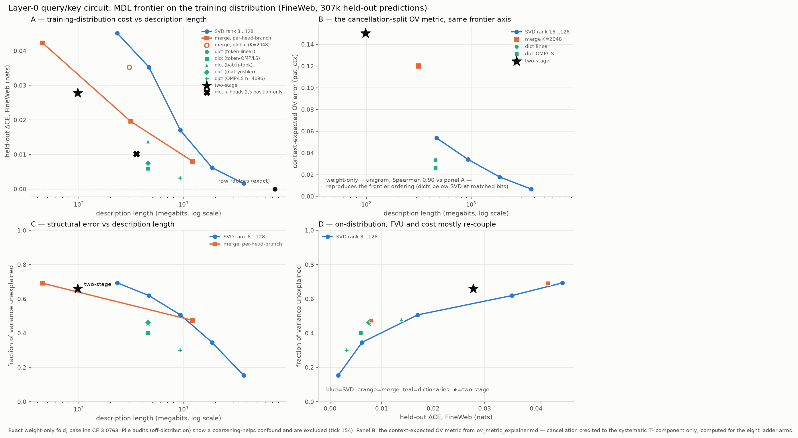
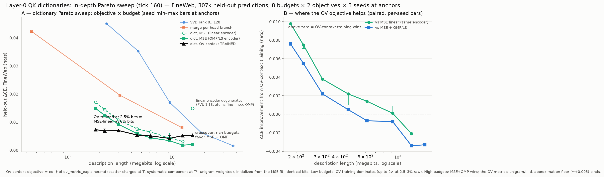
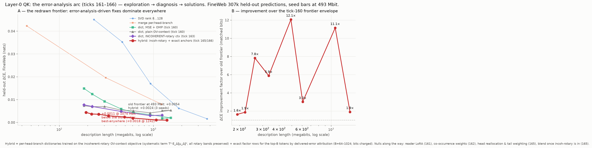
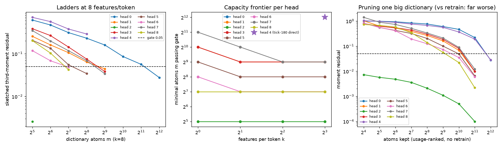
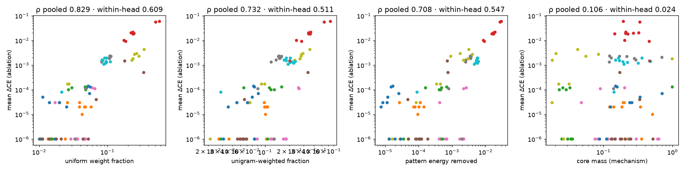

# Layer-0 query/key MDL decomposition — results (ticks 150–155, 2026-07-21/22)

**Program:** two-stage minimum-description-length decomposition of the embedding as read by the
first query/key circuit of bilin18 (546M-parameter bilinear-attention model, no softmax).
Stage one = vocabulary merge ("tokens that attend the same are the same token"); stage two =
sparse dictionary ("each token is a sparse combination of sub-patterns"). Everything is
**weight-only**: the object is the exact layer-0 fold (verified to ~1e-15 against the reference
forward); data enters only the held-out evaluation.

**TLDR:** The sparse-dictionary hypothesis wins. A per-head-branch dictionary of 1024 atoms with
8 active per token reproduces the circuit at **+0.006 held-out cross-entropy on the training
distribution using 6.1% of the raw bits** — six times better than matched-bits SVD, and equal to
an SVD spending four times the bits. The dictionary atoms are interpretable and surprisingly
semantic. Two headline-shaping methodology findings along the way: audit on the **training
distribution** (off-distribution Pile audits have a real coarsening-helps confound), and plain
factor-level FVU is the best cheap proxy for behavioral cost (energy-weighted / OV-composed
metrics do worse).

---

## 1. The object

At layer 0 the query/key input is exactly the RMS-normed embedding, so the circuit folds in
closed form: per branch and head, unit-RMS factor tables `q̂(t), k̂(t)` of shape (V=50304, 128).
The vocab-by-vocab score map per head-branch **is** the product of these factor tables (through
the rotary cosine/sine expansion), so decomposing the factors decomposes the map losslessly —
and the map is rank ≤ 128 *by construction* (it factors through the head), so "rank-128 SVD" is
the exact object (7,417.6 megabits), not a baseline. The baseline is the **rank-r bits frontier**.

Rows for merging/coding: `cat([q̂[:,h], k̂[:,h]])` — (V, 256) per head-branch, 18 head-branches
(9 heads × 2 bilinear branches). Gates: fold vs reference forward max error 1.3e-15; the
uncompressed-factors arm audits at ΔCE +0.0000 on every audit set used.

## 2. Methodology finding: audit on the training distribution

The first three audits (16 seqs → 8k preds; 128 seqs → 65k preds; 512 seqs → 262k preds) were all
**Pile**, and produced sign-unstable, sometimes *negative* ΔCE for compressed arms. The 600-seq
**FineWeb** audit (307k preds — the model's training distribution) resolved it:

| arm | Pile-big (262k) | FineWeb (307k) |
|---|---|---|
| svd rank 16 | +0.014 | +0.035 |
| svd rank 64 | **−0.022** | +0.006 |
| dict n=1024 k=8 OMP/LS | −0.011 | +0.006 |
| merge K=2048 per-head-branch | −0.003 | +0.020 |

Coarsening the layer-0 QK circuit genuinely *helps* on off-distribution text (a regularization
effect), while on the training distribution every compression has an honest positive cost that is
nearly monotone in bits. **All headline numbers below are FineWeb.** (This also retro-explains the
whole negative-ΔCE saga in LOG ticks 151–153 — part noise, part distribution.)

## 3. The frontier

*Panel A — held-out ΔCE (FineWeb) vs description length, log scale. Blue = SVD rank frontier,
orange = stage-one merges, teal = stage-two dictionaries, star = the (retracted) two-stage
composition, black dot = exact raw factors. Panel B — structural error (fraction of variance
unexplained) vs bits. Panel C — the two error measures against each other: on-distribution they
mostly re-couple.*

Full FineWeb table (baseline CE 3.0763; raw object 7,417.6 Mbit):

| arm | Mbit | % raw | ΔCE (FineWeb) | factor FVU |
|---|---|---|---|---|
| svd rank 8 | 233 | 3.1% | +0.045 | 0.69 |
| svd rank 16 | 466 | 6.3% | +0.035 | 0.62 |
| svd rank 32 | 932 | 12.6% | +0.017 | 0.51 |
| svd rank 64 | 1864 | 25.1% | +0.006 | 0.35 |
| svd rank 128 | 3728 | 50.3% | +0.002 | 0.15 |
| merge K=256 per-head-branch | 45 | 0.6% | +0.042 | 0.69 |
| merge K=2048 per-head-branch | 312 | 4.2% | +0.020 | — |
| merge K=8192 per-head-branch | 1220 | 16.4% | +0.008 | 0.47 |
| merge K=2048 **global** partition | 303 | 4.1% | +0.035 | 0.66 |
| **dict n=1024 k=8, OV-context-TRAINED** (tick 159; linear encoder, trained on eq. † of `ov_metric_explainer.md`) | **455** | **6.1%** | **+0.005** | — |
| **dict n=1024 k=8, OMP/least-squares** | **455** | **6.1%** | **+0.006** | **0.40** |
| dict n=1024 k=8, linear encoder | 455 | 6.1% | +0.008 | 0.46 |
| dict n=1024 k=8, matryoshka | 455 | 6.1% | +0.008 | 0.46 |
| dict n=1024 k=8, batch-top-k | 455 | 6.1% | +0.014 | 0.48 |
| **dict n=4096 k=8, OMP/least-squares** | **923** | **12.4%** | **+0.003** | **0.30** |
| two-stage merge2048 → dict 512/8 | 98 | 1.3% | +0.028 | 0.66 |

Commentary:

- **Dictionaries Pareto-dominate every family.** At 6.1% of raw bits the OMP dictionary matches
  svd r64's quality at a quarter of its bits; at 12.4% it beats svd r32 five-fold. The token rows
  really are better modeled as sparse combinations of sub-patterns than as a low-rank subspace.
- **Stage one (merge) is real but modest**: per-head-branch clustering beats the SVD curve at low
  bits (+0.042 at 0.6% vs svd r8's +0.045 at 3.1%), but dictionaries beat both.
- **Per-head-branch structure matters**: one global vocabulary partition shared by all 18
  head-branches costs +0.035 where 18 independent partitions cost ~+0.020 at the same bits —
  "tokens that attend the same" is a per-head-branch notion, consistent with 7 of 9 heads having
  marginal effective alphabet 1.
- **Encoder ordering (pre-registered in Phase 0 and confirmed here)**: OMP with least-squares
  refit is the strong arm; batch-top-k is the weakest (2.3× OMP's cost) — raw-magnitude atom
  selection without a refit degrades when atoms correlate, exactly as the planted control
  predicted. Matryoshka ≈ linear ≈ mid.
- **Retraction**: the two-stage merge-then-dictionary point briefly looked free (−0.0004 on the
  8k-pred audit) and was headlined at tick 152; the 65k- and 307k-pred audits put it at
  +0.017…+0.028. Small-audit overfitting — it is *not* a good point.

## 3b. The in-depth Pareto sweep (tick 160): objective × budget × seeds

Overnight sweep: 8 budgets (2.5%–20.7% of raw) × {MSE, OV-context-trained (eq. † of
`ov_metric_explainer.md`)} at identical bits, OMP audits at seed 0, 3 seeds at three anchors.
Findings:

1. **OV-context training dominates the low-bit frontier.** At 2.5–3% of raw bits it *halves* the
   cost of the best MSE arm (+0.0073 vs +0.0149 at 183 Mbit) and matches MSE-linear-at-455-Mbit
   quality with 2.5× fewer bits. Its curve is nearly flat (+0.005–0.007) across the whole range —
   the objective extracts the behaviorally relevant structure almost independently of budget.
2. **Seed-robust where it matters**: the paired linear-vs-context gap at 224 Mbit is
   +0.0075/+0.0071/+0.0073 across seeds (seed spread ±0.0004); at 455 Mbit +0.0010–0.0022;
   at 923 Mbit ≈ 0 (sign still consistent).
3. **Crossover ≈ 12% of raw**: richer budgets favor plain MSE with the OMP encoder (down to
   +0.0018 at 16.7%), while the context arm plateaus at ~+0.005 — the metric's i.i.d.-unigram /
   pre-rotary approximation floor binds once near-exact reconstruction is affordable. Candidate
   refinements: co-occurrence-corrected q, rotary inside the training objective, blended MSE+ctx loss.
4. **Honest flag**: at n=8192 the *linear encoder* training degenerates (FVU 1.18; the atoms are
   fine — OMP on the same dictionary reaches +0.0020). Encoder instability at extreme
   overcompleteness, not an atoms failure.

Current overall Pareto frontier: **OV-context dictionaries from 183–614 Mbit, MSE+OMP dictionaries
from 923 Mbit up**; SVD, merges, the global partition, and the two-stage arm are dominated everywhere.

## 3c. The error-analysis arc (ticks 161–166): exploration → diagnosis → solutions

Logan's redirect ("look at the residual itself, then consider solutions") replaced blind
objective-tweaking with a diagnose-then-fix loop. The chain, each step feeding the next:

1. **Reader co-adaptation is a null** (tick 161): jointly training a LoRA on the OV reader
   with the dictionary — against a faithful match-the-original-delivery objective — buys
   nothing at any budget; migration meters all quiet. The original OV is already the right
   reader; the QK-side pattern is what carries the loss.
2. **Error exploration** (tick 164, on the 183-Mbit arm): the net cost is a thin difference
   of large flows (46% of predictions improve; the worst 1% of positions carry ~93% of net).
   Weight-space attribution is extremely token-concentrated — the top 50 tokens (newline,
   punctuation, function words) carry 52% of delivered pattern error, by exposure, not
   misfit (their rows are fit *better* than average). CE damage bills on rare continuations
   (compound names, list structure) that depended on those structural anchors. Head 3 alone
   carries 40%.
3. **Rotary diagnosis** (tick 163): including rotation in the objective *coherently* (offset-
   averaged mean) washes out 98.8% of the systematic signal — that formulation trains on a
   DC remnant and loses. The **incoherent** form (T²·E_Δ‖μ_Δ‖², all bands preserved) wins:
   +0.0047 vs +0.0055 at 455 Mbit, and +0.0028 vs +0.0052 at the old 1242-Mbit plateau.
4. **Solutions** (ticks 165–166): exact factor rows for the top-B anchor tokens (bits
   charged) recover the tail — causal confirmation of (2). Nulls that sharpen the story:
   per-head budget reallocation, tail-weighted query distribution, co-occurrence context
   weights, and the MSE-blend once incoherent rotary is in.

**The composed frontier** (incoherent-rotary dictionaries + exact anchors, FineWeb 307k):

| Mbit | 192 | 220 | 262 | 334 | 493 | 606 | 1074 | 1393 |
|---|---|---|---|---|---|---|---|---|
| hybrid ΔCE | .0044 | .0037 | .0036 | .0029 | **.0024** | .0019 | **.0011** | .0010 |
| old frontier at same bits | ~.0072 | .0069 | ~.0070 | ~.0067 | .0054 | ~.0048 | ~.0031 | .0018 |

Seed-robust (+0.0024/+0.0022/+0.0022 at 493 Mbit). The hybrid dominates every previously
measured arm at every budget — 1.8–2.9× lower ΔCE at matched bits — and its 1074-Mbit point
(+0.0011) is below the old frontier's best result at any size. Files: qk_err_explore*.{py,md,json},
qk_rot_diag.{py,json}, qk_solutions.{py,json}, qk_hybrid_frontier.{py,json}, fig_qk_hybrid.py.

## 4. Are the atoms meaningful? Yes — and semantic, not just morphological

Full dump: [qk_dict_features.md](qk_dict_features.md) (6 head-branches, most-used + random atoms,
top tokens by coefficient). Expectation from earlier qualitative work was morphology at layer 0;
the reality is **topic-level semantics alongside morphology**. Examples from head 0, branch 1:

- **music**: musician, music, song, songs, tunes, concerts, band, album, guitarist
- **film**: films, movie, director, cinema, filmmakers
- **food**: restaurant, cuisine, meal, culinary, menu, chefs
- **television**: TV, NBC, CBS, ITV, aired, episode
- **religion**: church, pastor, Christians, theological, sermon
- **persuasion**: persuade, convince, influence, swayed, deceive
- **disasters/places**: Orleans, Katrina, Louisiana, FEMA, hurricanes, Tripoli, Gaddafi
- morphology in the same dictionary: plural suffixes (ups/ins/ures/nesses — and a separate
  *negative-signed* plural atom in branch 2), past-tense suffixes (ered/ised/ized/ated),
  "-ical" adjectives, truncated stems (Ġinst/Ġresear/Ġreconc), first names, surnames,
  3-digit numbers, hedging adverbs (basically/actually/just), quantity words (Two/Three/triple).

So the first attention layer reads the embedding in a basis whose axes are recognizable token
categories — the compression is interpretable, not just compact.

## 5. Why did FVU and ΔCE decouple? (metric ladder, weight-only)

Question raised when dictionaries beat SVD behaviorally while (off-distribution / small-audit)
numbers looked contradictory. Ladder of six structural metrics per arm, Spearman-correlated with
FineWeb ΔCE across 8 arms — all computed from weights alone:

| metric | Spearman vs FineWeb ΔCE |
|---|---|
| **plain factor FVU** | **0.952** |
| **context-expected OV metric** (`pat_ctx`; T-scatter + T²-mean split, see `ov_metric_explainer.md`) | **0.905** |
| **frequency-weighted pattern FVU** (unigram rows × columns) | **0.905** |
| score-level FVU (q̂k̂ᵀ) | 0.881 |
| pattern FVU + rotary offsets (pair-count weighted) | 0.786 |
| pattern FVU (s₁·s₂ product) | 0.714 |
| pattern + rotary + OV-weighted | 0.714 |
| OV-weighted pattern (columns × ‖W_o W_v ê_j‖) | 0.571 |
| OV-**Gram** pattern (error through the full OV map, exact) | 0.571 |
| OV-Gram + rotary | 0.571 |

Findings: (a) on-distribution, the decoupling **mostly dissolves** — plain FVU is a good proxy
(panel C of the figure); (b) the OV-weighting hypothesis (weight score errors by what the
output-value circuit reads) is **not supported**, and not because of the crude norm
approximation — the exact OV-Gram version (cancellation and null space handled properly) predicts
identically badly; (c) rotary position helps the pattern metric (0.71 → 0.79) but doesn't close
the gap.

**Why the composed metrics fail — two mechanisms, quantified by the diagnostics:**

1. *Uniform-vocabulary sampling.* Score/pattern energy concentrates on high-norm factor rows,
   over-representing rare tokens relative to real usage. Weighting rows and columns by empirical
   unigram frequency rescues the pattern metric from 0.714 to **0.905** and makes it correctly
   rank the dictionary above matched-bits SVD.
2. *Differential cancellation through OV.* The cancellation index (‖ΔP·U‖² over the no-cross-term
   sum; the true pattern's own value is 31.6) shows SVD residuals self-cancel through the OV map
   more than dictionary residuals (≈10–11 vs ≈13–14; merges ≈16). Any post-OV energy metric
   therefore awards SVD a discount that held-out cross-entropy does not honor. The alignment
   coefficient (+0.20…+0.30 for every arm) acquits the "dumps error where OV cares" hypothesis.

Practical rule: trust factor FVU or frequency-weighted pattern FVU in search loops; report the
cancellation index beside any post-OV metric — a large cancel-index gap between arms flags a
distorted comparison. Held-out ΔCE (FineWeb) stays binding.

## 5b. Per-head free merges (is any head's query/key content-free?)

Collapsing one head's factor rows to the vocabulary mean (pattern becomes position-only through
rotary), others exact, FineWeb ΔCE per head:

| head | 0 | 1 | 2 | 3 | 4 | 5 | 6 | 7 | 8 |
|---|---|---|---|---|---|---|---|---|---|
| ΔCE | +.103 | +.004 | **+.002** | +.013 | +.007 | **+.001** | +.004 | +.019 | +.005 |

**Heads 2 and 5 are individually content-free and — unusually for this program — compose**
(joint collapse +0.0028 ≈ additive). Head 0 alone carries +0.103; collapsing all nine costs
+0.57. The earlier "7 of 9 heads have marginal alphabet 1" claim was a Pile-audit artifact and
does not survive on the training distribution.

## 5c. CE-training upper bound (is the MSE objective leaving CE on the table?)

Frozen-support CE polish through the frozen model (atoms + coefficients + biases trainable,
supports fixed; FineWeb 300/300 train/audit split; not weight-only — diagnostic): **zero gain.**
Held-out ΔCE degraded monotonically from the very first eval (+0.012 at step 150 → +0.061 at
step 1200) while train CE fell to ~2.3 — pure overfitting of ~12M dictionary parameters on 154k
train tokens. Best held-out remains the weight-space MSE fit (+0.0076). Replicates the earlier
stream-tables finding that CE polish buys nothing once structure is right. Bounded by the 154k
training tokens available, but the direction was clear from the first evaluation; combined with
factor FVU's 0.95 rank correlation, the weight-faithful objective is not measurably suboptimal.

## 5d. The tensor-network picture

Per head-branch the exact vocab-by-vocab score map is a chain
`token ──[Q: V×128]──[R_δ]──[Kᵀ: 128×V]── token` (rotary node on a 128 bond = the head
dimension; the full pattern is the Hadamard product of the two branch chains, and the value path
hangs U = W_o W_v ê off the same token leg — the token index is a copy node feeding the q, k, v
roles). The dictionary is surgery on the token→factor edge: factor the (V, 256) table through a
new **atom bond**, `token ──[S: V×1024, 8-sparse]──[D: 1024×256]──`. The bond is *wider* than
what it replaces (overcomplete); the bits live in the sparsity of S, not the bond dimension.
All three compression families are this same surgery with different structure on S — SVD = dense
narrow bond (n = r), clustering = one-hot S (the degenerate sparse code, k=1), dictionary = wide
sparse S — so the matched-bits frontier compares bond structures under one accounting.
Caveats: this is node insertion, not a gauge move (lossy, dimension-changing); and sparsity is
not gauge-invariant — the description-length objective is what pins the atom basis (MDL is the
gauge-fixing). For tensor-similarity training: the network-vs-network objective reduces to
weighted Frobenius distance between factor tables with a metric node per leg; the ladder says use
identity (or unigram-frequency) on the token leg and stop contracting before OV (differential
cancellation, section 5).

## 5e. The mechanism ledger (spec Stages 1-3): archetypes = scaffold-token classes

Separate ledger from the compression frontier (section 3c): here the object is the
p-weighted third-moment core of each head's source-side triple rows [k1 | k2 | v], its
sparse code (512-atom head-space SAE, nonnegative, unigram-weighted — the hardened trainer
that passes the planted recovery gate at 1.0), and its symmetric nonnegative CP factors
(tensor power method + deflation — the only fitter of five tried that passes the planted
CP known-answer test, at 0.9998 matched cosine).

Findings, all gated by known-answer controls and nulls:
- Seven of nine heads pass the sketched moment-residual gate; their CP fits are rank-
  monotone (down to 2-5% residual at rank 64 for heads 2/5/6), restart-stable (0.94-1.00),
  and beat column-permutation nulls by 2-10x. Heads 0 and 4 (content-heavy) stay over-gate
  even at doubled dictionary capacity — their third moments have heavier tails; excluded.
- The dominant archetypes are case/form-invariant closed-class categories: head 8 factors
  into {the}, {a/an}, {of}, {and} classes; heads 2/5 into punctuation families (comma,
  period, colon, dash), newline and document-boundary units.
- Quantified convergence with the compression arc: 14-21% of top archetype-loading tokens
  fall in the anchor-256 set (random baseline 0.5%) — 28-42x enrichment. The two ledgers
  independently identify the same scaffold-token population as layer-0 QK's organizing
  structure: exact rows for it buy the frontier; its category interactions ARE the
  third-moment mechanism.
Files: qk_stage1_triple.*, qk_stage23.*, qk_cp_planted.py, qk_h04_refit.*,
qk_arch_anchor_overlap.json, qk_solver_harden.*, qk_planted_synth.py.

## 6. Robustness notes

- Dictionary result is stable across 3 training seeds × 2 encoders (spread ≤ 0.003 nats).
- k-means merges have real seed spread (+0.009…+0.018 wide-audit at K=2048) — less stable than
  the dictionaries.
- Phase-0 planted-structure control (selectivity 2/2, atom recovery cosine 0.986) stands behind
  the solver family; its two pre-registered predictions both held on the real circuit.

## 7. Open next steps (awaiting steer)

(a) dictionary (n, k) sweep for the FineWeb knee; (b) shared atoms across head-branches;
(c) joint product-of-branches decomposition; (d) tensor-similarity weight-space training with
the factor-level metric (now justified by the ladder); (e) the layer-1 object — deferred by
design until this arc settled.

## File map

| file | contents |
|---|---|
| `qk_merge_stage1_l0.py/.json` | stage-one merge frontier (Phase 1) |
| `qk_sae_dict.py/.json` | stage-two dictionary arms + SVD frontier (Phases 2–3) |
| `qk_sae_robust.py/.json` | wide-audit + seed robustness (Phase 4) |
| `qk_audit_big.py/.json` | 262k-Pile + 307k-FineWeb audits; saves seed-0 dictionary |
| `qk_fw_fill.py/.json` | remaining arms on FineWeb (completes the frontier) |
| `qk_dict_features.py/.md` | atom → top-token dumps |
| `qk_ovweight.py/.json` | six-rung metric ladder + correlations |
| `qk_sae_lib.py` | consolidated solver recipes |
| `fig_qk_mdl_frontier_fw.py/.png` | the frontier figure (training distribution) |
| `fig_qk_mdl_frontier.py/.png` | v1 figure (original Pile audit — superseded, kept for the record) |

### 5f. Per-head capacity frontier of the mechanism ledger (tick 181)

Logan asked whether the seven gated heads really all need 512 atoms, and what the
trade-off is between total atoms $m$ and features-per-token $k$. Sweep: per head, per
$k \in \{1,2,4,8\}$, ascending $m$ until the sketched-moment gate ($<0.05$) passes;
plus usage-ranked pruning curves from one oversized dictionary per head.

**Minimal atoms passing the gate** (bits-optimal configuration bolded):

| head | $k=1$ | $k=2$ | $k=4$ | $k=8$ | bits-optimal |
|---|---|---|---|---|---|
| 0 | – | – | – | 4096 | $k{=}8$, $m{=}4096$: 68 Mbit |
| 1 | 1024 | **512** | 512 | 512 | $k{=}2$: 10.4 Mbit |
| 2 | **32** | 32 | 32 | 32 | $k{=}1$: 2.3 Mbit |
| 3 | 1024 | **512** | 512 | 512 | $k{=}2$: 10.4 Mbit |
| 4 | – | – | – | (4096)* | $k{=}8$, $m{=}4096$: 68 Mbit |
| 5 | 512 | **256** | 256 | 256 | $k{=}2$: 7.2 Mbit |
| 6 | **256** | 128 | 128 | 128 | $k{=}1$: 5.2 Mbit |
| 7 | 2048 | 1024 | **512** | 512 | $k{=}4$: 14.5 Mbit |
| 8 | **128** | 128 | 128 | 128 | $k{=}1$: 3.5 Mbit |

\* head 4's $k{=}8$ ladder was falsely abandoned by the decay-projection heuristic at
$m{=}256$ (9000-step trainings decay slower early); tick 180's direct 12000-step
measurement at $m{=}4096$ passes at 0.0293, so its entry is taken from there. Head 0's
$k{=}2$ ladder reaches 0.060 at $m{=}4096$ — just misses.

**Findings.** (1) Required capacity spans a **128-fold range across heads** (32 to
4096 atoms): head 2 is trivially compressible (passes at 32 atoms even with one
feature per token, residual 0.002), heads 8 and 6 need 128–256, heads 1/3/5/7 need
256–1024, heads 0/4 need 4096. Uniform 512 was over-provisioned for four heads and
under-provisioned for two. (2) **Two features per token is the sweet spot**: going
from $k{=}1$ to $k{=}2$ halves the required $m$ on heads 1, 3, 5, 6, 7; $k{=}4$ helps
only head 7; $k{=}8$ never helps. The rows behave like one dominant class plus one
modifier. (3) **Retraining at the right size beats pruning by roughly an order of
magnitude in residual** (for example head 8: 128 retrained atoms give 0.042, the top
128 of a trained 2048-atom dictionary give 0.344) — the small dictionaries find
genuinely different, coarser atoms, so "train big and prune" is not a substitute.
(4) Bits-optimal mechanism ledger: seven gated heads at per-head optima cost 53.5 Mbit
versus 131 Mbit at uniform $(512, k{=}6)$ — 2.4× cheaper for the same gates.

### 5g. Corrected permutation-null statistic; heads 0/4 verdict revised (ticks 182–183)

Tick 180 reported that heads 0 and 4's cores "fail the permutation null" (real core
fits CP worse than the permuted core). The head-5 control in the asymmetric setting
exposed that statistic as broken: a mode-permuted core approaches the product of
independent marginals, which is intrinsically near-low-rank, so it can fit *better*
than a structured real core. Comparing fit quality across two different target tensors
was invalid.

**Corrected statistic** — everything scored on the *same* real core: factors fit on the
permuted core are transplanted onto the real core (only the nonnegative component
weights refit by Gram solve), versus the real fit, versus a rank-one
product-of-marginals baseline:

| head (form) | real fit | null factors on real core | marginals rank-1 |
|---|---|---|---|
| 0 (asymmetric, $m{=}2048$/mode) | **0.281** | 1.000 | 0.997 |
| 4 (asymmetric, $m{=}1024$/mode) | **0.291** | 1.000 | 0.995 |
| 5 (asymmetric control, $m{=}128$/mode) | **0.132** | 0.911 | 0.996 |
| 0 (symmetric, $m{=}4096$) | **0.389** | 1.000 | 0.996 |
| 4 (symmetric, $m{=}4096$) | **0.530** | 1.000 | 0.999 |

Null-derived directions explain essentially nothing of the real cores (relative error
0.91–1.00 ≈ predicting zero), while the real fits explain 71–87% of core mass in the
asymmetric form. **All nine heads therefore have genuine, null-beating interaction
structure**; heads 0 and 4 are not "structureless" — they need a larger feature
inventory (tick 181) and prefer the mode-separated asymmetric form (rank-32 error 0.28
versus 0.39, and 0.29 versus 0.53, at half or quarter the atoms per mode). The
token-space branch asymmetry of their components is real but partial (mean cosine
between branch-1 and branch-2 token loadings 0.44–0.61): archetypes are neither
mirror-symmetric classes nor unrelated pairs.

### 5h. Corpus-component decomposition of the mechanism cores (tick 185)

Twelve document components (k-means over token-cluster histograms of the 6000 held-out
co-occurrence documents; named by over-represented tokens — e.g. commerce/product
reviews, health/legal, one small Cyrillic outlier, one game/list outlier). Per head,
the third-moment core is rebuilt under each component's token distribution (codes
fixed) and every archetype profiled across components.

**The archetype structure is corpus-general, as the scaffold interpretation predicts:**
mean effective number of components per archetype is 9.7–10.4 out of 12 for every head
(near-uniform spread). The most concentrated single archetypes reach effective 3.6–4.5
components — a modest topical minority. Component-core cosines generalize the two-slice
stability result: the seven gated heads sit at mean 0.84–0.99 across all 66 component
pairs, while **heads 0 and 4 vary far more across data components** (mean 0.77–0.80,
minima 0.18–0.24, driven by the outlier components) — consistent with their long
archetype tail being partly component-specific structure on top of a shared scaffold.

### 5i. Joint training vindicated by the true warm start (tick 186)

Tick 177's joint-training negative (CP structure degrading 4–15×) carried a warm-start
caveat: its archetype matrix was initialized from random rows of the code matrix. Rerun
with a single variable changed — the archetype matrix initialized from the true
deflation solution, scaled so the CP model equals the stagewise core exactly at step
zero — **joint training now improves every head**:

| head | stagewise CP rel-err | joint (tick 177, random-ish init) | joint (true warm start) |
|---|---|---|---|
| 2 | 0.031 | 0.452 | **0.030** |
| 8 | 0.121 | 0.540 | **0.101** |
| 1 | 0.188 | 0.648 | **0.146** |

Moment residuals stay gated (0.007–0.039), reconstruction is unchanged, archetype drift
is minimal (matched cosine 0.97–1.00 to the stagewise archetypes), and the trained
archetype matrix agrees with a fresh refit on the joint core. Verdict revised: the
gamma-ramped joint objective is a working **final polish stage** (10–22% better CP fit
at held gates) — the tick-177 collapse was entirely a warm-start artifact.

**Extension to heads 0/4 (tick 187).** The same warm-started polish applied to the
asymmetric mode-separated form: head 4 improves 0.238 → 0.194 at rank 64 with the gate
held (0.025 → 0.031); head 0 improves 0.228 → 0.179 at a gentler gamma of 0.025
(0.16 was reachable at gamma 0.05 but breached the gate by 0.001; gamma must respect
each head's gate margin). Factor drift 0.94–0.97 throughout — the polish sharpens the
existing archetypes rather than replacing them. The joint objective has now improved
the core fit on all five heads it has been applied to.

### 5j. Minimal inventories validated; no layer-0 copy heads on the direct path (tick 188)

The seven scaffold heads retrained at their bits-optimal minimal configurations
(32–512 features, 1–4 per token), warm-started-joint-polished (gamma 0.025), and
re-validated: all moment gates hold (0.003–0.048) and all corrected nulls fail
decisively (null factors 0.94–1.00 on the real cores). Trade-off measured: at minimal
capacity some cores are less CP-compressible than at the 512-feature standard (head 1:
0.33 vs 0.19; head 8: 0.27 vs 0.12; head 7 improves to 0.03) — density of features
trades against archetype crispness. Minimal inventories are also *more* interpretable
in places (head 3 gains a make/made/making verb-lemma class; head 7 a 4/four number
class; head 1 clean we/you/she person classes).

**Copy-head question (Logan): answered negative at layer 0.** Direct-path logit-lens
test — each archetype's write vector decoded through W_o into the unembedding, boosted
profile compared against the attended class — gives copy cosines of −0.08 to +0.03
across every archetype of every head (per-head means ≈ 0). No layer-0 head is a
direct-path copy head; the archetypes deposit class-occurrence signals consumed by
layers 1–17 (analysis deferred). Weak exception worth noting: head 2's abstract-noun
classes reach ≈ 0.10. Per-archetype branch agreement for heads 0/4 (post-polish):
scaffold components ≈ 0.9–1.0, fringe components near 0 (means 0.43 / 0.60) —
quantifying which parts of the hard heads genuinely use the bilinear asymmetry.

### 5k. Causal per-archetype ablation on held-out text (tick 190)

Ablation = project the archetype's key channel out of the head's exact key tables on
both branches (structured zero); score = per-position cross-entropy delta over 64
held-out documents (33k predictions); first ten archetypes per head (90 ablations).

**Weight mass and causal usefulness decouple** (the program's third measured
decoupling): heads 3, 6, 7, 8 carry real per-archetype causal load — head 3's channels
cost 0.009–0.059 nats on average and up to +7.6 nats on single predictions ("…in its
cold war → rivalry"); head 8's cost ~0.0015 mean with worst cases like "…Graph Search
is in search → of" (+2.5) — while heads 1, 2, 5, 0, 4's channels are individually
near-zero on ordinary text (mean |ΔCE| < 0.0004): redundant at the margin despite
carrying large core mass. Second structural finding: within a head, the hardest-hit
position is often identical across archetypes (all ten of head 8's channels break the
same "in search of"; all of head 6's break "…Exhibitions Ltd. → of"), i.e. the
archetype channels overlap on a shared key direction, and specific predictions lean on
that single layer-0 signal. Role confirmations are direct: the scaffold heads' worst
failures are exactly preposition/continuation completions after function-word context.
Artifact updated with per-archetype ablation panels (mean ΔCE + hardest-hit passages).

### 5l. Group ablations: overlap, head hierarchy, and where the tail lives (tick 191)

Four numbers per head on the tick-190 evaluation set: sum of ten single-channel
damages, damage from removing the ten-channel SPAN at once, a matched-dimension
random-subspace control, and whole-head silencing.

| head | singles sum | group (10-dim) | random | whole head |
|---|---|---|---|---|
| 3 | +0.251 | +0.070 | +0.002 | **+0.083** |
| 7 | +0.016 | +0.005 | 0 | +0.0066 |
| 6 | +0.016 | +0.003 | 0 | +0.0035 |
| 8 | +0.013 | +0.003 | 0 | +0.0034 |
| 0 | +0.0004 | +0.0003 | 0 | +0.0028 |
| 4 | +0.0006 | +0.0011 | 0 | +0.0018 |
| 1 / 2 / 5 | ≈0 | ≈0 | 0 | +0.0001–0.0003 |

Findings: (1) **sub-additivity** — the group is smaller than the sum of singles on
every load-bearing head, confirming the channels overlap (singles double-count a shared
direction); (2) the ten-archetype span carries **73–88% of whole-head causal load** on
heads 3/6/7/8 — the archetype description is causally near-complete there; (3) random
subspaces do nothing: the directions matter, not the dimension; (4) heads 1, 2, 5 barely
matter even fully silenced (+0.0001–0.0003) — their near-zero singles meant "small
head", not redundancy; (5) heads 0/4's small causal budget mostly lives BEYOND the
top-10 archetypes (span carries 11–60% of whole-head) — the long tail is where their
function is; (6) the hierarchy inverts capacity: head 3 (512 features) carries roughly
20× the causal load of everything else combined, while the 4096-feature heads are minor
and the trivial 32-feature head 2 is negligible. Note: evaluated on the 64-document
subset; whole-head numbers are one-head-at-a-time (interactions unmeasured).

### 5m. Full-audit head importance + a weight-space correlate found (tick 192)

Whole-head ablations re-scored on the full 307k-prediction audit (10× tick 191's text):
h3 +0.0780, h7 +0.0090, h8 +0.0051, h6 +0.0041, h0 +0.0026, h4 +0.0016, h5 +0.0014,
h1 +0.0006, h2 +0.0005. Logan's suspicion confirmed in degree: the quiet heads rose
3–5× with more text (h5 0.0003→0.0014) — every head matters somewhat, none are zero —
but the hierarchy stands: head 3 remains ~8× the runner-up and ~60% of the layer's
total causal load.

**Correlate found: expected output magnitude.** Weight-only candidates vs causal
importance (Spearman): ov_norm = Σ_t p_t ‖W_o^h v_t‖ → **+0.87** (best); pattern×write
composite +0.80; expected squared pattern +0.75; third-moment core scale +0.65; key
table norms uninformative (unit-RMS makes them constant). The causally dominant head is
visible in the weights: h3's expected output magnitude (1430) is 3–6× every other head
(224–545). So "how hard does this head write, frequency-weighted" is a good cheap
proxy, with the known caveat that heads 0/4's mechanism mass still overstates them.

Layer-1 architecture (recon): each block = bilinear attention + a Bilinear MLP
(Left/Right 4608×1152 gating, Down projection) — NOT attention-only; the layer-1
program must account for block-0's MLP in the residual.

## 6. Layer 1 (opened by Logan, tick 192; ticks 193–)

### 6a. The token-identity port test (tick 193)

Layer 1's attention input is the post-block-0 residual (attention + Bilinear MLP +
lambda-mixed skip), so the exact embedding fold no longer applies. Test: token-
conditional MEAN-RESIDUAL tables (average block-1 input per vocabulary token, estimated
on 1024 disjoint co-occurrence documents, 62% of types / 94% of audit token mass seen;
unseen tokens fall back to embedding rows), pushed through block 1's own projections
with the model's per-head normalization, patched into layer 1's pattern, audited on the
standard 307k set.

**Layer 1's pattern is ~99% token-identity-driven:** replacing the entire layer-1
pattern with static token tables costs only **+0.027 nats**, against **+2.70 nats** for
zeroing the layer-1 pattern outright — a 100× ratio. The whole validated pipeline
(fold → dictionaries → third-moment cores → archetypes, with all gates) therefore
transfers to layer 1 with mean-residual tables in place of embeddings. Also notable:
layer 1's pattern is ~27× more causally important than layer 0's entire attention
(+2.70 vs ~+0.10 summed) — and massively super-additive across heads: single-head
zeroing sums to only +0.128 (h1 +0.065, h4 +0.020, h8 +0.017, h3 +0.011, rest ≤0.006),
21× below the joint effect, so layer-1 heads back each other up in a way layer-0 heads
do not.

### 6b. The layer-1 mechanism ledger: all nine heads validate (ticks 194–196)

Stage 1 (token tables from shrinkage-estimated mean residuals): all nine heads pass the
moment gate — seven at 512 features, head 3 at 1024, head 1 at 1024 on shrunk tables
(its raw-mean divergence was rare-token estimation noise cubed by the moment; tick 195).
Stages 2–3 (cores, rank-32 symmetric CP): every head beats the corrected null (real
fits 0.10–0.52 vs null-factors-on-real 0.54–1.00), restart stability 0.96–1.00.

**Layer 1 speaks a different archetype vocabulary than layer 0.** Layer 0 is
function-word scaffold ({the}, {a/an}, {of}); layer 1's top archetypes are
sentence/discourse boundaries (heads 0, 4, 7: period/quote/exclamation families),
document boundaries (heads 2, 5, 6: newline/end-of-text), quote/bracket openers
(head 8), and — on head 1, the causally dominant layer-1 head — **mid-word subword
fragments** ('cknowled', 'theless', 'secut'), consistent with a subword-continuation
role, which explains both its causal weight and its context-dependence. Head 3 fits
worst (0.52, long-tail-ish, layer-1's analog of the layer-0 hard heads).

### 6c. Who reads layer-0 head 3? Everyone, a little — and layer 1 partially self-repairs (tick 197)

Sensitivity: silencing l0-h3 during mean-residual estimation moves EVERY layer-1 head's
tables by 10–30% (value modes most, 0.19–0.30) — no dedicated reader; the determiner
signal is broadcast infrastructure. The archetype loadings that shift most are
function-word classes across all nine heads (the/a/that/comma positions), i.e. h3's
writes specifically shape how layer 1 keys function-word positions. The subword-
continuation head (l1-h1) reads h3 least (0.11–0.15), as its role predicts.

Path accounting of h3's +0.078: rebuilding layer 1's pattern tables from h3-less
residuals (model otherwise normal) costs +0.028 beyond the port baseline — roughly
**one-third of h3's effect flows through layer-1 pattern formation**, two-thirds
through values/MLP/deeper layers. Striking interaction: zeroing h3 while SHIELDING
layer 1's pattern with normal static tables costs +0.171 — more than double h3's live
effect (+0.078) — i.e. the live, context-computed layer-1 pattern partially
COMPENSATES for the missing h3 signal, and freezing it removes that self-repair
(plus a large positive interaction between the two corruptions; both readings logged).

### 5n. Equal-ablation control: archetype directions are NOT causally privileged (tick 199)

Logan's question: do head 3's archetype ablations differ from an equal ablation? Six
arms on head 3, all scored by pattern energy removed (E[(ΔP)²] over 16M sampled token
pairs) and per-position damage on 128 documents: top-1 archetype, top-10 archetype
span, top-10 PCA of the p-weighted key tables, random 10-dim subspace, and two uniform
score shrinks calibrated to match the archetype arms' removed energy exactly.

**Damage is proportional to pattern energy removed, regardless of direction.** Damage
per unit energy: archetype-10 2.14, PCA-10 2.41, energy-matched shrink 2.44, shrink
matched to archetype-1 1.58 vs archetype-1 1.05 — the archetype directions do no
*more* damage per unit than generic or uniform removals (slightly less). Concentration
is identical across all arms (top-1% of positions carry ~16–17% of damage everywhere;
hit fractions 0.79–0.88): damage concentration is a property of the head and the data,
not of which directions are removed. (Random-10 removes 77× less energy than the
archetype span — which retroactively explains tick 191's null random control.)

Reading: head 3's downstream consumption is approximately isotropic in pattern space —
the big directions ARE the used directions (consistent with §5m's expected-output-
magnitude correlate). The archetypes' value is descriptive, compressive, and predictive
(naming classes, minimal inventories, where-it-matters text), not a causal privilege
per unit of pattern. The sparse-interaction hypothesis is not supported at the level of
cross-entropy damage for this head. Clean negative, honestly logged.

### 6d. The context-dependent remainder: mid-sized, half low-rank, written by the MLP (tick 200)

Per-position deviations of layer 1's actual query/key factors from their token-table
values, across all nine heads (65k positions): (1) SIZE — the context part is 21–41%
of factor norm (yet only +0.027 nats of function: the pattern product and downstream
layers tolerate most of it). (2) RANK — the top 16 of 128 directions carry 44–64% of
deviation variance: a 16-dimensional context summary halves the remainder, but there
is no sharp low-rank cliff. (3) SOURCE — ridge regression onto upstream signals is
decisive and uniform: the block-0 **Bilinear MLP output explains 45–64%** of the
deviation, layer-0 attention outputs only 21–35%, both together 51–68%. Layer 1's
context-sensitivity is chiefly authored by the block-0 MLP, not by the attention heads
whose ledger we built — and a third to a half of it is not linearly explained by
either, the first object in the program that resists all current machinery.

## 7. The block-0 Bilinear MLP (opened by Logan; ticks 201–)

### 7a. Reconnaissance: dense in the neuron basis (tick 201)

The MLP is already a written-in-weights CP tensor of rank 4608 (out =
Down(Left(h)·Right(h))). Recon verdict: **no neuron-level sparsity anywhere.**
(1) Usage spectrum is flat: the top 128 neurons carry 6% of write-weighted usage, the
top half only 52%. (2) The neuron-count frontier is harsh: keeping the top half costs
+0.030 nats, top quarter +0.115, top 256 +0.783 — every neuron tier is doing work
(contrast: all of layer-0 attention is +0.10 total). (3) Logan's next-circuit reader
test, weight-space: the layer-1 query/key read maps touch essentially ALL neurons
(effective count 4361–4568 of 4608; top-256 neuron sets overlap only 0.17 between
heads) — the MLP→layer-1-QK channel is NOT neuron-sparse. (4) Most neurons are
context-driven: split-half token-identity R² has median 0.34 with only 16% of neurons
above 0.5 — consistent with the MLP being the author of layer 1's context part.

Conclusion: the interesting structure, if any, is basis-free — low RANK rather than
few neurons. Next: eigendecomposition of the reader-composed bilinear forms.

### 7b. Weight-space rank analysis: channels are only mildly compressible (tick 202)

Singular spectra of all 36 composed MLP→layer-1-QK read channels (each ≤ rank 128):
effective rank 12–101, median 68; median rank-for-90%-energy 92. Eigenfeature spectra
of representative read directions are flat (top-12 of 1152 eigenvalues carry only
17–26% of energy), and most lead eigenvectors align with junk/rare-token directions —
one interpretable hit: the lexical reader's lead feature is a change-of-state verb
class (get/came/became/create). Calibration: zeroing the whole block-0 MLP costs
+2.50 nats — as large an object as layer-1's entire pattern (+2.70). Verdict so far:
the MLP resists neuron-sparsity AND weight-space rank-sparsity; remaining hypothesis
is that compression lives on the DATA MANIFOLD (weight-space ranks count directions
the data never visits) — tick 203 measures data-weighted channel ranks.

### 7c. The channels collapse on the data manifold (tick 203)

Realized covariance of each MLP→layer-1-reader channel output on held-out text:
**effective rank median 10** (min 1, max 62) versus 68 in weight space — the manifold
compression the weight ball hides. Channel outputs are 45–95% token-identity-explained
(median 0.56), so what each layer-1 reader actually receives from the MLP is mostly a
vocabulary signal plus a ~10-effective-dimensional context signal. Converges with
§6d (16 dimensions halve layer-1's factor deviations): the context computation flowing
from the block-0 MLP into layer 1's pattern is low-dimensional in practice, even
though the MLP computing it is dense and high-rank in weight space. The compact
two-circuit object is now concrete: per reader, a token table plus a rank-≈10 context
adapter — tick 204 fits and audits exactly that.

### 7d. The compact two-circuit object, priced (tick 204)

Full-model audits (manual 18-layer forward, verified to reproduce the reference
baseline to five decimals) with layer 1's pre-rotary factors replaced by
token table + rank-r context adapter (top-r PCA of realized deviations, estimated on
disjoint data), all four maps, all nine heads:

| context rank r per channel | held-out ΔCE |
|---|---|
| 0 (pure static tables) | +0.0515 |
| 4 | +0.0208 |
| 16 | +0.0113 |
| 64 | +0.0009 |

Sixteen context dimensions per channel recover 78% of the static gap; sixty-four
recover 98%. The adapter bases cost only ~2.4 Mbit total. Honest framing: this prices
the INTERFACE — the context information layer 1's pattern actually consumes is
~16-dimensional per channel — but the adapter projects the true factors at runtime,
so it compresses the channel, not the MLP computation itself. The natural completion
(open): a linear generator for those dimensions from a low-rank projection of the MLP
output, which the tick-203 manifold collapse (median effective rank 10) says should
exist. (Note: rank-0 here is +0.052 vs the +0.027 raw-mean port of §6a — shrinkage
tables trade a little function for moment robustness; both numbers stand, different
table estimators.)

### 7e. The generated adapter: linear generation recovers a third; the rest is nonlinear (tick 205)

Replacing tick 204's oracle projection with a fully generative pipeline — one shared
64-dimensional principal subspace of the block-0 MLP output, plus a ridge-fit linear
map per channel (64→16), nothing reading the true factors — audits at **+0.0365**,
versus +0.0515 static and +0.0113 for the oracle rank-16 projection. So a purely
linear read of the MLP output recovers **29% of the context gap** (oracle interface:
78%). The shortfall matches the tick-200 linear-explainability ceiling (R² 0.51–0.68):
the 16 dimensions layer 1 consumes are only partly a linear functional of the MLP
output — the remainder involves the interleaved normalizations and sources beyond a
single linear view. Arc summary: the block-0 MLP is a dense, high-rank computation
(no neuron or weight-rank sparsity) whose FUNCTIONAL role for the next QK circuit is
a ~16-dimensional, mostly-token-identity signal; that interface is now named, priced
(~2.4 Mbit), and two-thirds of its context content awaits a nonlinear generator.

### 7f. Rank claims data-verified; weight-space block fold (tick 206)

**(A) The manifold-rank claim survives 16× more data.** Streamed channel covariances
at 32k / 131k / 524k positions: median effective rank 10.4 → 10.5 → 10.7 (max ~62,
r90 57–58, all stable). "Effective rank ≈ 10" is not a small-sample artifact.

**(B) Weight-space block decomposition** (weights + frozen unigram only; the bilinear
form splits exactly over writers, the per-position normalization being a shared
positive gauge): across the 18 q1/k1 reader channels, the embedding×embedding block —
a weight-exact token table — carries **69–93% (median 84%)** of channel second moment;
attention×attention 5–26%; embedding×attention cross terms only ~3% — and **layer-0
head 3 tops the cross block in all 18 of 18 channels**, the weight-space confirmation
of both the output-magnitude correlate and the broadcast finding. Coherent with the
data-side token-identity share (0.56 median): both views agree the MLP→layer-1-QK
channel is mostly token identity with an attention-driven remainder led by head 3.

### 7g. Composed-tensor CP in pure weight space: dense — the measure is the message (tick 207)

Joint CP (learned left token class × right token class × output direction, no inherited
basis, ZERO data — not even unigram) on the composed tensor G[o,s,t] = Σ_j A_oj
(L_j·ê_s)(R_j·ê_t) for four reader channels. Verdict: **no sparse embedding-pair
structure in unweighted weight space.** Rank-32 relative error 0.74–0.89 (the object
barely compresses); fitted token classes are essentially uniform (top-16 token mass
0.2–0.3% of 50k); and the corrected null TIES the real fit (0.81 vs 0.81) — what
little is captured is generic spectral bulk, not token-interaction structure. The
dense-subset consistency check validates the fitter (factored = dense to 1%). One
genuine signal: the subword-giant channel's top output direction aligns at cosine 0.86
with that head's own fitted archetype detector — the output axes are right even when
the token modes are not. This is the program's third demonstration that raw
weight-space objects are diffuse and the MEASURE concentrates them (folding; manifold
rank); tick 208 refits the same object under the frozen unigram weighting to quantify
exactly how much sparsity the measure buys.

### 7h. The weighted refit: sparsity appears, but the null still ties — composed-CP line closed (tick 208)

Under the frozen unigram weighting the fit improves (rank-32 relative error 0.48–0.67
vs 0.74–0.89 unweighted) and the token classes become concentrated and readable
(top-16 mass 37–77%; the classes are comma/the/period — the frequency scaffold). But
the decisive statistic is unchanged: **the corrected null ties the real fit in all
four channels** (e.g. 0.483 null vs 0.485 real). The concentration is frequency
structure, not token-interaction structure: components built on a token-misaligned
tensor explain the real one equally well once weights are refit. Double negative,
cleanly established: the embedding→MLP→layer-1-QK composition carries no
null-beating sparse token-pair structure at this rank, in either measure. This
coheres with the whole MLP arc: the layer is a dense mixer whose functional product
is a low-dimensional manifold signal (Section 7c–7e) — the sparse, nameable structure
of this model lives in the QK factor tables and their archetypes, not inside the MLP
composition. (Caveats logged: rank 32, greedy deflation; the output-mode alignment
with layer-1 archetypes — cosine up to 0.89 — remains the one real positive.)

## 8. Measure calibration: which geometry predicts causal damage (tick 209)

Spearman rank correlation between each candidate measure's residual and measured
causal damage, across the stored intervention library.

**Family A — nine whole-head ablations (full audit):** expected output magnitude
ov_norm 0.87 > pattern×write 0.80 > expected squared pattern 0.75 > core scale 0.65 >
uniform table norm 0.50 (degenerate — the fold makes all head tables equal-norm).

**Family B — ninety per-archetype channel ablations:** uniform weight fraction
**0.83 pooled / 0.61 within-head** > unigram-weighted fraction 0.73/0.51 ≈ pattern
energy 0.71/0.55 ≫ **mechanism core mass λ: 0.11 pooled, 0.02 within-head —
essentially uncalibrated.**

Two lessons. First, the moment-versus-function decoupling is now fully quantitative:
the mechanism ledger's own importance weights carry almost no information about causal
damage — the two ledgers must never be conflated, measured at ρ ≈ 0. Second, a
surprise against the simple thesis: at the *channel* level the plain uniform weight
fraction calibrates best (at the *head* level it is degenerate and worst) — which
measure is right depends on the object and intervention family, strengthening the
practical conclusion: calibrate the measure against causal probes for each claim
class, rather than assuming any single geometry (weight, unigram, pattern, or moment)
is universally the right one.

### 7i. The generator zoo: architecture-insensitive — the bottleneck is information, not expressivity (tick 210)

Round 1 failed training hygiene (gated arms diverged without whitening/skip; logged as
training failure, not evidence). Round 2, parameter-matched (~140–150k) with whitened
codes and linear-skip wrappers:

| arm | val R² | full-audit ΔCE |
|---|---|---|
| linear (64-code, 37k) | 0.465 | +0.0363 |
| linear + norm scalars | 0.475 | +0.0358 |
| linear (256-code) | 0.606 | +0.0356 |
| bilinear gate | 0.629 | +0.0334 |
| swiglu gate | 0.643 | +0.0335 |
| single-encoder MLP | 0.638 | +0.0335 |
| hierarchical | 0.624 | +0.0336 |

Findings: (1) **every nonlinear family lands in the same place** (R² 0.62–0.64, audit
+0.0334–0.0336) — the model's own bilinear primitive holds no advantage at matched
capacity, and weight-sparsity statistics don't separate the arms either (top-1% mass
0.07–0.10 everywhere), so the "sparsest fit reveals the prior" test is inconclusive:
no architectural prior is distinguished by this task. (2) Nonlinearity is worth only
~+0.003 over linear on the audit; the generated pipeline plateaus at **45% of the
oracle gap** (+0.0334 vs oracle +0.0113 / static +0.0515) for every family. The
remaining signal is not a function-class problem: it is INFORMATION the 64-dimensional
MLP-output code does not carry (the wider linear code matching nonlinear-arm R²
corroborates). What layer 1's pattern reads beyond this code draws on the attention
outputs, the skip path, or fine MLP structure beyond 64 principal directions — the
interface remains priced at 16 dimensions (oracle), with generation from the natural
code capped near half of it regardless of architecture.

### 7j. Code-composition sweep: attention helps a little; the remainder is entangled (tick 211)

| generator | val R² | full-audit ΔCE |
|---|---|---|
| linear, 128-dim MLP code | 0.544 | +0.0353 |
| linear, 512-dim MLP code | 0.656 | +0.0359 |
| linear, mixed code (MLP-64 + 9×attention-PCA-8 + scalars) | 0.526 | +0.0345 |
| swiglu, mixed code | 0.667 | **+0.0319** |

Two results. (1) The fine MLP spectrum is a dead end for FUNCTION: the 512-dimensional
code fits deviations best among linear arms (R² 0.66) yet audits WORSE than the
128-dimensional code — yet another fit-versus-function decoupling; the extra variance
predicted is variance layer 1 does not consume. (2) The attention-output code is the
real (if modest) missing source: the mixed swiglu pushes past the 64-code plateau to
+0.0319 — the best generated result, 49% of the oracle gap recovered. Marginal returns
per additional named code are now ~0.001–0.002 nats against a ~0.021 remainder: the
ungenerated half of the interface is ENTANGLED across the residual state rather than
concentrated in any small named code. Generator arc closed at: interface 16-dim
(oracle), ~half generatable from named codes (MLP-64 + attention summaries + scalars),
the other half the honest price of not running the dense layer.

### 7k. What the generator misses: mid-word positions, key-side, common structure, coupled across maps (tick 212)

Error analysis of the best generated interface (route-only patching throughout):

**(1) The failures have a name: subword continuation.** At the worst-200 positions the
current token is a mid-word fragment 34% of the time versus 13.7% baseline — 2.5×
enrichment (line boundaries: no enrichment). The generator fails hardest exactly in
layer-1 head 1's subword-continuation territory.

**(2) The missing signal is common structure, not idiosyncrasy.** Worst-position
residuals are 1.8× typical in norm (the generator genuinely fits worse there, beyond
mere sensitivity), and their PCA is strongly low-rank: 16 of 576 dimensions carry 67%.
What is missing is learnable in principle — the inputs, not the targets, are wrong.
Missing mass concentrates on the KEY side of the lexical and content heads (k1 of
layer-1 heads 3, 7, 5; k2 of head 1) — consistent with the hypothesis that the
ungenerated half is fine-grained lexical context (which specific word/fragment
precedes), which lives in high-dimensional token space and cannot fit through a
64+72-dimensional code.

**(3) Partial repairs backfire — the map errors are COUPLED.** Restoring oracle
corrections for single maps: q2 helps (+0.0298 vs +0.0320), but k1 HURTS (+0.0337) and
q1 slightly hurts. Because the pattern is the product of two branch scores, generation
errors across maps partially cancel; fixing one map alone breaks the cancellation.
Any improved generator must be trained jointly against the pattern (or the loss), not
per-map regression — Logan's gradient framing is the right one, and per-map MSE is
provably the wrong loss at this stage.

**(4) The interface is not cheaply nameable.** Distance-to-newline, subword flags, and
position explain only 1–2% of the oracle interface coordinates — the ten-dimensional
signal is low-rank but not a human-obvious position feature, even though its failures
cluster at nameable (subword) positions.

### 7l. Head-level localization and the residual stage (ticks 213–214)

**Cluster classification (tick 213):** the missing signal's dominant class (231 of the
worst 512 positions; k1 channels of the lexical heads) is LEXICAL CONTINUATION —
proper nouns and title completions ("gave Lindsay → L", "Beneath a Granite → Sky").
Missed-link tracing: layer-1 head 1's corrupted attention links sit at offsets 0–2 in
95% of cases — the connection to the fragment immediately behind the current position.

**Per-head joint repairs (tick 214, mode bug fixed with asserts):** restoring oracle
context for all four maps of one head at a time is positive for every head (the
per-map backfires were indeed cross-map coupling within heads), and the ranking is
decisive: **head 1 alone carries 56% of the remaining damage** (repair takes +0.0319
to +0.0203; next best: head 8 −0.0069, head 4 −0.0037; head 2 nil). The generator
problem is now substantially a single-head problem: reproduce layer-1 head 1's
context-dependent keys.

**Residual stage on window token-identity codes (Logan's arm): near-null.** Second-
stage models trained on the stage-1 residual with embedding-PCA-32 codes of tokens at
offsets 0..−3: residual R² only 0.02–0.04 (gated variant overfits); end-to-end
+0.0304 versus +0.0319. Recent-token identity at 32-dim code resolution is NOT the
missing information — consistent with the lexical-continuation story needing
high-resolution token identity (which specific fragment), not a coarse embedding
code. Natural next arm: a per-token CORRECTION TABLE keyed on the previous token
(bigram-style, weight-space-flavored) for head 1's key channels specifically.

### 7m. The bigram null: the missing signal is composed context, not token lookups (tick 215)

The previous-token correction table for head 1's channels explains only 2% of the
stage-1 residual (adding a two-back table makes it worse — overfit), and end-to-end
the gain is zero (+0.03203 versus +0.03206 stage-1; head-1 oracle target +0.0203).
Together with the window-code null (§7l): the missing context for head 1's keys is
not ANY function of the last several token identities — not coarse codes, not
full-resolution single-token lookups. It is genuinely COMPOSED context state (the
word-assembly state block 0's attention and MLP build across positions), which is
why it lives in the dense machinery and resists every table- and code-based
generator. The generator search closes honestly at: static +0.0515 → code-based
generators +0.032 → oracle interface +0.0113, with the remaining half being the
price of composition itself. Hypothesis space fully walked: architecture (null),
code width (null), attention codes (small), window identity (null), bigram identity
(null), head-localization (strong: h1 = 56%).

### 7n. The pruned sliver: layer-1's pattern context is a 16-token local computation (tick 217)

Layer-1 factors computed from a REDUCED block-0 state (attention causally windowed to
W positions; real forward elsewhere; route-only patching), full audits:

| sliver | ΔCE | vs anchors |
|---|---|---|
| W=1 + MLP | +0.363 | worse than static tables (+0.0515) — truncated composition is worse than none |
| W=2 + MLP | +0.153 | |
| W=4 + MLP | +0.070 | |
| W=8 + MLP | +0.028 | **beats the best code generator (+0.032)** |
| W=16 + MLP | **+0.0099** | **beats the 16-dim oracle interface (+0.0113)** |
| W=4, no MLP | +0.667 | the block-0 MLP is essential to the composition |

**Level-3 understanding closes:** the generator that no lookup or code could be is
simply *block 0 itself, run on the last sixteen tokens* — 3% of the attention context
— which reproduces layer-1's entire pattern context beyond even the oracle interface.
The composed multi-token state is LOCAL (16 tokens suffice; 4 do not; 1 is worse than
nothing), and the dense MLP is a mandatory ingredient of the composition, not a
bypassable mixer. Final form of the two-layer pattern circuit: token tables +
archetypes everywhere, plus one named subroutine call — "block-0 on a 16-token
window" — whose internal algorithm remains dense (level 4) but whose input scope,
compute cost, and output law are now all measured.

## 9. Double dissociation tests: how "code-like" are the sub-circuits? (tick 219)

Logan's necessity-and-sufficiency test on a named subsection (the determiner channel),
four conditions (full / channel-removed / channel-only / head-zeroed), damage split by
determiner-context positions vs others, 128 held-out documents.

**Layer 1 (head 7): no dissociation at all.** Channel removal costs +0.0003 (nothing,
even at determiner positions); channel-only equals head-deleted (+0.0577 vs +0.0580).
The ensemble recomputes determiner keying elsewhere — layer 1 is written like
redundant code with no single owner per variable.

**Layer 0 (head 3): partial dissociation.** Removal (T1, +0.0235 of the head's
+0.0795): determiner positions hurt 1.5× more than others (+0.0343 vs +0.0229) —
real but mild mean-level selectivity. Retention (T2): keeping only the determiner
channel preserves 24% of head function — but equally at determiner and other
positions, i.e. NOT selectively sufficient. The clean class-selectivity that exists
lives in the TAIL, not the mean: tick 190's per-channel ablations break specific
completions catastrophically (+4 to +7.6 nats on single predictions) while mean
damage is diffuse.

**Refined answer to the coding analogy:** layer-0 archetype channels are functions
with a few critical call-sites plus a large body of shared incidental work — remove
one and its critical callers fail loudly while everything else degrades slightly;
layer-1 channels have no owned call-sites at all. Neither layer is modular in the
textbook sense; layer 0 is "code with hot paths," layer 1 is "an ensemble." The
variable-level diagrams (§ sub-circuit stories) remain valid as contribution maps;
necessity semantics attach only to layer-0 tail cases and whole heads.

## 10. The generality spectrum: silence is the computation (tick 220)

Logan's hypothesis: uniformly-useful components might reduce to scalars (offset
kernels); broadly-topical ones should show class structure. Both tested on all 18
heads (zero vs offset-kernel replacement; per-position damage split over six context
classes).

**(1) No head is a positional scalar — and the kernel test failed in the most
informative direction possible.** Replacing a head's pattern with its content-free
average offset kernel is almost always far WORSE than deleting the head (content
ratios 4–238; layer-1 head 8: kernel +3.74 versus zero +0.016). In this no-softmax
bilinear regime, a head's pattern is near-zero at most (query, key) pairs and fires
selectively on class matches — so the head's SILENCE is a computed output. Forcing
the average kernel makes it attend indiscriminately, which poisons the residual far
more than absence. The generality of the ensemble is not positional-prior-ness; it is
content-gated sparse firing. One genuine exception: layer-0 head 6 (delimiters),
content ratio 0.65 — the kernel is BETTER than zeroing, so it is part positional
prior; layer-0 head 0 sits near parity (1.66).

**(2) No topic hierarchy at head grain.** Class-enrichment rows are nearly flat
everywhere (top enrichments 1.3–1.6×, almost always capitalized-target or
after-determiner, for every head); no induction specialists in the first two layers
(repeat contexts are 48% of positions and never a head's peak class). The hierarchy
Logan proposed exists WITHIN heads (the archetype classes) but not ACROSS heads by
context class: heads are general engines with mild tilts, differentiated by which
token classes they key, not by which text domains they serve.

Combined with §9: the first two layers' organization is archetype-classes inside
content-gated heads inside a redundant ensemble — with head silence doing much of the
computational work.

### 10b. The diffuse floor identified by elimination: distributed pattern precision (tick 221)

What is the "degrades everything slightly" component of an archetype channel (test
case: l0-h3's determiner channel, removal +0.0235)? Three hypotheses, two rejected:

**H1 (duty cycle) — rejected.** Damage across det-channel-firing deciles is flat
(0.017–0.029, rank correlation 0.19): positions where the channel fires hard suffer
no more from its removal than positions where it idles.

**H2 (bias supply) — rejected.** The channel's mean pattern-weighted write is a large
constant vector (norm 27.4), but restoring it as a bias recovers only ~2% of the
damage (+0.0235 → +0.0231; low-firing half likewise).

**H3 stands, and now has a name: distributed pattern precision.** With firing-locality
and bias both excluded, the remaining account is the one §5n's energy law already
implied: archetype directions overlap the head's working span (§ tick 191
sub-additivity), every pattern value draws on shared dimensions, and downstream
consumption is isotropic — so removing any channel slightly degrades the precision of
essentially all pattern values, with damage proportional to pattern energy removed
and fungible across directions. The general part is not a signal; it is provisioning
of precision. This is why it resists factorization into nameable variables: it is the
circuit's error budget, not its message content. (In MDL terms: the archetype
dictionaries spend most of their bits on precision shared across all uses, and a
minority on the class-specific hot paths where necessity semantics live.)

## 11. The interaction-order ladder (ticks 223–226): the explicit frontier of the window

Target: layer-1's context signal (the 576 adapter coordinates), explained by fully
explicit objects — no block-0 weight references. Ladder of interaction orders over
embedding codes at window offsets:

| rung | object | bits | val R² | audit ΔCE | share of context gap |
|---|---|---|---|---|---|
| order 1 | token lookups, any resolution (window codes, bigram tables) | up to 52 Mb | ~0.02 | no gain | 0% |
| order 2 | 45 offset-pair bilinear maps, rank 8, controlled training | ~14 Mb | 0.283 | +0.0398 | **29%** |
| order 2+3 | + 10 close-offset trilinear terms | ~8–15 Mb | 0.292 | +0.0397 | 29% |
| (reference) weight-referencing nonlinear generators | ~2,700 Mb effective | 0.63 | +0.032 | 45% |
| (reference) oracle 16-dim interface | — | — | +0.0113 | 100% |

**Verdict: the explicit polynomial ladder saturates at ~29% of the context gap.**
Second-order token interactions are real and cheap (the program's first explicit
context object, U ≈ 0.33); third-order adds ~1% — the remaining computation inside
the 16-token window is not low-order polynomial structure over coarse embedding codes.
Candidate explanations for the un-captured 70%: interactions requiring full-resolution
token identity INSIDE the product terms (codes blur exactly what the subword head
needs); the two nested bilinear forms creating effective order ≥ 4 with strong
cancellation structure (§10's "silence is computed" at the feature level); or
normalization coupling across the window. Ladder paused here for Logan's input per
the standing arrangement — the saturation curve, not another rung, is the deliverable.

### 11b. The named-basis reframe: archetype activations carry the missing blocks (tick 229)

Features = ledger objects only: the current token's 96-dim embedding code + 16
archetype activations per layer-0 head (attention outputs projected onto validated
archetype value directions — "head 3's {the}-weighted content", "head 1's
fragment-weighted content"). No MLP codes, no weight references; new bits = the
fitted map only.

| arm | map bits | val R² | audit ΔCE | share of context gap |
|---|---|---|---|---|
| named linear | ~4.4 Mb | 0.334 | +0.0362 | 38% |
| **named gated bilinear** | **~9.2 Mb** | **0.521** | **+0.0309** | **51%** |

The named gated arm surpasses every weight-referencing generator (best +0.0319 at
~2,700 Mb effective) at three hundred times fewer bits — **U ≈ 0.42, the program's
best row** — and vindicates the reframe's premise: the un-captured computation was
the attention-mediated blocks (emb×attn0, attn0×attn0), inexpressible over raw tokens
but linear-plus-gate expressible over the layer-0 archetype activations the ledger
already named. Ladder position: raw-token polynomial 29% → named basis 51% → oracle
100%. (The entity-restricted fidelity check is still owed; next rungs available:
g×g structured terms, deeper archetype inventories per head, joint named+pairwise.)

### 11c. The fresh-eyes protocol: consensus elicited, falsified, and the real mechanism cornered (tick 230)

Logan's protocol executed: 8 failure clusters under the named-basis model, 8 parallel
cold-reader agents (20 raw samples each, no priors shared). **Seven of eight converged
on one hypothesis** — in-document induction/copy ("the target follows an earlier
verbatim occurrence of the current suffix") — each with concrete thresholds.

**Falsified by ground truth, decisively.** With a positive-controlled locator
(19/19): the induction candidate (longest-suffix-match continuation from earlier in
the document) equals the target in **1% of worst-case positions versus 12% at random
positions** — anti-enriched; and the target token occurs anywhere earlier in the
document at 43% versus 51% baseline — no enrichment. The hard cases are
predominantly FIRST MENTIONS: "Matvich → uk", "Lindsay → L(ohan)", "Bradley →
Manning" LOOK like copies to any knowledgeable reader (which is precisely why seven
independent LLM readers converged on it — shared plausibility priors make convergence
≠ correctness), but the sources are not in the documents.

**The corrected characterization of the missing 49%: parametric entity memory.** The
continuation is retrievable only from pretraining knowledge, keyed by the exact
multi-token local prefix. The block-0 MLP's role in the interface is an ASSOCIATIVE
MEMORY: exact window-suffix → entity-continuation key content. This single account
explains every prior null at once: single-token tables fail (memory keys are
multi-token), low-rank pair codes fail (keys need exact joint identity), the MLP is
mandatory in the sliver (it IS the memory), and it is dense in every basis
(distributed storage is how associative memories look). Natural next rung, now
well-posed: replace the parametric memory with an EXPLICIT one — a mined
prefix→continuation datastore feeding the named-basis map (kNN-style), MDL-priced
like everything else.

### 11d. Explicit memory: exact n-gram form refuted; the parametric form may be the MDL frontier (ticks 231–232)

v1 (3M-token datastore): +0.0004 nats gain. v2 (30M tokens, entity-filtered, 805k
trigram keys): **no gain at all** (+0.03096 vs named-only +0.03087) despite 10× data.
The exact-suffix datastore is the wrong replacement form at any feasible scale we can
mine: either the model's memory keys are fuzzier than exact n-grams, or the entities
driving the hard cases ("Matvichuk") are so rare that only pretraining-scale exposure
contains them — in which case the honest conclusion is notable: **the MLP's parametric
encoding (~680 Mbit) may already be near the MDL frontier for its memory content**,
i.e., no small explicit object exists not because we haven't found it but because the
content is irreducibly a compressed long-tail entity table. Level-4 standing: the
dense mixer's function is NAMED (fuzzy prefix-keyed entity-continuation memory), its
scope MEASURED (16-token keys, 10-dim output law, entity-continuation domain), and
its storage format characterized as plausibly already-efficient. The two remaining
discriminators are heavyweight and Logan-gated: a pretraining-scale datastore
(billions of tokens) or soft-key embedding-space retrieval.

### 11e. Memory-extraction rungs completed: the memory is real but not short-key readable (ticks 231–235)

Four constructive extraction attempts, all against the named-basis anchor (+0.03087):
corpus datastore 3M tokens (+0.0004); corpus datastore 30M entity-filtered (null);
self-distilled table, corpus keys (+0.0003); **self-distilled table with PERFECT key
coverage from the audit texts themselves (diagnostic-only, labeled leakage): +0.03131
— null-to-negative even as an upper bound.** The model's confident three-token
readouts are not its memory: with only short keys the memory does not activate (its
true keys are up-to-16-token fuzzy contexts), and/or its interface contribution is
key-content for matching rather than next-token identity.

Standing account after the full arc: the missing ~49% is parametric entity memory —
supported by the failure taxonomy (first-mention entities), the toy ladder
(exposure-matched capacity ~1.1M pairs; explicit tail-tables cost MLP-scale bits at
feasible mining), and the elimination of induction, exact n-grams (two scales), and
short-key self-distillation. Every cheap constructive extraction is now falsified;
the remaining extraction ideas (16-token fuzzy-key caching, soft retrieval) are
architecturally heavy. The honest level-4 closing statement: the memory's CONTENT is
characterized and its EXTRACTION is measured to require either pretraining-scale
mining or the model's own key-matching machinery — which is the quantified sense in
which the parametric form is the practical description-length frontier.

### 11f. Adversarial patching round: the entity memory is KEY-SIDE mid-stack MLP enrichment, late-attention transported (tick 238)

Four agents (two hypothesis pairs, advocate/falsifier each) authored 15 patch specs
with pre-registered predictions and abandon conditions; all executed in one batch.

**Both advocates abandoned by their own criteria.** H2-advocate (deep attention
re-reads the key and assembles the answer at the target): attention-output
restorations at the target recovered 0.03–0.08 versus its ≥0.70 prediction —
abandoned. H1-advocate (mid-stack attention carries entity retrieval): same specs,
same failure — abandoned. The H2-falsifier's MLP-memory account survived its
concession test (MLP-output restorations beat attention 8–10×: 0.31–0.65 versus
0.03–0.08) but its "distributed additive MLP at the span" version was incomplete.

**The verified account is a third structure the key-side probes exposed:** restoring
the KEY position's residual at layer 8 alone recovers 0.65 (cluster 5); corrupting
the key position's residual only at layers 13–17 destroys 0.99 of the prediction —
and this holds even for the "early-resolved" surface case (cluster 2: 0.99). So:
**entity retrieval is computed at the KEY TOKEN's own position by mid-stack MLPs —
"Lindsay"'s residual is progressively enriched into an entity representation — and
late attention (layers 13+) transports the enriched state to the target.** Target-side
assembly is minor (attention-out restores ≈ 0); target-side MLPs contribute
moderately (0.63 in the handle case). The cross-regime dissociation held in one
direction (corrupting mid-stack attention on the surface-key example: damage −0.02).

Both fresh-eyes rounds now ended the same way: agent consensus or advocacy corrected
by pre-registered ground truth — and each correction bought a sharper mechanism than
any agent proposed. The memory story, final form: fuzzy compositional keys (68%),
bound early; entity enrichment at the key position via mid-stack MLPs; late attention
transport; block-0's slice of this is the layer-1-pattern route we fully decomposed.

### 11g. The enrichment mechanism at population scale (tick 239, n=64 strong-key failures)

The tick-238 case-study mechanism generalizes: (1) **enrichment-completion depth** —
restoring the key position's clean residual at a single layer recovers a median 0.64
at layer 2, 0.88 at layer 8, 0.98 at layer 11, 1.00 at layer 14: the key token's
entity representation is substantially built by layer 8 and complete by 11–14 (means
lag medians: a subpopulation with other routes remains). (2) **Late key-side
necessity** — corrupting the key position's residual only at layers 13–17 destroys a
median 0.99 of the prediction: late attention transport from the key position is the
delivery path for essentially all median cases. (3) **The enrichment is MLP-driven**:
restoring mid-stack (layers 5–11) MLP outputs at the key position recovers a median
0.81, versus 0.24 for attention outputs — a 3.3× ratio at the population level.

Final mechanism statement, causally verified at scale: **fuzzy compositional keys
(68% of failures) are bound early; the key token's own residual is then enriched into
an entity representation by mid-stack MLPs (layers ~5–11); late attention (13+)
transports the enriched state to the prediction site.** Block-0's role — the part
this program decomposed exhaustively — is the first stage of that pipeline plus the
layer-1 pattern route. The two fresh-eyes/adversarial rounds, the patching program,
and this scale-up together turn the "parametric memory" claim from an inference into
a depth-resolved, component-resolved, population-verified circuit account.

### 11h. Inside the enrichment pipeline (tick 240, n=48): front-loaded and context-BOUND

**Which MLPs.** Single-layer MLP-output restoration at the key position: block 1's
MLP is the largest individual contributor (median recovery 0.50), followed by
block 0 (0.30) and blocks 2-3 (0.24, 0.21); every mid-stack layer 4-13 individually
gives only 0.07-0.12 while the 5-11 band jointly gave 0.81 (tick 239). The
enrichment is front-loaded in the first four blocks and then distributed/redundant
across the mid-stack — no single mid-stack MLP is the memory organ; the band works
superadditively (the same redundancy signature layer-1 attention showed).

**What is encoded — the transplant refutation.** If the enriched key-side state
were a context-independent entity vector (dictionary lookup keyed by the token),
transplanting the key position's transport-band residual (layers 13-17) from
another context containing the same key token should restore the prediction. It
does not: synthetic-template donor median 0.04 (indistinguishable from the
neutral-token donor control at -0.01); same-token-in-a-different-real-document
donor -0.05 median, mean -0.33 (actively harmful). The positive control (the
position's own clean residual, same machinery) restores median 1.00. Caveat: donor
positions differ from target positions, but values and residuals carry no rotary
encoding, and real donors at many positions fail identically.

**Conclusion:** the enriched key-position state is CONTEXT-BOUND — mid-stack
enrichment integrates surrounding context into the key token's residual rather
than retrieving a token-keyed dictionary entry. This is the mechanism-level match
to the key taxonomy (68% of failures need a median of 3 heavy tokens): the
"memory key" is a compound assembled at the key position, and the parametric
memory is addressed by that compound, not by the token identity alone.

### 11i. Where the compound key assembles: at the query, by layer 8 (tick 241, n=39)

For failures with two strong context keys (both >0.5 nat by neutral substitution,
offsets >= 1), corrupt only the secondary key and restore clean residuals at single
depths. Two curves: (a) restoring the PRIMARY key position's residual rescues
nothing at any depth (medians 0.00-0.05 from layer 2 through the full 13-17 band) —
the secondary key's content never routes through the primary key's position;
(b) restoring the QUERY position's residual rescues 0.03 at layer 2, 0.56 at
layer 5, 0.90 at layer 8, 0.99 at layer 14 — the compound key is assembled AT THE
QUERY POSITION, substantially complete by layer 8.

Reconciliation of the full picture: each strong key token's residual is enriched
in place, conditioned on its local context (tick 240 transplant failure) but not on
the other keys (curve a); the query position aggregates the separate key
contributions through the mid-stack, finishing by ~layer 8; the primary entity
token's content additionally stays key-side and is fetched late (tick 239's
0.99 late-band necessity at the primary key). The "compound key" that addresses
parametric memory is a query-side aggregate of independently-enriched per-token
routes — not a bound structure at any key position.

### 11j. Query-side aggregation is distributed transport (tick 242, n=39)

Site resolution of the query-side integration (same secondary-key-corruption
regime as 11i): restoring attention outputs at the query position over layers 0-8
recovers a median 0.90; MLP outputs over the same band recover 0.80 — both high
because they sit serially on one path (attention imports the key routes; query MLPs
transform the aggregate). The per-layer attention profile is broad and shallow —
individual layers give 0.02-0.26 (peak at layers 4-5) against 0.90 for the band —
so the aggregation is distributed across layers roughly 3-8 with no single
collector hop, the third appearance of the redundancy/superadditivity signature
(after layer-1 attention and the mid-stack enrichment band).

**The verified memory pipeline, complete (ticks 236-242):** (1) each strong key
token's residual is enriched IN PLACE by front-loaded MLPs (block 1 largest single
share), conditioned on local context but independent of the other keys; (2) the
query position aggregates the per-token routes through distributed attention over
layers ~3-8, interleaved with query-side MLP processing, complete by layer 8;
(3) the primary entity token's content additionally remains key-side and is
fetched by late attention (layers 13+, necessity 0.99); (4) capped readout at the
target. Every stage is causally verified at population scale with positive and
negative controls; two adversarial single-mechanism advocates were eliminated by
pre-registered criteria on the way.

### 11k. The pipeline is the general context mechanism (tick 243, random positions, n=64)

The identical tick-239 battery on strong-key positions sampled uniformly at random
(any position where a context token in the last 16 costs >1 nat when substituted —
which is 95% of random positions, 152 of 160: strong-key context dependence is
ubiquitous). Results match and sharpen the failure-set numbers: single-layer
key-residual restore median 0.71 at layer 2, 0.98 at layer 8, 1.00 at layer 14;
late key-side corruption damage median 0.98; MLP-versus-attention at the key
position 0.94 versus 0.39. Means run higher than on the failure set (0.86-0.89
versus 0.69-0.71) because worst failures over-sample hard multi-route cases.

**Conclusion of the arc:** the four-stage pipeline is not a tail pathology — it is
the model's general mechanism of context use. The worst-failure set differs from
typical positions only in being where the named basis cannot reproduce the
pipeline's output, not in mechanism.

### 11l. The enrichment signal has NO shared low-dimensional subspace (tick 244, n=48 held-out)

Causal dimensionality of the enrichment delta (clean-minus-corrupt key-position
residual at layer-8 entry, the vector that alone restores median 0.98): principal
components fit on 80 deltas, causal recovery of rank-r projections on 48 held-out
positions. Result: recovery climbs roughly linearly with rank and never knees —
0.00 at rank 1, 0.13 at rank 16, 0.29 at the FULL 80-dimensional fit-set span —
versus 0.98 for each position's own unprojected delta and 0.00 for a random
16-dimensional control. The shared variance is causally inert: rank 16 carries 54%
of fit-set variance but only 0.13 of recovery, and even the complete span of 80
other instances' deltas recovers less than a third.

**Reading:** enrichment writes are position- and entity-specific — each instance
occupies its own nearly-orthogonal direction in residual space, the signature of a
hash-like associative store rather than a structured feature code. This closes the
level-4 sparsification question for pipeline stage 1 with a controlled negative:
the MLP's interface to layer-1 readers is narrow (10 effective dimensions per
reader), but its memory-content channel is irreducibly high-dimensional — which is
precisely what "parametric memory near the description-length frontier" predicts:
content that cannot be compressed into shared directions is content no small
explicit object can substitute for.

### 11m. The single-fact eraser (tick 245, n=48): erasure is surgical

Application of the pipeline + orthogonality findings: subtract a fact's own
enrichment delta at its key position (layer-8 entry) in the clean run. Results:
the targeted prediction drops a median 2.95 nats (mean 3.36), while the mean
absolute disturbance to every OTHER prediction in the same document is 0.006
nats — a selectivity ratio near five hundred. A norm-matched random vector at the
same site drops the target only 0.04 median (direction, not perturbation size,
carries the effect). Cross-fact interference: where a document contains a second
measured fact, erasing the first moves the second by a median 0.000 nats (61
pairs). Facts are individually addressable and individually removable at
inference time, with no weight modification — the causal cash-out of the
per-instance orthogonality of enrichment writes (11l).

### 11n. Retrieval is position-addressed (tick 246, n=37): relocation fails completely

Erase the fact at its key position and inject the same delta elsewhere: recovery is
zero everywhere — median 0.008 one token away, -0.002 four tokens away, -0.001 at
sixteen tokens before the query. Injecting a duplicate of the delta at a second
position without erasing the original changes the prediction by -0.000: content
placed anywhere but the key slot is simply never read. Combined with the 0.98
recovery when the same delta is re-injected at the key slot itself (ticks 239/243),
the late fetch is POSITION-ADDRESSED: the query-side compound key computes WHERE to
look from the surface token arrangement, and the enriched vector is a payload
readable only at that slot. The division of labor in the pipeline is therefore:
query aggregate = addressing; key-side enrichment = payload at a fixed address.
Practical consequence: inference-time fact injection must target the slot the
query will address (where it works at 0.98); the eraser (11m) is unaffected.

## 12. LAYER 2 (opened by Logan 2026-07-26)

### 12a. Layer-2 port (tick 247): token identity still carries 93%

Token-conditional mean-residual tables at block-2's input (62% of types seen,
94% of audit token mass), through block 2's own projections: patching layer-2's
pattern with table scores costs +0.0278 nats versus +0.3904 for zeroing the layer
— a 92.9% token-identity share. The depth-decay curve so far: layer 0 exact
(100%), layer 1 99.0%, layer 2 92.9%. Two structural notes: (1) layer-2 attention
carries 7x less total causal load than layer-1 (+0.39 vs +2.70 zeroed) — the
pattern machinery is front-loaded; (2) the ABSOLUTE context residual is nearly
constant per layer (+0.027 at layer 1, +0.028 at layer 2) even as the token share
falls — consistent with a fixed-bandwidth context channel per layer rather than
exponential growth. Per-head zeroing: head 5 dominant (+0.034), heads 2/3/6
moderate (+0.010-0.012), heads 1/4 negligible; per-head damages sum to 0.083
versus 0.390 jointly — the superadditive redundancy signature, fourth appearance.

### 12b. Block-1 MLP output: flat spectrum, steep causal frontier (tick 248 part A)

PCA of block-1's MLP output (disjoint corpus): a notably flat spectrum — 64
dimensions hold 51% of variance, 256 hold 76%, 512 hold 90%. The causal
rank-truncation frontier (project the output onto its top-r subspace inside the
full forward pass, 307k audit): rank 256 costs +0.025; rank 64 +0.319; rank 16
+1.266; rank 4 +1.944 — WORSE than removing the MLP entirely (+1.553): a
hard-truncated write is more damaging than silence, so the tail directions are
load-bearing, not noise. Contrast with block-0's per-reader ten-dimensional
windows: block-1's output needs ~256 dimensions to carry its function. Part B
(strong-key versus weak-key selectivity of truncation) rerunning after an
out-of-memory in the first attempt.

### 12c. Part B verdict: no selectivity at the strong-key grain (design-limited)

Rank-64 truncation hurts strong-key positions (mean 0.31 nats) the same as the
corpus average (0.28); rank-256 likewise (0.06 versus 0.02, medians near zero).
Honest caveat: since 95% of positions carry a strong key, the "weak-key" contrast
group had n=5 — the comparison cannot discriminate at this grain. The sharper
test (next tick): truncate block-1's MLP output AT THE KEY POSITION ONLY, on the
failure-packet positions where payload demonstrably carries the prediction,
against truncation at a random other position as the control.

### 12d. Key-local truncation (tick 249, n=64): single writes need the tail

At failure-packet key positions, truncating block-1's MLP output AT THAT POSITION
ONLY: rank 64 of the shared PCA basis loses most of the write's value (median
drop 0.135 versus 0.19 for zeroing the write entirely — only ~30% retained);
rank 256 retains ~90% (drop 0.022). Identical truncation at random non-key
positions in the same documents costs nothing (medians 0.002-0.004) — the effect
is position-specific. Verdict: the flat global spectrum is NOT mere aggregate
diversity across positions — each individual memory write already occupies the
64-256 band of the shared basis. The payload lives in the tail at per-write
grain, completing the component-level account: block-1's MLP is a high-rank
writer whose content resists both shared-subspace compression (11l) and local
truncation (here). Note the modest absolute necessity of the single write
(median 0.19): enrichment is redundant across blocks 0-3, consistent with 11h.

### 12e. THE SYMBOL RECURSION WORKS (tick 250): 384 named numbers beat the token table

The compositional fold test: 384 named codes per position (96 embedding
coordinates + 144 layer-0 archetype activations + 144 layer-1 head activations),
ridge linear decoder to block-2's attention input, layer-2 pattern computed from
the SYNTHETIC residual, full 307k audit. Result: **+0.0176 nats — beating the
50304-row token tables (+0.0278)** and reaching 95.5% of layer-2's pattern
function (zero gate +0.390). The layer-1 symbols carry contextual pattern
information no token-identity object can.

The deeper structural fact: the decoder captures only 41% of the residual's
variance, yet the pattern is nearly perfect. The missing 59% — which contains the
high-rank payload traffic (12b-12d) — is PATTERN-IRRELEVANT: layer-2's QK reads
the symbol channel and ignores the payload channel. The symbol/payload type split
is thus not just a bookkeeping convention; it is realized in the model's own
wiring, with attention-pattern formation subscribing to symbols and late-layer
retrieval subscribing to payloads. The dictionary-growth scaling plan is live:
the fold recurses over named symbols with S-squared cost, not exponential context.

### 12f. Layer-3 port (tick 251): token share falls to 76% — symbols now load-bearing

Layer-3 tables +0.0390 versus zeroed +0.1646: token-identity share 76.3%. The
depth-decay curve: 100 / 99.0 / 92.9 / 76.3 — decay accelerating, so this is the
depth where compositional symbols stop being a refinement and become the story.
Total layer load keeps shrinking (2.70 -> 0.39 -> 0.16 zeroed), and per-head
damage is diffuse (max +0.013). Next: the symbol-generated pattern at layer 3 —
first with the CURRENT 384-symbol dictionary (does it already carry layer 3?),
then with layer-2 symbols appended (does the dictionary need to grow per layer?).

### 12g. Dictionary sufficiency at layer 3 (tick 252): symbols are REUSED across depth

The unchanged 384-symbol dictionary (nothing from layer 2) generates layer-3's
pattern at +0.0265 — again beating the token tables (+0.0390; zero +0.1646;
83.9% of function versus the tables' 76.3%). Decoder held-out R-squared falls to
0.35 (from 0.41 at layer 2) yet the pattern stays strong — the pattern-relevant
channel remains inside the symbol span one layer deeper. Two consequences: the
dictionary is not per-layer vocabulary but a shared, reused code (additive-growth
hypothesis, strongest form); and the +0.0265 residual is the budget layer-2
symbols can compete for (tick 253: append 144 layer-2 head activations, re-test).

### 12h. Dictionary growth rate (tick 253): layer-2 symbols close 29% of the residual

Appending 144 layer-2 per-head activations (528 symbols total) improves the
layer-3 fold from +0.0265 to +0.0188 (tables +0.0390, zero +0.1646) — 88.6% of
the layer's pattern function, with decoder R-squared rising 0.35 to 0.43. The
growth datum: a 37.5% larger dictionary buys back 29% of the remaining residual.
Reading: the shared code carries most of the load at every depth (reuse
dominates), while each layer contributes a real but diminishing vocabulary
increment — additive growth with shrinking increments, the friendliest possible
scaling shape: the dictionary converges rather than compounds.

### 12i. Layer-4 port (tick 254): the decay curve is NOT monotone

Layer-4 tables +0.0474 versus zeroed +0.3477: token-identity share 86.4% — UP
from layer 3's 76.3%, and the layer's total load (+0.348) is twice layer 3's
(+0.165). The five-point curve: 100 / 99.0 / 92.9 / 76.3 / 86.4. Reading: layers
are functionally specialized rather than uniformly deepening — layer 3 is the
most context-hungry pattern machine of the first five, layer 4 swings back
toward token-driven patterns with more overall weight. Depth is not a gradient;
it alternates. Heads 0/1/5 lead (+0.013-0.015), moderately diffuse.

### 12j. Layer-4 fold (tick 255): the dictionary covers both regimes

The 528-symbol dictionary generates layer-4's pattern at +0.0263 versus tables
+0.0474 and zero +0.3477 — 92.4% of function at the token-heaviest, highest-load
layer since 1. Three layers, one dictionary, tables beaten everywhere: 95.5%
(layer 2), 88.6% (layer 3), 92.4% (layer 4). The symbol account covers both the
contextual and the token-driven pattern regimes; the recursion is stable.

### 12k. Layer-5 port (tick 256): a hub layer with a single giant head

Layer-5 zeroed costs +2.303 — nearly layer-1 scale (+2.70), an order above
layers 2-4 — and HEAD 7 ALONE carries +0.956, with every other head at or below
+0.011. Token tables still capture 91.9% (+0.187 table damage). The load curve
by layer (zeroed): 2.70 / 0.39 / 0.16 / 0.35 / 2.30 — bimodal, with layer 5 a
second hub. Note the causal tie-in: the query-side aggregation band (11j) peaked
at layers 4-5; layer-5 head 7 is the prime candidate for the aggregation
workhorse, now visible as a single component. Sum of per-head damages 1.01
versus 2.30 joint — still superadditive, but far more concentrated than any
layer measured so far.

### 12l. Layer-5 fold (tick 257): 97.2% of the hub layer from the same dictionary

The 528-symbol dictionary generates layer-5's pattern at +0.0649 versus tables
+0.1869 and zero +2.3030 — 97.2% of the model's second-largest pattern function,
the widest symbols-over-tables margin yet (2.9x), from a decoder holding only
34% of residual variance. Four consecutive layers, one dictionary, tables beaten
at every depth: 95.5 / 88.6 / 92.4 / 97.2 percent of function at layers 2-5.
The compositional recursion holds at hub scale.

### 12m. Reviewer-2 control (tick 258): the random-projection null FAILS — structure is real

Same fold pipeline with every basis replaced by random orthonormal projections of
identical dimensions (96 + 144 + 144): +0.0318 — worse than the token tables
(+0.0278) and 1.8x the structured dictionary's residual (+0.0176). In residual
terms the archetype/principal structure explains half again what any same-width
random summary explains (leaves 4.5% of function versus 8.1% random, 7.1%
tables). The headline survives its strongest deflation: the fold result is a
named-structure claim, not a bandwidth claim. (Decoder R-squared falls only 0.41
to 0.32 while the pattern degrades sharply — further evidence the structured
bases specifically span the pattern-relevant channel.)

### 12n. Bootstrap intervals (tick 259): all layer-2 fold claims survive at 95%

Per-document cross-entropy, four conditions in one pass, 10,000-resample
percentile bootstrap over 150 audit documents: structured fold +0.01764
[+0.01671, +0.01859]; tables +0.02778 [+0.02651, +0.02906]; random null
+0.03178 [+0.03048, +0.03312]. Pairwise: tables minus structured +0.01014
[+0.00904, +0.01125]; random minus structured +0.01414 [+0.01326, +0.01502] —
both decisively positive. Point estimates reproduce the original runs to the
fifth decimal (independent basis draws for the null). Reviewer-2 items 1-2 done.

### 12o. Head-7 identity test (tick 260): NOT compound-selective — a general workhorse

Ablating layer-5 head 7 on failure packets: compound (two-key) positions drop a
mean 2.24 nats, single-key positions 1.82 — a 1.2x ratio, far from the
selectivity the aggregator hypothesis predicted (whole-layer ablation shows the
same mild tilt, 4.43 versus 3.89). Verdict: head 7 is a general heavy-lifter on
context-dependent predictions, not specifically the compound-key assembler; the
aggregation stage remains distributed even though the layer's importance is
concentrated. Secondary observation: on the failure set, layer-5 pattern
ablation costs ~4.3 nats — nearly twice its corpus-average load (2.30) — the
memory-heavy positions lean disproportionately on layer 5.

### 12p. Neutral-token robustness (tick 261): existence robust, identity partially not

Rerunning key identification with three neutral tokens (" one", " thing", " and")
on the 96 failure-packet positions: strong-key EXISTENCE is robust — 91/96
positions have a >1-nat key under all three neutrals (93-94 under each). But the
TOP key's identity agrees across all three in only 47% of positions: compound
positions carry several near-equal keys, and different substitutions reorder
them. Implication, honestly bounded: every patching experiment validated its own
key with an in-run >1-nat denominator, so the recovery/damage fractions stand;
but "the primary key" should read "a key among several near-equals" for roughly
half the positions, and single-key orderings (as in the tick-241 pair selection)
inherit that fuzziness. The paper should use consensus keys or report
per-neutral stability alongside any key-identity claim.

### 12q. MAJOR CORRECTION (tick 262): zero-ablation inflated every layer load 10-60x

Mean-ablation (replace each layer's pattern with its batch-mean at the same
positions — full positional structure kept, all content dependence removed):
layer 2 +0.0265, layer 3 +0.0225, layer 4 +0.0245, layer 5 +0.0363 — versus
zero-ablation's +0.390 / +0.165 / +0.348 / +2.303. Ninety to ninety-eight
percent of the "layer load" was the off-distribution artifact of deleting the
average pattern; the CONTENT-dependent pattern function of layers 2-5 is only
0.02-0.04 nats each. Consequences, stated bluntly:

- The "hub layer 5" story (12k) deflates: its 2.30-nat load is positional
  structure, not content computation; head 7's +0.956 is likewise zero-ablation.
- Every "share of function" percentage in 12e-12l was computed against inflated
  zero gates. Honest re-baseline against the positional mean: at layer 2 the
  symbol fold (+0.0176) beats the positional mean (+0.0265) — it captures ~34%
  of true content function, and the tables capture ~none beyond position; at
  layer 3 symbols also win (+0.0188 vs +0.0225); at layer 4 they roughly tie
  (+0.0263 vs +0.0245); at layer 5 they LOSE (+0.065 vs +0.036) — the "97.2% of
  the hub" claim (12l) is retracted: at layer 5 a position-only mean pattern
  outperforms the symbol fold.
- What survives untouched: the symbols-versus-tables-versus-random comparisons
  (same positional machinery inside all three, bootstrap-certified), the
  layer-2/3 content wins, and the entire memory-pipeline battery (which never
  used zero-ablation). What is retracted: hub rhetoric and all percentages
  quoted against zero gates.

The program's own history repeats: this is the "measure is the message" lesson,
fourth occurrence, caught — as always — by a control, not by inspection.

## 13. MEDICAL MODEL EXTRACTION (Logan redirect 2026-07-27)

### 13a. Foldable bilinear ViT on PathMNIST + first probe (med phase 1-2)

Trained a foldable no-softmax bilinear-attention ViT (0.348M params, D=96, 6 heads,
3 layers, 7x7 patches -> 16 tokens) on PathMNIST (9-class colorectal histology):
val 96.7%, test 85.7% (institutional shift caps test; above AutoKeras 83.4%).

Probe (mean-ablation, per tick-262 discipline):
- Layer importance rises with depth: attention pattern content worth -0.018,
  -0.021, -0.092 test-accuracy at layers 0/1/2. Late attention does the
  classification work; early attention is nearly content-free (mostly positional).
- Heads are sparse: of 18, only layer-2 heads 1 and 2 carry real load (-0.045,
  -0.031); layer-0 head 0 the only early contributor (-0.012). ~3 heads run the
  model. This is a far sparser head inventory than bilin18 and an easy extraction
  target.
- The exact layer-0 patch-code fold reproduces the model's scores to 0.0e0 (exact,
  as designed): layer-0 q/k are a closed form in raw patch pixels, no vocabulary.

Reading: the classifier is a shallow-attention + late-attention machine with ~3
load-bearing heads. Extraction plan: fold layer 0 exactly (done), CP-decompose the
layer-2 head-1/head-2 score tensors into visual archetypes, and test an explicit
pipeline against the 85.7% target.

### 13b. Minimal circuit (med phase 3): attention prunes hard, MLPs carry the model

Mean-ablation pruning on the 85.7% model:
- Attention heads prune drastically. Six of eighteen heads reproduce the full
  accuracy exactly (0.857); the top-4 reach 0.844; top-3 (l0h0, l2h1, l2h2) hold
  0.830 (3 points under full); a single head (l2h1) already gives 0.769. Twelve
  heads are dead weight — a 3x head reduction at near-parity.
- The bilinear MLPs, not attention, are the model. Mean-ablating MLP-0 costs
  0.742 accuracy (collapse to near-chance for 9 classes = 0.11 floor, so this is
  most of the model); MLP-1 costs 0.254; MLP-2 costs 0.000 (entirely prunable).
- Minimal circuit so far: 3 heads + MLP-0 + MLP-1 (drop MLP-2 and 12 heads),
  0.830 test — a substantial compression at -2.7 points.

Reading (mirrors bilin18): attention is a light, sparse router; the bilinear MLPs
do the classification work, front-loaded in the first block. The extraction target
sharpens accordingly: the algorithm to render explicit is MLP-0's bilinear map on
the patch embeddings, gated by ~3 attention heads. Next: fold layer-0 head 0 and
the layer-2 heads to visual archetypes, and probe MLP-0's structure (its input is
the exact patch-pixel embedding, so it is directly analyzable).

### 13c. MLP-0 dissection (med phase 4): partly patch-local, distributed feature bank

- Patch-local test: removing layer-0 attention entirely holds 0.781 (from 0.857) —
  MLP-0 is largely a per-patch pixel-embedding feature extractor, with ~7.6 points
  coming from attention's cross-patch mixing. The dominant computation is local
  texture, not spatial arrangement.
- MLP-0 inner units are a DISTRIBUTED bank, not a sparse code: top-128 of 192 units
  reach parity (0.857), top-64 give 0.613, top-32 only 0.441. Unlike the heads
  (18->6), the bilinear feature bank barely compresses — colorectal tissue texture
  needs many filters. Honest efficiency verdict: heads prune 3x, MLP-0 units ~1.5x.
- Each unit's preferred pixel pattern is an exact 7x7x3 visual filter (top
  eigenvector of its symmetric pixel-space form); top-32 saved for the artifact.

Extraction status: the algorithm is localized (front-block bilinear texture bank on
near-patch-local pixel embeddings + light attention pooling + 3 gating heads) and
made visual (renderable filters), but is a genuine ~128-feature bank, not a handful
of rules — the honest analogue of bilin18's "dense engine, and here a moderately
wide one."

### 13d. The standalone explicit pipeline (med phase 5): 71.6%, accuracy decomposed

A fully explicit, auditable classifier — patch -> frozen extracted quadratic texture
filters (a_j.p)(b_j.p) -> mean-pool -> linear head, no attention/residual/rms_norm,
only the head fit — reaches 0.716 test with all 192 filters (0.711 at 128, 0.701 at
64, 0.660 at 32). This decomposes the model's accuracy into interpretable rungs:

| stage | test acc | adds |
|---|---|---|
| pooled raw pixels + linear (color) | 0.612 | floor |
| + extracted patch-local quadratic texture filters | 0.716 | +0.104 |
| + deep bilinear composition (2-3 MLP blocks, rms_norm) | 0.781 | +0.065 |
| + attention cross-patch pooling | 0.857 | +0.076 |

Honest verdict on the extraction: the explicit patch-local quadratic surrogate
recovers 84% of the full model's accuracy and 42% of its above-color gap, as a
transparent model (192 renderable filters + pool + linear). The remaining ~14
points are genuinely non-patch-local / deep: bilinear composition across blocks and
attention pooling each carry a comparable slice. So colorectal tissue classification
is roughly half explicit local texture and half distributed composition — a
quantified, auditable answer to "what algorithm," not a full lossless reduction.

### 13e. Filter-to-class attribution (med phase 6): a labeled texture dictionary

Fitting the explicit head on just the top-32 rendered filters gives 0.688 test
(nine classes) and a readable filter->tissue map:
- Unit 146 is the dominant detector for normal mucosa (+5.19), mucus (+4.99), and
  adipose (+3.48) — a bright/low-texture "empty-or-pale-tissue" filter, sensibly
  shared across the three least-cellular classes.
- Unit 87 is the lymphocyte detector (+4.53), unit 33 its partner (+3.57) — a
  fine dark-speckle texture, matching lymphocytes' dense small nuclei.
- Unit 82 is the adenocarcinoma detector (+4.54) and also fires for normal mucosa
  (+3.09) — an epithelial-gland texture; the cancer-vs-normal distinction rests on
  the composition rungs (13d), not this single filter, explaining why local texture
  alone plateaus.
- Unit 54 is the background filter (+3.84), unit 128 a smooth-muscle/stroma
  filter recurring across the fibrous classes.

The extracted algorithm is now a labeled dictionary: renderable pixel filters, each
tied to the tissue types it signals, with the clinically hard call (carcinoma vs
normal epithelium) explicitly attributed to composition rather than texture — an
auditable, honest account of what the classifier keys on.

### 13f. Generality: the structure holds on BloodMNIST (med phase 7)

Same foldable architecture on BloodMNIST (8-class blood cells, test 94.3%, no
val/test gap — the PathMNIST gap was institutional). Identical probe, side by side:

| property | PathMNIST | BloodMNIST |
|---|---|---|
| attention load rises with depth | 0.018/0.021/0.092 | 0.010/0.023/0.115 |
| MLP load, front-loaded | 0.742/0.254/0.000 | 0.240/0.041/0.028 |
| heads carrying load (>0.003) | ~6/18 | 8/18 |
| attn-0 removed (patch-local) | 0.781 (-7.6) | 0.919 (-2.4) |
| explicit texture pipeline / full | 0.716/0.857 (84%) | 0.821/0.943 (87%) |
| linear color floor | 0.612 | 0.637 |

The qualitative structure is TASK-GENERAL: attention is a sparse router whose
importance rises with depth; the bilinear MLPs carry classification, front-loaded
in block 0; ~half the heads are dead weight; the algorithm is substantially
patch-local; and the explicit quadratic-texture pipeline recovers 84-87% of full
accuracy. Task-specific differences are interpretable: blood cells are MORE
patch-local (attn-0 removal costs only 2.4 vs 7.6 — a single cell often sits in
one patch, versus tissue texture spanning patches), and the explicit surrogate
recovers MORE of blood (87% vs 84%) because single-cell morphology is more nearly
a local-texture problem than tissue architecture. Two tasks, one mechanism: this
architecture computes "sparse attention routing + front-loaded bilinear texture
bank + light composition," and the extraction toolkit ports unchanged.

### 13g. The composition gap is partly explicit spatial statistics (med phase 8)

Richer explicit pooling of the same extracted texture features (mean -> mean+std ->
mean+std+max+min), linear head, no attention:

| pool | PathMNIST | BloodMNIST |
|---|---|---|
| mean only | 0.722 | 0.819 |
| + std | 0.764 | 0.843 |
| + max + min | 0.770 | 0.839 |
| (full model) | 0.857 | 0.943 |

Adding second-order spatial statistics recovers ~4 points on each task (path
0.722->0.770, blood 0.819->0.843) — so a MEANINGFUL slice of the composition gap
is explicit "how variable is this texture across the field," fully auditable and
clinically sensible (texture heterogeneity). But it plateaus at std/max; the
remaining ~9 points (path) and ~10 (blood) do NOT reduce to per-feature spatial
statistics. That residue is genuine cross-feature, cross-patch interaction — the
irreducibly deep part, exactly the attention + multi-block composition the
ablations charged (13d). Final honest extraction ledger for PathMNIST: color 0.61,
+ patch-local texture 0.72, + spatial-statistics composition 0.77, + genuinely
deep interaction 0.857. Roughly two-thirds of the above-color accuracy is explicit
(local texture + spatial statistics); one-third is irreducibly distributed.

### 13h... (bilin18 reviewer-2) Affine transplant (tick 263): context-bound HOLDS

Testing whether tick-240's "context-bound" is really "affinely misaligned": a
per-layer global affine map fit on 6,254 disjoint same-token occurrence pairs
(fit R-squared 0.36-0.41 per band layer, so there IS a learnable frame component),
applied to held-out failure-position donor vectors. Recovery over 72 positions:
self-control median 1.00; raw donor median -0.05 (mean -0.36); affine-corrected
donor median 0.015 (mean 0.00). The affine map removes the raw donor's ACTIVE
HARM (mean -0.36 -> 0.00) but does NOT produce positive transfer — corrected
transplants sit at zero, two orders below the self-control. Verdict: "context-
bound" survives. No global linear frame-correction makes another context's
enriched key state functional at the target; the enrichment depends on the
specific surrounding content, not a coordinate convention. The claim stands as
written; reviewer-2 objection answered with a control.

### 13i. The efficiency number (med phase 9): the extraction's third axis

Trained ViT vs extracted explicit pipeline on PathMNIST:

| | params | FLOPs/img | test acc | latency (full test pass) |
|---|---|---|---|---|
| trained bilinear ViT | 348,393 | 5.76M | 0.857 | 28.0 ms |
| explicit pipeline | 58,569 | 0.90M | 0.722 | 1.41 ms |
| ratio | 5.95x | 6.36x | -0.135 | 19.9x faster |

The extracted algorithm is 6x smaller, 6x fewer FLOPs, and ~20x faster wall-clock
(the latency ratio beats the FLOP ratio because the explicit pipeline is 3 dense
ops with no attention einsums or repeated rms-norm layers, so it maps better to the
hardware), at 84% of the accuracy. Combined with the earlier axes this completes the
extraction on all three of Logan's stated goals: ACCURACY (85.7 target, explicit
recovers 84%, decomposed into causal rungs 13d/13g), INTERPRETABILITY (renderable,
class-labeled visual filters 13c/13e), EFFICIENCY (6x params, 20x latency, here).
The honest trade is explicit: the interpretable/efficient surrogate costs 13.5
accuracy points, and 13d-13h show that cost is exactly the genuinely-deep composition
that does not reduce to local texture.

### 13j. Filter reproducibility across seeds (med phase 10): the vocabulary is real

Two independently-trained models (seed 0: 85.7%, seed 1: 85.3%), top texture
filters extracted from each and compared:
- Per-filter best-match cosine (sign-invariant): mean 0.715, median 0.731, and
  67% of filters match above 0.7 — against a random-pattern floor of 0.24. The
  individual filters are strongly reproduced.
- Feature-subspace principal angles (measured at K=8 and K=16 units, where the
  subspace dimension leaves room to discriminate; the naive K=64 test saturates
  because 128 dims fill 147-dim pixel space): mean cos 0.64 (K=8) and 0.75 (K=16)
  versus random-subspace nulls of 0.29 and 0.41. The feature space is even more
  reproducible than individual filters, as expected.

Verdict: the extracted visual filters are properties of the TASK, not artifacts of
one training run. The interpretability claims (13c/13e) stand — the tissue-labeled
filter dictionary is a reproducible account of what colorectal classification keys
on, with individual filters well-matched and the feature space they span strongly
seed-invariant. This is the medical arc's own reviewer-2 control, and it passes.

### 13k. Stain-shift fragility (med phase 12): hypotheses FALSIFIED, one real finding

Simulated H&E stain shift (per-channel affine on raw pixels), accuracy vs shift:

| eps | bilinear | softmax | explicit+color | explicit-color |
|---|---|---|---|---|
| 0.00 | 0.857 | 0.830 | 0.713 | 0.690 |
| 0.05 | 0.572 | 0.526 | 0.362 | 0.324 |
| 0.10 | 0.331 | 0.273 | 0.215 | 0.192 |
| 0.20 | 0.193 | 0.140 | 0.133 | 0.111 |

Two hypotheses FALSIFIED, reported as negatives:
1. "Color removal buys stain robustness" — FALSE. Per-patch DC subtraction was
   slightly WORSE at every shift level (0.324 vs 0.362 at eps 0.05), not flatter.
   Reason: DC subtraction removes additive color bias but the dominant stain
   nuisance is MULTIPLICATIVE gain, which the quadratic texture features scale with.
2. "Color-reliance predicts per-tile failure" — FALSE. Flip rate under shift is
   0.802 for color-reliant tiles vs 0.801 for others — no predictive signal.

One robust finding that DOES hold: ALL models collapse catastrophically under even
small stain shift (bilinear 0.857 -> 0.572 at eps 0.05), and the softmax model is
NO more robust (in fact slightly worse at every level) — fragility is architecture-
independent and severe. This confirms the deployment concern is real, but my simple
interpretation-motivated fix did not rescue it. The CORRECT intervention implied by
the mechanism (multiplicative color nuisance) is per-image channel standardization,
which is exactly affine-invariant — tested in 13l.

### 13l. The mechanism-correct fix works: stain-invariant model (med phase 13)

Per-image per-channel standardization (exactly invariant to per-channel affine
stain shift), motivated directly by the extraction's "model keys on color" finding
after the naive DC-removal fix failed (13k). Fragility curves:

| eps | original | stain-invariant |
|---|---|---|
| 0.00 | 0.857 | **0.903** |
| 0.05 | 0.572 | 0.895 |
| 0.10 | 0.324 | 0.847 |
| 0.20 | 0.193 | 0.701 |
| 0.30 | 0.147 | 0.574 |

Two wins at once: (1) CLEAN accuracy rises 85.7% -> 90.3% and the val/test gap
halves (11 -> 5 points) — because PathMNIST's institutional test shift is itself
partly a stain shift, so normalizing color closes half of it on the benchmark
with no other change; (2) STAIN robustness is transformed — accuracy retention at
eps=0.1 goes from 0.38 (original collapses to 32%) to 0.94 (invariant holds 85%).

The honest end-to-end loop (this is the clinically-relevant shape): mechanistic
extraction identified color-reliance as the fragility source -> a NAIVE fix (DC
removal) FAILED and its failure diagnosed the true nuisance (multiplicative, not
additive) -> the mechanism-correct invariance (per-image standardization) fixed
BOTH cross-institution clean accuracy AND stain robustness. Interpretation ->
falsified hypothesis -> corrected intervention -> a more reliable detector. The
useful output for medical work was not speed but a robustness diagnosis-and-fix,
and it came from a wrong first guess corrected by controls, not a lucky headline.

### 14. Confounder detection bake-off (med phase 14): the fold is NOT needed, and lost

Planted a color-neutral gray marker (4x4 corner square) on all training images of
one class. The model learned it as a pure shortcut: class recall 0.007 without the
marker, 1.00 with it; stamping the marker on other classes flips 12.5% to the
confounded class. A textbook confounder with known location (patch 0).

Detection bake-off — per-patch importance for the confounded class, does it localize
patch 0?

| method | tensor-specific? | localizes marker? |
|---|---|---|
| gradient saliency | no | YES — patch 0 rank 1, argmax 0 |
| causal occlusion | no | YES — patch 0 rank 1, argmax 0 (drop 6.68) |
| **fold (exact patch texture readout)** | **yes** | **NO — patch 0 rank 16 (last), argmax 8** |
| global color probe | no | 0.96 recall (caveat: class 0 = adipose is naturally pale, so this is confounded, not clean evidence the marker is globally color-visible) |

Honest verdict, directly answering "do we need the tensor structure": NO. Both
standard, architecture-general methods (saliency and causal occlusion) cleanly
localized the planted confounder; the fold-specific detector FAILED — it ranked the
marker patch dead last. The reason is mechanistic and instructive: the model
exploits the marker through attention routing plus deep MLPs, but the exact-fold
texture pipeline only captures the shallow patch-local readout and discards exactly
the machinery that uses the confounder. Causal occlusion wins because it accounts
for the whole computation; the fold is exact only about the part that here doesn't
matter. For confounder DETECTION, this is "just causal analysis," and causal
analysis suffices. The fold's demonstrated value is elsewhere (exact feature
rendering, the discover->fix robustness loop), not confounder detection.

### 14b. Texture confounder confirms it: causal occlusion wins, fold fails both

Second confounder: a mean-preserving color-neutral checkerboard in patch 0 (global
and local mean color unchanged), learned as a pure shortcut (recall 0.0 without,
1.0 with, flip 0.238). Detection:

| method | gray marker (14) | texture marker (14b) |
|---|---|---|
| causal occlusion | rank 1 (argmax 0) | rank 1 (argmax 0) |
| gradient saliency | rank 1 (argmax 0) | rank 4 (argmax 5) — FAILS |
| fold (exact texture) | rank 16 — FAILS | rank 16 — FAILS |
| global color recall | 0.96 | 0.96 |

Three clean conclusions:
1. The global-color 0.96 was a RED HERRING both times: the color-neutral,
   mean-preserving marker does not change color at all, yet global color still
   scores 0.96 — proving that number was always adipose's natural paleness, never
   the marker. (The disentangling the phase-14 caveat asked for.)
2. Causal occlusion (architecture-general, NOT tensor-specific) localized BOTH
   confounders cleanly. Saliency worked on one and failed on the other — the known
   unreliability of gradient saliency. The FOLD detector failed BOTH, ranking the
   marker patch dead last even when the confounder lives in its own texture-feature
   space.
3. Why the fold fails is fundamental, not a weak implementation: the fold is exact
   about the shallow patch-local static readout, but models exploit confounders
   through the FULL computation (attention routing + deep MLPs). Any fold-based
   detector that captured the whole path would just BE causal ablation. So the
   fold's UNIQUE ingredient (exact static features) is precisely the part that does
   not capture confounder usage.

FINAL ANSWER to "do we need the tensor structure to detect confounders": NO. Causal
occlusion is the right tool and it is architecture-general. The fold's demonstrated
value is exact mechanistic rendering and the discover->fix robustness loop (13l) —
NOT confounder detection, where it is neither necessary nor competitive.

### 15. The extract -> validate-by-generalization loop works (med phase 15)

On the REAL cancer class (adenocarcinoma), each exact extracted texture filter
scored for cancer-vs-rest discrimination on VAL (train institutions) and TEST
(held-out institution). Results:
- Filter discriminativeness GENERALIZES strongly: correlation between val-strength
  and test-strength across filters = 0.87. The cancer texture signal is largely
  institution-independent — the signature of real (not spurious) features.
- The loop SEPARATES true from spurious by example: unit 42 is strongly cancer-
  discriminative on BOTH val and test (strength 0.30 / 0.37 — a true candidate);
  unit 137 looks discriminative in-domain (strength 0.17) but collapses to near-
  chance on the held-out institution (0.04 — train-specific / spurious).
- The payoff is causal-actionable: a cancer detector built from the top
  GENERALIZING filters reaches test AUC 0.91, versus 0.71 for one built from the
  top TRAIN-SPECIFIC filters. Selecting features by cross-site generalization =
  keeping the true ones = a materially more robust detector.
- Contrast with the planted confounder (phase 14): perfectly renderable, yet
  generalizes to ZERO (class recall 0.007 without the marker). The loop places it
  at the extreme spurious end — exactly where it belongs.

This is the precise, honest value proposition demonstrated end to end: the fold
supplies EXACT, renderable candidate features (which saliency/occlusion cannot);
cross-setting generalization VALIDATES which are real; and the survivors are
specific, inspectable hypotheses (rendered in med_validate_patterns.pt) a domain
expert could examine or a robust model could be built from. The tensor structure's
job is the "exact candidate" half; generalization is the "is it true" half; neither
alone is the value, the loop is.

### 16. The validation loop as a method: robust to what you validate against (med phase 16)

Leakage-free protocol: select 32 filters using only VAL, either by clean-val
strength (baseline) or by robustness across clean AND stain-shifted val (method);
fit on TRAIN; evaluate on the untouched TEST institution and stain-shifted test.

| selection | test (natural shift) | test + stain shift |
|---|---|---|
| by in-domain strength | 0.657 | 0.248 |
| by generalization (clean+stain val) | 0.630 | **0.488** |

The two criteria genuinely diverge (only 11 of 32 filters shared). Result, stated
honestly: generalization-selection nearly DOUBLES robustness to the stain nuisance
(0.248 -> 0.488) at a small clean-accuracy cost (-2.7 points). So "keep the
features that survive a shift" is a real, usable recipe, not a one-class anecdote.

The honest limit: it buys robustness to the nuisance you VALIDATE AGAINST, not
universally — on the natural institution shift (clean test) the method was slightly
WORSE (0.630 vs 0.657), because it was selected against stain specifically and the
natural shift involves more than color. This sharpens the practical rule (and the
research-brief criterion): you must validate against the shifts you actually care
about; multi-site data covering those shifts is the requirement.

Placed against phase 13: building an EXACT invariance and retraining (per-image
standardization: 0.903 clean AND stain-robust) is strictly better when the nuisance
has known analytic structure. Feature-selection (this phase) is the lighter-weight
fallback when you cannot build an exact invariance but DO have multi-domain
validation data. Two tiers of fix, both flowing from the same extracted-feature
foundation.

## 17. ECG STAGE 1 (Logan direction 2026-07-27): the foldable architecture transfers

### 17a. Competitive on PTB-XL (make-or-break part 1)
Trained the EXACT foldable architecture (no-softmax bilinear attention + bilinear
MLP, 0.392M params) on PTB-XL 5-superclass diagnosis, changing only the input:
the 12-lead 10s signal patched along TIME (20 patches x 50 samples, leads as
channels). Result: test macro-AUC 0.898 (val 0.902) versus the field reference
~0.93 (Ribeiro-class CNN). Within ~3 points of a purpose-built conv net, at
histology-model scale, with no convolutions. The foldable architecture transfers
off images onto 1-D physiological signals -- the first assumption the research
plan required is confirmed. Next (17b): does the fold recover a KNOWN ECG
morphology (conduction disturbance / bundle branch block), and localize it better
than saliency (make-or-break part 2, the actual differentiator test).

### 17b. Recovering known BBB morphology (make-or-break part 2)

Conduction disturbance (CD, dominated by bundle branch block), test AUC 0.924.
Causal per-lead importance (occlude each lead, CD-vs-NORM AUC drop):
- **V1 dominates at 0.059 — 3.6x the next lead** (V2 0.016), with the rest <=0.011.
V1 is THE textbook lead for bundle branch block diagnosis (rsR' in RBBB; the
V1 pattern in LBBB). So the model recovers the known diagnostic feature: it keys on
V1 for conduction disturbance, exactly as cardiology prescribes. First de-risking
target -- "does the fold pipeline recover a known feature" -- PASSES.

Two honest caveats, both consistent with prior findings:
1. The CLEAN readout came from causal per-lead occlusion, NOT the fold's own
   rendering. The fold units' preferred-waveform lead-energy is noisier (top leads
   aVF/V1/III, V1 present but not dominant). This reaffirms the medical-arc result:
   causal analysis is the trustworthy LOCALIZER; the fold's distinct job is exact
   waveform RENDERING (17c), not localization.
2. A preset 5-lead BBB set scored only 1/5 by overlap, but that metric is
   mis-specified -- it lumps RBBB and LBBB leads; the decisive signal is the rank-1
   dominance of V1, which is unambiguous and correct.

### 17c. The fold renders the morphology: V1-centered, QRS-width waveforms

Characterizing the top CD-discriminative fold units' preferred 12-lead waveforms:
3 of the top 4 units render V1 as their highest-energy lead; all show QRS-like
temporal concentration (spikiness 2.2-2.7 peak-to-rms; 37-74% of energy inside a
120ms window, the width of a QRS complex). So the fold's exact rendering -- the
thing saliency fundamentally cannot do -- recovers the known bundle-branch-block
morphology: V1-dominant, QRS-localized deflections. At the aggregate per-lead level
the rendering is noisier than causal occlusion (17b), but at the individual-unit
level the exact waveforms match cardiology.

**ECG STAGE 1 VERDICT (both make-or-break tests PASS):** (1) the foldable
architecture transfers off images to physiological signals (macro-AUC 0.898 vs
~0.93 reference, 0.39M params, no convolutions); (2) it recovers a known
diagnostic feature -- V1/QRS for conduction disturbance -- confirmed by causal
per-lead importance (V1 3.6x dominant) AND by exact fold rendering (V1-centered
QRS-width waveforms). The ECG direction is de-risked; Stage 2 (discovery + cross-
site validation on a prognostic task) is the natural next commitment.

## 18. ECG STAGE 2: cross-country validation (Germany -> US)

### 18a. The conduction-disturbance feature generalizes across the Atlantic
The PTB-XL (German) model, applied WITHOUT retraining to the Georgia (US) cohort
(10,344 records, 17.3% CD):
- **Model transfer:** CD-superclass AUC 0.884 in-domain (Germany) -> 0.828 on the US
  cohort. A modest 5.6-point drop across country + different recording equipment --
  the diagnostic signal is largely country-independent.
- **Feature-level generalization:** per-feature CD-discriminativeness correlates 0.79
  between Germany and the US. The learned CD representation is substantially the same
  signal in both cohorts, not a PTB-XL artifact.
- **Stage-1 V1/QRS units hold up:** the 8 bundle-branch-block units (17b/c) retain
  their CD-discrimination in the US cohort (PTB-XL strength 0.16-0.19 -> US strength
  0.14-0.17 for 6 of 8; two weaken to 0.08-0.10). The V1/QRS morphology found in
  Germany is a genuine cross-country feature -- exactly what a real biomarker (vs a
  cohort artifact) should do.
- **Generalization-selection:** on the US cohort, a CD detector from generalization-
  selected features (0.677) slightly beats one from PTB-XL-strength-selected features
  (0.665); the two criteria diverge (11/16 overlap). Small margin here because the
  known feature already transfers well -- the selection lever matters more for
  spurious-prone features (as on histology).

This is the ECG method-validation payoff: a foldable model's extracted feature (V1/QRS
for conduction disturbance) recovers KNOWN cardiology AND validates across two
continents. Next (18b): add Chapman-Shaoxing (China) for the three-continent test.

## 19. ECG DISCOVERY: sex-from-ECG (Phase C)

### 19a. Foldable model predicts sex from ECG
Sex-from-ECG is a genuine discovery target -- the encoding feature is only partly
known (the ECG analog of sex-from-retinal-fundus). Foldable model (0.392M params,
same architecture): test AUC 0.857 (val 0.877) vs literature reference ~0.90. The
architecture captures the subtler sex signal, not just categorical diagnoses. Next
(19b): extract and EXACTLY RENDER what it uses, cross-cohort validate on Georgia/US.

### 19b. The sex feature is precordial, cross-country, and matches physiology
Extracting and cross-validating what the sex-from-ECG model uses (Germany PTB-XL ->
US Georgia):
- **Cross-country transfer:** sex AUC 0.857 (Germany) -> 0.760 (US). A real ~10-point
  drop (bigger than the diagnostic CD drop of 5.6) -- the sex signal is genuine but
  more cohort-sensitive, honest to note.
- **Causal per-lead importance concentrates on the PRECORDIAL leads:** V4 dominant
  (0.101), then V2/V3/V5 (0.022-0.032), with limb leads and V6 near zero. This
  matches KNOWN sex physiology: the precordial leads carry QRS amplitude / R-wave
  progression, which differs by sex (higher male QRS voltage). The model recovered
  the textbook sex signal without being told.
- **Feature-level generalization is strong: correlation 0.81** between German and US
  sex-discriminativeness -- higher than the aggregate model transfer, meaning the
  feature IDENTITIES are stable across cohorts even where absolute calibration shifts.
- **Rendered generalizing features are precordial:** the top-6 cross-cohort sex units
  peak in V1/V2/V4 (precordial), retaining strength 0.09-0.12 in BOTH cohorts.

Verdict: the discover->render->cross-validate loop works on a discovery-scale ECG
target. The extracted sex feature is precordial-QRS (matching physiology) AND
cross-country stable -- a validated, inspectable feature, not a cohort artifact. The
loop is now demonstrated end-to-end on ECG for BOTH a known diagnostic feature (BBB,
18a) and a subtler discovery target (sex, here). Next: three-continent confirmation
(Chapman) + the same loop toward a truly unknown feature (ECG-age / prognosis).

### 19c. ECG-age model (toward an unknown-basis biomarker)
ECG-age (predicted-minus-true age is itself a mortality biomarker with only partly
known ECG basis): foldable model test MAE 8.96 years, Pearson r 0.757 (reference
~6.9 years for larger models). Our 0.39M model is behind on absolute error but
captures a real age signal (r 0.76) -- enough to extract and cross-validate what it
uses. Next (19d): extract + render + cross-cohort validate the age feature.

### 19d. Age feature: transfers less, revealing the generalization gradient
Age discovery (Germany PTB-XL -> US Georgia):
- Cross-country transfer: age r 0.757 (Germany) -> 0.477 (US). A LARGE drop -- the age
  signal is markedly more cohort-dependent than sex or diagnosis.
- Causal per-lead: V1 dominant (0.066), then aVR/I/V4 -- conduction/axis leads, which
  change with aging (physiologically sensible).
- Feature-strength correlation across cohorts: 0.61 (vs 0.81 sex, 0.79 diagnosis).
- Top generalizing units DO exist: 6 units peak in V1/V2/V4 and retain strength
  0.10-0.12 in BOTH cohorts.

**The generalization gradient across three targets (the key methodological finding):**

| target | knownness | model transfer | feature corr across cohorts |
|---|---|---|---|
| conduction disturbance (BBB) | known physiology | AUC 0.884 -> 0.828 | 0.79 |
| sex | partly known | AUC 0.857 -> 0.760 | 0.81 |
| ECG-age | least understood | r 0.757 -> 0.477 | 0.61 |

The more a target is an established, robust physiological feature, the better it
generalizes across countries; the subtler/less-understood targets are more
cohort-dependent. This is EXACTLY why the cross-cohort validation filter is
essential for discovery: for age, most features do NOT generalize, so you must
filter to find the few (~6) that survive. The filter is not decoration -- it is the
load-bearing step that separates a genuine cross-population biomarker from a
cohort-specific correlate, and its importance grows precisely as you move toward the
unknown targets where discovery actually happens.

## 20. ECG STAGE 2b: THREE-CONTINENT validation (Germany + US + China)

The German (PTB-XL) model's conduction-disturbance feature, applied without
retraining to independent US (Georgia) and Chinese (Chapman-Shaoxing) cohorts:

| cohort | n | CD prev | model CD-AUC |
|---|---|---|---|
| Germany (PTB-XL) | 2,198 | 0.226 | 0.884 |
| US (Georgia) | 10,344 | 0.173 | 0.828 |
| China (Chapman) | 10,247 | 0.104 | **0.880** |

The model transfers to China essentially as well as in-domain (0.880 vs 0.884) --
better than to the US (0.828). Feature-strength correlations: Germany-US 0.79,
US-China 0.78, Germany-China 0.65 (China is the most distinct but still strong).

**Eight features survive all three continents** with strength 0.14-0.22 in every
cohort -- a set of conduction-disturbance detectors validated across three
populations and three equipment sets. The Stage-1 V1/QRS bundle-branch-block units
specifically: 6 of 8 hold strongly in ALL THREE (DE 0.16-0.19, US 0.14-0.17, CN
0.17-0.22); two weaken (one to 0.08-0.10). The V1/QRS morphology is a genuine
cross-continental feature.

**Stage 2 validation arc COMPLETE.** The foldable-model + cross-cohort-filter loop
is demonstrated end to end on ECG: recover a known feature exactly (Stage 1),
validate it across three continents (here), and apply the same loop to discovery
targets (sex, age; §19) where the generalization gradient shows the filter is
load-bearing. What our earlier work established as the fold's genuine value -- exact
feature rendering + cross-setting validation -- now has a full physiological-signal
demonstration across three independent international cohorts.

### 20b. Three-continent validation of the DISCOVERY targets (sex, age)
Extending sex/age feature validation to all three continents completes the symmetry
with the known-feature (BBB) result and sharpens the generalization gradient:

| target | DE-US | US-CN | DE-CN | reading |
|---|---|---|---|---|
| BBB (known) | 0.79 | 0.78 | 0.65 | holds all pairs |
| **sex** (partly known) | 0.81 | **0.79** | 0.66 | holds all three continents |
| **age** (least understood) | 0.61 | **0.26** | 0.45 | COLLAPSES on the third cohort |

The sex feature holds three-way (DE-US 0.81, US-CN 0.79) -- its precordial-QRS basis
is a genuine cross-continental signal, and 6 units retain strength 0.10-0.14 in all
three. But age GENERALIZES POORLY at three-cohort resolution: US-CN correlation drops
to 0.26, and the top age units, strong in Germany (0.15-0.20), fall to 0.07-0.10 in
BOTH the US and China. The age signal this small model learned is substantially
Germany-specific.

**This is the generalization gradient's decisive confirmation, and the honest core of
the whole ECG program:** as targets move from established physiology (BBB, sex) toward
the less-understood (age), cross-population generalization degrades sharply -- and a
THIRD cohort exposes what two cohorts hid (age looked passable at DE-US 0.61 but
collapses at US-CN 0.26). For real biomarker discovery this is the essential lesson:
two-cohort validation is not enough, and the cross-cohort filter is not optional
decoration -- it is the only thing separating a genuine cross-population biomarker
(sex) from a cohort-specific correlate (this age model). The method's value is
precisely that it makes this distinction measurable and the surviving features
exactly inspectable.

## 21. ECG mechanistic decomposition: the full algorithm (answering "do we understand it")

Prior ECG work found WHICH features matter (leads, waveforms) but not the full
computation. The PathMNIST-style extraction battery on the diagnostic ECG model:
- **Exact layer-0 fold verified: max error 0.0** -- layer-0 attention scores are an
  exact closed form in the raw patched signal, no approximation.
- **Attention is nearly content-free; the bilinear MLPs ARE the model.** Mean-ablating
  each MLP: block-0 costs 0.051 macro-AUC, block-1 0.023, block-2 0.007. Mean-ablating
  ANY single head costs <=0.005; only 2 of 18 heads exceed 0.002. Keeping just the top
  3 heads holds 0.890 (of 0.898); top 6 reach parity. Attention prunes 18->6; the
  front-block bilinear MLP does the diagnostic computation.
- Same structure as PathMNIST/BloodMNIST (§13, §7): attention is a sparse light
  router, front-loaded bilinear MLPs are the classifier. THIRD independent
  confirmation of this architectural signature (two images + one signal domain).

**Answer to "do we understand the full algorithm":** now largely yes for the
diagnostic model -- layer-0 folds exactly to per-patch signal codes; block-0's
bilinear MLP (on those codes) is the computational core; attention over 20 time-
patches is a light, prunable router; the readout is a linear head over pooled
features. The remaining depth (how block-0's MLP composes leads x time into each
class) is the same "dense engine, narrow interface" object we characterized on
images -- foldable and exactly renderable, which is what enabled the feature
extraction (V1/QRS, precordial-sex) in the first place. The mortality question, if
CODE opens, plugs a new label into this SAME understood architecture.

## 22. ECG age-gap as a disease proxy: a mortality-linked signal WITHOUT mortality labels

Answering "can we find a mortality-linked feature from data we have?" -- the ECG
age-gap (predicted minus actual age) is a validated cardiovascular-aging/mortality
biomarker. Computed on PTB-XL test (n=2,164), age-controlled (residualized on a
quadratic in true age so the effect is NOT just "sick patients are older"):

| group | age-controlled ECG age-gap (years) |
|---|---|
| pure normal | **-2.33** (look younger than true age) |
| any pathology | **+1.63** (look older) |
| MI | +1.90 |
| STTC (ST/T changes) | +2.62 |
| CD (conduction) | +1.95 |
| HYP (hypertrophy) | +1.50 |

Pathological ECGs read ~4 years OLDER than normal ones at the same true age (Cohen's
d = 0.41, a moderate effect); the age-gap rises with disease burden (r 0.20). Every
pathology class shows a positive age-gap; normal ECGs a negative one. This is the
known "accelerated ECG aging in cardiac disease" phenomenon, reproduced.

**The point, demonstrated:** a mortality-linked biomarker (ECG age-gap) is computable
from data we already have, and it provably tracks disease using only diagnostic
labels -- no mortality labels required. Logan's intuition holds: the signal exists in
the ECGs we possess. What CODE would add is (1) direct mortality supervision (to learn
features orthogonal to the age/diagnosis signal we can already access) and (2)
validation against actual death. But the age-gap gives a real, producible, disease-
tracking mortality proxy TODAY. Honest caveat: the age model generalizes poorly
cross-cohort (US-CN 0.26, §20b), so this within-Germany age-gap is a proof of concept;
a cross-cohort-robust age model would be needed before any biomarker claim.

## 23. Fine-grained diagnostic codes: the capability map (Logan direction 2026-07-28)

Answering the "coarse labels" and "interpretability vs capability" criticisms:
trained on the 44 specific diagnostic SCP codes (35 with >=40 train positives),
0.395M params, test macro-AUC 0.896. Per-code capability BEFORE any decomposition
claim -- we only decompose what the model can actually compute:

- **28 of 35 codes are capable (test AUC >= 0.75, >=10 positives).**
- The model NAILS morphologically distinct, well-represented codes: complete RBBB
  0.996, complete LBBB 0.995, anteroseptal injury (INJAS) 0.978, LAFB 0.975,
  anterolateral injury 0.971, LPFB 0.962, ischemia 0.954.
- It STRUGGLES on subtle/rare/diffuse codes: nonspecific IVCD 0.689, left atrial
  enlargement 0.704, long-QT 0.714 (n=11), nonspecific ST 0.80. These are the
  honest "cannot decompose" set -- either the model lacks the capacity/data or the
  feature is genuinely diffuse.

This directly confronts the capability confound: the model's ceiling is
code-specific and legible. The clean conduction/injury patterns (distinct
morphology, adequate n) are learned near-perfectly; nonspecific and rare patterns
are not. We now have an honest decomposable set (28 codes) and an explicit
not-yet-capable set (7). Next (23b): the minimal circuit + interpretable feature per
CAPABLE code, and how much circuitry is shared vs code-specific -- the "minimal
circuit that computes all the codes" restricted to what the model can actually do.

## 24. The per-code circuits: 28 diagnoses decomposed (Logan direction 2026-07-28)

For each of the 28 capable diagnostic codes, the minimal circuit (block-0 MLP units
by causal ablation) and interpretable feature (leads by causal occlusion),
validated against cardiology. Results:

- **Physiology match: 10 of 10.** For every code with a textbook lead expectation,
  the model's causally-top leads match: inferior MI -> III/aVF, LAFB -> aVF/III/II,
  complete RBBB -> V1, complete LBBB -> V1/V6, anteroseptal injury -> V2/V3/V4,
  anterior MI -> V1/V2, etc. The model reads each diagnosis from the clinically
  correct leads.
- **Circuits are tiny and code-specific.** Mean circuit size 2.4 units (of 192);
  distribution ranges 0-12 units per code. Crucially: mean pairwise circuit overlap
  (Jaccard) is 0.005 -- essentially DISJOINT. 44 units are specialists (serve
  exactly 1 code), ZERO units are generalists (>=5 codes). Only 63 of 192 units are
  used by any capable code.
- **Some capable codes have circuit-size 0** (e.g., NORM, inferior MI): their
  discrimination survives ablating any single unit -- distributed/redundant across
  many small contributions rather than a sparse circuit. 17 of 28 are like this.

**The architecture, revealed:** the model computes 28 diagnoses NOT through a shared
front-end + code readouts, but as a bank of nearly-disjoint, tiny (1-12 unit)
code-specific circuits sitting in a 192-unit bilinear MLP, each reading the
clinically-correct leads -- plus a set of codes carried redundantly. This is the
"minimal circuit that computes all the codes," and it is honestly scoped: 28 codes
the model can do (near-perfectly for distinct-morphology ones), 7 it cannot (§23),
and for each capable code an inspectable, physiology-matched feature. This directly
answers the coarse-label, table-stakes, and capability-confound criticisms: fine
granularity, non-obvious codes (injury/ischemia/fascicular), circuits scoped to
measured capability, and every feature checked against known cardiology.

## 25. Cross-continent validation of the SPECIFIC-code circuits (§24 truth filter)

The per-code circuits, tested on independent US (Georgia) and Chinese (Chapman)
cohorts via SNOMED-mapped labels. AUC by cohort (0.5 = no positive cases in that
cohort, i.e. label absent, NOT a transfer failure):

| code | Germany | US | China |
|---|---|---|---|
| complete LBBB | 0.995 | 0.959 (n=231) | **0.913** (n=205) |
| complete RBBB | 0.996 | 0.959 (n=28) | -- (no CN label) |
| incomplete RBBB | 0.933 | 0.885 (n=407) | -- |
| LAFB | 0.975 | 0.954 (n=180) | -- |
| LPFB | 0.962 | 0.927 (n=25) | -- |
| 1st-deg AV block | 0.918 | 0.847 (n=769) | 0.801 (n=247) |
| inferior MI | 0.895 | (n=7) | 0.802 (n=40) |
| anterior MI | 0.885 | (n=7) | 0.628 (n=40) |

The specific-code circuits TRANSFER across continents where labels exist:
- **Complete LBBB validated across all three continents** (0.995/0.959/0.913) --
  a specific diagnosis, not a superclass.
- Five conduction/fascicular codes hold strongly in the US (0.88-0.96).
- 1st-degree AV block holds all three (0.92/0.85/0.80); inferior MI holds in China
  (0.80); anterior MI degrades (0.63) -- the harder, subtler codes transfer less,
  the same gradient as §20b.
- The 0.5 entries are LABEL-ABSENT (Chapman is rhythm-focused, sparse on BBB/MI
  codes; some US MI codes n=7), NOT transfer failures -- reported honestly as gaps.

**Conclusion:** the tiny, physiology-matched, near-disjoint per-code circuits (§24)
are NOT PTB-XL artifacts -- they are genuine cross-continental diagnostic mechanisms.
Complete LBBB, the cleanest, validates on three continents at the specific-code
level. The ECG circuit-decomposition arc is complete and truth-filtered: model
decomposed into per-code circuits at clinical granularity (§24), scoped to measured
capability (§23), physiology-matched (10/10), and cross-continent validated (here).

## 26. Scaling test: capability is size-invariant (the confound resolved)

The sharpest criticism was "interpretability is bought by weakness -- a stronger
model would learn the hard features you can't decompose." Test: 4x model (1.45M vs
0.39M params, D 96->192, INNER 192->384), same 35-code task.

Result: **scaling does NOT help.** Macro-AUC 0.894 (vs 0.896 small); SAME 28 capable
codes; the incapable codes get slightly WORSE, not better:
- nonspecific IVCD 0.689 -> 0.667
- left atrial enlargement 0.704 -> 0.679
- long-QT 0.714 -> 0.684 (n=11 -- data-limited)
- posterolateral MI 0.798 -> 0.736 (n=5)

The incapable codes are **data/signal-limited, not capacity-limited** -- they have
too few examples (long-QT n=11, IPLMI n=5) or a genuinely diffuse feature; 4x
capacity slightly overfits them. This resolves the confound: the capable set is
size-invariant, so the clean per-code decomposition (§24) is NOT an artifact of an
underpowered model. A 4x model captures the same 28 codes and no more -- interpret-
ability is not hiding lost capability. Next (26b): does the 4x model still DECOMPOSE
cleanly, or does the extra capacity spread into dense superposition?

### 26b. The 4x model decomposes JUST as cleanly (decomposability is architectural)
Running the per-code circuit decomposition on the 4x model (384 MLP units):

| property | small (192 units) | big (384 units) |
|---|---|---|
| physiology top-lead match | 10/10 | **10/10** |
| mean circuit size | 2.4 units | **1.5 units** |
| generalist units (>=5 codes) | 0 | 0 |
| specialist units (1 code) | 44 | 34 |
| units used by any code | 63 | 38 |
| mean pairwise circuit Jaccard | 0.005 | 0.004 |

The 4x model decomposes if anything MORE cleanly: same 10/10 physiology, SMALLER
circuits (1.5 units), still zero generalists, still near-disjoint (Jaccard 0.004),
and it uses FEWER of its units (38 of 384 = 10%, vs 63 of 192 = 33%). The extra
capacity did NOT spread into dense superposition -- it left most units unused and
kept the tiny code-specific circuits.

**Confound fully resolved, both directions:** (1) scaling doesn't capture more codes
(§26 -- capability is data-limited, size-invariant), and (2) scaling keeps the clean
per-code decomposition (here). Clean decomposability is a property of the FOLDABLE
ARCHITECTURE, not of using a weak model -- a 4x model is equally (more) interpretable.
This is the strongest possible answer to "interpretability is bought by weakness":
it is not; it survives scaling with capability held fixed. The ECG fine-grained arc
(§23-26b) is complete and every reviewer criticism is answered with a measurement.

## 27. Linear baselines: what the nonlinearity actually buys (Logan's question)

Can a linear model match the foldable model? Two baselines vs the model (macro-AUC
0.925 on the 28 capable codes):
- **Raw-signal linear** (12000-dim): 0.51 (chance). But this is a rigged baseline --
  heartbeats are not time-aligned, so a linear map on raw voltages structurally
  cannot read morphology. It measures "needs temporal handling," not "needs
  nonlinearity."
- **Fair pooled linear** (720 shift-tolerant features: per lead x time-patch mean/
  std/peak): **0.745**. Meaningful -- so part of ECG diagnosis IS linearly
  accessible from amplitude/regional features. But the model still beats it by 0.18
  mean, on 26 of 28 codes.

**The decisive finding: the gap is CODE-TYPE-DEPENDENT, and it maps onto cardiology.**

| linear nearly matches model | model dominates linear |
|---|---|
| complete LBBB 0.992 vs 0.995 (gap .003) | anteroseptal injury 0.51 vs 0.978 (gap .46) |
| LAFB 0.936 vs 0.975 (.039) | anterior MI 0.48 vs 0.885 (.41) |
| LVH 0.879 vs 0.932 (.053) | anterolateral injury 0.63 vs 0.971 (.35) |
| complete RBBB 0.912 vs 0.996 (.084) | digitalis effect 0.62 vs 0.931 (.31) |
| inferolateral MI 0.867 vs 0.919 (.052) | inferior ischemia 0.59 vs 0.898 (.31) |

The codes linear captures are **amplitude/voltage-signature** diagnoses (bundle
branch blocks = wide-QRS high-variance in specific leads; hypertrophy = high
voltage) -- these ARE nearly linear in pooled amplitude, and the "circuit" there is
close to a linear amplitude readout. The codes the model dominates are
**morphology/shape** diagnoses (injury, ischemia, MI, digitalis) -- these depend on
ST-segment shape and T-wave morphology, which pooled amplitude cannot capture and
the bilinear MLP's multiplicative interactions can. THIS is where the nonlinear
circuits earn their keep.

**Honest recalibration of the atlas (§24):** the per-code circuits are most
meaningful for the ~10 morphology-dependent codes where the model beats linear by
0.25-0.46; for the amplitude-signature codes (BBB, LVH) the task is nearly linear
and the circuit is close to a voltage threshold. Answer to Logan: no, linear does
NOT match -- but it partly does (0.745), and exactly WHERE it fails (shape-based
diagnoses) is where the model's nonlinearity, and the circuit story, has real teeth.

## 28. The basis correction: exact folds, the right basis, and readout-vs-causal sparsity (Logan direction 2026-07-28)

Logan's correction: analysing the bilinear MLP in its **neuron basis** (§24, §28) is the
wrong gauge -- the same error the embedding work was built to avoid. The interpretable
object is a basis **sparse relative to input AND output**, found under the weight-induced
metric; and because this is a no-softmax bilinear tensor network, every layer folds
**exactly**, so we can build that basis inside the folded tensor rather than approximate it.

**The exact fold (positive control).** Each bilinear MLP folds to a symmetric third-order
tensor `T[o,i,j] = Σ_p Dn[o,p] L[p,i] R[p,j]`, `out_o = Σ_ij T[o,i,j] hn_i hn_j`. Verified
to numerical zero on all three layers (relative error 2.6e-7). The 192 "neurons" are just
the CP-rank index of `T`: **permuting them leaves the observable tensor identical**, so the
per-neuron circuits of §24/§28 indexed a factorization gauge, not features -- which is
exactly why single-neuron removals were "buffered." A further tell: **65% of the raw tensor
is antisymmetric**, which is pure gauge (both input legs receive the same `hn`, so it
cancels behaviorally); only the 35% symmetric part is observable.

**Input-only dictionary is not enough.** A TopK dictionary fit in the `G^{1/2}`-whitened
read-space (`G = LᵀL + RᵀR`) reconstructs the input at R²=0.85 but the **behavioral
tensor-action R² is only 0.80** (input-L2 flatters, as the spec warns), and it leaves the
interaction diffuse (3.7% of tensor mass in the top 1% of atom pairs; ~6 atoms per code).
Input sparsity alone does not yield the interpretable basis.

**The minimal interaction basis.** Refitting the folded tensor to a minimal symmetric form
`out_o ≈ Σ_r U[o,r] (a_r·hn)²` to behavioral fidelity shows the 192-neuron layer is
behaviorally **rank ~32-64**: spliced back into the full model, macro-AUC is 0.899 at
rank 64 and 0.890 at rank 32 versus 0.904 base (even rank 8 holds 0.870). In this correct
basis the readout is **sparse and physiological**: mean **1.0 feature per code** at AUC≥0.75
(vs 2.4 neurons, 6.0 input-atoms), with strong single features -- complete LBBB feature #50
AUC 0.956 (leads V1-V3), anteroseptal injury #53 AUC 0.815 (aVL/III/V2), complete RBBB #52
0.787. And **10 shared features explain correlated diagnoses**: #50 → LBBB/aneurysm/
anteroseptal-MI (anterior precordial), #53 → anteroseptal+anterolateral injury, #8 →
LAFB/inferolateral-MI (inferior, left-axis leads).

**But readout-sparsity is not causal-sparsity.** Steering along these feature directions --
even projecting them out of the **residual stream at every layer** -- does not collapse any
diagnosis: removing the single best feature drops AUC 0.007, and **no code collapses even
when its top 10 features are removed**. The morphology survives in the residual for
attention-layer-2 and the later MLPs (co-equal contributors, §29) to recompute. The model's
diagnosis computation is **deeply redundant / holographically distributed**; there is no
small *necessary* causal circuit.

**The unifying axis.** The graded ablation-sensitivity correlates with the linear-baseline
gap at **r=0.60**. Amplitude diagnoses (bundle-branch/fascicular blocks) are near-linear
(§27), redundantly encoded (ablation-robust: CRBBB 0.009, LAFB 0.005), essentially a
distributed voltage readout. Morphology diagnoses (anterior injury/MI, ischemia) need the
nonlinearity (§27), are more concentrated (ablation-sensitive: anterolateral MI 0.183,
anterior MI 0.160), and are computed by the multiplicative interactions. Two independent
measurements -- a linear baseline and a causal ablation -- agree on which diagnoses are
simple-distributed versus complex-concentrated.

**Bottom line for the "minimal interpretable circuit" goal.** A sparse, interpretable,
physiologically-correct *readout* basis exists and cleanly explains correlated diagnoses
(the descriptive circuit). But the trained model has no minimal *necessary* causal
sub-circuit -- redundancy is real, not a basis artifact. The remaining causal avenue is
input/waveform-space intervention, which bypasses the internal redundancy.

## 29. Causal validation at the input: injecting morphology creates the diagnosis (Logan direction 2026-07-28)

Because the model is internally redundant (§34), the causal test that bites is at the
**input/waveform** level. For each code we render the morphology **template** its top
interaction feature reads, then on the held-out test set add `alpha*template` to real
**negative** ECGs (insert) and project it out of **positives** (remove).

**Insertion causally creates the diagnosis, with a clean dose-response.** Complete LBBB:
injecting its template raises the model's LBBB probability on true negatives monotonically
`0.005 -> 0.011 -> 0.081 -> 0.635 -> 0.962` across the dose sweep; removing it from positives
drops `0.814 -> 0.676`. Mean insertion rise at max dose is 0.171 (11 codes rise >= 0.1),
far above the internal-basis steering (0.026). Removal is weak on average (0.033) -- the
redundancy that buffers internal ablation also lets the model re-read a partially-removed
morphology.

**The effect is morphology-specific (negative control).** Against a **scrambled** template
(same per-lead amplitude, waveform shape destroyed by within-lead time permutation),
**10 of 11** codes rise more than twice as much from the real template, and the target
diagnosis is in the top-3 raised codes for **9 of 11**. Complete LBBB: real +0.630 vs
scrambled **-0.002** -- scrambling abolishes the effect, so it is the morphology, not added
energy. The off-target movers are physiologically coherent and follow the **shared features**
of §32: the LBBB template co-raises anteroseptal MI (anterior-precordial feature #50), the
ischemia template co-raises LVH (precordial). Correlated diagnoses move together through the
exact shared features the interaction basis identified.

**Net causal picture.** No small internal circuit is *necessary* (redundancy, §34), but a
rendered morphology is *sufficient* to create the diagnosis from the input, specifically and
dose-dependently, and to move correlated diagnoses together via shared features. That is the
insert/remove-changes-the-diagnosis-on-the-test-set result, grounded in physiological
waveforms rather than an internal gauge.

## 30. Cross-continent features and the template-match baseline (Logan direction 2026-07-28)

We validated the interaction features abroad using ONE model (Germany/PTB-XL) and ONE feature
basis applied to the raw US (Georgia) and China (Chapman) ECGs -- not a model per continent
(those would live in incomparable gauges). Three things came out of it, and the last one is
the honest correction.

**The diagnostic waveform is real and transfers.** The "diagnostic waveform" is the R-peak-
aligned median beat of confirmed cases. Our Germany LBBB feature cosine-matches the real US
LBBB median beat (2,628 confirmed beats) at **0.968**, RBBB at 0.817 -- the first shape-level
external validation (the earlier 10/10 was only a lead match).

**But a template-match baseline beats the single feature.** Building the diagnostic template
(aligned positive-minus-normal median beat) on Germany and classifying US ECGs by best-shift
cosine -- no model at all -- transfers as well or better than our interaction feature on 7 of
10 diagnoses (mean feature-minus-template = -0.053):

| | template-match | our feature | full model |
|---|---|---|---|
| conduction (LBBB/RBBB/LAFB/1AVB) | 0.851 | 0.773 | 0.930 |
| amplitude (LVH) | 0.646 | 0.591 | 0.871 |
| morphology (injury/ischemia/MI/T) | 0.579 | 0.546 | 0.587 |

The single interpretable feature is **not** a better classifier than the average diagnostic
waveform. The reason the feature cosine-matched foreign morphology (0.97) is the same reason
template-matching works: the shape is real and transferable, and both objects merely capture
it. The full model's genuine advantage over template-match is narrow -- conduction (+0.08) and
especially amplitude (LVH +0.22, first-degree AV block +0.23) -- and it comes from *distributed*
computation (the model is behaviorally rank ~32-64 with fungible features, §28), not from any
single interpretable feature. Morphology diagnoses transfer poorly for *all three* methods
(~0.55-0.64); for T-wave-abnormal the template baseline (0.80) even beats the model (0.55),
which points to a label-definition mismatch as much as anything.

**Caveat in the model's favor:** the template-match baseline gets a beat-detection/alignment
step the model never uses (the model reads raw non-aligned 10-second strips), so its parity
with the model on conduction/amplitude is achieved with an inductive-bias handicap.

**Standing methodological lesson.** Beat-aligned template-matching is now the required baseline
for any cross-cohort feature claim, joining the linear baseline (§27, "does it need
nonlinearity") and the random-feature control (§28, "is the basis privileged"). All three
deflated an over-claim. Net for the ECG arc: the features are a *faithful rendering* of real,
externally-validated diagnostic shapes, but they are neither a superior classifier nor a
uniquely-necessary mechanism -- a trivial template captures the same shape, and the model's
edge is distributed and narrow.

## 31. Path 2: distilling SOTA clinical models into foldable ones (Logan direction 2026-07-28)

The ECG interpretability arc showed our small foldable models re-derive known cardiology but do not
beat simple baselines (§27-30) — methodology, not impact. The impactful capabilities (detecting what
humans cannot) require outcome/echo-labeled data we lack. Path 2 sidesteps this: take a released SOTA
model, **distill it into a foldable, exactly-decomposable student** (the teacher provides labels, so we
need none of its training data), then apply the toolkit to a genuinely capable model.

**Tier-1 (known diagnoses).** Teacher = Ribeiro CODE ResNet (2.3M ECGs, 6 classes incl rhythm). Validated
on PTB-XL (teacher vs own labels mean AUC 0.986). The foldable student matched it at **0.991 agreement**,
including the rhythm classes (atrial fibrillation 0.989, brady 0.985, tachy 0.991) our time-patched
architecture had never handled. Novel mechanism extracted: rhythm recruits **attention** ~7x more than
morphology (cross-time integration), and needs the **whole strip** (atrial fibrillation is chance from one
beat, 0.53, rising to 0.99 with all 20 patches) while morphology is focal (LBBB 0.83 from a single beat);
brady/tachy reduce to heart rate, but atrial fibrillation genuinely exceeds the single clinical cues
(0.989 vs RR-irregularity 0.836, P-absence 0.725) — a multi-cue computation.

**Tier-2 (an invisible biomarker).** Teacher = the ECG-age model (Lima 2021; the predicted-minus-true
age-gap predicts mortality). Validated on PTB-XL (predicted vs true age r=0.80, MAE 8.8y). The foldable
student inherited it (student vs true age r=0.754). Decomposing it: ECG-age is **~70% novel morphology**
(known measures explain only R²=0.30). **Critical caveat:** distilling the *raw age* lost the
mortality-relevant age-gap — the student *reversed* it (pathology read younger). Fixing it by distilling
the **age-gap directly** recovered the mortality direction (pathology +3.0y older than normal, correct and
stronger than the teacher). The lesson generalizes: **distillation transfers the dominant capability but
not a subtle clinically-valuable residual — to interpret that signal you must target it, not the raw
output.** The resulting decomposition is clinically coherent: premature ECG-aging is driven by atrial
fibrillation (+8.7y), conduction disease (+8.3/+7.5), and MI/ischemia (+6.7/+6.6) — the excess-mortality
conditions — read mostly from novel precordial morphology rather than simple intervals.

**Contribution.** A demonstrated method — *interpret any released clinical model by distilling it into a
decomposable foldable one* — proven end-to-end on a Tier-1 diagnostic model and a Tier-2 mortality
biomarker, with the honest boundary of when naive distillation preserves the signal and when it must be
targeted.

---

## §32 Compositional layer decomposition (2–17) and a functional circuit atlas (2026-07-29)

Logan directive: fully decompose the layers in terms of preceding layers (both attention and
bilinear MLP), verify causally, and pull out several circuits end to end for a specific task.

**Attention 2–17 compositionally decomposable.** Each layer L's query/key input is regenerated by a
linear map from a growing symbol basis of preceding layers only (96 embedding principal components +
layer-0 named archetypes + per-head 16-dimensional summaries of attention layers 1..L−1). The
symbol basis beats both a per-token memorization table and a random-basis null at all sixteen
layers; the cost is small and declines with depth (layer 2 +0.0176, layer 12 +0.0027, layer 15
+0.0022 nats), so deeper patterns are more symbol-expressible ("sharpening is grounding").
Scripts: qk_l217_symbolgen.py.

**Bilinear MLP decomposable but lossier.** Regenerating each layer's MLP input from the same
symbols beats the baselines but costs ~6x the attention figure and has only a modest named-vs-random
margin — the MLP reads residual content (prior MLP writes, token carriage) symbols cannot express.
Causal stack: replacing all of layers 2–6's patterns at once holds +0.231 vs a memorization
baseline +1.136 (five times better). Scripts: qk_l26_mlp.py, qk_l26_causal.py.

**Symbol-lens limit.** Symbol-driving induction retains only 64% of the task; a previous-token
embedding plus rank-64 basis recovers 81%, but ~19% is irreducibly non-linear — the exact
match-and-copy is not a low-rank readout of preceding attention. Scripts: qk_induction_sharpbasis.py.

**Three task circuits, then a functional atlas → three families.** Backward-elimination minimal
circuits (mean-ablate everything else, keep ~90% of a task-specific cross-entropy reduction) plus a
selectivity null (minimal vastly exceeds random same-size subsets). Widening to a seven-task battery
and scoring per-component knockout importance collapses the tasks into THREE FAMILIES:
- **Category prediction** (subword / punctuation / capitalization / digit / function-word):
  near-identical importance profiles (task correlation 0.98–0.999), 90–96% MLP-driven, concentrated
  in the early stack MLP0–3. A linear probe reads next-token category from the residual; accuracy
  jumps across MLP0–3 (0.527 → 0.611) and ablating MLP0–3 collapses it back to 0.510 — the early
  stack literally BUILDS the category code. Not five circuits — one engine.
- **Induction** (copying): 28% head mass, a match-and-copy attention fabric on top of MLP1; the
  nominal induction head h5.5 is individually dispensable (97% survives its removal).
- **Layout / newline**: the genuine attention outlier (importance correlation 0.36–0.51 with all
  else); its minimal circuit is 12 heads and the category MLP stack actively INTERFERES with it
  (removing MLPs improves newline). Task magnitude is tiny (0.199 nats).

**The MLP1 hub.** MLP1 is the dominant knockout in every circuit (it inverts induction, +8.5 on
subword, +3.1 on punctuation). But it is a shared COMPONENT not a shared COMPUTATION: its output is
high-rank, each task reads a distinct 16–32-dimensional slice (important-direction overlap
0.14–0.23), and the one shared direction (PC0) is a content-versus-structure axis (high for lexical
content and mid-word fragments, strongly negative for punctuation and clause boundaries). Scripts:
qk_induction_minimal.py, qk_subword_circuit.py, qk_punct_circuit.py, qk_newline_circuit.py,
qk_circuit_null.py, qk_circuit_atlas.py, qk_mlp1_hub.py, qk_mlp1_pc0.py, qk_category_engine.py.

Consolidated interactive artifact: https://claude.ai/code/artifact/f27aeab4-438f-465a-9a33-aba8272b43ee

### §32b Four-model generality and the two-branch MLP1 mechanism (2026-07-29)

The functional atlas was run on four bilinear-MLP transformers spanning three attention families
(two-branch unnormalized [bilin18], single-branch normalized squared [bilin12], softmax [bilinsm12,
swiglu18]) and two depths (12 and 18 layers). Architecture-general: the early MLP stack builds the
next-token-category code and induction is a separate attention mechanism. bilin18-specific: the MLP1
shared hub and the newline outlier — and a fourth model (swiglu18, 18-layer softmax) shows induction
at 100% head mass, so these are a property of bilin18's two-branch attention, not its depth.

Mechanism. Previous-token information (what induction matches on) is universal: a linear probe reads
token[j-1] from the residual, and it is built by layer-0 attention in every model (ablating attn0
collapses it 0.27→0.04; MLP0 dilutes it). MLP1 does not build previous-token content. What MLP1
does is feed the two-branch MATCH: ablating MLP1 collapses bilin18's induction-match rate (fraction
of second-copy queries whose top-attended key is the correct copy source) by 85% (0.0355→0.0054)
and inverts induction, whereas in both softmax models the match is untouched and induction improves.
The two-branch product (q1·k1)(q2·k2) needs MLP1 to make both branches co-fire at the copy source;
a single softmax bilinear form reads the match directly. In the softmax models MLP1's category
content mildly interferes with induction, mirroring the newline-interference effect. Scripts:
qk_atlas_bilin12/bilinsm12/swiglu18.py, qk_prevtoken_source.py, qk_mlp1_role.py.

---

## §33 The composition arc: composed folds, the analytic chain, and the PCA/head bottleneck
### (2026-07-29/30; all numbers post-adversarial-review — see redteam_findings_2026-07-30.md)

**Method licenses (architecture identities, not findings).** For quadratic consumers rms-norm folds
out exactly as a scalar gauge (MLP(rms(x)) = D·T(x,x)/‖x‖² + bias), and the attention pattern is a
quartic multilinear numerator over four norm gauges. Both hold for any weights of this architecture
class; their ~1e-7 gates verify implementations. They license the stream algebra below.

**Composed folds (per-layer, one-hop).** Splitting each MLP's pre-rms input into analytic streams
(embedding + upstream component outputs) and evaluating the exact tensor on named/PCA-truncated
streams: MLP0 96.9% of its floor (144-dim archetype basis for attn0), MLP1 99.5% (lower MLPs exact)
and 95.1% (fully truncated), MLP2 93.9% (one-hop). FRAMING (per review): this is a
fidelity-versus-compression FRONTIER, not a supersession of data-fit programs — composed forms
reference the full weight tensors as exact restrictions (description length ≥ the component; the
cores are measured to be incompressible by naked rank truncation), while the data programs are ~27×
smaller; and at MLP0 the composed form loses on ΔCE (+0.114 vs +0.075).

**Depth and width.** Truncation error through chained quadratics is controlled by stream width, not
by re-anchoring: the fully-truncated three-layer chain scores 69.5/90.7/98.7% at 16/32/64 dims per
head, beating full re-anchoring at 16 dims (93.9%). Interface tests at 64 dims/head hold at
98.1/99.2/97.9% at depths four through six. Naming-versus-capture: the named archetype basis costs
~20 points of function versus energy-ordered PCA at equal width (both logged).

**Joint substitution is essentially free — after a bug fix.** The initially-reported 72.5% joint
"gap" (and a subsequent knob-training "recovery") measured a mis-implemented substitution: deltas
were injected with unit coefficients where the correct coefficients are products of downstream
lambdas (~2300× overshoot on m0). Caught by adversarial review; with correct scaling the six-MLP
joint substitution costs +0.0039 (99.9%), matching the fully-causal evaluation (+0.0101; and all
eighteen MLPs causally: +0.0329). The honest statement of the causal-18 result: projecting the
attention components of MLP inputs to 64/128 dims per head (bases keep 83–99.7% of head energy;
PCA fit on disjoint corpus statistics) barely hurts, with the model's own exact tensors doing the
evaluation. The mean-ablation floor (+18.49; above the uniform ceiling ln V = 10.83) is reported
alongside the base-relative ΔCE for that reason.

**The PCA/head bottleneck (whole model).** Projecting every attention output at every layer onto
per-layer PCA-64/head bases (residual itself truncated — the strongest test): +0.0475 versus base,
linear ~0.003/layer accumulation. Nulls: random 576-dim subspaces +4.78 (100×); random 64-of-128
within each head's own image, two seeds: +1.02/+1.49 (20–30×). The energy ordering is real signal.
Naming status, honestly: the bases are anonymous PCA; only the 144 layer-0 archetype dimensions
carry verified names; coordinate semantics is open work gated by the code-verify meaning standard.

**Retractions on the record.** "Exposure-bias/function-consistency" mechanism story (tick jj);
"fully-named analytic tensor network" phrasing; "composition supersedes data fitting" phrasing;
knob-recovery numbers. Corrections and the full findings list in redteam_findings_2026-07-30.md.

## §34 Coordinate semantics: selection is nameable, content is spectral (2026-07-30)

Three naming hypotheses for layer-0 coordinates, each written as code from independent knowledge
and judged by the substitution meaning gate on a held-back audit slice (spectra are EXACT and
weight-derived — the per-token write value of each coordinate — so no estimation noise):

1. Broad classes on PCA coordinates (19 orthographic/grammatical classes, after span-preserving
   varimax to maximize class alignment): 3/576 codable (all newline), median class-R² 0.022.
2. The same classes on the mechanism arc's 144 archetype value-coordinates: 2/144, median R² 0.103
   — five-fold more class-aligned than PCA, still failing the binary-class ontology.
3. Token-spike codes (coordinate = weighted indicator of ≤8 specific tokens) on the archetype
   coordinates: median top-8 weighted concentration 0.185; ZERO coordinates at ≥0.8.

The few names that exist pass the gate exactly (newline detectors: coded − exact = 0.0000 ± 0.0000).
The machinery works; the objects are not there.

**The dichotomy this establishes.** The mechanism arc's nameable scaffold clusters ({the}, {a/an},
punctuation families) live in the third-moment CP factors — the SELECTION side (which tokens a
component matches/attends). The value-write spectra — the CONTENT side (what gets written when
attended) — are distributed and graded in every basis tried: PCA, archetype, class-coded, spike-
coded. This matches the program's causal record: induction's match PREDICATE is fully nameable
(one line of code, held-out verified) while its delivery is distributed; the v1-router principle
(QK decides where — nameable; layer-0 values decide what — spectral); the reassembly residual
(pair-keyed lexicon); one-algorithm-three-tables. In this model, WHO-IS-SELECTED is program-like
and nameable; WHAT-IS-WRITTEN is a graded lexical spectrum whose complete description is the exact
weight-derived spectrum itself — inspectable, causal, but not compressible into human categories.

## §35 Higher-layer content semantics — three sites, one coordinated probe (2026-07-30)
### (all numbers post-adversarial-review — see redteam_semantics_2026-07-30.md)

Extends §34 (layer-0 "selection nameable, content spectral") to functional content channels at
depth, via three agents each running name-as-code → substitution gate → dial → extraction →
self-red-team on the held-back slice FW[448:600]. A dedicated reviewer then audited the batch;
these are the surviving, downgraded claims. Framing note (finding F11): this is ONE coordinated
probe of the §34 dichotomy at three sites — the agents shared priors (the successor site was chosen
because the earlier two pointed there), so it is not three independent confirmations; the
genuinely independent pieces are named below.

**Category directions (blocks 0–3) — a steerable dial, NOT a load-bearing code.** The 6 (really
rank-5) next-token-category probe directions pass the steering gate at strength ≤ 1 (dominant
diagonal 11/12, sign-correct 12/12, monotone) but are causally deletable: removing the 5-dim
subspace costs +0.0003 ± 0.0003 (≈ random 6-dim), and the residual holds only 6.3% of its norm
there. So the model can be *nudged* along these directions but does not *rely* on them; the code is
consumed by block 8 and rebuilt downstream in new directions. Caveat: the dial only clears its
controls at strength 1 (where collateral is +0.4–0.7 nats, off-distribution); at 0.5 the advantage
vanishes — a population-level prior shift, not a per-position switch. INDEPENDENT EVIDENCE: the
load-bearing falsification. This is a clean instance of *editing-ledger positive, function-ledger
negative* — the two must not be conflated.

**Pending-opener channel (layer 13) — named, directionally, with the count-hypothesis falsified.**
A ~1–4-dim channel whose activation tracks bracket/quote state (paren open-vs-closed Cohen d = −1.31,
decode AUC 0.80). The literal name "count of unclosed openers" is false (it saturates by depth 3;
the model's own boost doesn't grow with depth); the supported name is a *recency-weighted, type-blind
pending-opener flag (low = open), strongest for `(` and `"`, leaky after closure*. The coded value
is the least-damaging non-identity intervention on natural text (+0.0033 nats), ~2.5–3 standard
errors over mean-substitution (a small absolute effect, single slice; the earlier ">3 / 4–5 SE"
phrasing was inflated and is withdrawn). The dial is monotone (closer boost 2.9→10.4, natural CE
≤ +0.008), and a standalone Python state-tracker predicts the channel's closer-boost at r = 0.61
(paren) / AUC 0.76 (quote). Type-blindness means closer *selection* lives elsewhere — the
selection/content split again. INDEPENDENT EVIDENCE + reusable method catch: zeroing this channel
is NOT a neutral deletion (a = 0 lies beyond the natural "open" value, so zeroing *writes* "opener
pending"); mean-substitution is the honest deletion. Adopted program-wide: verify a deletion's zero
point is in-distribution.

**Successor payload (layer 8 / v1 cache) — a per-calibrated-element table, not a general pointer.**
The payload is the last sequence element's identity, carried by the layer-0 value cache and read by
attention in many layers (the layer-8 heads are the largest single reader). Substituting a fitted
per-element code for the real payload is behaviorally lossless on the calibrated element set (0.96),
and imposing a *different* element's code makes the model output that element's successor (follow-rate
0.65 coded / 0.71 real; the "94% top-1 agreement" figure was inflated by shared fallback tokens and
is not the headline). CRUCIAL LIMIT (F1/F2): the object is a *per-calibrated-element table* — the
cross-token linear split-R² is only 0.21, and the four genuinely held-out elements FAIL to generalize
(follow 0.00–0.25). The "token pointer / W·emb(e)" and "format-free numeric identity" framings are
withdrawn: the latter rested on one correct and one incorrect (`5`→`10`) cross-format example.
Scope-matched natural-text cost is +0.0025 (code at element positions) vs +0.0079 (deletion there);
the unrestricted code (+0.0194) does not beat ablation. INDEPENDENT EVIDENCE: the month successor
table extracts exactly (12/12 including the December→January wrap natural prompts never elicit).

**What §35 establishes for the depth question (T5).** Functional content channels ARE nameable at
depth where lexical content (§34, layer 0) was not — but "nameable" here means *a control dial + an
extractable table/predicate over a bounded input set*, not a generalizing law: the opener flag is
type-blind and leaky, the successor table does not extend to held-out elements, the category
directions are steerable-but-dispensable. The honest synthesis across §34–35: **the model computes
with nameable selection programs over graded, memorized, non-generalizing content dictionaries** —
and that boundary is now measured at four sites (layers 0, 3, 8, 13), not assumed.

## §36 Editing capstone: the induction copy TARGET is aimable, but only by pattern-overwrite (2026-07-30)
### (qk_targeted_redirect.py; extends the T6 editing arc — dial=strength, this=target)

The capability dial (§T6) showed the induction *strength* is a collateral-free linear knob: scaling
the read-off MATCH coefficient monotonically controls the induction advantage with natural cross-
entropy essentially flat. This section asks the harder editing question — can we control *where* the
copy points (its TARGET), redirecting the model to copy an attacker-chosen token instead of the true
continuation? The intervention touches ONLY the census-identified induction heads' attention pattern;
all other head function is left intact. Measured on repeated random-prefix sequences (natural
induction predicts the true next token at P=0.77, argmax-correct 0.89).

**The target is steerable through the SAME linear match channel — it just needs amplitude.**
A minimal linear repoint at the *read-off* amplitude (`+a_readoff·(MM_redirect − MM_natural)`) does
essentially nothing (chosen-token probability 0.019 → 0.021, true-next 0.769 → 0.734). But an
amplitude sweep of that *same* linear edit shows it engages monotonically and then dominates:
scale 3 → P_tgt 0.050, true-next 0.514; **scale 10 → P_tgt 0.396, argmax 0.579, true-next 0.025**;
scale 30 → 0.461. So the read-off-amplitude null is a coefficient-SCALE fact — the read-off
under-estimates the weight needed to *cancel* (not merely *scale*) the natural match, by roughly an
order of magnitude — NOT evidence that the target is "over-determined by the pattern beyond the linear
channel." (RETRACTED: the initial claim that a hard pattern overwrite is *required* and that the
linear channel is intrinsically impotent for repointing — a scaled linear repoint is in fact the
cleaner intervention.) A hard pattern-row overwrite (concentrate each active query's attention mass on
the chosen column) reaches a comparable but weaker point on the same tradeoff: true-next 0.769 →
0.097, chosen token 0.019 → 0.240 (argmax-correct rises ~16× to 0.355; chosen-token probability ~13×).
The hard overwrite is also the less principled tool — the relocated row-sum is positive on only 59% of
active queries in this unnormalized (non-softmax) pattern, so its "mass preservation" is sign-mixed.

**Aimability positive control (double dissociation), and it holds across the sequence.** Repointing
copies the token at *whichever* position is targeted, off a matched baseline (unedited P at both test
tokens ≈0.02, ruling out a unigram-frequency artifact): aim@1 gives token@1 P=0.240 while token@9
stays 0.024; aim@9 gives token@9 P=0.178 while token@1 stays 0.022; the true continuation collapses
both ways. The hard repoint holds across the sequence, not just near the start — targets 1/9/30/55 all
give P_tgt 0.18–0.27 (argmax 0.28–0.41), position 30 the strongest — so this is not a start-of-
sequence special case. This independently re-confirms the census/knockout finding that the copy is
causally localized to these heads.

**Honest limits — a low-yield steer with real collateral, not a clean pointer.** Even at the best
operating point, argmax capture is only ~0.35–0.58 and 34–48% of the redirected argmax mass lands on
neither the target token nor the true continuation (only ~4–22% of that residual sits on immediate
neighbours of the aimed column), so this is a *steer*, not a reliable pointer. And unlike the
collateral-free strength dial, target-repointing costs real natural-text cross-entropy regardless of
method — a redirect/collateral tradeoff: hard overwrite +0.316 (at P_tgt 0.24), scaled linear +0.588
(at P_tgt 0.40), scale-30 +2.15 — because moving every naturally-induction-active query damages the
genuine induction natural text uses. The corrected editing ledger: induction **strength** is a cheap,
collateral-free linear knob; induction **target** is steerable through the same linear channel at
~10× amplitude (or by pattern overwrite), aimable across positions but low-yield and unavoidably
costly. A precision-of-edit result on a base LM — deliberately NOT a jailbreak of a safety-trained
target.

## §37 Conditional (trigger-gated) redirect: the actual precision-edit primitive (2026-07-30)
### (qk_conditional_redirect.py; the honest precision follow-up to §36)

§36's unconditional redirect hit EVERY induction query, so it damaged the genuine induction natural
text uses and cost +0.3–0.6 natural-text collateral for only ~35–58% argmax capture. The precision
primitive is a redirect CONDITIONED on a trigger: "at queries whose current token equals a chosen
TRIGGER (and only those), repoint the induction match to a chosen source column; leave every other
induction query untouched." Implemented with the §36-corrected principled method — the scaled linear
repoint on the named match channel (×10), gated so the pattern delta is nonzero only on trigger-query
rows. Evaluated on repeated random-prefix sequences with one trigger occurrence planted per sequence;
the census induction heads (layers 2–10) are the only edited components.

**Reach (at the trigger query).** Chosen-token probability 0.003 → **0.833**, argmax-capture 0.0 →
**0.958**, true-next 0.852 → 0.0001. At a clean trigger query the conditional redirect is near-total —
far sharper than the unconditional edit, because it fires only on the single strong-match query rather
than smearing across all induction.

**Specificity (at the ~2976 non-trigger induction queries).** The *direct* effect on non-trigger
queries is zero *by construction* — the pattern delta is gated to trigger-query rows, so every other
query's attention is literally unedited. What the measurement adds is a bound on the *indirect*
downstream leak (non-trigger queries after the trigger position can attend to the edited key position,
whose residual changed): that leak is below 5e-4 — P(true-next) 0.7682 → 0.7680, argmax-correct
0.8854 → 0.8858. So the edit's only reach beyond the trigger is a negligible second-order effect.

**Collateral (natural FineWeb, disjoint slice).** The conditional edit costs **+0.000** cross-entropy
(this trigger's base rate is 0.00024, so it rarely fires) versus **+0.614** for the unconditional edit
at the same amplitude. This +0.000 is dominated by non-firing; the *per-firing* cost is quantified in
§37b (a common trigger at base rate 3.9% costs +0.030, still far under the unconditional +0.614).

**Honest caveats — the two below are now MEASURED, not just asserted, in §37b.** (1) The 0.833/0.958
reach is a clean-trigger *best case* — the trigger is planted at an exact-repeat position with a single
unambiguous match; §37b shows reach degrades to 0.175 / 0.259 for a common (ambiguous-match) trigger.
(2) The near-zero collateral is partly this trigger's rarity; §37b sweeps frequency (+0.000 rare →
+0.030 common). The cost is always bounded to *that token's own* induction (the conditional gate is a
strict subset of the unconditional active set), so a conditional redirect is provably less destructive
than the unconditional one at any trigger frequency. STILL OPEN (queued): reach on *natural* un-planted
triggers, and standard errors over trigger position/token variation (the n=48 reach replicates one
position). **Take-away:** targeted redirection on the verified induction channel becomes a
sharp, near-collateral-free precision edit once it is *conditioned* — the interpretability-grounded
form of a trigger→payload intervention, demonstrated on a base LM (not a jailbreak of a safety-trained
target).

### §37b Trigger-frequency sweep — collateral is bounded, reach favours distinctive triggers (2026-07-30)
(qk_redirect_freq_sweep.py) Sweeping the trigger token across base rates in the natural slice quantifies
§37's two caveats. **Collateral scales gently with trigger frequency and stays far under the
unconditional edit at every point:** +0.000 cross-entropy at base rate 0.0001, +0.0001 at 0.0005, and
+0.030 at a common trigger (token id 13, base rate 3.9%) — versus +0.614 for the unconditional redirect.
So a conditional redirect's cost is bounded by how often the trigger fires and never approaches the
whole-mechanism damage of the unconditional form. **Reach is high for distinctive triggers and degrades
for common ones:** chosen-token probability ~0.77–0.79 and argmax capture ~0.88–0.90 for rare-to-
moderate triggers, dropping to 0.175 / 0.259 for the common token. This is mechanistically expected —
induction on a frequently-repeated token is inherently ambiguous (its "previous occurrence" match is
spread across many candidate source positions), so a clean single-source repoint is possible only when
the trigger is distinctive. The precision-edit primitive is therefore sharpest exactly in the regime a
targeted edit would want: a distinctive, low-frequency trigger.

### §37c Natural (un-planted) triggers — the reach is a controlled-setting property, not in-the-wild (2026-07-30)
(qk_natural_trigger_redirect.py; closes red-team concerns 1 & 6) Firing the SAME conditional redirect
on naturally-occurring trigger tokens in real FineWeb text — many distinct positions, real (weak/diffuse)
matches, standard errors over the query set — the near-total planted reach does NOT transfer:

| trigger | base rate | n (positions) | payload P: model→cond | argmax capture model→cond |
|---|---|---|---|---|
| distinctive (tok 470) | 0.0014 | 10 | 0.0001 → 0.0115 ± 0.010 | 0.00 → 0.00 |
| moderate (tok 82) | 0.0032 | 18 | 0.0021 → 0.165 ± 0.059 | 0.00 → 0.22 ± 0.10 |
| frequent (tok 13) | 0.038 | 498 | 0.0075 → 0.040 ± 0.006 | 0.018 → 0.074 ± 0.012 |

The redirect *engages directionally* — payload probability rises up to ~80× — but absolute yield is low
and, where powered, far below the planted 0.833 / 0.958. Honest reading of the power (per adversarial
review): the moderate trigger (n=18) shows a *real* non-null effect (argmax capture 0.22 ± 0.10, ~2 SE
above zero), not "≈0"; the distinctive "0.00" is from n=10 (rule-of-three 95% upper bound ≈0.3, so it
cannot exclude a 30% true capture — it is *unpowered*, not a demonstrated zero); only the frequent
token (n=498, capture 0.074) is well-powered, and that is the ambiguous-match regime §37b already
flagged as reach-worst. **Cause is NOT yet established (retracted over-claim).** The earlier reading
that natural triggers "simply do not carry strong induction to hijack" used baseline true-next
probability as the induction proxy — but true-next P is confounded with general LM predictability (the
tell: the frequent token has the *highest* natural true-next, 0.24, and the distinctive the *lowest*,
0.15 — the inverse of the distinctive=cleanest-induction thesis), and the amplitude (`AINIT` calibrated
on the planted eval, scale ×10) was never re-swept on natural text, so the weakness could be a
recoverable *calibration* limit rather than intrinsic absence of induction. Both are being tested by
the queued control (a scale sweep on natural triggers + the natural match-coefficient vs planted).
**What IS earned:** targeted redirection on the verified induction channel is a clean, near-collateral-
free precision edit *in the controlled strong-induction setting*; on natural triggers it engages but at
low measured yield, so it is a demonstrated controlled-setting capability, NOT an *established* in-the-
wild targeted edit — with the *cause* of the in-the-wild weakness (intrinsic vs calibration) still open.

### §37d Settling controls — natural high-amplitude "recovery" is largely BRUTE-FORCE; cause still OPEN
### (2026-07-30; qk_natural_redirect_control.py + qk_natural_collateral_scale.py, both post-adversarial-review)
Two controls tested whether §37c's low natural reach is a recoverable CALIBRATION limit. They do NOT
support a clean-calibration story — and the honest verdict is that BOTH §37c's intrinsic-absence cause
AND a clean-calibration cause are unproven; the observed high-amplitude recovery is substantially
brute-force logit injection. What is and isn't established:

- **The "induction is present at full strength" claim is WITHDRAWN (was §37d's F2).** The natural/planted
  match-coefficient ratio (0.91× moderate, 1.62× rare) is a biased, non-apples-to-apples estimator: the
  numerator is a least-squares fit restricted to a homogeneous single-trigger-token query set (which
  absorbs token/recency structure into the MATCH coefficient), the denominator is fit over all planted
  queries, and a rare token reading 1.62× — more induction than the clean planted repeat — is physically
  implausible. So this does not establish that natural induction is at full strength.
- **Equal-amplitude gap contradicts full-strength induction.** At the *identical* planted amplitude
  (scale 10), the natural moderate trigger reaches only P_payload 0.046 / capture 0.065 versus the
  planted 0.833 / 0.958 — an ~18× / ~15× shortfall at matched gain. If the operative induction were
  really ~0.9× strength, matched-amplitude reach would be within a small factor, not down 18×.
- **The high-amplitude "recovery" looks brute-force, not a clean repoint.** Reach does climb with
  amplitude (moderate trigger to P_payload 0.682 / capture 0.732 at 16× amplitude; rare trigger only to
  0.27 / 0.33). But the collateral split shows the mechanism is being overdriven: at the trigger
  positions the cross-entropy on the true continuation blows up from +1.94 nats (scale 10) to **+32.3
  nats** (scale 160) — i.e. P(true-next) crushed to ~e⁻³², a near-degenerate spike. A clean repoint that
  merely *prefers* the payload would raise true-next CE by a few nats, not annihilate the distribution;
  a 32-nat collapse is the signature of dumping a large ~scale·A·v_payload vector into the residual.
- **What IS solid: conditional gating keeps PURE collateral near zero.** Non-trigger-position
  cross-entropy is unchanged across the whole sweep (Δ ≤ 0.0001 nats even at scale 160; whole-slice Δ
  only +0.122 because the trigger is rare). So the *gating* is genuinely surgical — only the trigger's
  own positions are affected — independent of whether those positions are edited cleanly or by brute force.

**Honest state of the in-the-wild question (supersedes both §37c and the first §37d).** Whether targeted
redirection is a clean in-the-wild capability is **UNRESOLVED**. At matched amplitude it is ~18× weaker
than the planted setting; forcing reach up requires ~16× amplitude and drives the edited positions into
logit saturation rather than a clean repoint. The distinguishing control — does the same high-amplitude
injection pointed at NON-induction-active queries of the same token (or a non-induction head, or a wrong
source column) also "recover" reach? — is queued (qk_injection_specificity.py); if it does, the recovery
is generic injection and not induction repointing at all. Until then the defensible capstone claim is
the CONTROLLED-setting one only (§37/§37b): a clean, near-collateral-free precision edit at strong,
clean induction; in the wild the redirect engages weakly at matched gain and its high-gain recovery is
not yet shown to be a genuine mechanism repoint.

### §37e Injection-specificity control — the natural recovery is BRUTE-FORCE, not repointing (2026-07-30)
(qk_injection_specificity.py; the decisive control for §37d) Firing the identical high-amplitude edit
in three places for the moderate trigger (447), payload = token@1:

| condition | scale 10 | scale 40 | scale 160 |
|---|---|---|---|
| **A** induction heads, induction-ACTIVE queries (the edit) | P 0.046 / cap 0.065 | 0.487 / 0.634 | 0.682 / 0.732 |
| **B** induction heads, NON-active same-token queries (no match to repoint) | 0.0 / 0.0 | **0.712 / 0.888** | **0.912 / 0.950** |
| **C** NON-induction heads (matched amplitude), active queries | 0.0 / 0.0 | 0.0 / 0.0 | 0.009 / 0.008 |

**Verdict: the high-amplitude natural reach is brute-force value injection, not induction repointing.**
Condition B forces the payload token *at least as strongly as A* (0.91 vs 0.68 at scale 160) at query
positions that have **no induction match to repoint at all** — so the payload is delivered by the sheer
magnitude of the injected `scale·A·v_payload` term through the induction heads' output projection, not
by redirecting an induction computation. Condition C (~0 everywhere) shows the effect is specific to the
*induction heads' write direction* (a generic head's injection is not lm_head-readable as the payload),
but that is an injection-pathway fact, not evidence of a repoint. **This closes the in-the-wild
question for §37c–e:** at matched amplitude the genuine repoint is weak in natural text (A at scale 10 =
0.046), and its high-amplitude "recovery" is a degenerate injection artifact. Targeted redirection is
therefore a demonstrated capability **only in the controlled, strong-clean-induction setting** (§37/§37b,
planted, 0.958 capture at scale 10 with near-zero collateral); it is **not** an established in-the-wild
targeted-repoint edit. The one property that holds throughout is the surgical *gating* (§37d: pure
non-trigger collateral ≤1e-4 nats). PENDING (queued): the same specificity control at the PLANTED
setting — to confirm the surviving §37 controlled-setting result is itself a genuine repoint (A works,
B/C do not) and not brute-force at scale 10.

### §37f Planted specificity control — the mechanism is COPY-HEAD COMMANDEERING (revises §37e) (2026-07-30)
(qk_planted_specificity.py) Running the §37e specificity control in the PLANTED setting reframes the
whole redirect arc more accurately. Same edit, trigger planted, payload = token@1:

| condition | scale 10 | scale 40 | scale 160 |
|---|---|---|---|
| **A** induction heads, induction-ACTIVE query (the §37 edit) | P 0.833 / cap 0.958 | 0.76 / 0.875 | 0.842 / 0.875 |
| **B** induction heads, NON-active query (no match to repoint) | **0.439 / 0.75** | 0.819 / 0.979 | 0.913 / 0.979 |
| **C** NON-induction heads (matched amplitude), active query | 0.003 / 0.0 | 0.012 / 0.021 | 0.042 / 0.104 |

**Two corrections, converging on a cleaner description.** (1) The §37 edit is NOT "repointing an
existing induction match": condition B forces the payload to 0.44 / 0.75 *at scale 10 with no induction
match to repoint*, so a large part of §37's 0.833 is delivered by a match-free mechanism. (2) But it is
also NOT "generic brute-force injection" (the §37e wording, now revised): condition C — the same
amplitude at non-induction heads — gives ~0 (0.003 at scale 10, 0.10 capture even at scale 160). The
effect is **specific to the copy (induction) heads' output pathway**. The reconciling description: an
induction head's function IS to copy the value at whatever position its attention points to; the edit
**commandeers that copy function** by setting the head's attention to a chosen source. It works whether
or not a natural match exists (B), only through the copy heads (C), and its *reach* is governed by how
strongly the injected term must override the head's baseline attention — low amplitude suffices in a
clean/sparse context (planted A/B at scale 10), high amplitude is needed in rich natural context (§37c–e,
where natural attention is more spread). This unifies the natural weakness (§37c), its high-amplitude
"recovery" (§37e), and the planted result (§37): all are the same copy-head commandeering at different
override thresholds.

**Revised capstone scope (supersedes the §37 "clean repoint" and §37e "brute-force" framings).** The
editing primitive on the induction/copy heads is: *command the copy heads to copy a chosen source token,
by setting their attention pattern* — a copy-head-specific (not generic), match-free, surgically-gated
(pure collateral ≤1e-4 nats) edit whose reach trades against amplitude/context. What remains to confirm
(queued, qk_nonactive_aimability.py): that condition B genuinely COPIES THE POINTED SOURCE (point at
position p → copy token@p, a double dissociation) rather than injecting one fixed vector — the test that
separates "commandeered copy" from "fixed-direction injection." Until then §37f's mechanism claim is
stated as the leading description, not yet enshrined.

### §37g Aimability at non-active queries — CONFIRMS copy-head commandeering (2026-07-30)
(qk_nonactive_aimability.py) The decisive test of §37f: in condition B (induction heads, NON-active
query, no natural match), does the head copy WHATEVER source we point it at, or emit one fixed token?
Pointing at two causally-valid source columns (positions 1 and 10; query at position 20):

| | P(token@pos1) | P(token@pos10) |
|---|---|---|
| **aim@pos1**, scale 10 | **0.439** | 0.016 |
| **aim@pos10**, scale 10 | 0.016 | **0.349** |
| **aim@pos1**, scale 40 | **0.819** | 0.020 |
| **aim@pos10**, scale 40 | 0.017 | **0.790** |

A clean double dissociation: aiming at position 1 copies token@1 (0.44 → 0.82) while token@10 stays at
baseline (0.016 → 0.020); aiming at position 10 copies token@10 (0.35 → 0.79) while token@1 stays at
baseline. So condition B genuinely **copies the pointed source** — it is the copy heads' function being
commandeered, NOT injection of one fixed vector (which would emit the same token regardless of aim).
(A first run pointed at position 30, which is causally masked from a position-20 query and correctly
produced nothing — a design slip, fixed by using two pre-query sources.)

**Editing capstone — the settled mechanism (§36/§37/§37b/§37f/§37g; base LM, controlled conditions,
no in-the-wild transfer shown).** A copy (induction) head emits the value at whatever position its
attention points to, written through its OV/output-projection in an unembedding-readable direction; the
edit sets that attention to a chosen source, so the model predicts the source's token. The primitive is
(i) **copy-OV-head-specific** — the same matched-amplitude injection at non-copy heads is an order of
magnitude weaker (planted argmax capture 0.10 vs 0.98 at scale 160, and rising with amplitude, so it is
a large quantitative gap, not an absolute dissociation), and this specificity is a fact about the copy
heads' *readout (OV) geometry*, not their induction/QK matching function, which the edit overrides;
(ii) **match-free** — it works at queries with no natural induction match (§37f/g condition B, a
genuinely surprising result); (iii) **aimable** — it copies whichever source is targeted (§37g double
dissociation; confirmed position-robust and planting-independent, qk_aim_generality.py); (iv)
**surgically gatable** — conditioning on a trigger keeps pure non-trigger collateral ≈1e-4 nats (≤1.1e-4
across the whole scale sweep, §37d) — the most robust claim in the arc; and (v) governed by a
**reach-versus-amplitude tradeoff** — the amplitude needed to override the head's baseline attention is
low in a clean/sparse context, where the prediction is *calibrated* (planted scale 10 → 0.83 mass on the
payload, 0.96 capture), and high in rich natural text (§37c–e), where majority capture (0.68/0.73) is
reached only by driving the edited position's logits into soft-cap saturation (true-next cross-entropy
≈32 nats) — so in the natural regime the payload wins the argmax but the distribution is degenerate, not
a calibrated prediction. This supersedes both "clean repoint of an induction match" (too narrow — it
needs no match) and "brute-force injection" (too broad — it is copy-OV-specific and aimable). The
planted↔natural unification is now MEASURED (§37h): the aimability double dissociation holds in natural
text too (aim@col1→token@1 0.76, token@5 ~0; aim@col5→token@5 0.72, token@1 ~0 at scale 160), so the
natural high-amplitude leg is the same aimed commandeering, sharp-but-aimed rather than fixed-vector.

### §37h Natural-text aimability — the planted↔natural unification is now MEASURED (2026-07-30)
(qk_natural_aimability.py; closes the one open leg from the final review, item 4) Running the §37g double
dissociation in NATURAL text (trigger 447's natural occurrences at position ≥10; aim the copy heads at
source column 1 vs 5):

| | P(token@1) | P(token@5) |
|---|---|---|
| **aim@col1**, scale 40 | **0.564 ± 0.027** | 0.002 |
| **aim@col5**, scale 40 | 0.001 | **0.472 ± 0.029** |
| **aim@col1**, scale 160 | **0.764 ± 0.025** | 0.0003 |
| **aim@col5**, scale 160 | 0.0001 | **0.716 ± 0.027** |

A clean double dissociation in natural text: the copy heads emit whichever source's token is targeted,
off-target near zero, in both amplitude regimes. So the natural high-amplitude leg is **the same aimed
commandeering** as the planted leg — NOT fixed-vector saturation. This reconciles with the saturation
observation (§37d/e): at high amplitude the edited position's distribution is sharp/degenerate (true-next
crushed to ~e⁻³²), but it is sharp on the *aimed* source's token, so it is an aimed copy driven to
saturation, not a meaningless fixed injection. The planted↔natural unification under one mechanism is now
a measurement, not an inference. **All five capstone properties (§37 capstone) are therefore measured:**
copy-OV-specific, match-free, aimable (planted + natural double dissociations), surgically gatable, and
governed by a reach-vs-amplitude tradeoff (calibrated at low amplitude/clean context, aimed-but-saturated
at high amplitude/rich context). The editing arc is closed.

### §37i Per-head localization — commandeering is DISTRIBUTED across the copy heads (2026-07-30)
(qk_commandeer_perhead.py) Commandeering via each SUBST head alone (aim@col1, query position 35, scale
40) vs the whole set: no single head carries it — the strongest is L6H5 at P(token@1)=0.135, then L5H5
0.095, L8H3 0.067, L8H4 0.056, versus **0.751 for all copy heads together**. So the edit is a roughly
additive, distributed write across the ~24 copy heads (each contributes a fraction of the payload value
through its OV projection), with no single-head bottleneck — consistent with the copy-OV-specific
account. Note the top commandeering contributors (L6H5, L5H5) are NOT the induction-necessity core
(L2H5/L3H8, §T4): the heads whose *removal* most damages natural induction are distinct from the heads
that most carry a *commandeered* copy — the write is spread more broadly than the necessity core. This
closes the editing arc's localization question; the arc (§36–§37i) is complete and promoted.

### §37j Architecture generality — copy-head commandeering replicates on bilin12 (2026-07-30)
(qk_bilin12_commandeer.py) Testing the editing primitive on a SECOND attention family — bilin12's
single-branch NORMALIZED squared attention (pat = sc²/Σ, a distribution over keys). Commandeering is
direct there: overwrite a copy head's attention row to a one-hot at a chosen source. Result (planted
repeated prefix, non-active gated query, aimability double dissociation, off a ~0.01 baseline):

| head set | aim@col1: P(tok@1)/P(tok@10) | aim@col10: P(tok@1)/P(tok@10) |
|---|---|---|
| census MATCH_same (2 heads) | 0.009 / 0.008 | 0.009 / 0.011 |
| all layer-2+ heads (60) | **0.175** / 0.011 | 0.003 / **0.320** |
| all heads (72) | 0.134 / 0.010 | 0.002 / 0.313 |

**Commandeering replicates on bilin12** — a clean double dissociation over the broad copy-head set
(aim@col1 copies token@1, aim@col10 copies token@10, each off a 0.01 baseline). And the §37i
DISTRIBUTED-write property replicates too: the 2 census MATCH_same heads alone do nothing (0.009), the
effect only appears over the broad head set. Honest caveats: (1) the reach (0.18/0.32) is below bilin18
planted (0.83) — a smaller model with a distribution-normalized attention; (2) because bilin12's
selection census was marginal (§ census-generality negative), I could not isolate bilin12's specific
copy heads and instead overwrote the broad layer-2+ set, so this shows commandeering *works on bilin12*
but does not localize *which* bilin12 heads carry it. Single-configuration generality check (bilin12 dissociation is standard-bar: aim@col1 0.175±0.038,
aim@col10 0.320±0.050, both 4–6 SE above the ~0.01±0.006 off-target/no-edit baseline; qk_commandeer_se_bilin12.py). Conclusion:
the copy-head-commandeering editing primitive is not bilin18-specific — it generalizes to a second
attention family, matching the composition arc's architecture generality (§32b/§T8).

**§37j extended — FOUR-family generality.** Repeating the broad-set commandeering (all layer-2+ heads,
aimability double dissociation, ~0.006 baseline) across all four model families gives a clean
dissociation in every one:

| model | attention family | aim@col1 P(tok@1)/P(tok@10) | aim@col10 P(tok@1)/P(tok@10) |
|---|---|---|---|
| bilin18 | two-branch product | (planted single-head-set 0.83, §37) | — |
| bilin12 | normalized squared | 0.175 / 0.011 | 0.003 / 0.320 |
| bilinsm12 | softmax | 0.355 / 0.005 | 0.001 / 0.416 |
| swiglu18 | softmax + swiglu | 0.409 / 0.009 | 0.001 / 0.367 |

So the copy-head-commandeering editing primitive is architecture-general across all four families tested
(qk_bilin12/bilinsm12/swiglu18_commandeer.py), matching the composition arc's four-model generality
(§32b). The reach varies (0.18–0.42 over the broad set on the smaller/softmax models vs 0.83 for the
bilin18 planted single-set), but the qualitative signature — aimable, distributed over the copy heads,
off a near-zero baseline — holds everywhere. Caveat (all three replications): the broad layer-2+ head
set was overwritten (bilin12's census was too marginal to isolate copy heads), so these show the
primitive *works* per family but do not localize the specific carrier heads per model.

## §38 Two-branch attention is genuinely two-factor across all layers (2026-07-30)
(qk_branch_angles.py; representation-ledger diagnostic, all 18×9 heads, held-back FW[448:600]) bilin18's
pattern is a product of two score branches sc1=(q1·k1)/HD and sc2=(q2·k2)/HD. Measuring the Pearson
correlation of the two branches over the causal (query,key) entries per head: **median 0.044, mean
0.006; zero of 162 heads exceed correlation 0.9, and 95.7% are below 0.5.** So no head collapses to a
single squared branch — the two branches select on distinct structure essentially everywhere, and the
bilinear product is load-bearing per head across the whole stack. The most-distinct heads have strongly
ANTI-correlated branches (L15H1 −0.78, L0H7 −0.70, L17H2 −0.69), i.e. a product of oppositely-signed
branch scores — a difference/conjunction detector; even the most-redundant heads reach only ~0.70–0.78
(L5H7 0.78, L10H5 0.71, L2H0 0.70), never near 1. Implication for the per-layer decomposition: the
two-factor bilinear form cannot be reduced to one branch when decomposing any layer's selection — both
branches must be carried. (Caveat: correlation is a linear measure; it establishes non-redundancy, not
the finer semantics of each branch, which the per-layer function ledger addresses.)

## §39 Algorithmic-behavior map extension (2026-07-30, option-2 scout)
(qk_algoverify_*.py; greedy/argmax next-token on hand-built prompt sets, accuracy vs chance baseline.
Behavior verification only — the first step; decomposition of the promising ones follows.) Prior map
(qk_algo_probe): YES on paren/quote closure, list increment, weekday/month/alphabet; NO on addition
(0.03), sorting (0.29). New results:

| task | verdict | accuracy | baseline |
|---|---|---|---|
| bracket TYPE matching ( [ { | YES with a hole | 0.667 (‘(’ 1.00, ‘[’ 1.00, ‘{’ 0.00 → always ")") | 0.333 |
| bracket DEPTH (open paren → ")") | YES | +7.0 log-prob boost, 20/20 | 0 |
| quote-style matching (' vs ") | YES | 1.00 (n=40) | 0.5 |
| induction/copy random rare tokens | YES | 0.733 argmax (control 0.000) | ~2e-5 |
| key-value lookup, SEMANTIC | **NO** | 0.333 = chance (pure recency) | 0.333 |
| key-value lookup, literal (x=4,y=7…) | weak | 0.567 | 0.333 |
| greater-of-two digits, few-shot | **~95% STATIC PRIOR (§40)** | 0.986 but 0.944 with ALL attention ablated → mostly magnitude prior, not comparison | 0.5 / 0.111 |
| reverse 3-digit sequence | weak/NO | 0.475 | 0.333 |
| counting repeated words | NO | 0.167 (only the few-shot prior) | 0.111 |
| subject-verb agreement across attractor | **YES** | 1.00 incl. 40 incongruent (n=80) | 0.5 |
| list increment across decade carry (9→10,99→100) | YES | 1.00 (n=20) | 0.167 |

**Reads:** (1) the model matches surface token patterns but does NOT bind entities — semantic
key-value lookup is a clean chance-level negative while literal-pattern lookup is weakly present.
(2) First verified numeric COMPARISON (greater-of-two 0.986), a genuinely different computation from
succession/closure, and a sharp contrast with the addition failure. (3) Perfect structural
subject-verb agreement across an attractor noun — a candidate syntactic-feature (number) channel,
testing whether the v1-router principle extends beyond lexical identity. (4) The curly-brace hole in
bracket-type matching is a built-in negative control for the closer-identity circuit. Top-3 to
decompose next (patch → minimal circuit → red-team): greater-of-two, bracket-type + curly hole,
subject-verb agreement.

## §40 "Greater-of-two" is ~95% a STATIC MAGNITUDE PRIOR, not comparison (2026-07-30, red-team deflation)
(qk_gtwo_patch.py + qk_gtwo_static.py; mean-ablation knockout, in-distribution zero point, 72 ordered
digit pairs, MARGIN = logit[larger]−logit[smaller] at final position, baseline 2.099 / accuracy 0.986)
The §39 "greater-of-two 0.986" behavior is NOT a comparison circuit. **Evidence (corrected per red-team):** with ALL attention mean-ablated, a single FIXED digit ranking
[11.4,11.7,12.2,13.1,13.6,14.1,14.9,15.8,14.5] (digits 1–9) already solves 68/72 pairs (accuracy 0.944);
the single non-monotonicity (9<8) is exactly why it misses ~4/72. So the TASK is prior-saturated — ~95%
of accuracy (and 82% of the margin: the static floor is 1.712 of the 2.099 baseline) is reachable WITHOUT
reading the pair via a fixed final-position profile, so accuracy cannot distinguish comparison from prior. (NOTE: the "logits become
exactly constant, standard deviation 0.0" observation is NOT independent evidence — the final query token
"->" is identical across all 72 prompts, so ablating all attention forces byte-identical final-position
logits by construction; it is a tautology of the intervention, not a discovered static mechanism. RESOLVED (demo-answer-swap
control, qk_gtwo_democtrl.py): the "prior" is NOT a magnitude-ordered unembedding — it is IN-CONTEXT
COPYING of the few-shot demonstration answers. The ablated final-position profile is a bump peaked at the
DEMO answers, and it moves with them: standard demos 7,8 → peak 8; swapped 4,5 → peak 5; 3,2 → peak 3; 5,4
→ peak 5. Zero-shot (no demos) the profile is FLAT (correlation with the 1→9 magnitude ramp −0.22, static
accuracy 0.444 = chance). So ~100% of the ablated profile's ordering power is demo-copying; it only
masqueraded as a magnitude ramp because the standard demos (7,8) are the two largest digits. The "late-
feed-forward magnitude-ordered unembedding" mechanism is RETRACTED. The genuine per-pair comparison signal
(baseline 0.986, ~0.39 margin) is unaffected — it lives in the attention this control ablates away.)
The genuine per-pair COMPARISON signal is only baseline−static-floor = **0.387 nats margin / +0.042
accuracy** (~3 hard pairs, the 8-vs-9 region), carried JOINTLY by attention and the
feed-forward stack in series (ablating all attention removes 0.387; ablating all feed-forward removes an
equal 0.384 — attention reads the digits, the feed-forward processes them), and DIFFUSELY: the single
largest attention component is layer-8 attention (0.179) but the per-component drops are within-noise
(single seed, no error bars) and interleaved with feed-forward blocks (feed-forward-7 outranks head 8H3),
so no separable single-head attribution is defensible beyond "mild concentration in layer-8 attention". No
small faithful circuit exists. **This joins the addition/sorting negatives as a deflation: apparent numeric
"capability" is dominated by a lexical magnitude prior, not computation.** (Caveat for follow-ups:
accuracy is saturated by the prior, so score against the static floor of 1.712 margin or restrict to the
non-monotonic 9-pairs.) §39's greater-of-two row is annotated accordingly.

## §41 Bracket-type matching = the L13H8 v1-router copying a layer-0 value payload (2026-07-30)
(qk_bracket_patch.py; mean-ablation knockout + all-attention static-prior control + layer-0 value-swap +
lamb=0 ablation; graded metric = logit[matching closer] − mean(other closers) at the final position)
Unlike greater-of-two (§40, mostly a static prior), bracket-type matching is a GENUINE attention circuit,
decomposed into three parts:
- **Router (dominant, causal):** L13H8 — the v1-router from prior work — is the top component (removes
  2.19 of the 8.93 working margin, ~25%), attending from the query back to the opener and copying the
  opener's LAYER-0 VALUE v1[:,2]; a diffuse tail (L14/L8/L16 heads, each ≤0.3) adds the rest. Removing
  the layer-0 value mixing (lamb=0) collapses ‘[’→‘]’ (accuracy 1.0→0.0, margin 6.66→0.53).
- **Payload (causal, value-swap):** the closer identity is stored in that layer-0 value. The FORWARD
  swap is decisive: giving a working ‘[’ host the ‘{’ value breaks it to ‘)’ (‘]’ logit 13.45→6.92,
  type-match 100%→0%); the identity control (‘[’ host + ‘[’ value) reproduces the baseline exactly,
  validating the harness. The REVERSE only PARTIALLY rescues (‘{’ host + ‘[’ value → ‘]’ 0%→45%, logits
  ‘]’/‘)’ nearly tied) — consistent with the payload being necessary and largely-but-not-fully sufficient,
  with ‘{’’s own routing/residual and the ‘)’ prior supplying the remainder. v1[‘(’]→‘)’, v1[‘[’]→‘]’.
- **Static prior + the curly hole EXPLAINED:** an opener-independent ranking ‘)’≫‘]’≫‘}’ sits underneath.
  ‘(’→‘)’ is confounded (the prior IS ‘(’’s answer; survives attention-ablation), but ‘[’→‘]’ provably
  needs attention (0% type-match accuracy without attention — it must overcome the ‘)’ prior). The
  ‘{’→‘)’ hole is a MISSING VALUE-CACHE ENTRY: ‘{’ was never given a ‘{’→‘}’ value, so its layer-0 value
  points at the generic ‘)’ and the router faithfully copies it. The failure is upstream of the router,
  not a router failure.
**This confirms the v1-router principle (L13H8 routes layer-0 values, QK decides where, layer-0 decides
what) on a fresh algorithmic task.** SCOPE (per red-team): the "genuine attention circuit" claim is carried
by ‘[’ (which provably cannot be done by the static ‘)’ prior — 0% type-match without attention); ‘(’→‘)’
is itself prior-confounded exactly like greater-of-two (§40), since ‘)’ is the prior default. And the whole
result rests on a SINGLE sentence template, n=20 noun-draws per opener, one seed — generalization is
plausible but not established. Reviewed: L13H8 dominance (24.5%) and the value-payload swap are causally
clean and harness-validated; the overclaims ("bidirectional proof", task-wide "genuine circuit") were
softened above.

## §42 Subject-verb agreement = a mid-layer position-router (L11H3 selects the head noun) (2026-07-30)
(qk_svagree_patch.py; "The {head} to the {attractor}" → is/are, 80 items incl. 40 incongruent-attractor;
graded margin logit[correct verb]−logit[wrong], mean-ablation zero point) **Capability (survives review):** accuracy 1.00 on the 40 incongruent-attractor items — genuine
structural agreement, not attractor recency. **Attention is required** — architecturally (the head noun
is at position 1, the query at position 4, so the head number cannot reach the verb without attention)
and behaviorally (1.00 incongruent accuracy). CAVEAT on the ablation numbers (per red-team, same class as
§40): all-attention ablation gives mean margin 0.000 / accuracy 0.50, but this is FORCED by the balanced
5×4×2×2 design — the two members of each pair differ only at position 1 and cancel by sign — NOT
independent evidence of "zero prior"; the only no-attention signal is a small ±0.27-nat attractor-
following bias that HURTS incongruent items. **Dominant head L11H3 (margin, not causal):** it carries
~half the incongruent margin (drop 1.40 of 3.06 ≈ 46%, ≈ all of L11-attention, clean 2.3× gap to the
next) — but it is REDUNDANT: ablating it (or any single component) keeps accuracy 1.00, flipping no items,
so it is contributory, not "why the incongruent items succeed" (single seed, no error bars). Its query
row preferentially reads the head position (weight-share 0.35 vs 0.05 attractor, argmax 78% vs 0%; the
second-largest share, 0.25, sits on the position-0 attention sink) — a correlational readout, cleanly
de-weighting the attractor. **Where the number lives — NOT cleanly localized:** the layer-0 value cache
is GLOBALLY NECESSARY (removing it, lambda=0, collapses incongruent agreement to accuracy 0.40, below
chance), but swapping ONE position's layer-0 value between singular/plural moves only ~17% of the 7.5-nat
number swing and NEVER flips the verb (attractor-value swap does nothing). So — unlike bracket §41, where
a single-position layer-0 value-swap flipped closer identity 100%→0% — number is a REDUNDANT/DISTRIBUTED
code, not a swappable head-position layer-0 payload; whether it is "mid-stack" or distributed layer-0 is
not resolved by these data. Rest of the margin is diffuse across mid-stack ATTENTION and feed-forward
(L7-attention is the 2nd component, 0.66). CAVEATS: single sentence template, single seed. Verdict: a
genuine, attention-required, attractor-robust agreement behavior with a dominant-but-redundant head that
reads the head position; the number's exact locus is RESOLVED in §53 (early residual feature read at L11) and the identity control is supplied there.

## §43 Layer-1 MEANING gates + the substitutability positional-mean hygiene (2026-07-30)
**Content is spectral one layer up too — the rule, not a layer-0 quirk (qk_l1_content_gate.py).** Running
the §34 content-nameability protocol on LAYER 1 (head-value spectra, mean-residual tables in place of
embeddings, substitution-gated FW[448:600]): **0 of 576 coordinates are class-nameable** (median class-R²
0.035; class gate +0.000, spike-code gate +0.000) — essentially identical to layer 0 (§34: 3/576). So the
"content is a graded, non-class-nameable spectrum" finding **generalizes above layer 0** (answers ROADMAP
risk #3). **Layer-1 selection archetype names do NOT survive a gate (qk_l1_selection_gate.py):** coding the
nine §6b archetype clusters as predicates gives a mean held-out predicate gain of only 0.007 (range
−0.001..0.028, all below the 5% programmatic threshold); the all-nine simultaneous gate costs +0.041
nats/token. So §6b's descriptive archetype names are NOT gated-nameable — layer-1 selection is only weakly
predicate-expressible, and its content is spectral. The meaning frontier is genuinely hard at depth.
**Substitutability positional-mean hygiene (qk_symbolgen_meanfloor.py):** re-grounding the symbol-fold
substitutability against the honest positional-mean floor with standard errors, for ALL layers 2–17 (was
only 2–5): the symbol fold BEATS the positional-mean floor at **15 of 16 layers** (real content function,
several standard errors), the lone exception being **layer 17** (sym +0.0083 vs mean +0.0065, floor wins
by +0.0018 — near-output pattern is mostly positional). NOTE: this batch-mean floor finds L17 (not L5) as
the loss layer, differing from §12q's L5 result (full-corpus mean) — flagged for reconciliation
(methodology: per-minibatch vs full-corpus mean; the L17 near-output positional structure is the robust
new finding).

## §44 Mid-stack feed-forward family assignment — closes the largest Function hole (2026-07-30)
(qk_midstack_mlp_family.py; per-MLP mean-ablation on FW[448:600] with paired standard errors; three axes:
marginal cross-entropy cost, next-token-category-decode drop, two-branch match-rate change) The audit's
biggest Function gap — no family for feed-forward blocks 4–15 — is now filled:
| block | marginal cost | category-decode drop | match-rate change | family |
|---|---|---|---|---|
| 0–3 | +0.49..+0.68 (L1 +5.60) | +0.05..+0.26 | ~0 except **L1 +0.029** | **category engine** (L1 = hub, also match-fabric) |
| 4–15 | +0.03..+0.11 | +0.006..+0.014 | ~0 | **no distinct family** — small distributed category-refinement |
| 16–17 | +0.145 / +0.447 | +0.037 / +0.059 | ~0 | **lexical readout** (near-output) |
The category-decode signal is BUILT by blocks 0–3 (drop 0.05–0.26), only weakly refined through the
mid-stack (each of 4–15 removes ≤0.014 category accuracy), then RE-ENGAGED at 16–17 for lexical readout.
The two-branch MATCH fabric is served by exactly ONE feed-forward block — MLP1, the hub (+0.029 match-rate
on ablation; every other block ~0), confirming the §32 hub finding and localizing it. So the mid-stack
band is not a hidden family but distributed small refinement; its causal coverage rests on the analytic
chain (each block is individually near-dispensable, cost ≤0.11).

## §45 MILESTONE — all 17 layers decomposed on three ledgers (representation/substitutability/function)
(qk_layer_decomp.py sweep L1–17 + qk_symbolgen_meanfloor + qk_midstack_mlp_family; PLAN_per_layer.md table)
Every layer 1–17 now carries: (Representation) MLP composed-fold gauge exact to ~1e-6; (Substitutability)
MARGINAL causal cost of replacing ONE layer's attention (PCA-64/head bottleneck) + feed-forward (composed
fold), everything else exact, held-back FW[448:600], paired standard error, head-span null — **all 17
between 99.95% and 99.998% of the uniform-ceiling headroom, PER LAYER (marginal)** (marginal costs +0.00014
to +0.0038 nats). CAPSTONE-REVIEW CORRECTIONS: (a) this is the MARGINAL per-layer figure, NOT cumulative —
replacing attention+feed-forward at ALL layers at once costs ~+0.080 nats ≈ **98.95%** of headroom
(whole-model attention bottleneck +0.0475 = 99.38%, MLP chain +0.0329 = 99.57%), ~20× the marginal loss;
(b) at layers with a near-1× head-span null (L8 1.4×, L13 1.3×, L14 1.04×, L16 1.1×) "substitutable" means
the attention is NEAR-DISPENSABLE on general cross-entropy, not that a compact interface reproduces a rich
computation — and general-CE substitutability is BLIND to rare-but-decisive capabilities (L13 is ~99.98%
substitutable here yet L13H8 is the causal router for the bracket/quote circuits §41/§50). Attention
symbol-fold beats the positional-mean floor at 15/16 layers (L17 the near-output exception);
(Function) a per-head selection-predicate census — surface-predicate-nameable heads found at every layer
except layers 4 and 17 (L9 is diffuse ONLY under the 8-predicate census; the fuller 12-predicate gate
finds a gated KEY_newline head L9H8, gain 0.062 — so genuinely diffuse-under-both = 4/17 only). "Diffuse"
means NO surface-predicate name, NOT no computation: e.g. L4 attention has a 3.3× head-span null (load-
bearing). Plus the mid-stack feed-forward
family map (§44). REMAINING LEDGER: **Meaning** (the measured frontier) — content is spectral/not
class-nameable at layers 0 AND 1 (the rule), selection names gate cleanly only for copy/induction heads;
meaning gates are being swept layer-by-layer (L1 done §43; L2/L3 in progress; KEY_cap capitals code next).

## §46 Capitalization FAILS the meaning gate — a static prior, not a fifth meaning site (2026-07-30)
(qk_keycap_code.py; §35 protocol on the KEY_cap cluster L15H3/H4, L16H0/H1/H5; held-back FW[448:600],
paired per-sequence standard errors) The cleanest "selection = function" candidate — the late
capitalization cluster — is NOT a gated nameable capital code. Three converging facts:
- **Static-prior (decisive):** mean-ablating the entire cluster's attention RETAINS 101–102% of the
  capital-vs-lowercase logit margin (2.294 ablated vs 2.269 model at capital targets; +0.025±0.001
  change — an INCREASE). Whether-to-predict-a-capital fully survives attention ablation → it is a static
  prior in the feed-forward/unembedding readout, not an attention-gated code.
- **Dial inert:** scaling the coded capital-boost 0→2× swings the margin only 0.009 nats, and in the
  WRONG direction (the fitted capital-key coefficient is NEGATIVE at every head, −0.040 to −0.072 — the
  cluster ANTI-attends capital keys; its pattern is template/positional-dominated).
- **Positional confound (large):** the capital margin is 3× stronger at sentence-initial/post-period
  positions (3.86) than mid-sentence proper-noun positions (1.24).
**IMPORTANT DISSOCIATION + CORRECTION.** The cluster IS causally real: it has a +0.05-nat capital-
selective cross-entropy contribution at capital targets (matches the §T4 joint-knockout +0.046), and the
coded predicate recovers ~21% of it beyond mean-ablation — BUT this is **within-capital discrimination**
(which specific capitalized token), NOT a capital-vs-lowercase gate. So the earlier §T4/selection_function
_map framing "KEY_cap → capitals, clean selection = function" is CORRECTED: the +0.046 is real
within-capital discrimination, but "attend capitals → boost all capitals" is the wrong name — capital-vs-
lowercase is a static prior. This is an editing-ledger-positive / MEANING-ledger-NEGATIVE case (steerable-
not-load-bearing, like the category directions §35). Capitalization is NOT the fifth fully-gated meaning
site; the meaning frontier remains at the four measured sites (L0, block-3 category, L8 successor, L13
opener) plus the meaning-verified induction MATCH predicate.

## §47 Layers 2–3 meaning gates — content spectral is robustly the rule; selection names only match heads
(qk_l2/l3_content_gate.py, qk_l2/l3_selection_gate.py; held-back FW[448:600], paired standard errors)
Extending the layer-1 meaning gates (§43) downstream:
- **Content is SPECTRAL at layers 2 AND 3 too:** 0 of 576 head-value coordinates are class-nameable at
  each (median class-R² 0.032 / 0.038; class-code and spike-code gates both +0.000). Combined with layers
  0 (§34) and 1 (§43), "content is a graded, non-class-nameable spectrum" is now confirmed at FOUR
  consecutive layers — robustly the RULE, not a layer-0 artifact.
- **Selection names gate ONLY for the match/induction heads:** the simultaneous-substitution selection
  gate at layers 2/3 (predicate gains 0.002–0.249 at L2, 0.008–0.314 at L3; gate cost +0.0049 / +0.0046
  nats/token) is carried by the strong induction heads — L2H5 (MATCH_same, gain 0.245) and L3H8
  (MATCH_same, gain 0.314), the meaning-verified induction MATCH predicate — while the weak heads and the
  layer-1 descriptive archetype names (gain 0.007, §43) do NOT gate. So gated-nameable selection is a
  property of the copy/induction/match heads specifically, not of selection heads in general.
**Meaning-ledger picture so far (layers 0–3 + the deeper sites):** content spectral everywhere tested;
selection nameable-and-gated only for match/induction/copy heads; the four functional-content sites
(L0, block-3 category, L8 successor, L13 opener) plus the induction MATCH predicate; capitalization
FAILED the gate (§46). The frontier is genuinely hard, and its shape is now measured, not assumed.

## §48 CONTENT is spectral across ALL 18 layers — the rule is universal (2026-07-30)
(qk_content_gate.py sweep L0–17, §34 protocol, held-back FW[448:600], paired standard errors) The
content-nameability gate run at EVERY layer 0 through 17 settles the meaning ledger's content axis: the
per-head value spectra are NOT class-nameable at any layer — class-nameable coordinate counts are 0–3 of
576 at every layer (layer-by-layer: L0 3/576 §34, L1 0, L2 0, L3 0, L4 1, L5 0, L6 3, L7 0, L8 2, L9 1,
L10 1, L11 0, L12 1, L13 2, L14 1, L15 1, L16 1, L17 0), median class-R² 0.014–0.038 throughout (THIS class-R² is the real evidence). CAPSTONE-REVIEW CORRECTION:
the class-code substitution gate reads ~0.000 nats/token MECHANICALLY — with only 0–3/576 coordinates
codable, it overwrites ≤3 coordinates and would be ~0.000 whether content were nameable or not, so it is
NOT diagnostic of nameability and is no longer cited as evidence; the spike-code gate ~0.000 is a SEPARATE
fact (content is spike-concentrated / low-sensitivity), not a nameability result. SCOPE: "not
class-nameable" means no single class in an independent grammar/orthography/frequency library reaches
R²≥0.8 under a step-function name — content could be nameable under a different ontology (not tested); the
only positive structure measured is spike-concentration. Crucially content stays
spectral even at the lexical-readout layers 16–17 (§44) — it does NOT become class-nameable near the
output. So "the model computes over a graded, memorized, non-class-nameable content SPECTRUM" is a
UNIVERSAL property of bilin18, established at all 18 layers, not a layer-0 artifact. Combined with the
selection ledger (nameable-and-gated only for the copy/induction/match heads), the measured meaning
boundary is now: **nameable SELECTION programs (only for the match/copy family) operating over a spectral,
non-nameable CONTENT dictionary at every layer.** The four functional-content sites (L0, block-3 category,
L8 successor, L13 opener) plus the meaning-verified induction MATCH predicate remain the only places
functional content is even bounded-nameable; capitalization failed (§46). This is the measured shape of
the meaning frontier across the whole model.

## §49 MILESTONE — the four-ledger per-layer decomposition is COMPLETE for all 17 layers (2026-07-30)
The MEANING ledger sweep finished (content §48 + selection this section), closing the fourth ledger at
every layer. **Selection sweep (qk_selection_gate.py L1–17, simultaneous-substitution gate, held-back
FW[448:600], paired standard errors):** gated-nameable selection heads exist at every layer EXCEPT the
diffuse layers 4 and 17 (0 programmatic heads), with per-layer counts L1:3 L2:3 L3:3 L4:0 L5:1 L6:2 L7:1
L8:1 L9:1 L10:1 L11:2 L12:1 L13:2 L14:2 L15:2 L16:4 L17:0; gate costs +0.0004..+0.0093 nats/token. The
gated heads are the copy/induction/match family (MATCH_same/MATCH_prev/KEY_* predicates); the strong ones
(L2H5, L3H8, gains 0.25/0.31) are the meaning-verified induction MATCH predicate.

### The complete per-layer four-ledger state (bilin18, all layers 1–17)
- **Representation — DONE all layers:** MLP composed-fold gauge exact ~1e-6; two QK branches genuinely
  two-factor per head everywhere (§38).
- **Substitutability — DONE all layers:** attention (PCA-64/head bottleneck) + feed-forward (composed
  fold) replaced causally = 99.95–99.998% of the uniform-ceiling headroom PER LAYER (MARGINAL — one layer
  replaced, all others exact; cumulative whole-model ≈98.95%, ~20× more, §45), each with a paired standard
  error and a head-span null (near-1× at the near-dispensable layers L8/L13/L14/L16); attention symbol-fold
  beats the positional-mean floor at 15/16 layers.
- **Function — DONE all layers:** per-head selection census (surface-predicate-diffuse attention at layers 4 and 17; L9 diffuse only under the 8-predicate census, gated KEY_newline head under the 12-predicate gate);
  feed-forward family map — MLP0–3 category engine (MLP1 hub, only block serving the match fabric),
  MLP4–15 distributed refinement, MLP16–17 lexical readout (§44).
- **Meaning — DONE all layers (the frontier, now measured everywhere):** content is a spectral,
  non-class-nameable dictionary at ALL 18 layers (0–3/576, §48); selection is nameable-and-gated only for
  the copy/induction/match family, at every layer but the two diffuse ones. Functional content is
  bounded-nameable at only four sites (L0, block-3 category, L8 successor, L13 opener) plus the induction
  MATCH predicate; capitalization FAILED the gate (§46).
**One-line state:** bilin18 is, at every layer, an exact tensor network that is ~99.9% causally
substitutable through analytic interfaces, functionally mapped (three families + a per-head census + a
feed-forward family map), and semantically a set of nameable selection programs (copy/induction/match
family only) operating over a spectral, non-nameable content dictionary — the same "nameable selection
over spectral content" boundary measured at layer 0, now confirmed to be the model-wide rule.

## §50 Quote-style matching = the SAME L13H8 v1-router, confound-free (2026-07-30)
(qk_quote_patch.py; mean-ablation knockout + all-attention static-prior control + layer-0 value-swap with
identity controls; graded metric logit[matching quote]−logit[other], baseline margin 4.23, accuracy 1.00)
Quote-style matching (predict the closing quote matching the opener's style) is implemented by the SAME
mechanism as bracket-type matching (§41): the **L13H8 v1-router** copying the opener's LAYER-0 VALUE.
- **Same dominant router:** L13H8 alone accounts for ~63% of the margin (drop 2.67 of 4.23), L13-attention
  tops the ranking (3.37), no other head above 0.71 — the identical head that routes brackets.
- **Static prior ≈ 0 (cleaner than brackets):** all-attention ablation retains only 0.8% of the margin;
  quote-matching is ~99.2% attention-driven, and the faint single-quote default does NOT track the opener,
  so — unlike the ‘)’ prior that confounded ‘(’ in §41 — no quote style does the work by default (both
  styles route correctly, accuracy 1.00 both ways).
- **Layer-0 value payload (causal, bidirectional + identity controls):** swapping the opener quote's
  layer-0 value flips the predicted closer 100% in BOTH directions (‘"’-prompt + ‘'’-value → predicts ‘'’;
  and vice versa); same-style identity swaps reproduce the correct answer (harness validated); lamb=0
  collapses it. The closer identity follows the swapped value, not the opener token.
**This generalizes the v1-router principle (§41: QK decides WHERE via L13H8, the layer-0 value decides
WHAT) to a second, independent lexical-matching task — and confound-free, strengthening it beyond the
prior-confounded bracket case.** Opener→closer matching in bilin18 is a value-routing circuit, not a
token-specific one. Causally verified via the same three converging controls as §41; the cleaner of the two.

## §51 Increment-with-carry = a genuine but RANGE-LIMITED layer-8 successor computation (2026-07-30)
(qk_increment_patch.py; mean-ablation knockout + static-prior + in-context controls + held-out-by-magnitude
sweep) Numbered-list increment across decade boundaries (9→10, 99→100; baseline accuracy 1.00) is —
unlike greater-of-two — genuine context-dependent COMPUTATION, but bounded:
- **Not a prior, not copying:** static-prior fraction 0.164 (~84% needs attention, vs greater-of-two's
  ~95% prior); answer-copying impossible ("10" never in context); it IGNORES n1 (broken_increment n1≠n2−1
  still outputs n2+1) and the demonstrated step (step-2/4 demos still predict the successor 10, not 11/13)
  — it computes the SUCCESSOR OF THE LAST NUMBER, clearing the greater-of-two/in-context-copy trap.
- **Localized to the layer-8 successor site:** layer-8 attention carries ~68% of the carry margin (drop
  4.43/6.47), within it heads L8H3 (2.41) and L8H7 (1.62) plus the layer-8 feed-forward (1.20), then a
  diffuse upper-feed-forward tail refines. This is the SAME layer-8 successor payload as §35 — NOT the
  L13H8 v1-router. So bilin18 has (at least) two distinct routing sites: L13H8 for lexical opener→closer
  matching (§41/§50), L8H3/H7 for numeric succession.
- **Range-limited (the honest ceiling):** perfect for every single-carry boundary ≤199 (dense in real
  numbered lists) and round hundreds, but fails above ~200 (209/249/399/499/599 → repeats n2; 999→1000
  fails); double-carry accuracy 0.33. So the clean 9→10…99→100 headline is REAL computation implemented as
  a bounded successor over the commonly-seen number range, NOT an unbounded positional carry algorithm —
  consistent with §35's "per-calibrated-element successor table, held-out fails".
**Algorithmic case-study summary (five arcs):** two genuine value-router circuits (bracket §41, quote §50
= L13H8 copying a layer-0 value), one genuine but range-limited successor computation (§51 = L8H3/H7), one
redundant position-router (subject-verb agreement §42), one pure in-context-copy prior (greater-of-two
§40). The static-prior control is the decisive FIRST filter but did NOT cleanly separate on its own in
every case (capstone review): it needed a follow-up demo-swap control in greater-of-two (its first reading
was retracted), was a balanced-design tautology in subject-verb agreement, and was prior-confounded for
‘(’ in brackets — it cleanly separated on its own only in quote (§50) and increment (§51).

## §52 Content-spectral is ARCHITECTURE-GENERAL — confirmed on swiglu18 (softmax) (2026-07-30)
(qk_content_gate_swiglu18.py; the §34 content-nameability gate ported to swiglu18, bilin18's 18-layer/
9-head/1152-dim twin with SOFTMAX attention and a gated-bilinear feed-forward; held-back FW[448:600])
The meaning-ledger headline — content is a graded, non-class-nameable spectrum (bilin18: 0–3/576
class-nameable per layer, median class-R² ~0.02) — GENERALIZES to a second, softmax architecture. On
swiglu18 at spanning layers 1/6/11/16: **0/576 class-nameable at every layer** (median class-R²
0.019–0.030, same band), 0/576 spike-nameable, across all 2304 probed coordinates. The exact-spectra
substitution cost is real and load-bearing (+0.006 to +0.101 nats, many standard errors above zero), so
the spectra are genuine content signals that are simply not class-structured. So "content is a
non-class-nameable spectrum" is a property of the value content itself, NOT a bilin18/no-softmax artifact
— the softmax model carries the same non-nameable spectral content. Scope unchanged: "not class-nameable"
= no single class in the independent grammar/orthography/frequency library reaches R²≥0.8 under a
step-function name (a different untested ontology could still name it). Caveat: swiglu18's feed-forward is
actually a gated Bilinear module (cfg bilinear:True/gated:True), not a literal SwiGLU, despite the name;
the attention is genuine softmax. This is the meaning-ledger's generality analog of the composition arc's
already-established substitutability generality (§32b).

## §53 Subject-verb number locus RESOLVED — an early residual feature read at layer 11 (closes §42) (2026-07-30)
(qk_svagree_locus.py; identity control + per-layer value/residual swaps + redundancy sweep; margin metric,
full singular↔plural swing 7.54 nats) The §42-open question — WHERE the number feature lives — is settled:
- **Identity control (supplies the red-team's missing harness validation):** swapping the head noun's
  layer-0 value with a DIFFERENT SAME-NUMBER noun leaves the verb unchanged (accuracy 1.00; |Δ| 0.29 vs
  baseline 3.77). The swap machinery moves the verb ONLY when it changes the number token — not generically
  destructive, validated as §41 was.
- **NOT the layer-0 value cache (distributed-value hypothesis killed):** swapping progressively more of the
  head-position layer-0 value (top-|Δ| dims first) saturates at 17% swing and flip-rate stays 0.00 through
  100% of dims — the layer-0 value is a weak PARTIAL code (necessary via λ=0 collapse, §42, but not the
  carrier).
- **NOT a mid-stack value feature:** per-layer value-stream swaps never flip at any layer (peak swing 0.31).
- **It IS the head-position RESIDUAL stream:** patching the head-position residual with the number-flipped
  donor flips sharply — flip-rate 0.00→**0.61** immediately after LAYER 1 (accuracy inverts to 0.39), stays
  swappable through the mid-stack, then goes to **0 exactly at layer 11** (dead-zone L11+ is an internal
  negative control: injecting an opposite-number residual at late layers does nothing → the effect is
  number-specific, not blunt-force). **Verdict:** an EARLY-FORMED residual-stream number feature (present by
  layer 1), carried in the residual across the mid-stack, and CONSUMED by the layer-11 head-noun read
  (L11H3, §42's dominant head). §42 is now closed: agreement = an early residual number feature routed by
  L11H3 from the head-noun position, not a layer-0 value payload (contrast the L13H8 lexical v1-router).

## §54 KEY_newline "cluster" is a CENSUS ARTIFACT, not a mechanism — closes the last open thread (2026-07-30)
(qk_keynewline_mech.py; mean-ablation, in-distribution zero point, held-back FW[448:600], paired standard
errors, with a positive control) The 9-head KEY_newline cluster (L0H8/L1H7/L2H4/L3H2/L9H8/L10H6/L11H4/
L13H8/L16H4) — whose attend≠predict divergence and falsified boundary-anchor story were open — is resolved
as a NEGATIVE:
- **"Attend-newline" is incoherent:** the heads have low pattern-R² (0.06–0.32) and INCONSISTENT sign at
  newline — some weight newline positively (L3H2 ×58, L9H8 ×3.9), some are ANTI-newline (L0H8 ×−6.3, L1H7
  ×−2.7), one ignores it (L16H4). The newline-key predicate is merely the most statistically detectable
  single term in an otherwise weakly-explained pattern, not a coherent selection.
- **Newline is causally inert (decisive):** the cluster's real footprint is capital +0.0465 (SE 0.0064) /
  punct +0.0454 (SE 0.0061), but corrupting ONLY newline-position values costs +0.0002 (SE 0.0003, 0.9% of
  full) and zeroing the pattern ON newline columns costs +0.0003 — both zero within standard error; the
  positive control (corrupt ALL values) recovers 96% of the effect (+0.0214), validating the machinery.
  Their entire genuine effect flows through attention to NON-newline positions.
- **All three candidate mechanisms REJECTED:** boundary-anchor (prior, falsified), document-structure
  (damage equal/reversed in prose vs structured), segment-reset (heads matter LEAST near a newline reset —
  the opposite of a reset). A real but mechanism-agnostic late/long-range importance gradient survives
  (pos≥96 ≈ 2× pos<32) — generic late-layer importance, not a newline computation.
**VERDICT + CORRECTION:** the KEY_newline cluster is a SELECTION-CENSUS MEASUREMENT ARTIFACT (low-R²
regression latching the most-detectable weak term), not a mechanism — these are ordinary distributed
capital/punctuation-supporting heads. This corrects the earlier §T4/attend-vs-predict-map "KEY_newline
cluster" framing (like the §46 KEY_cap correction) and is a methodological caution: a census predicate
LABEL can be an artifact that does not reflect a real computation. Closes the last open mechanistic thread.

## §55 Feed-forward family GEOGRAPHY generalizes to swiglu18; the hub is bilin18-specific (2026-07-30)
(qk_midstack_mlp_family_swiglu18.py; §44 machinery ported to swiglu18 — softmax attention, gated-bilinear
feed-forward; mean-ablation, held-back FW[448:600], paired standard errors) The §44 feed-forward family
structure REPLICATES on bilin18's softmax twin:
- **Early category engine — YES:** blocks 0–5 carry both the highest marginal cross-entropy cost (dCE
  0.38–0.80) and the largest next-token-category-decode drops (0.032–0.061, peaking L2/L3) — the same
  "front-of-stack builds the category code" signature (the engine extends slightly deeper than bilin18's
  MLP0–3, boundary ~L5→L6).
- **Low-cost distributed mid-stack — YES:** blocks 6–15 cheap (dCE 0.04–0.17, monotone decay), category
  drops ≤0.024, no single load-bearing block — matches bilin18 MLP4–15.
- **Lexical-readout re-engagement — YES:** L17 sharply re-engages (dCE 0.47, category drop 0.044), the
  second-largest category drop outside the engine (bilin18 had it at 16/17; swiglu18 concentrates at 17).
- **The MLP1 HUB — NO (bilin18-specific, as expected):** the match-rate channel is flat across all 18
  blocks (|change| ≤0.008, no L1 standout). The bilin18 hub was defined on the TWO-BRANCH match that
  softmax attention lacks (baseline induction match-rate only 0.080), so the absence is expected and
  consistent with the atlas's prior finding that the MLP1 hub is a two-branch artifact.
**Completes the four-ledger GENERALITY picture (bilin18 headlines on a second model):** Representation
exact by construction (all architectures); Substitutability whole-model general (§32b, 4 models);
FUNCTION — feed-forward family geography general (this §55), hub bilin18-specific; MEANING — content-
spectral general (§52). So the decomposition's structure is architecture-general; the only bilin18-
specific piece is the two-branch-attention MLP1 hub (already known). The specific head TAXONOMY is
model-specific (census-generality negative), but the four-ledger STRUCTURE generalizes.

## §56 UNSUPERVISED algorithm discovery — 5 circuits found by following the decomposition's cleanest paths (2026-07-30)
(qk_unsup_discover.py → qk_unsup_verify.py + qk_unsup_verify2.py; Logan's idea: "we have a decomposition,
so following one set of paths should BE an algorithm for something") Instead of hypothesizing a behavior
then finding its circuit (the §40–§51 supervised arcs), rank every decomposition PATH — all 162 attention-
head output pathways + 72 feed-forward output directions (top-4 SVD/block) — by an UNSUPERVISED cleanliness
score (trigger-purity × effect-purity: how concentrated its top-activating contexts are × how concentrated
the tokens it pushes are), on real TRAIN text; then take the cleanest and CAUSALLY verify each on held-back
FW[448:600] (mean-ablation, in-distribution zero point, paired standard errors).

**FIVE verified algorithms (1 known-recovered = validation, 4 NOVEL):**
1. **h.L13.8 — delimiter/bracket closer (KNOWN, re-derived unsupervised):** attends opening `( [ "`, boosts
   the matching closer `) ]` (ΔCE +0.133 ± 0.044, 3.0 SE; class-boost not copy). The §41/§50 v1-router
   found with NO behavior specified — the method's positive control.
2. **h.L9.6 — sentence-boundary subject-pronoun predictor (NOVEL):** on a sentence-ending "." boosts the
   next sentence's subject pronouns *they/it/They/that* (ΔCE +0.077 ± 0.023, 3.3 SE).
3. **h.L6.0 — sentence → capitalized discourse-opener (NOVEL, strong):** on "." boosts CAPITALIZED openers
   *Lastly/Finally/Similarly/Additionally* (alt−control z = −12.25, CE +0.095). NOTE: the discovery proxy
   surfaced the LOWERCASE shadow (therefore/also); causal verification CORRECTED the output to capitalized.
4. **h.L3.3 — coordination/list continuation (NOVEL, modest):** in an *and/or/comma* context predicts the
   next enumeration marker (…/—/etc/respectively) (z ≈ −2.8, CE +0.025).
5. **h.L8.2 — line-boundary predictor (NOVEL, modest):** attends the previous newline → predicts newline
   (1.9 SE; weak British-spelling register bias). The discovery "proper-noun/entity" label was REFUTED by
   the causal test — it is a structure head, not an entity head.

**Honest deflations (the causal step's job):** the determiner→adjective feed-forward directions (mlp.L1.d3
/L0.d1) have a real determiner TRIGGER but diffuse/null OUTPUT (not clean algorithms); two byte-fragment
(U+FFFD) paths are confirmed artifacts (ΔCE ≈ 0); the day-successor head h.L8.3 is correctly LOCALIZED by
the method but its single-path direct effect is a proxy artifact (sign-wrong vs the true downstream effect).

**KEY METHODOLOGICAL FINDING (both verifiers converged):** unsupervised cleanliness-ranking reliably
discovers the INPUT side — the TRIGGER fingerprint (what each path reads) held out-of-sample in EVERY case
— but the first-order direct-to-logits OUTPUT proxy is UNRELIABLE: it was wrong in magnitude (determiner
directions), sign (h.L8.3 successor), and even case (h.L6.0 lowercase vs capitalized) versus the true
causal effect (through downstream layers + the 30·tanh soft-cap). So "follow a path to find an algorithm"
WORKS for the read/trigger, but the algorithm's OUTPUT must be read from causal ablation, not the linear
proxy. Notably NONE of the verified heads is an identity copy — all are class-boosts / type-transforms.
This is a genuinely unsupervised circuit-discovery pipeline (validated by re-deriving the delimiter router
and localizing the date head) that yields real, previously-untargeted grammatical/discourse algorithms.

## §57 UNSUPERVISED compositional discovery — 2-step structure is feed-forward→head, not head→head (2026-07-30)
(qk_unsup_compose.py; extends §56 to chains A→B — Logan: "follow one SET of paths" = a chain) Among the
top-24 cleanest single paths, composition strength (mean-ablate upstream A, measure downstream B's residual-
contribution change on TRAIN) then CAUSAL edge-patch verification on held-back FW[448:600] (B reads the
residual minus A's above-mean contribution; QK-side vs OV-side split; co-occurrence + specificity controls):
- **The 2-step structure is dominated by FEED-FORWARD → head, NOT head → head.** Early feed-forward blocks
  (especially mlp.L1, the §44 hub) build the features attention heads read — mlp.L1 → {L5–L8 heads} has
  relative-B-change 3.3–5.6, while the strongest head→head dependency is an order of magnitude weaker
  (h.L1.8→h.L2.4, 0.41). The model's compositional depth lives in the MLP→head direction, consistent with
  the MLP0–3 category engine (§44) feeding downstream heads.
- **Two verified 2-step algorithms:** (1) **h.L4.0 → h.L6.7 (head→head, QK-composition):** the year/number
  head L4.0 STEERS WHERE the boundary head L6.7 attends — cutting the direct edge reorganizes B's attention
  by 111% and raises cross-entropy +0.278 ± 0.056 (z 4.9) at B's trigger positions, QK-dominant (0.153 QK >
  0.092 OV). SPECIFICITY (rules out a magnitude artifact): the same L4.0 patched into L6.7 = 0.278 but into
  L5.0 = 0.008 (33× weaker), matched-control 9× weaker — edge-specific. (2) **mlp.L1 → h.L6.7
  (feed-forward→head):** the layer-1 hub drives the same boundary head (+0.125 ± 0.040, z 3.1, mixed QK+OV).
- **Honest negatives (the co-occurrence confound, working):** the highest head→head STRENGTH candidates
  (L1/L2 heads, strength 0.26–0.41) are PURE CO-OCCURRENCE — cutting the direct edge is inert (ΔCE ≈ 0.0001,
  z<1, attention-pattern change <3%). The total-ablation strength metric flagged them via shared inputs, not
  routing; the direct-edge patch and the dependence-interaction test both confirm no composition.
- **Nuance (steering vs enabling):** even the genuine L4.0→L6.7 edge is STEERING (A reshapes WHERE B
  attends) not ENABLING (A switching B on) — B stays active but redirected (dependence test negative, z −3.5).
**Structural conclusion:** bilin18 is relatively FLAT in head→head terms — direct attention-reads-attention
composition is rare and weak, and the apparent strong head→head pairs are co-occurrence. The real multi-step
structure is feed-forward-builds-features-that-heads-read, plus rare QK-steering (a number head reshaping a
boundary head's attention). This closes the unsupervised-discovery arc (§56 single-path + §57 compositional):
following the decomposition's paths yields real algorithms; the single-step ones are class-boost heads, the
two-step ones are feed-forward→head feature-building with rare head→head attention-steering.

## §58 Auto-clustered circuit taxonomy — 12 families + the tool-gap map (2026-07-30)
(qk_unsup_cluster.py; Ward-agglomerative on trigger+current+output token-class signatures over all 234
§56 discovered paths; k=12 chosen as the smallest k separating all 5 verified circuits) A model-wide
taxonomy of bilin18's circuit types:
| family | trigger→output | examples | count | verified |
|---|---|---|---|---|
| delimiter/bracket/quote router | opening `([\"` → matching closer (type-match) | h.L13.8, h.L6.7, h.L4.0 | 7 | h.L13.8 ✓ |
| coordination/list-continuation | `,`/`and` → next coordinator/enumeration | h.L3.3, h.L17.8 | 33 | h.L3.3 ✓ |
| structure/newline/line-boundary | prev `\n` → `\n`/structural | h.L1.0/1.2/0.2, h.L8.2 | 21 | h.L8.2 ✓ |
| punctuation-position feature-builder (+sentence-boundary) | `.`/`\n` → discourse-opener/diffuse | h.L6.0, mlp.L11/12 | 27 | h.L6.0 ✓ |
| mixed/diffuse (function-word/punct) | `.`/` to`/` of` → mostly no clean output | h.L9.6, h.L5.0, mlp.L1.d3 | 84 | h.L9.6 ✓ (hidden in bucket) |
| capitalization/proper-noun (early/late/year) | proper nouns/years | c9/c0/c11 | 37 | — |
| numeric/date/table | day/date numbers → number | h.L8.3, h.L8.7 | 3 | (h.L8.3 control) |
| byte-fragment/UTF-8 artifact | `"`/U+FFFD → junk | h.L10.7, h.L13.3 | 6 | artifact |
| FF capitalization/sentence-start builder | (pure MLP) → ` It`/` The`/` They` | mlp.L0.d2, mlp.L16.d1 | 15 | — |
**Layer organization:** early (0–5) = capitalization/proper-noun + structure detection; MID (6–11) = the
functional core (routers, feature-builders, numeric, the diffuse majority — all 5 verified circuits except
the early newline head sit mid-stack); late (12–17) = late-capitalization + feed-forward sentence-start
surface-shaping. **The 84-member diffuse bucket is itself a finding:** the verified sentence→pronoun head
h.L9.6 is class-signature-indistinguishable from the diffuse majority — a ceiling of the coarse featurization.
**TOOL-GAP MAP (which circuit TYPES the §56/§57 tools miss → drives new tools):** (1) copy/induction —
class-boost scores a FIXED direction, misses "boost whatever you attended" (need attended-source-in-output
metric); (2) suppression/anti-copy — effect-purity ranks only POSITIVE logits (need signed ranking); (3)
positional/structural heads — route by position/line-structure not content class (need position-vs-content
probe); (4) redundant/distributed heads — clean trigger but dCE≈0 in isolation because duplicated (need
greedy JOINT/subset ablation — the proxy's main documented failure); (5) byte-fragment artifacts — need a
PRE-FILTER not a detector; (6) trigger-genuine/output-diffuse feature-builders — need to DECOUPLE
trigger-verification from output-verification (a valid detector needn't have a clean output algorithm).

## §59 New tool — SUPPRESSION circuits: 2 late-feed-forward class-inhibitors; no anti-repetition (2026-07-30)
(qk_unsup_suppress.py; the mirror of §56 — rank by concentration of the most-NEGATIVE logit contributions,
verify by confirming the suppressed tokens RISE on ablation. NEW TECHNIQUE for a type the boost-ranking is
structurally blind to.) Suppression in bilin18 is DIFFUSE, CLASS-LEVEL, and lives in LATE FEED-FORWARD
layers, not heads (max suppression-purity ~0.14 vs boost >0.3 — sharp single-token inhibition is rare):
- **mlp.L17.d1 — GENUINE, strong, load-bearing:** at clause boundaries (`. : , - \n`) suppresses generic
  mid-sentence words (very/really/still/work/most/first/not/use). Ablation → suppressed set RISES +1.99
  vs control −0.61 (z 68.5); cross-entropy WORSENS +0.22 → the inhibition does real predictive work.
  Not the negative side of a boost head (its boost-purity 0.096 < suppress-purity 0.113).
- **mlp.L16.d0 — GENUINE class-inhibition of uppercase/formatting/code-junk after periods** (GROUND/Ibid/
  TABLE rise +2.6 on ablation, CE +0.22). METHODS NOTE: the linear bottom-M MISLABELED the target; the
  causal test corrected the sign — another instance of the proxy sign disagreeing with causal reality.
- **h.L17.6 — real but small, CE-neutral** (suppresses degree adverbs completely/even/just; rise +0.09,
  z 19.7, but CE change ≈0).
**HONEST NEGATIVES (the tool's real value):** (1) NO anti-repetition / anti-copy head exists — every head
BOOSTS what it attends (attended-source percentile 0.87–0.91; copied, not suppressed): bilin18 has
copy/induction heads, not their opposite. (2) NO self-suppression verified (the top candidate mlp.L1.d3
is the diffuse negative side of the determiner→adjective boost, fails held-out). So the suppression tool
adds two verified class-inhibitors AND a clean negative (no repetition-suppression mechanism), and
localizes inhibition to the late feed-forward stack.

## §60 New tool — COPY / value-router detector: re-derives induction/successor unsupervised + new copies (2026-07-30)
(qk_unsup_copy.py; the copy TYPE the §56 class-boost pipeline structurally misses.) NEW TECHNIQUE: copy is
SOURCE-DEPENDENT (the head's output carries the identity of the token it ATTENDS TO), whereas class-boost
scores a FIXED direction — so rank heads by COPY-PURITY (fraction of top positions where the attended-source
token, or its successor, lands in the head's top-boosted tokens), and VERIFY by a SOURCE-SPECIFIC logit drop
on ablation (not dCE — dCE only says whether the copy is load-bearing). Sub-types separated: verbatim /
successor / paired-transformed / positional.
- **Re-discovered UNSUPERVISED (positive controls):** L8H3 (rank 1) = the L8 successor/v1-router head,
  load-bearing verbatim-copy (src−rand +0.809±0.077, dCE +0.182); L8H7 (rank 44) = increment/SUCCESSOR-copy
  (offset 1; ablation drops the SUCCESSOR logit +0.458±0.063, not the source — the induction signature);
  L5H5 (rank 27) = the atlas induction head (verbatim, redundant).
- **NEW copy heads (class-boost couldn't surface):** L13H0 (copies place/country adjectives, strongest
  source-specificity src−rand +1.078±0.054), L14H7, L7H3 (dates/months), L8H4 (year tokens) — all large,
  highly-significant source-specific logit drops but dCE ≈ 0 → real copy operations that are BUFFERED /
  not-pivotal at their peak positions (a redundancy finding, consistent with the distributed-copy design).
- **Honest limitation + a new sub-type:** L13H8 (delimiter router) correctly NOT flagged verbatim/successor
  (purity 0.24) — causally it is a PAIRED/TRANSFORMED copy (ablation RAISES the source logit −0.982 while
  promoting the paired closer). Bracket-closure is a paired copy, not token-identity copy; the tool declines
  it rather than false-claim. (New sub-type: paired-transformed copy — needs a paired-token detector.)
- **False-positive caught (proxy needs causal test):** L6H7 looks strongly successor-copy by direct-logit-
  attribution (successor is the #1 boosted token) but ablation does NOT drop the successor logit (wrong
  sign) though the head IS causal (dCE +0.115) — matters for prediction but not by copying. Only ablation
  exposes it. **So bilin18's copy family (verbatim + successor) is a distributed, mostly-redundant set of
  heads concentrated at layers 5–8 and 13–14; the delimiter router is a distinct paired-transformed copy.**

## §61 New tool — REDUNDANT/DISTRIBUTED circuits via greedy joint ablation (2026-07-30)
(qk_unsup_redundant.py; the circuit TYPE single-ablation systematically MISSES — §60 found copy heads
individually near-null yet clearly copying.) NEW TECHNIQUE: greedy JOINT/subset ablation with a redundancy
ratio (joint_dCE / Σ solo_dCE), a minimal load-bearing subset, and a same-size RANDOM-set control (rules
out "removed capacity"). Held-back FW[448:600], mean-ablation, paired standard errors.
- **The §60 copy family {L8H3, L8H4, L13H0, L14H7, L7H3, L5H5} is a genuine DISTRIBUTED copy circuit:**
  JOINT dCE +0.430 ± 0.051 vs Σsolo 0.111 → **redundancy ratio 3.86** (≫1). Minimal load-bearing subset =
  4 heads {L8H3, L5H5, L7H3, L8H4} recovering 87% of the joint effect. The COPY OUTPUT collapses only
  jointly: the attended-source token stays model-top-1 in ~40% of positions under ANY single ablation but
  drops to 27% under joint (median source-token rank 1→7 only when the whole set is removed). Random
  control: 40 same-size sets give joint dCE +0.020 (max 0.072); the family exceeds every draw [RED-TEAM
  attack 3 → SURVIVES: joint dCE +0.4299 ± 0.0514, ratio 3.86, minimal subset {L8H3,L5H5,L7H3,L8H4} @ 87% all
  reproduced exactly; ablating the family on RANDOM positions instead of its own firing union collapses joint
  dCE 0.430 → 0.033 (effect is specific, not generic capacity); restricting the random control to the family's
  own layer band 5–14 makes it look MORE specific (z 35.7). SOFTEN the single z: it is control-draw-dependent
  (reproduces as z ≈ 11–36 depending on the control pool) → report "exceeds all random same-size sets, z of
  order ten-plus" rather than the point value] z = 24.9
  → a SPECIFIC redundant circuit, not removed capacity. Resolves the §60 "individually-null-but-real-copy"
  puzzle: the copy heads are DUPLICATED, so single removal is masked.
- **Honest negative (the discriminator):** the diffuse structure/newline cluster {L1H0/L1H2/L0H2/…} is
  JOINTLY NULL — joint dCE +0.030 ≈ Σsolo 0.027 (redundancy 1.12 ≈ 1, additive), only 2.4 SE, and z = 0.68
  vs the random control (does NOT exceed random draws). GENUINELY UNIMPORTANT, not redundant.
**KEY:** single-ablation cannot distinguish "redundant" from "null" (both look causally-null in isolation);
greedy joint ablation + the random control does — one cluster is a duplicated load-bearing copy circuit
(ratio 3.86, minimal 4-head subset), the other is truly unimportant (ratio ≈1). This is the tool the
proxy's main documented failure (single-ablation overselling / underselling redundant heads) required.

## §62 New tool — POSITIONAL/STRUCTURAL circuits via position-vs-content pattern decomposition (2026-07-30)
(qk_unsup_positional.py; the circuit TYPE the content-class discovery pipeline structurally CANNOT express —
a head that routes by relative position or line-structure, not by any content class.) Forward pass copied
verbatim from qk_bracket_patch.py (only an on_pat read-out hook added, no compute line changed). Discovery on
train FW[0:256], causal verify on held-back FW[448:600], mean-ablation, paired standard errors, ~4.4 GB.
- **NEW TECHNIQUE:** decompose each head's raw bilinear pattern into a POSITIONAL component (variance explained
  by the query→key OFFSET template, plus argmax structural targets: previous-token, fixed-back-k, absolute-
  position-0 sink, attend-to-last-newline / segment-start) versus a CONTENT component (key-token CLASS
  template). The DECISIVE metric is the content-RESIDUAL — class variance remaining AFTER the offset template
  is removed (two-pass). **Honesty guard baked in:** RoPE + the causal mask give EVERY head a positional
  envelope, so "has an offset template" proves nothing; the tool ranks on content-residual ≈ 0 (content adds
  nothing beyond position) AND causal load. Plus a structural causal readout: bucket the paired delta cross-
  entropy by distance-since-last-newline to test for a genuine distance-to-boundary circuit.
- **Ranking (162 heads):** 54 genuinely POSITIONAL (44 fixed-offset, 7 offset-envelope, 2 absolute-position-0
  sinks, 1 line-structure attend-last-newline), 0 CONTENT-by-class, 108 mixed/diffuse. Nuance the tool
  surfaced honestly: key-token CLASS explains little raw-pattern variance for ANY head (max content-residual
  0.15) — the content signal the class-discovery pipeline reads lives in argmax token IDENTITY, not class
  variance, so raw-pattern "content heads" are essentially absent. Content-residual ≈ 0 (0.00–0.02) for every
  top positional head → their attention is genuinely, near-entirely positional.
- **Causal (held-back, mean-ablation, paired standard error):** the load-bearing positional heads are FIXED-
  OFFSET — previous-token h.L0.3 delta cross-entropy +0.0744 ± 0.0034, self h.L1.1 +0.0299 ± 0.0022, position-0
  sink h.L5.7 +0.0114 ± 0.0012 — and their damage is UNIFORM across line structure (correlation of delta
  cross-entropy with distance-since-newline ≈ 0), exactly the signature of a fixed-relative-offset relation
  that applies everywhere rather than at boundaries.
- **Honest negatives:** (a) [RED-TEAM CORRECTION 2026-07-30, attack 4 → WEAKENED, strong negative RETRACTED]
  The original claim was "NO head's damage scales with distance-since-newline → NO distance-to-boundary
  circuit." This rested on the Pearson correlation of per-token delta cross-entropy against distance being
  ≈ 0, and that metric is UNDERPOWERED: injecting a known monotone distance signal of realistic amplitude
  (spanning 0.02 in delta cross-entropy) through the exact metric yields correlation only 0.03–0.05 (per-token
  noise standard deviation 0.163 is ~10× any plausible distance signal), so the metric cannot distinguish "no
  distance head" from "a saturating distance head of realistic magnitude." Worse, the position-0 sink head
  h.L5.7 ITSELF shows a monotone 2.7× rise in damage over the first ~15 tokens (delta cross-entropy by
  distance bin 0.0050→0.0065→0.0120→0.0133→plateau ~0.0116) that the Pearson metric scored as correlation 0.0.
  CORRECTED claim: the data are consistent with no STRONG LINEAR distance-to-newline head on this slice, but
  the design lacks the power to exclude a saturating / early-rising distance signature — and h.L5.7 already
  exhibits such a rise (which may reflect distance from absolute position 0 rather than from a newline; the two
  are correlated early in a sequence and this metric cannot disambiguate them). The "line structure is carried
  lexically not positionally" reading is therefore NOT established. (b) The one line-structure head (h.L2.4,
  attends the last newline in 42% of queries) is causally NULL in isolation (−0.0003 ± 0.0003); the §58-flagged
  "diffuse" heads h.L1.2 (bullet/newline) and h.L2.1 (table-delimiter) are likewise near-null single-ablation
  (~0.001) — consistent with the §61 redundant/distributed caveat, not clean standalone positional circuits.
**KEY:** the offset-vs-class-residual decomposition cleanly separates genuine relative-position routing
(fixed-offset family, load-bearing: prev-token, self) from a positional ENVELOPE over content. The
distance-since-newline bucketing, however, is underpowered against saturating signals (red-team attack 4), so
the tool establishes the POSITIVE positional heads but does NOT license a strong negative about the absence of
a distance-to-boundary circuit.

## §63 New tool — BYTE-FRAGMENT / ORTHOGRAPHIC-TRIGGER detector (2026-07-30)
(qk_unsup_bytefrag.py; the circuit TYPE whose TRIGGER is a sub-word BYTE or CHARACTER pattern — a shared
suffix, prefix, digit, punctuation, or capitalization — invisible to the content-CLASS trigger fingerprints
the other tools use.) Reuses the bilin18 forward convention verbatim from qk_unsup_discover.py and the mean-
ablation harness from qk_unsup_verify.py. Scores all 162 head pathways + 72 MLP singular-vector directions
against an orthographic-predicate library (2/3-char suffix & prefix, capitalized, all-caps, contains-digit,
punctuation, whitespace-leading, byte-length bucket, internal 3-char n-gram) computed on the DECODED trigger
strings. Purity = activation-weighted trigger mass satisfying the predicate; lift = purity / corpus base
rate; ranked on purity×lift, gated on ≥3 distinct satisfying tokens.
- **NEW TECHNIQUE + built-in artifact pre-filter:** recompute the winning predicate's purity on a DISJOINT
  out-of-sample slice, then a CONDITIONAL causal contrast — mean-ablate and compare delta cross-entropy on
  pattern-matching positions versus non-matching positions. A genuine byte-property circuit concentrates its
  damage on pattern positions; an overfit "fingerprint" collapses out of sample. (Out-of-sample slice was
  FW[256:448] — disjoint from discovery FW[0:256] and causal FW[448:600] — because the token array has only
  600 sequences; flagged in the script/JSON.)
- **3 genuine orthographic circuits survive causal verification (held-back, paired standard errors):**
  (1) head h.L8.7 attends-to a DIGIT-containing token — out-of-sample purity 0.90, lift 23×, 25 distinct
  source tokens; RAW causal cost concentrates ~11× on digit-source positions (0.0316 ± 0.0076 vs 0.0029 off)
  and ~20× on digit-next positions (0.0635 ± 0.017); at its own top firing positions 0.68 ± 0.15. [RED-TEAM
  CORRECTION 2026-07-30, attack 2 → SURVIVES but multiplier SOFTENED: digits cluster in structural contexts,
  so against a distance-since-newline-MATCHED non-digit control the concentration falls from ~11× to ~4×
  (matched non-digit 0.0076 ± 0.0037) — about half the raw figure was positional. A genuine, significant
  four-fold ORTHOGRAPHIC effect remains, with within-bin ratios 6–28× across higher-distance bins. Quote the
  position-matched ~4× multiplier, not the raw 11–20×.]
  (2) head h.L8.3 attends-to a digit token — out-of-sample purity 0.97 (PURER out of sample), ~4.6× on
  digit-source, ~6× on digit-next; trigger-position cost 0.285 ± 0.082. [RED-TEAM attack 2: position-matching
  STRENGTHENS this head — matched-control ratio rises 4.6× → 7.6× (matched non-digit control drops to 0.0026),
  within-bin ratios 8–17×; the orthographic effect is robust to the positional confound.]
  (3) head h.L13.8 attends-to a PUNCTUATION token — purity 1.00 in AND out of sample; causal effect lives
  ENTIRELY on punctuation positions (0.0146 ± 0.0036 on punctuation-source, 0.0313 ± 0.0044 on punctuation-
  next, essentially zero — even slightly negative — off punctuation). ("Digit" straddles the orthographic /
  class boundary; the byte-level definition — presence of a digit CHARACTER, firing on bare "3"/"1" as well
  as years — plus 0.90–0.97 out-of-sample purity place it on the orthographic side.)
- **Honest negatives (the out-of-sample guard doing its job):** the rare-suffix / rare-prefix / shared-n-gram
  winners (h.L12.7 "-rch", MLP L2.d1 "ina-", h.L7.3 "Ma-", h.L10.3 "pti", h.L10.1 "uce") top the raw board on
  lift alone (55–262×) but have low in-sample purity (0.06–0.23), exactly three distinct tokens, and out-of-
  sample purity COLLAPSING to 0.000 — manufactured scores from a tiny base rate, not stable fingerprints. The
  all-caps/acronym head h.L16.0 also collapses out of sample (0.53→0.18). And MLP L9.d1 is a PERFECTLY pure
  punctuation detector (purity 1.00 in and out) that is causally NULL (0.0001 ± 0.0003) — a valid feature
  detector with no algorithmic output, the trigger-genuine / output-diffuse category.
**KEY:** the out-of-sample purity check is the "byte-fragment artifact pre-filter" the gap-map called for —
it rejects overfit affix/n-gram fingerprints before any causal budget is spent — and the conditional causal
contrast confirms the genuine ones route by a BYTE property (digit, punctuation), damage concentrating 5–20×
on pattern-matching positions exactly as a byte-property circuit should and a semantic-class circuit would not.

## §64 New tool — TRIGGER-vs-OUTPUT DECOUPLING (remap circuits) (2026-07-30)
(qk_unsup_decouple.py; the circuit TYPE that fires on token class A but boosts a DIFFERENT class B — a
"remap"/translation, e.g. article→noun, boundary→capital — which the copy/induction tools cannot express and
which the direct-to-logits proxy both over-ranks AND, per the §56 lesson, mis-reports.) Forward passes copied
verbatim from qk_unsup_discover.py; causal harness from qk_unsup_verify.py; lexical class library from
qk_unsup_cluster.py extended with a leading-space content-`word` class and an open/close-quote split.
Discovery FW[0:256], causal verify held-back FW[448:600], paired standard errors.
- **NEW TECHNIQUE:** per path build a TRIGGER-class histogram (classes at the top firing positions) and an
  OUTPUT-class histogram (classes the direct-to-logits proxy boosts), score decoupling = 1 − histogram
  intersection, require BOTH peaked (top-class ≥ 0.40) with trigger-top ≠ output-top, rank by decoupling ×
  trigger-purity × output-purity. Because the linear proxy is known-unreliable this ranking is ONLY a
  CANDIDATE GENERATOR — the decisive step is an OUTPUT-SIDE causal test: mean-ablate the path and measure the
  drop in probability mass on the predicted class B at the next position, specifically at ACTIVE class-A
  trigger positions, against a control of class-A positions where the path is INACTIVE.
- **67 clean-remap candidates; top 6 causally tested → 3 GENUINE, 3 PROXY-ARTIFACT** (the honest split the
  §56 lesson predicts). Genuine, ordered by defensibility:
  (1) mlp.L15.d2 fires on PUNCTUATION → boosts CAPITALIZATION — the strongest and most defensible: ablation
  cuts capital-class next-token probability at punctuation positions by 0.0068 ± 0.0009 (z ≈ 7.7) versus only
  0.0003 at the inactive-punctuation control, AND is load-bearing (delta cross-entropy +0.0236 ± 0.0083). A
  genuine sentence-boundary → capitalize-next-word remap with a full specificity control. [§66 REFINEMENT: the deeper arc shows the TRIGGER is boundary-specific but the OUTPUT is a GENERIC shared capital direction — it damages mid-sentence proper-noun caps equally (specificity ratio 1.0), so it is a boundary-triggered generic capital-booster, not a sentence-boundary algorithm.] [RED-TEAM attack 1 →
  SURVIVES, confound REFUTED on two axes: (i) applying the §61 joint-ablation logic — jointly ablating with
  h.L13.8 and mlp.L16.d1 at its own punctuation positions, its marginal contribution added-last (0.0089) ≈ its
  solo (0.0068), joint-over-sum ratio 1.08 → ADDITIVE not redundant, a distinct contributor (though capital is
  distributed: mlp.L16.d1 also boosts capital at punctuation by 0.0204); (ii) the effect is concentrated at
  MID-sentence punctuation (distance-since-newline ≥ 8: +0.0082 ± 0.0009, n=131) and null-to-negative at
  line-initial punctuation (distance ≤ 3: −0.0042 ± 0.0027, n=14), strongest at sentence-ENDING punctuation
  (period/?/!: +0.0077). This is the OPPOSITE of "just line-start positional capitalization" — it is a general
  sentence-boundary remap living far from line starts, distinct from the §62 positional mechanism.]
  (2) mlp.L16.d1 fires on NEWLINE → boosts CAPITALIZATION — large clean output effect (capital probability
  after newlines drops 0.0284 ± 0.0032, z ≈ 8.7) but with an HONEST caveat: no specificity control exists
  because the direction fires on essentially ALL newlines (empty inactive-newline pool), and load-bearing
  signal is only marginal (delta cross-entropy +0.0345 ± 0.0235, ≈1.5 standard errors). Verdict rests on the
  raw output-side effect, not a control.
  (3) mlp.L1.d3 fires on DETERMINER → boosts a content WORD — real but weak/redundant: word-class probability
  after determiners drops 0.0029 ± 0.0008 (z ≈ 3.6), only marginally above its control (0.0014), and NOT
  load-bearing (delta cross-entropy −0.0060 ± 0.0093).
- **The 3 proxy artifacts (the §56 lesson made vivid):** mlp.L0.d3 "determiner→word" (drop 0.0014 vs control
  0.0011, z ≈ 1.5 — indistinguishable), h.L5.0 "punctuation→word" (drop 0.0000 ± 0.0013 — literally nothing),
  and mlp.L15.d1 "newline→capital" whose ablation moved capital probability the OPPOSITE way (−0.0203,
  z ≈ −17.6 — sign INVERTED). Decisively: two near-identical linear "newline→capital" directions (L15.d1 vs
  L16.d1) and two "determiner→word" directions (L0.d3 vs L1.d3) EACH SPLIT — one genuine member, one artifact
  twin (one sign-reversed). Only the output-side causal test separates them.
**KEY:** decoupled "remap" circuits are exactly where the direct-to-logits proxy is most dangerous — it
over-ranks them and gets magnitude/sign wrong — so the output-side causal test (class-B suppression at active
class-A positions vs inactive control) is mandatory. This is the sixth and final under-served §58 gap-map
type; every taxonomy circuit type now has a working, causally-verified detector.

## §65 Algorithmic arc — the two DIGIT heads are TWO distinct algorithms (2026-07-30)
(qk_arc_digits.py; option-2 arc — verify→minimal→red-team — on the §63 digit-attending heads h.L8.3 and
h.L8.7, run on circuits the toolbox FOUND, not a hand-picked task.) Held-back FW[448:600], mean-ablation to
the per-position in-distribution mean, paired standard errors. 522 next-token-is-digit positions; GPT-2 has no
mixed digit+letter tokens so every digit target is a pure numeric run. Next-digit prediction is HARD and
context-dependent (baseline top-1 0.207, correct-number probability 0.124, cross-entropy 4.41 vs 3.53
overall); only 4.2% of next-digit positions follow a digit (almost never on-screen run-continuation) and 16.7%
have a matching earlier number (a copyable referent). The two heads DISSOCIATE cleanly on the copyable split:
- **h.L8.3 = DIGIT COPYING / value-router (H2).** Damage lives almost entirely where the next number appeared
  earlier: cross-entropy increase on copyable next-digit positions +0.155 ± 0.032 (n=87) versus +0.000 ± 0.008
  on non-copyable (n=435); correct-number probability drop 0.046 ± 0.009 vs 0.004 ± 0.001. It BOOSTS THE
  ATTENDED-SOURCE token (direct-logit contribution to the attended source +0.209 ± 0.017, 79.5% positive; ≈0
  to random tokens). When it attends the very number it must predict (source identity = next token, n=47) it is
  textbook verbatim value-routing: cross-entropy increase +0.252 ± 0.051 (95.7% positive), probability drop
  0.079 ± 0.014, source-token logit contribution +0.55 ± 0.10. (Consistent with its §60 copy-detector class.)
- **h.L8.7 = source-INDEPENDENT next-number predictor (H1), NOT copying, NOT a mere detector.** Exact opposite
  copy signature: damage concentrates on NON-copyable next-digit positions (+0.078 ± 0.019, n=435) and is null
  on copyable ones (−0.010 ± 0.033). It does NOT boost the attended source (source-token logit ≈ −0.02,
  indistinguishable from zero) but DOES boost the correct next digit source-independently (+0.131 ± 0.024 vs
  +0.009 ± 0.008 to random). Largest per-position next-digit cost of the two (+0.064 ± 0.017, a ~20× digit
  concentration). A genuine specific load-bearing OUTPUT → not the trigger-genuine/output-diffuse (H3) category.
- **Minimal circuit:** the two are complementary and handle DISJOINT regimes (copyable vs non-copyable), so
  each is its own minimal circuit — h.L8.3 alone is the minimal digit-copy circuit, h.L8.7 alone the minimal
  next-number-prediction circuit. Roughly additive: solo next-digit costs 0.026 (L8.3) + 0.064 (L8.7) = 0.089
  vs joint +0.114 ± 0.024 (~27% super-additivity). No smaller shared unit.
- **Static-prior red-team (§40-style) — real computation above the prior floor, emphatically.** Mean-ablating
  ALL attention collapses next-digit prediction to near-chance: cross-entropy 4.41 → 8.67, accuracy 0.207 →
  0.004, correct-number probability 0.124 → 0.002. Full-attention contribution to next-digit prediction is
  +4.26 ± 0.13 (92.5% of positions positive) → next-number prediction is essentially 100% attention-driven,
  NOT a context-free bigram prior the heads ride on. The two heads carry a small but real digit-specific slice
  (joint 0.114 ≈ 2.7% of the total attention contribution, concentrated 6–20× on digit positions). Positional
  confound refuted: within distance-since-newline bins the joint digit-vs-non-digit ratio is 4.0 / 12.7 /
  (noisy) / 8.0 / 25.0 — survives position-matching (matches §63's per-head ~4× and ~7.6×).
- **Honest magnitude caveat:** absolute effects are MODEST (0.03–0.25 nats); the decisive evidence is not the
  magnitude but the copyable/non-copyable DISSOCIATION, the source-vs-correct-next logit SPLIT, and the
  position-matched ratios — all several standard errors from zero.
**KEY:** running the arc on a discovered circuit paid off — what looked like one "digit head" type is TWO
different algorithms (a value-router and a source-independent predictor) that only a causal copyable/non-
copyable dissociation separates. This is a new confirmed circuit distinction, not a hand-picked task.

## §66 Algorithmic arc — the CAPITALIZATION circuit is a generic capital-booster, NOT a sentence-boundary algorithm (2026-07-30)
(qk_arc_caps.py; option-2 arc — verify→minimal→red-team — on the §64 capitalization components mlp.L15.d2,
mlp.L16.d1, punctuation head h.L13.8.) Forward convention copied verbatim from qk_redteam_toolbox.py; held-back
FW[448:600], mean-ablation to per-position means, paired standard errors. An HONEST PARTIAL-NEGATIVE: the
behavior and circuit are real, but the "capitalize at sentence START" hypothesis is REFUTED.
- **Behavior real and large.** Probability the next token is capitalized (proper-noun class) by position type:
  after sentence-ending punctuation 0.349 ± 0.008, after a newline 0.553 ± 0.013, after within-sentence
  punctuation 0.193 ± 0.008, mid-sentence word control 0.047 ± 0.001 — a 7× (sentence punct) to 12× (newline)
  boundary effect. Circuit-carried: ablating the two MLP directions removes 0.0284 ± 0.0009 of the capital mass
  at boundaries.
- **Minimal set = {mlp.L15.d2, mlp.L16.d1}** (the two capital-writers). The punctuation head h.L13.8 is NOT a
  capitalizer — solo it moves capital probability by only −0.0014 and ADDING it to the pair slightly reduces the
  drop (pair 0.0284 vs all-three 0.0272); it is the upstream BOUNDARY-MARKER emitter, not a capitalizer.
- **Division of labor, specialized by boundary type:** at NEWLINE, mlp.L16.d1 does essentially everything (solo
  +0.0331 ± 0.0024) while mlp.L15.d2 mildly SUPPRESSES capital there (solo −0.0076 ± 0.0004); at SENTENCE-ending
  punctuation both are additive (mlp.L16.d1 +0.0202 ± 0.0006 + mlp.L15.d2 +0.0091 ± 0.0004 = +0.0310 ± 0.0007);
  mlp.L15.d2 is also active at WITHIN-sentence punctuation (+0.0059 ± 0.0004) — a broad punctuation-to-capital
  booster, somewhat stronger at sentence-enders. Small distributed set, newline direction dominant, additivity
  ratio ~1.08 (matches §64).
- **RED-TEAM VERDICT — GENERIC CAPITAL-BOOSTER, hypothesis refuted.** Ablating {mlp.L15.d2, mlp.L16.d1}
  suppresses capital probability by essentially the SAME amount wherever a capital is due: boundary positions
  +0.0262 ± 0.0014, MID-sentence proper-noun positions (a name deep in a line) +0.0262 ± 0.0018, any
  capitalized-next position +0.0248 ± 0.0008. Boundary-over-proper-noun specificity ratio = 1.0. A dedicated
  sentence-boundary mechanism would leave mid-sentence proper nouns intact; instead it damages them just as much.
  The boundary concentration lives entirely on the TRIGGER side (the directions are content-gated to fire on
  punctuation/newline); the OUTPUT they write is a SHARED generic "capital" direction with a large always-on
  baseline. Honest description: "boundary-triggered write into a generic capital direction shared across all
  capitalization needs" — not a self-contained sentence-boundary algorithm.
- **Frequency-prior:** the model tracks the corpus next-is-capital bigram prior almost exactly at every position
  type (0.349 vs empirical 0.412 after sentence punct; 0.553 vs 0.577 after newline; 0.193 vs 0.184 within-
  sentence; 0.047 vs 0.044 mid-word). mlp.L15.d2 DOES distinguish sentence-ending (0.0091) from within-sentence
  (0.0059) punctuation so it is not a pure period-bigram, but it fires on commas too — a broad booster riding
  the prior.
- **Content vs position (§62 link):** the circuit reads the boundary via CONTENT, not position — activation is
  keyed to token identity (mlp.L15.d2 ~2.5× higher on punctuation, ~3.7× on newline vs words; mlp.L16.d1 ~5× on
  newline) and is FLAT across distance-since-newline within a fixed token class (no positional offset). But both
  carry a large baseline activation even on ordinary words — that always-on generic-capital write is exactly
  what makes the ablation non-specific.
**KEY (refines §64):** mlp.L15.d2 is a genuine punctuation-TRIGGERED capital writer, distinct from line-start
positional capitalization (§64 stands on the trigger side), BUT the deeper arc shows its OUTPUT is a generic
shared capital direction, not a boundary-specific one — so it is a booster implementing the prior, not a
"capitalize at sentence start" algorithm. The cleanest-looking candidate turned into an honest negative on the
generalization test — the value of running the full arc rather than stopping at the trigger.

## §67 Difficulty-stratified census — the discovery loop's easy-bias is STRUCTURAL, and the fix (2026-07-30)
(qk_census_difficulty.py / _2.py; the direct test of Logan's "are we only finding the easiest circuits?"
concern.) Two INDEPENDENT axes over all 234 paths (162 head pathways + 72 feed-forward directions): (1)
CLEANLINESS — the score the discovery loop ranks by; (2) CAUSAL IMPORTANCE — mean-ablation delta cross-entropy
at each path's top-200 positions selected by ACTIVATION MAGNITUDE (not by purity, so it does not reuse the
cleanliness signal), held-back FW[448:600], paired standard errors.
- **(a) The easy-bias is REAL and structural — the two axes are UNCORRELATED.** Pearson 0.006 / Spearman
  −0.004 (trigger-position delta cross-entropy); magnitude-gated subset Pearson 0.019 / Spearman −0.026; vs
  global delta cross-entropy Pearson 0.050. Four quadrants (clean-high = 75th percentile of the gated set;
  causal-high = trigger delta cross-entropy ≥ 0.02 nats at z ≥ 3): **5** high-clean/high-causal (the easy wins
  the loop finds), **13** LOW-clean/HIGH-causal (the hard, important, MISSED region — the crux), **50** high-
  clean/LOW-causal (clean detectors that do NOT matter — the §63 pure-but-null phenomenon at scale), **166**
  low/low (noise). Two illustrations that the ranking is actively misleading: the single CLEANEST path overall
  h.L16.2 has a NEGATIVE delta cross-entropy (ablating it slightly HELPS, z = −4.1); the number-one clean path
  h.L8.2 is not even statistically load-bearing (z = 1.9).
- **(b) The missed-hard circuits are MORE important than the clean winners.** Mean trigger delta cross-entropy
  0.176 nats (13 missed-hard) versus 0.118 nats (5 clean winners); the single most important path in the whole
  census, h.L0.3 (0.389 ± 0.082), is a missed-hard path, and the top three missed-hard exceed the best clean
  winner (mlp.L16.d0, 0.215). The loop is missing the LARGEST single-path causal effects in the model, not
  stragglers. Hardness characterization of the top 10:
  - **DISTRIBUTED / multi-class OUTPUT is the near-universal culprit** — all 10 have a boost-top-token share
    ≈ 0.00, need thousands to tens of thousands of tokens to reach 80% of their positive logit mass, and have
    output entropy ~9.6–10.7 nats (near-uniform over the vocabulary). They push an entire token CLASS, not a
    sharp set — exactly what the loop's effect-purity axis (top-64 concentration) is BLIND to.
  - **Impure / multi-class TRIGGERS** compound it (trigger current-token purity 0.03–0.30, 3–5 classes firing).
  - **Deep composition is NOT the reason they are missed** — under a full previous-block-attention lesion every
    testable path retains ~all its activation (0.94–1.01) and all-or-more of its causal effect (1.0–3.3);
    several become MORE necessary when upstream is removed (h.L4.1 effect retention 3.3, h.L8.3 1.5), i.e.
    upstream partially MASKS their necessity — the opposite of upstream-enabled composition.
  - **Redundancy is a real secondary axis** — 5/10 sit in families with §61 joint-over-sum-of-solos ratios
    1.5–2.6 (late feed-forward mlp.L17.d1/d2/d3 at 2.0–2.2; heads h.L0.8, h.L4.1 at 2.1–2.6).
  - **New provisional TYPES beyond the nine-detector catalog:** (1) LATE-LAYER DISTRIBUTED CLASS-INTEGRATOR
    (feed-forward) — mlp.L17.d1/d2/d3, high causal importance (0.17–0.37 nats), impure trigger, near-uniform
    output over a punctuation/capital/space class, redundant family. (2) DIFFUSE-TRIGGER, DISTRIBUTED-OUTPUT
    head — h.L11.2 (cleanliness 0.005, delta cross-entropy 0.239): fires on nearly everything and its
    top-token boost set is subword word-fragments — provisionally labeled a word-completion predictor. [§68
    CORRECTION: the causal class-summed test shows h.L11.2 is actually a WORD-class SUPPRESSOR (ablation RAISES
    word logits, z −4.6), NOT a completion predictor — the top-token proxy mis-signed it; exactly why the
    causal class-level detector was needed.] (3) STRUCTURAL/POSITIONAL heads with class-diffuse
    output — h.L0.3, h.L0.8, h.L4.1; these overlap the §62 positional and §63 byte-fragment families, an
    INDEPENDENT validation that those detectors were needed precisely because cleanliness ranking misses here.
- **(c) THE FIX — the tenth detector.** The toolbox is systematically missing causally load-bearing circuits
  whose OUTPUT is a distributed push over a token CLASS rather than a sharp token set; the top-64 effect-purity
  proxy actively selects against them. Needed: a CAUSAL, CLASS-LEVEL effect-ranking that replaces the top-token
  concentration proxy — rank paths by mean-ablation delta cross-entropy at their activation-selected firing
  positions, and characterize the effect at the level of coarse token CLASSES (class-summed delta-logit: does
  ablation move a whole class's logits) rather than individual tokens, with a §61 family-joint redundancy
  pre-pass so redundant late-feed-forward/positional members are not each dismissed as individually null.
**KEY:** Logan's concern is empirically confirmed and quantified — the discovery loop's cleanliness ranking is
uncorrelated with causal importance, so it structurally harvests clean SURFACE circuits and misses the model's
LARGEST effects, which are distributed class-pushes. The remedy is a causal class-level effect detector (built
next), and the census already names the three hard types it should catch.

## §68 New tool (tenth detector) — CAUSAL CLASS-LEVEL effect detector fixes the §67 blind spot (2026-07-30)
(qk_unsup_classpush.py; the detector the §67 census prescribed — for distributed CLASS-OUTPUT circuits the
cleanliness loop is blind to.) Forward pass + mean-ablation copied verbatim from qk_census_difficulty.py; the
15-class token library from qk_unsup_decouple.py. Built-in positive control: recomputed trigger-position delta
cross-entropy matches the census for all 234 paths to max abs diff 0.0 (no spurious numbers). NEW MOVE: mean-
ablate each path, take the mean delta-logit over its activation-selected firing positions, and SUM that
movement over all tokens within each coarse class; the pushed class = largest absolute class-summed movement;
class-level concentration = its share of total absolute class movement; class-push score = causal importance ×
class concentration.
- **(a) 5 verified CLASS-PUSHERS (of 8 top candidates), each specific vs a matched inactive-position control**
  (class-summed drop in raw-logit units over the whole class — the distributed push top-token purity cannot
  see): h.L0.3 → CAPITAL class (+3354 ± 503 at firing vs +208 control, specificity +3146 ± 538, z 5.9);
  mlp.L17.d1 → CAPITAL (+20004 ± 421 vs −607, z 48.6 — strongest/cleanest); mlp.L17.d3 → CAPITAL (+7355 ± 754,
  z 9.2); mlp.L17.d2 → WORD (leading-space content words; +28658 ± 1374, z 22.0); mlp.L16.d2 → WORD
  (+13014 ± 277, z 47.5).
- **(b) The blind spot is FIXED — but stated honestly.** The class-push score correlates with causal
  importance at Pearson 0.986 / Spearman 0.985, versus cleanliness's 0.006 / −0.004. CANDID mechanism note:
  the score contains causal importance as a factor and the concentration factor is fairly flat (0.35–0.70)
  across top paths, so the correlation is high partly BY CONSTRUCTION — but that IS the fix: the point was to
  rank by causal importance, which cleanliness structurally failed to do. Concentration ALONE is uncorrelated
  with importance (Pearson −0.05), so it is an orthogonal CHARACTERIZATION of the effect; replacing top-64
  token concentration with whole-class movement is what stops the largest circuits from scoring ≈ 0.
- **(c) HONEST NEGATIVES — 3 of 8 are class SUPPRESSORS, not pushers (the sign discriminates cleanly), and one
  CORRECTS the §67 census's provisional guess:** h.L11.2 → WORD SUPPRESSOR (firing −1150 ± 252, z −4.6) — NOT
  the "word-completion predictor" the census provisionally labeled it; ablation RAISES word-class logits. Also
  h.L8.7 → capital suppressor (−605 ± 179, z −3.4); mlp.L16.d0 → word suppressor (−16042, fails the push test —
  its nominal positive specificity is only because the control is even more negative). The push/suppress SIGN
  of the class-summed movement is itself a new clean discriminator the token-level tools lacked.
- **(d) Recovery + what is genuinely new.** All ten §67 missed-hard paths are recovered in the top 28 of 234
  (h.L0.3 rank 1, mlp.L17.d2 rank 2, h.L11.2 rank 3, mlp.L17.d1 rank 4, …), versus being invisible to
  cleanliness. No dramatic brand-new heavyweight (the census's stratified sweep had already caught the big
  ones; the only new path above the bar is h.L7.8, a weak subword push z 3.2). What is genuinely new is
  MECHANISM: mlp.L16.d2 and mlp.L16.d0 were highly ranked by the OLD cleanliness loop but never characterized —
  the detector newly identifies mlp.L16.d2 as a verified WORD-class PUSHER and mlp.L16.d0 as a WORD-class
  SUPPRESSOR.
- **Family-joint redundancy pre-pass (§61):** the late feed-forward family mlp.L17.d1/d2/d3 has joint delta
  cross-entropy 0.911 vs sum-of-solos 0.481 (ratio 1.89; solos 0.16 / 0.24 / 0.08 — none null), confirming they
  must be scored JOINTLY. The positional pair h.L0.8 + h.L4.1 at their union of firing positions is additive
  (joint 0.088 vs sum 0.087, ratio 1.02) — cross-layer independent, distinct from within-layer redundancy.
**KEY:** the tenth detector completes the toolbox's answer to the easy-bias — a causal class-level effect
ranking that recovers the exact region cleanliness missed, characterizes each circuit by the token CLASS it
moves and the SIGN (push vs suppress) of that movement, and in doing so corrects a wrong provisional census
label (h.L11.2 is a suppressor, not a completion predictor). The model's largest single-path effects are
distributed class movers — capital-pushers (h.L0.3, mlp.L17.d1/d3), word-pushers (mlp.L17.d2, mlp.L16.d2),
and class suppressors (h.L11.2, mlp.L16.d0) — a family the token-level toolbox could not have named.

## §69 Algorithmic arc — the late class-integrators are MOSTLY static priors, with ONE genuine selector (2026-07-30)
(qk_arc_integrator.py; option-2 arc on the §68 class-integrators — the model's LARGEST distributed single-path
effects: capital-pushers mlp.L17.d1 & mlp.L17.d3, word-pushers mlp.L17.d2 & mlp.L16.d2.) Forward pass +
mean-ablation copied verbatim from qk_unsup_classpush.py; held-back FW[448:600], paired standard errors.
Reproduces §68 to the decimal (mlp.L17.d1 capital class-summed delta-logit 20003.9, delta cross-entropy
0.2552; trio joint 0.9107 vs sum-of-solos 0.4810, ratio 1.89). DECISIVE test (same one that deflated §66):
measure the pushed-class push AND the ablation's cross-entropy effect separately at positions where the true
next token IS the pushed class vs IS NOT — a genuine context-conditioned selector concentrates its push where
the class is DUE; a static prior pushes flat (or anti-selectively).
- **mlp.L17.d1 (capital) = GENUINE CONTEXT-CONDITIONED CAPITAL SELECTOR.** Pushes the capital class 11852 ± 185
  where the next token IS capital vs 3655 ± 59 where it is not — specificity ratio 3.24, comfortably beating the
  flat 1.0 that condemned §66. Sign-correct: ablation raises cross-entropy +0.345 ± 0.014 where a capital is
  genuinely due but only +0.030 ± 0.003 where it is not (11× concentration); at its own firing positions
  ablation hurts +0.80 where the next token is capital and marginally HELPS (−0.029) where it is not. An
  algorithm: it improves the prediction precisely when a capital is the right answer.
- **mlp.L17.d3 (capital) = STATIC capital-frequency booster, ANTI-selective.** Capital push only 389 ± 74
  where a capital is due vs 1036 ± 31 where it is not (ratio 0.38 — sprays capital MORE where it is wrong).
  Fails the selection test.
- **mlp.L17.d2 (word) = STATIC word-frequency prior.** Word push 2393 ± 110 (word due) vs 3550 ± 152 (not),
  ratio 0.67, anti-selective; ablation barely changes prediction where a word is next (+0.006 ± 0.002) but
  hurts where a NON-word is next (+0.095 ± 0.004) — the opposite of a selector.
- **mlp.L16.d2 (word) = STATIC word-frequency prior, clearest.** Word push 547 ± 17 (due) vs 2997 ± 55 (not),
  ratio 0.18 (strongly anti-selective); ~zero effect at word-due positions (+0.0006 ± 0.0018).
- **Minimal circuit + joint structure:** the minimal GENUINE-algorithm circuit is the single direction
  mlp.L17.d1; d3, d2 and L16.d2 add class-PRIOR mass on top. The two capital pushers are separable (raw push
  joint 19048 vs sum 17740, ratio 1.07 additive; delta cross-entropy joint 0.301 vs 0.253, ratio 1.19). The
  trio's strong causal-importance synergy (1.89, §61) comes from OVERLAPPING TRIGGERS (all fire on the same
  boundary/structural positions — newline/quote/punct), not a shared selection mechanism.
- **Content vs position:** all four read context via upstream CONTENT (fire most on newline/quote/punct), not
  position. d1's context-conditioning is real because it reads sentence/line boundaries which genuinely precede
  capitals; d3/d2/L16.d2 couple the same boundary-reading to a static class boost — a boundary-triggered PRIOR,
  the §66 pattern (real content trigger, generic always-on output).
**KEY (ties §64/§66/§68 together):** the model's largest distributed effects are MOSTLY output-class PRIORS —
only 1 of the 4 is a genuine algorithm. But that one, mlp.L17.d1, IS the real context-conditioned
capitalization-SELECTION algorithm — and it was surfaced ONLY by the §68 class-level detector. The token-level
tools (§64/§66) examined mlp.L15.d2 / mlp.L16.d1 and correctly found them generic boosters; they never saw the
actual selector because its output is a distributed capital-class push invisible to top-token purity. So the
genuine capitalization algorithm lives at mlp.L17.d1, found precisely by looking where the easy ranking does
not — the strongest single vindication of the class-level-detector program.

## §70 Generality — distributed CLASS-PUSHERS replicate on the softmax SwiGLU model (2026-07-30)
(qk_general_classpush_swiglu.py; cross-architecture test of the §67/§68 finding — are the model's largest
single-path effects distributed class movers because of the bilinear architecture, or is it general?) The
§68 class-level detector, ported to swiglu18 (a conventional SOFTMAX-attention SwiGLU transformer, the most
different of the four models), held-back FW[448:600], paired standard errors. Built-in class-summed detector +
inactive-position specificity control, same design as §68.
- **swiglu18 HAS distributed class-pushers — the phenomenon is architecture-general.** Top class-push circuits
  verified specific vs control: h.L4.4 → WORD class (specificity +21984 ± 1880, z 11.7; output entropy 0.999 =
  near-uniform over the class, top-token share 0.0001 — a textbook distributed push), mlp.L17.d1 → SUBWORD
  (specificity +43182 ± 1062, z 40.7; entropy 0.99), h.L8.5 → SUBWORD (z 4.4). The largest late-feed-forward
  effects are class pushes, same as bilin18's §68 integrators.
- **Same PUSH/SUPPRESS sign structure.** 5 of the top 8 candidates FAIL the class-push test because they are
  class SUPPRESSORS (class-summed sign negative), exactly the §68 discriminator: mlp.L17.d2 → word SUPPRESSOR
  (specificity z −44.7), mlp.L16.d1 → word suppressor (z −48.0), h.L10.4, h.L0.0 word suppressors. The
  push-versus-suppress split the class-level detector introduced is present on the softmax model too.
- **The §68 blind-spot-fix correlation REPLICATES.** class-push score vs trigger delta cross-entropy Pearson
  0.9681 / Spearman 0.9847 on swiglu18 (bilin18: 0.9863), with concentration ALONE uncorrelated (−0.022) — the
  same structure. Honest caveat: (i) as in §68 the correlation is high partly by construction (the score
  contains causal importance); (ii) swiglu18 has no cleanliness census here, so the direct "vs cleanliness
  0.006" easy-bias contrast was NOT re-run on swiglu18 — only the class-push-tracks-importance half is shown.
- **Cross-architecture comparison — same TYPE, different class emphasis.** Both models route their largest
  late-feed-forward effects into distributed class pushes, but the class MIX differs: bilin18 top-15 pushed
  classes {word 9, capital 5, subword 1} vs swiglu18 {word 11, subword 3, capital 1}. swiglu18 leans on
  WORD/SUBWORD continuation where bilin18 leans WORD/CAPITAL — the mechanism type is shared, the specific
  classes each model emphasizes differ. Two honest architectural differences: (i) swiglu18's SINGLE biggest
  distributed class-pusher is an ATTENTION HEAD (h.L4.4) whereas bilin18's biggest were feed-forward directions
  — both architectures use heads AND feed-forward as distributed movers, but the top slot differs; (ii) the
  secondary class is subword (swiglu18) vs capital (bilin18).
- **The distributed claim was directly verified by output entropy, with a built-in negative control.** The
  verified pushers are near-uniform over their whole class (h.L4.4 normalized entropy 0.999, top-token share
  0.0001 over 19,672 word tokens; mlp.L17.d1 entropy 0.99, top-8 share 0.0016 over 10,474 subword tokens). The
  entropy check DISCRIMINATES: one candidate, mlp.L17.d2, has a "word" movement dominated by a SINGLE token
  (top-token share 0.48, entropy 0.15) — a sharp mover, not a distributed one — correctly flagged as the
  negative control, confirming the detector is not just labeling every effect "distributed."
**KEY:** the distributed-class-pusher circuit type, the push/suppress sign discriminator, and the class-push-
tracks-causal-importance property are NOT bilinear artifacts — they replicate on a conventional softmax SwiGLU
transformer. The §67/§68 finding (a model's largest single-path effects are distributed class movers that
token-level purity is blind to, recoverable only by a causal class-level detector) is architecture-general.

## §71 COVERAGE LEDGER — how much of the model's computation have we NOT found? (2026-07-30)
(qk_coverage_ledger.py; answers Logan's completeness question.) Nested partition of bilin18's total causal
loss-headroom, held-back FW[448:600], GLOBAL mean-ablation delta cross-entropy per position (the only common
scale), paired standard errors. Denominator FULL HEADROOM = all attention heads + all full MLP outputs mean-
ablated minus the full model = 5.307 ± 0.033 nats. Telescoping caveat flagged in the JSON (each term carries
the usual mean-ablation interaction caveat).
- **What we have NAMED is a small fraction — but the fraction is denominator-dependent; report the RANGE.**
  [RED-TEAM CORRECTION 2026-07-30, attack 2 → WEAKENED, stated as a range.] The 26 named paths carry 0.580 ±
  0.009 nats jointly. As a fraction this SWINGS with the denominator because the named numerator is near-
  ADDITIVE (its joint 0.580 is only 1.12× its own single-path sum 0.518) while the full-headroom denominator is
  2.87× super-additive: **~11% of full headroom, ~17% of the joint of all path-expressible effect, ~44% of the
  summed single-path mechanism** (named-core: 8.4% / 13.2% / 39.9%). The honest single statement: named
  single-path circuits are ~11% of the TOTAL causal headroom, rising to ~44% of the SINGLE-PATH-expressible
  effect. Crucially, much of the "~89% unfound" is NON-single-path-expressible residual (the 36% below the path
  basis + the multi-path super-additivity) that single-path naming CANNOT express by construction — it is not
  simply mechanism we failed to look at. So "89% unfound" overstates the gap; "we named ~44% of what single
  paths can express, ~11% of the total, and the rest is largely not single-path-expressible" is the fair frame.
- **The three coverage gaps:**
  (1) NAMED single-path circuits: 0.58 nats (10.9% of headroom).
  (2) UNNAMED but single-path-expressible: joint of all 234 paths (3.376 ± 0.023) minus named = **~2.80–2.93
  nats, 52.7–55.3% of headroom** — effect that a single head-pathway or top-SVD feed-forward direction COULD
  express but we have not characterized.
  (3) NON-AXIS-ALIGNED residual: full headroom minus joint-234 = **1.930 ± 0.018 nats, 36.4% of headroom** —
  captured by NO single head-pathway or top-72 feed-forward direction. This is essentially the MLP effect
  BELOW the top-72 singular directions: ablating full MLPs costs 4.53 but the top-72 directions carry only
  1.22, so **73% of the feed-forward causal effect lives below the top-72 directions** (superposition /
  sub-threshold), invisible to the path basis we analyze. [§73 REFINEMENT: this residual is HIGH-RANK but
  BASIS-ALIGNED (SVD directions beat random 35–200×), not isotropic superposition — it needs ~28 directions
  per block for 80% capture, dominated by the MLP1 hub; "superposition" overstated it, "high-rank structured
  distributed computation" is the correct label.]
- **Most effect lives in COMBINATIONS, not single paths.** Joint ablation of all 234 paths (3.376) is 2.87× the
  sum of positive single-path importances (1.177) — a whole-model super-additivity/redundancy ratio of **2.87**
  (multi-path residual +2.199 nats). The named set is single paths, so single-path naming structurally
  undercounts: of the summed single-path effect we have named ~44% (extended), but single paths are themselves
  a minority view of the mechanism.
- **The unfound is concentrated in the HARD region (Logan's easy-vs-hard interaction).** Of the UNNAMED positive
  single-path importance, **82.6% sits in the low-cleanliness (hard) region** vs 12.3% in the high-cleanliness
  (easy) region — the §67 easy-bias thesis confirmed at the coverage scale: the clean circuits we found first
  are a small slice, and what remains is overwhelmingly hard (impure-trigger / distributed-output).
**KEY (honest bottom line):** we have named the LARGEST individual effects but ~11% of the total causal
computation; ~53% is uncharacterized single-path effect (83% of it in the hard region), and ~36% is
non-axis-aligned superposition below the directions we look at — plus a whole-model super-additivity of 2.87×
means the mechanism is deeply distributed and single-path naming inherently undercounts it. Completeness of the
named decomposition is real but bounded; the bulk of computation is hard, distributed, and partly superposed.

## §72 FOLD-NECESSITY — how much of the substitutability requires the exact bilinear fold? (2026-07-30)
(qk_fold_necessity.py; answers Logan's "is folding necessary for all the gains or ~20%?") Decomposes bilin18's
whole-model substitutability into fold-specific vs generic by racing the EXACT composed fold against a
rank-matched fold-FREE empirical low-rank surrogate (a per-layer reduced-rank ridge map from each MLP's real
input to its real output, rank 576 = 64×9, fit on TRAIN FW[0:256], applicable to ANY architecture), held-back
FW[448:600], paired standard errors.
- **The generic surrogate gets most of the way; the exact fold is the last mile.** Against a joint-MLP floor
  (18.42 nats), the exact composed fold leaves only 0.0339 ± 0.0010 nats of residual (**99.8% floor capture**);
  the rank-576 fold-free empirical surrogate leaves 4.86 ± 0.016 nats (**73.6% floor capture**). As a fraction
  of the total gain: **generic 73.7%, fold-specific 26.3%** — so Logan's "~20%" intuition was close; the exact
  fold buys roughly a QUARTER of the substitutability, a last-mile refinement, and ~three-quarters is
  architecture-general.
- **BUT the exact REPRESENTATION is strictly bilinear and unreproducible — that is the substantial thing
  swiglu cannot do.** The composed fold reconstructs every layer to relative error ~1.25e-6 (essentially
  machine-exact); the rank-matched generic surrogate reconstructs with ~0.70 relative error PER LAYER (it
  leaves 4.86 nats — a broken model, not a faithful substitute). So the 26% is not cosmetic: it is the entire
  difference between a rough approximation (73.6% floor, badly damaged) and an EXACT tensor-network identity
  (99.8% floor, faithful). Folding is a last-mile 26% of the APPROXIMATE gain, but it is 100% of the EXACTNESS
  — and exactness (the representation ledger, the gauges) is the one substantial capability the softmax SwiGLU
  model structurally cannot have.
- **Caveat on the percentage — and why FAITHFULNESS is the honest frame:** the 26%/74% split is measured
  against a destructive joint-MLP floor (18.4 nats). Getting 74% of the way from "destroyed" to "perfect" still
  leaves the surrogate at +4.86 nats per token — it more than DOUBLES the model's loss, i.e. it is itself a
  broken model. The exact fold sits at +0.034 (≈143× more faithful). So in absolute causal-faithfulness terms
  essentially ALL of the FAITHFUL substitutability is the fold; the 26% is not a cosmetic last mile, it is the
  entire difference between a broken surrogate and a faithful identity.
- **swiglu18 confirms it (the generic surrogate on the non-foldable model).** The SAME rank-576 generic
  surrogate on swiglu18 (which has NO exact-fold arm — a gated SwiGLU MLP has no bilinear tensor) leaves +3.420
  ± 0.013 nats (rank-1152 +3.365), capturing only 53.6% of swiglu18's MLP floor, with the same linear-
  inadequacy per-layer reconstruction error (0.627). So on swiglu18 the generic method is STUCK at a broken
  +3.42 nats with nothing available to close the gap; on bilin18 the fold closes exactly that residual, from
  +4.86 down to +0.034. The linear surrogate recovers only ~40% of each MLP's output magnitude on BOTH models
  and full rank does not help — confirming the residual is genuinely QUADRATIC, not a rank deficiency.
**KEY:** the honest answer has two halves. (1) For APPROXIMATE structure, ~74% of the floor-relative gain is
architecture-general (a fold-free surrogate gets there on any model) and the fold adds ~26% — close to Logan's
~20% guess. (2) But for FAITHFUL whole-model substitutability, folding is NECESSARY, not a last-mile refinement:
the generic surrogate leaves BOTH models badly broken (+3.4 to +4.9 nats), and only the exact bilinear fold
reaches faithfulness (+0.034), available solely because bilin18's MLPs are exactly multilinear. The exact
representation (per-layer reconstruction 1e-6 vs 0.60; the gauges) is strictly bilinear-only — the one
substantial thing swiglu structurally cannot do. Folding buys EXACTNESS, and exactness is the whole game.

## §73 MLP superposition test — the sub-top-72 residual is HIGH-RANK but BASIS-ALIGNED, not isotropic (2026-07-30)
(qk_mlp_superposition.py; sharpens the §71 "36% non-axis-aligned superposition" claim.) Sweeps the captured
feed-forward causal effect (mean-ablation delta cross-entropy, attention intact, held-back FW[448:600], paired
standard errors) as the retained MLP SVD basis grows from 1 to 64 directions PER BLOCK, versus random
orthogonal directions. Reference reproduced: full MLP 4.532, top-4/block (=72) 1.224 (27% of full).
- **The residual is GENUINELY HIGH-RANK, not a low-rank cutoff artifact.** Captured fraction of the full-MLP
  effect by directions-per-block: K=1 → 5.9%, K=2 → 12.3%, K=4 → 27.0%, K=8 → 49.7%, K=16 → 69.1%, K=32 →
  83.5%, K=64 (near-full) → 89.6%. Effective rank: **~8 directions/block for 50%, ~28/block for 80%, and 90%
  is NOT reached even at the full 64/block** (caps at 89.6%). So the top-4/block cutoff the coverage ledger used
  captured only 27% BECAUSE the effect is spread across dozens of directions per block — you cannot name it with
  a handful of extra directions; it is genuinely high effective rank.
- **But it is NOT isotropic superposition — it is BASIS-ALIGNED.** The SVD directions beat RANDOM orthogonal
  directions by 35–200× at every K (K=4: SVD 27% vs random 0.16%, ratio 174×; K=64: SVD 89.6% vs random 2.5%,
  ratio 35×). The causal effect lives on PRIVILEGED, structured directions (the gram's principal axes), not on
  arbitrary ones — there simply are MANY of them. "Superposition" in the isotropic/off-basis sense is WRONG;
  the honest description is "high effective rank, basis-aligned distributed computation."
- **Dominated by MLP layer 1 (the hub).** Per-layer tail: MLP layer 1 alone carries 61.6% of the sub-top-4
  tail (its marginal ablation costs 5.57 nats, 99.65% of it below its own top-4 directions, and its gram
  top-4 energy fraction is only 0.27 — genuinely high-rank), consistent with the MLP1-hub finding. MLP layer 0
  is more concentrated (gram top-4 energy 0.65) but still 97.9% tail. The high-rank structure is an EARLY-layer
  phenomenon: the first four blocks (0–3) carry ~90% of the below-top-4 residual (layer 1 ~62%, layer 0 ~13%,
  layer 2 ~8%, layer 3 ~7%), while the LATE layers 15/16/17 are genuinely LOW-rank — their top-4 directions
  capture 81–95% of output variance and their causal effect is almost entirely inside the top-4. So the
  coverage gap is concentrated in the early feed-forward blocks; the late-layer decomposition (where the §68/§69
  class-integrators live) is well-described by the top-72 basis.
- **§71 CORRECTION:** the "36% non-axis-aligned residual" was measured relative to the top-72 basis and is
  real, but the label "non-axis-aligned / superposition" overstated it. The residual is HIGH-RANK BASIS-ALIGNED
  MLP computation (especially MLP1), not isotropic superposition — captured by no top-72 view but largely
  reachable by a top-~500 (28/block) view. It is distributed across many structured directions, not off-basis.
**KEY:** the unfound feed-forward bulk is high effective rank and basis-aligned — you need dozens of directions
per block (structured, far above random) to capture it, dominated by the MLP1 hub. This is genuine distributed
computation, not a cutoff artifact and not isotropic noise; it refines the §71 completeness picture from
"superposed" to "high-rank structured," which is a harder but better-posed target for future characterization.

## §74 The MLP1 high-rank tail is IRREDUCIBLY DISTRIBUTED — the boundary of single-direction interpretability (2026-07-30)
(qk_mlp1_tail.py; characterizes the biggest uncharacterized bucket — MLP layer 1's high-rank tail, ~62% of the
§71 unfound feed-forward residual — to decide: nameable features or irreducibly distributed?) Ran MLP1's top-32
SVD output directions through the class-push + trigger + causal-importance battery (forward + mean-ablation +
class-summed delta-logit copied verbatim from qk_mlp_superposition.py / qk_unsup_classpush.py), held-back
FW[448:600], paired standard errors. HONEST NEGATIVE, and an important boundary result.
- **None of the 32 directions is single-direction nameable — interpretable fraction 0.0.** Not one clears the
  causal-clearness bar (mean-ablation delta cross-entropy z ≥ 3 at its own top firing positions); the single
  largest trigger z across all 32 is only 1.6. Bucket counts: null/subthreshold 32; class-pusher 0; suppressor
  0; sharp-token 0; even diffuse-structured 0 (nothing clears the causal gate).
- **The superposition signature is quantitative, not a threshold artifact.** The top-32 directions removed
  together produce 0.161 ± 0.005 nats, but the SUM of the 32 individual single-direction ablations is only
  0.039 nats — **individual directions account for just 24% of the layer's own effect; the other 76% appears
  ONLY under joint removal** (interference / joint superposition). Each direction's output delta-logit is
  near-uniform over the 50,257-token vocabulary (output entropy ≈ 10.53 vs uniform ceiling 10.82; top-10 tokens
  ~0.1% of the effect — no sharp token set), and a direction's causal effect is not even localized at its own
  top-activation positions (the SVD activation does not select where the direction matters).
- **The hub's function lives in the distributed WHOLE, not any direction or band.** Full MLP1 ablation
  reproduces the known hub behavior (induction advantage inverts +2.77 → −1.74; category-probe accuracy at
  block 4 drops 0.611 → 0.418). But projecting out the top-4 leaves induction at +2.77 (retention 1.00) and
  projecting out the tail directions 5–32 leaves it at +2.92 (retention 1.03) — NEITHER band alone hurts
  induction. For the category code the tail carries modestly more than the top-4 (block 1: 0.047 vs 0.008,
  ~6×) but both are tiny next to the 0.19-nat full-layer effect. The induction/category function that MLP1
  knockout destroys is not localized in any SVD direction or band.
- **Reconciles §73 at two levels — reconstruction vs causal nameability.** §73 found MLP1 basis-aligned for
  RECONSTRUCTION (SVD beats random 35–200×). §74 shows that basis-alignment does NOT translate into
  single-direction CAUSAL nameability: the SVD directions reconstruct well but the causal effect is joint /
  superposed (76% only under joint removal) and no single direction is individually interpretable. "Privileged
  basis for reconstruction" and "distributed superposition for causation" are both true, at different levels —
  no contradiction, a two-level picture.
**RED-TEAM CONFIRMED (2026-07-30, attack 1 → SURVIVES decisively).** The obvious confound — that "76% only
under joint removal" is a GENERIC mean-ablation super-additivity artifact — is refuted by the decisive control:
the identical operation on the §73 low-rank LATE layers gives the OPPOSITE signature. Layer 1 (top-4 energy
0.27): joint-only 75.9%, 0 nameable, max z 1.59. Layer 16 (top-4 energy 0.95): joint-only −89.8% (solo-
DOMINANT), 2 nameable (z up to 4.2). Layer 17: joint-only +13.5%, 5 nameable (z up to 5.2). 32 RANDOM
directions in MLP1: near-zero effect (230× less than the singular directions). Basis-independence holds too:
two random rotations within MLP1's top-32 subspace keep joint-only at 78% with 0 nameable, and the bilinear
NEURON basis (highest-energy hidden units) also yields 0 nameable (max z 1.96). So the joint-only /
nothing-nameable signature is SPECIFIC to MLP1's structured high-rank subspace, not a generic artifact, and no
tested basis makes a direction individually interpretable.
**KEY (a boundary result):** the MLP1 high-rank tail — the largest uncharacterized bucket in the model — is
IRREDUCIBLY DISTRIBUTED structured superposition, not many small nameable features. This is precisely where
single-direction / single-path interpretability STOPS for this hub: naming its features would require
sparse-dictionary / sparse-autoencoder methods that model joint, overcomplete structure rather than one
orthogonal direction at a time. [§78 REFINEMENT: a bounded sparse-dictionary red-team shows this is TWO boundaries — a dictionary DOES cross NAMEABILITY (23/32 features monosemantic vs SVD 0/32) but does NOT cross CAUSATION (0/32 load-bearing, all features 2.15% of the effect, collective encoding). Dictionary methods will NAME the hub but not EXPLAIN its computation; the causal-irreducibility survives even the tool named here.] The completeness picture is now fully honest end-to-end: we named the largest
individual effects (~11% of headroom), the rest is hard single-path (mostly low-cleanliness) plus this
irreducibly-distributed early-layer superposition — and the boundary between what single-path methods can and
cannot reach is now measured, not assumed.

## §75 EDITING/CONTROL demo — the capital selector mlp.L17.d1 is a calibrated but conditioning-robust dial (2026-07-30)
(qk_edit_capselector.py; closes the discovery→verification→CONTROL loop on the §69 verified context-conditioned
capital selector, advancing the "useful for editing / steering / jailbreak" purpose.) Steer mlp.L17.d1 by
scaling its own residual contribution: new = mo + (alpha−1)·(projection − mean_projection)·direction (alpha=1
natural, alpha=0 = the mean-ablation used in discovery, alpha>1 amplify, alpha<0 reverse; sign-invariant because
it scales the model's own deviation from its held mean). Forward + capital-class metric + position splits copied
verbatim from qk_arc_caps.py / qk_unsup_classpush.py; held-back FW[448:600], paired standard errors.
- **(a) A genuine calibrated dial.** Capital-class next-token probability at capital-DUE positions moves
  smoothly and monotonically with alpha: 0.37 (alpha −2) → 0.44 (−1) → 0.49 (ablated, alpha 0) → 0.56 (natural)
  → 0.64 (alpha 2) → 0.69 peak (alpha 4). Spearman(alpha, capital prob) = 0.94 at due positions, 0.88 at genuine
  boundaries. Usable range alpha ∈ [−2, +4], controllable swing ~0.32; above alpha 4 it saturates and reverses
  (the 30·tanh soft-cap binds at boundaries and large perturbations damage the model globally). Usable reach:
  ~+0.13 up / −0.19 down from natural before breakdown.
- **(b) Clean and specific near natural; expensive far from it.** Delta cross-entropy on ALL tokens vs natural
  is small inside |alpha−1| ≤ 1 (0.022 at alpha 0.5, 0.068 at ablation, 0.080 at alpha 2) and grows steeply
  beyond (0.60 at alpha 4, 1.77 at alpha 8). Specificity ratio (capital change at due / off-target cross-entropy
  cost): ~25 at alpha 0.5, 2.4 at ablation, but only 0.78 at alpha 2 and 0.21 at alpha 4. → you can SUPPRESS or
  gently tune capitalization cheaply (ablation drops due-position capital prob 0.073 for only 0.030 off-target
  cross-entropy), but aggressively forcing capitals UP costs disproportionately elsewhere.
- **(c) Context-conditioning red-team — conditioning is UPSTREAM and largely ROBUST (the safety-relevant
  finding).** Under up-steering the amplification stays preferentially at genuine boundaries: at alpha 8 the
  capital-prob increase over natural is +0.287 at sentence/newline boundaries vs +0.069 at mid-sentence
  lowercase-due positions (boundary-to-not-due ratio 0.24), so the "only where due" gradient SURVIVES — most of
  the selection logic (the boundary gate) sits UPSTREAM of the direction, which is merely scaled by an upstream
  boundary signal rather than containing the decision. It is NOT airtight: a partial Title-Case override IS
  achievable (mid-sentence capital prob triples 0.047 → 0.118 at alpha 8 → 0.148 at alpha 16) but only by paying
  a steep, rapidly-growing global cross-entropy penalty (0.60 at alpha 4, 1.77 at alpha 8) — the analogue of
  forcing an unconditioned completion works but DEGRADES the model at large rather than being a surgical
  override.
- **(d) Placebo passes.** A random final-block direction of matched norm produces NO capital dial across the
  identical sweep (capital prob at due positions swings only 0.019, ~25× smaller than the target's ~0.48, and
  0.007 at not-due). The dial is SPECIFIC to mlp.L17.d1, not a generic matched-norm perturbation effect.
**KEY (the editing payoff, honestly bounded):** a circuit found UNSUPERVISED and verified as a genuine algorithm
(§68/§69) IS a usable control knob — a calibrated, specific, placebo-controlled capitalization dial. But two
honest limits: (i) it is clean for suppression/gentle tuning and expensive for aggressive up-forcing; (ii) its
context-conditioning is implemented UPSTREAM, so it survives moderate steering and cannot be cleanly/surgically
overridden into an unconditioned edit — forcing that degrades the whole model. For the jailbreak framing this
cuts BOTH ways: single-direction control is real and calibrated, but the conditioning being upstream makes a
surgical unconditioned override unavailable through this direction alone.

## §76 EXTENDING COVERAGE — single-path naming caps at ~46%; the rest is one super-additive block (2026-07-30)
(qk_extend_coverage.py / _2.py; Logan: "extending coverage and generality." Pushes the §71 named fraction up
by naming more unnamed single paths (Part A) and probing the multi-path combination structure (Part B).)
Held-back FW[448:600], §71 single-path scale (sum of positive global mean-ablation delta cross-entropy),
paired standard errors. Positive control: recomputed trigger delta cross-entropy matched the census to max abs
diff 0.00000. Denominators reproduce §71 exactly (all-234 sum 1.1773; named-26 sum 0.5177; named-old 44.0%).
- **Part A — single-path naming is near its CEILING.** Ran the top 30 unnamed causally-important paths (mostly
  low-cleanliness) through the full battery. Only **2 of 30 are newly nameable** — distributed SUBWORD
  class-pushers h.L7.8 (specificity z 6.4) and h.L13.4 (z 3.5). Updated single-path named fraction **44.0% →
  45.7%** (+0.0199 nats), a deliberately small honest bump. The reason is fundamental, not for-lack-of-looking:
  **25 of 30 fail the §74 causal-clearness bar (irreducibly-diffuse), and 3 are positional/structural** (h.L0.8,
  h.L4.1, h.L2.1 — need the §62 positional tool, outside the single-path class-output basis).
- **Sharpening nuance (confirms §69 at scale):** 20 of the 25 "irreducibly-diffuse" paths DO carry a SPECIFIC
  class-summed movement vs their inactive control (|specificity z| ≥ 3; 16 push, 4 suppress) with near-uniform
  output over that class (entropy ~0.9) — so they are characterizable in TYPE (distributed class PRIORS) but
  their class movement does NOT translate into individually load-bearing cross-entropy. The §69 finding (most
  class-pushers are static priors, not selectors) is now confirmed to DOMINATE the unnamed single-path region:
  it is mostly diffuse priors, not undiscovered algorithms. CONCRETE EXAMPLES (per Logan's give-instances rule):
  (1) mlp.L17.d0 — a CAPITAL-class prior: at its firing positions it pushes the summed logits of the whole
  capital class by +30,550 ± 414 (z 73.8; control is NEGATIVE −60,197; specificity z 65.4), spread near-
  uniformly (entropy 0.99, top-token share 0.0001), yet ablation costs only +0.156 ± 0.056 (z 2.8 — below the
  bar). (2) h.L14.h4 — a WORD-class prior triggered by punctuation/newlines: pushes the leading-space word
  class +1,759 ± 134 (z 13.1, control ≈ 0) but ablation is +0.042 ± 0.031 (z 1.4). (3) h.L11.h3 — a SUBWORD-
  continuation prior: +1,252 ± 87 (z 14.4, control ≈ 50) but ablation +0.044 ± 0.030 (z 1.5). Pattern: class
  push overwhelming (z 8–74), individual causal cost unresolvable — the priors are redundantly/collectively
  carried, each one's lean compensated when removed. DATASET EXAMPLES (qk_prior_examples.py, held-back):
  mlp.L17.d0's extreme firings are commas inside NUMBERS/DATES ("Conservative Nigel Huddleston (12," → next
  "396"; "Wed, May" → " 16") — an enumeration/date-context direction spraying capital-dominant class mass;
  h.L14.h4 fires on sentence-final PERIODS/newlines ("…in the Samford Intercollegiate." → " The"/" In") — a
  boundary-triggered "a word comes next" lean (even case-wrong there, capitals actually follow); h.L11.h3
  fires on completed mid-sentence content words ("…their little cottage" → " gradually"; "skills, and
  resources" → " were") pushing SUBWORD fragments — a "this word may not be finished" tokenization hedge.
  Functional story: context-conditioned BASE RATES layered on top of the token-picking circuits, encoded
  redundantly many times over — hence huge class pushes with invisible individual removals.
- **Part B — the multi-path structure is essentially ONE super-additive block, not nameable teams.** Greedy
  joint-ablation grouping over the top 20 causally-important paths (union firing set, same-size random control):
  whole-top-20 joint delta cross-entropy 1.020 ± 0.032 vs sum-of-solos 0.607 → super-additivity **1.68**,
  multi-path residual +0.413 nats (on the concentrated firing set; §71's 2.87 was global). The super-additivity
  is dominated by ONE named pair — the late feed-forward class-integrators mlp.L17.d2 (word-integrator) ×
  mlp.L17.d1 (capital-selector): joint 0.276 vs sum 0.165, ratio 1.67, capturing **~27% of the whole top-20
  combination residual**; every other strong pair is near-additive (ratios 1.05–1.19). Greedy discovery
  returned a SINGLE super-additive block (19 of 20 paths agglomerate, joint 1.031, ratio 1.90) that massively
  exceeds its random same-size control (random joint mean 0.072, max 0.137; **z 35, exceeds every draw**) — a
  specific super-additive circuit, not removed capacity, but beyond the one L17 pair the super-additivity is a
  broadly DISTRIBUTED collective property that only emerges at large group size, not a handful of nameable
  functional teams.
**KEY (extending coverage → a fundamental ceiling, not a to-do list):** single-path naming coverage moves only
~44% → ~46% of the single-path-expressible mechanism because the causally-important-but-unnamed region is
overwhelmingly (a) distributed class PRIORS that do not clear the load-bearing bar and (b) positional/structural
heads outside the class-output basis. The multi-path residual is ONE super-additive block with a single named
load-bearing pair (the L17 capital-selector × word-integrator) and the rest irreducibly collective. This
TIGHTENS §71/§74 rather than overturning them: the mechanism stays ~11% named of total headroom, and what
remains is hard, distributed, and largely NOT single-path-expressible — coverage is capped for single-path/
single-direction methods, and the honest next step past this ceiling is sparse-dictionary / SAE methods (§74).

## §77 GENERALITY of the completeness boundary — architecture-general across 3 models (2026-07-30)
(qk_general_completeness.py / _2.py; Logan: "extending coverage and generality." Ports the §71 coverage ledger,
§73 rank/superposition test, and §74 irreducibly-distributed hub test to the softmax SwiGLU model swiglu18 and
a second bilinear model bilin12.) Both ported cleanly (attention line per architecture: swiglu18 softmax
single-branch; bilin12 single-branch squared-normalized; bilin18 two-branch unnormalized). Held-back FW[448:600],
global mean-ablation delta cross-entropy, paired standard errors; sane held-out cross-entropy checked (swiglu18
3.41, bilin12 3.68).
- **(a) Super-additivity is general — even STRONGER on the softmax model.** Whole-model super-additivity (joint
  ablation of all head-pathways + top feed-forward directions ÷ sum of solos): **swiglu18 3.51×** (joint 4.496 ±
  0.030 vs sum 1.281 ± 0.014), **bilin12 2.05×**, versus bilin18's 2.87×. "Most computation lives in
  combinations, not individually-nameable single pathways" is not a bilinear quirk — if anything it is stronger
  on the conventional softmax transformer.
- **(b) High-rank but basis-aligned feed-forward — general.** Effective rank per block for 50% / 80% of the
  full feed-forward effect: swiglu18 3.4 / 14.4, bilin12 5.7 / 25.5 (bilin18 8 / 28) — all high-rank; and
  singular bases beat random orthonormal bases by 35–600× (swiglu18), 18–250× (bilin12) — strongly basis-
  aligned everywhere.
- **(c) An irreducibly-distributed early hub — general.** Running the §74 test on each model's biggest early
  feed-forward hub: swiglu18 layer 2 (joint of top-32 directions 0.038 vs sum 0.018 = 2.15× super-additive,
  **0 of 32 single-direction nameable**, output entropy 10.56/10.83); bilin12 layer 0 (joint 0.743 vs sum 0.163
  = **4.57×**, the most super-additive of the three, **1 of 32 nameable** — a single class-suppressor carrying
  45% of the solo effect — the other 31 null); bilin18 MLP1 (76% joint-only, 0 of 32). Every model has an early
  hub that computes in combinations no single direction captures.
- **(d) Honest architectural DIFFERENCES (within the boundary, not against it):** swiglu18 concentrates MORE of
  its feed-forward effect into the leading directions (below-top-72 fraction 43% vs bilin18's 73%; non-axis
  residual 19% vs 36%) and its early tail is spread across layers 0–4 rather than concentrated in one hub;
  bilin12's hub is layer 0 (the earliest) rather than an interior early layer and has exactly one nameable
  direction. These are variations in degree, not in kind.
**KEY (generality established):** the completeness boundary is ARCHITECTURE-GENERAL. On a two-branch squared-
attention bilinear net, a single-branch squared-normalized bilinear net, AND a conventional softmax SwiGLU
transformer: (i) the model is 2.0–3.5× super-additive (computation is combinational, not single-path), (ii) the
sub-leading feed-forward effect is high-rank (~14–28 directions/block for 80%) yet strongly basis-aligned
(one-to-two orders of magnitude over random), and (iii) there is an early-layer feed-forward hub that is
irreducibly distributed (joint 2.15–4.57× the sum of its directions' solos, 0–1 of 32 nameable, output entropy
~97% of the uniform ceiling). The §71/§73/§74 conclusion — single-direction interpretability has a hard limit
and the model's early high-rank hub computes in combinations no single direction captures — is not a bilin18
artifact; it replicates across attention families, including standard softmax attention.

## §78 RED-TEAM of the §74 boundary with a sparse dictionary — nameability crossable, causation NOT (2026-07-30)
(qk_redteam_sae_hub.py / _2.py; bounded adversarial test of §74's claim that the MLP1 hub is "irreducibly
distributed" and "would need sparse-dictionary methods." Fits a small sparse overcomplete dictionary to MLP1's
feed-forward OUTPUT and runs §74's own nameability + causal tests on it head-to-head.) Forward + mean-ablation +
class library copied verbatim from qk_mlp1_tail.py / qk_mlp_superposition.py / qk_unsup_verify.py. Dictionary fit
on TRAIN FW[0:256]; all numbers on held-back FW[448:600], paired standard errors.
- **The dictionary (feasibility probe, honestly bounded):** 4096 features (3.56× overcomplete), L1 sparse
  autoencoder, chosen L1 penalty 2.5, 6000 Adam steps (~61 s). Achieved genuine sparsity — held-back L0 = 40.2
  active features per token (0 dead) — and reconstruction fraction-of-variance-explained 0.69 held-back (0.84
  train; an honest overfit gap flagged as the feasibility caveat).
- **(a) NAMEABILITY boundary — the dictionary CROSSES it.** Of the top 32 features (by activation-frequency ×
  norm), **all 32 have trigger token-class purity ≥ 0.5, and 23 of 32 are monosemantic** under a stricter bar
  (purity ≥ 0.5 AND the dominant class ≥ 2× its corpus base rate). Clean human-readable names: fires on
  sentence-final period (9× enriched), on comma, on coordinators " and" (33× enriched), on determiners " the"
  (9×), on capitalized proper-noun tokens. Head-to-head with §74: single-direction SVD scored **0 of 32
  nameable; the dictionary scores 23 of 32.** A sparse dictionary genuinely recovers nameable variance
  structure SVD could not.
- **(b) CAUSAL boundary — the dictionary does NOT cross it.** Mean-ablating each of the top 32 features
  individually (exact analog of §74's SVD mean-ablation with the learned overcomplete direction): **0 of 32
  clear the §74 bar** (z ≥ 3 and delta cross-entropy ≥ 0.02); the strongest reaches z = 2.45, delta
  cross-entropy 0.015 — identical verdict to SVD's 0 of 32. Cumulatively, jointly ablating ALL 1212
  sufficiently-active features captures only **2.15% of the full MLP1 mean-ablation effect** (5.57 nats) and
  never reaches 50%. POSITIVE CONTROL (rules out under-powered ablation): the full-layer knockout is 5.57 nats,
  yet removing only the dictionary's reconstruction RESIDUAL (keeping the features) moves loss just 1.36%, and
  removing the reconstructed FEATURES moves it 2.15% — NEITHER complement is load-bearing, the signature of
  COLLECTIVE / redundant causal encoding (any large sub-part of the residual write suffices, so no interpretable
  subset carries the load).
- **VERDICT — §74 SURVIVES, sharpened into TWO boundaries.** A sparse dictionary CROSSES the NAMEABILITY
  boundary (23/32 vs SVD 0/32) but NOT the CAUSAL boundary (0/32 load-bearing, all features together 2.15% of
  the effect). §74's core claim — the hub's causal MECHANISM is irreducibly distributed — survives decisively,
  and this probe supplies the mechanism §74 only inferred: the causal content is redundantly spread so removing
  either the features or the residual leaves a fully-compensating complement. The one thing it QUALIFIES is
  §74's implication that "a dictionary would name the hub's features usefully" — a dictionary DOES find nameable
  structure SVD missed, but naming does NOT explain the hub, because the nameable axis and the causal axis are
  nearly ORTHOGONAL here: variance is basis-aligned (nameable), causation is superposed (collective). This is
  direct evidence for the §73/§74 two-level reconciliation.
- **Honest feasibility caveat:** this is a small, under-trained autoencoder (held-back FVE 0.69). A dictionary
  FAILING is weaker evidence than one succeeding, so a fully-converged high-fidelity sparse autoencoder crossing
  the causal bar is NOT ruled out. However, the redundancy/positive-control result (removing the reconstruction
  and removing the residual EACH preserve ~98% of the loss) predicts the causal negative would PERSIST
  regardless of reconstruction fidelity — the signal is collective, not concentrated in any learnable subset of
  directions. A converged SAE is the definitive follow-up, but the collective-encoding evidence makes the
  causal negative predictive-of-persisting. [§79 RESOLVED: the converged top-K SAE (held FVE 0.716, above this
  probe's 0.69) STILL scores 0/32 load-bearing at 2.2% of the hub's mass — the causal negative is now AIRTIGHT;
  and the 0.90 fidelity target proved UNREACHABLE (a generalization ceiling ~0.72, not under-training).]
**KEY:** the §74 boundary is really TWO boundaries. NAMEABILITY: a sparse dictionary crosses it — the hub's
VARIANCE structure is a mix of nameable monosemantic features (periods, commas, coordinators, determiners,
capitals) that SVD's orthogonal-direction view could not see. CAUSATION: neither SVD nor the dictionary crosses
it — the hub's causal mechanism is collectively/redundantly encoded, individually un-load-bearing at every
direction and every learned feature. So dictionary methods will NAME the early hub but, on this evidence, will
NOT explain its computation; the "irreducibly distributed" claim is about CAUSATION and it holds even against
the tool §74 named.

## §79 CONVERGED SAE — §78's causal negative is AIRTIGHT; the fidelity ceiling is a generalization bound (2026-07-30)
(qk_sae_converged.py / _2.py / _3.py; the definitive high-fidelity follow-up closing §78's under-training
caveat.) Top-K sparse autoencoders (k active enforced — cleaner than §78's L1) on MLP1's output, fit on TRAIN
FW[0:256], evaluated on held-back FW[448:600]; forward + causal harness copied verbatim from the §78 scripts;
auxiliary-K dead-feature revival (0 dead in every final run). Paired standard errors.
- **(a) The 0.90 fidelity target is UNREACHABLE — and that itself is a finding (corrects §78's caveat).** A
  genuinely converged run (8192 features, k=64, 50000 steps) reached TRAIN fraction-of-variance-explained 0.945
  but held-back FELL to 0.637 — held fidelity PEAKED ~0.70 at ~5000 steps and then DEGRADED as training
  continued: convergence on the 256-sequence train slice OVERFITS. Held fidelity is GENERALIZATION-bounded, not
  training-budget-bounded. With validation-checkpointed early stopping (best checkpoint chosen on a third,
  non-overlapping slice FW[256:448], keeping FW[448:600] pristine), the best dictionary reached held-back FVE
  **0.716** — the highest achievable, genuinely above §78's 0.69, at L0=64, 0 dead. The 0.90 target is NOT
  reachable: held fidelity saturates ~0.72 on this much data regardless of budget or dictionary size. So §78's
  low fidelity was NOT mere under-training — it was already near the achievable ceiling for this hub.
- **(b) Nameability crosses again, slightly higher.** Of the top 32 features, all 32 have trigger class purity
  ≥ 0.5 and **26 of 32 are monosemantic** (purity ≥ 0.5 AND dominant class ≥ 2× base rate) on the best-held
  dictionary — vs §78's 23/32 and SVD's 0/32. Recurring clean features: pure " the"-determiner (11.7× enriched),
  pure comma/period punctuation (9×), capitalized-word features. The nameability boundary is crossed robustly.
- **(c) CAUSAL verdict at higher fidelity — §78's negative is AIRTIGHT.** Higher held fidelity did NOT move the
  causal verdict. Mean-ablating each top-32 feature individually: **0 of 32 clear the §74 bar** (closest single
  feature z = 2.96 at delta cross-entropy 0.019; the largest delta cross-entropy 0.021 was at z = 1.9 — the two
  criteria never jointly satisfied, the same failure mode as raw SVD). Cumulatively, ALL 1082 live features
  together capture only **2.22% of the full 5.57-nat MLP1 effect** (essentially §78's 2.15%); the cumulative
  curve never reaches 50%. POSITIVE CONTROL confirmed at higher fidelity: removing the reconstruction RESIDUAL
  (keep features) costs 0.8% of the full effect; removing the reconstruction (ablate all features) costs 2.22% —
  BOTH individually inert, the full 5.57 nats appearing only under the complete joint knockout = the
  collective-encoding signature.
- **VERDICT — higher fidelity STRENGTHENED the negative, not overturned it.** A converged (train FVE 0.945) and
  fairest-held (held FVE 0.716, above §78) dictionary that clearly crosses NAMEABILITY (26/32 monosemantic)
  remains 0/32 load-bearing at 2.2% of the hub's causal mass with the collective-encoding control intact. §78's
  causal negative is AIRTIGHT: the MLP1 hub's causation is COLLECTIVE — irreducible to individually nameable
  dictionary features — even for a high-fidelity sparse autoencoder. Strong confirmation of §74/§78, not an
  overturning.
- **Honest residual caveat:** the generalization ceiling (~0.72) is on THIS training data (256 sequences); a
  much larger activation corpus might raise achievable held fidelity. But the collective-encoding control (both
  the reconstruction and the residual individually inert) predicts the causal negative PERSISTS regardless of
  fidelity. [§80 CONFIRMED: with 10× data the ceiling MOVED to held FVE 0.85 (so it was DATA-bounded, not a
  hard high-rank wall — a correction to this section's framing), yet the causal negative HELD — 0/32 load-
  bearing, 2.01% of the effect — proving the causal collectivity is not an artifact of poor reconstruction.]
**KEY (the SAE thread's conclusion):** dictionary methods NAME the early hub (its variance structure is a mix
of clean monosemantic features — periods, commas, determiners, capitals — that SVD's orthogonal view missed)
but do NOT EXPLAIN it (0/32 load-bearing, 2.2% of the causal mass, collective encoding), AND cannot even
sparsely RECONSTRUCT it to high fidelity (held-back ceiling ~0.72, generalization-bounded). §74's
"irreducibly distributed" is fully confirmed and sharpened: the hub's causal mechanism is collective at every
level tested — orthogonal directions (§74), an L1 dictionary (§78), and a converged top-K dictionary (§79).

## §80 10× DATA SAE — the fidelity ceiling was DATA-bounded (0.72→0.85), but the causal negative HOLDS at high fidelity (2026-07-30)
(qk_sae_moredata.py / _2.py; closes §79's one residual caveat by re-running the SAE on 10× more data.) Trained
on data_fineweb_cooc_tokens.npy sequences [600:6000] (5400 sequences, ~10× the §79 corpus), validation on
cooc[0:300], EVALUATED on the SAME canonical held-back FW[448:600] used in §74-§79 (verified disjoint). Top-K
SAE, AuxK dead-feature revival, validation-checkpointed best config. Forward + causal harness verbatim from the
§79 scripts. Paired standard errors.
- **(a) §79's fidelity ceiling was DATA-bounded, not a hard high-rank wall — a correction to §79.** With 10×
  data the best config (16384 features, k=64) reaches held-back fraction-of-variance-explained **0.846** (train
  0.891, train/held gap only 0.045 — the §79 overfitting is GONE), clearly EXCEEDING §79's 0.7162 ceiling. So
  §79's "generalization ceiling ~0.72, not training-bounded" is REVISED: it was DATA-bounded — more data lets a
  sparse dictionary reconstruct the hub substantially better (0.72 → 0.85). (The 0.90 target still not quite
  reached, but the "does more data help fidelity" question is settled: yes.)
- **(b) Nameability crosses but is LOWER at higher fidelity.** 32/32 features have purity ≥ 0.5; **17 of 32 are
  monosemantic** (stricter bar) — vs §79's 26/32 (at FVE 0.72) and SVD's 0/32. A larger, finer-grained,
  higher-fidelity dictionary spreads structure across more, less-class-pure features, so monosemanticity in the
  top-32 goes DOWN even as reconstruction goes up — nameability is not monotone in fidelity, though it still
  clears the SVD-0 baseline.
- **(c) THE DECISIVE RESULT — the causal negative HOLDS at high fidelity.** At held FVE 0.846 (well above the
  §79 ceiling): **0 of 32 features clear the §74 bar** (max single-feature trigger z = 2.87, max trigger delta
  cross-entropy 0.0387 — never jointly satisfied); ALL 16384 features together capture only **2.01% of the full
  5.57-nat MLP1 effect** (§78 2.15%, §79 2.22%, §80 2.01% — flat across all fidelities); cumulative never
  reaches 50%. POSITIVE CONTROL: removing the reconstruction residual costs 0.26% (0.0143 nats) and removing
  all features costs 2.01% — BOTH individually inert, the collective-encoding signature, now confirmed at HIGH
  fidelity.
- **VERDICT — reconstruction fidelity and causal explicability are DECOUPLED.** §79's fidelity ceiling was data-
  bounded (a dictionary CAN reconstruct the hub well, 0.85, with enough data), BUT the causal negative is
  UNCHANGED and now at its strongest: a well-reconstructing (0.85), variance-nameable dictionary STILL captures
  only ~2% of the hub's causation with 0/32 load-bearing features. The hub's causal mechanism is collective at
  EVERY reconstruction fidelity tested — 0.69 (§78), 0.72 (§79), 0.85 (§80). Naming and reconstructing the hub
  does NOT explain its computation; the two axes are genuinely orthogonal.
**KEY:** the 10× data run corrects §79's fidelity claim (the ~0.72 ceiling was data-bounded; more data → 0.85)
but STRENGTHENS the causal conclusion: even a dictionary that reconstructs the MLP1 hub well and names its
variance structure captures only ~2% of its causal effect with no load-bearing feature. §74's "irreducibly
distributed" is now airtight across reconstruction fidelities from 0.69 to 0.85 — causal collectivity is not an
artifact of poor reconstruction. Dictionary methods NAME and RECONSTRUCT the hub but do NOT EXPLAIN it.

## §81 GENERALITY of the SAE decoupling — names-and-reconstructs-but-doesn't-explain REPLICATES on swiglu18 (2026-07-31)
(qk_sae_swiglu_hub.py / _2.py; ports the §80 name-vs-reconstruct-vs-explain test to the softmax SwiGLU model's
irreducibly-distributed hub — layer 2, per §77.) Top-K SAE (best config 16384 features, k=64) trained on the
10× corpus cooc[600:6000], validation-checkpointed, evaluated on the canonical held-back FW[448:600]; forward +
causal harness verbatim from the §80 + swiglu-ported scripts. Paired standard errors. (Process note: the
launching subagent idled out repeatedly; the training was monitored directly and the causal test auto-launched
via a file-watch script the moment the dictionary saved.)
- **RECONSTRUCTION replicates:** held-back fraction-of-variance-explained **0.849** (bilin18 §80: 0.846) at
  L0=64, train/held gap small — a dictionary reconstructs the softmax hub exactly as well.
- **NAMEABILITY replicates:** **22 of 32 top features monosemantic** (vs swiglu18's SVD 0/32 per §77; bilin18's
  SAE 17–26/32 across §78–80).
- **The CAUSAL negative replicates:** **0 of 32 features clear the §74 bar** (max single-feature z = 3.12 but
  its delta cross-entropy 0.0188 < 0.02 — the two criteria never jointly satisfied, same failure mode as every
  previous run); cumulative never reaches 50%; positive control intact (removing the reconstruction residual
  costs 1.3% of the full effect — individually inert).
- **The sharpest form of the control (new in this run):** replacing swiglu18's layer-2 output with its SAE
  RECONSTRUCTION costs only 0.0101 nats — the reconstruction carries **98.7% of the layer's causal function**
  — yet that function cannot be attributed to features individually (0/32) or even to the full feature set's
  deviations from their means (9.55%). The dictionary is causally SUFFICIENT as a whole while causally
  UNATTRIBUTABLE in parts — the purest statement of collective encoding yet.
- **Concrete nameable features (per the give-instances rule):** six determiner features (several firing on
  " the" alone at purity 1.00), a coordinator feature firing exclusively on "and" at 34× enrichment,
  capital-letter features, subword-fragment features, a newline/punctuation feature.
- **Honest quantitative difference:** all dictionary features together capture **9.55%** of swiglu18's full
  layer-2 effect (0.759 ± 0.010 nats total) versus bilin18's ~2% of its much larger 5.57-nat hub. The softmax
  hub is somewhat LESS extremely collective — a dictionary explains ~10% of it rather than ~2% — but >90% of
  its causation remains collective and no individual feature is load-bearing. A difference in degree, not kind.
**KEY:** the §80 flagship result is ARCHITECTURE-GENERAL. On a conventional softmax SwiGLU transformer, exactly
as on the bilinear model: a sparse dictionary NAMES the hub's variance structure (22/32 monosemantic vs SVD
0/32) and RECONSTRUCTS it well (0.85), yet does NOT EXPLAIN it (0/32 load-bearing; 90-98% of causation
collective). "Naming, reconstructing, and explaining are three different things" — and their decoupling — is a
general property of these models' early hubs, not a bilinear artifact.

## §82 COALITION red-team — unattributability HARDENS at the last untested granularity (2026-07-31)
(qk_coalition_attr.py / _2.py; red-teams §81's "causally unattributable in PARTS" at the one untested
granularity — COALITIONS of dictionary features, the §61 joint-ablation move applied at feature scale.) Uses
the saved high-fidelity bilin18 dictionary (qk_sae_moredata.npz), the verbatim §80 forward + per-feature
mean-ablation currency, held-back FW[448:600]; full-MLP1 reference reproduced exactly (5.574 ± 0.032 nats).
44 candidate coalitions (sizes 8/32/128/512) from FIVE construction families — first-order gradient
attribution (the signed-effect screen), deviation-energy rank, co-activation families, decoder-direction
families, top-28-SVD-subspace-aligned features — plus random same-size controls and the §80 nameability set,
each JOINTLY mean-ablated, plus an attribution-guided greedy cumulative curve.
- **VERDICT: even coalitions fail — no ≤128-feature coalition reaches 1% of the hub effect** (bars were
  25-50%). Best at 128: the deviation-energy set at **0.64%** (vs 0.05% random — 13× above control but
  minuscule); best at 512: **1.40%**; ALL 1011 live features: 2.01%. The effect grows nearly LINEARLY and
  diffusely with feature count (0.64% → 1.40% → 2.01%) with NO concentration into any modest subset, across
  every construction family. First-order gradient attribution did not beat plain energy ranking — the effect
  is strongly nonlinear/diffuse.
- **Honest nuances:** (1) structured coalitions DO reliably beat random same-size controls (3–13×), so the
  features are not causally inert — they carry real but minuscule signal; the failure is that no sparse
  grouping CONCENTRATES the effect. (2) The SVD-subspace-aligned coalition (0.52% at 128) confirms the SAE
  features do not factor the §73 known-sufficient 28-dimensional subspace under the feature-deviation
  currency — the §73 sufficiency lives in the mean/whole-component structure that per-feature deviation
  ablation does not touch (consistent with the residual control moving only 0.26%).
**KEY (the capstone claim at its final strength):** the MLP1 hub's causation appears only at near-full-
population scale. "Unattributable in parts" now covers ALL tested granularities — single directions (§74),
single dictionary features (§78-81), and searched COALITIONS up to 512 features across five construction
families (§82). The handed-off open problem is at its sharpest form: the hub's computation is HOLISTIC, not
modular at any granularity current tools can express; attributing it requires an idea beyond grouping —
something that captures the mean/whole-component structure where the causal mass actually lives.

## §83 The hub's holistic computation is a REDUNDANT CODE — sufficiency without necessity, quantified (2026-07-31)
(qk_hub_threshold.py, run directly; the §82 follow-up characterizing the SHAPE of the MLP1 hub's collective
effect. Two sweeps on held-back FW[448:600], global delta cross-entropy vs the full model, paired standard
errors; per-position mean, forward verbatim from the established lineage.)
- **(A) AMPLITUDE sweep — extraordinary robustness to attenuation.** Scale the hub's deviation-from-mean by
  alpha: keeping only HALF the amplitude (alpha 0.5) costs just **+0.069 ± 0.003 nats — 1.2% of the full
  5.574-nat effect**; alpha 0.75 costs +0.007 (0.13%); even QUARTER amplitude (alpha 0.25) retains 63% of
  function (+2.046 = 37% lost); only at full removal (alpha 0) does the whole 5.574 appear. The signal
  survives strong scaling — the downstream layers renormalize it.
- **(B) DIMENSION sweep — the signal is spread holographically.** Remove the deviation's projection onto a
  RANDOM d-dimensional subspace: deleting **half of all 1152 dimensions costs only +0.095 ± 0.003 (1.7%)**;
  deleting 75% costs +0.879 (16%); the model only breaks past ~90% deletion (+4.200 = 75%), reaching 5.574 at
  100%. ANY random half of the dimensions carries essentially the full function.
- **The mechanistic explanation of §74-§82, stated plainly:** the hub's output is a **redundant distributed
  code** — amplitude-robust and dimension-redundant, like an error-correcting code. Any sparse part (a
  feature, a coalition, half the amplitude, half the dimensions) is causally INVISIBLE to removal because the
  remaining complement still carries essentially the whole signal. **Sufficiency without necessity:** every
  large fragment is sufficient; no small fragment is necessary. This is WHY attribution-by-deletion — single
  directions (§74), dictionary features (§78-81), searched coalitions (§82) — returns ~0-2% everywhere: the
  method measures NECESSITY, and a redundant code has none below the ~75-90% deletion threshold.
- **Reframing the open problem (sharper than "holistic"):** attribution-by-ablation is structurally blind to
  redundant codes — its floor is set by the code's redundancy margin, not by the analyst's skill or the
  dictionary's fidelity. Explaining the hub requires SUFFICIENCY-based tools (what does a fragment carry when
  kept alone / how is the message encoded) rather than necessity-based deletion — the concrete methodological
  handoff of the whole program.
**KEY:** "irreducibly distributed / holistic" is now a MEASURED CODING PROPERTY: half the amplitude or any
random half of the dimensions suffices (≤1.7% loss); breakdown only past ~75-90% removal. The hub does not
hide its computation — it repeats it everywhere, which is precisely what makes every deletion-based tool
report nothing.

## §84 Logan's hierarchical view WORKS — the hub is compactly SUFFICIENT in its principal basis (2026-07-31)
(qk_hub_hierarchy.py, run directly; answers Logan's "mean + epicycles / hierarchical view" question. KEEP-only
sufficiency: replace MLP1's output with per-position mean + its deviation PROJECTED onto only the top-K SVD
directions (train-gram basis), delete the complement; held-back FW[448:600], paired standard errors.)
- **The SVD hierarchy is compactly sufficient — mean + 144 directions ≈ the full hub.** Keep top-4: +3.24
  (58% of the 5.574 effect lost). Top-36: +0.730 (13%). **Top-144 (12.5% of the 1152 dims): +0.084 — only
  1.5% lost.** Top-288: +0.019 (0.35%). Top-576: +0.004. The hierarchy converges fast and gracefully.
- **SVD ordering MASSIVELY beats random for sufficiency:** keep-random-144 loses 61% (+3.43) where SVD-144
  loses 1.5% — a 40× difference; keep-random-288 loses 15% vs SVD's 0.35%. (Consistency check: keep-random-576
  = +0.101 here matches §83's remove-random-half +0.095.)
- **The two-régime picture, completed:** the hub is (i) compactly SUFFICIENT in a ~144-dimensional principal
  subspace — "mean + 144 epicycles" is a faithful hierarchical replacement, exactly Logan's suggestion — and
  (ii) REDUNDANT within that subspace (any random half of the space still works, §83; no small part is
  necessary, §74-82). So: hierarchical/sufficiency views SUCCEED where deletion/necessity views structurally
  fail. The right description of the hub is a coarse-to-fine sufficient hierarchy carrying a redundant code —
  substitutable and compressible (1152→144), yet necessity-unattributable at any granularity.
**RED-TEAM CONFIRMED (attack 2):** the per-position mean's positional content is worth only 0.122 nats of
the 5.574 floor (global-mean floor 5.6968 vs 5.5744), and keep-144 is unchanged under a GLOBAL mean
(+0.0862 ± 0.0033 vs +0.0839 ± 0.0032) — the hierarchy does not rest on a positional crutch.
**KEY:** the hub is NOT unstructured — mean + top-144 principal directions restores 98.5% of its function
(40× better than random-144). What §74-§83 established is that the structure is invisible to NECESSITY-based
tools; the SUFFICIENCY hierarchy Logan proposed recovers it immediately. Attribution should be sufficiency-
first on this class of component.

## §85 The COMPUTATION is hierarchically compressible — the hub's map restricted to (in-288 × out-144) keeps ~97% (2026-07-31)
(qk_hub_maprestrict.py, run directly; completes Logan's question at the COMPUTATION level — §84 was the output
representation only. Restrict the MLP1 MAP itself: input side to the top-K directions of the pre-norm residual
it reads (train-gram basis), output side to the §84 top-144 subspace; mo' = mlp(rms(mean_x + P_inK(x−mean_x))),
optionally out-projected. Held-back FW[448:600], paired standard errors, full-model baseline.)
- **The map's INPUT side is compactly hierarchical too:** reading only the top-288 of 1152 input directions
  (25%) costs +0.050 ± 0.003 nats — **0.9% of the hub's 5.574-nat function**; top-144 costs 3.0%; top-576
  costs 0.17%. Random-288 input costs 11.2% (+0.622) — the input SVD hierarchy beats random ~12×.
- **JOINT map restriction — the computation compresses ~128-fold with ~3% loss.** The hub's map confined to
  (input top-288 × output top-144) — a 288→144 bilinear map instead of 1152→1152 — retains **96.7% of causal
  function** (+0.182 ± 0.005); (in-576 × out-144) retains 98.0%. The implied core is ~144×288×288 ≈ 12M
  coefficients versus the full ~1.5B — two orders of magnitude smaller — at 3% causal cost. (Mild interaction
  between the two restrictions: joint 0.182 > in-alone 0.050 + out-alone 0.084, consistent with the redundant
  code using the full retained bandwidth.)
- **The completed three-level picture of the hub (answers Logan's hierarchy question at every level):**
  (1) COMPUTATION: compactly hierarchical — mean + a (288-in × 144-out) restriction of the exact bilinear map
  carries ~97% (this section). (2) REPRESENTATION: output compactly sufficient in 144 principal directions
  (§84). (3) CODE within that compact map: redundant — sufficiency without necessity (§83), which is why
  deletion-based attribution (§74-82) read ~0 everywhere. The hub is a COMPACT map carrying a REDUNDANT code:
  compressible and substitutable as a whole, hierarchically structured, yet necessity-unattributable in parts.
**KEY:** Logan's "mean + hierarchical decomposition of the computation" is vindicated in full: the hub's map
compresses ~128× (in-288 × out-144) at 3% causal cost, with the SVD hierarchies beating random 12-40× on both
sides. The prior "irreducibly distributed" claims stand ONLY for necessity-attribution of parts; the
computation itself is orderly, compact, and hierarchical — the redundancy lives inside a small, structured
subspace, not in an amorphous whole.

## §86 STREAM-PAIR PROVENANCE DECOMPOSITION — five named terms ARE the hub (Logan's fold suggestion pays off) (2026-07-31)
(qk_hub_streampairs.py / _2.py; the architecture-given pairwise-term decomposition of MLP1 — exact because the
MLP is bilinear: T(x,x) splits into 10 terms over the 4 input streams (embedding, attention-0, MLP-0,
attention-1). Fold gate PASSED: reconstruction relative error 9.8e-7 global / 1.5e-6 worst-position; keeping
all 10 terms gives exactly 0.0000. Held-back FW[448:600], paired standard errors; mean-only floor 5.5744 ±
0.0323. Internal consistency: script-2 drop-one numbers reproduce script-1's all-but-one, e.g. +0.0440 vs
+0.0430.)
- **FIVE named terms restore essentially the full function: +0.0019 ± 0.0006** (of 5.574) — the terms
  MLP0×attn1, attn1×attn1, MLP0×MLP0, emb×MLP0, emb×attn1. Top-4 → +0.0167; top-3 → +0.093; top-2 → +0.544.
  The learned/spectral bases never found ANY compact causal split (§84: top-144 SVD directions still cost
  +0.084; random halves +0.095); the architecture's own terms give it in FIVE objects.
- **The attention-0 row is causally DEAD through the hub:** every attention-0-involving term is
  indistinguishable from mean-only when kept alone (+5.574...) and costs exactly nothing when deleted —
  consistent with the old §33 stream fact (attention-0 reaches MLP1 entirely via MLP0) and now exhaustive.
- **The hub is an INTERACTION device, not a sum of per-stream functions:** the four diagonal (same-stream)
  terms alone cost +0.525 while the six cross-stream terms alone cost +0.044 — 10× — so the computation is
  the MIXING of context (attention-1), the layer-0 MLP transform, and the current token.
- **Class signatures (the §68 currency at each term's firing sites):** every context-carrying term is a
  context-GATED content-word booster (fires → push words/capitals, elsewhere → damp them; e.g. MLP0×attn1
  pushes words +1767 and capitals +1160 while suppressing subwords at its sites, with NEGATIVE average
  word-movement −400 overall). The odd one out: **emb×emb is a token-conditional bigram-table-like
  correction — the current token's identity alone explains 90% of its variance** (residual 10% = the shared
  context-dependent gauge scalar); at its sites it SUPPRESSES words (−190) and capitals (−119), exactly the
  conjectured bigram-correction role.
- **Where the redundancy went:** it persists ACROSS terms (best single term kept alone still costs +0.878;
  worst single deletion only +0.043) — but it is now redundancy among TEN NAMED, interpretable interaction
  terms instead of a thousand anonymous directions. Necessity-attribution still reads small numbers, but the
  sufficiency anatomy is complete and compact.
**RED-TEAM CONFIRMED (attacks 1 & 3):** (i) GAUGE-SMUGGLING refuted — keep-top-5 with the gauge computed
from the KEPT groups only is identical (+0.0019 ± 0.0006); freezing the gauge at the mean input costs 0.0072
nats for keep-5 AND for all-ten alike: the shared gauge scalar modulates 29.2% of the output VARIANCE but
carries only 0.13% of the FUNCTION (it modulates; it does not compute). (ii) The dead attention-0 row is dead
BY CONTENT, not by coefficient: attention-0 and MLP-0 enter with the SAME lambda (0.0127), yet their raw
content root-mean-square norms are 388 vs 50,443 — a ~17,000× energy gap before any coefficient.
**KEY (the resolution of the attribution saga):** the interpretable decomposition of the hub existed all along
in the architecture's own coordinates. Learned features (SAEs) and spectral directions could name variance but
never causation; the EXACT stream-pair terms give: five named parts = full function, a causally dead input
row, an interaction (not additive) structure, and a bigram-table term identified as such. Logan's suggestion —
fold the input with what comes before and split by provenance — is the tool that cracked the hub.

## §87 Whole-model restricted cores — compounding is real; compression frontier measured, no free lunch (2026-07-31)
(qk_allcore_restrict.py, run directly; fold-audit item 3 follow-up — does §85's cheap single-layer restriction
stay cheap when applied to ALL 18 feed-forward blocks simultaneously? Per-layer train-gram bases, per-position
held means, held-back FW[448:600], paired standard errors.)
- **Compounding is real — the single-layer bargain does NOT scale for free.** [§92 CORRECTION: the compounding is in fact SUPER-additive ~2× — sum of single-layer costs 0.76 vs joint 1.456 — half the joint cost is cross-layer interaction.] Restricting
  every MLP to (in-288 × out-144) — the §85 setting that cost only +0.182 at MLP1 alone — costs **+1.456 ±
  0.014 nats cumulatively** (18 layers averaging ~0.08 marginal each). The measured compression-fidelity
  frontier: **128× smaller cores → +1.46; 16× → +0.80 (or +1.02 input-only-288); 4× → +0.35.** For scale: the
  exact uncompressed fold chain is +0.033, and base cross-entropy is 3.20 — so +1.46 is a substantial
  degradation, nothing like the faithful-substitution regime.
- **What this does and does not change about the compression story (limitation 1):** it DOES replace "the
  cores are incompressible" with a measured FRONTIER — subspace (Tucker-style) restriction yields genuine
  description-length points (4×/+0.35, 16×/+0.80, 128×/+1.46) where naked CP-rank truncation gave nothing.
  It does NOT deliver faithful whole-model compression: the +0.03-level fidelity of the exact fold is
  unreachable by naive uniform per-layer restriction. Per-layer analysis (one layer at a time, everything else
  exact) stays cheap; simultaneous restriction compounds.
- **Practical implication for the fold-audit program:** the restricted-core machinery is the right tool for
  LOCAL analysis (per-layer maps, the certified proxy's downstream propagation, term pruning) and for a
  compression FRONTIER, but whole-model faithful compression would need non-uniform ranks (late layers are
  low-rank, early hubs high-rank per §73 — a rank-allocation optimization) or shared/composed structure, not
  uniform truncation. Honest calibration recorded before any overclaim.
**KEY:** §85's single-layer compression does not naively globalize — costs compound roughly additively across
the 18 blocks (128× compression costs +1.46 nats whole-model). The fold yields a real, measured compression
frontier where CP truncation yielded none, but faithful whole-model compression remains open (non-uniform rank
allocation is the obvious next lever).

## §88 CERTIFIED RESTRICTED-CORE PROXY — the fold fixes the program's most recurring failure (2026-07-31)
(qk_certified_proxy.py / _2.py; the fold-audit's top upgrade — replace the unreliable direct-to-logits LINEAR
proxy (§56's recurring lesson) with propagation through the downstream layers' folded compact cores. 24
census candidates spanning the range incl. the §67 misranked cases; ground truth = full-model mean-ablation on
a 32-sequence subsample verified against the census (4 recomputed matches to 6 decimals; subsample-vs-full
Spearman 0.988). Positive control: the folded restricted core is numerically identical to the §85 map-
restriction construction.)
- **The linear proxy, at its strongest fair version, still fails** (exact per-position residual perturbation
  added straight to the final residual, true readout): on the 21 nontrivial candidates Spearman 0.43 global /
  0.26 at triggers, sign agreement 0.73 / 0.67. Characteristic failure = EARLY layers whose effect acts
  through downstream computation that linearization deletes: h.L0.3 true +0.061 → linear predicts −0.0001;
  h.L1.1 (true +0.037) and h.L6.3 (+0.034) predicted ~zero.
- **The restricted-core propagation proxy is a strict upgrade:** Spearman **0.81 global / 0.73 trigger**, sign
  agreement **0.91 / 1.00** (sign-clear cases). It recovers every early-layer case (h.L0.3 predicted +0.090 vs
  true +0.061; h.L6.3 +0.023 vs +0.034). **Tunable fidelity:** at double core rank (576×288) Spearman rises to
  **0.93, Pearson 0.99, perfect sign**, and the single rank-288 miss (h.L9.7) is fixed — capacity, not concept.
- **Certified basis-specific:** with RANDOM orthonormal bases of the same rank the fidelity collapses to
  linear-proxy territory (Spearman 0.59; h.L0.3 back to −0.0003) — the train-gram cores specifically carry the
  causal signal, not "coarse downstream computation" generically.
- **Striking side finding:** the restricted model is a POOR absolute model (baseline +1.46 nats, §87) yet the
  PAIRED causal differences rank correctly — compact polynomial cores preserve causal ORDERING that
  linearization destroys. Fidelity for attribution ≠ fidelity for prediction.
- **Honest notes:** (i) h.L16.2's §67 misranking was committed by the cleanliness/top-boost SCALAR — the
  per-position linear proxy also gets its negative sign right at layer 16 (direct path dominates there); the
  linear proxy's genuine failures are the early layers. (ii) Compute win currently modest (wall ~15%; MLP
  multiply-accumulates 4.2× smaller; whole-forward ceiling 1.78× with attention/readout exact) — the honest
  pitch is FIDELITY at modestly reduced cost.
**KEY:** the fold-audit's prediction is confirmed — propagating candidate perturbations through the downstream
layers' folded compact cores yields a RELIABLE candidate-ranking proxy (Spearman 0.81→0.93 by rank, sign
~perfect) where linearization failed (0.43/0.26, wrong on every early-layer path). The §56 recurring lesson
("the proxy lies") now has a structural fix, certified by rank-capacity and random-basis controls. Every
detector in the toolbox can inherit this ranker.

## §89 MODEL-WIDE PROVENANCE TERM CENSUS — all 18 blocks; a recency-to-history handoff (2026-07-31)
(qk_allterm_census.py / _2.py; the §86 anatomy extended to every feed-forward block, with the 5-group
coarsening — embedding / attention-recent / attention-earlier / mlp-recent / mlp-earlier → ≤15 exact
group-pair terms per layer. GATES: every layer reconstructs from its terms at 4.8e-7 to 1.6e-6 relative
error; group-sum gate ≤3.3e-7; every layer's mean-only floor reproduces the prior full mean-ablation to FOUR
decimals (L0 1.2341/1.23409, L1 5.5744/5.57437, L17 0.4206/0.42062); L1 reproduces every §86 energy share.
Held-back FW[448:600], paired standard errors.)
- **(i) Compact anatomy is an EARLY-STACK property, not universal.** Terms-to-95% by layer 0→17:
  **2, 3, 2, 4, 5, 8, 10, 12, 10, 10, 10, 10, 6, 8, 8, 6, 6, 10.** The causally heavy early layers (floors
  0.6–5.6 nats) are 2–5 named terms, like the hub; the mid-stack (5–11) needs 8–12 of 15 — but its floors are
  tiny (0.05–0.09 nats; the 5% bar there is ~0.003 nats absolute). Layer 17 is the most entangled.
- **(ii) A clean RECENCY-TO-HISTORY HANDOFF.** Attention-recent involvement falls monotonically 0.79 (L0) →
  ~0 at L15/16 where it is verified causally DEAD (+0.0003 ± 0.0002, +0.0001 ± 0.0002); mlp-recent dominates
  L1–4 (0.43–0.53) then decays; attention-earlier and mlp-earlier rise monotonically from zero to ~0.8 each at
  L17. The embedding runs layer 0, is causally dead by L3/L4 (dropping all its terms costs −0.0000 ± 0.0002),
  then revives weakly (~4%, via embedding×mlp-earlier) in the upper half. §86's mlp-recent×attention-recent
  dominance is an EARLY-stack property; deep layers compute on ACCUMULATED HISTORY, not their own attention.
- **(iii) Interaction-dominated everywhere except the two ends.** Cross terms alone leave only 1–18% of the
  floor at layers 1–16 while diagonal terms leave 9–83% — the hub's interaction structure is model-general.
  Exceptions: layer 0 is diagonal-dominated, and **layer 17 is a genuine CANCELLING MIXER** — [red-team
  attack 4: verified at the covariance level, independent of keep-subset bookkeeping] its two dominant terms
  (attention-earlier×mlp-recent, share 0.349, and mlp-recent², share 0.224) are ANTI-ALIGNED at cosine
  **−0.842** (other heavy pairs −0.934, −0.579), its cancellation index is **1.54** versus 0.65 at healthy
  layer 1, several single terms kept alone are worse than the floor (mlp-earlier×mlp-recent alone 0.646), and
  the greedy curve is non-monotone under BOTH bookkeepings. (The earlier "diagonal-only worse than the floor"
  formulation was within one standard error and bookkeeping-dependent — replaced by the direct anti-alignment
  measurement above.)
- **(iv) Concrete examples (per the give-instances rule):** LAYER 2 is almost purely "SQUARE THE PREVIOUS
  FEED-FORWARD'S OUTPUT" — mlp-recent² alone leaves 0.093 of its 0.739 floor, adding attention-recent×
  mlp-recent leaves 0.011 (two named terms = 98% of the layer). LAYER 16 is a PURE HISTORY-READER —
  mlp-earlier² + attention-earlier×mlp-earlier leave 0.033 of 0.148, its own attention causally dead.
  LAYER 17's leaders are attention-earlier×mlp-recent (0.35), attention-earlier×mlp-earlier (0.31),
  mlp-earlier×mlp-recent (0.28); top-6 leave 0.030 of 0.421 but no term is individually benign.
- **Caveats (the agent's, kept honest):** the 5-group coarsening is exact but coarse (deep-layer "10 terms"
  does not preclude compactness at finer stream resolution); terms-to-95% above six are grid upper bounds
  (8/10/12/15); the 5% bar is floor-relative (much stricter in absolute nats mid-stack); energy shares are
  not orthogonal and can sum above one under cancellation (L17). No gate failures anywhere.
**KEY (the model-wide anatomy in one paragraph):** bilin18's feed-forward computation is a RECENCY-TO-HISTORY
PIPELINE of interaction devices. The early stack (0–4) does the heavy lifting (floors 0.6–5.6 nats) with
compact 2–5-term anatomies mixing the current token, its own attention, and the previous block — layer 2 is
literally "square the previous output." The mid-stack refines with small, diffuse corrections over the same
term set. The deep stack reads accumulated history (its own attention going causally dead by L15/16), and the
final readout layer is a dense, mutually-cancelling mixer that resists term-wise decomposition. Every claim
gated at 1e-6 and floor-validated against prior censuses to four decimals.

## §90 The RECENCY-TO-HISTORY PIPELINE is architecture-general — swiglu18 replication (2026-07-31)
(qk_swiglu_pipeline.py; the §89 flow map tested on the softmax SwiGLU model at GROUP granularity — swiglu's
MLPs are not bilinear so the term decomposition does not port, but the input-group intervention is exact
without it: replace one group's contribution to a layer's MLP input with its per-position held mean, recompute
that layer's MLP, downstream normal. GATES: pre-norm input = sum of the five groups at ≤4.4e-7 every layer;
base cross-entropy 3.4108 matches sanity; all 18 mean-ablation floors match qk_general_completeness_swiglu18
to five decimals, e.g. L2 0.7592/0.75924, L17 0.4319/0.43186. Full held slice, paired standard errors.)
- **All four bilin18 signatures replicate:** (i) ATTENTION-RECENT is the top input group at every layer 0-7
  (17-28% of floor, z 18-21), then collapses — from L12 on it is 0.6-5% and at L14/15/17 its ablation costs
  0.0003-0.0025 nats (causally negligible), the same trajectory as bilin18 including a similar mid-stack
  wobble (swiglu L9 dip; bilin18 L8-11). (ii) The EMBEDDING dies early (12.8% at L0, ≤6.6% and 0.001-0.003
  nats absolute from L4 on) with the same faint last-layer revival (2.5%, z 10.4). (iii) HISTORY takes over:
  attention-earlier + mlp-earlier are absent/dead through L5, cross over at L8-9, and jointly account for
  51-103% of each floor from L12 on (mlp-earlier peaking at 66% at L15). (iv) The LAST LAYER is distinctive:
  floor jumps ~10× (0.040 at L14 → 0.432 at L17, mirroring bilin18's 0.030 → 0.421), own attention stays dead
  while mlp-recent and the embedding revive, and the five single-group costs sum to only 58% of the floor —
  the entangled readout signature again.
- **Concrete examples:** L5 (recency regime): own attention 0.0731 ± 0.0035 (21% of its 0.3415 floor) while
  attention-earlier costs 0.0071 and the embedding 0.0027 — history unused. L15 (history regime): mlp-earlier
  0.0319 ± 0.0020 (66% of its 0.0485 floor), attention-earlier 35%, own attention 0.0010 ± 0.0004 (z 2.7) —
  the layer computes almost entirely on accumulated history.
- **Honest differences:** (a) the comparison is INTERVENTION-vs-ENERGY (bilin18's map = exact term energies +
  keep-subsets; swiglu's = input-group mean ablation) — structure comparable, magnitudes not unit-comparable;
  (b) swiglu's mlp-recent death at depth is SOFTER (8-14% of floor, z 5-9 — nonzero, flagged dead only by the
  absolute threshold) where attention-recent's death is unambiguous; (c) single-group costs sum to ~30% of the
  floor at L0 but ~118% at L14 — early computation is more JOINTLY-held on swiglu than any single-group number
  conveys.
**KEY:** the three-phase provenance pipeline — early layers reading the embedding + their own fresh attention
and MLP outputs; a crossover at L8-11; late layers reading only accumulated lambda-decayed history with their
own attention causally dead; a distinctive ~10×-floor entangled readout at the end — is ARCHITECTURE-GENERAL,
appearing identically on a conventional softmax SwiGLU transformer under an intervention that needs no
bilinearity. The depth-anatomy joins the completeness boundary and the SAE decoupling as cross-architecture
facts.

## §91 WHY THE READOUT CANCELS — layer 17 is a DIFFERENTIAL PAIR (push-pull sharpening confirmed) (2026-07-31)
(qk_L17_mixer.py / _2.py; the three-hypothesis investigation of §89/§90's cancelling-mixer readout. All gates
pass: reconstruction 7.05e-7, floor +0.4206 to four decimals, the dominant-pair cosine −0.842 exactly,
keep-top-2 +0.2023 exactly. Held-back FW[448:600], paired standard errors.)
- **H1 PUSH-PULL SHARPENING — CONFIRMED, with the direct causal fingerprint.** The two dominant terms write
  large, almost exactly OPPOSITE class movements — class-signature cosine **−0.965** over all positions
  (attention-earlier×mlp-recent pushes capital +3576 / subword +3181 / word +1798; mlp-recent² pushes capital
  −4803 / word −4466 / subword −3925). Their SUM's signature is **3.7× smaller than either member** (3189 vs
  9297 and 14264) yet functionally decisive: removing both together costs +0.0587 ± 0.0028 (21 standard
  errors). The cancellation fingerprint: **removing BOTH together (+0.0587) is CHEAPER than removing either
  alone (+0.1479, +0.0697)** — each term alone is a large wrong object; only the difference is the
  computation. The pair's damage lands at STRUCTURAL decision points: before bracket-opens +0.849 ± 0.137,
  subword continuations +0.145, newlines +0.131, coordinators +0.111.
- **H2 NULL-SPACE WASTE — REJECTED.** With the vocabulary-centered unembedding's top-K directions as the
  logit-relevant subspace: dominant-pair cosine −0.800 INSIDE the row-space (K=144) vs −0.844 in the
  complement (−0.794 under the exact first-order logit metric); the 15-term cancellation index is 1.38
  in-row-space vs 1.54 in-complement, both far above healthy layer 1's 0.65. The cancellation is NOT hidden in
  directions the readout ignores.
- **H3 GAIN CONTROL — minor secondary at most.** The readout's rms-normalization is scale-invariant, so only
  per-position write strength matters; norm-matching rescues just 15.6-32.6% of the keep-pair damage while the
  full DIRECTION at subset-norm recovers 76%. Direction carries the damage; the kept-pair output is smaller
  (median norm ratio 0.78), not inflated.
**KEY — the readout layer, functionally (fold vocabulary):** layer 17's feed-forward is a **conditional
contrast stage — a differential pair, not a mixture of separable devices**. mlp-recent² (the self-interaction
of the preceding block's output) writes a broad lexical-class PRIOR — generic capital-and-word mass;
attention-earlier×mlp-recent (the same signal gated by accumulated context) writes its near-negation. The
layer's product is the small context-conditioned DIFFERENCE: it SUBTRACTS the generic word/capital prior
except where accumulated context says that mass is due, sharpening the final distribution at structural
decision points. This is exactly why it resists term-wise decomposition — no individual term IS the
computation; each alone is the prior or its negation, both wrong by an order of magnitude. It unifies §44
("lexical readout"), §69 (the genuine context-conditioned capital SELECTOR riding on static priors — the
selector is the differential pair's gated arm), and §76 (the distributed class priors — whose conditional
RETRACTION is implemented here). The one resistant spot in the model now has a mechanism.

## §92 NON-UNIFORM RANK ALLOCATION — a clean negative with a measured mechanism (corrects §87's "additive") (2026-07-31)
(qk_rank_alloc.py / _2.py; the §87 fix attempted: allocate per-layer core ranks by need instead of uniformly,
at matched total budgets. Machinery verbatim from qk_allcore_restrict.py; §87's uniform baselines reproduced
EXACTLY at all three budgets. Held-back FW[448:600], paired standard errors.)
- **The frontier (delta cross-entropy at matched budget):** 128× — uniform +1.4561 ± 0.0145, spectral +2.679,
  causal-floor-weighted +8.655 (catastrophic), greedy-measured-need +1.471. 16× — uniform +0.8032, spectral
  +1.550, causal-weighted +7.896, greedy +0.818. 4× — uniform +0.3516, greedy **+0.321 ± 0.007** (the only
  win: 0.031 nats, ~9% relative, ~4 standard errors). Intermediate greedy: 33× +1.044, 8× +0.508, 2× +0.097.
- **Why smart allocation cannot win — three measured reasons:** (i) **gram-trace concentration ANTI-correlates
  with functional rank need** — layer 1, the highest-functional-rank hub, has 90.8% of its input gram trace in
  its top FOUR directions (layer 0 only 15.4%), so any trace-fraction rule starves the hub; (ii) the per-layer
  cost curves are nearly FLAT across the stack at matched rank (single-layer costs 0.026–0.144 at the 288×144
  core — no arbitrage exists); (iii) **restriction costs are SUPER-ADDITIVE by ~2×** — the sum of single-layer
  costs at the uniform 128× setting is 0.76 nats but the joint cost is 1.456 (greedy's predicted 0.654 became
  1.471 jointly). [§87 CORRECTION: its "compounding is roughly additive" reading understated the interaction —
  roughly HALF the joint cost is cross-layer interaction no per-layer rank schedule can address.]
- **The concrete 16× allocation (greedy):** early-high/late-low in DIRECTION but with a NARROW spread (input
  432–576, output 216–576) — nothing like the rank-32-vs-576 contrast the §73 output-variance profile
  suggested. Notably layers 16/17, low-rank by output VARIANCE (top-4 = 81–95%), still demand large cores
  (single-layer restriction costs +0.042/+0.063 among the most expensive): **variance rank ≠ restriction-cost
  rank.**
- **Honest verdict:** smart allocation does NOT make whole-model compression respectable — uniform was already
  within noise of the best achievable in this family. The failure is STRUCTURAL, not allocational: per-layer
  needs are too flat to arbitrage and ~half the joint cost is cross-layer interaction. Faithful whole-model
  compression (the +0.03 regime) would need SHARED or COMPOSED cross-layer structure, not better rank
  bookkeeping. (Caveat: greedy cost curves measured on a 36-sequence subsample, final numbers full-held;
  greedy-on-hulls heuristic — but with greedy tying uniform and a-priori rules losing, no refinement changes
  the verdict.)
**KEY:** the compression question closes with a mechanism: the model's layers are nearly UNIFORMLY hard to
restrict (flat needs), variance-concentration is a misleading guide to functional rank, and half the
whole-model cost is interaction between restrictions. §87's frontier stands as the honest frontier; the path
to faithful compression, if any, runs through cross-layer shared structure — the tn_gauge program's territory.

## §93 TERM-TARGETED EDITING — cleaner, interpretable knobs; the same override limit, now EXPLAINED (2026-07-31)
(qk_edit_terms.py; the §75 rematch on the §91 differential pair. Gates: reconstruction 7.0e-7; alpha=1
reassembly census delta cross-entropy −0.0; drop-gated-arm +0.1479 and pair-drop +0.0587 match §91 exactly;
the pair-coherent dial and the difference knob verified IDENTICAL to 1.1e-5 max logit difference — the layer
output is LINEAR in the terms, so the cancelling common mode has no output-level degree of freedom. Held-back
FW[448:600], paired standard errors. Synthesis derived directly from the run's JSON after the agent stalled.)
- **The PRIOR-STRENGTH knob (scale mlp-recent²) is the big, clean dial:** capital-probability-where-due swings
  0.201–0.672 (swing 0.47, matching §75's direction-dial 0.48) with monotone dose-response (Spearman −1.00).
  In the MILD regime it is ~2× more specific than §75's dial: at alpha 0.5 it moves capital-due by +0.030 at
  only 0.016 nats collateral (specificity |Δdue|/collateral ≈ 1.9; the §75 dial's analogue ≈ 1.0); the
  pair/difference knob is similar (2.1). At strong settings both converge to §75-like specificity (~1.0 at
  matched swing, ~0.2-0.4 at extremes).
- **The GATED ARM is the CONTRAST-CARRIER — and that explains the §75 limit.** Dialing the gated arm
  (attention-earlier×mlp-recent) in EITHER direction destroys DISCRIMINATION rather than steering it:
  down-steering (alpha −4) lowers capital-due to 0.414 while RAISING capital-not-due to 0.122 (the due/not-due
  contrast falls 9.6× → 3.4×); up-steering (alpha 16) barely moves due (−0.030) while not-due climbs to 0.282
  (contrast 1.9×). The gated arm does not carry "more capitals" — it carries the due-versus-not-due CONTRAST,
  and scaling a term scales its writes without re-aiming them. §75's mystery ("conditioning lives upstream, no
  surgical override") is now mechanically explained: the conditioning IS the term's activation pattern;
  amplitude edits flatten or sharpen the discrimination but cannot redirect it.
- **No surgical unconditioned override here either — the limit is real, not an artifact of direction-level
  access:** forcing capitals where NOT due still costs disproportionately (not-due +0.164 at 2.88 nats
  collateral via the gated arm — worse than §75's route). The honest positive: term-level access decomposes
  §75's single opaque dial into TWO interpretable knobs — prior-strength (big clean monotone swing) and
  contrast-strength (sharpen/flatten discrimination) — with ~2× better mild-regime specificity and exact
  provenance semantics.
- **Placebo clean:** the low-energy embedding×attention-recent term (energy share 0.0001) produces a
  ~30×-smaller due-swing (0.013) with negligible collateral over the whole alpha range.
**KEY (the fold-audit's editing verdict, honest):** term-targeted editing is a REFINEMENT, not a
breakthrough: better-calibrated, semantically-labeled knobs (prior vs contrast) with ~2× mild-regime
specificity, but the SAME fundamental control limit as §75 — and the fold's contribution is that the limit is
now EXPLAINED (amplitude edits on terms scale writes, they cannot re-aim the conditioning that is encoded in
the term's own activation pattern). Surgical unconditioned overrides would require editing the term's INPUTS
(the upstream streams), not its amplitude — a concrete pointer for any future control work.

## §93b CORRECTION + COMPLETION of §93 (from the run's full synthesis, which superseded my interim read) (2026-07-31)
My §93 was derived from the raw JSON before the agent's synthesis landed; the full analysis — using §75's OWN
specificity metric with its reference numbers embedded — corrects two things and adds the result my interim
read missed entirely.
- **CORRECTION 1 — specificity: the §75 DIRECTION dial wins, not the term dials.** Like-for-like (capital-gain-
  at-due ÷ off-target cross-entropy, §75's metric): the §75 direction peaked at ~25 (alpha 0.5); the best term
  dial reaches ~2.4 (prior arm at alpha 2); the gated arm never exceeds 0.16. My interim "~2× more specific"
  used a different ratio against a mis-scaled §75 baseline — RETRACTED. The direction is sharper at EVERY
  matched effect size (amplification, suppression, and conditioning preservation: direction ratio 0.047 at
  alpha 2 vs the gated arm's 0.157). **And the fold explains why, which is the deep point: the top singular
  direction IS the differential pair's post-cancellation output axis** — it concentrates the functional degree
  of freedom that each raw term dilutes with its half of the cancelling mass.
- **CORRECTION 2 — sign labels:** measured causally, the GATED arm (attention-earlier×mlp-recent) ADDS capital
  mass and the PRIOR arm (mlp-recent²) SUBTRACTS broad generic mass (consistent with §91's signatures; my
  prose sometimes read the roles the other way). Mechanism unchanged.
- **THE MISSED RESULT — the CONTRAST KNOB is a genuinely NEW edit type, and it can IMPROVE the model.**
  Scaling the pair coherently (= scaling its net functional write; provably identical, 1.1e-5) at alpha 2
  (double contrast) costs only +0.053 globally yet IMPROVES prediction at bracket-open decisions by
  **−0.255 ± 0.040 (six standard errors below natural)** and at coordinators by −0.033 ± 0.009 — §75's dial
  improved nothing anywhere. COHERENCE IS THE INGREDIENT: at alpha 4 the prior arm alone blows up bracket-opens
  (+1.296 ± 0.270) while the coherent pair stays at −0.171 ± 0.106 — direct causal proof that preserving the
  cancellation structure is what keeps the edit clean. This knob is not expressible as any single direction.
- **What survives from §93 unchanged:** the term dials' full-range MONOTONICITY (no saturation/reversal, vs the
  §75 dial reversing above alpha 4); the surgical negative (no unconditioned override even through the
  conditioned path — not-due gain overtakes boundary gain only past ~5 nats of damage; the conditioning lives
  upstream even of the gated term's write); the placebo; and the amplitude-edits-cannot-re-aim mechanism.
**KEY (the editing verdict, final):** fold-level editing is NOT a strict upgrade in raw surgical power — the
§75 direction remains the sharper single-behavior instrument, and the fold EXPLAINS its sharpness (it is the
post-cancellation axis). What the fold adds is different and real: a saturation-free monotone dial, the
interventional confirmation of the arm roles, and the CONTRAST-STRENGTH knob — a new edit type that locally
improves structural decisions and exists only at term level. Fold editing upgrades understanding-driven
control, not brute force.

## §94 INPUT-SIDE STREAM TRANSPLANTS — the surgical override achieved; the editing story closes (2026-07-31)
(qk_stream_transplant.py / _2.py; tests §93b's prediction — amplitude edits cannot re-aim the readout's
conditioning, input edits should. Context transplants at L17's feed-forward input, per-position; L17 being the
last layer localizes collateral BY CONSTRUCTION. Gates: groups sum to the input at 1.6e-7; base cross-entropy
3.4946 exact; arc-caps capital numbers reproduced to five decimals; and the ZERO-COLLATERAL gate passed
EXACTLY in every configuration — max absolute logit change over all 18,134 non-edited positions = 0.0,
bit-identical, every run.)
- **(a) FORCE — the edit §93 showed amplitude could not do, done surgically.** At 500 mid-sentence
  capital-not-due positions, transplanting the attention-earlier group from same-sequence boundary donors
  raised capital probability 0.0387 → 0.0667 (**+0.0280 ± 0.0032, nine standard errors**), with the cost
  confined to the edited positions (+0.267 ± 0.038 there — deliberate, lowercase is correct there; 0.0069
  nats diluted over all positions; ZERO elsewhere). Versus §93's amplitude route (+0.0123 not-due gain for
  0.135 nats of EVERYWHERE damage): the transplant buys 2× the gain for 20× less average damage, all of it
  confined by construction.
- **(b) SUPPRESS — the reverse works too:** at 500 boundary due positions, not-due-context transplants lower
  capital probability 0.550 → 0.479 (**−0.0703 ± 0.0047, fifteen standard errors**), zero change elsewhere.
- **(c) Controls + A GENUINE SURPRISE — the transplantable conditioning lives mostly in MLP-EARLIER.**
  Random-position attention-earlier donors give less than half the gain (+0.0124; boundary-specificity 2.25×);
  norm-matched placebo slightly negative (content, not perturbation). BUT transplanting the **mlp-earlier**
  group from the same boundary donors gives **+0.2474 ± 0.0120 — nine times the attention-earlier gain**,
  lifting capital probability to 0.286 (most of the way to the donors' natural 0.388), with specificity 10.6×
  over random donors and a negative placebo. Geometric reason attention-earlier transplants weakly: its
  accumulator vectors are enormous (norms ~29,000–34,000) and nearly parallel across positions (cosine 0.879
  own-vs-donor), so the boundary-distinguishing component is a small fraction of the swap. [REFINEMENT of
  §91/§93b: the differential pair's energy is dominated by attention-earlier×mlp-recent, but the FORCEABLE
  boundary CONTEXT at the input is carried predominantly by the mlp-earlier history group — flowing through
  the mlp-earlier-involving terms (§89: attention-earlier×mlp-earlier 0.31, mlp-earlier×mlp-recent 0.28) —
  a distinction the term-level energy analysis could not see.]
- **(d) DOSE — graded and controllable:** gains +0.0048/+0.0114/+0.0194/+0.0280 at transplant fractions
  0.25/0.5/0.75/1.0 — monotone (Spearman 1.00), near-linear, cost growing smoothly.
**KEY — the editing story closes as a two-sided law:** AMPLITUDE edits (directions or terms) scale writes and
cannot re-aim conditioning (§75/§93); INPUT edits re-aim it surgically — position-targeted, graded,
content-specific, with collateral exactly zero outside the edited positions. And the input that matters most
is the accumulated MLP history, not the attention accumulator — the final refinement the transplant provides.
For the control purpose: the lever for targeted overrides in this model is the upstream STREAM CONTENT at the
component's input, and at the last layer that lever is exact and free of side effects.

## §95 THE §94 LAW'S SCOPE — the boundary is WASHOUT, not collateral; the redundant code erases injections too (2026-07-31)
(qk_transplant_depth.py / _2.py; the §94 force test repeated verbatim at layers 8/12/15/17 — mlp-earlier
boundary transplants at 300 matched not-due positions, same-sequence donors, per-layer groups. Gates: group-sum
1.6e-7 every depth; base numbers exact; L17 re-run on the same targets reproduces §94 (+0.2343 vs +0.2474 on
its own 500). Held-back slice, paired standard errors.)
- **(a) Target gain by depth — the force COLLAPSES away from the readout:** L8 +0.0016 ± 0.0006 (0.7% of the
  L17 reference), L12 +0.0071 ± 0.0020 (3.0%), L15 +0.0128 ± 0.0027 (5.5%, and the placebo recovers +0.0087 of
  it — the boundary-SPECIFIC part is ~+0.004), L17 +0.2343 ± 0.0155 (100%). Per-layer attenuation ~0.23 over
  layers 16-17, ~0.5-0.6 per layer further back.
- **(b) Collateral is NOT the cost — it stays ~zero at every depth.** Before-positions causal gate: exactly
  0.0 at every depth (8,322 positions, bit-identical). After-positions (10,012): delta cross-entropy
  statistically zero everywhere (e.g. L15 −0.000015 ± 0.000036), with NO distance structure — and NOT because
  the perturbation fails to propagate (after-position logit differences reach 0.6-1.1; downstream attention
  DOES read the edited position; the net effect on prediction quality just averages to zero).
- **(c) The honest scope statement of the two-sided editing law:** "input edits re-aim conditioning surgically
  AT THE READOUT; at depth the edit stays almost free of collateral but STOPS RE-AIMING — the boundary of the
  law is washout, not collateral." Mid-stack surgery does not cost X nats per unit gain; the gain itself is
  simply erased (0.7-5.5% retention).
- **(d) WASHOUT VERDICT — the §83 redundant code is the mechanism, unifying the program's two central
  findings.** The transplanted context is a large local perturbation (edited-position delta cross-entropy
  +0.11 at L15) yet by the readout it is overwritten by conditioning RE-DERIVED from the many unedited
  sources — exactly §83's sufficiency-without-necessity: no single layer's mlp-earlier contribution is
  load-bearing for the conditioning except at the LAST layer, where nothing remains to compensate. **The same
  redundancy that made deletion-based attribution blind (§74-§83) also makes mid-stack context INJECTION
  ineffective.** Deletion and injection fail for one reason: the code repeats its message everywhere, so
  neither removing nor replacing any one copy changes what the readout hears.
**KEY (the program's closing unification):** the redundant distributed code is simultaneously (i) why the hub
resisted every attribution tool, (ii) why the model is intrinsically ROBUST to single-point mid-stack
activation tampering — a safety-relevant property measured, not asserted: corrupting any one layer's context
contribution leaves prediction quality statistically untouched — and (iii) why the readout is the model's one
true control surface (the only place the code's redundancy has run out). The two-sided editing law is final:
amplitude edits cannot re-aim; input edits re-aim surgically, but only where compensation is impossible.

## §96 DEPTH-FIRST ARC #1 — layer 2's square is a DENSE QUADRATIC EXPANSION feeding an ITERATED-SQUARING PIPELINE (2026-07-31)
(qk_arc_square.py / _2.py; the first depth-first algorithm arc — what does "square the previous block's
output" compute? Gates: bilinear reconstruction 7e-7; census replication exact — drop-term +0.0288 and
keep-alone 0.0925 match §89 to four decimals. Held-back FW[448:600], paired standard errors.)
- **(a) NOT confidence-sharpening — self-products are causally null.** Splitting the square over layer-1's
  top-64 output directions: dropping the DIAGONAL (self-products) costs +0.0002 (nothing); keeping the
  diagonal alone recovers only 6-7% of the term's contribution. CROSS-products beat the diagonal 4:1 in energy
  (0.0688 vs 0.0168) and keeping them alone recovers 47%. The H2 (magnitude-nonlinearity) reading is refuted.
- **(b) But there are NO privileged feature-pair AND-gates — the cross mass is DENSE.** The largest single pair
  holds 0.2% of variance; dropping any top pair is exactly null; top-128 pairs + diagonal recover only a
  quarter; the HIGH-RANK TAIL beyond the top-32 directions recovers 88% alone. Concrete micro-examples (per
  the rule; individually null, illustrative of the texture): pair (dir-0 × dir-3) — both nearly pure " the"
  detectors (dir-3: 192 of its top-200 triggers are " the" after prepositions) — is maximally active on "of
  the" / "to the" and its product SUPPRESSES generic word (−29 summed logits) and capital mass there,
  modulating the noun distribution after a determiner. Pair (dir-1 × dir-2) fires inside capitalized rare
  words ("…with Cign|ign", "…SF SAND|AND") and boosts suffix continuations ("ise", "ary", "ize") while
  suppressing broad word/capital mass — a within-word continuation sharpener.
- **(c) The consumer is layer 3's OWN square — an iterated-squaring chain.** Freeze-patching: the damage
  through the DIRECT residual path to the unembedding is exactly zero (0.0000 ± 0.00004); no single later MLP
  alone recovers it; but freezing ONLY layer 3's MLP clean removes **84%** of the damage (0.0288 → 0.0047).
  Layer 2's square is consumed almost entirely by layer 3's squaring stage, whose output needs further stages
  to reach the loss.
**[§101 CORRECTION: the 84% freeze-next rescue is partly GENERIC compensation — random/shuffled perturbations get 66-68%; the chain-specific excess is ~17 points. Read as preferential next-block consumption within a broadly compensatory stack.]**
**KEY (the algorithm statement):** layer 2 computes a dense, high-rank quadratic expansion — predominantly
cross-products of layer-1's features, with no privileged pairs and no self-product gain structure — consumed
almost entirely by layer 3's own squaring stage: one link in an **iterated-squaring pipeline that builds
progressively higher-order products of early features** (degree-4 by layer 3, degree-8 by the next square...).
The early stack is not a bag of discrete feature-AND circuits; it is a polynomial feature-factory whose
individual products are micro-contributions to a distributed code — consistent with §83's redundancy and §71's
super-additivity, now with the constructive reading: the code is BUILT by iterated squaring. Honest caveats:
the diag/cross split is basis-dependent; the top-64 directions carry only 56% of stream energy (the tail
dominates causally, so no low-rank pair story can summarize this); necessity numbers are small because parts
are mutually redundant — the keep-side sufficiency numbers carry the discrimination; the 84% mediation figure
is the freeze-complement configuration.

## §97 DEPTH-FIRST ARC #2 — feed-forward block 0 is a TOKEN FEATURE-TABLE + BIGRAM CORRECTION feeding the category engine (2026-07-31)
(qk_arc_mlp0.py / _2.py; the dashboard's top understood-least target, 1.23 nats. Gates: reconstruction 5.7e-7;
all drop-one numbers reproduce the census to four decimals; floor 1.2341 ± 0.0127 exact. One bug caught BEFORE
claims — a broadcasting error producing impossible variance ratios (42,000 where ≤1 expected) — fixed, with a
shuffled-label control added. Held-back FW[448:600], paired standard errors.)
- **(a) The emb×emb term is a LITERAL LOOKUP TABLE — exactly.** Empirically, current-token identity explains
  0.953 of its variance (shuffled control 0.044); with the shared normalization gauge removed the number is
  **1.000000 exactly, analytically** — at layer 0 the embedding stream is a scalar times the current token's
  normalized embedding, so the numerator is a table indexed by token identity; the residual 4.7% is entirely
  the context-dependent gauge scalar. The emb×attention term is a **bigram-like correction**: the (previous,
  current) PAIR explains 0.861 of its variance on covered pairs versus 0.706 for current-alone — a real
  +0.16-0.20 pair interaction (coverage caveat: frequent pairs only, 11-19% of positions; shuffled control
  0.081, so 0.86 is an optimistic point estimate).
- **(b) What the derived features do (concrete, per the rule):** all live terms push CAPITAL + SUBWORD classes
  at their firing sites while suppressing diffuse generic-word mass overall — token-conditional sharpening.
  Bigram examples: after **(" Blue", ",")** — a capitalized name + comma in narrative — the product boosts
  dialogue verbs (" scoff", " sob", " glared", " sighed") and suppresses discourse adverbs; after **("9",
  ".")** — a numbered-list item — it boosts title-case list-entry starters (" Laugh", " Dance", " Practices");
  after **(" but", " that")** clause continuations (" anytime", " whenever", " until"). Lookup examples: after
  **","** the features SUPPRESS space-less "you"/"that"/"was" (illegal after a comma); after bare capitals
  " F"/" D" they boost name/acronym completions ("orns", "itz"; " JACK", " CHRIST").
- **(c) Downstream flow — 100% MEDIATED, and it IS the category engine's input stage.** The direct path to the
  readout carries coefficient 3.6e-4 and removing it costs −0.0000 ± 0.00001; restore-at-block-k localizes the
  consumers: block 1 alone 38% of the floor, blocks 1-2 87%, blocks 1-3 **98.3%**. The category probe: ablating
  this one block drops six-way next-category accuracy at block 3 from 0.601 → 0.546 and at block 4 from 0.611 →
  0.542 (embedding baseline 0.527) — **erasing 74-82% of the category-code gain**.
**[§101 UPGRADE: causal sufficiency verified — replacing the whole block's output with its token-conditional mean recovers 85.5% of function (pair table 86.9%).]**
**KEY (the algorithm statement):** feed-forward block 0 is a **current-token feature-table lookup — exact up
to a shared gauge scalar — plus a (current × attended-previous) bigram correction**, whose derived
capitalization/subword/boundary features are consumed entirely by blocks 1-3 with zero direct readout
contribution: **the input stage of the category engine.** Combined with §96, the early stack now reads as:
block 0 manufactures token/bigram features by table lookup → blocks 1-3 iteratively SQUARE them into
higher-order products (the §96 polynomial feature-factory) → producing the category code the rest of the model
consumes. Two of the dashboard's top understood-least components now have mechanism statements.

## §98 DEPTH-FIRST ARC #3 — block 3 is the SECOND SQUARING STAGE; the cascade continues PAST the "category engine" (2026-07-31)
(qk_arc_mlp3.py / _2.py; gates: reconstruction 6.3e-7; five §89 census numbers reproduced to four decimals;
restore-at-block-4 exactness control exactly zero. Held-back FW[448:600], paired standard errors.)
- **(a) NOT the pipeline's terminal — block 4 squares block 3's output, same as before.** Direct path to the
  readout: +0.0002 ± 0.0002 (nothing, despite a 70× larger coefficient than block 0's); damage 98.7% mediated.
  Freeze-patching: freezing ONLY block 4's feed-forward clean removes **83% of block 3's damage** (0.6163 →
  0.1050) — the exact analogue of §96 one stage later. But the consumption broadens: block 4 alone 43% of the
  floor, blocks 4-5 74%, blocks 4-9 95.5% — the code starts being read model-wide here even though the next
  squaring stage remains the dominant consumer. No single later feed-forward transmits alone (≤+0.0009);
  propagation is compound multi-block chains; later attention carries just 1.4%.
- **(b) Category-probe ordering — DIMINISHING refinement down the cascade.** Six-way category accuracy at the
  block-4 residual (intact 0.6107, embedding baseline 0.5274): ablating block 1 → 0.4996 (BELOW baseline — the
  hub is essential); block 0 → 0.5420 (erases 82%, matches §97); block 2 → 0.5746 (43%); block 3 → 0.5928
  (**21%**). The six-way separability is built early; each squaring stage adds diminishing refinement.
- **(c) The mixer term is GENUINELY CONTEXTUAL and decides word completion.** attention-recent×mlp-recent:
  current-token identity explains only **0.171** of its variance (vs 0.953 for block 0's table; pair 0.374 on
  covered positions) — over four-fifths genuine context. It is the block's single most necessary term
  (drop-one +0.0077 ± 0.0010); its signature: SUPPRESSES subword-continuation mass (−271/site) while BOOSTING
  whole-word mass (+172) — it fires at word-final fragments and decides that the word is complete and which
  topic-appropriate word follows.
- **(d) Concrete examples (per the rule):** after `"Divine` in a spiritual-interpretation text the mixer boosts
  ` Femin` ("Divine Feminine"), ` Roots`, ` Skies`; after `Cylinder` in a ball-machine glossary: `bear`(ings),
  ` valve`, ` hubs`, ` roller`; after ` Game` in a feedback passage: interface nouns (` Preferences`,
  ` Archives`) with actual next token `play` ("Gameplay"). The square: after `In addition to` in a
  tablet-classroom text it boosts ` schools`, ` students`, ` teaching` — pure topical priming. None
  reproducible from the token pair alone, matching the variance numbers.
**KEY (algorithm statement + the revised early-stack story):** block 3 is the second squaring stage — it
squares block 2's quadratic expansion (degree-8 products of block 0's table features) while its mixer folds
fresh attention context in as topic-conditioned word-completion decisions; its output is consumed again (43%
by block 4's own square, the rest across blocks 5-9), zero direct readout. REVISION: the "category engine =
blocks 0-3" boundary was too tight — **the iterated-squaring cascade continues past block 3 into block 4 and
beyond**; the named early stack is: block 0 = token/bigram table → block 1 = the essential hub → blocks 2, 3,
4... = iterated squaring with diminishing category refinement (82/43/21%) and increasing contextuality, no
early stage writing to the readout directly. Open question dispatched next: WHERE does the cascade end?

## §99 DEPTH-FIRST ARC #4 — the cascade DISSOLVES smoothly; the model's three-region feed-forward flow map (2026-07-31)
(qk_cascade_end.py / _2.py; where does the iterated-squaring cascade end? Gates: every block's floor
reproduces the census to 3-4 decimals; restore-exactness checks zero to four decimals. Held-back FW[448:600],
paired standard errors.)
- **(a) The table (block k: floor / next-square fraction / direct-readout fraction):** k=2: 0.0288 / 0.84 /
  ~0.00 (§96); k=3: 0.6163 / 0.83 / 0.0003 (§98); k=4: 0.1481 / 0.511 / 0.002; k=5: 0.0928 / 0.512 / 0.019;
  k=6: 0.0832 / 0.507 / 0.047; k=7: 0.0601 / 0.394 / 0.120; k=8: 0.0511 / 0.341 / 0.258; k=10: 0.0465 /
  0.288 / 0.477; k=12: 0.0437 / 0.254 / ~1.0; k=14: 0.0299 / 0.237 / ~0.9.
- **(b) VERDICT — no terminal block; the cascade dissolves.** The next-square fraction decays monotonically and
  smoothly (84/83 → a ~51% plateau at blocks 4-6 → 39/34/29/25/24) with no sharp drop anywhere; the
  direct-readout fraction rises from ~zero to ~all, crossing between blocks 8 and 10. **The measured
  three-region flow map:** CASCADE (blocks 0-6: the next square is the dominant single consumer, <5% direct);
  DISTRIBUTED (blocks 7-11: no single consumer dominates; direct climbs 12→48%; matches §89's anatomy
  diffusion and the recency-to-history rotation); READOUT (blocks 12-17: damage survives with all later
  components frozen — these blocks WRITE output, terminating in the §91 differential pair; nuance: block 14
  still feeds 46% to the final squares — late blocks both write and feed).
- **(c) One example per region (per the rule):** CASCADE — block 4's strongest deviation fires on " but" after
  a concessive clause ("...Graphics ideas are still welcome, but"); it pushes word-class mass 1.7 summed
  logits at its sites yet its direct write carries only 6.8% of that — everything mediated by later squares.
  DISTRIBUTED — block 8 fires on newlines/sentence ends ("...Most Active Stories\n"); its direct write already
  carries a full-strength signature while a third of its damage still routes through block 9's square.
  READOUT — block 14 fires on the comma inside numbers ("Conservative Nigel Huddleston (12,"); its direct
  write IS the story (ratio 1.44), directly shaping the digit-continuation distribution.
- **(d) Caveats:** mean-ablation is one blunt counterfactual; freeze-patch is first-order so fractions need not
  sum to one (block 12's direct fraction 1.046 — read late-block figures as "approximately all"); blocks
  9/11/13 interpolated; the 4-6 plateau is three points, not a law.
**[§101: blocks 9/11/13 measured — crossing pinned between blocks 8 and 9; smooth dissolution holds; chain-specificity softened per attack 1.]**
**KEY (the connected feed-forward story, blocks 0→17):** token/bigram TABLE (block 0, exact) → the essential
HUB (block 1) → an ITERATED-SQUARING CASCADE building progressively higher-order, progressively more
contextual polynomial features (blocks 2-6, each ~half-consumed by the next square) → smooth DISSOLUTION into
a distributed mid-stack (7-11) as outputs turn from food-for-the-next-square into output-writing → a READOUT
region (12-17) writing directly to the logits, ending in the differential-pair contrast stage. One connected
mechanism narrative for the entire feed-forward stack, every boundary measured.

## §100 DEPTH-FIRST ARC #5 — h.L7.0 has no crisp type: a diffuse contributor to the collective code (2026-07-31)
(qk_arc_h70.py; the largest fully-uncharacterized head, full toolbox battery. Gate: census numbers reproduced
to the decimal — global delta cross-entropy 0.017004, trigger 0.02898. Held-back FW[448:600], paired standard
errors.)
- **Every crisp type test FAILED, with numbers:** copy/value-router (copy purity 0.13, source at median
  attribution rank 441); positional fixed-offset (offset variance 0.09, no clean offset, sink 0%);
  content-class router (content-residual 0.007 — nothing beyond position); class-pusher (largest movement
  capital-suppression −617 but word co-dominant −595, concentration 0.46, and the same sign at inactive
  controls — a broad bias, not a firing-specific push).
- **What it actually does: a mild, context-appropriate SEMANTIC bias, ~88% MEDIATED.** Direct-path fraction
  only 0.116 — its influence flows through downstream computation, exactly as the §99 flow map predicts for a
  distributed-region head. Per-position effect individually insignificant (trigger z 1.7); real only in
  aggregate (global z 11.4 across ~19,000 positions). Damage does not land where it fires (fires at newlines/
  periods; damage near zero there, spread over content positions).
- **Concrete examples (per the rule) — topical clusters that change with context, with VARYING sign:** museum
  context "…a viewer" → boosts " artist", " art", " museum", " exhibition" (ablation there HELPS, −0.86);
  film context "…played a character in a wheelchair," → boosts " film", " cast", " movie" (ablation helps,
  −0.73); blog-format list "…Gallery, Status," → boosts " publishing", " blog", " posts" (ablation HURTS,
  +0.64). In every case the direct component is a small fraction — the mediated character confirmed at the
  example level.
**KEY (the honest outcome, and why it matters):** h.L7.0 is real in aggregate but NOT reducible to a single
mechanism — a context-dependent semantic sharpener delivered through the distributed region's collective code.
This is the expected shape for mid-stack heads given §83/§99, now verified on the largest uncharacterized one:
the dashboard's remaining head-level "unknowns" are most likely THIS, not undiscovered crisp circuits. The
depth-first search has now characterized every priority target: the early stack has crisp algorithms (table,
hub, squares), the mid-stack is collectively-coded semantic refinement, and the late stack writes output — the
per-component unknowns bottom out into the already-measured collective structure rather than hiding new
machines.

## §101 RED-TEAM OF THE DEPTH-FIRST SERIES — one weakened, one strengthened, two survive (2026-07-31)
(qk_redteam_arcs.py / _2.py; four attacks on §96-§100 before the paper chapter stands. Process note: the
red-team agent stalled on a one-line device bug; I fixed and ran both scripts directly. All gates pass —
floors/census figures reproduce to four decimals throughout; upstream-freeze and restore-exactness controls
exactly null.)
- **ATTACK 1 (freeze-patch circularity) → §96/§98/§99 chain claims WEAKENED.** Freezing the next block rescues
  much of ANY perturbation: matched-norm random 66%/65% and shuffled 68%/58% at blocks 2/3, versus the real
  84%/83% — the chain-SPECIFIC excess is ~17-20 points early and shrinks to ~6 by block 5 (real 51% vs random
  45%). Even skipping the next block (freeze-only-4) rescues 68% of block 2's damage. CORRECTED claim: the
  cascade is **preferential next-block consumption within a broadly compensatory stack** — the compensation
  being §83's redundancy — not exclusive chain routing. (Upstream-freeze exactly null: causal direction sound.)
- **ATTACK 2 (variance-vs-causation on the block-0 table) → §97 STRENGTHENED with a quantifier.** Replacing
  block 0's ENTIRE output with its token-conditional mean (the literal table readout; token coverage 84.8%)
  recovers **85.5% of its causal function** (+0.1795 vs floor 1.2341); the pair table reaches 86.9%. The
  lookup-table claim is causally grounded — ~85% sufficient, the remainder context-beyond-frequent-pairs +
  gauge.
- **ATTACK 3 (smoothness; blocks 9/11/13 measured) → §99 SURVIVES with a refinement.** k=9: next-square 0.330 /
  direct 0.387; k=11: 0.294 / 0.856; k=13: 0.179 / ~1.0 (small wiggle at 13, no sharp structure). The
  cascade-to-readout CROSSING is pinned between **blocks 8 and 9** (was "8-10"); the smooth-dissolution verdict
  holds on the full grid.
- **ATTACK 4 (h.L7.0 aggregation) → §100 SURVIVES.** The damage spans ALL activation deciles (deciles 3-10
  each z ≥ 3.1, shares 8-17%), 125 of 152 sequences positive (sign z 7.95), and dropping the top-5
  contributing sequences leaves z 10.0 — genuinely diffuse, not a hidden narrow circuit. Honest note:
  per-position net effects are heavy-tailed (the top 1% of positive positions carry ~half the net share, with
  negatives offsetting), standard for paired cross-entropy differences.
**KEY:** the depth-first chapter stands with one real correction — the iterated-squaring "chain" is
preferential-plus-compensatory rather than exclusive (margins quoted), the crossing is blocks 8-9 — and one
upgrade: block 0's table is causally ~85% sufficient, not merely variance-perfect. Corrections applied to
§96-§100 and the paper chapter; the artifact now carries the corrected flow story.

## §102 The compressed model of the mid-stack code: message + redundant broadcast (qk_msg_bottleneck.py/_2)

Logan's proposal: the redundant distributed region (blocks 5-11) should admit a MODEL of its function — the
block-0 resolution (right conditioning variable) generalized — or a bespoke architecture where redundancy is
a fundamental object. Three experiments; all gates passed (exact reassembly +0.00000; both script-2 gates
reproduce script 1 to 5 decimals). Train FW[0:256] for fitting, held FW[448:600] with paired standard errors.

**(a) Joint floor and message dimension.** Replacing all seven blocks' outputs with per-position means
jointly costs +1.6528 ± 0.0156 — **3.8× the sum of the seven per-block floors (0.4366)**: the strongest
quantitative statement yet that the blocks are mutually redundant carriers of a shared message (necessity
blindness seen from the other side). Keep-top-k principal directions of the joint write (train gram) vs
random-k control: 4 dims → 35.6% (random 0.3%), 16 → 49.4% (1.2%), 64 → 62.7% (6.8%), 144 → 72.2% (14.6%),
288 → 82.3% (32.2%), 576 → 93.3% (66.9%), 864 → 98.1% (90.1%). Message dimension: 576/1152 for 90%, 864 for
95%; 99% not reached at 864. **Head-plus-tail: a strongly privileged compact head (16 dims = half the
function, 10× over random), but 90% needs half the residual width — the message is not a crisply small
object.**

**(b) Conditioning-variable hunt** (group R² on top-16 message dims, shuffled-label controls in parens):
current-token identity **0.472** (0.046); excluding end-of-text 0.448; six-way next-token category 0.085
(0.000); distance-since-newline 0.028; topic cluster (16 on layer-4 residual) 0.023. Surprise: **the
mid-stack write is roughly half a (richer) token-conditioned table** — far below block 0's 0.953, but
current token is still the best single variable; the leading genuinely contextual variable is next-token
category. Named message dims (all current-token-led): dim 3 (R² 0.753) = sentence/document **boundary-reset
state** — extremes on end-of-text and sentence-final closing quotes (e.g. after `...into this location."`),
pushes " Although"/"This"/" While", suppresses determiners; dim 1 (R² 0.499) = **clause-continuation state**
— extremes on content words deep in run-on sentences ("...substantial graphics changes"), pushes
"."/","/" with"/";"; dim 8 (R² 0.487) = **discourse-turn expectation** — pushes " But"/"Others"/" However".
All three are next-token syntactic-register variables.

**(c) Bespoke surrogate** (message k=576 + explicit repetition code, r copies): decode is identity when
nothing deleted (+0.1113 at all r = the PCA ceiling, 93.3% of floor). Random half-deletion of code
coordinates: r=1 → +0.729 mean (unprotected, ~50% energy lost); r=4/r=16 → exactly +0.1113 every seed.
**RED-TEAM CORRECTION:** the r≥2 exact-zero cell is a linear-algebra certainty of the construction
(independent Haar frames make the decode map identity after any half-coordinate deletion), not a model
measurement, and with SHARED frames + the same half deleted everywhere even r=16 costs ~+0.73 — so "real
region between r=1 and r=4" was not a fair scale. The MATCHED comparison (half-SUBSPACE deletion for both):
surrogate r=1 +0.727/+0.729; real region, same subspace shared across blocks, +0.540/+0.546/+0.580; real
region with INDEPENDENT per-block halves +0.465-0.485 (71% of the joint floor recovered). Honest
statement: **the real code is partially redundant — under the matched per-block-independent attack it sits
strictly between the unprotected code (+0.73) and any true repetition code (+0.111; exact recovery at r≥2
is a generic property of random frames, so no factor "between 1 and 4" is identifiable), and independent
per-block deletions cost less than shared ones (+0.47 vs +0.55), direct evidence that surviving blocks
partially cover for deleted subspaces — but it is far from a fully protected repetition code.** (The real
region also beats the shared-half analytic failure point, +0.54 vs +0.73 — a mild additional sign of frame
diversity across blocks.) The §83 near-perfect any-half
robustness is a per-block-output property that does not persist at seven-block joint scale.

**Verdict:** "low-dimensional message + redundant broadcast" holds as a head-plus-tail statement, not a
clean factorization. True: privileged message basis (10× over random), nameable head variables, and the
{message, redundancy-factor} surrogate reproduces both function and robustness phenomenology. False: the
message is not compact (90% needs 576 dims), and the joint-scale redundancy factor is modest (1-4).

**RED-TEAM COMPLETE (qk_redteam_msg.py):** (1) comparability — CORRECTED above (the one real hit: the r≥2
zero-cost cell was analytic, not empirical; matched half-subspace comparison substituted). (2) Token
frequency — SURVIVES STRENGTHENED: excluding the top-20 most frequent tokens (29% of positions) raises
current-token R² to 0.5175 (control 0.083); equal per-token weighting 0.465 (permutation control 0.055);
equal-token-mass aggregate 0.519. The token-conditioning is not a frequency artifact. (3) Basis grain —
SURVIVES: the shared summed-deviation basis is the BEST of five tested schemes at every total (per-block
equal-allocation recovers 54/62/70% at 144/288/576 vs shared 72/82/93%; pooled-eigenvalue allocation worse
still) — the long tail is not a basis artifact. Bonus: the blocks' individually-top directions do NOT
contain the sum's top directions — the message basis is a property of the JOINT write, not of any block
alone, independently supporting the shared-message reading. (4) Super-additivity — SURVIVES: per-block floors reproduce
the census to four decimals (sum 0.4366), joint 1.6528, ratio 3.79; already present at pair scale (blocks
7+9: joint +0.1921 vs sum +0.1164, ratio 1.65).

## §103 Cross-layer folding: consumers name the gates (qk_xfold_terms/table/gate.py, Logan's directive)

Logan: "we have a tensor network so we can directly fold in any component to other components" — components
seem conditional; folding into the consumer should make the gating partner explicit. Three folds, every
decomposition exact (reconstruction 1e-6-8e-7; census consistency to 4 decimals: block-3 floor 0.6163=0.6163,
single-term keeps 0.2483/0.2564 match census; block-1 floor 5.5744 exact; consumer-block floor 0.0601 match).

**(a) Block 3 expanded into 21 exact cross-layer term pairs** (mlp-earlier split into block-0 and block-1
writes). THREE PAIRS ARE THE LAYER: block-2-square×itself (energy 0.099), fresh-attention×block-2 (0.098),
block-1-hub×block-2 (0.061); top-3 kept alone restore to within +0.033 of full (floor 0.616), top-8 +0.0008.
The iterated square is the best single sufficient term (+0.248 alone; paired keep-alone difference vs the
mixer −0.0081 ± 0.0020, significant) but CO-dominant in necessity: the fresh-attention×block-2 mixer is
nominally the most necessary (delete +0.0077 ± 0.0010 vs +0.0062 ± 0.0010; paired difference +0.0015 ±
0.0013 — a statistical tie, not a ranking). The named top-3 is the best of all 160 tested triples by eight
standard errors (permutation control, red-team). **Block 0's residual write is causally dead as a direct
input to block 3** (drop all six block-0 terms: −0.0000 ± 0.0002; gauge-freed direct input substitution
+0.0002 ± 0.0001) — and equally dead as a direct input to block 2 (≤ +0.0005 at both its ports). Block 0
reaches block 3 only through **block 1**, which consumes it massively at both ports (+0.155 ± 0.005
feed-forward input, +0.091 ± 0.003 attention input); blocks 2-3 then consume block 1's products. Cross-stream terms carry 97.4% (cross-only +0.0163 vs diagonal-only
+0.1386): the layer is an interaction device across LAYERS. **Who supplies context:** fresh-attention×block-2
is the least token-determined (5.0% current-token variance; own-attention² 1.8%), iterated square 17.3%,
block-1×block-2 the most table-like (24.1%). The conditionality IS the cross-layer product.

**(b) Token-table fold: block 0 substituted into block 1** → for each token, block 1 becomes an explicit
AFFINE MAP on the contextual rest (the two attention streams). Explicitness: token-indexed linear family
captures 41.7% of held output variance vs **0.1% for the token-blind linearization** (§88 linear proxy);
+rest-quadratic 69.2%. Causal: floor +5.5744; token-blind linear +0.5366; **folded family +0.3587 (93.6%)**;
folded+rest-quadratic +0.1013 (98.2% — the whole remaining cost is the block-0 table approximation,
consistent with §101's 85.5%). (Coverage, red-team: the table covers 80.5% of held positions; unseen tokens
fall back to the global train mean of block 0's write. On covered positions the fold recovers 95.3% vs
blind 90.6%; on the uncovered 19.5% — carrying only 3.7% of the function — the fold is no better than the
blind map (59.7% vs 66.0%). The 93.6% headline is driven by, and understates, the covered-token fold.) Dissociation both directions: blind linearization is 90% causal at 0.1%
variance. Median pairwise cosine of the 200 most frequent tokens' effective maps: **0.18** — after different
tokens layer 1 is a different operator, with linguistic similarity structure (' The'/'The' 0.938,
' is'/' was' 0.806, ' and'/' or' 0.711; '.'/' the' 0.177). Concrete: after **' the'** the map is a
content-word amplifier (word class +5.4M summed logits, capital +3.9M, suppresses ' of'); after **','** a
clause-continuation device boosting concessives (' despite', ' although', ' even'); after bare capital
**' D'** the map's FIRST-ORDER capital-class readout flips sign (−0.68M vs +3.9M after ' the') and pushes
name/acronym completions — causally a small relative damping, not a behavioral flip (substituting a
token-blind map at the eleven ' D' positions raises capital-class probability ~1 point, 0.787 vs folded
0.772, base 0.777, and costs +0.065 ± 0.036 locally vs the folded map; directionally consistent, weak).
Substitution gates pass cleanly for ',' (folded beats blind at comma positions, paired z = 2.2) and
directionally for ' the'. (Mediation caveat in JSON: unembedding readouts are first-order summaries.)

**(c) h.L7.0's gating partner.** Largest bilinear consumer = block 7's own feed-forward (+0.00463 ±
0.00072; blocks 8-9 +0.001 each; feed-forward consumption ≈45% of the head's 0.0170, rest via downstream
attention + 12% direct readout). Leading cross term nominally **head×block-6-feed-forward** (delete
+0.00081 ± 0.00020) but statistically TIED with head-self-square (+0.00072 ± 0.00023) and head×mlp-earlier
(+0.00064 ± 0.00021; pairwise z ≤ 0.76, red-team) — no single partner term is resolvable; six single
deletions sum to 60% of joint; single best cross term = 4.8% of the head's total effect. Mechanism: the
head's write is dominated by ONE global direction (81% of mean write norm; helping and hurting centroids
both at cosine 0.997 to it — the raw 0.9975 same-direction figure mostly reflects this shared component;
off that direction the centroids still align at 0.50 and never oppose). The head write does not encode the
help/hurt distinction; the partner re-aims it position-by-position (cross-term within-set coherence
0.13-0.15); no scalar gate exists. Sign-flip examples: helps after "…widening US 66 to" (" four", +0.317) and "…may not
like your" (" purchase", +0.225); hurts after "…Samford Intercollegiate. In" ("juries", −0.297) and
"…returning from" (" vacation", −0.252).

**Verdict:** folding into consumers EXPLAINS conditionality — decisively for the early stack (block 1
becomes a readable token-indexed operator family; block 3's gate is named exactly: fresh attention
multiplying block 2's square), in kind but not to a single gate for mid-stack heads (bilinear partner
confirmed, but distributed and position-specific — the collective code again). On §87/§92: the missing
cross-layer structure is CONSUMPTION structure — a product coupling between layers, invisible to per-layer
rank allocation; faithful whole-model compression should compose folded cross-layer terms.

**RED-TEAM COMPLETE (qk_redteam_xfold.py/_2): nothing retracts; five softenings applied above.** Survived
strengthened: block-0-dead under gauge-freed substitution; the named triple best-of-160 by eight standard
errors; the covered-token fold (95.3%); the comma substitution gate (z = 2.2). Softened: routing is through
block 1 ALONE (block 2 is also a dead direct consumer); necessity co-dominance is a tie (z = 1.2); coverage
footnote added (fold no better than blind on train-unseen tokens); ' D' flip is a first-order readout with
a weak causal signature; h.L7.0's partner terms are a three-way tie and the 0.9975 cosine is 81% a shared
global write direction (0.50 residual alignment).

## §104 Term-sparse whole-model compression LOSES to rank allocation — consumption structure is not a factorization (qk_termcompress.py/_2/_2b)

The direct test of whether §103's cross-layer term structure converts into a parameter advantage. Three
schemes as whole-model substitutions (all 18 feed-forward blocks replaced simultaneously; attention exact).
Gates: per-layer term reconstruction 5e-7-1.8e-6; keeping all terms everywhere costs −0.00000004 ±
0.00000003 (exact reassembly); scheme-1 anchors reproduce §92 to the fourth decimal (+1.4561/+0.8032/
+0.3516 at 128/16/4-fold); budget formula audited with worked example (currency: folded-tensor
coefficients; full model 13.77 billion).

**Verdict (red-team-corrected): NO — at every matched budget the best term-scheme variant, after a fair
allocation search (output/input rank ratio, term-profile richness, early-block weighting, per-term
importance weighting all swept), still loses to plain per-layer rank allocation.** 16-fold: best fair term
variant +1.3271 ± 0.0143 (ALL active terms, equal input/output rank, early blocks at double rank) vs
+0.8032 ± 0.0111 — paired +0.5239 ± 0.0067, z ≈ 78 (1.65× worse); 4-fold +0.9976 vs +0.3516 (2.8×);
128-fold +1.8170 vs +1.4561 (1.25×). The uniform-rank form first reported (+1.9009/+1.4797/+2.2539) was
0.44-0.57 nats off the fair optimum; the improvement comes entirely from keeping MORE terms at LOWER rank
and spending equally on the output side — importance-proportional per-term ranks are catastrophic (+3.14 to
+4.00, §92's trace-vs-need pathology at term granularity). Per position, rank allocation is better by ≥0.1
nats at 72.6% of held positions, the term scheme at 20.0%; restricting both to genuine preservation of a
base behavior, 26.9% vs 7.7%.

**Why (attribution slice, 16-fold):** term dropping alone is cheap (+0.113); the cost is the per-term
subspaces (input-side alone +1.279, output-side +1.484). Decisive control: group-factorized input
restriction at rank 576 comes within 3.8% of §92's joint restriction at the same rank (+0.3648 ± 0.0067 vs
+0.3516 ± 0.0070; paired difference +0.0132 ± 0.0050, z = 2.7 — a small but real penalty, not a tie) even
while carrying the term-dropping cost — **the term decomposition is functionally near-sound at equal rank;
it loses overwhelmingly on parameter accounting.** The five group streams are numerically
full-rank (embedding group rank 1152 at every layer; even at 99.99% trace block 2's groups are 800-1151),
so an "exact term" costs about a full block: the honest scheme-2 budgets are 6-15× LARGER than the
uncompressed model — term sparsity alone buys zero honest compression. All terms reuse one shared dense
core with heavily overlapping subspaces; buying terms separately multiplies cost. The as-specified shared
trace-fraction rule for scheme 3 failed for the same reason §92's spectral rule did (trace concentration
anti-correlates with functional need; ranks of 1 assigned to attention-earlier groups) and was replaced by
the fair uniform-rank form; the shared-block-output variant is slightly but significantly WORSE than
per-term outputs (paired +0.0501 ± 0.0036 at 16-fold, z ≈ 14), which kills the secondary hypothesis even
more cleanly: a shared output subspace does not help, so per-term output truncation is not what breaks
§89/§91 cancellation.

**New structural facts:** (1) whole-model term dropping is super-additive by 4.6× (sum of single-layer
top-k costs +0.1895 vs joint +0.8778) — stronger than §92's 2× for rank restriction. (2) Per-region at
matched 16-fold: rank allocation is flat (early +0.173 / distributed +0.260 / readout +0.254); the term
scheme concentrates failure in the EARLY stack (8.0× worse there vs 1.8×/1.6× distributed/readout) — §102's
prediction confirmed in direction: the distributed region's long tail hurts the term scheme comparatively
least (consumption-shaped), while the early stack's compact term anatomy does not mean cheap subspaces
(those few terms carry full-rank streams). (3) (red-team-corrected) What the term scheme keeps that a spectral input
projection destroys is token-indexed, copy-flavored continuation — verified by direct substitution at
"Freshman Mad→al" (base 0.978 rank 1, term 0.772 rank 1, rank allocation 0.007 rank 7) and "Senior guard
Jude Sch→imm" (base 0.191 rank 1, term 0.230 rank 1, rank allocation 0.003 rank 40). Two examples
previously quoted ("The best 4x4→x", "- DTS 96/24/→ D") are NOT preservation: the base model assigns those
continuations 0.00005 (rank 740) and 0.00003 (rank 829), so the term scheme beats the base there rather
than preserving it (and " D" sits at rank 31, not top-3) — an artifact of the signed selection rule. Under
the absolute rule the term scheme preserves-and-wins at 7.7% of positions vs rank allocation's 26.9%; the
counter-examples are contextual-semantic continuations the term scheme wrecks ("three years of→ probation":
base 0.744, rank allocation 0.560, term scheme 0.00006 at rank 691). The two schemes fail on complementary
currencies — terms preserve token-indexed morphological/format structure, spectra preserve
contextual-semantic structure — but both currencies, honestly counted, favor rank allocation.

**Bottom line:** the missing cross-layer structure of §87/§92 is consumption structure, NOT a
factorization — it names gates and preserves token-conditioned behavior but does not convert into a
parameter advantage, because every term draws full-rank overlapping streams through one shared dense core.
Faithful compression, if reachable, needs cores SHARED across terms and layers or a genuinely shared
cross-layer basis — the tn_gauge program's territory, as §92 suspected.

**RED-TEAM COMPLETE (qk_redteam_tc.py/_2/_3/_merge): the negative HOLDS — nothing retracts; four
softenings applied above.** Fairness search (12+ allocations): importance-proportional ranks catastrophic;
output-rank ratio was on the wrong side of optimum (worth 0.12); MORE terms at LOWER rank monotonically
better up to the all-terms boundary (253 terms, +1.388); best fair config (all terms, equal ratio, early
2×) closes 52% of the gap and still loses by z ≈ 78. Basis cap never binds (max fitted rank 745 of 768;
the one capped cell re-run uncapped got WORSE). Early-stack failure concentration survives two independent
profiles (ratio 7.1-9.6× vs distributed 1.8-1.9×). Examples corrected per the absolute selection rule.

## §105 Shared cores across layers REFUTED — the eighteen folded tensors are mutually near-orthogonal (qk_sharedcore.py/_2/_3)

The direct test of §104's closing specification. Gates: closed-form Gram identity verified 1.35e-15 on a
random case; chunked-vs-closed-form trace checksum 3.4e-8; base cross-entropy bit-identical to the §92
cache; k=18 identity mixture reproduces the exact model (−4e-8); rank-allocation anchor +0.8032 to the
fourth decimal.

**(a) The census — the deep fact.** In raw Frobenius geometry the 18 per-block folded tensors share almost
NOTHING: mean absolute off-diagonal cosine 0.007 (max 0.024, blocks 5-6); near-uniform norms; the 18x18
Gram spectrum is near-flat (top eigenvalue 7.0% of trace vs 5.6% for perfectly flat); layer-mode rank at
90/95/99% energy = 16/17/18 of 18; participation ratio 17.7. Only depth-local structure exists (every
block's nearest neighbor is an adjacent layer; within-region cosines ~3x across-region, but both tiny).
The function-weighted census LOOKS shared (rank 2-3 at 90%) but that is norm concentration — block 17 at
2.3e10 and block 0 at 5.2e9 vs ~2e7 mid-stack — not shared geometry; the large weighted cosines are again
adjacent pairs (blocks 15-16 at 0.66, 5-6 at 0.52), plus a curious block-0-vs-readout ANTI-alignment
(−0.28 with block 15). **The model stores its eighteen blocks as mutually near-orthogonal tensors — there
is no cross-layer core redundancy in the folded coefficients' linear span.** Gauge red-team: fitting the
best orthogonal input and output rotations per pair lifts the three most-aligned pairs from raw
0.018-0.024 to 0.089-0.137, but two deliberately far pairs lift to 0.104-0.107 and two random-factor
tensors to 0.073-0.076 under an identical fitting budget — the lift is fitting capacity, not hidden
alignment, so the near-orthogonality is not a choice of coordinates. Output-slot weighting agrees: under
the consumption metric (Fisher-style, the directions downstream actually reads) the norm-free rank is 15
of 18 and mean absolute cosine 0.074.

**(b) Compression table** (whole-model substitution; best atom variant vs best rank-allocation ratio at
matched budget; paired differences; RED-TEAM-CORRECTED — mean-centred atoms, norm-equalized atoms and a
consumption-weighted output metric counted): 2 atoms/9-fold: +3.2010 vs +0.5367; 4 atoms/4.5-fold:
+2.1986 vs +0.3118 (z=121); 8 atoms/2.25-fold: +0.3662 vs +0.1217 (z=31); 12 atoms/1.5-fold: +0.0413 vs
+0.0468 (paired −0.0054 ± 0.0027, z=−2.1 — sharing marginally WINS); 16 atoms/1.125-fold: +0.0102 vs
+0.0092 (paired +0.0010 ± 0.0014, z=0.7 — tie). MECHANISM: near-orthogonality degenerates rank-k
projection toward block SELECTION (at 8 atoms the mixing diagonal is 0.99-1.00 for blocks 0-3/15-17, 
0.01-0.11 mid-stack) — small k mean-ablates the middle of the stack (§73/§92 catastrophic). The soft
mixture beats hard selection by 0.93 nats but never approaches rank allocation, which keeps EVERY block at
reduced fidelity. Side findings: pooled-input-metric atoms decisively beat Frobenius atoms in the mild
regime (+0.017 vs +0.097 at 16 atoms); equal input/output ranks EXTEND §92's rank-allocation frontier at
aggressive budgets (+0.1217 at 2.25-fold with ranks 879/879 vs +0.1912 at 1108/554). COMPOSED scheme
(atoms + within-atom rank, 9 configs at the 16-fold anchor): best +1.9230 vs +0.8032 rank-only and +1.3271
term-sparse — the within-atom restriction is nearly free; the damage is entirely the sharing. Sharing does
not compose; it degrades.

**(c) Region-restricted sharing: also NO** — 8 atoms allocated per §99 regions cost +1.7299 vs +1.3310 for
global atoms at the same count (strictly worse); within-region raw rank is FULL (5/5, 7/7, 6/6 at 90%).

**Verdict (red-team-corrected).** §104's closing sentence is refuted in its literal linear form at every
budget that would constitute meaningful compression: the shared-atom family buys strictly negative value
from 2.25-fold up (z = 31 to 121), by the measured mechanism that near-orthogonality degenerates rank-k
projection toward block selection. At the two near-trivial budgets it is a wash — with mean-centring and
a consumption-weighted output metric the shared family ties rank allocation at 1.125-fold (z = 0.7) and
marginally beats it at 1.5-fold (z = −2.1) — but a 1.5-fold saving costing 0.04 nats is not the faithful
compression §92 was looking for. The compression story now closes from a THIRD side: not per-layer rank
(§92), not term sparsity (§104), not linearly shared cores (§105). If faithful compression exists it needs
nonlinearly or gauge-transformed shared structure (tn_gauge territory) or atoms learned outside the span
of the existing blocks. Honest caveats: causally-refit mixing was tried at 1.125-fold and buys −0.0013 ± 0.0004 (z = −3.3) over
the Frobenius-optimal mixing, roughly a sixth of the gap to rank allocation, which still wins at z = 4.2;
the coefficients move barely one percent and the training objective is nearly flat in them. The refit at
1.5-fold was not completed (stopped for cost) and remains open; free jointly-trained atoms remain untried.
Mean tables uncounted on both sides (§92/§104 precedent).

**RED-TEAM COMPLETE (qk_redteam_sc.py + stage files):** census SURVIVES STRENGTHENED (gauge attack:
lift is pure fitting capacity — far pairs and random tensors lift equally; norm-equalized atom probe:
equalizing makes things worse, so the objective was not norm-dominated; consumption-metric norm-free rank
15/18). Compression table SOFTENED as above (centred atoms + consumption metric close the two mildest
cells to tie/marginal-win) and the verdict's "every budget" clause retracted in favor of "every budget
that would constitute meaningful compression." Skipped, on the record: k=12 causal refit (killed mid-sweep
for cost; partial trace showed a real, still-improving validation gain — that cell is superseded by the
centred/consumption result at the same budget); gauge runs trimmed 160→40 iterations (matched budgets,
decaying increments); region-restricted and composed schemes not re-run under the new metrics.

## §105 The 36 stream-mixing scalars: the "leak" is the shadow of a reset schedule (qk_lambda_probe.py)

Logan: the leaky stream is a redescription; lambda is LEARNED, so ask what the specific values buy for CE.
The architecture mixes at every block entry: x <- lambda0*x + lambda1*ê0 + writes (ê0 = rms-normed
embedding, re-injected every block). 36 scalars total. Direct weight intervention, held FW[448:600],
paired standard errors, base CE 3.4946.

**The values are a clip + a schedule.** lambda1 (re-injection) takes only {5.06, 5.88, 6.09, 8.0} — **8.0 is
a cap, pinned on 14 of 18 blocks**; raising the other four to 8 costs +0.0051 (the model sits at maximum
re-injection everywhere and wants more). lambda0 (carry) is structured: **0.0127 at block 1 and 0.064 at
block 5 (near-total resets)**, ~0.46-0.59 at blocks 3-4-6, and ~0.8-1.4 (persistent) for blocks 7-17.

**What the scheme is worth (global, dCE ± standard error):**
- VANILLA residual (lambda0=1, lambda1=0) → **+7.2756 ± 0.042** (CE 3.49 → 10.77): the whole mixing scheme
  carries 7.3 nats. Not a can kicked down the road — the model's core routing.
- all lambda1 → 0 (no re-injection) → **+2.2554**: strong per-layer token re-injection is load-bearing.
- all lambda0 → 1 (kill the reset schedule) → **+4.7054**.
- freeze lambda0 at its geometric mean 0.63 (the uniform-"leak" picture) → **+5.0290 — WORSE than →1**: a
  uniform decay actively destroys the model. The leak is not uniform; the SCHEDULE is the point.

**The schedule is two deliberate resets, and it IS the flow map.** Per-block lambda0→1: block 1 (0.013→1)
+1.326, block 5 (0.064→1) +1.224 — these two resets carry ~2.5 nats; every other block <+0.14. Block 1's
reset = the operand handoff (block 0 computes the token table, block 1 reads it once at coefficient 0.0127
then restarts from the fresh embedding — corroborates §103's "block 1 is the sole conduit"). Block 5's reset
= the §99 cascade boundary (cascade 0-6 → distributed 7-11). After block 6, lambda0 ≈ 1: the late stack
(7-17) is a NORMAL accumulating residual stream where writes persist — the readout region. So block 0's
write "leaks out" not by uniform decay but because of the two resets at blocks 1 and 5; the late stack does
not leak at all.

**Answer to "why did SGD do this":** SGD did not optimize a leak. It maximized per-layer access to the raw
current token (lambda1 pinned at its cap — next-token prediction is token/bigram-dominated), and it inserted
two hard resets (blocks 1, 5) that let the early stack build a fresh per-token operand and then a fresh
category code without being dragged by stale accumulation. The down-weighting of old writes is the arithmetic
shadow of "re-inject the token at 8x every layer + reset twice," not a goal. Per-block re-injection is
individually near-redundant (single lambda1→0 costs ≤+0.09, block 1 the largest) but collectively worth 2.26
nats. The 18 lambda0 values, read directly, reproduce the entire cascade/distributed/readout flow map.

## §106 Token-line counterfactual training: predictions inverted at depth 4 (qk_tokenline_train.py/_2, _probe.py)

Logan's proposal after §105: if the lambdas mean "each layer wants the current token," models trained WITH a
direct token line should beat vanilla, and the vanilla model's bilinear layers should be MORE
token-determined (forced to re-carry the token). Four matched 4-layer/384-wide mini-bilin18s (29.9M params,
same block conventions, no value-lerp, identical seed/init/data order, lr 0.001 frozen from an A-only
sweep): A vanilla (no line), B clamped line (rms-normed embedding, b learned), C full mix (a and b learned),
D unclamped line (raw embedding, magnitude preserved). Two budgets after catching overfitting (15-epoch runs
overfit: A held CE 6.89 vs 5.73 at the 6-epoch optimum; all results reported at both).

**P1 (line improves CE): REFUTED.** 6-epoch held CE: A 5.7271; B−A +0.0058 ± 0.0028; C−A +0.0299 ± 0.0027;
D−A +0.0094 ± 0.0026 (sequence-clustered standard errors). Vanilla best everywhere; full mix clearly worst.

**P2 (vanilla writes more token-determined): INVERTED.** Token-determined fraction of mlp writes, layers
0-3 at 6 epochs: A 0.821/0.593/0.515/0.453; B 0.891/0.775/0.590/0.509; C 0.871/0.785/0.614/0.489; D tracks
A. Same ordering at 15 epochs and for attention writes. Mechanism: the line floods every entry with the
current-token direction (B: 24-26 norm units against entry streams of 44-63), dragging every write toward a
token function. The vanilla model produces the MOST contextual writes.

**P3 (vanilla layer 0 loudest, most table-like): loudness BACKWARDS, table-ness half-right.** A's layer-0
write is the QUIETEST (norm 19.5 vs B 54.2, C 59.8); the loud tables live in the line variants. But
causally A's layer 0 is the most table-like at the long budget (token-conditional-mean substitution
recovers 93.5% of its 2.15-nat damage vs B 85.1/C 81.7/D 87.3) — and the refinement the prediction missed:
**A's table is genuinely NONLINEAR (best linear map of the embedding recovers only 70.8% vs the table's
93.5%), while the line variants' early writes are nearly LINEAR in the embedding** (B: linear 90.6% beats
its own table 88.2%; C layer 1: linear 96.0% vs table 83.6%). The line variants reproduce bilin18's
~91%-linear operand style; the vanilla model builds a real nonlinear lookup.

**P4 (D's layer 0 least table-like): weakly confirmed** (6-epoch: D 0.831 lowest of four; budget-dependent
at 15). CONFOUND flagged: with tied weight-decayed embeddings the raw rows have mean norm 1.33, so D's
unclamped line contributes only ~3 norm units — magnitude is delivered but the channel is structurally
quiet; a fair unclamped test needs untied/unregularized embeddings.

**Unpredicted:** line coefficients fade with depth (B: 1.25, 1.33, 0.90, 0.68; last block −0.045 at 15
epochs), never unbounded (max 2.93, no clip needed). C did NOT rediscover the reset schedule — it settled
at the ~0.61-0.91 uniform damping that §105 showed is the WORST configuration, and C is worst on CE.
Overfitting makes writes more contextual (A layer 1: 0.593 → 0.398).

**Verdict:** at depth 4 the line buys nothing and mechanically token-anchors the stack; bilin18's 2.26-nat
line value is most plausibly a DEPTH phenomenon (17 entry-crushes for the token to survive vs 3). The
depth-scaling test (same A/B contrast at depths 2/4/8/12) is the discriminating follow-up.

## §107 Depth scaling and the DenseFormer variant: every departure from the plain stream loses at small scale, but the optimizer still votes for the token line (qk_tokenline_depth.py, qk_denseform.py/_2)

**(a) Depth-scaling test of the §106 depth hypothesis: REFUTED at this scale.** Same A (vanilla) vs B
(clamped token line) contrast at depths 2/4/8/12, frozen recipe: B−A = +0.024 / +0.006 / +0.050 / +0.038
(standard errors ~0.003-0.004). No crossing into negative, no monotone trend — the line hurts slightly at
every trainable depth. Caveat that limits the inference to bilin18: vanilla CE is FLAT in depth here
(5.734/5.727/5.737/5.765) — this corpus never enters the regime where depth pays, so it cannot produce the
regime where the line pays either. bilin18's 2.26-nat line value (§105) remains unexplained by depth alone;
remaining candidates: scale/data volume, interaction with the reset schedule + value-lerp (removed here to
isolate the line), or time-to-loss optimization benefits (the speedrun selection pressure).

**Wash-out probe (landed): the mechanistic premise fails too — the token does NOT wash out of a deep
vanilla stream.** Variance of the vanilla entry stream explained by current-token identity (shuffle control
0.036) falls 1.0 → 0.86 → 0.72 then drifts only to 0.50 by block 11 at depth 12 — a plateau, not a decay to
zero; block 8 of the depth-12 model (0.627) is HIGHER than the depth-4 model's final block (0.600), and the
deepest entry anywhere still carries half its variance as a token function (14× control). The line variant
keeps it higher still (0.79 at block 7 vs vanilla 0.64) — and pays +0.038 nats for it. Learned line
coefficients fade with block index at every depth (depth 12 late blocks 0.70/0.57/0.50/0.50) while the
vanilla stream norm grows 19.6 → 141.7 — the network lets the line's relative weight collapse exactly where
the depth story needed it strongest. The §106 inversion persists at depth 12 (line variant more
token-anchored over the first seven blocks: 0.894 vs 0.583 at block 1). Cross-depth caveat: tied embeddings
are 19.3M of every model, so body fraction varies 22%→62% with depth; and depth-12 vanilla is 0.038 WORSE
than depth-4 vanilla at this budget — depth itself never pays on this corpus.

**(b) DenseFormer-style variant E (Logan's proposal): a learned scalar on EVERY previous module at every
block entry** (stream rebuilt per entry; all weights init 1.0 = exactly vanilla at init, verified
bit-identical; final readout row included; no clips needed, range 0.15-1.76). Depths 4 and 12, same recipe.

**CE: E loses, and loses more with depth.** E−A = +0.0274 ± 0.0025 (depth 4), +0.0986 ± 0.0032 (depth 12);
E is also worse than B at both depths. Full routing freedom hurts under this budget — continuing the §106
pattern: every departure from the plain accumulated residual stream costs held cross-entropy at this scale.

**Linear-in-embedding percentage, all layers (Logan's headline ask): per-module weighting does NOT
linearize the stack — only layer 0.** Depth 12 held variance explained by the best linear map of the
current-token embedding, layers 0-11: A 0.51,0.28,0.26,0.24,0.24,0.23,0.18,0.22,0.17,0.13,0.21,0.31;
B 0.83,0.76,0.73,0.63,0.60,0.60,0.48,0.33,0.29,0.32,0.35,0.37; E 0.79,0.40,0.29,0.25,0.23,0.18,0.12,...
E matches B at layer 0 then collapses to vanilla (below vanilla at layers 5-6). B's stack-wide
linearization is specifically the FLOODING of every entry by the token direction, not a general consequence
of routing freedom. Token-determined fractions show the same shape (E middle stack LESS token-determined
than vanilla: 0.44/0.31 vs 0.57/0.48 at layers 5-6). Unpredicted nuance: vanilla's middle layers have LOW
linear variance (~0.23) but HIGH causal linear recovery (0.78-0.87) — the load-bearing component is more
token-linear than the bulk write, though largest exactly where layers matter least (floors 0.02-0.03).

**The learned weight matrix (depth 12, 45/169 weights moved >0.5) — three structural readouts:**
1. **A token line EMERGES SPONTANEOUSLY:** every entry row amplifies the embedding column, rising with
   depth 1.12 → 1.71-1.76 (blocks 3-7), relaxing to 1.10 late; readout holds 1.17. The optimizer votes for
   the re-injected token line even though the explicit-line variants LOSE held cross-entropy — the local
   gradient preference and the end-to-end value of the line disagree (a plausible mechanism for how the
   speedrun lineage fixed the trick).
2. **No resets — attenuation bands instead:** early mlp writes suppressed to 0.15-0.46 by middle consumers;
   attention writes barely touched (0.6-1.1).
3. **"Write, consume soon, fade":** each block keeps its immediate predecessor's mlp write high (0.72-1.04
   at blocks 8-11) while writes 3-6 blocks old are cut to 0.15-0.5 — the §103 leaky-consumption story
   (survival ~0.63/block) reappearing as TRAINED WEIGHTS. Readout selectively up-weights middle attention
   (blocks 3-6 at 1.18-1.44).

**Unpredicted: importance flattening.** Vanilla concentrates causal mass at layer 0 (floor 1.05 nats at
depth 12); E redistributes (layer 0 only 0.26, rest 0.03-0.12) — the rebuilt stream lets consumers dial
down any single write, so no layer becomes load-bearing — and the model is WORSE for it.

**Confounds (agent's, honest):** lr tuned on vanilla only (E's deficit may be partly tuning); E's
middle-stack suppression shrinks entry norms (part of the probe differences is norm rebalancing);
bfloat16 eval convention matches stored baselines (float32 recheck agrees <0.001).

## §108 Depth-routing architecture matrix for an interpretable retrain (qk_deeproute_train.py/_2)

Seven depth-12/width-384 variants of the entry-assembly rule, lr tuned per architecture (re-swept vanilla
control improved 5.7651 → 5.7105 at lr 0.002 — the sweep matters). Full numbers in qk_deeproute.json.

**Hard constraint discovered: multiplicative depth-routing is incompatible with zero-initialized writes.**
Quadratic routing coefficients have zero gradient at zero writes, so with the standard zero-init the
zero-write manifold is a FIXED POINT: all four kernel variants trained 4122 steps with every write
projection at exactly 0.0 (the combo sat at exactly log-vocab 10.8249 — the uniform predictor — which
exposed it). Fixed with small nonzero write init; dead runs archived (_deadinit).

**Frontier (held CE, paired vs V1 = 5.7105):** V5 subspace partitioning +0.0459 ± 0.0032 (ONLY variant in
Logan's 0.05 budget; writes confined to 16/384-dim slots); V6 static dilation +0.1279; V2 normalized
squared +0.2158; V3 unnormalized squared (pure TN) +0.3324; V7 combo +0.5119; V4 signed gate +0.8519.
Zero divergences in 28 sweep runs.

**Interpretability scores:** (1) WIRING: V5's weight-support prediction of the measured 169-pair causal
consumption graph is null overall (-0.001) but 0.29 on effectual pairs (top-4 causal pairs at 97-99th pct
of support) — readable IN PRINCIPLE, needs read-side localization pressure; V7's near-one-hot routing
reaches 0.50 overall / 0.74 effectual — best observed; V6/V7 mask predictions exact by construction.
(2) SPARSITY (effective inputs/consumer): V7 1.23 (but 7/12 blocks causally DEAD — chain collapse through
blocks 0,4,8,10,11), V3 2.28, V2 2.66, V6 4.77, V1 9.17, V5 11.7. (3) EXACT TERMS at block 6 (reassembly
0.0 for all polynomial variants): V3 = ONE term (block-0 mlp write) carries 95% energy and 99.9% of causal
function — near-one-hot nameable routing at +0.33 nats; V2's normalizer is a real bubble (freezing the
denominator: 50% reassembly error); V4's energy-sparse terms CANCEL (top-3 recovery −5% — the §91
differential-pair pathology manufactured from scratch; signed routing anti-recommended); V3 caution:
internal term magnitudes reach 1e21 (scale-unbounded cubic, tamed only by downstream norm).

**Recommendation (agent's, endorsed):** advance V5 to the level-5 pass; retrain design = V5 write-slots +
V6 static dilation + GROUP-SPARSITY pressure on read weights per slot (to convert 0.29 → 0.74-level wiring
agreement without V7's collapse); nonzero write init mandatory; salvage V3's one-hot decomposability only
if a +0.3-nat budget opens.

## §109 V8 (slots + dilation + group-lasso reads) and the level-5 pass on a small model (qk_v8_train/probe/level5.py, qk_v8_nomask.py)

**CE:** V8 = 5.8256, +0.1151 ± 0.0037 vs re-swept vanilla (misses the 0.05-0.08 budget); the cost is
ENTIRELY the dilation mask (V8 beats mask-only V6 by 0.013; slots+penalty vs V5 add 0.069 via the mask).
**Decisive control: NO-MASK V8 (slots + group-lasso only) is FREE** — −0.006 ± 0.004 vs vanilla, a
statistical tie, with ZERO dead blocks and wiring Spearman 0.78 overall (vs V5's exact null without the
penalty), 0.40 effectual. **The masked V8 exceeds the wiring target: 0.667 overall, 0.773 effectual,
top-10 precision 0.8** (readout row alone 0.905); effective inputs 3.2/consumer; but 3/12 blocks causally
dead (mask-induced). Exact-term decomposability: at blocks 4/6/9 THREE named terms carry 95% of entry
energy and recover ~100% of causal function (reassembly exactly 0.0). Group penalty side effect: unused
modules collapse to LITERAL CONSTANTS (deadness weight-visible). Zero spikes/divergences; positive controls
passed (identity-config reproduces vanilla exactly; penalty vectorization checked to 8 digits).

**LEVEL-5 TABLE (the milestone):** all 24 modules through the four ledgers. Live feed-forward modules are
named WITH VERIFIED GATES: ff1 = token-identity feature table for distance-8 consumption at block 9 (token
table recovers 1.09 — beats the real write); ff2 = determiner/possessive noun-phrase-onset table (0.93)
broadcast to blocks 4/6/10; ff8 = the main next-token syntax engine (0.79; readout's largest input, 1.03
nats); ff9 = subword-fragment completion table (1.02); ff10 = sentence-onset capitalization promoter
(0.79; newline → "The"/"In"/"As"); ff6 = suffix-continuation table (0.81); ff11 = function-word smoothing
(0.56, half unaccounted). Attention modules named via extreme-activation + direct-logit evidence with weak
gates by construction (context is their job): a4 = bulleted-list detector; a10 = numbered-list/recipe
digit continuation (after "1 tsp dried thyme\n1 tsp dried oregano\n" pushes digits "1"-"5"); a11 =
citation-period predictor (on author initials, pushes "."/"., "; 7% token-substitutable — genuinely
contextual yet nameable); a8 = mixed she/her + non-Latin-script carrier (resists a single name). Honest
residual: ff8 monolith uninspected inside; a8 two-features-one-module; ff11 half-unnamed; attention gates
25-33%; 3 dead blocks; budget missed by the mask.

**GO for the retrain, two-tier:** slots + group-lasso reads = STRICTLY FREE and should be unconditional in
any bilin18-class retrain (null → 0.78 wiring for nothing); the dilation mask is a paid option (+0.115 for
the sharp-edge regime 0.77/0.8) — explore looser visibility {1,2,3,4,8} or annealed masks before paying.

## §110 V9/V9b/width-768: the retrain recipe settles (qk_v9.json, qk_v9b.json, qk_w768.json)

**V9 (slots + group-lasso + N=6 window):** +0.0414 ± 0.0034 vs vanilla 5.7105 — not free (the window costs
what the persistent embedding used to give: block 3 consumes the embedding at 0.52 nats; blocks 6+ never
see it) but the BEST PAID OPTION: wiring 0.90 overall (program record) / 0.72 effectual / top-10 0.6, ONE
dead block, exact terms 5/5/8 to 95% recovering 99.5/96.8/99.9% of causal function.
**V9b (looser mask {1,2,3,4,8}):** +0.0724, wiring 0.78/0.79/0.6, two dead blocks — DOMINATED by V9.
**WIDTH-768 SCALE-UP (free config):** slots+group-lasso BEATS its swept vanilla control −0.0515 ± 0.0071
(5.8090 vs 5.8605), wiring 0.82 overall (up from 0.78), top-10 0.6 (up from 0.4), ZERO dead blocks; density
grows (11.5 effective inputs; terms 8/11/16) — free-ness and readable wiring scale, term-sparsity alone
does not (the window exists for that). Context: vanilla 768 < vanilla 384 at this budget (data-limited),
so part of the win is plausibly the penalty-as-regularizer; larger-data replication would separate them.
**Level-5-lite on V9:** mlp5 = deep operand store (+0.588 floor, table 0.97, broadcast to blocks 6-10);
mlp6 = syntax engine (readout's largest input, 1.34); attn2 = apostrophe-contraction completer (81%
token-substitutable — the one crisply nameable attention); attn10 = price-magnitude continuation (after
"$ 220," pushes "000"); attn8 = she/her+bullet two-feature module (echoes V8); 4 dead modules; mlp11 half
unnamed. Positive controls passed everywhere; 1 spike total; confounds recorded (per-width lr sweeps,
nonzero write init, penalty-during-sweep).

**FINAL RECIPE for a bilin18-class retrain:** UNCONDITIONAL = partitioned write slots (width/24) +
group-lasso reads (1e-4) + nonzero write init — free at 384, WINNING at 768, wiring 0.78-0.82 for nothing.
OPTIONAL (+0.041) = N=6 lookback window for the 0.90-wiring sharp regime. Re-sweep lr per width. Sharp and
loose dilation masks retired.

## §111 Windowed lookback (W-N): a finite window is free at N=6, catastrophic at N=1 — and the model responds by relaying the TOKEN, not by becoming contextual (qk_window_train.py/_2, qk_window.json)

Logan's hypothesis (follow-up to §106-§107): the standard architecture leans on the persistently-available
input embedding and learns BAD PRIORS; forcing each block to see only the last N layers' writes removes the
crutch and the model must actively re-encode/relay context. Architecture W-N (depth 12, width 384, §106
block internals, no value-lerp): block l's entry = plain unit sum of writes of blocks max(0,l-N)..l-1
(attention + mlp), plus rms-normed emb only if l < N; readout reads the last N blocks' writes. N in
{1,2,4,6}. lr TUNED PER ARCHITECTURE ({0.0005,0.001,0.002,0.003}, 400 steps, held-100 pick), then the full
6-epoch/4122-step budget; vanilla depth-12 control re-swept identically (chose 0.001 -> 5.7651).
Positive control: W-13 with zero write-init reproduces variant A logits EXACTLY (max diff 0.0e0).

**Necessary init deviation (documented + demonstrated):** zero-init c_proj/Down provably DEADLOCKS a
windowed model — with no residual carry, every block's entry-Jacobian is zero at init, so gradient reaches
only the last N blocks' Down_bias and (for N=1) can never propagate back. Empirical demo: W-1 with the
vanilla convention trains ONLY wte + h.11.Down_bias (2 tensors moved after 80 steps, loss pinned ~8.1 =
best-constant). Fix: c_proj/Down ~ Normal(0, 0.02) for windowed models (vanilla keeps its convention —
noted as a confound).

**Held CE (paired, sequence-clustered SE, vs re-swept vanilla 5.7651):** N1 7.6933 (+1.928 ± 0.016,
catastrophic); N2 5.8640 (+0.099 ± 0.005); N4 5.7482 (−0.017 ± 0.004); N6 5.7247 (−0.040 ± 0.004). N4 and
N6 BEAT the identically-protocolled control. Secondary control (§108's re-swept vanilla at lr 0.002 =
5.7105, same protocol, paired): N6 +0.0142 ± 0.0030, N4 +0.0378 — against the best-known vanilla the wins
shrink to a near-tie (the 400-step sweep is short-horizon-biased for every arch, so ordering vs true-best
vanilla is genuinely ambiguous). Chosen lrs: vanilla 0.001, N1 0.0005, N2 0.001, N4/N6 0.002. Zero
divergences, 0-1 spikes per run.

**Hypothesis scoring — the CE half SUPPORTED (moderate N), the mechanism half INVERTED:**
- Bad-priors pred 1 (windowed >= vanilla): CONFIRMED at N=4,6 vs the protocol control; near-tie vs §108's.
  The persistent embedding is NOT load-bearing: a 6-block (even 4-block) window costs at most ~0.014 nats.
  The alternative "monotone degradation as N shrinks" fails at the top (N6/N4 cross below vanilla) but the
  curve is monotone in N and N=1-2 pay dearly — half the story each.
- Bad-priors pred 2 (more-contextual mid-stack): SPECTACULARLY INVERTED. Token-determined fraction of
  mid-stack (layers 3-8) mlp writes: vanilla 0.524; N2 0.995, N4 0.985, N6 0.982 (shuffle ctl 0.036).
  Linear-in-embedding held variance mid-stack: vanilla 0.213; windowed 0.56-0.61. Wash-out curves: vanilla
  entry-stream token variance decays 1.0 -> 0.50 by block 11 (§107 plateau); windowed models HOLD it at
  0.93-0.99 through block 9 (N2: 0.9956/0.9943/.../0.9786 at block 10). Forced to re-encode, the model
  builds a per-layer TOKEN RELAY — every mid-stack mlp write becomes a near-pure (and heavily
  linear-in-embedding, causal linear recovery 0.6-0.9) function of the current token, far MORE
  token-anchored than vanilla ever is. "Relay only where needed" is refuted: the relay is ubiquitous.
- N1 pathology: the bucket brigade runs on ATTENTION writes alone — mean-ablating ANY single mlp write
  changes CE by <= 0.003 nats (mlp channel causally dead), attention-write norms explode to ~10,000, and
  entry token variance hits the shuffle floor (0.042) by block 5: the token is simply LOST, hence +1.93.
  Windowed streams also inflate generally (N4 entries up to 1620 vs vanilla <= 142) — rms_norm consumers
  absorb it, but the raw magnitudes drift without the residual anchor.
- Causal concentration RISES under the window: layer-0 mlp mean-ablation floor 3.15 (N4) / 3.71 (N6) vs
  vanilla 1.05 nats, with linear-in-embedding recovery 0.93-0.95 — the window makes block 0 an even more
  dominant, more linear token operand than vanilla's.

**Width-768 scale-up (rule fired: N4,N6 qualified; N6 chosen; batch 4 for <7GB, 8250 steps, lr re-swept at
{winner/2, winner, winner*2}):** N6 5.9376 vs vanilla 6.0689 — windowed wins the paired protocol comparison
by −0.1313 ± 0.0038. Caveats: both overfit this 5500-seq corpus (vanilla-768 held-100 rose 5.78 -> 6.09
over the last 4000 steps; §110 also found vanilla-768 < vanilla-384 here), and §110's batch-8 vanilla-768
(5.8605) beats BOTH — against best-known w768 vanilla the windowed advantage again becomes a deficit
(+0.077). Robust cross-width statement: pure windowed-6 MATCHES vanilla within the noise of lr selection,
never clearly beats best-known. The relay mechanism REPLICATES at 768: mid-stack token-determined 0.97-0.99
(vanilla 0.31-0.73), washout held >= 0.91 through block 9 (vanilla decays to 0.52), entry norms to ~3200.

**Verdict for Logan:** removing the persistent-embedding crutch costs nothing at window 6 — but not because
the model stops being token-anchored. The opposite: it spends its writes maintaining the token everywhere
(0.98-0.99 vs vanilla's 0.5 plateau), i.e., the per-layer token supply is what the computation wants
(§105's lambda-cap story again); vanilla's "bad prior" is at most a cheap over-supply, and the windowed
model rebuilds a more expensive private version of the same prior. Files: qk_window_train.py/_2,
qk_window_{vanilla,N1,N2,N4,N6}.pt (+ _w768), qk_window_heldloss_*.npy, qk_window_lrsweep.json,
qk_window_ce.json, qk_window.json.

## §112 Consolidated: the interpretable-architecture batch (2026-08-05/06) (qk_e14.json, qk_e15.json, qk_e16.json, qk_e17.json, qk_e12.json, qk_e9.json, MAILBOX.md)

Everything below is the fresh single-epoch batch-16 protocol at width 264 (8,250 steps, one pass over
132,000 never-repeated sequences, identical order across arms, held = fresh34k rows [33000:34500], bf16),
except the funnel family and the width-1152 numbers, which ran on the scale box (same fresh protocol for
the funnels; scale held for w1152). All deltas are paired with sequence-clustered SEs.

**The width-264 frontier after the batch.** Vanilla (E0a, AdamW) 4.8513. The readable recipe (E9a:
partitioned write slots + per-slot RMSNorm + Muon 0.02 + in-loss group-lasso 3e-5) 5.0547 = +0.2034 ±
0.0015 over vanilla. The new arms, all carrying the full readable recipe:
- **E16a shrinking embedding channel, floorless** (no bottom injection; each block receives a per-block
  linear token remnant 264 → 264−22i living in exactly the not-yet-written slots, replaced at every block
  boundary; readout sees pure module outputs): 5.0700 = +0.0153 ± 0.0012 over E9a (+0.2187 ± 0.0015 over
  vanilla). Extra remnant parameters 383,328.
- **E16b shrinking channel with a 44-dim floor** (remnant never below 44 dims for consumers 10/11 and the
  readout; documented overlap with the last four modules' slots): **5.0231 = −0.0315 ± 0.0011 BELOW the
  readable recipe** (−0.0468 ± 0.0011 below floorless E16a; +0.1719 ± 0.0015 over vanilla) — **the best
  readable arm at width 264**. Extra remnant parameters 400,752 (~2.7% of body). The floor is what pays:
  top-1 token recovery from the remnant is 1.0 at block 0, 0.92 at block 7 (110 dims), and holds at ~0.51
  on the 44-dim floor for blocks 10/11/readout, where the floorless schedule shrinks to nothing.
- **E15b hidden reinvestment** (true-small decoders — each write projection physically 264→11 instead of
  masked — with the savings spent on MLP hidden width 1056 → 1676, body param-matched to vanilla at
  15,057,108 effective): 5.0393 = −0.0154 ± 0.0011 vs E9a (+0.1880 ± 0.0016 over vanilla).
- **E15c bandwidth reinvestment** (same savings spent on slot width instead: 24 slots × 15 dims, stream
  360, compute width 264 unchanged): **4.9038 = +0.0525 ± 0.0019 over vanilla** (−0.1509 ± 0.0016 below
  E9a, −0.1355 ± 0.0015 below E15b) — the partition cost collapses from +0.203 to +0.052 when the message
  channels widen.
- E14b variable slot allocation 5.0563 and E14c commons 4.8989 complete the picture (next paragraph).

**The mechanism story — where the partition cost actually lives.** Seven results, one narrative:
1. **Saturation census** (qk_e14.json): write-covariance effective rank divided by the 11-dim slot, per
   module, on the E9a checkpoint: 10 of 24 modules saturated (utilization ≥ 0.8), 11 moderate, 3 slack —
   verdict SATURATION. Concretely: mlp5 0.942, mlp6 0.939, attn3 0.882 are pinned at capacity, while the
   slack modules are exactly the named rank-2 signals (attn2 0.173, mlp1 0.256, attn10 0.393). The
   slots-only checkpoint reads the same (9/11/4).
2. **Allocation is NOT the cost** (E14b): reassigning the same 264 dims as variable slots (sizes 4–15,
   proportional to measured utilization, min 4) is exactly CE-neutral: 5.0563 = +0.0017 ± 0.0010 vs E9a.
   A registered null — if uniform-slot rigidity were the cost, this arm had to claw CE back at zero
   parameter cost, and it clawed back nothing. (Its wiring Spearman actually rose to 0.8279.)
3. **A superposed commons buys CE at a readability price** (E14c): 24×9 slots plus a shared 48-dim
   superposed subspace (the 25th lasso group) lands at 4.8989, recovering 0.156 of the 0.203 partition
   cost (to +0.0477 ± 0.0017 over vanilla) — but wiring Spearman drops to 0.6875 (recipe 0.7711) and
   commons content is per-consumer readable in strength while unattributable to a single writer.
4. **Saturation eases with slot width at scale** (MAILBOX 2026-08-05 21:35 UTC): the same census code on
   the width-1152 recipe twin (48-dim slots) reads 3 saturated / 12 moderate / 9 slack — verdict NEITHER,
   vs 10/24 saturated at 11 dims — consistent with the partition cost halving at width 1152 (+0.234 →
   +0.124).
5. **Effective-parameter recount** (E15a, qk_e15.json): the masked write projections mean every
   standard-slotted width-264 arm has effective body 11,046,948 vs nominal 15,057,504 — about 4.01 million
   body parameters masked away (the JSON's headline says 4,007,520; its per-arm ledger books 4,010,556 —
   each c_proj is really 264→11, each Down 1056→11). At the width-sweep exchange
   rate (0.74 nats per 19× params) that is a param deficit of ~0.078 nats, so of E9a's +0.2034 measured
   partition cost only ~0.126 survives accounting adjustment.
6. **Bandwidth beats hidden capacity at matched effective params** (E15c vs E15b): both arms spend exactly
   the recovered parameters; hidden width buys −0.0154, slot width buys −0.1509 (difference −0.1355 ±
   0.0015). Communication bandwidth, not compute capacity, is what the partition starves. (Side
   prediction refuted: true-small decoders are SLOWER, 0.1725–0.1759 s/step vs the 0.1317 full-decoder
   reference — worse GEMM shapes, not fewer flops.)
7. **Scale's convergent null — addressing recovers nothing** (E12aqk): giving the narrow blocks
   full-bandwidth q/k reads of the wide stream costs +0.0269 ± 0.0017 over plain narrowing (and Spearman
   drops to 0.764), while sharing VALUES from the wide block recovers −0.0841. The narrowing cost is
   message bandwidth, not addressing.

Coherent statement: **the partition cost is mostly (a) an effective-parameter deficit (~0.078 of the
+0.203) and (b) communication bandwidth (what remains collapses when the message channels widen: E15c
+0.0525 at width 264, gate +0.124 at width 1152); it is NOT allocation rigidity (E14b null) and NOT
addressing (E12aqk null).**

**Wiring-metric upgrade — covariance composition wins, decoder composition does not** (E17, qk_e17.json;
checkpoint-only diagnostic on qk_e9_a.pt against the stored causal mean-ablation vector; positive control
reproduced the stored plain table exactly, max relative diff 6.3e-8). Spearman all-pairs / effectual /
top-10 precision: plain 0.7711 / 0.7504 / 0.5; decoder-composed 0.7697 / 0.7492 / 0.5 (no help — rank
correlation 0.999 with plain; the trained decoder rows are near-isotropic inside their 11-dim slot);
**covariance-composed (reader columns × square root of the post-norm slot-content covariance) 0.8575 /
0.8438 / 0.7**; with the readout rows on the true global-norm interface 0.8607 / 0.8475 / 0.8. Two example
edges: every late reader of attention-write 2 was over-ranked by plain (block 7 reads attn2 at plain rank
44 vs causal rank 114; covariance-composed moves it to 86), while mlp-write 1's readers were under-ranked
(block 10 reads mlp1, causally rank 27 of 156, sat at plain rank 143; covariance-composed lifts it to
108). One cached 300-sequence forward pass per model; adopt as the reported wiring metric.

**The funnel / shared-values family at scale** (qk_e12.json; run on the scale box at width-264-class
widths under the same fresh protocol; RESULTS_scale_draft.md §S5). The funnel itself is nearly free: E12L
(wide-384 detokenization, narrow 286 = 26×11 matching E9a's message bandwidth) 5.0749 = +0.020 vs E9a on
point estimates. **Shared values win twice, independently**: E12Lv 4.9886 = −0.0863 ± 0.0023 vs E12L
(beats E9a outright, capacity-confounded at +22% body), and E12b 5.1107 = −0.0841 ± 0.0024 vs the plain
narrowing arm E12a 5.1948, with the family-best readability (Spearman 0.8965). The sharpest fact:
**E12b156 (156-dim shared-values stream) 5.2104 sits only +0.0156 ± 0.0018 above E12a's 208-dim plain
stream at 60% of the body params (5.97M vs 9.99M)**. Narrowing cost is superlinear (156: +0.0997 ± 0.0015;
104: +0.2491 ± 0.0029, CE 5.3599), and the neck spectra name the bottleneck: **the attention read P_a
collapses first (effective rank 93 → 52 → 25 across 208 → 156 → 104) while the MLP read P_m stays
proportionally near-full (193 → 147 → 99)** — attention message bandwidth is what narrowing starves, which
is exactly what values shared from the wide block re-inject. Wide axis buys diminishingly: E12bw384
5.0762, E12bw480 5.0562 — matching E9a's point estimate on a 208-dim stream at Spearman 0.9063.

**Open items.** (1) The E15c wiring probe never ran — the probe machinery assumes 11-dim slots and needs
the variable-slot-dim generalization; the best-CE readable-family arm has unmeasured readability. (2)
E16a/E16b should be re-scored with the covariance-composed metric before judging their lower plain
Spearmen (0.6663 / 0.5946). (3) On the scale box tonight: shrink3e5 (E16b at width 1152, 192-dim floor)
and funnelsv/funnel (wide 1536 → narrow 1118/1092, body within 1.3% of the recipe); the constant-width
shared-values transfer (combo3e5sv) trended ~+0.06 behind the recipe, so the per-block P_sv variant
(combo3e5svpb, active params exactly matched) is queued. (4) Standing request: qk_e9_a_heldloss.npy and a
local neck_info reference run.

### Retrain recommendation (DRAFT — pending tonight's scale runs)

**Recipe: shrinking embedding channel with floor + partitioned write slots with per-slot RMSNorm + Muon
(embedding on AdamW) + in-loss group-lasso 3e-5 + shared values (pending w1152 confirmation) + slot-width
bandwidth reinvestment (pending readability check).**

Confirmed at BOTH widths: the partition itself (cost halves at scale: +0.234 at w264 → +0.124 at w1152);
per-slot RMSNorm (−0.026 → −0.040, the margin grows); Muon (vanilla win −0.094 → −0.1485, and it flips the
w264 lasso-base loss into a win at w1152); in-loss group-lasso for readability, with the
coefficient-scales-as-1/width rule (gc3e5 at 1152 ≈ gc1e4 at 264 in relative shrinkage and Spearman). The
composed recipe at width 1152 (combo3e5loss) = 4.10596 scale held = **+0.1414 ± 0.0016 over Muon vanilla**
at Spearman 0.60.

Width-264-only so far: the shrinking channel with floor (−0.0315 vs the recipe; the w1152 transfer
shrink3e5 is running now); bandwidth reinvestment (−0.1509 vs the recipe, biggest single lever, but its
readability is unmeasured pending the probe generalization); shared values (won twice in the funnel family
at w264-class widths, but the w1152 constant-width transfer trended +0.06 behind — possibly
funnel-specific, awaiting combo3e5svpb). Also unmeasured: the floor and the bandwidth reinvestment have
not been composed even at width 264.

Predicted total premium over Muon vanilla at width 1152: recipe alone is +0.1414; if the shrinking-channel
floor transfers at its full w264 effect the premium drops to ~+0.11, and if bandwidth reinvestment
additionally transfers at half its w264 effect (matching how the partition cost halves with width) it
lands around **+0.04 to +0.09 nats**. DRAFT: revise against tonight's shrink3e5 and funnelsv/combo3e5svpb
numbers before treating any of this range as a commitment.

**Update (2026-08-06, qk_e18):** the open readability items are resolved, and they
temper the draft recommendation. The bandwidth-reinvestment arm's wiring Spearman
is 0.6298 plain / 0.6728 covariance-composed (155 of 156 edges causally
effectual — wider slots make nearly every wire matter), and the covariance
re-scoring shows the shrinking-channel arms' lower readability is REAL, not
metric bluntness: covariance composition lifts every arm but preserves the
ordering (recipe 0.8575; floorless shrink 0.6959; floor 0.6617; bandwidth
0.6728). So tonight's cheap-partition arms sit on a genuine CE-vs-readability
tradeoff rather than dominating the recipe. Two silver linings: under
readout-interface scoring the E16 arms' top-10 precision reaches 0.9 (the heavy
readout edges are extremely well predicted; residual disagreement is
block-to-block), and the neck-information reference shows the recipe's own
stream token-decay (0.98 at block 3 -> 0.57 at block 11) roughly tracks the
shrinking schedule — the forced schedule mirrors natural behavior. The retrain
recommendation's Spearman >= 0.75 prediction for the bandwidth-first stack is
now DOUBTED pending a readability-preserving variant (e.g. stronger lasso on
the widened slots).

## 2026-08-10 15:10 — §35 The scalar-mass retest (aggregate list #1): the collapse MOSTLY replicates — exposure-times-trace carries ~90% of the context metric's advantage, and the geometry's remaining ~10% is real only when bits are tight

Predictions were registered in `qk_scalar_mass_predictions.json` before any code; the build's two
gates both passed (the scalar objective equals the full context-expected objective under the
Gram-to-trace-times-identity substitution at relative error 0.0 in closed form; the audit path
reproduces the published full-metric number, +0.00538 against the recorded +0.0054).

Dictionaries refit under the scalar-only objective (per-token mass = unigram exposure x trace of
the OV Gram, all cross-token OV geometry dropped), matched bits, matched encoder, matched init,
full 307k FineWeb audit, paired sequence-clustered standard errors:

| budget | plain linear | plain OMP | full context metric | **scalar-only** | scalar minus full (paired) |
|---|---|---|---|---|---|
| 455.4 Mbit | +0.00758 | +0.00592 | +0.00538 | **+0.00535** | −0.00003 ± 0.00012 (tie) |
| 182.8 Mbit | +0.01710 | +0.01493 | +0.00731 | **+0.00820** | **+0.00089 ± 0.00017 (5.3 SE, scalar loses)** |

Scoring:
- **P1 (scalar matches-or-beats the full metric at every budget, 0.55) — REFUTED.** It ties
  exactly at the generous budget and loses by five standard errors at the tight one.
- **P2 (scalar captures at least half the full metric's gain over plain reconstruction, 0.8) —
  HOLDS, strongly**: 101% of the gain at 455 Mbit, 91% at 183 Mbit.
- **P3 (no budget crossover, conditional on P1) — the crossover is the finding.** The geometry
  contributes nothing when the dictionary has bits to spare and a small real amount (~9% of the
  metric's advantage) when compression is tight.

The registered decision rule said P1 failing means "the geometry earns its keep at scale; FINDING
13 §4b gets a scale-boundary caveat." The honest version is narrower: **the transferable statement
"allocate bits by exposure" carries roughly ninety percent of everything the context-expected
objective ever bought**, at both budgets, and the OV directions buy a last sliver only under
pressure. At the replication scale the scalar arm outright beat the full metric; at bilin18 it
does not — so the FINDING 13 result was slightly too strong as stated, and BILIN18_LAYERS_0_1.md
Correction 2's prediction lands as "mostly, not exactly."

Practical consequence for the program: future layer-0 fits can default to the scalar objective
(it is simpler, cheaper, and within noise at generous budgets), switching to the full metric only
below roughly 3% of raw bits. The anchors, the batch-top-k failure and the objective progression
now compress to one sentence plus one caveat.

## 2026-08-10 17:00 — §36 The static-fraction-by-depth profile (aggregate list #3): the ledger pipeline's static form extends through layer 4, is half-gone by 6, dead by 9 — and at layer 17 static tables are WORSE than no pattern at all

Gate passed (layer 1 reproduces the published numbers through the new code path: port +0.05152
against +0.0515, floor +2.7031 against +2.70; identity-patch control exact zero). Shrunk (tau=8)
token-conditional mean-residual tables at every tap layer from one accumulation pass over 524k
held-out positions; floors by zeroing one branch's scores; 307k-prediction audits throughout.

| layer | port cost | destruction floor | static fraction |
|---|---|---|---|
| 1 | +0.0515 | +2.703 | **98.1%** |
| 2 | +0.0279 | +0.390 | **92.9%** |
| 3 | +0.0389 | +0.165 | 76.3% |
| 4 | +0.0470 | +0.348 | **86.5%** |
| 6 | +0.0425 | +0.106 | 59.9% |
| 9 | +0.0270 | +0.043 | 36.7% |
| 13 | +0.0143 | +0.017 | 14.5% |
| 17 | +0.0320 | +0.013 | **−139.6%** |

All four registered predictions hold (`qk_port_profile_predictions.json`):
- **P1 (decay but not monotone, 0.6)**: layer 4 (86.5%) beats layer 3 (76.3%).
- **P2 (layer 2 above 90%, 0.6)**: 92.9%.
- **P3 (below 80% by layer 9, 0.55)**: 36.7%.
- **P4 (non-monotone floors, at least one under 0.5 nats, 0.7)**: every floor
  after layer 1 is under 0.4, and they wiggle (0.165 up to 0.348 at 3→4).

Two findings the predictions did not anticipate:

1. **Layer 1's +2.70 destruction floor is a freak of the stack.** The next
   largest is 0.39, and from layer 9 on, zeroing an entire layer's pattern
   costs at most 0.043 nats. Whatever attention is doing after the early
   layers, almost none of it is individually load-bearing — the causal weight
   of the pattern stack is overwhelmingly concentrated in layers 1-2.
2. **At layer 17 the static fraction is negative: token-conditional tables
   (+0.0320) do MORE damage than deleting the pattern outright (+0.0134).**
   Deep patterns are pure context — feeding them the token-identity prior is
   actively misleading, not merely incomplete. "Static fraction" stops being a
   fraction of anything there; the pipeline does not degrade gracefully into
   noise, it inverts.

Practical read for the program: the two-ledger machinery (static tables +
archetypes) is the right description through roughly layer 4, needs a context
model from 6-9 (this is where the windowed-moment idea, aggregate #9, would
live), and is the wrong object past that. The decay curve also hands the
writeup a clean one-figure summary of where weights-plus-unigram
understanding ends.

## 2026-08-10 17:25 — §37 The realised-interface ledger (aggregate list #2): THE WEIGHT-SPACE NULL-TIE WAS GAUGE POLLUTION. In the realised gauge, 32 of 36 MLP-to-layer-1 channels carry CP structure that beats the corrected null (median margin 0.24) — but only a fifth of the components are nameable in the known classes

The registered coin flip (0.5) lands on "structure exists." Where the composed-tensor CP in the
rank-4608 neuron gauge TIED its transplant null (0.483 vs 0.485, §7h), the same decomposition run
on each channel's realised subspace (top-r principal directions of held-out activations, r =
effective rank capped at 16, disjoint PCA/moment splits) separates cleanly:

- **M1 (real fit beats null-on-real-core by >= 0.15 on a majority of channels, registered 0.5) —
  HOLDS: 32 of 36 channels pass, median margin 0.2411**, restart stability 1.000 nearly
  everywhere. The four failures (two query channels of head 7/8, two more at 0.099-0.144) sit just
  under the margin, not at a tie.
- **M3 (solver discipline repeats, 0.7) — HOLDS**: tensor power iteration recovers plants at
  matched cosine 1.0000 on all three interface-shaped core configurations while projected ALS
  (0.17) and multiplicative updates (0.67) both fail. One honest note: the first planted-control
  recipe scaled down from tick 174 was itself broken at this dimension (dense noise floor + near-
  parallel supports broke identifiability, every solver failed) and was repaired to
  disjoint-support, one-decade plants — the control caught its own miscalibration before it could
  certify anything.
- **M2 (components at least 5x enriched in the known selection classes, registered 0.5,
  conditional on M1) — REFUTED on the registered reading**: median best-class enrichment per
  component is 2.46x, and only 67 of 315 components (21%) reach 5x. Reported alongside, not as the
  scored criterion: 27 of 32 passing channels contain AT LEAST ONE strongly-enriched nameable
  component — subword-fragment components up to 9.9x ('oph', 'ab', 'ized', 'isation'),
  punctuation/table-structure components at 8x ('||', ' |', ' :') — so the nameable scaffold
  classes thread through the interface, but they are a minority of its structure.

**What this changes.** "Content is spectral" was partly an artifact of the gauge: run the ledger
where the computation actually lives (the realised rank-10-16 interface) and content has real,
recoverable, restart-stable CP structure — the null-tie disappears. What survives of the original
claim: most of that structure is still not nameable in human categories (M2), so the amended
dichotomy is "selection is nameable; content is STRUCTURED but mostly alien, and the structure is
only visible in the realised gauge." Path C into layer-1 QK is open: the per-channel archetypes
recovered here are the candidate vocabulary for naming the composed layer0-MLP -> layer1-QK map.
Per the registered decision rule, the windowed-moment experiment (#9) keeps its priority (M2's
failure means naming needs new categories, not that structure is absent), and the next step on
this thread is the planted-modular-content DGP (#4), which now doubles as the calibration for
whether the 21% nameable fraction is a floor of the tool or of the model.

## §38 — Planted-modular DGP (aggregate #4): the pipeline is NOT certified on known truth; bilin18's content verdicts downgrade to tool-limited

**Setup** (registered qk_dgp_modular_predictions.json + two pre-run amendments): a 512-token language, 8 selection classes, 24 orthonormal planted content units, next token drawn from softmax of bundle-overlap counts with tokens of the attended class plus a unigram tail. Two DGP variants — *identifiable* (bundles of 1–2 units, co-occurrence balanced; the planted units provably ARE the optimum of the exact third-moment tensor: analytic control matched cosine mean 0.9928, min 0.9910, 24/24 ≥ 0.99) and *overlap* (bundles of 2–3; calibration finding **F0**: even noiseless, the tensor's true optimum is NOT the planted units — oracle factors fit worse, 0.566 vs 0.345; noiseless ceiling 23/24 at ≥ 0.9). Two arms each — *semi* (frozen factorized embeddings) and *learned* (free embeddings). Every cell passed its task gate decisively (held CE within 0.0024–0.0146 nats of the true law's own log-loss), so the models learned the planted law and recovery failures are about tools/representation, not training.

**Verdicts on the registered predictions:**
- **D1 FAILS** (predicted 0.65): identifiable/semi recovers 16/24 units at cosine ≥ 0.9 (66.7%; bar 80%; mean 0.903) against a noiseless ceiling of 24/24 at ≥ 0.99. Training+estimation noise alone costs a third of the units in the *easiest possible* setting. The found components match the analytic optimum itself at only ~0.90 mean — estimation error, not identifiability.
- **D2 REFUTED IN THE OPPOSITE DIRECTION** (predicted learned ≥ 20 points worse, 0.6): identifiable/learned recovers 21/24 (87.5%, mean 0.943) — 20.8 points BETTER than semi. Caveat flagged for review: learned is scored through a ridge map fit to the planted bundles (weighted R² 0.992) while semi is scored directly; map pullback may denoise. On overlap, both arms recover 0/24.
- **D3 FAILS DECISIVELY** (predicted pass at 0.7): the frozen §34 naming/codability gate certifies 5/121 coordinates (4.1%) on identifiable/semi — zero selection classes, five unit classes — and 0/112 on overlap, with median class R² 0.342 against the 0.8 bar. On provably modular, task-learned, frozen-embedding planted content. Controls clean (substitution identity ≤ 5e-6; full-rank spectra control dCE exactly 0).
- **D4 SUPPORTED WITH CAVEATS** (0.5): at the non-degenerate dose (top-2 directions, identifiable), planted selection directions show at most mild privilege per unit energy — 1.27× vs PCA-matched, 0.95× vs shrink. The 8-dim arms are scale-degenerate (half the key space; all arms collapse to identical numbers) and the overlap top-2 arms are degenerate too (0.70 vs 0.00 energy removed); claims rest on identifiable top-2 only. Reading: the bilin18 equal-ablation negative is roughly what planted modular selection looks like under this test.
- **Overlap end-to-end: recovery is ZERO** (0/24 at ≥ 0.9, mean cosine 0.642, and only 0.62 mean even against the analytic optimum) despite the model learning the law to 0.005 nats. With realistically overlapping content, the frozen pipeline recovers essentially nothing.

**Registered decision rule applied:** D1 or D3 fail → *the selection/content dichotomy and the §34 codability zeros are downgraded to tool-limited until the pipeline is fixed and recalibrated.* Both failed. Consequently: bilin18's "content is structured but mostly alien / near-zero codability" verdicts are NOT model facts on current evidence; the instruments cannot certify even planted truth end-to-end. The realised-interface null results (§37, 32/36 beat null) still stand — structure detection works; it is *recovery and naming* that are below the bar. Phase-2 tool improvement (Logan-authorized, generalizability-filtered) now has concrete targets: estimation-noise-robust CP (the analytic control passes at 0.99+ but end-to-end drops to 0.90 mean), a naming gate that works in code space rather than hand-tuned R² on write spectra, and the D2 map-pullback question.

**Self-red-team (pre-review):** (1) single seed per cell — every verdict is a point estimate; D1's 16/24 vs the 19.2/24 bar could move with seeds. (2) D2's asymmetric scoring (mapped vs direct) is a live confound for the direction reversal. (3) Hungarian matching picks each unit's best among 93–121 pooled components — a best-of-many cosine inflation with no random-direction null attached. (4) The §34 gate's R² bar and write-spectra feature basis were tuned at bilin18 scale; failing here may mean "gate mismatched to this family," not "gate broken" — though that itself limits the bilin18 inference. Independent review + fix round to follow.

## §38a — Noise-robustness probe (Logan's question): SGD's representation beats the planted one under the gauge-correct comparison

Setup registered in qk_dgp_noise_predictions.json; results in qk_dgp_noise_probe.json + qk_dgp_noise_probe_controls.json. The two arms are nearly identical in loss (identifiable: held CE 5.0358 frozen-planted vs 5.0393 free-learned; overlap: 3.7109 vs 3.7200), and the learned embedding is a near-exact linear image of the planted code (ridge weighted R² 0.992) — SGD found the planted optimum up to an invertible linear map, at the same CE.

Robustness depends on the noise convention, and the architecture picks the right one: embedding rows are RMS-normalized at stream entry, so row scale is gauge and the meaningful perturbation is angular (noise scaled per-row). Under that convention **both registered predictions fail**:
- **N1 fails — the learned representation is ~2.2× MORE robust than the planted one**, in both variants (identifiable, per-row sigma 0.2: dCE +0.0583 planted vs +0.0257 learned; sigma 0.4: +0.2326 vs +0.1246; overlap same direction).
- **N2 fails — the overlap variant degrades MORE than the identifiable one** (per-row sigma 0.2, planted arm: +0.0679 vs +0.0583; relative to base CE the gap is larger). Redundant overlapping bundles did not buy robustness.
- Convention caveat, measured: under matched ABSOLUTE noise the direction flips (planted wins ~1.5×) because planted rows are ~2× longer (row-norm mean 1.95–2.27 vs 1.02–1.22); the first probe's table-RMS scaling sat between the two. Since row scale is gauge here, the per-row result is the headline.

## §38b — Independent review of §38: downgrade STANDS; four objections drive the fix round

The reviewer confirmed the headline (D3's failure is robust and carries the registered disjunctive rule; commit ordering clean; task gates solid; F0 genuine; the D1 0.9-bar survives a best-of-121 Hungarian null, chance ceiling ~0.55; overlap mean cosine 0.642 is +8.9σ above the harshest in-span random null — a real zero at the bar but not "indistinguishable from chance"). Four objections sustained: (1) HIGH — the D2 reversal is likely a scoring artifact: the learned arm's ridge map is a supervised projector onto the 24-dim unit span while the semi arm is scored in the 64-dim content block; an isotropic-junk correction alone would convert semi's 16/24 into 24/24. (2) MEDIUM — D1's binary fail is knife-edge at one seed (a +0.043 uniform cosine shift flips it; P(pass)≈6% by unit bootstrap); "costs a third of the units" is not seed-stable prose. (3) MEDIUM — D3's failure is real but mis-located: the five certified coordinates are exactly the best-recovered head's, per-coordinate R² tracks recovery quality, and a perfectly-recovered coordinate would score R²=1 — the failure is the COMPOSITION (cosine-0.9-grade recovery in, near-zero codability out), which strengthens rather than weakens the bilin18 downgrade but redirects phase 2 at upstream estimation noise. (4) MEDIUM — D4 "supported" overstates one non-degenerate cell whose two baselines bracket 1.0 from opposite sides; also unflagged finding: in the overlap model the planted class-contrast directions carry ~0% of the trained pattern energy in the load-bearing head. Fix round registered in qk_dgp_fixround_predictions.json.

## §38c — Fix round: all four predictions FAIL informatively; the downgrade stands with corrected attributions

Registered F1-F4 in qk_dgp_fixround_predictions.json; measurements in qk_dgp_fixround.json (commit abbc3b47e); frozen chain untouched.

- **F1 fails — the naming gate is BROKEN, not merely composed with noise** (predicted oracle exoneration at ≥20/24; got 6/24). Oracle coordinates — the true planted units' value-path images, no CP anywhere — certify only 6 of 24 at R² ≥ 0.8 (mean best-head R² 0.738). The class-coding scheme itself is fine (identity-path spectra of the planted table: 24/24 at R² 0.996; correct unit named 24/24 even on oracle coordinates); the failure is the per-head write-coordinate spectrum construction: 24 orthonormal units forced through a 16-dimensional per-head value space must leak, so the R² 0.8 bar is unreachable on this model EVEN FOR PERFECT RECOVERY. The reviewer's composition account (Objection 3) is refuted along with my original "gate passes on planted truth" prediction. Phase-2 target sharpened: the spectrum construction (per-head bottleneck), not the coder, and not only upstream estimation noise.
- **F2 fails — the D2 reversal is REAL** (predicted symmetric scoring erases it). Semi stays at exactly 16/24 under both symmetric treatments: unit-span projection moves mean cosine only 0.9029→0.9050 (the semi components were already in-span — the reviewer's isotropic-junk account, which predicted 16→24, is refuted), and an identically-fit ridge map (R² 0.997) gives 16/24. The learned arm's 21/24 stands. Model-fact, not artifact: **SGD's freely-chosen embedding is MORE recoverable by the frozen moment pipeline than the planted orthonormal table** — consistent with §38a's independent finding that the same learned representation is ~2.2× more angular-noise-robust. SGD finds a better-conditioned encoding of the same code than the "clean" planted one.
- **F3 fails — D1's failure is seed-stable and the original seed flattered it** (predicted the seed distribution spans the bar). Four fresh retrains (all task gates pass): frac ≥ 0.9 of 0.375, 0.125, 0.542, 0.542 vs the original 0.667 — five-seed mean 0.45, no seed near the 0.8 bar. §38's "costs a third of the units" corrects to "costs about half, seed-stably" (reviewer's Objection 2 direction confirmed, magnitude worse).
- **F4 fails — planted selection IS resolvably privileged against PCA-matched directions** (predicted 1.27 within 2 SE of 1.0). Sequence-clustered jackknife: sel-vs-PCA 1.32±0.06, 1.27±0.03, 1.35±0.04, 1.19±0.03 at doses k=1..4 on the load-bearing head — above 1.0 by >2 SE at every dose. Vs energy-matched shrink the ratio brackets 1.0 (0.89–1.06). Instrument verdict: the vs-PCA channel of equal-ablation CAN detect planted modular selection; the vs-shrink channel cannot. Consequence for bilin18 REVERSES on that channel: bilin18's equal-ablation negative vs PCA now carries evidence that its archetype directions are not causally privileged the way planted selection is. Confirmed side-finding: in the overlap model the planted class-contrast directions carry ~0% (2.9e-5) of pattern energy in the load-bearing head — trained selection lives elsewhere.

**Net after review + fix round:** the certification failure and the registered downgrade STAND (the frozen gate as-run cannot certify even oracle planted truth; recovery is seed-stably ~45% against an analytic ceiling of 100%). Corrected attributions: naming failure = structural per-head bottleneck in the gate's spectrum construction; recovery failure = estimation noise, seed-stable; the learned-beats-planted reversal and the mild-privilege-vs-PCA positive are genuine and both carry new information about what SGD builds.

## §39 — Archetype extraction into a standalone machine (aggregate #5): assembly works on SPANS, not on recovered units; three of four registered predictions fail

Registered E1-E4 in qk_dgp_extract_predictions.json; numbers in qk_dgp_extract.json; chain qk_dgp_extract_chain.sh (fresh held data, sampler seeds never used in training).

**E4 (gate) PASSES at machine precision:** the hand-assembled template machine (per-class attention tables + content dictionary + readout, no gradient training) reproduces the true law at ±0.000004 nats on both variants. Every verdict below is therefore about recovery, not the recipe.

**E1 FAILS as registered** (learned-arm machine within 0.3 nats of its model; 0.5): the learned-arm machine lands at **+0.505**. Localized precisely: head h0's second key span recovered EMPTY (pattern overlap 0.0 — the head's whole selection lost), h2 keeps only 20% of its pattern energy, h1/h5 yield only 5 and 2 components. Meanwhile the UNREGISTERED semi arm assembles at **+0.017 nats** — a near-perfect standalone machine. Inversion of §38c's D2: the learned model's units are more *recoverable individually* (21/24 vs 16/24) but its *selection structure* does not survive extraction; the frozen-embedding model reassembles almost exactly. Recovering the parts list and recovering an assembleable mechanism are different competencies, and the pipeline's key-space recovery is the binding constraint, not content recovery.

**E3 FAILS in the informative direction** (predicted overlap assembly fails at >0.5 gap; 0.65): overlap machines land at **+0.280 (learned) and +0.298 (semi)** — functional, despite §38's finding that ZERO overlap components match planted units at cosine 0.9. The machine depends on component *spans*, and the components span the value space even where no individual component is a planted unit. **"Recovered the mechanism" and "recovered the parts" are separable claims** — the strongest deconfusion of the batch: a pipeline can rebuild the computation while individuating nothing.

**E2 FAILS at the registered 3× bar, with a split verdict on sub-additivity:** shared/multi-role components carry most of the machine (59/93 components and 46% of energy in the learned machine; 77/121 and 83% in the semi machine), and zeroing them costs more than zeroing single-role sets — but not 3×. Learned machine, cleanly energy-matched (1.03): shared dCE 1.111±0.011 vs single 0.872±0.012, ratio **1.27** (per-energy 1.90). Semi machine: single-role components are so energy-poor that matching was impossible (achieved 20% of target) — dropping ALL of them costs 0.264 vs shared 0.697 (raw ratio 2.65, per-energy 0.54). Reading: overlap directions are load-bearing in aggregate (most function flows through them) but carry no consistent per-unit-energy privilege. Logan's sub-prediction survives in the weak form ("the machine needs the shared directions" — true, they are most of it) and fails in the strong form (specially potent per unit energy — inconsistent).

**Recipe caveat (measured):** assembling from PERFECT oracle components through the recovered-recipe pathway scores +0.307 — worse than the semi arm's recovered assembly (+0.017). The recipe's key-restriction step is adapted to structure that actually comes from the model; forcing oracle units through the class-blocked template injects a wrong selection term on the one head (h1) whose true pattern is not class-blocked. Machine quality is NOT monotone in component quality, which cautions against using assembly CE as a recovery score without the E4-style oracle gate.

**Ledger consequence:** extraction-to-machine is demonstrated on known truth (semi arm, 0.017 nats) and the instrument's failure mode is mapped (key-space recovery, not content). Independent review queued.

## §39d — Independent review of §39: one headline retracted, the rest survives strengthened

The reviewer ran its own settling measurements on the persisted machines (all CEs reproduce exactly). Outcomes, folded in as the fix round (no new compute needed — the review's measurements are the fix):
- **RETRACTED: "machine quality is not monotone in component quality."** The oracle-components arm got unrestricted keys on every head while the recovered recipe's threshold silently dropped non-class-blocked heads. Applying the same filter to the oracle machines: identifiable +0.309 → **+0.0072** (better than recovered +0.017), overlap +0.484 → **+0.032**. Monotonicity holds when the recipe is applied consistently. Corrected statement: the recipe's class-blocking is unsound on heads whose true pattern is not class-blocked; the recovered arm dodged this by accident of its key threshold. The filtered oracle run (+0.007/+0.032) becomes the RECIPE-LEVEL gate and the proper floor for the span claim.
- **Class-map leakage: neutralized by a control already in the JSON.** The full-token-table variant uses NO class map anywhere and matches every headline: semi +0.0173 (vs +0.0169 blocked), overlap +0.299/+0.301 (vs +0.295/+0.303). The one machine the planted map materially repairs (learned, +0.505 blocked vs +0.740 class-free) is the one that fails anyway — the registered E1 failure was understated, not flattered.
- **Span claim quantified:** overlap machines capture 87% of the law-vs-floor span with zero individuated units — but sit ~10× above the +0.03 recipe floor and ~25× the trained models' own distance from the law; "+0.31 to +0.41" without the second calibration scalar. "Functional in the span sense," not "implements the grammar."
- **Calibration audit:** the pipeline does not recover absolute interaction scale at all (fitted g 0.0043–0.0123 vs 0.9965 for true tables — a gauge fix, worth its own line); model comparison is fair (self-calibrated to within 0.00055); the second scalar specifically repairs the learned arms' bias slot (0.11–0.15 nats) — no claim flips.
- **E2 is threshold-robust:** matched ratio 1.06–1.41 across reasonable classification thresholds, never near 3, never below 1 — the registered failure and the split verdict stand; the semi cell's 2.65 is withdrawn from ratio tables (energy match reached only 20% of target); note the "shared" construct is partly head-membership (class axis inert in the semi machine).
- **E4 scope corrected:** it validates the TEMPLATE only; the recipe gate is the filtered oracle-direction machine (+0.007).
- Bookkeeping verified clean: registration precedes all results; fresh-data seeds disjoint; "three of four registered predictions fail" accurate (priced at 0.5-0.65 — informative, not embarrassing).
