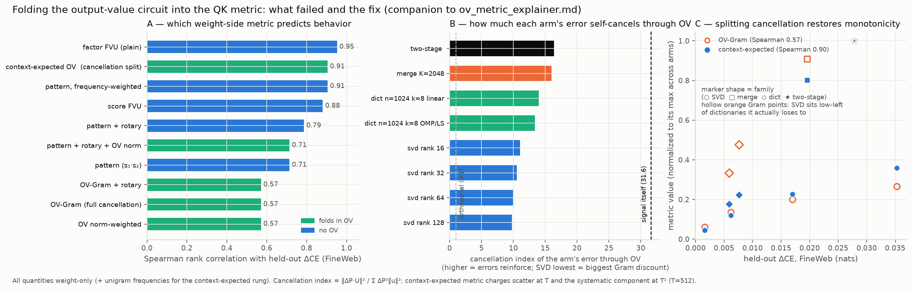

# How OV information is folded into the QK metrics, what the cancellation index measures, and how to include cancellation *correctly*

Standalone explainer (Logan request, 2026-07-22). Context: we compress the layer-0 query/key
factor tables and want a cheap weight-side metric that predicts held-out cross-entropy. Folding
the output-value (OV) circuit into the metric made prediction *worse* (Spearman 0.95 → 0.57),
which is counterintuitive — the OV circuit is literally what reads the attention pattern. This
file walks through (1) exactly how OV is folded in, (2) exactly what the cancellation index
measures, and (3) a derivation showing the two existing OV rungs are opposite limiting cases of
the *correct* metric — one forbids cancellation entirely, one over-credits it — and what the
correct in-between metric is.

---

## 1. The physical object: what a pattern error actually does

At layer 0 everything is exact and weight-only. For a context, the attention output at query
position $i$ for head $h$ is

$$\mathrm{out}_i \;=\; \sum_j P(i,j)\, u_{t_j}, \qquad u_t = W_O^h W_V^h\, \hat{e}_t \in \mathbb{R}^{1152},$$

where $P$ is the (unnormalized, no-softmax) pattern and $u_t$ is the OV output vector of token
$t$ — what attending to $t$ actually writes into the residual stream. (At layer 0 the value-bus
mixing is the identity, so this is exact.)

So if compression perturbs the pattern by $\Delta P$, the *physical* error at query $i$ is a
**vector sum** (call this equation ★):

$$e_i \;=\; \sum_j \Delta P(i,j)\, u_{t_j}. \qquad (\star)$$

Everything below is about how to summarize (★) into one number without running data through the
model. Two facts about (★) drive everything:

- Errors on tokens with small ‖u‖ (the OV null space) don't matter.
- Errors on different tokens can **cancel**: if ΔP(i,j)·u_j and ΔP(i,j′)·u_{j′} point opposite
  ways in R^1152, their sum is harmless even though each is large.

## 2. The two ways we folded OV in

Both metrics start from a sampled pattern-error matrix ΔP (2048 sampled tokens × 2048 sampled
tokens, per head; rotary variants also exist) and the matrix `U` (2048 × 1152) of OV output
vectors. They differ in how they collapse the token sum:

**Rung "pat_ov" — the norm (diagonal) weighting.**

$$m_{\mathrm{diag}} \;=\; \frac{\sum_{i,j} \Delta P(i,j)^2\, \lVert u_j\rVert^2}{\sum_{i,j} P(i,j)^2\, \lVert u_j\rVert^2}$$

Each token's error is charged by its OV magnitude, **independently** — the sum over $j$ is a sum
of squares. This respects the null space ($\lVert u\rVert \approx 0 \Rightarrow$ no charge) but
**forbids cancellation entirely**: two errors that would annihilate in (★) are both charged in full.

**Rung "pat_gram" — the full Gram (coherent) metric.**

$$m_{\mathrm{gram}} \;=\; \frac{\sum_i \bigl\lVert \sum_j \Delta P(i,j)\, u_j \bigr\rVert^2}{\sum_i \bigl\lVert \sum_j P(i,j)\, u_j \bigr\rVert^2} \;=\; \frac{\lVert \Delta P\, U\rVert_F^2}{\lVert P\, U\rVert_F^2}$$

This computes (★) literally over the whole token sample and squares the *resulting vector* —
cancellation and null space are handled exactly... **for one particular fictitious context**: the
context that contains *every sampled token simultaneously, once each*. That assumption is the
flaw, and section 4 makes it precise.

Empirically both rungs predict FineWeb ΔCE at Spearman **0.57** versus **0.95** for plain factor
FVU. They fail identically but for opposite reasons.

## 3. The cancellation index — what it measures

For each compression arm we report

$$\mathrm{cancel} \;=\; \frac{m_{\mathrm{gram}}\ \text{numerator}}{m_{\mathrm{diag}}\ \text{numerator}} \;=\; \frac{\lVert \Delta P\, U\rVert_F^2}{\sum_{i,j} \Delta P(i,j)^2\, \lVert u_j\rVert^2}.$$

Reading: if the per-token error vectors ΔP(i,j)·u_j were mutually orthogonal, the ratio would be
exactly 1. Ratio < 1 means net cancellation; ratio > 1 means the error vectors *reinforce* (point
the same way, so the vector sum is larger than the sum-of-squares suggests). Measured values:

| object | cancel index |
|---|---|
| the TRUE pattern (signal itself) | **31.6** |
| merges (K=2048, two-stage) | ≈ 16 |
| dictionaries (n=1024, k=8) | ≈ 13–14 |
| SVD (rank 16…128) | ≈ **10–11** |

Two things to notice. First, everything is far above 1: the OV vectors of different tokens are
highly correlated (they live in a low-dimensional cone — each head's `u` matrix has rank ≤ 128),
so *sums reinforce by default*; genuine "cancellation" here means *reinforcing less than the
signal does*. Second, the families differ systematically: **SVD's residual errors are the least
coherent through OV** (10–11 vs the dictionaries' 13–14). This is why the Gram metric flatters
SVD relative to the dictionaries: it awards SVD a ~25–30% coherence discount that, empirically,
held-out cross-entropy does not honor.

So the index is a *diagnostic*: when two arms differ a lot in cancel index, any post-OV energy
comparison between them is suspect. But it begs the question you asked — shouldn't the Gram
metric's accounting of cancellation be *correct*, since (★) is the physical error? Why does
honoring cancellation exactly make the prediction worse?

## 4. Why full cancellation is too generous: contexts are finite samples

The resolution: (★) is the error for a **specific context** — a specific multiset of tokens
`t_1 … t_T` at specific positions. The Gram metric evaluates (★) for one fictitious context
containing all 2048 sampled tokens with equal weight. Real contexts are **length-T samples**
(T = 512 in the frozen regime) drawn roughly from the unigram distribution `q`. Cancellation
that holds *summed over the whole vocabulary* need not hold *within a given draw* — a context
containing "music-atom tokens" but not the tokens whose errors would have cancelled them gets
the full error.

Make this precise. Fix query token $i$; write $c_j = \Delta P(i,j)\, u_j$ for the per-token error
vector, and let the context's keys be $T$ i.i.d. draws from the unigram distribution $q$ (the
no-softmax architecture makes this model apt: the output really is a plain sum over positions —
this is also exactly why the model degrades past $T \approx 512$). Then the expected squared
error is (call this equation †):

$$\mathbb{E}\lVert e_i\rVert^2 \;=\; T\left(\mathbb{E}_q\lVert c\rVert^2 - \lVert\mu\rVert^2\right) \;+\; T^2\, \lVert\mu\rVert^2, \qquad \mu = \mathbb{E}_q[c_j]. \qquad (\dagger)$$

The two existing rungs are the two terms of (†) in isolation:

- **m_diag is the first (variance) term** — the part of the error that behaves like a random
  walk across contexts. It accumulates as **T** and **never cancels** in any single context: it
  is the context-to-context scatter, and squared error is charged for scatter regardless of sign.
- **m_gram is the second (mean²) term** — the *systematic* component of the error, identical in
  every large context. This part **does** cancel exactly as the Gram metric says, and it
  accumulates as **T²**.

So: the norm rung forbids cancellation everywhere (it charges the mean component as if it were
scatter); the Gram rung credits cancellation everywhere (it treats the scatter as if it were
systematic and lets it cancel). Physically, cancellation applies **only to the mean component**.
That is the "cancellation part of the OV matrix" you asked about, and it can be folded in
properly:

## 5. The corrected metric: context-expected OV error ("pat_ctx")

Charge each arm by the expectation (†), queries weighted by their own frequency:

$$m_{\mathrm{ctx}} \;=\; \frac{\sum_i q_i \left[\, T\,(s_i - \lVert\mu_i\rVert^2) \;+\; T^2\,\lVert\mu_i\rVert^2 \,\right]}{\text{same functional of the true } P}$$

with, per query token $i$ (all weight-only plus unigram statistics):

$$\mu_i = \sum_j q_j\, \Delta P(i,j)\, u_j \quad \text{(mean error vector — the part that truly cancels)}$$

$$s_i = \sum_j q_j\, \Delta P(i,j)^2\, \lVert u_j\rVert^2 \quad \text{(second moment — the scatter floor)}$$

Inputs: the factor tables, the OV vectors `u`, the unigram frequencies `q`, and T = 512. Nothing
else. This is the exact expected squared layer-0 output error under the i.i.d.-context model —
cancellation included precisely where it physically operates (the T² mean term) and excluded
precisely where it doesn't (the T variance term). It also subsumes the frequency fix from the
ladder (rare tokens are down-weighted by `q` in both terms).

**Pre-registered expectation** (stated before the run): SVD's low cancel index means its error is
relatively scatter-dominated; $m_{\mathrm{ctx}}$ re-charges that scatter at weight $T$ without
cancellation, so it should *undo the Gram metric's SVD discount* and rank arms closer to the
truth than either pure rung.

**Result (run 2026-07-22): CONFIRMED.** Spearman versus FineWeb ΔCE across arms:

| rung | Spearman |
|---|---|
| plain factor FVU | 0.952 |
| **context-expected OV ($m_{\mathrm{ctx}}$)** | **0.905** |
| frequency-weighted pattern | 0.905 |
| OV norm-weighted / OV-Gram (both pure limits) | 0.571 |

Splitting the OV charge into its scatter ($T$) and systematic ($T^2$) components lifts the
OV-containing metric from worst in the ladder (0.571) to best-in-class (0.905, tied with the
frequency rung and near the factor metric). It now correctly places the dictionaries
($m_{\mathrm{ctx}}$ 0.027–0.034) below SVD rank 16 (0.054); the one residual misranking (SVD
rank 32 at 0.034 versus the linear dictionary at 0.034, despite a 2× ΔCE difference) is exactly
the kind of within-tie error the i.i.d. assumption predicts — see caveat 1: the dictionaries'
errors are topic-shaped, and topical co-occurrence (music tokens arrive together) makes their
within-context scatter coherent in a way unigram i.i.d. sampling cannot see. The next refinement,
if wanted, is a co-occurrence-corrected $q$ — at the cost of the metric becoming data-conditional.

## 6. Known approximations (in honesty order)

1. **i.i.d. keys**: real contexts have topical co-occurrence (music tokens cluster). This
   *underestimates* within-context coherence for topically-clustered errors — notably the
   dictionaries', whose atoms are topics. Testable by comparing m_ctx's residual misranking
   against a co-occurrence-corrected version.
2. **Query marginalized independently** of its context (a query token co-occurs with correlated
   keys). Same refinement path.
3. **Rotary/mask**: (†) is stated pre-rotary; the ladder's rope machinery can layer offsets in
   (pair-count weighted) if the pre-rotary version proves insufficient.
4. Downstream nonlinearity: (†) is the layer-0 *output* error; CE response to that error is
   assumed monotone in its magnitude. All rungs share this assumption; plain factor FVU's 0.95
   suggests it is not the binding constraint at current accuracy.

Implementation: `qk_ovweight.py`, rung `pat_ctx`; results land in `qk_ovweight.json` and the
ladder table of `RESULTS_l0_mdl.md`.

