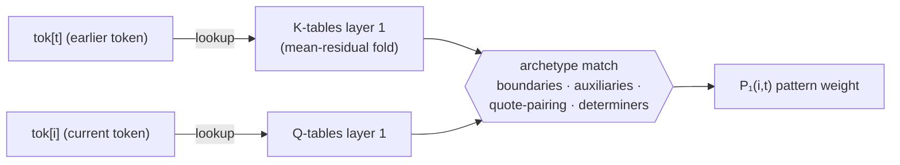
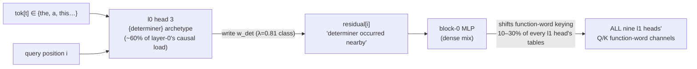
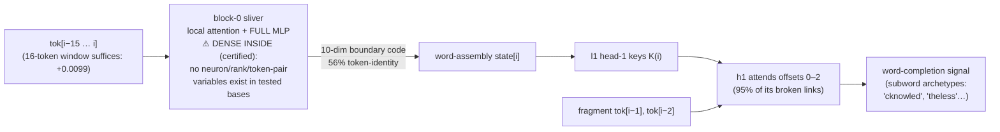

# Sub-circuit stories: all computation into the second QK pattern

*(Tick 218. Program convention: every wire carries a measured fidelity; every box is
either a named variable transform or explicitly marked dense. "P₀/P₁" = layer-0/-1
attention patterns.)*

## The coding analogy, made literal

Logan's frame: parts of the model compute variables, consume variables, convert them.
For the circuit feeding layer-1's QK pattern, we can now write most of the program:

```
tok[i]            # input variable: token identity at each position
k̂ₗ, q̂ₗ = TABLE_l0[tok]            # exact fold (weights only)
P0[i,t] = match(q̂(i), k̂(t))       # archetype match: "is tok[t] in class C and i seeking C"
det_flag[i] = Σ_t P0_h3[i,t]·v_the  # l0-h3's broadcast variable: "determiner context"
state[i] = DENSE_MIX(tok[i-15..i])  # block-0 window: word-assembly state (certified dense inside)
K1[i], Q1[i] = TABLE_l1[tok[i]] + W·code(state[i])   # tables + 16-dim context correction
P1[i,t] = match(Q1(i), K1(t))       # second QK pattern
```

Every line has a measured error bar; only `DENSE_MIX`'s interior lacks named
sub-variables — and that lack is a tested result, not an omission.

## Sub-circuit A — the static backbone (99% of layer-1's pattern function)



**Variables:** pure token identities in, class-membership scores out. **Fidelity:**
static tables alone cost +0.027–0.052 of the pattern's +2.70 total — this single
diagram is ~99% of the second QK circuit's causal function. Semantic labels for the
match node come from the validated layer-1 archetype ledger (nine heads, corrected
nulls, stability).

## Sub-circuit B — the determiner broadcast (layer 0 → layer 1)



**Variables:** `det_flag[i]` is a real, nameable intermediate — layer-0 head 3's
pattern-weighted {the}-class write. **Fidelity:** one-third of head 3's +0.078 effect
flows through layer-1 pattern formation; it is the top cross-partner in 18 of 18
weight-space channels; no dedicated reader — a broadcast variable, like a global flag
consumed by every function that keys on function words.

## Sub-circuit C — subword continuation (the hard one, now bounded)



**Variables:** input scope measured (16 tokens; 4 insufficient; 1 worse than nothing),
output law measured (10-dimensional, mostly token identity), failure class named
(lexical continuations: "gave Lindsay → L"). The ⚠ box is the one place a
variable-level story is *provably unavailable with current tools*: neuron sparsity,
weight rank, and token-pair decompositions all tie their corrected nulls. The honest
label is a function signature without a body: `state = DENSE_MIX(window)`.

## Why not fully — the three precise obstacles

1. **The dense box.** Inside `DENSE_MIX`, intermediate variables of every tested kind
   are absent with evidence (not just unfound): the mixer is holographic — neurons are
   context-soup (median token-R² 0.34) that *cancels* into a simple boundary signal.
   Sub-variable stories stop at its boundary by measurement, not by choice.
2. **Joint versus marginal wires.** Layer-1 heads are 21× super-additively redundant:
   any single wire's story is true marginally but the ensemble carries the load, so
   the diagram semantics are "contribution," not "necessity" — unlike layer 0, where
   head 3's wire is close to load-bearing in itself.
3. **Scope.** These diagrams cover the QK-pattern route only (deliberately: patching
   any other route would corrupt downstream readers of the true subspaces). The OV/
   value route and layers 2–17 consume the same variables in unmapped ways.

**Status: two of three sub-circuits are full variable-level stories with measured
wires; the third is a story with one certified-dense function call whose signature,
scope, and cost are known — the "I know it sorts, input size 16, but not the
algorithm" level of understanding.**
