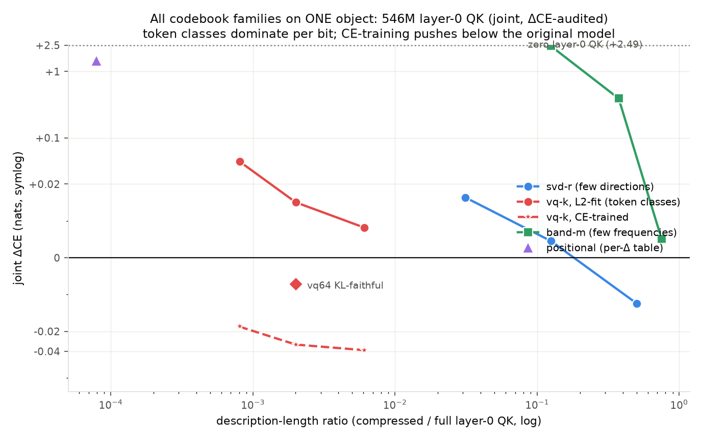

# The codebook methods: code + intuition + where each wins

Every method answers the same question: *given the folded vocab-space object (per-token
factor pairs (q̂, k̂), or the band matrices {C_f, S_f} they generate), what is the cheapest
description that preserves behavior (ΔCE ≤ ε)?* All snippets below are the working cores
from this repo (`codebooks.py`, `tier2_audit_full.py`, `tier2_ce_codebooks.py`).

---

## 1. Truncated SVD — "few directions, dense codes"

```python
U, S, Vt = torch.linalg.svd(factors, full_matrices=False)   # factors: (V, d_head)
factors_r = U[:, :r] @ torch.diag(S[:r]) @ Vt[:r]           # DL = r·(V + d_head + 1)
```
Every token keeps its own coefficient vector, but in an r-dim subspace. The spectral
prior: computation = a few global directions. **Wins:** low-rank plants (battery, at
exactly true DL); tiny-model layer-0 (svd16 free everywhere — shallow models are
rank-structured); the sqrd12 H3 head (low-rank AND load-bearing). **Loses:** blocky/
positional structure (pays 45–1000× true DL on those plants).

## 2. Token-VQ / bicluster — "few objects"

```python
C, assign = kmeans(torch.cat([q_hat, k_hat], 1), k)   # cluster TOKENS
q_c, k_c = C[assign][:, :d], C[assign][:, d:]         # token -> its class's factors
# DL = k·2d floats + V·log2(k) bits
```
Tokens sharing a class become interchangeable *for this head*. (The battery's 2-D
version — separate row/col partitions with block means — is `fit_bicluster`, spectral-
initialized because random init gets stuck; the battery caught that twice.)
**Wins:** the 546M's QK — layer-0 selection is a ~256-class computation (joint vq256
+0.008 raw, **negative once CE-trained**); classes are readable (determiners, suffixes,
digit classes...). **Loses:** tiny-model QK (vq1 +0.2–2.2) and OV content everywhere
(vq64 +2.0) — fine token identity resists classing.

## 3. Band sparsity — "few RoPE frequencies"

```python
mass = (qa**2).sum(0) + (qb**2).sum(0)          # per-band factor energy
keep = mass.argsort(descending=True)[:m]         # zero the rest
# DL = 2·V·2m floats + band mask
```
The RoPE expansion makes each head a sum over frequency bands; a head using few bands is
positional-flavored. **Wins:** nothing outright so far (mid-band concentration exists —
one branch put 57% of mass in one band — but never enough to beat svd/vq at matched ΔCE).

## 4. Toeplitz / positional — "scores depend only on distance"

```python
c = diagonal_means(M)                # c(Δ); optionally Fourier-truncate
M_hat[i, j] = c[i - j]               # DL = (2T−1) floats, or 2·modes+1
# behavioral version: replace scores by their per-Δ mean (token identity destroyed)
```
**Wins:** the Toeplitz plant at exactly true DL. **Loses (clean negative):** every real
head audited — 0/32 tiny-model branches are behaviorally positional; even the prev-token
head fails (pattern-positionality ≠ score-positionality: it *attends* at Δ=1 but its
score *magnitudes* carry token content).

## 5. Conjunction — "AND of two cheap structures"

```python
# alternate: block means (weighted LS given gate) <-> gate c(Δ) (LS given blocks)
B = weighted_block_means(M, rows, cols, T=c[d_idx])
c = diag_ratio(M * M1, M1 * M1)          # M1 = B[rows][:, cols]
# DL = DL(blocks) + DL(gate Fourier) + 1
```
Exploits the bilinear-attention product: DL(k₁)+DL(k₂) where a flat codebook pays k₁·k₂.
**Wins:** the conjunction plant (33× over SVD). On real heads the conjunction is
architectural (two branches) — measured causally: the identity conjunct lives in one
branch per copy head (via L0H1), cross-head redundant.

## 6. Conditional-mean lookup (path-folded) — "0th order in context"

```python
kbar[token] = mean of key vectors at positions whose PREVIOUS token == token
k(position j) := kbar[b[j-1]]        # DL = V·d_head floats per table
```
**Wins as a STRUCTURE METRIC** (identity conjunct at 2200× chance, matching causal
ablations where generic weights fail). **Loses as a COMPUTATION** (−0.62…−0.74 P(copy)
substituted): structure-visible ≠ computation-sufficient; circuits consume
context-dependent components the mean discards.

## 7. CE/KL-trained codebooks — "same structure, right objective"

```python
# freeze assignments; centroid tables become the ONLY trainable params
s1 = scores_from_factors(qtab[assign], ktab[assign], tokens)   # differentiable
loss = F.cross_entropy(model_forward_with(s1, s2), targets)    # or KL to teacher
```
The basis_aligned e7 lesson: fit the representation under the metric that matters.
**Wins:** QK everywhere it applies — vq64 CE-trained **beats the original model**
(−0.032; KL-faithful −0.007). **Partial on OV** (~38% recovery only — content is
genuinely class-resistant, next: sparse coding).

---



One graph, one object (546M layer-0 QK, joint over all 9 heads × 2 branches): each
family's DL-vs-ΔCE curve. Reading: **vq dominates per bit** (vq256 = +0.008 at 0.6% DL;
CE-trained goes negative at 0.08–0.6%); **svd is respectable at moderate ratios**
(svd16 = +0.0045 at 12.5%, svd64 negative at 50%) but pays ~20× more DL than vq for the
same ΔCE; **band** needs 48/64 bands; **positional** caps out at +1.47 — which yields a
tidy decomposition: of layer-0 QK's ~2.5-nat total contribution, ~1.0 is purely
positional and ~1.5 is token-selective, and token CLASSES capture nearly all of the
selective part. (OV is the mirror image — see 07_ov_blocks.md.)
