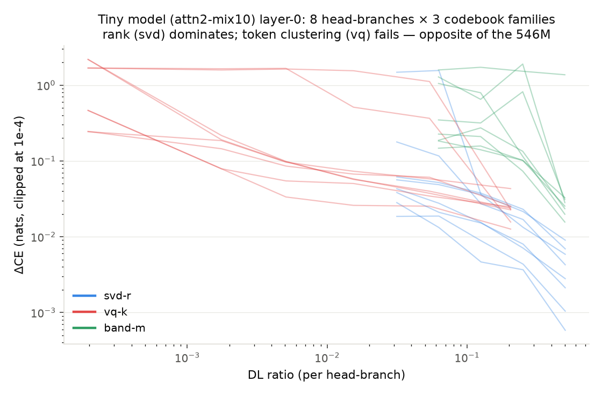

# Tiny models (attn2, V=5120): layer-0 MDL

## How compression works

Per (head, branch), the folded object is a factor pair (q̂, k̂) ∈ (V×32)². Codebooks:
**svd-r** (rank-r truncation of both factors), **vq-k** (k-means over tokens on [q̂|k̂];
each token replaced by its cluster's factors — "which tokens are interchangeable for this
head"), **band-m** (keep m of 16 RoPE frequency bands), **positional** (replace scores by
their per-Δ mean — token identity destroyed, position kept), **zero**. Every candidate is
audited by ΔCE with the compressed scores patched into the live model (reference forward
reproduces the model bit-exactly; baseline CE 4.634 ≈ recorded 4.637).

## Results (attn2-mix10-seed0)

- **Rank is the compressible axis**: svd16 (half rank) is free on all 8 head-branches;
  svd4–8 suffices for half; rank-1 costs only +0.02–0.18 on 5/8. Joint (all branches at
  once): svd16 +0.054, svd8 +0.202 — mildly non-additive.
- **Token clustering fails**: vq1 costs +0.24–2.19 per branch; the joint vq frontier is
  terrible (all-vq256 +2.73). The exact opposite of the 546M model (see file 04):
  a 2-layer model must push fine-grained token identity through layer-0 QK; an 18-layer
  model routes coarse token types.
- **No positional branches exist** (32 audited across two models, threshold |ΔCE| ≤ 0.01;
  minimum observed +0.012): the spec's predicted positional-head DL collapse is falsified
  in this zoo. Sharpest sub-finding: **pattern-positionality ≠ score-positionality** —
  the rp model's prev-token head attends at Δ=1 on average, yet positional-averaging its
  SCORES destroys the copy circuit (−0.74 P(copy)): its score magnitudes carry token
  content that downstream identity branches read.
- Zeroing all layer-0 QK: +16.7 nats (layer 0 is half the model).

Caveats: joint-vq non-monotonicity (k-means seed variance) flagged; single eval
distribution (the model's own val split).
