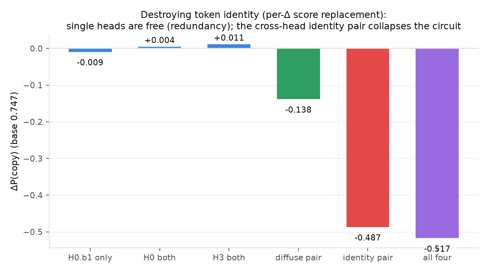
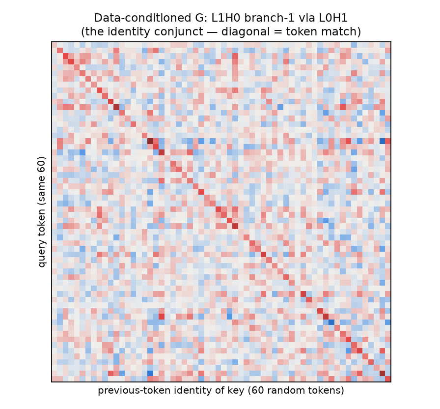

# The conjunction test: how a bilinear-attention induction circuit factors

**Model:** attn2-s30k-mix50-rp-dense-seed0 (genuine content-based copying: P(copy) 0.747
at period 96, where positional copying scores chance). Copy heads L1H0/L1H3 (a documented
redundant pair); prev-token feeder L0H1. Re-anchored from the spec's attn2-seed0 (missing
from disk — logged question).

## The hypothesis (spec §3)

Bilinear attention scores are a PRODUCT of two bilinear forms — an architectural AND.
Hypothesis: the induction computation factors as
(token-identity match in one branch) ∧ (positional structure in the other).

## Causal result: identity is branch-specific and cross-head redundant

Intervention = replace a branch's scores by their per-Δ mean (destroys token identity,
keeps the positional profile; zeroing is NOT branch-specific in a product — that was a
design lesson, since s₁·s₂ dies with either factor).



- Any single branch, or even both branches of ONE head: ≈ free (the twin covers).
- The two **L0H1-key-fed branches jointly (H0.b1 + H3.b2): −0.487** — the circuit
  collapses. The two diffuse branches jointly: −0.138.
- Key-path ablations agree: H0.b1's and H3.b2's key inputs depend on L0H1 ALONE
  (−0.51/−0.49; all other L0 heads ≈ 0).

## Weight-space confirmation needs data conditioning

Generic path-folded weights find identity structure only in (H3.b2 via L0H0) — the wrong
source. The DATA-CONDITIONED metric (conditional-mean pre-rotary q/k vectors by token
identity on induction data, key side decomposed by L0 source) finds it exactly where the
causal probes say:

| cell | identity hit rate (chance 0.0002) | diag z |
|---|---|---|
| L1H0.b1 via **L0H1** | **0.444** | +3.23 |
| L1H3.b2 via **L0H1** (sign-corrected) | **0.423** | −3.22 |
| every other (branch × source) cell | ≤ 0.0004 | \|z\| ≤ 0.09 |

The sign flip is pure branch gauge ((−s₁)(−s₂) = s₁s₂): the two copy heads implement the
SAME identity conjunct, in opposite branches, with opposite signs.



## Examples from the decomposition

Query token → its top-3 matched previous-key tokens under the conditioned identity
conjunct (`conjunction_examples.txt` for more):

```
(see conjunction_examples.txt — * marks the correct self-match)
```

## Verdict

**PASS (re-anchored), sharper than pre-registered:** the conjunction exists and is
branch-specific with the identity conjunct routed via the prev-token head — but it is
CROSS-HEAD redundant (the single-head collapse criterion fails for exactly the documented
redundancy reason), and the "positional" branch is diffuse rather than cleanly positional
(see file 02: no behaviorally-positional branches exist in this zoo).
