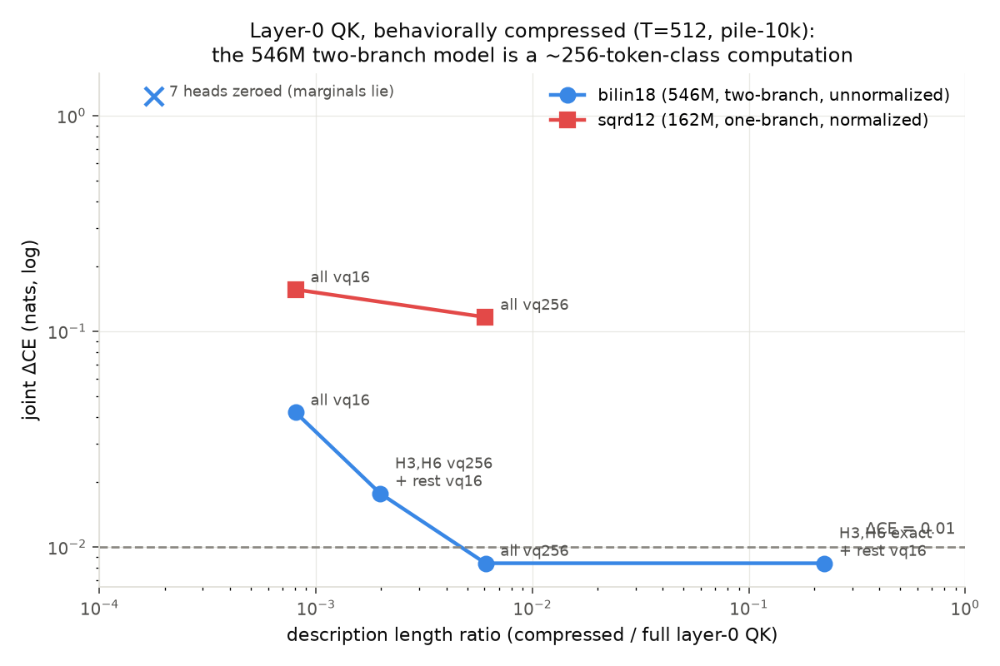

# 546M bilinear-attention model (bilin18), layer-0

**Model:** gpt2-bilinear-sqrd-attn-18l-9h-1152embd — two independent QK branches per
head, pattern = (q₁·k₁)(q₂·k₂)/D² (unnormalized, causal-masked), bilinear MLPs.
**Model property found during CE verification:** healthy CE (≈3.2–3.6) only up to
~512 context; beyond that the unnormalized product's row mass grows with key count and
CE explodes (10.9 by position 1000). All audits at T=512 (baseline CE 3.234).

## How the compression works

Layer-0 QK folds EXACTLY into per-token factors: for each of 9 heads × 2 branches, a
pair (q̂, k̂) ∈ (V × 128)² of unit-RMS vectors, with scores recovered through the 64-band
RoPE expansion (gate: 1e-15). Full layer-0 QK = 884 MiB of factors.

Codebooks act on factors (V×V never materialized): **svd-r**, **vq-k** (k-means over
tokens on [q̂|k̂] — the "token classes interchangeable for this head" prior), **band-m**
(RoPE frequency sparsity), **zero**. Binding audit: ΔCE with compressed scores patched
into the live model.

## Headline: layer-0 QK is behaviorally a ~256-token-class computation

| joint compression | DL ratio | ΔCE |
|---|---|---|
| all 9 heads → vq256 | 6.1e-3 (165×) | **+0.0084** |
| H3,H6 → vq256, rest vq16 | 2.0e-3 (500×) | +0.0177 |
| all vq16 | 8.1e-4 (1240×) | +0.0420 |
| zero the 7 individually-free heads | 0.223 | **+0.534** |

Three lessons:
1. **Marginals don't compose.** 7 of 9 heads can be zeroed individually at |ΔCE| ≤ 0.011,
   but zeroing them together costs +0.534 — individually expendable, collectively
   load-bearing. Coarse VQ (not ablation) is the right compression for redundant heads.
2. **The pattern/Frobenius lens is useless here**: vq16 fits with pattern-MSE 0.14–0.95
   cost |ΔCE| ≤ 0.011, and H3's vq16 IMPROVES CE by 0.011.
3. Only H3 (+0.034 ablated) and H6 (+0.010) resist ablation individually; each
   compresses ~1250× per head-branch.

## What the token classes are (examples)

Nearest-to-centroid exemplars of the vq16 classes (full list:
`vq16_exemplars.txt`) — real linguistic structure:

- **determiners/possessives** (305 toks): `The | our | your | his | whose`
- **derivational suffixes**: `ngth | comings | otomy | ising | icians | ations`
- **abstract nouns**: `nuance | dogma | quirks | viewpoints | outcomes | adulthood`
- **past-tense verbs / participles**: `exclaimed | overlooked | intrigued | begged`
- **word-fragments (mid-BPE)**: `conqu | ufact | depl | hect | princ`
- **numbers / proper names / blocks**: `1888 | 614 | Alps | Byrne | ████`

## CE-trained codebooks (the basis_aligned e7 lesson applied)

Freeze each token's cluster assignment, train the centroid factor tables through the
frozen model on held-out-disjoint pile-10k CE (bf16, clipped):

<!-- CE_TRAINED_TABLE -->

Caveats: single eval distribution (pile-10k) at T=512; vq codebooks are L2-fit on factors
except where CE-trained; layer-0 only (deeper layers need path folding — Tier 3).
