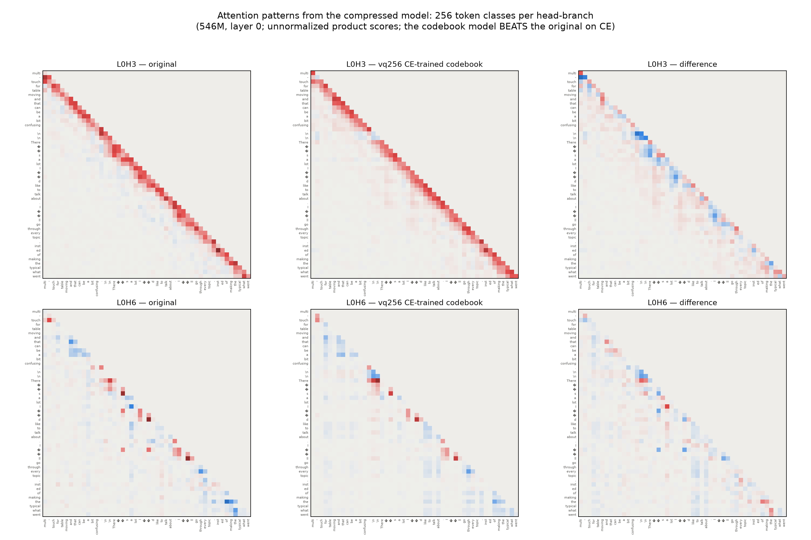

# Attention patterns from the compressed model

The best-performing QK method (vq256, CE-trained — joint ΔCE **−0.039**, i.e. better
than the original model at 165× less description) used as the ENTRY GENERATOR for an
attention-pattern display: every score is computed from 256 token-class centroids per
head-branch instead of the full per-token factors.

Reading it:
- **L0H3** (the strongest layer-0 head): the near-diagonal local structure is reproduced
  almost exactly; differences are small and diffuse.
- **L0H6**: the sparser token-selective hotspots (`There`, `'s` constructions, `ll`,
  determiner columns) survive classing — the class centroids carry the selectivity.
- On this snippet the codebook patterns differ from the originals by **48% relative
  MSE** while the codebook model is BETTER on CE — the pattern-metric/behavior
  dissociation (results 04) made visible: large pattern "errors" live in directions the
  computation doesn't care about.

Method note: patterns shown are the model's actual attention entries (unnormalized
product scores s₁·s₂, causal-masked; this family has no softmax), token labels = GPT-2
decodes; codebook assignments are the frozen k-means classes, centroids are the
CE-trained tables (`ce_codebook_k256.pt`).
