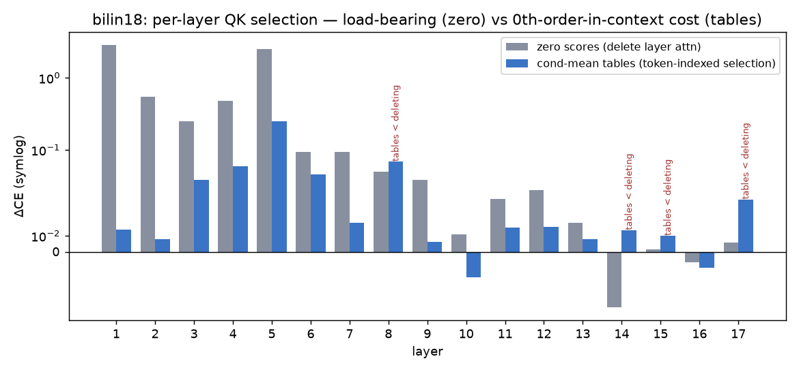

# Layer 1: conditional-mean codebooks (selection is nearly token-deterministic)

Everything before this file compressed **layer 0**, where folding the embedding into the
QK maps is *exact*: a token's query/key factor is a fixed function of its identity. At
layer 1 that breaks — the input is the layer-0 output, which depends on context, so
there is no weights-only vocab table to fold.

## Method: estimate the table from data instead of folding it from weights

For each head and branch, run the model over 524k pile tokens, capture the layer-1
query/key factors **post-QK-norm, pre-RoPE** (the same gauge point the layer-0 folding
uses), and average them by current-token identity:

```python
# capture pass (layers 0-1 only, no logits needed)
z = F.rms_norm(lin(h1).view(B, T, NH, HD), (HD,))     # h1 = layer-1 normed input
acc[name].index_add_(0, tokens.reshape(-1), z.reshape(-1, NH*HD))
cnt.index_add_(0, tokens.reshape(-1), ones)
qbar = acc / cnt   # (V, NH, HD): the 0th-order-in-context factor table
```

Unseen vocab rows (9% of audit tokens) fall back to the global mean. The tables are then
renormalized to unit RMS — the QK-norm shell is where the live factors actually live —
and patched into the model with the *same* `scores_from_factors` RoPE expansion used for
layer 0. Audit = full-18-layer ΔCE at T=512 (binding metric).

## Results (`../l1_condmean_qk.json`)

| arm | ΔCE |
|---|---|
| zero layer-1 scores (control) | +2.820 |
| cond-mean tables, raw | +0.040 |
| **cond-mean tables, unit-RMS** | **+0.014** |
| + vq256 (shared [q\|k] partition per head-branch) | +0.092 (L2-fit) |
| + vq1024 | +0.064 (L2-fit) |

## What this means

1. **Layer-1 attention selection is ~0th-order in context.** The layer is heavily
   load-bearing (+2.82 when silenced), yet replacing every layer-1 query/key with a
   pure function of the current token costs +0.014. Whatever context the layer-0 output
   mixes into the layer-1 QK factors, the *selection decision* barely uses it. This is
   the same asymmetry seen everywhere in the program — selection tolerates coarseness,
   carriage doesn't — now in the **context** dimension: the tier-3 0th-order lookup that
   collapsed for OV *content* (file 06) works nearly for free for *selection*.
2. **Gauge matters**: raw conditional means (whose norm shrinks for high-variance
   tokens) cost 3× more than unit-RMS renormalized ones. Averaging must respect the
   QK-norm shell.
3. **Classing costs more here than at layer 0** (vq256: +0.092 vs +0.008): the
   data-estimated tables are noisier objects than folded weights, so class centroids
   blur genuinely distinct rows. CE-trained class tables (assignments frozen, ~1M floats
   through the frozen model) are the standard repair — `../l1_ce_codebook.py`.

Caveats: single eval distribution (pile-10k, T=512); the +0.014 includes the 9%
global-mean fallback, so it is an upper bound on the intrinsic 0th-order error;
estimated on the same distribution as the audit (disjoint chunks).

## The depth sweep: three regimes, one contextual layer

Same method at every layer (`../layers_condmean_sweep.py`, `..._sweep2.py`), each layer
patched ALONE, zero-scores control alongside:



| regime | layers | evidence |
|---|---|---|
| load-bearing AND ~token-deterministic | 1, 2, 4 (and 3, 6, 7) | zero +2.82/+0.55/+0.48; tables +0.014/+0.008/+0.059 |
| load-bearing AND genuinely contextual | **5 only** | zero +2.51; tables +0.251 (90% recovered, gap real) |
| barely load-bearing; tables ≥ deletion | 8, 15, 17 | tables cost MORE than zeroing the layer |
| attention actively harmful on pile | 14 (and mildly 16) | zero = **−0.035** — deleting improves CE |
| tables BEAT the live model | 10, 16 | cond-mean −0.016/−0.010 — coarseness as regularizer |

Layer 5 is the only place in the 546M model where attention *selection* consumes context
it can't live without. Everywhere else, what the QK circuit computes is (to within a few
hundredths of a nat) a function of the two token identities plus relative position.

## Composing the menu (stage A): marginals lie

Picking each layer's best treatment (table 12 layers / zero 8,14,15,17 / live 5) and
applying them SIMULTANEOUSLY (`../all_menu.py`): **+1.440**, vs +0.146 sum of parts.
All-table: +1.920 vs +0.234. A 10× superadditive blowup — each layer's tables were
estimated under the live lower stack, and patching the lower layers destroys exactly that
distribution. Same marginals-don't-compose behavior as the layer-0 grand (file 09), at
model scale. Stage B (joint CE repair of vq256 tables at all 13 non-zeroed layers,
15.3M floats, `../menu_trained.py`) tests whether behavioral training closes it.
