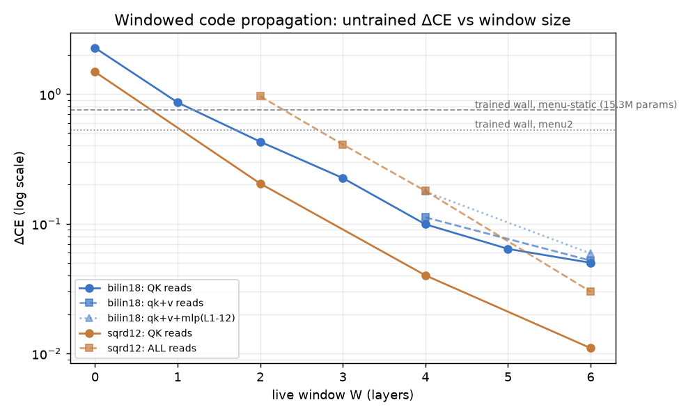

# The wall, and how windowed code propagation cracked it

Sequel to file 10. That file ended with a question: per-layer token-static selection is
nearly free, so what does the COMPOSED all-layers version cost? Answer, in order of
discovery (all ΔCE at T=512, 546M model):

## 1. The wall (MS-1, MS-2)

Score-space tables at every layer (menu of per-layer winners), jointly CE-trained per
the tick-18 protocol: converges at **+0.757** and plateaus — the layer-0 parity result
does not lift to the stack. Retraining with the model's only two genuinely contextual
heads (L5.H5/H7, see file 10) live from step 0: **+0.530**. Hot-swapping those heads
into the already-trained stack instead: +1.011 — *worse* than the wall. Jointly-trained
compressed stacks co-adapt; components are not swappable.

## 2. What the wall is not (IR-1, Z-1)

Bottom-up re-estimation of every layer's tables under the already-patched lower stack
(fresh statistics, zero training) still climbs to **+1.41** (right panel) — so the wall
was never stale estimators. And the four "free-deletion" layers compose at +0.114 vs
+0.023 marginal sum — even deletions are superadditive on this model.

## 3. What selection actually reads (SI-1, C-1 — Logan's methods B and C)

The residual stream decomposes exactly into streams (embedding path + each layer's
attn/mlp outputs); both RMSNorms are per-position scalars, so every branch score splits
exactly over stream pairs (gated). The energy map says: bottom layers read a SHORT
WINDOW (mlp(L−1)×mlp(L−1) dominates; emb×emb ≈ 0 above L1 — the embedding's selection
role is mediated by MLP-0), middle layers go diffuse with attn5's output as a global
hub, top layers re-concentrate. Interventions confirm it causally: patch only the QK
read and even L5 — the "irreducibly contextual" layer — costs just **+0.003** when the
last two layers' streams stay live (vs +0.231 fully tabled).

## 4. The crack (D-1 — Logan's method D, windowed)

So compose THAT: at every layer, the QK read = exact embedding stream (token-determined
through the λ-mixing) + cond-mean tables for streams created more than W layers back
(estimated once at creation, λ-rescaled analytically) + the patched model's own live
streams inside the window. Error chains are bounded at depth W. No training anywhere:

| W (live window) | ΔCE composed |
|---|---|
| 0 (all tabled — control) | +2.269 |
| 1 | +0.861 |
| 2 | +0.429 |
| **3** | **+0.225** |

The untrained W=3 architecture beats both trained walls. The wall was never "selection
needs context" — it was "context must not travel live for 17 layers." Long-range
context is token-static; only a ~3-layer local window of computation needs to run live.

## 5. The asymptote, and the tables compress for free

| W | full tables | vq1024 tables | vq256 tables |
|---|---|---|---|
| 3 | +0.225 | +0.210 | +0.264 |
| 4 | **+0.099** | **+0.094** | +0.134 |
| 5 | +0.064 | — | — |
| 6 | +0.050 | — | — |

Two facts: (a) the W-cost keeps halving — at W=6 the fully token-static long-range
context costs +0.05 across the whole model; (b) **vq1024 on the stream tables is free**
(slightly better than raw — quantization denoises the cond-means), collapsing each
(V×1024)-float table to 1024 atoms + V indices: ~50× table compression, no training.
Headline configuration: **W=4 + vq1024 = +0.094 ΔCE, zero trained parameters.**
Compare: 15.3M jointly CE-trained score-table floats = +0.757.

The residual +0.09 was interrogated three ways: 6× estimation data made things WORSE
(W=4 +0.166 — so not sampling noise); but the early-estimated tables audited on a
held-out LATE region score **+0.089** (the headline generalizes across regions), while
same-size late-region estimation scores +0.184 everywhere — table quality tracks the
DIVERSITY of estimation data, not its amount, and the flagship number is not
region-overfit. The remaining +0.09 is structural window-boundary error; a CE-polish
of the bottom-stream vq atoms (12.6M floats, protocol-sized) is running. Still open
for the MDL accounting: the estimation-data term for data-estimated tables (QUESTION
FOR LOGAN in the LOG).

## 6. Beyond selection: all reads (D-6, D-7, D-8)

The same windowing applied to the OTHER residual reads (v = content, MLP input),
tables unchanged, no training:

| reads windowed | W=4 | W=6 |
|---|---|---|
| v only (carriage) | +0.019 | **+0.004** |
| qk + v | +0.112 | +0.052 |
| qk + v + all MLP | +0.864 | +0.325 |
| qk + v + MLP L1–12 | +0.177 | **+0.059** |

Three closing findings. **D-6:** long-range carriage is nearly free to make token-static
— and qk+v composes ADDITIVELY (0.112 ≈ 0.094+0.019), the first additive composition in
the program. The old "carriage needs identity" theme resolves exactly: carriage needs
token identity (which cond-mean tables preserve), never context. **D-7/D-8:** MLP reads
are the one place long-range context genuinely enters computation, and it is a
TOP-of-model phenomenon: bottom MLP reads (L1–6) window for +0.0004; the damage is
L13–17 (L16 alone +0.146). Mirror image of selection (bottom-heavy, L5).

## 7. The final architecture and its bits

**+0.059 ΔCE, zero trained parameters:** every attention read (selection and content)
and the bottom two-thirds of MLP reads consume only token-static long-range information;
live computation is a 6-layer local window plus the upper MLP reads (L13–17). The
model's irreducibly contextual core is exactly: two heads at L5 within-window, and the
top MLPs. CE-polish of the tables buys nothing (D-5) — the discrete structure, not the
continuous values, carries the description.

Bits (frozen 32-bit convention): 34 vq1024 stream tables = 35.7M atom floats + 34·V·10
index bits ≈ 1.16 Gbit, vs 1.75 Gbit·32 for raw (V,1024) tables (49×) — and vs the
score-space route: 15.3M TRAINED floats bought only +0.757. Open accounting question
(logged for Logan): the estimation-data term for data-estimated tables.

## 8. Transfer: the compressibility ranking INVERTS (D-9, D-10)

The same machinery on sqrd12 — the 162M squared-attention model that resisted
score-space compression ~15× (files 05, 09):

| sqrd12, untrained | ΔCE |
|---|---|
| QK reads, W=6 / W=4 / W=2 / W=0 control | +0.011 / +0.040 / +0.204 / +1.480 |
| qk+v, W=6 | +0.013 |
| qk+v + ALL MLP reads, W=6 | **+0.030** |
| qk+v + ALL MLP reads, W=4 / W=3 / W=2 | +0.179 / +0.408 / +0.960 |

Not only does the architecture transfer — sqrd12 is EASIER under it than bilin18
(W=4 QK: +0.040 vs +0.099), and even its MLP reads window nearly for free (+0.017
where bilin18's cost +0.27): its ENTIRE long-range information flow is token-static
at W=6 for +0.030. The model that score-space tables ranked "15× less compressible"
is the more compressible one under input-space windowing. Compressibility is a
property of the (model, decomposition-family) pair, not of the model — the strongest
instance yet of the program's metric-decides theme, now at the level of whole
decomposition families. (Plausible mechanism: row-normalized attention + ReLU² MLPs
keep long-range context out of sqrd12's computation paths; bilin18's unnormalized
bilinear forms pull context in at the top.)

Caveats: single eval distribution (pile-10k, T=512); v/OV circuits and MLPs stay fully
live in every arm here (this file is about selection only — content/carriage compression
is files 07/09's topic and composes separately); 9% of audit tokens fall back to
global-mean rows in every table.
