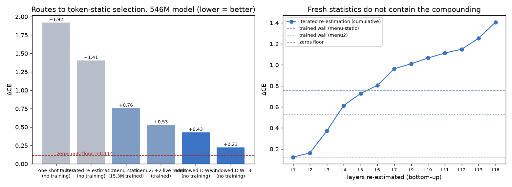

# The wall, and how windowed code propagation cracked it

Sequel to file 10. That file ended with a question: per-layer token-static selection is
nearly free, so what does the COMPOSED all-layers version cost? Answer, in order of
discovery (all ΔCE at T=512, 546M model):

## 1. The wall (MS-1, MS-2)

Score-space tables at every layer (menu of per-layer winners), jointly CE-trained per
the tick-18 protocol: converges at **+0.757** and plateaus — the layer-0 parity result
does not lift to the stack. Retraining with the model's only two genuinely contextual
heads (L5.H5/H7, see file 10) live from step 0: **+0.530**. Hot-swapping those heads
into the already-trained stack instead: +1.011 — *worse* than the wall. Jointly-trained
compressed stacks co-adapt; components are not swappable.

## 2. What the wall is not (IR-1, Z-1)

Bottom-up re-estimation of every layer's tables under the already-patched lower stack
(fresh statistics, zero training) still climbs to **+1.41** (right panel) — so the wall
was never stale estimators. And the four "free-deletion" layers compose at +0.114 vs
+0.023 marginal sum — even deletions are superadditive on this model.

## 3. What selection actually reads (SI-1, C-1 — Logan's methods B and C)

The residual stream decomposes exactly into streams (embedding path + each layer's
attn/mlp outputs); both RMSNorms are per-position scalars, so every branch score splits
exactly over stream pairs (gated). The energy map says: bottom layers read a SHORT
WINDOW (mlp(L−1)×mlp(L−1) dominates; emb×emb ≈ 0 above L1 — the embedding's selection
role is mediated by MLP-0), middle layers go diffuse with attn5's output as a global
hub, top layers re-concentrate. Interventions confirm it causally: patch only the QK
read and even L5 — the "irreducibly contextual" layer — costs just **+0.003** when the
last two layers' streams stay live (vs +0.231 fully tabled).

## 4. The crack (D-1 — Logan's method D, windowed)

So compose THAT: at every layer, the QK read = exact embedding stream (token-determined
through the λ-mixing) + cond-mean tables for streams created more than W layers back
(estimated once at creation, λ-rescaled analytically) + the patched model's own live
streams inside the window. Error chains are bounded at depth W. No training anywhere:

| W (live window) | ΔCE composed |
|---|---|
| 0 (all tabled — control) | +2.269 |
| 1 | +0.861 |
| 2 | +0.429 |
| **3** | **+0.225** |

The untrained W=3 architecture beats both trained walls. The wall was never "selection
needs context" — it was "context must not travel live for 17 layers." Long-range
context is token-static; only a ~3-layer local window of computation needs to run live.

## 5. The asymptote, and the tables compress for free

| W | full tables | vq1024 tables | vq256 tables |
|---|---|---|---|
| 3 | +0.225 | +0.210 | +0.264 |
| 4 | **+0.099** | **+0.094** | +0.134 |
| 5 | +0.064 | — | — |
| 6 | +0.050 | — | — |

Two facts: (a) the W-cost keeps halving — at W=6 the fully token-static long-range
context costs +0.05 across the whole model; (b) **vq1024 on the stream tables is free**
(slightly better than raw — quantization denoises the cond-means), collapsing each
(V×1024)-float table to 1024 atoms + V indices: ~50× table compression, no training.
Headline configuration: **W=4 + vq1024 = +0.094 ΔCE, zero trained parameters.**
Compare: 15.3M jointly CE-trained score-table floats = +0.757.

Still pending for the full MDL story: the estimation-data term (these tables are
data-estimated, not weight-folded — flagged since tick 20), CE-polish if wanted, and
whether estimation noise (524k tokens) or window-boundary error dominates the residual
(+0.09) — the 6× data re-estimation run decides.

Caveats: single eval distribution (pile-10k, T=512); v/OV circuits and MLPs stay fully
live in every arm here (this file is about selection only — content/carriage compression
is files 07/09's topic and composes separately); 9% of audit tokens fall back to
global-mean rows in every table.
