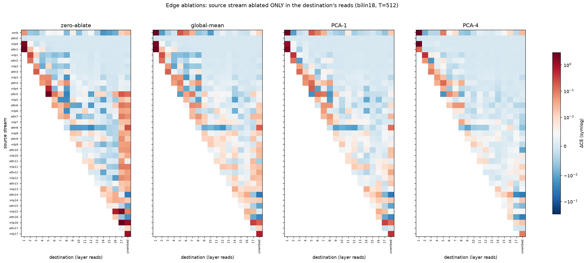
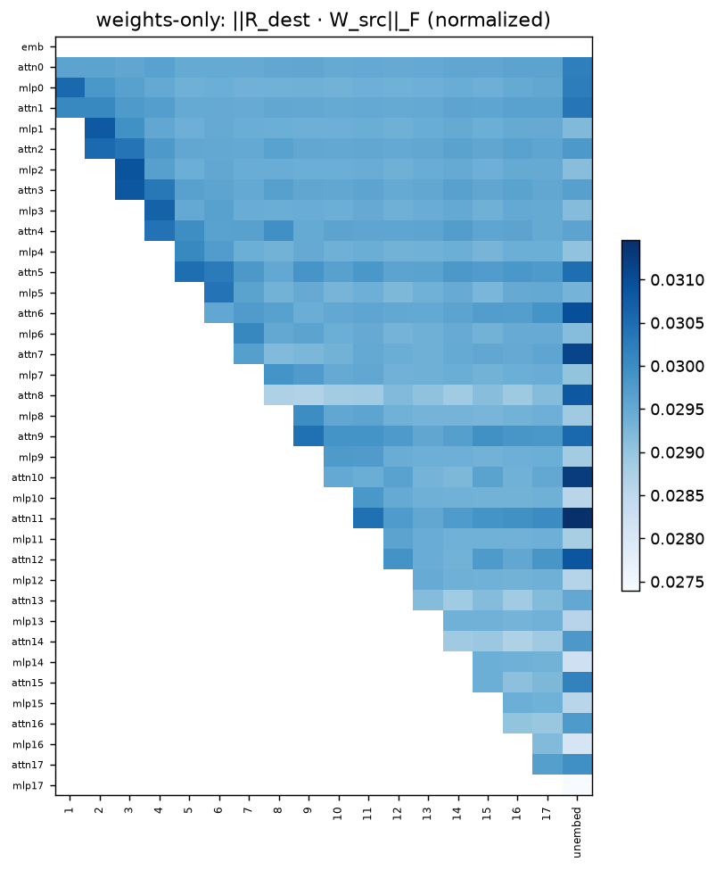

# The edge map: every module→read connection, causally priced

Logan's spec (2026-07-19): for every edge (source stream → destination layer's reads),
ablate the source **in that destination's reads only** (the stream stays live everywhere
else), four methods, ΔCE per edge, lower-triangle heatmaps, plus a weights-only importance
metric verified empirically. 377 edges × 4 methods; audit = 8 held-out chunks at T=512
(deterministic — baseline spread over 3 repeats: 0.0000).

## 1. The model's wiring is overwhelmingly sparse and local

**215 of 377 edges are free** (|ΔCE| < 0.005) under outright ZERO ablation. The load-bearing
structure is almost entirely three families:

| edge family | biggest examples (zero-ablate) |
|---|---|
| within-layer attn→mlp | attn1→L1 **+2.81** · attn5→L5 **+2.61** |
| adjacent mlp→next layer | mlp16→L17 **+3.89** · mlp0→L1 +1.98 · mlp15→L17 +1.82 · mlp4→L5 +0.62 |
| final mlps→unembedding | mlp16→unembed +1.30 · mlp17→unembed +1.08 |

This is the windowed-D result at edge resolution: computation is a chain of short hops
(attn feeds its own MLP; each MLP feeds the next layer or two), and everything longer-range
is cheap to cut or coarsen.

## 2. The attn5 "hub" — an energy-vs-causal dissociation, again

The interaction-energy map (results/11 §3) showed attn5's output in top energy pairs
throughout the upper model. The causal row says otherwise: attn5→L5 is huge (+2.61,
within-layer), then →L6 +0.11, ≈0 through L7–L16 (some mildly *negative*), and only
→L17 (+0.19) and →unembed (+0.13) matter again. The hub's mid-model *presence* is
causally inert; its real consumers are its own layer and the top of the model. Fourth
instance of the program's oldest lesson: energy/correlational maps locate structure,
only ablation prices it.

## 3. The method ladder: what each ablation grade buys

Over the 67 edges with |zero| > 0.02:

| method | mean ΔCE |
|---|---|
| zero | +0.302 |
| global mean | +0.176 |
| PCA-1 (fixed subspace) | +0.156 |
| PCA-4 | +0.144 |

Global mean recovers ~40% of the damage; fixed-subspace PCA adds little beyond it and
plateaus fast — retaining half the zero damage even at rank 4. Contrast the **token-
conditional** means used by windowed-D, which made most of these same reads nearly free:
the ladder brackets cleanly as *zero < global-mean < PCA-k(fixed) ≪ cond-mean-by-token*.
What the reads need from a stream is overwhelmingly its **token-conditional component**,
not its global direction(s). (PCA-2 was deferred; PCA-1→PCA-4 already shows the plateau.)

## 4. The weights-only importance metric: complete failure

Normalized composed norm ‖R_dest·W_src‖_F against the causal map:
**Spearman ρ = 0.025 (p = 0.63, n = 359)** — zero correlation.

The empirical verification Logan asked for is decisive: this weight metric carries no
information about which edges matter. Consistent with every metric dissociation in the
program (pattern-MSE vs ΔCE, L2 vs behavioral) — weight-space alignment doesn't see the
data distribution or the nonlinear consumption of the signal. A weight-only sparsification
screen built on it would prune exactly as badly as random.

## 5. Negative edges (mildly helpful ablations)

The strongest genuinely negative edges are small: attn14→unembed −0.035, attn5→L8 −0.028,
attn8→L12 −0.024, mlp6→L8 −0.021 — a scattering of mildly harmful long-range connections,
echoing the earlier layer-level finding that deleting L14's attention helps. Nothing large
enough to exploit, but they are exactly where the wiring is *worse than absent*.

Caveats: single 8-chunk audit slice (deterministic within-slice; chunk-sampling variation
not measured — large effects are robust, sub-0.01 values indicative); one edge patched at
a time (composed edge-sets will superadditive, per the program's standing law); "mean" is
the global mean, not token-conditional.

Files: `../edge_heatmap.py` (sweep, resumable), `../edge_heatmap.json` (all 1,508 numbers),
`../plot_edges.py`, `../edge_stream_stats.pt`, `../edge_summary*.json`.
