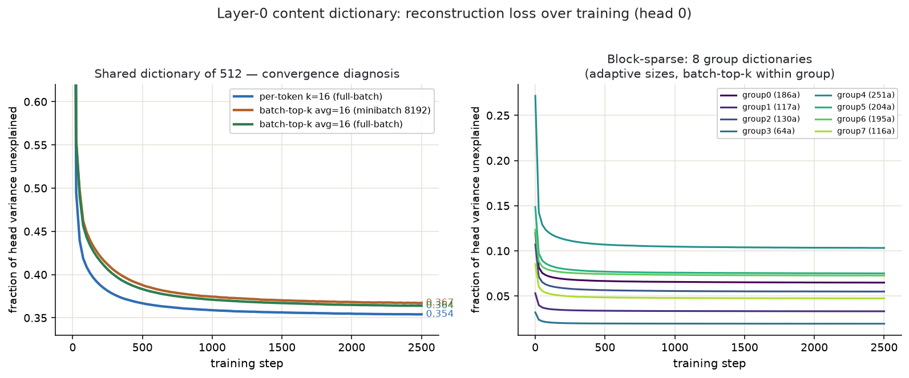

# Working explainer: the layer-0 story, and why it changes above layer 0

A running document to answer Logan's questions in plain language, one at a time. Terms
spelled out; the terse file-labels given in parentheses where useful.

---

## The setup: why layer 0 is special

A transformer layer reads from the *residual stream* — the running sum of vectors that
every layer adds to. At **layer 0**, the residual stream is just the token embeddings
(plus position). That means every quantity layer 0 computes is a fixed function of the
**token identities and their positions** — nothing contextual has entered yet. Because
of that, we can fold the embedding matrix directly into layer 0's weight matrices and
get exact vocabulary-indexed tables: for each token in the 50,257-word vocabulary we can
write down, from the weights alone, what layer 0 does with it. No estimation, no data —
the combinatorics don't blow up because everything is a function of *one* token at a
time (or, for attention, an ordered *pair* of tokens plus their distance, which is still
tractable).

Layer 0 has three circuits, and we reduce all three. Here is each one.

---

## 1. The selection circuit (labelled QK): reduced by clustering

**What it computes.** Attention decides *where each token looks*. For a query position
and a key position, it computes a score — high score means "attend here." At layer 0 the
score is a fixed function of the query token and the key token (and their separation).
So for each attention head we can build two tables, one for the query side and one for
the key side, each with one row per vocabulary word. The score between two positions is
essentially the dot product of the query word's row with the key word's row.

**How we reduce it.** We run k-means clustering on those rows — grouping the 50,257 words
into, say, 256 classes such that words in the same class have nearly the same
query/key behaviour. We then replace each word's row with its class's average row. Now
the attention scores depend only on *which class* the query and key words belong to, not
their exact identity. This costs almost nothing in loss (at 256 classes it is roughly
free, and after a light retraining it is actually slightly *better* than the original).

**Why it works here:** selection is a coarse operation. The model doesn't need to know
the query is exactly the word "apple" — it needs to know "apple" is a common noun, and
common nouns of that kind attend the same way. The clustering only affects the **scores**
(the attention pattern), not the content that gets moved.

---

## 2. The content circuit (labelled OV): reduced by a sparse dictionary

**What it computes.** Once attention has decided where to look, the *content* (value)
circuit says *what to copy* from the attended position into the output. At layer 0, each
token again has a fixed content vector we can fold from the weights — one 128-dimensional
vector per word per head.

**Why clustering fails here.** We tried the same k-means trick and it fell apart:
grouping words into classes for their *content* is destructive (256 classes cost +1.38
nats, versus roughly free for selection). The reason is that carrying a word forward
requires its **fine identity** — "apple" and "apricot" attend similarly but you cannot
substitute one for the other when you are actually transporting the word's meaning. Even
retraining only recovers about a third of the damage. This is the program's central
dichotomy: **selection needs classes, carriage needs identity.**

**How the sparse dictionary actually works.** Instead of replacing each word's content
vector with a single class average, we express it as a **sparse combination** of shared
building blocks:

1. Learn a shared *dictionary* of, say, 512 atom-vectors (per head).
2. For each word, represent its content vector as a weighted sum of just **16** of those
   512 atoms — each with its own signed coefficient. So the description of word *t* is:
   "take atom #37 times +0.8, plus atom #182 times −0.4, plus … (16 terms total)."
3. Store, per word, only which 16 atoms and their 16 coefficients.

The key difference from clustering: clustering says "you *are* one of 256 things"; the
dictionary says "you are a specific *mixture* of 16-out-of-512 things." A mixture of 16
signed atoms can express far finer distinctions than a single class label, so it
preserves the identity that content transport needs. At 512 atoms × 16 coefficients this
lands at +0.034 nats before retraining and **−0.019 after** (better than the original) —
whereas hard classing bottoms out around +0.57 even with retraining. (Files:
`results/07_ov_blocks.md`, tables "Sparse coding rescues content.")

---

## 3. The bilinear feed-forward block: yes, we reduce it too

**What it computes and why it splits cleanly.** Each layer's feed-forward block in this
model is *bilinear*: its hidden activation is `(Left · x) ⊙ (Right · x)` — two linear
projections of the input, multiplied together element-wise. Because the input `x` at
layer 0 is the sum of the token embedding (`e`) and the attention output (`a`), the
multiplication expands **exactly** into three interaction blocks:

    (Left·x) ⊙ (Right·x) = [Le⊙Re]  +  [Le⊙Ra + La⊙Re]  +  [La⊙Ra]
                            self          cross              pair

- **self** — the token embedding interacting with itself (importance +1.29 nats)
- **cross** — the current token interacting with what attention brought in (+0.84)
- **pair** — the attention output interacting with itself (+0.19)

The split is exact to about one part in ten million (a numerical gate we check before
trusting it). We reduce each block by clustering its two input sides independently, and
every block tolerates roughly 256–1024 classes per side (self at 256 classes: +0.097;
cross sides: +0.043 and +0.055; pair at 256: +0.058). So the answer to "do we interpret
and reduce layer 0's bilinear block?" is **yes** — and the finding is that every
*interaction* in the block is class-tolerant, unlike content transport. Full scoreboard
in `results/07_ov_blocks.md` ("The complete MLP-0 decomposition").

**Layer-0 summary.** Every part of layer 0 compresses to *better than the original* once
you use the right tool for each: selection by classes (−0.039), content by sparse
dictionary (−0.019), feed-forward interactions by classes (+0.022). Layer 0 is
genuinely, fully understood.

---

## 4. Why token-conditional means appear above layer 0 (and how they are computed)

**The problem.** Everything above only works because layer 0's inputs are token-
determined, so we could fold exact tables from the weights. At **layer 1 and above** the
input is the residual stream *after* layer 0 has run — which depends on the whole
preceding context, not just the current token. There is no exact table to fold from the
weights anymore. If we still want a token-indexed description, we have to **measure it
from data** instead of deriving it from weights.

**What a token-conditional mean is.** For any quantity the model computes at some layer —
call it `z` at a given position — we ask: *on average, what is `z` when the current token
is this particular word?* Formally, the table row for word *t* is the average of `z` over
every position in a corpus where the current token happens to be *t*:

    table[t]  =  average of  z(position)  over all positions whose token is t

Concretely, to compute it we:
1. Run the model over a large chunk of text (a few hundred thousand tokens).
2. At the layer of interest, capture the quantity `z` at every position (for example, a
   layer-1 attention query vector, taken at the same normalization point where the
   weights would have folded).
3. Add each captured vector into the bucket for its current token, and count.
4. Divide each bucket by its count — that average is the token's table row.
5. Renormalize the rows to the natural scale the model uses at that point (this
   "gauge" matters — skipping it triples the cost).

Words never seen fall back to the global average. The whole set of these tables per
stream is what the later machinery calls "cond-mean tables."

**What this measures — and its honest cost.** A token-conditional mean captures the part
of `z` that is a pure function of the current token, and *averages away* everything
contextual. The surprising empirical result is how much that captures: for **selection**
at higher layers, replacing the live quantity with its token-conditional mean is nearly
free — attention above layer 0 turns out to be almost as token-determined as at layer 0,
just no longer derivable from weights alone. The part it throws away — the genuinely
contextual residue — is exactly what the "live window" in the later windowed architecture
keeps. And because these tables are *measured*, not folded, we report their estimation-
data cost (how many tokens we averaged over) alongside their bit cost, and never mix the
two.

**One-line contrast with layer 0:** at layer 0 the token→quantity map is *exact and
free* (it is the weights). Above layer 0 the token→quantity map is *estimated and lossy*
(it is a corpus average), and the loss is the contextual part — small for selection,
large for the two attention heads and top feed-forward directions we later isolate.

---

*(More questions from Logan to be appended here as they come.)*

---

## 5. What the dictionary is, exactly — and what a forward pass looks like

**The dictionary (per attention head).** For head *h*, we fold the embedding into the
value projection to get a table of content vectors, one 128-dimensional vector per
vocabulary word: call it `VT[t, h]`. The dictionary for that head is three things:

- `atoms` — a matrix of `n` unit-length vectors in 128 dimensions (e.g. n = 512). These
  are the shared building blocks.
- `bias` — one 128-dimensional vector, the average content.
- `encoder` — a matrix used only to *choose and weight* atoms (learned; it need not equal
  the atoms themselves).

To encode word *t*: project its (bias-subtracted) content onto the encoder, keep the `k`
largest-magnitude coordinates (the "top-k"), and store *which* k atoms and their signed
coefficients. So word *t* is described by `k` integer atom-indices and `k` real
coefficients. Reconstruction is: `bias + Σ (coefficient × atom)` over those k atoms.

```python
# ENCODE the whole vocabulary's content for one head (offline, once)
z = (VT_h - bias) @ encoder.T            # (vocab, n) raw coefficients
vals, idx = z.abs().topk(k, dim=1)       # (vocab, k) which atoms
coeff = torch.gather(z, 1, idx)          # (vocab, k) signed coefficients
# stored: idx (k int per word) + coeff (k float per word) + atoms + bias

# RECONSTRUCT the value table from the sparse code
VT_hat = bias + (coeff.unsqueeze(-1) * atoms[idx]).sum(dim=1)   # (vocab, 128)
```

**How it enters a forward pass — yes, it is essentially an indexing operation.** In the
live model, layer-0 attention computes each token's value vector by running the value
projection on the token's embedding. The reduction replaces that with a *table lookup*:
the value vector for token *t* is just row *t* of the reconstructed table. Because the
reconstructed table is itself defined by the sparse code, you can either (a) precompute
the whole `VT_hat` table and index into it, or (b) index the per-token code directly and
sum the k atoms on the fly — mathematically identical. In the actual audit code the
attention block's only change is one line:

```python
# LIVE model:
v = a.c_v(h).view(B, T, NH, HD)          # value = projection of the residual

# REDUCED (layer 0 only): value = sparse-dictionary table lookup by token id
v = VT_hat[token_ids]                     # (batch, seq, heads, 128) — pure gather
```

Everything downstream — the attention pattern, the mix, the rest of the layers — is
untouched. So "how is the decomposition included?" — the decomposition *defines a table*,
and the forward pass *indexes that table by the current token* instead of recomputing the
value from weights. The embedding never appears explicitly at layer 0 anymore; it has been
folded into (and then compressed inside) the table.

### Variants we are measuring (Logan's requests)

**Batch-top-k.** Per-token top-k forces *exactly* k atoms on every word — wasteful for
easy words, too tight for hard ones. Batch-top-k instead keeps the largest `k × vocab`
coefficients across the *entire* code matrix at once, so k is only the *average*: common
easy words spend fewer atoms, rare hard words spend more, at the same total budget.

```python
z = (VT_h - bias) @ encoder.T                 # (vocab, n)
nnz = k_avg * vocab                           # total budget across all words
thresh = z.abs().reshape(-1).topk(nnz).values.min()
z_sparse = z * (z.abs() >= thresh)            # flexible per-word sparsity
VT_hat = bias + z_sparse @ atoms
```

**Routed / block-sparse.** Instead of one big shared dictionary, cluster the vocabulary
into groups (by embedding similarity) and give each group its *own* small dictionary and
its own sparsity — your picture of "some words use 8-of-64, others 8-of-a-different-128."
Words route to their group's dictionary; only that group's atoms are candidates.

```python
group = kmeans_labels(embeddings)             # (vocab,) which group each word is in
for g in range(num_groups):
    ids = (group == g).nonzero()
    atoms_g, bias_g, enc_g = train_dict(VT_h[ids], n_g[g], k_g[g])   # own dict per group
    VT_hat[ids] = encode_reconstruct(VT_h[ids], atoms_g, bias_g, enc_g, k_g[g])
# bits: sum over groups of (atoms_g) + per-word codes + a small group-id per word
```

The bet: specialized small dictionaries per word-family beat one general large dictionary
at equal total bits (a number-words dictionary, a name-prefix dictionary, and so on). The
sweep numbers for all three schemes are appended below once the run lands.

### Sweep results (all three schemes, layer-0 content tables)

Reconstruction-fit (not retrained), same 1200-step budget per dictionary so the
*comparison* is fair even though the absolute numbers sit above the well-trained anchor
(the earlier n=512, k=16 result was +0.034 after 3000 steps; here it is +0.072 after
1200). Loss shown as cross-entropy increase over the live model; "megabits" is the
structural description size.

| scheme | sparsity | cross-entropy increase | size |
|---|---|---|---|
| per-token top-k (one dict of 512) | k=4 | +0.277 | 93 Mbit |
| | k=8 | +0.218 | 167 |
| | k=16 | +0.072 | 316 |
| | k=32 | +0.001 | 613 |
| batch-top-k (one dict of 512) | avg 4 | +0.413 | 93 |
| | avg 8 | +0.188 | 167 |
| | avg 16 | +0.064 | 316 |
| | avg 32 | +0.015 | 613 |
| **routed / block-sparse (8 groups)** | 8-of-128 each | **+0.134** | 179 |
| | 8-of-(64…160, adaptive) | **+0.123** | 189 |

**Reading the three schemes.**

- **Batch-top-k vs per-token:** giving words a *flexible* atom budget (same average,
  spent where it is needed) helps once the budget is comfortable — at average 8 and 16 it
  beats fixed per-token top-k (+0.188 vs +0.218; +0.064 vs +0.072). But at the very tight
  budget of 4 it is *worse* (+0.413 vs +0.277): when the total is that small, the flexible
  scheme starves many words to almost nothing. Flexibility helps only when there is slack
  to reallocate.

- **Routed / block-sparse is the clear winner at its budget.** Eight specialized small
  dictionaries (each word family gets its own) reach +0.123–0.134 at ~180 megabits, versus
  +0.19–0.22 for a single shared dictionary at the *same or larger* size. Your intuition
  holds: a name-prefix dictionary, a number dictionary, a word-fragment dictionary and so
  on each capture their family more efficiently than one general dictionary trying to
  serve all of them. The adaptive version (bigger dictionaries for bigger/harder word
  families) edges out the uniform one at a small extra cost. Notably the routed
  dictionaries were trained even *less* (800 steps each) yet still win — the specialization
  more than compensates.

**Bottom line for your question:** the single shared 16-of-512 dictionary was the first
thing that worked, but it is not the efficient frontier. Routing content into per-family
dictionaries is meaningfully better at equal bits, and is the natural next form for the
content reduction. (Files: `ov_dict_variants.py`, `ov_dict_variants.json`.)

### The singular-value-decomposition baseline (Logan's point: content is rank ≤ head-dim)

The head dimension here is **128**, so each head's value table is `vocabulary × 128` and
has rank at most 128 — a singular value decomposition to rank 128 is *lossless*, and any
dictionary of more than 128 atoms is overcomplete. So the honest baseline for "how
compressible is content" is low-rank (singular value decomposition), and the dictionary
must beat it at matched bits to be worth anything. Same harness, same loss metric:

| method | setting | cross-entropy increase | size |
|---|---|---|---|
| singular value decomposition | rank 8 | +2.24 | 116 Mbit |
| | rank 16 | +1.35 | 232 |
| | rank 32 | +0.59 | 465 |
| | rank 64 | +0.13 | 930 |
| | rank 96 | +0.036 | 1394 |
| | rank 128 | **+0.000** | 1859 (lossless — confirms head-dim 128) |
| per-token dictionary | 16-of-512 | +0.072 | 316 |
| routed dictionary | 8-of-128 ×8 groups | +0.134 | 179 |

**The sparse dictionary beats singular value decomposition by roughly an order of
magnitude at every matched budget.** The cleanest single comparison: a rank-16 singular
value decomposition (one 16-dimensional subspace shared by all 50,257 words) costs +1.35;
a per-token 16-of-512 dictionary (each word gets its own 16 directions chosen from 512)
costs +0.072 — same sixteen coefficients per word, roughly **eighteen times less error**,
just because each word may choose *which* sixteen directions. That is the content
structure stated precisely: it is not one low-dimensional subspace (which singular value
decomposition would capture optimally), it is a **union of many low-dimensional
subspaces** — different word families live in different 16-dimensional slices of the
128-dimensional space. Your instinct was exactly the right baseline to demand, and the
gap over it is the actual finding about content: token identity is not low-rank, it is
sparse-in-a-shared-overcomplete-basis.

### Training loss curves (the convergence diagnosis)

You asked whether batch-top-k coming out *worse* than per-token top-k was a bug — since
batch-top-k can always replicate per-token (give every word exactly k), it "should" be at
least as good. The training curves and a decisive control resolve this.



*Left panel — convergence.* The three shared-dictionary schemes, trained full-batch for
2,500 steps on one head, land within about three percent of each other in reconstruction
(per-token top-k 0.354, batch-top-k full-batch 0.364, batch-top-k minibatch-8192 0.367,
as fraction of head variance unexplained). The large gaps in the earlier sweep were
**undertraining**, not a real property of the schemes. Two contributing details you
correctly suspected: (a) batch-top-k picks a survival *threshold*, which I computed over a
minibatch of 8,192 during training but over the full vocabulary at evaluation — a
mismatch that both slows training and biases the result; training full-batch removes it
(0.367 → 0.364). (b) Even so, per-token stays slightly ahead.

*Why per-token stays ahead (the decisive control).* Take one fixed dictionary and encode
the same vectors both ways at the same total budget: per-token top-k reaches 0.353,
batch-top-k 0.403 — worse, because with a global budget it **starves 639 words to zero
atoms** (per-word counts ran 0 to 81, median 14). So "batch must be at least as good" is
actually **false** for reconstructing a fixed set of vectors: per-token gives every word
its own locally optimal k-term code, whereas a shared global budget only helps when
per-word complexity is genuinely uneven and hurts the words it starves. Batch-top-k wins
in sparse-autoencoder settings (learned encoder, heterogeneous activations) but not here.

*Right panel — block-sparse trains cleanly.* The eight group dictionaries (adaptive sizes,
64–256 atoms, batch-top-k within each group) all converge smoothly, confirming the routed
scheme has no training pathology — its later loss at matched bits is a real property, not
a convergence failure.

### Converged comparison (correcting the sweep) — the number that actually decides

The sweep numbers above were undertrained (1200 steps, and batch-top-k had the
threshold mismatch). Re-running every scheme with well-converged dictionaries
(4000 steps, full-batch, consistent thresholds) and the *real* cross-entropy audit
changes the ranking materially:

| scheme | sparsity | cross-entropy increase | size |
|---|---|---|---|
| **per-token top-k** | k=8 | +0.125 | 167 Mbit |
| | k=16 | **+0.053** | 316 |
| batch-top-k (full-batch, threshold-matched) | k=8 | +0.174 | 167 |
| | k=16 | +0.056 | 316 |
| routed / block-sparse (adaptive, batch-within-group) | k=8 | +0.120 | 192 |

Two honest corrections to what the sweep suggested:

1. **Batch-top-k does not beat per-token even at convergence** (+0.174 vs +0.125 at
   k=8; +0.056 vs +0.053 at k=16). This confirms the reconstruction finding at the level
   of the binding loss: per-token top-k gives each word its locally optimal code, and a
   flexible global budget only adds starvation risk when per-word complexity is fairly
   uniform, which it is here.

2. **The "block-sparse crushes the single dictionary" claim was mostly a
   per-token-undertraining artifact.** In the sweep, per-token top-k at k=8 read +0.218
   (badly undertrained); at convergence it improves to +0.125, and the routed scheme's
   apparent landslide shrinks to a near-tie: routed +0.120 at 192 megabits versus
   per-token +0.125 at 167 megabits — routed is marginally lower loss at somewhat more
   bits, i.e. roughly the *same* bits-versus-loss frontier, not a decisive win. Routing
   may still pay off, but the evidence for it is modest once the baseline is trained
   properly, and the fair test is routing with per-token (not batch-top-k) *within* each
   group — queued.

The methodological lesson (worth keeping): compression-scheme comparisons must be made at
convergence. An undertrained baseline can make a fancier scheme look far better than it
is; here it inflated a ~0.09-nat "win" that is really ~0.005 at more bits.

### The fair routing test — routing does NOT help (final correction)

The last loose end: the routed scheme had been tested with the *weaker* batch-top-k
encoder inside each group, and against a single dictionary with *fewer* atoms. The fair
comparison puts everything on the strong per-token encoder, converged, and matches the
atom budget (a single dictionary of 512 uses 512 atoms; eight groups of 128 use 1,024
total, so the honest single-dictionary reference also gets 1,024):

| scheme (per-token k=8, converged) | cross-entropy increase | size |
|---|---|---|
| single dictionary, 512 atoms | +0.125 | 167 Mbit |
| routed, 8 groups × 128 (uniform) | +0.101 | 183 |
| routed, 8 groups, adaptive sizes | +0.128 | 192 |
| **single dictionary, 1,024 atoms** | **+0.079** | 190 |

**Routing loses at matched bits.** A single dictionary of 1,024 atoms (+0.079) beats
both routed variants (+0.101, +0.128) at the same or fewer bits — even though the routed
scheme has *cheaper* per-coefficient indices (choosing among 128 group-atoms costs 7 bits
versus 10 for 1,024). The reason is intuitive in hindsight: confining each word to its
own group's 128 atoms is *wasteful*, because a word's best-fitting atoms often lie across
group boundaries — a shared overcomplete dictionary lets every word draw from all 1,024,
and that freedom is worth more than the specialization. The union-of-subspaces structure
of content does not line up with an embedding-based partition of the vocabulary.

**So the two-part honest conclusion of this whole exploration:**

1. The efficient scheme for layer-0 content is the *simplest* one: a **single shared
   dictionary with per-token top-k**, scaled in atom count and sparsity to the bit budget.
   Batch-top-k does not help (per-token gives each word its locally optimal code), and
   routing does not help (group-confinement wastes the atom budget).
2. Both fancier schemes *looked* better only under an undertrained baseline; at
   convergence and matched bits they lose. The methodological rule this reinforces:
   never rank compression schemes without training every arm to convergence and matching
   both bits and encoder strength.
