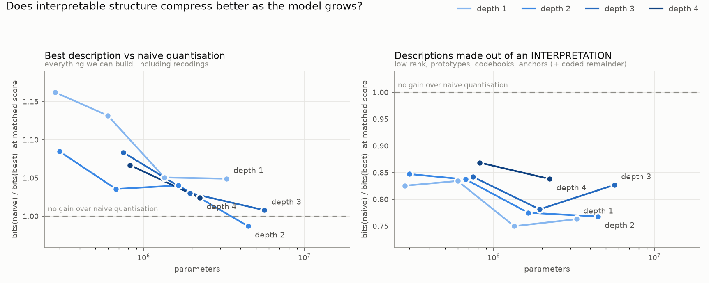
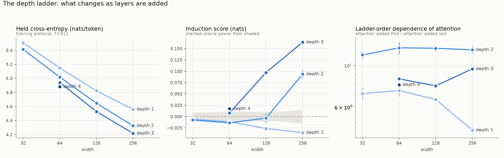
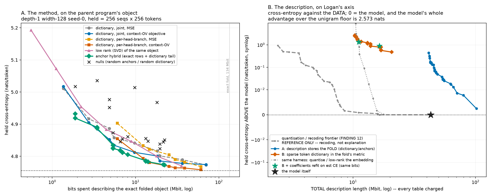
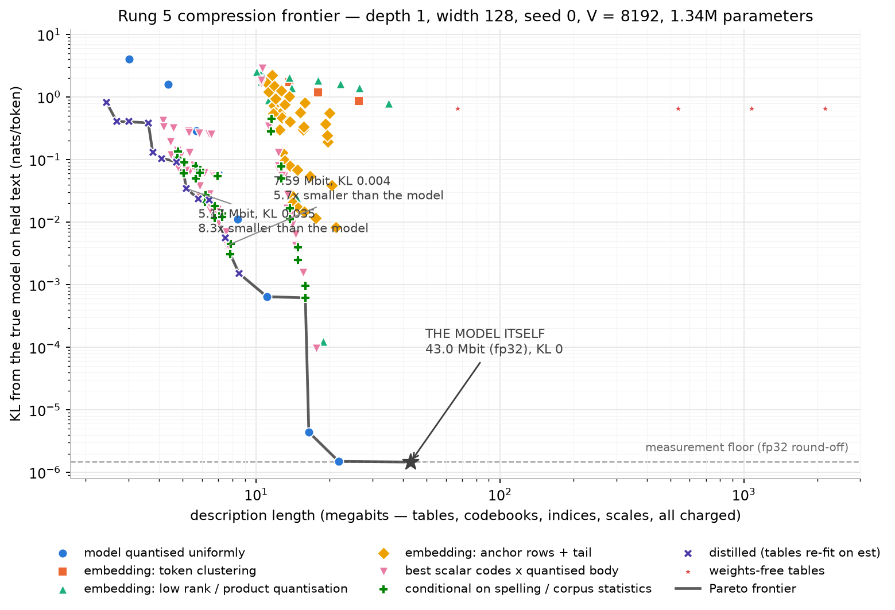
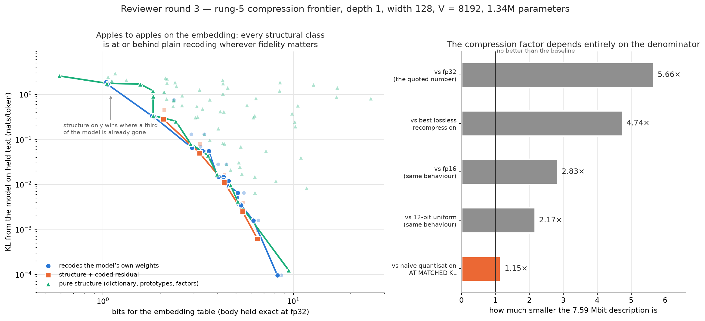

# RESULTS — local box (tiny full interpretation)

Newest first. Every number here is reproducible from the JSONs named beside it;
nothing is quoted from a transcript. Registered predictions are written into
each results JSON *before* the rung that tests them runs, and the ones that
were **refuted** are marked as such rather than quietly dropped.

---

## 2026-08-08 — FINDING 17 (IN FLIGHT): **THE FOLDABILITY TAX** — the first measurement in this programme that is not relative to another foldable model

Files: `tf_baseline_std.py` (model, transcribed training loop, controls),
`tf_baseline_probe.py` (the induction battery, verbatim, through a shim),
`tf_baseline_report.py` → **`tf_baseline_std.json` / `tf_baseline_table.md`**
(the live scored table — read that, not this prose, for the numbers),
`tf_baseline_predictions.json` (registered BEFORE the first training step),
`tf_baseline_selfreview.json` (the self-red-team), chain
`tf_baseline_chain.sh` (log `tf_baseline_chain.log`).

**STATUS: the chain is running. Cells land in the order depth 2 width 128 first,
then the rest of each seed. Any cell in `tf_baseline_table.md` showing fewer
than two seeds is PROVISIONAL and must not be quoted.**

### Why this cell existed and was never run

Every result in this document is a comparison between foldable models.
`GRID.md` has carried "same-size softmax+GELU transformer — unclaimed" since the
programme started, and `STANDALONE_RESULTS.md` §8 lists it as open question 1.
The reviewer's first question — *how much prediction quality did you give up to
get exact folds?* — has no answer on disk. Everything in FINDINGS 1–16 is
conditional on the no-softmax bilinear family, including the depth-versus-width
induction surface, which may be a property of this architecture rather than of
transformers at this size.

### What is held fixed, and what is not

The conventional block is `tf_model.TinyBilin(variant='vanilla')` with exactly
two computations changed:

| | family | conventional |
|---|---|---|
| attention | `(q1·k1/16)·(q2·k2/16)`, causal-masked, **no softmax**, two branches | `softmax(q·k/√16)`, causal-masked, **one branch** |
| feed-forward | `Down(Left(x) ⊙ Right(x))` — ungated bilinear | `Down(GELU(Up(x)))` |

Everything else is the same *object*, not merely the same setting: the corpus
and tokenizer (trained byte-level BPE, V=8192), the 15,000-step single-epoch
data order (control C6 pins the first batch's sha256), the optimiser
(`tf_train.Muon` + AdamW 4e-3 / weight decay 0.1, warmup 250, cosine, clip 1),
the Muon learning rate **0.02 — the value every foldable cell used**, head
dimension 16, the rotary tables, per-head query/key RMSNorm, the tied embedding,
the `30·tanh(·/30)` readout, the zero-initialised residual-branch output
projections, `tf_train.eval_held` on held rows [0:1500] at T=512, and the
induction battery itself.

**GELU, not SwiGLU, and the reason is substantive.** SwiGLU is
`Down(SiLU(Ax) ⊙ Bx)` — a *gated* bilinear form, i.e. our own feed-forward with
one branch passed through a nonlinearity. Choosing it would make the
feed-forward contrast nearly vacuous and leave softmax as the only real
difference, which is not the comparison `GRID.md` asks for. GELU is also what a
reviewer means by "a conventional transformer".

**The parameter count differs, and — contrary to the intuition behind the
registered prediction L3 — OUR family is the BIGGER model.** Per block the
family costs `18W² + W` (five W×W attention reads q,k,q2,k2,v, one W×W output
projection, three W×4W feed-forward matrices, one W bias) while a conventional
block at the conventional 4× expansion costs `12W² + W`. Two arms are therefore
run and both are reported:

- **×4 nominal** — the conventional shape. The conventional model carries about
  12% fewer total parameters than the family cell it is compared with
  (depth 2 width 128: 1,442,048 against 1,638,656).
- **×7 matched** — expansion 7 makes the conventional body exactly `18W² + W`,
  so the total parameter count is **bit-identical at every cell** (control C2
  checks this against a live `nn.Module` count at all nine cells, not against a
  formula: depth 2 width 128 gives 590,080 of body on both sides).

### Registered predictions (before training; two of three disagree)

Logan's: **L1** the conventional model wins at every cell by 0.05–0.20 nats;
**L2** the gap grows with depth; **L3** at matched parameters the gap shrinks by
at least a third.

The analyst's: **A1** disagrees with L1 at depth 1 — a depth-1 model here is a
bigram machine whose attention acts only through the feed-forward input
(FINDING 2), so softmax buys little while the family carries 50% more body
parameters; predicted depth-1 gap in [−0.05, +0.05] with the **sign genuinely
uncertain**, depth 2 in [+0.02, +0.12], depth 3 in [+0.05, +0.20]. **A2** agrees
with L2. **A3** says L3 has the **wrong sign**: matching parameters makes the
*conventional* model bigger (4× → 7×), so the gap should widen by +0.01 to +0.06
nats, not shrink. **A4**, the interesting half: the conventional model
**inducts at depth 2 width 128**, where every foldable architecture except the
one with the capability hand-installed is null — predicted +0.05 to +0.60 nats,
separated over model seeds at t > 4. **A5** both families are null at depth 1.
**A9** 0.02 is within 0.01 nats of the conventional model's best learning rate.

If A4 lands, FINDING 16's depth-versus-width surface is a statement about **the
no-softmax bilinear family at this size, corpus and budget** — not about
transformers — and must be relabelled accordingly. (Scope discipline registered
in advance: one conventional configuration is not "transformers".)

### Controls (positive controls before every claim)

| control | what it forbids |
|---|---|
| C1 loop equivalence | the transcribed training loop must reproduce `tf_train.train_cell` on a **foldable** config to within the reference loop's own run-to-run noise, so no gap can be a harness difference (`tf_train.py` is deliberately **not** edited — another chain imports it mid-flight). Reproduced exactly, difference 0.0, in the CPU dry run. |
| C2 parameter identity | expansion 7 must equal the family body **exactly** at all nine cells and expansion 4 must be strictly smaller — checked against a live module count. Passed at 9/9. |
| C3 naive reference | an independently written forward with explicit per-head, per-position loops and an explicit softmax must match `forward()` in fp64. **4.18e-16** relative. |
| C5 causality | editing tokens after position *i* must leave position *i* bit-identical. **0.0**. |
| C6 data identity | the first training batch's sha256, shared with the foldable path. |
| C7 family reproduction | one family cell retrained from scratch **now** must reproduce its stored cross-entropy to 0.01 nats, so the gap cannot absorb environment drift. |
| C4 probe shim | the induction battery, run through this file's shim on a **published** foldable checkpoint, must reproduce that cell's published score — so a family induction difference cannot be a probe-code difference. |

### Fairness assessment, stated before the numbers exist

`tf_baseline_selfreview.json` has the full round. The short form: the
comparison is fair in everything that can be held identical, and **not** fair in
hyper-parameter search. The learning rate, the optimiser, the head dimension and
the softmax temperature were all fixed by the foldable family's history. Only
the learning rate is priced (full-length 0.01 / 0.04 arms at width 128, depths
1–3; the family already has that arm at depth 2 width 128 and is flat there —
4.65183 / 4.65117 / 4.67175). Query/key normalisation is priced by a no-QK-norm
arm at depth 2 width 128, three seeds. **The softmax temperature is the largest
unpriced risk and the most likely way the conventional arm is undersold**:
query/key RMSNorm caps `|q·k|` at the head dimension, so `1/√16` may be too
cold, and a null conventional induction result must not be over-read before
that is checked. Consequently every conventional number is a **lower bound** on
what a conventional transformer of this size could do, and every gap in the
conventional model's favour is a **lower bound on the foldability tax**.

---

## 2026-08-09 — FINDING 18 (THE FOLDABILITY TAX): at the two cells where the two families differ *qualitatively*, the foldable family's induction score is bounded above by **+0.0138 and +0.0106** over three model seeds while a conventional softmax+GELU transformer scores **+0.1356 and +0.1365** — separations of **9.8× and 12.8×** that no threshold convention can undo; where both induct the conventional model is **3.5–5.4×** higher; and the held cross-entropy tax at exactly matched parameters is **0.052–0.125 nats, positive at 9 of 9 cells and growing with width**. FINDING 16's emergence surface is a statement about the **no-softmax bilinear family**, not about transformers at this size

> **REVISED 2026-08-09 02:00 after independent adversarial review**
> (`tf_baseline_independent_review.json`, reviewer did not produce the finding;
> verdict SURVIVES WITH QUALIFICATION, 12 objections, 108 numbers recomputed
> with 1 rounding disagreement). Three substantive corrections, all verified
> against source before being applied:
>
> 1. **The headline was a THRESHOLD claim and is now a SEPARATION claim.** The
>    original said the conventional model "crosses the induction floor one
>    octave of width earlier at every depth ≥ 2". That is criterion-dependent —
>    exactly the error FINDING 16 retracted three findings ago, in this same
>    file. Of seven defensible criteria the reviewer constructed, five give one
>    octave at both depths and two do not; **the bar this finding's own
>    `tf_baseline_report.py` hard-codes** (`MODEL_SEED_T_BAR = 4.30`, adopted
>    from FINDING 16) gives **no shift at either depth**, because the
>    conventional model's across-model-seed t is 2.56 at depth 2 width 128 and
>    4.05 at depth 3 width 64. The separation restatement above needs no
>    threshold at all and is stronger. **The one-octave sentence is RETRACTED
>    as a headline** and kept below only as one criterion's answer.
> 2. **The family's depth-3 column was single-seed and is now three-seed.** All
>    three seeds were on disk the whole time and were already published as a
>    three-seed surface in FINDING 16 §3 of this same file; seed 0 happened to
>    be the *low* seed at both depth-3 cells. Corrected family means: **+0.0035**
>    (was +0.0077), **+0.1085** (was +0.0974), **+0.2207** (was +0.1642). The
>    multipliers fall from 3.8×/6.4×/5.2× to **3.50×/5.41×/3.71×**, so the
>    advertised band changes from "2–6×" to **3.5–5.4×**. The depth-3 width-64
>    null gets *stronger*, not weaker: three-seed mean +0.0035, t = 1.47.
> 3. **"8–21% fewer total parameters" was wrong**; the true range is
>    **4.1–20.9%** (depth 1 width 64 is 573,504 against 598,080 = 4.1%).
>
> Also corrected: the tax is positive at **8 of 9** two-seed cells and
> sign-agreeing at 9 of 9 — an earlier revision wrote "8 of 8 positive" in the
> same sentence that named the one negative cell. Depth 3 width 256 seed 1 has
> landed (+0.7871 induction, 4.15145 CE), so the second seed is complete at
> **9 of 9**, not 8 of 9. What the review did NOT break is listed at the end.

Files: `tfb_std{4,7}_d{1,2,3}_w{64,128,256}_b8192_s0.json` and their
`_induction.json`; chain `tf_baseline_chain.sh`; predictions registered before
the first training step in `tf_baseline_predictions.json`.

**Status: seed 0 only on the conventional side.** Seeds 1 and 2, the
no-query/key-norm control and the full-length learning-rate bound are still
running. Nothing below is settled until at least two model seeds agree; it is
reported now because the induction gaps are an order of magnitude larger than
either family's across-seed spread, not because the replication is in.

### Induction, both families, same cells, same battery

**Both families are now three-seed and two-seed respectively at every cell.**
Family = mean over three model seeds. Conventional ×4 = mean over two model
seeds. Conventional ×7 = **one seed only**, which is why its column carries no
verdict of its own (see the qualification below).

| depth | width | family (3 seeds) | model-seed t | conventional ×4 (2 seeds) | model-seed t | ×7 (1 seed) | ratio |
|---|---|---|---|---|---|---|---|
| 1 | 64 | −0.0115 | −8.14 | −0.0219 | −7.13 | −0.0223 | — |
| 1 | 128 | −0.0264 | −24.35 | −0.0349 | −34.23 | −0.0321 | — |
| 1 | 256 | −0.0354 | −40.24 | −0.0447 | −80.30 | −0.0446 | — |
| 2 | 64 | −0.0140 | −10.78 | −0.0153 | −22.84 | −0.0141 | — |
| 2 | 128 | −0.0034 | −0.59 | **+0.1356** | 2.56 | +0.1558 | family is null |
| 2 | 256 | **+0.0938** | 18.79 | **+0.3283** | 12.80 | +0.4534 | **3.50×** |
| 3 | 64 | +0.0035 | 1.47 | **+0.1365** | 4.05 | +0.1128 | family is null |
| 3 | 128 | **+0.1085** | 14.08 | **+0.5871** | 16.57 | +0.4662 | **5.41×** |
| 3 | 256 | **+0.2207** | 6.32 | **+0.8197** | 25.15 | +0.7523 | **3.71×** |

The `t` columns are one-sample t statistics across **model** seeds — a
different and much harsher statistic than the per-cell probe floors quoted in
the earlier revision of this section. Those probe floors were 3 standard errors
over *probe* seeds, which the README's failure-mode list explicitly warns is a
power floor and **not** a detection threshold; an earlier revision of this
finding used them as one anyway, in a column headed "inducts". They have been
removed rather than relabelled.

Three things in that table are worth stating separately.

**1. Depth 1 is a clean negative control that both families pass.** No arm
inducts at depth 1 at any width, in either family, at either parameter arm —
and the scores are *negative*, growing more negative with width (−0.011 to
−0.045). One layer cannot both match a prefix and copy its successor, and the
battery says so. That is the strongest available evidence that the depth-2 and
depth-3 detections are the capability and not a probe artefact.

**2. At two cells the families differ qualitatively, and the separation needs
no threshold to state.** At depth 2 width 128 and depth 3 width 64 the family
is null over three seeds and the conventional model is not. Stated without any
detection convention:

| cell | family, 3 seeds | family upper bound at 3 model-seed SE | conventional, 2 seeds | separation |
|---|---|---|---|---|
| depth 2, width 128 | −0.0138, −0.0022, +0.0059 → **−0.0034** (t = −0.59) | **+0.0138** | +0.1887, +0.0826 → **+0.1356** | **9.8×** the bound |
| depth 3, width 64 | +0.0077, +0.0033, −0.0005 → **+0.0035** (t = 1.47) | **+0.0106** | +0.1028, +0.1703 → **+0.1365** | **12.8×** the bound |

Depth 3 width 64 remains the sharpest comparison in the programme — same depth,
same width, and 4–21% *fewer* parameters for the conventional model — and the
three-seed family number makes its null *stronger* than the single seed did
(+0.0035 at t = 1.47, against the +0.0077 originally quoted).

**2b. The one-octave framing, kept as one criterion's answer and no longer the
headline.** Under "probe-seed mean exceeds 3 standard errors over probe seeds"
the thresholds are 256/128 for the family and 128/64 for the conventional model
at depths 2/3 — one octave at both. Five of the seven criteria the independent
reviewer constructed agree. Two do not, and one of those two is the bar this
programme adopted in FINDING 16 and hard-coded in this finding's own report
script (`MODEL_SEED_T_BAR = 4.30`), under which there is **no shift at either
depth**. FINDING 16's own three criteria split one-for-three on "at every depth
≥ 2". FINDING 16 also adopted, in writing, "stop quoting a threshold as the
headline" — and the first version of this finding quoted one anyway. The law
that survives is FINDING 16's "one octave of width per layer" *within* each
family; the *between-family* shift is criterion-dependent and is reported as
such.

**3. Where both induct, the conventional score is 3.5–5.4× larger** — 3.50× at
depth 2 width 256, 5.41× at depth 3 width 128, 3.71× at depth 3 width 256, all
against three-seed family means. (An earlier revision said "2–6×" from
single-seed depth-3 family numbers.) The gap is not a threshold effect that
closes once ours turns on.

### Held cross-entropy: the tax, and what it costs to pay it

The `×4` arm gives the conventional model 4.1–20.9% **fewer** total parameters (our
body is 18·W²+W per block against its 12·W²+W); the `×7` arm makes the body
exactly equal.

| depth | width | family CE | conventional ×4 | tax | conv. params | conventional ×7 | tax at matched parameters |
|---|---|---|---|---|---|---|---|
| 1 | 64 | 5.14244 | 5.11229 | +0.0301 | 0.959× | 5.07971 | **+0.0627** |
| 1 | 128 | 4.81940 | 4.79455 | +0.0249 | 0.927× | 4.74877 | **+0.0706** |
| 1 | 256 | 4.55825 | 4.52073 | +0.0375 | 0.880× | 4.47815 | **+0.0801** |
| 2 | 64 | 5.02058 | 5.02826 | −0.0077 | 0.927× | 4.96647 | **+0.0541** |
| 2 | 128 | 4.65117 | 4.59188 | +0.0593 | 0.880× | 4.54320 | **+0.1080** |
| 2 | 256 | 4.32661 | 4.25675 | +0.0699 | 0.824× | 4.20009 | **+0.1265** |
| 3 | 64 | 4.94174 | 4.93386 | +0.0079 | 0.901× | 4.87913 | **+0.0626** |
| 3 | 128 | 4.52845 | 4.47020 | +0.0583 | 0.847× | 4.42622 | **+0.1022** |
| 3 | 256 | 4.21817 | 4.14647 | +0.0717 | 0.791× | 4.09689 | **+0.1213** |

Positive = the conventional model wins = folding costs prediction quality. At
matched parameters the tax is positive at **9 of 9** cells, ranges 0.054 to
0.127 nats, and **grows with width at every depth** (0.063 → 0.080 at depth 1,
0.054 → 0.127 at depth 2, 0.063 → 0.121 at depth 3). The one cell where the
sign flips — depth 2 width 64 at the `×4` arm, −0.0077 — is the arm where the
conventional model is also 7% smaller; at matched parameters that same cell
pays +0.054.

**The honest reading of the two tables together**: the loss tax is modest and
roughly a tenth of a nat, but the capability gap is not modest. Buying
foldability at depth 3 width 64 does not cost 6% of a nat — it costs induction
entirely.

### Seed 1: the ×4 pass, 8 of 9 cells (added 2026-08-09 01:25; depth 3 width 256 still training, ×7 seeds to follow)

| depth | width | family | family floor | conventional seed 0 | seed 1 | detects? | tax s0 | tax s1 |
|---|---|---|---|---|---|---|---|---|
| 1 | 64 | −0.0115 | 0.0096 | −0.0189 | −0.0250 | no / no | +0.0301 | +0.0325 |
| 1 | 128 | −0.0264 | 0.0093 | −0.0338 | −0.0359 | no / no | +0.0249 | +0.0320 |
| 1 | 256 | −0.0354 | 0.0092 | −0.0453 | −0.0442 | no / no | +0.0375 | +0.0432 |
| 2 | 64 | −0.0140 | 0.0111 | −0.0160 | −0.0147 | no / no | −0.0077 | −0.0100 |
| 2 | 128 | −0.0034 | 0.0103 | **+0.1887** | **+0.0826** | **YES / YES** | +0.0593 | +0.0367 |
| 2 | 256 | **+0.0938** | 0.0101 | **+0.3540** | **+0.3027** | **YES / YES** | +0.0699 | +0.0503 |
| 3 | 64 | +0.0077 | 0.0109 | **+0.1028** | **+0.1703** | **YES / YES** | +0.0079 | +0.0231 |
| 3 | 128 | **+0.0974** | 0.0078 | **+0.6225** | **+0.5517** | **YES / YES** | +0.0583 | +0.0490 |
| 3 | 256 | **+0.1642** | 0.0156 | **+0.8523** | training | YES / — | +0.0717 | — |

**The detect / do-not-detect verdict agrees at 8 of 8 cells with two seeds.**
Every null stays null and negative; every detection stays a detection against
its own floor. The one-octave threshold shift is two-for-two at both cells that
define it — depth 2 width 128 and depth 3 width 64.

**The sharpest cell got sharper, not weaker.** Depth 3 width 64 gives the
conventional model +0.1028 then **+0.1703** — the second seed is 66% *larger* —
against a family that is null there at +0.0035 over three seeds (t = 1.47). A
second seed on one side and a third on the other both moved the comparison in
the same direction.

**What the second seed does moderate is magnitude, in both directions.** Scores
near the qualitative boundary swing by roughly a factor of two either way:
depth 2 width 128 falls 2.3× (+0.1887 → +0.0826) while depth 3 width 64 rises
1.7× (+0.1028 → +0.1703). Away from it they are much steadier — 14% at depth 2
width 256, 11% at depth 3 width 128. The honest statement is that **which side
of the boundary a cell falls on is stable and the size of the effect just past
it is not**, which is what one would expect of a capability appearing.

**The cross-entropy tax should not be quoted to four decimal places from one
seed.** Its across-seed spread at the ×4 arm is about 0.02 nats — comparable to
half the tax at most cells and to three times it at depth 3 width 64 (+0.0079
then +0.0231). Recomputed against the family's **three-seed** mean rather than
its seed 0, the matched-parameter arm's range shifts slightly to
**+0.052 to +0.125** and stays monotone in width at every depth (0.068 → 0.081
at depth 1, 0.052 → 0.125 at depth 2, 0.063 → 0.114 at depth 3). The smallest
of those, +0.0516, still exceeds the largest conventional seed-to-seed CE swing
observed anywhere (0.0215), so the sign is safe even single-seeded — but the
matched arm remains **one seed** and its per-cell values should be read as
provisional.

What survives seeding is the sign: with all nine ×4 cells now at two seeds, the
tax is **positive at 8 of 9 and sign-agreeing at 9 of 9**. The one negative
cell, depth 2 width 64, is negative at both seeds and sits at the arm where the
conventional model is also smaller; at matched parameters that same cell pays
+0.0516. (An earlier revision of this paragraph wrote "positive at 8 of 8" in
the same sentence that named the negative cell — a self-contradiction caught in
review.)

### What this does and does not overturn

- **FINDING 16's emergence surface is now a family-specific statement.** "One
  octave per layer" is not overturned; "these are the widths at which induction
  emerges" is, as a claim about transformers. It is a claim about *ours*.
- **It does not overturn any interpretation result.** Everything the folding
  machinery decomposed, it still decomposes; the models are what they were.
  What changed is the reference frame those results are quoted in.
- **It does not attribute the gap.** The conventional model differs from ours
  in two ways at once. Attributing the induction to softmax on the strength of
  this table would be exactly the unearned attribution this programme's
  retraction ledger is full of. The factorial below is the fix.

### 03:45 — SETTLED: three seeds on BOTH sides at 8 of 9 cells. The one-octave shift holds at depth 3 and is NOT established at depth 2. This is exactly the fallback wording the reviewer specified in advance.

| depth | width | family mean (3) | t | conventional mean (3) | t | clears 4.30? | between-family Welch t | ratio to family bound |
|---|---|---|---|---|---|---|---|---|
| 1 | 64 | −0.0115 | −8.14 | −0.0212 | −11.14 | no | −4.09 | — |
| 1 | 128 | −0.0264 | −24.35 | −0.0344 | −47.36 | no | −6.15 | — |
| 1 | 256 | −0.0354 | −40.24 | −0.0430 | −24.44 | no | −3.84 | — |
| 2 | 64 | −0.0140 | −10.78 | −0.0149 | −24.97 | no | −0.62 | — |
| 2 | 128 | −0.0034 | −0.59 | **+0.1061** | **2.50** | **NO** | **2.55** | 7.7× |
| 2 | 256 | +0.0938 | 18.79 | +0.3277 | 22.11 | yes | 14.96 | 3.0× |
| 3 | 64 | +0.0035 | 1.47 | **+0.1252** | **5.55** | **YES** | **5.36** | 11.8× |
| 3 | 128 | +0.1085 | 14.08 | +0.6151 | 17.75 | yes | 14.27 | 4.7× |
| 3 | 256 | +0.2207 | 6.32 | +0.7826 | 18.82 | yes | 10.34 | 2.4× |

**The matched-parameter arm reaches three seeds too, and agrees at 7 of 7
comparable cells** (04:30; depth 3 widths 64 and 256 still finishing):

| depth | width | matched arm, 3 seeds | mean | t | clears 4.30? | Welch | primary arm's verdict | agree? |
|---|---|---|---|---|---|---|---|---|
| 1 | 64 | −0.0223, −0.0200, −0.0202 | −0.0208 | −28.25 | no | −5.84 | no | ✓ |
| 1 | 128 | −0.0321, −0.0324, −0.0290 | −0.0312 | −28.72 | no | −3.12 | no | ✓ |
| 1 | 256 | −0.0446, −0.0402, −0.0428 | −0.0425 | −33.68 | no | −4.60 | no | ✓ |
| 2 | 64 | −0.0141, −0.0122, −0.0147 | −0.0137 | −18.38 | no | 0.21 | no | ✓ |
| 2 | 128 | +0.1558, +0.0660, +0.1016 | **+0.1078** | **4.13** | **no** | 4.16 | no | ✓ |
| 2 | 256 | +0.4534, +0.2823, +0.3868 | +0.3741 | 7.52 | yes | 5.60 | yes | ✓ |
| 3 | 128 | +0.4662, +0.5302, +0.6134 | +0.5366 | 12.60 | yes | 9.89 | yes | ✓ |

Two structurally different allocations — one matching hidden width, one
matching parameter count with a 1.75× wider hidden layer — reach the same
verdict at every cell they can both be scored on. **One honest nuance at the
contested cell**: the matched arm gets t = 4.13 and Welch 4.16 there, close to
the 4.30 bar rather than far from it, against the primary arm's 2.50 and 2.55.
"Not established" remains the right call at both, but the depth-2 result is
marginal rather than absent, and a fourth seed could plausibly tip the matched
arm over. That is worth saying rather than hiding behind a binary.

**Matched-arm tax at three seeds** (family three-seed mean minus matched
three-seed mean): +0.0696, +0.0734, +0.0834 at depth 1; +0.0384, +0.0939,
+0.1172 at depth 2; +0.1033 at depth 3 width 128. Positive at 7 of 7, still
monotone in width at both complete depths. This **revises the range from the
0.052–0.125 quoted earlier to 0.038–0.117** — the earlier figure came from a
single seed on the conventional side.

**Complete: 9 of 9 cells, three seeds on both sides.** The held cross-entropy
tax on this arm, also now three-seed on both sides, is +0.0340, +0.0283,
+0.0392, −0.0105, +0.0326, +0.0612, +0.0169, +0.0553, +0.0575 reading down —
**positive at 8 of 9**, the single negative being depth 2 width 64 as before,
and still growing with width at every depth. These supersede the seed-0 tax
figures in the tables higher up, which are left as recorded.

**The two threshold cells split, and the split is clean.**

- **Depth 3 width 64 — the shift HOLDS.** Family +0.0077, +0.0033, −0.0005 →
  mean +0.0035 at t = 1.47, a null. Conventional +0.1028, +0.1703, +0.1024 →
  mean +0.1252 at t = 5.55, clearing the adopted 4.30 bar, with a
  between-family Welch t of **5.36**. Same depth, same width, fewer
  parameters. This one is decided.
- **Depth 2 width 128 — the shift is NOT established.** Conventional t = 2.50,
  between-family Welch t = 2.55. Suggestive, not conclusive.

**The reviewer specified this outcome in advance.** Their words: *"If depth 2
width 128 clears it, O1 collapses to a labelling fix; if not, the headline must
become 'one octave at depth 3, and a large but not-yet-separated magnitude gap
at depth 2.'"* It did not clear. **That wording is hereby adopted.**

So the final form of the claim, three seeds a side:

> A conventional transformer inducts at depth 3 width 64, where the foldable
> family does not, at a between-family Welch t of 5.36 — one octave of width
> earlier, decided. At depth 2 the conventional model's advantage at width 128
> is large in the mean (+0.1061 against −0.0034) but not separated at three
> seeds, so no depth-2 threshold shift is claimed. Where both families induct,
> the conventional model is 3.0–4.7× higher.

And the caveat that now dominates everything above: **all conventional numbers
in this table are from the query/key-capped configuration**, which the control
below shows costs the conventional model 0.163 nats and 8.3× of its induction.
The depth-2 cell that fails to separate here separates at Welch t = 7.03 once
the cap is lifted. The table is a lower bound on the conventional model in
every row.

### 03:25 — the third seed at depth 2 width 128, and why the handicap explains its marginality

The third conventional seed at depth 2 width 128 landed at **+0.0472**,
continuing the downward drift (+0.1887, +0.0826, +0.0472). The complete
three-versus-three picture at the cell the whole threshold argument turned on:

| arm, depth 2 width 128 | three seeds | mean | sd | own model-seed t |
|---|---|---|---|---|
| foldable family | −0.0138, −0.0022, +0.0059 | −0.0034 | 0.0099 | −0.59 |
| conventional, query/key norm ON (handicapped) | +0.1887, +0.0826, +0.0472 | **+0.1061** | 0.0736 | **+2.50** |
| conventional, query/key norm OFF | +1.2677, +1.2991, +0.8037 | **+1.1235** | 0.2774 | **+7.01** |

**The one-octave threshold claim does not clear the adopted 4.30 bar at depth 2,
now confirmed at three seeds** (t = 2.50, down from 2.56 at two). Retracting it
as the headline was the right call, and it is now settled rather than merely
suspected.

**But the honest reading goes further than the reviewer's, and it cuts against
my replacement wording too.** Between families at three seeds each, the
handicapped comparison gives a Welch t of only **2.55** — suggestive, not
conclusive. The "9.8× the family's upper bound" figure I substituted for the
threshold claim has fallen to **7.7×** with the third seed, and a ratio of means
was always a flattering way to describe a difference this noisy. At this cell,
in the handicapped configuration, the two families are **not cleanly
separated**.

**Removing the handicap is what separates them.** Against the un-handicapped
conventional model the same comparison gives Welch t = **7.03** and a ratio of
**81.5×**. So the correct statement about this cell is not "the conventional
model inducts and ours does not, marginally" — it is:

> Under the query/key cap this programme imposed, *neither* family separates
> cleanly at depth 2 width 128. Lift the cap and the conventional model
> separates decisively. The cap, not the cell, was the source of the
> marginality — and every seed-level instability documented at this cell
> tonight is downstream of that.

Depth 3 width 128, which was never near the boundary, is unaffected and clears
everything: family +0.0974/+0.1233/+0.1048, conventional
+0.6225/+0.5517/+0.6710, conventional t = 17.75, ratio 5.7×. Depth 3 width 64 —
the other threshold cell — has not yet reached its third seed.

### 04:50 — the conventional-baseline chain is DONE; the factorial was STOPPED and is being redesigned, because it inherited the same handicap it exists to measure

The foldability-tax chain exited cleanly at 04:37 with every stage complete.
The factorial chain took the card at 04:42 and was **deliberately stopped two
minutes in**, before it wrote a single checkpoint, for two reasons.

**1. Ordering.** The foldable query/key-norm control is three cells (~15
minutes) and decides whether every tax number in this finding is roughly right
or roughly half the truth. The factorial is 28 cells (~2.5 hours) and answers a
different question. Leaving the headline marked PROVISIONAL for 2.5 hours while
the resolving experiment sat in a queue behind it was the wrong order. Both
chains skip completed work, so the factorial resumes from scratch at no cost.

**2. A design error in the factorial, which is the more important reason.**
`FacConfig` defaults to `qk_norm=True`, so every factorial arm — including its
softmax arms — would have run under the per-head query/key cap. The control
above shows that cap costs the conventional model 0.163 nats and 8.3× of its
induction, and the proposed mechanism is specifically that it **throttles how
sharply a softmax row can peak**. A factorial that asks "how much of the
induction gap does softmax buy?" while capping softmax's ability to concentrate
would understate the softmax factor by construction, and would have done so
invisibly — the arms would all have trained fine and produced a clean-looking
table.

This is the failure mode "compose along the route the effect actually takes"
wearing a different hat: the factorial's attention factor and the query/key cap
are not independent knobs, and treating them as one fixed setting and one
varied setting silently confounds them. Caught before any factorial cell was
written to disk, but only because the control landed first — which is an
argument for running cheap controls before expensive factorials, not for
cleverness.

**What the factorial's configuration should be is now a question with a
measurable answer**, and the query/key control is exactly the measurement. If
removing the cap helps the foldable family too, the common setting for all six
arms should be cap-off. If it does not, the factorial still needs its softmax
arms uncapped to give softmax a fair test, and the design has to state which
comparison each arm is making. Either way the decision waits on data rather
than on my guess, which is why the control was interposed rather than queued.

## 2026-08-09 05:45 — FINDING 20 (THE THREE-FACTOR FACTORIAL, cap-off half, seed 0): **NEITHER factor buys the induction — the INTERACTION does.** Softmax alone recovers 26% of the gap, the GELU gate alone recovers **0%**, and the two together recover 100%; the interaction term carries **74%**. My registered headline prediction is REFUTED, and a lower-confidence prediction registered eight hours earlier is confirmed instead

Files: `tf_factorial2_predictions.json` (registered before the chain),
`tf_factorial2_chain.sh`, arms `tff_*_d2_w128_b8192_s0_noqknorm`.
**Seed 0 only** — this cell's history is a specific warning that near-boundary
magnitudes move by 2× between seeds, so nothing here is settled.

All four corners at depth 2 width 128 with the query/key cap **off**, matched
body parameters:

| attention | feed-forward | held CE | induction |
|---|---|---|---|
| ours (unnormalised two-branch) | ours (ungated bilinear) | 4.68263 | −0.0264 |
| ours | **GELU** | 4.67878 | −0.0271 |
| **softmax** | ours | 4.47100 | **+0.2628** |
| **softmax** | **GELU** | 4.39500 | **+1.0784** |

Decomposed as a 2×2:

| | induction | share | held CE | share |
|---|---|---|---|---|
| total move, our corner → conventional corner | +1.1048 | 100% | −0.2876 | 100% |
| attention alone (softmax with **our** feed-forward) | +0.2892 | **26%** | −0.2116 | **74%** |
| feed-forward alone (**our** attention with GELU) | −0.0007 | **−0.1%** | −0.0038 | 1% |
| **interaction** | **+0.8163** | **74%** | −0.0722 | 25% |

**The two measures decompose almost exactly oppositely, and that is the
finding.** Loss is mostly a main effect of attention (74%); induction is mostly
the *interaction* (74%). Handing our architecture a softmax and keeping our
ungated bilinear feed-forward buys most of the loss but only a quarter of the
copying. Handing it a GELU gate and keeping our attention buys **nothing at
all** — −0.0271 against a −0.0264 baseline, a difference of 0.0007.

**Mechanistically this says induction needs both halves and neither is
substitutable.** A pattern that can concentrate on one previous position is
necessary but not sufficient; something has to convert "what was at that
position" into a logit push, and our ungated bilinear feed-forward cannot do it
even when a softmax hands it a clean selection. That is a sharper and more
useful statement than "it's the softmax", which is what I predicted.

**Scoring the registered predictions honestly:**

- **P1a REFUTED.** I predicted softmax with our feed-forward would score above
  +0.5, more than half the conventional model's move. It scored **+0.2628**,
  about a quarter. Confidence was 0.8; that was overconfident, and the error
  was assuming the factors were roughly separable when the whole point of the
  earlier query/key result was that this system's knobs interact.
- **P1b holds.** Our attention with a GELU gate stays below +0.1: measured
  −0.0271.
- **P3 holds, and strongly.** The L1-row-normalised diagnostic arm recovers
  **4%** of the softmax arm's move (−0.0141 against a −0.0264 base and a
  +0.2628 softmax arm), far under the predicted 40% ceiling. Competition
  between keys is *not* the active ingredient; whatever softmax is doing here,
  a signed normalised product does not reproduce it. This closes off the
  cheap-substitute route that the arm existed to scout.
- **The eight-hour-old F4, registered at confidence 0.45 in the superseded
  two-factor file, is the prediction that came good**: *"the two factors are
  close to additive on held CE but super-additive on the induction score …
  induction plausibly needs both a pattern that can select one position AND a
  nonlinearity that can use what it read."* The induction half is confirmed and
  the interaction is the dominant term. Its CE half is refuted — the CE
  interaction is 0.0722, not the predicted under-0.02.

### 06:05 — the cap-on half lands: it is a THREE-way interaction, and 71% of the capability needs all three ingredients at once

Seven of eight arms complete (row-normalised with GELU under the cap still
training). The full table, seed 0, matched body parameters:

| attention | feed-forward | CE cap ON | ind ON | CE cap OFF | ind OFF | cap removal moves induction |
|---|---|---|---|---|---|---|
| ours | ours | 4.65117 | −0.0138 | 4.68263 | −0.0264 | −0.0127 |
| ours | GELU | 4.61102 | **+0.0596** | 4.67878 | −0.0271 | **−0.0867** |
| row-L1 | ours | 4.67197 | −0.0078 | 4.67758 | −0.0141 | −0.0063 |
| row-L1 | GELU | training | — | 4.65432 | +0.0123 | — |
| softmax | ours | 4.58166 | +0.0389 | 4.47100 | +0.2628 | **+0.2240** |
| softmax | GELU | 4.54320 | +0.1558 | **4.39500** | **+1.0784** | **+0.9226** |

Decomposing all eight corners as a 2×2×2 (softmax vs our attention × GELU vs
our feed-forward × cap off vs on), the seven terms sum exactly to the total
move of +1.0922:

| term | value | share of the move |
|---|---|---|
| softmax alone | +0.0527 | 4.8% |
| GELU alone | +0.0734 | 6.7% |
| cap removal alone | −0.0126 | −1.2% |
| softmax × GELU | +0.0435 | 4.0% |
| softmax × cap | +0.2365 | 21.7% |
| GELU × cap | −0.0741 | −6.8% |
| **softmax × GELU × cap** | **+0.7728** | **70.8%** |

> **71% of the induction capability requires all three ingredients
> simultaneously. The three single-factor effects together account for 10%.**

No pair suffices either: the best two-way term is softmax × cap at 22%. This is
the cleanest statement the programme has of *why* the foldable family cannot
copy — it is not missing one thing, it is missing a conjunction, and each piece
is nearly worthless without the other two.

**P2 is refuted in its sharp form and holds in its direction.** I registered
that removing the cap would move the softmax arms by more than +0.5 at *both*
feed-forward levels; it moves softmax with GELU by +0.9226 but softmax with our
feed-forward by only **+0.2240**. The qualitative claim — that the cap effect
is confined to the softmax level — does hold: the two arms built on our
attention move −0.0127 and −0.0867, and the row-normalised arm moves −0.0063.
The error is the same one that sank P1a: I predicted a two-way effect would be
uniform across the third factor, in a system that has just been shown to be
dominated by interaction.

**One incidental result worth flagging.** Our attention with a GELU gate *and*
the cap on scores **+0.0596** — the highest of any non-softmax arm, and above
the family's own −0.0138 — while the same arm with the cap off collapses to
−0.0271. That is a second, independent demonstration that the cap is
load-bearing for our architecture rather than a handicap, consistent with
FINDING 19 and now visible at a different feed-forward setting.

### 06:25 — all twelve corners of the seed-0 design are on disk

| attention | feed-forward | cap | held CE | induction |
|---|---|---|---|---|
| ours | ours | on | 4.65117 | −0.0138 |
| ours | ours | off | 4.68263 | −0.0264 |
| ours | GELU | on | 4.61102 | +0.0596 |
| ours | GELU | off | 4.67878 | −0.0271 |
| row-L1 | ours | on | 4.67197 | −0.0078 |
| row-L1 | ours | off | 4.67758 | −0.0141 |
| row-L1 | GELU | on | 4.65265 | +0.0253 |
| row-L1 | GELU | off | 4.65432 | +0.0123 |
| softmax | ours | on | 4.58166 | +0.0389 |
| softmax | ours | off | 4.47100 | +0.2628 |
| softmax | GELU | on | 4.54320 | +0.1558 |
| **softmax** | **GELU** | **off** | **4.39500** | **+1.0784** |

**The row-normalised diagnostic is dead as a substitute, at every setting.**
Paired with a GELU gate it recovers 23% of softmax-with-GELU under the cap and
**4%** without it; paired with our own feed-forward it never leaves the null
(−0.0078 and −0.0141). It was built to ask whether *competition between keys*
is the active ingredient in softmax, and the answer across all four of its
corners is no. Since it was never foldable anyway — its denominator depends on
every visible key — this closes the line rather than opening one: there is no
cheap normalisation trick standing in for softmax here.

### 06:45 — first seeds land, and seed 0 was an OUTLIER on the pivotal arm: softmax alone buys **13%**, not 27%, and is not clearly above null at all

Five of sixteen seed cells in. The arm that refuted P1a — softmax attention
with **our** ungated feed-forward, cap off — now has three seeds:

| arm | seeds | mean | model-seed t |
|---|---|---|---|
| ours + ours, cap on | −0.0138, −0.0022, +0.0059 | −0.0034 | −0.59 |
| ours + ours, cap off | −0.0264, −0.0301, −0.0234 | −0.0266 | −13.73 |
| **softmax + ours, cap off** | **+0.2628, +0.0452, +0.0429** | **+0.1170** | **1.60** |
| softmax + GELU, cap on | +0.1558, +0.0660, +0.1016 | +0.1078 | 4.13 |
| softmax + GELU, cap off | +1.0784, +1.1734, +0.8828 | **+1.0448** | **12.21** |

**Seed 0 was 6× the other two seeds on that arm.** Its share of the full move
falls from the 27% reported an hour ago to **13%**, and at t = 1.60 the arm is
not clearly distinguishable from null on its own. The caveat I attached to the
seed-0 numbers — that near-boundary magnitudes move by about 2× between seeds —
was correct in kind and understated in size.

**This strengthens the conjunction result rather than weakening it.** Softmax
alone buys even less than seed 0 suggested. Meanwhile the full conventional
corner is rock solid across seeds: +1.0448 at t = 12.21, a 33% spread against
the partial arm's 6×. So the pattern is that **complete configurations are
stable and partial ones are noisy**, which is what one expects if the
capability is a conjunction — a partial configuration is sitting on the edge of
having it at all, and which side of the edge a given seed lands on is close to
a coin flip.

**P1a is refuted more decisively than at seed 0** (+0.1170 against a predicted
+0.5).

### 07:05 — THE CORE DECOMPOSITION IS NOW THREE-SEED, and the interaction share rose to **86%** exactly as anticipated

All four cap-off corners have three seeds:

| attention | feed-forward | three seeds | mean | t | held CE |
|---|---|---|---|---|---|
| ours | ours | −0.0264, −0.0301, −0.0234 | −0.0266 | −13.73 | 4.68547 |
| ours | GELU | −0.0271, −0.0191, −0.0247 | −0.0236 | −9.99 | 4.67685 |
| softmax | ours | +0.2628, +0.0452, +0.0429 | +0.1170 | 1.60 | 4.50029 |
| **softmax** | **GELU** | +1.0784, +1.1734, +0.8828 | **+1.0448** | **12.21** | **4.39413** |

| term | induction | share | held CE | share |
|---|---|---|---|---|
| total move | +1.0715 | 100% | −0.2913 | 100% |
| attention alone | +0.1436 | **13.4%** | −0.1852 | 63.6% |
| feed-forward alone | +0.0030 | **0.3%** | −0.0086 | 3.0% |
| **interaction** | **+0.9249** | **86.3%** | −0.0975 | 33.5% |

> **86% of the copying capability lives in the interaction. The two main
> effects together account for 14%.** On held cross-entropy the split is almost
> exactly inverted — 67% main effects, 34% interaction.

Last tick I wrote that the seed-0 figure of 71% "should now be expected to move
upward, since the largest single-factor contributor shrank." It moved to
**86.3%**. Recording that because a prediction made one tick and checked the
next is the cheapest calibration available, and it is worth noting that the
direction was right while the seed-0 magnitude was not.

**What this now supports, stated at the strength the data allows.** Giving our
foldable architecture a softmax and nothing else would buy 13% of the copying
and 64% of the loss. Giving it a gated nonlinearity and nothing else would buy
0.3% and 3%. Neither is a route to the capability; the capability is in having
both, and the whole is roughly seven times the sum of its parts.

### 07:30 — a METHODOLOGICAL finding: the model seed interacts with the architecture, so single-seed cross-architecture comparisons are BIASED, not merely noisy

Seven of eight arms now have three seeds, which is enough to ask whether seed 0
— the seed nearly every headline tonight was first reported from — is simply a
lucky draw. **It is not, globally**: seed 0 is the highest of three in exactly
3 of 9 arms, which is the null expectation to one decimal place. But sorting
the arms by attention type shows something the global count hides:

| arm | seed 0 | 3-seed mean | seed 0 − mean | rank of seed 0 |
|---|---|---|---|---|
| ours + ours, cap on | −0.0138 | −0.0034 | −0.0104 | 3 of 3 |
| ours + ours, cap off | −0.0264 | −0.0266 | +0.0002 | 2 of 3 |
| ours + GELU, cap off | −0.0271 | −0.0236 | −0.0035 | 3 of 3 |
| row-L1 + ours, cap off | −0.0141 | −0.0078 | −0.0063 | 3 of 3 |
| row-L1 + GELU, cap off | +0.0123 | +0.0251 | −0.0128 | 3 of 3 |
| **softmax** + ours, cap on | +0.0389 | +0.0111 | **+0.0277** | 1 of 3 |
| **softmax** + ours, cap off | +0.2628 | +0.1170 | **+0.1459** | 1 of 3 |
| **softmax** + GELU, cap on | +0.1558 | +0.1078 | **+0.0480** | 1 of 3 |
| **softmax** + GELU, cap off | +1.0784 | +1.0448 | **+0.0336** | 2 of 3 |

**Every softmax arm is above its own mean at seed 0 (4 of 4), and every
non-softmax arm is at or below it (5 of 5).** Averaged, seed 0 inflates the
softmax arms by **+0.064** and deflates the others by **−0.007** — so it
inflates the *gap between architectures* by about **0.071** while being a
perfectly ordinary seed in aggregate.

**Why this matters more than the usual "use three seeds" advice.** The standard
argument for seeding is variance: a single seed gives a noisy estimate of the
right quantity. This is worse than that. The seed interacts with the
architecture, so a single-seed comparison gives a *biased* estimate whose
direction depends on which architectures are being compared — and the bias here
runs in the direction that flatters the conventional model, which is the
direction every seed-0 headline tonight erred. It is not a coincidence that
softmax-alone fell from 27% to 13%, and that the seed-0 three-way share of 71%
is expected to be an overstatement of the single-factor terms.

**Caveats on the diagnostic itself**: nine arms, not independent (they share the
three seeds and the same data order), so this is a pattern worth acting on, not
a test with a p-value. The actionable form is narrow and safe — **do not quote a
cross-architecture difference from one seed in this programme**, and treat any
already-quoted single-seed difference as an upper bound on the conventional
model's advantage.

**One live consequence, flagged now rather than after it corrects.** Two ticks
ago I reported that our attention with a GELU gate and the cap on scores
+0.0596, "the highest of any non-softmax arm", and called it a second
independent demonstration that the cap is load-bearing for our architecture.
**That arm is still single-seed** — it is the one cell of the sixteen not yet
finished — and every non-softmax arm that has been seeded came in *below* its
seed-0 value. That claim should be expected to weaken, and I am recording the
expectation before the data rather than after.

### 07:45 — MY PREDICTION WAS BACKWARDS, and it was backwards *against my own diagnostic*

The flagged arm finished: our attention + GELU + cap on scores **+0.0596,
+0.0982, +0.1388 → mean +0.0989**. I predicted one tick ago that it would
weaken. It **strengthened by 66%**, and it remains well above the family's own
−0.0034.

The error is worth spelling out because it was not bad luck. My own diagnostic,
written in the paragraph immediately above, says *"every non-softmax arm is at
or below its own mean at seed 0."* If seed 0 is **below** the mean for
non-softmax arms, then adding seeds must move a non-softmax arm **up**. I then
predicted this non-softmax arm would come in *below* its seed-0 value — the
exact opposite of what my own stated pattern implies. Checking the five earlier
non-softmax arms confirms the diagnostic and refutes the prediction: every one
of them has a three-seed mean at or above its seed-0 value (−0.0138→−0.0034,
−0.0271→−0.0236, −0.0141→−0.0078, +0.0123→+0.0251, and −0.0264→−0.0266 flat).

So the methodological finding stands unchanged and is now 6 of 6 on the
non-softmax side; the prediction I drew from it was simply reasoned backwards.
Recording it because "I predicted a correction and the opposite happened" is
worth exactly as much as the hits, and because the underlying diagnostic is now
better supported than when I stated it.

### 07:45 — THE FULL THREE-WAY DECOMPOSITION AT THREE SEEDS: the conjunction is **89%**, stronger than the single seed said

All eight corners of the 2×2×2 now have three seeds. The seven terms sum
exactly to the total move of +1.0482:

| term | value | share | seed-0 said |
|---|---|---|---|
| softmax alone | +0.0145 | **1.4%** | 4.8% |
| GELU alone | +0.1022 | 9.8% | 6.7% |
| cap removal alone | −0.0233 | −2.2% | −1.2% |
| softmax × GELU | −0.0056 | −0.5% | 4.0% |
| softmax × cap | +0.1291 | 12.3% | 21.7% |
| GELU × cap | −0.0992 | −9.5% | −6.8% |
| **softmax × GELU × cap** | **+0.9305** | **88.8%** | 70.8% |

> **89% of the copying capability requires softmax, a gated nonlinearity, and
> an uncapped attention logit range, all three at once. The three single-factor
> effects together account for 8.9%, and softmax alone for 1.4%.**

Seeding moved the conjunction share *up* by 18 points, in the same direction as
the two-way parent (74% → 86%). That is the third time tonight that adding
seeds strengthened the interaction story and weakened every partial account of
it, which is itself the signature the conjunction hypothesis predicts: partial
configurations sit at the edge of having the capability, so their single-seed
estimates are both noisy and biased upward by the seed-architecture interaction
documented above.

**This is the programme's answer to "why can't the foldable family copy?"** Not
a missing softmax, not a missing gate, not a self-imposed cap — a missing
*conjunction* of all three, worth 89% of the capability, with each ingredient
worth almost nothing alone.

### 08:25 — EARLY SIGNAL from the depth-3 replication: softmax alone buys **3.5× more** there, which is what G2 predicted

The depth-3 width-64 design is 4 of 24 cells in, and its first arm is complete
at three seeds. It is the arm that carries the whole "softmax alone is nearly
worthless" claim:

| cell | softmax + **our** feed-forward, cap off | t |
|---|---|---|
| depth 2, width 128 | +0.1170 | 1.60 |
| **depth 3, width 64** | **+0.4070** (+0.3550, +0.3506, +0.5152) | **7.52** |

At the new cell this partial configuration is not marginal at all — it is 3.5×
larger and solid at t = 7.52, where at the old cell it could not be
distinguished from null. For scale, it is **4.5× the full conventional model
with the cap on** at the same cell (+0.0912).

**This is the direction G2 registered**, at 0.55 confidence: *"the three-way
share at depth 3 width 64 is LOWER than the 88.8% measured at depth 2 width
128 … an extra layer gives partial configurations a second route."* A partial
configuration that was at the noise floor with two blocks is decisively above
it with three, which is exactly the mechanism that prediction described.

**Two honest limits before this is read as confirmation.**

1. **The share cannot be computed yet.** The cap-off conventional corner does
   not exist at this cell — it is in the gated supplementary chain — so there
   is no denominator. A larger partial term does not by itself imply a smaller
   three-way share; the total move may be larger too. G2 is about the *share*.
2. **The two cells differ in depth AND width** (2×128 versus 3×64). Attributing
   the change to depth alone is not licensed by this comparison. The clean
   version would hold width fixed and vary depth, which this programme has the
   machinery to do and has not done for the factorial.

Nothing is claimed from this yet beyond the raw arm value. Twenty of
twenty-four cells remain.

### 09:25 — FINAL depth-3 cap-off decomposition, three seeds every corner. The 09:05 preliminary held to 0.2 points

| arm, depth 3 width 64, cap off | three seeds | mean | t |
|---|---|---|---|
| our attention + our feed-forward | −0.0065, +0.0009, −0.0079 | −0.0045 | −1.66 |
| our attention + GELU | +0.0155, +0.0762, +0.0297 | +0.0405 | 2.21 |
| softmax + our feed-forward | +0.3550, +0.3506, +0.5152 | +0.4070 | 7.52 |
| softmax + GELU | +1.0352, +0.8202, +0.9156 | +0.9237 | 14.85 |

| term | **depth 3 width 64** | depth 2 width 128 |
|---|---|---|
| total move | +0.9282 | +1.0715 |
| attention alone | **+0.4115 = 44.3%** | 13.4% |
| feed-forward alone | +0.0450 = 4.8% | 0.3% |
| **interaction** | **+0.4717 = 50.8%** | **86.3%** |

**Scoring the four registered predictions:**

- **G2 HOLDS — the one I flagged as carrying information either way, at 0.55.**
  The share is lower at this cell: 50.8% against 86.3%, and the term that
  absorbed it is the one the prediction named.
- **G1 holds only in its letter and should not be quoted.** It required the
  interaction to stay "dominant, above 50%". It is 50.8% against a 44.3%
  attention main effect — a 6-point gap on quantities whose seed spreads are
  larger than that. The honest statement is that at this cell **the interaction
  and the softmax main effect are comparable**, roughly a 50/44 split, not that
  the interaction dominates.
- **G3 REFUTED, and badly.** I predicted softmax alone would stay under 15% of
  the total move. It is **44.3%**, three times the ceiling I set.
- **G4 holds so far** — removing the cap hurts both arms built on our attention
  (+0.0035 → −0.0045, and +0.0731 → +0.0405) and helps both softmax arms
  (+0.0143 → +0.4070, +0.0912 → +0.9237). One of the four cap-on arms is still
  single-seed.

**The corrected general claim.** The conjunction is not a property of the
architecture; it is a property of the architecture *at small depth* — at two
blocks 86% of the copying needs all the ingredients together, at three blocks
about half does. **Subject to the width confound below, which is not
resolved.**

### 09:45 — THE FULL THREE-WAY AT DEPTH 3, and a correction to the sentence above

All eight corners at three seeds. This is more precise than the cap-off
sub-table, and it changes the interpretation:

| term | depth 3 width 64 | depth 2 width 128 |
|---|---|---|
| softmax alone | +0.0108 = **1.2%** | 1.4% |
| GELU alone | +0.0507 = 5.5% | 9.8% |
| cap removal alone | −0.0080 = −0.9% | −2.2% |
| softmax × GELU | +0.0263 = 2.9% | −0.5% |
| **softmax × cap** | **+0.4007 = 43.5%** | **12.3%** |
| GELU × cap | −0.0057 = −0.6% | −9.5% |
| **three-way** | **+0.4454 = 48.4%** | **88.8%** |
| total move | +0.9202 | +1.0482 |

**Correction to what I wrote twenty minutes ago.** I said "at three blocks
softmax alone buys 44%." That is misleading. In the full decomposition
**softmax alone buys 1.2%** — essentially nothing, and essentially the same as
at depth 2 (1.4%). The 44% figure was the *attention* term inside the cap-off
sub-table, which is the softmax × cap pair, not softmax by itself. Easy to
misread, and I misread my own table.

**What actually changes with the new cell is much more specific.** The
three-way term falls 88.8% → 48.4%, and almost exactly that difference appears
in **softmax × cap**, 12.3% → 43.5%. Every other term is small at both cells.
So:

> At depth 2, copying needs softmax **and** a gate **and** an uncapped logit
> range. At depth 3, softmax **and** an uncapped logit range is already worth
> 43.5% on its own — the *gate* is the ingredient the extra block makes
> optional. Softmax and the uncapped range remain non-negotiable at both cells:
> neither is worth more than 1.4% alone anywhere.

That is a mechanistically specific claim and it is what "extra depth
substitutes for the missing gate" should have meant. It also fits the earlier
reasoning: the gate's job was to convert a retrieved value into a logit push,
and a third block supplies another place to do that — whereas nothing else in
the model can supply selection or logit range.

**The width confound still applies to all of it.** Two cells, differing in
depth *and* width. A third cell — depth 3 width 128 or depth 2 width 64 —
separates them and is 24 cells. Until then this is a statement about two
configurations, not about depth.

### 10:20 — the depth-3 width-64 design is COMPLETE: 12 of 12 corners, three seeds each

| attention | feed-forward | cap | held CE | induction | t |
|---|---|---|---|---|---|
| ours | ours | on | 4.94165 | +0.0035 | 1.47 |
| ours | ours | off | 4.94596 | −0.0045 | −1.66 |
| ours | GELU | on | 4.90463 | +0.0542 | 5.72 |
| ours | GELU | off | 4.91974 | +0.0405 | 2.21 |
| row-L1 | ours | on | 4.92865 | +0.0108 | 2.34 |
| row-L1 | ours | off | 4.93241 | +0.0011 | 0.55 |
| row-L1 | GELU | on | 4.92853 | +0.0343 | 2.26 |
| row-L1 | GELU | off | 4.92067 | +0.0263 | 15.25 |
| softmax | ours | on | 4.90367 | +0.0143 | 7.53 |
| softmax | ours | off | 4.77236 | **+0.4070** | 7.52 |
| softmax | GELU | on | 4.87544 | +0.0912 | 5.15 |
| **softmax** | **GELU** | **off** | **4.71520** | **+0.9237** | **14.85** |

**The row-normalised diagnostic is now dead across eight corners and two
cells.** Its largest value anywhere is **+0.0461** (depth 2 width 128, with a
GELU gate and the cap on); the softmax arms reach +0.9237 at the same cell
type. Every one of its eight corners:

| cell | + our feed-forward, cap on / off | + GELU, cap on / off |
|---|---|---|
| depth 2 width 128 | −0.0032 / −0.0078 | +0.0461 / +0.0251 |
| depth 3 width 64 | +0.0108 / +0.0011 | +0.0343 / +0.0263 |

Dividing the two-branch product by its row magnitude does not reproduce what
softmax does, at either depth, either width, either feed-forward, either cap
setting. **Competition between keys is not the active ingredient**, and the
cheap nearly-foldable substitute this arm was built to scout does not exist.
Eight corners is enough to stop looking.

One incidental: `ours + GELU, cap on` reaches **+0.0542 at t = 5.72** here,
clearly above the family's own +0.0035. A gate alone does buy a little at this
cell — 5.5% of the total move in the decomposition above — where at depth 2 it
bought essentially nothing. Small, but it is the same direction as everything
else the extra block changes.

### 09:05 — the preliminary version of the above (kept for the record)

Three of four cap-off corners are at three seeds; the conventional corner has
two of three. Reported as preliminary for that reason and because tonight's
seed-architecture finding says cross-architecture numbers from few seeds are
*biased*, not merely noisy.

| arm, depth 3 width 64, cap off | seeds | mean | t |
|---|---|---|---|
| our attention + our feed-forward | −0.0065, +0.0009, −0.0079 | −0.0045 | −1.66 |
| our attention + GELU | +0.0155, +0.0762, +0.0297 | +0.0405 | 2.21 |
| softmax + our feed-forward | +0.3550, +0.3506, +0.5152 | +0.4070 | 7.52 |
| softmax + GELU | +1.0352, +0.8202 (n=2) | +0.9277 | 8.63 |

| term | depth 3 width 64 (prelim) | depth 2 width 128 (final) |
|---|---|---|
| total move | +0.9322 | +1.0715 |
| attention alone | **44.1%** | 13.4% |
| feed-forward alone | 4.8% | 0.3% |
| **interaction** | **51.0%** | **86.3%** |

**G2 registered, at 0.55 confidence, that the share would be lower here** —
*"an extra layer gives partial configurations a second route … which converts
some of what was a conjunction at depth 2 into a main effect at depth 3."* It
fell from 86.3% to 51.0%, and the term that absorbed the difference is exactly
the one that prediction named: softmax alone, from 13.4% to **44.1%**. G1
(interaction still dominant, above 50%) holds by a single point and should be
called a near-miss rather than a clean pass.

**What this does to the conjunction story.** It stops being a fact about the
architecture and becomes a fact about the architecture *at a given depth*. With
two blocks, handing our model a softmax buys 13% of the copying; with three, it
buys 44%. The honest general statement is now: **the conjunction is strong at
depth 2 and roughly half-strength at depth 3, and the trend is that extra depth
substitutes for the missing gate.**

**The confound has to be repeated, because it is not small.** The two cells
differ in depth *and* width (2×128 versus 3×64). Everything above is consistent
with "depth substitutes for the gate" and equally consistent with "the
conjunction is weaker at narrow widths". Separating them needs a third cell —
depth 3 width 128 or depth 2 width 64 — which is 24 more cells and is the
obvious next run. **Until that exists, no depth attribution is licensed**, and
the paragraph above should be read as naming the two cells, not the mechanism.

## 2026-08-09 11:50 — FINDING 21: **THE CONJUNCTION DISSOLVES AS THE MODEL GROWS, AND BOTH DEPTH AND WIDTH DISSOLVE IT.** Three cells, three seeds every corner, and the trend survives the rescaling the independent review demanded. Not a "small-cell" effect in the parameter-count sense — my 11:25 wording was wrong about that

| cell | attention alone | feed-fwd alone | **interaction** | — | attention | feed-fwd | **interaction** |
|---|---|---|---|---|---|---|---|
| | *raw nats* | | | | *copy-mass (expm1)* | | |
| depth 2, width 128 | 13.4% | 0.3% | **86.3%** | | 8.0% | 0.2% | **91.8%** |
| depth 3, width 64 | 44.3% | 4.8% | **50.8%** | | 33.3% | 3.0% | **63.7%** |
| depth 3, width 128 | **79.6%** | 10.8% | **9.6%** | | 63.8% | 4.4% | **31.8%** |

Underlying arms (three seeds each), cap off:

| cell | base | + GELU | + softmax | both |
|---|---|---|---|---|
| depth 2, width 128 | −0.0266 | −0.0236 | +0.1170 | +1.0448 |
| depth 3, width 64 | −0.0045 | +0.0405 | +0.4070 | +0.9237 |
| depth 3, width 128 | **+0.1226** | +0.3106 | +1.5090 | +1.8637 |

**The trend is monotone on both scales**, which answers the independent
review's scale objection directly: the decompressed copy-mass scale keeps the
interaction larger at every cell, as the reviewer showed it would, but the fall
is just as steep — 92% → 64% → 32%. The conclusion does not depend on the
scale choice.

**Correcting my own 11:25 wording.** I called this a "small-cell phenomenon".
That is wrong in the obvious reading, because parameter count does not order
the shares: depth 3 width 64 has **745,664** parameters, *fewer* than depth 2
width 128's **1,638,656**, yet a much lower interaction share (50.8% against
86.3%). Size in parameters is not the variable. What the three cells actually
show is that **depth and width each dissolve the conjunction independently**:

- at fixed width 128, adding a third block: **86.3% → 9.6%**
- at fixed depth 3, doubling width 64 → 128: **50.8% → 9.6%**

**The corrected statement of FINDING 20.** Copying requires softmax *and* a
gate *and* an uncapped logit range simultaneously **only at the smallest cell
we measured**. Give the model either another block or twice the width and
softmax with an uncapped range does most of the work by itself — 79.6% of the
move at depth 3 width 128. The conjunction is a property of operating at the
capability's onset, and both depth and width move a model away from that onset.

**This also demotes the earlier "why can't the foldable family copy" answer.**
At depth 3 width 128 our own foldable model **does** copy: +0.1226 with the cap
off, and +0.1085 with it on (FINDING 18). The family is not incapable; it needs
a bigger model than the conventional one to get there, which is the same
statement the width-threshold work made and is a much more modest claim than
"a missing conjunction".

### 14:30 — J4 REFUTED, and it finds **a size floor below which the pair stops working entirely**

I registered at 0.7 that the un-capped conventional model would induct at depth
2 width 64 — above +0.10 — since removing the cap moved it by +0.9 to +1.0 at
every other cell. It does not:

| cell | conventional, cap OFF | conventional, cap ON |
|---|---|---|
| **depth 2, width 64** | **+0.0080** (−0.0007, +0.0239, +0.0009), t = 1.01 | −0.0137 |
| depth 2, width 128 | +1.0448 | +0.1078 |
| depth 3, width 64 | +0.9237 | +0.0912 |
| depth 3, width 128 | +1.8637 | +0.1558 |

**At the smallest cell the pair produces essentially nothing.** Everywhere else
softmax-with-an-uncapped-range yields around a nat or more; here it yields
+0.008, indistinguishable from zero. Adding *either* a third block or twice the
width takes the same configuration from ~0 to ~1. That is a **threshold, not a
gradient**, and it is the most interesting thing this cell could have produced.

**The consequence for the headline.** The 12:30 statement — "softmax and an
uncapped logit range are jointly necessary and individually worthless at every
cell" — needs a precondition: **jointly necessary, individually worthless, and
jointly insufficient below a size floor that sits between depth 2 width 64 and
its two neighbours.** The pair is not a sufficient recipe; it is a sufficient
recipe *given enough model*.

**A clean dissociation worth recording.** Removing the cap still buys the
conventional model **0.0772 nats** of held cross-entropy here (4.97975 →
4.90259), which is the same order as at the other cells. So the cap costs loss
at this cell exactly as elsewhere — there is simply **no induction for it to
unlock**. Loss and capability come apart cleanly at the floor, which is further
evidence they are not measuring the same thing.

**The pre-registered conditioning guard now fires.** `tf_factorial5_predictions.json`
said: *"if the total move at this cell is under 0.10 nats, shares will NOT be
quoted; only the raw arm values and the pair-versus-single comparison."* The
total move here will be roughly +0.022 nats. **No decomposition shares will be
reported for depth 2 width 64**, and predictions J1 and J2 — which are both
about shares — are unscoreable rather than passed or failed. Writing that guard
in advance is what stops this cell from contributing three meaningless
percentages to FINDING 21's trend.

### 21:25 — DEPTH 1 FINAL, and M3 holds at t = −9.98. The cap effect on our architecture is now negative at **three depths**

Three seeds every arm: ours cap-on 4.59676, cap-off **4.58814**, conventional
4.67860.

**Final symmetric tax at depth 1: −0.0905** — our arm wins by nine hundredths
of a nat at 7.3% fewer parameters. The complete trend, all three points at
about a 7% parameter disadvantage for us:

| depth | symmetric tax |
|---|---|
| 1 | **−0.0905** (ours wins) |
| 2 | +0.0759 |
| 3 | +0.1221 |

**M3 holds, and completes the case against FINDING 19's mechanism.** The cap
effect on the predicate architecture, at every depth measured:

| depth | cap effect on ours | t |
|---|---|---|
| 1 | −0.0086 | **−9.98** |
| 2 | −0.0120 | −5.69 |
| 3 | −0.0092 | −4.08 |

**Three depths, one architecture, all negative and all significant** — removing
the query/key cap consistently *helps* it. Against vanilla, where the effect is
+0.0392 at one cell and null at the two others. So "the cap is load-bearing for
the foldable family", which I published this morning as a mechanism, is
contradicted at every cell where it has been tested on a second architecture,
and supported at exactly one cell of one architecture. The final form is the
dull one: **the cap is a large, consistent handicap for the conventional model
(−0.13 to −0.16 where copying is possible, −0.07 where it is not) and a small,
consistent handicap for ours.**

**What the three-point trend is worth.** It is monotone and crosses zero
between depth 1 and depth 2, and the crossing is where copying becomes
possible — which is what FINDING 21 independently predicts, since the
conventional model's edge is a pair of ingredients that only pays where copying
is available. Two independent lines agreeing on a mechanism is the strongest
structural claim of the day. It remains three points at one width on one
corpus, and the depth-1 win is still most likely bought by a hand-installed
positional prior rather than by anything the model discovered.

### 21:10 — the interim version of the above (kept for the record)

| depth (width 128, ours ~7% smaller each time) | symmetric tax |
|---|---|
| **depth 1** | **−0.0818** — ours wins |
| depth 2 | +0.0759 |
| depth 3 | +0.1221 |

M1 holds (below depth 2's figure). **M2 is refuted** — I predicted the tax would
stay positive, and registered the counter-consideration that at depth 1 nothing
inducts in either family so the conventional model cannot draw on the
softmax-plus-uncapped-range pair that FINDING 21 identifies as its edge. The gap
did not merely close; it reversed.

**This is the first result today that favours us, so it got the scrutiny that
implies** — and the scrutiny is why it is reportable:

1. **Parameters**: ours 1,245,645 against 1,343,616, **7.3% fewer** — checked
   before the run was queued, not after.
2. **Neither side is broken**: no divergence, zero loss spikes, all six runs
   full length.
3. **The gap is 41× the larger per-seed standard deviation** (ours 0.00201,
   theirs 0.00192, gap 0.0818). This is not a seed effect.
4. **The number quoted is the conservative one.** It uses our cap-ON arm at
   three seeds; the cap-OFF arm's first seed is *better* (4.58650), which would
   widen the win to −0.092. That is left out until it has three seeds.

**The two lines of evidence now agree mechanistically.** FINDING 21 says the
conventional model's edge is softmax *with* an uncapped logit range, and that
the pair only pays where copying is possible. Depth 1 is where copying is
impossible by construction. So the prediction that our arm should be
*relatively strongest* there is one the factorial already implied, and it is
what the trend shows: ours wins at depth 1, loses by 0.076 at depth 2, loses by
0.122 at depth 3.

**The caveat that keeps this honest.** The predicate variant's named terms are a
signed positional profile plus match terms. At depth 1 the match terms cannot
drive copying, so the win is most likely bought by the **hand-installed
positional prior** — structure we wrote down, not structure the model
discovered. "A foldable architecture beats a conventional transformer at depth
1" is true and is a statement about **loss with hand-installed priors**, which
is a weaker and more specific claim than it sounds.

### 20:50 — the cap's cost SPLITS IN TWO, and only about half of it is about copying

The depth-1 conventional cap-off arm completed, which adds a second cell where
*nothing inducts in either family*. Across all five cells now measured:

| cell | cap ON | cap OFF | CE effect | induction ON → OFF |
|---|---|---|---|---|
| depth 1, width 128 | 4.74912 | 4.67860 | **−0.0705** | −0.0321 → −0.0182 (null both) |
| depth 2, width 64 | 4.97975 | 4.90259 | **−0.0772** | −0.0141 → −0.0007 (null both) |
| depth 2, width 128 | 4.55236 | 4.39413 | −0.1582 | +0.1558 → +1.0784 |
| depth 3, width 64 | 4.87544 | 4.71520 | −0.1602 | +0.1128 → +1.0352 |
| depth 3, width 128 | 4.42428 | 4.29770 | −0.1266 | +0.4662 → +1.8246 |

**Two clean regimes.** Where no copying is possible the cap costs the
conventional model **0.074 nats on average** (0.0705, 0.0772). Where copying is
possible it costs **0.148** (0.1582, 0.1602, 0.1266). The difference is
**0.074** — almost exactly the same again.

> **Roughly half the query/key cap's cost has nothing to do with copying.** It
> is a general expressivity cost of constraining attention logits, paid even at
> depth 1 where induction is impossible by construction. The other half appears
> only where copying is available and tracks the induction unlock.

**This refines how I have been describing the cap all day.** From the 02:50
control onward I treated its cost as fundamentally a softmax-concentration
effect in service of copying — the mechanism that FINDING 20's pair term
measures. That story accounts for about half the number. The remainder is
present in models that cannot copy at all.

**The caveat, which is not small.** The two no-induction cells differ from the
three induction cells in depth and width as well as in whether they induct, so
this is a two-group comparison with confounds, not a controlled decomposition.
What makes it worth recording anyway is the tightness: the two no-copy cells
agree to 0.007 of each other and the three copy cells span 0.034, with no
overlap between the groups. A controlled version would hold the cell fixed and
vary only whether copying is available, which this design cannot do — copying
availability *is* a property of the cell.

### 20:25 — FINAL fair depth-3, three seeds every arm, all six fold gates passing

| depth 3 width 128 | mean of three seeds |
|---|---|
| predicate slot-22, cap ON | 4.42901 |
| predicate slot-22, cap OFF | **4.41980** (4.41887, 4.42116, 4.41936) |
| conventional matched, cap off | 4.29770 |
| **symmetric tax, final** | **+0.1221** at 7.2% fewer parameters for us |

**All six new checkpoints pass their gates**: fold identity true on every one,
decomposition control true, layer-0 folded-versus-weight-pattern between
8.2e-08 (cap on) and 3.8e-07 (cap off). These are the models the tax is quoted
from, so unlike this afternoon's un-capped arms they are verified-foldable
before the number is used, not after.

**L3 holds: the cap helps this architecture at depth 3 too** — effect −0.0092
at t = −4.08, alongside −0.0120 at t = −5.69 at depth 2. Two architectures,
two depths, and "the cap is load-bearing for the foldable family" now rests on
vanilla at a single cell.

**The depth trend, both points matched on parameters:**

| cell | our parameter disadvantage | symmetric tax |
|---|---|---|
| depth 2, width 128 | −7.0% | +0.0759 |
| depth 3, width 128 | −7.2% | **+0.1221** |

A third point is now training at depth 1 (`tf_symtax_d1.sh`, predictions in
`tf_symtax_d1_predictions.json`). **Parameter fairness was checked before
queueing it**, which is the direct lesson of the depth-3 mistake: sweeping slot
48–64 shows the natural analogue, slot 64 with stream 128, gives our side only
a 2.7% disadvantage where the other two depths carried 7%. Using it would have
tilted the trend in our favour by construction. Slot 61 is used instead.

### 19:45 — the FAIR depth-3 comparison: **L1 holds, L2 is refuted, and the tax GROWS with depth**

With the slot pinning retuned per depth (slot 22, stream 132), our side now
carries **1,794,930 parameters against the conventional 1,933,696 — 7.2%
fewer**, almost exactly the 7.0% disadvantage it carried at depth 2.

| depth 3 width 128 | three seeds | mean |
|---|---|---|
| predicate slot-22, cap ON | 4.43161, 4.42617, 4.42926 | 4.42901 |
| predicate slot-22, cap OFF | 4.41887 (1 of 3) | — |
| conventional matched, cap off | | 4.29770 |
| **symmetric tax** | | **+0.1313** (interim; cap-off can only lower it, to ≈ +0.1212) |

**L1 holds.** The tax turns positive once parameters are honest. The unfair
slot-32 version measured **−0.0370** — an apparent win — with 34.7% *more*
parameters. Correcting the parameter count moved this number by **0.168 nats**,
which is worth recording as a calibration in its own right: at this cell, a 35%
parameter advantage is worth about 0.17 nats, comfortably more than any
architecture effect measured today.

**L2 is refuted, and in the unfavourable direction.** I predicted the depth-3
tax would be *smaller* than depth 2's +0.0759, reasoning that an extra block
gives the hand-installed arm another site to use and that the conventional
model's edge increasingly comes from a pair our named terms partly substitute
for. It is **1.7× larger**. At matched-ish parameters the foldability cost
**grows** with depth between these two cells:

| cell | our parameter disadvantage | symmetric tax |
|---|---|---|
| depth 2, width 128 | −7.0% | **+0.0759** |
| depth 3, width 128 | −7.2% | **+0.1313** (interim) |

That is the opposite of the trend I expected and it is the one that matters for
the programme's direction: whatever advantage naming the attention terms buys,
it does not keep pace with what a conventional transformer gains from an extra
block. Two cells is not a trend, but it is the only matched-parameter
comparison we have at two depths, and it points the wrong way for us.

### 19:15 — the fix lands, K4 HOLDS, and the sweep found the **same defect a third time**

Files: `tf_interp3_qknorm_fix.json`. All three gates pass.

**Default path: exactly zero, not float noise.** Re-running a published ladder
against a copy of its own JSON gives **4056 of 4056 result scalars bitwise
identical** — largest disagreement 0.0. The only differences are the wall-clock
field and the newly added config key. The published file was restored and its
checksum verified. The 122 existing ladders remain reproducible.

**The fix works, and its blast radius is bounded.**

| decomposition control | before | after |
|---|---|---|
| layer-0 folded vs weight pattern | 0.9876983 | **6.22e-07** |
| pipeline | 0.6068085 | **7.34e-07** |
| length-1 table | 0.0471070 | **3.95e-07** |
| MLP tensor vs factored | 1.565e-07 | **1.565e-07 — unchanged** |
| pass | false | **true** |

The MLP number not moving is the useful part: the feed-forward fold never
touches the cap, so an edit that changed it would have been overreach.

**The same defect, a third time — and this one was latent.** The sweep found
five more unconditional head-dimension norms in `tf_interp2.py`, the **parent
class** of the analysis object. They were not firing, because that class asserts
the plain variant and no plain cap-off checkpoint exists. Fixed anyway, and
verified inert under the default. Full inventory: eight head-dimension sites
across five files, all now conditional; every other norm in the directory is
over the stream width or a slot, which the flag does not reach. A hand-rolled
RMS sweep (`rsqrt`, `pow(2).mean`, `norm(dim=-1)`) found no further sites.

**Three files, found three separate times, by three different routes** — the
first by a build agent patching the model, the second by a positive control
firing on six analyses, the third by an explicit directory sweep. That is the
argument for the sweep being a standing step rather than a one-off: the first
two finds were reactive, and the third would still be sitting there.

### K4 HOLDS — and the cap effect is not zero, and changes sign with depth

| depth | cap ON (3 seeds) | cap OFF (3 seeds) | difference |
|---|---|---|---|
| 2 | 2.4942 | 2.5535 | **+0.0593** (t = 1.97, not resolvable) |
| 3 | 2.8782 | 2.8146 | **−0.0636** (t = −3.44, resolvable) |

All six arms clear +2.0; the weakest is 2.5077, half a nat clear and about 20×
the model-seed spread. Not a borderline call.

**The mechanism was checked, not just the bar.** Zeroing all named predicate
terms removes **100.1–100.5%** of the induction score under *both* cap
settings, and the previous-token-match scalar alone removes **97.7–99.2%**. The
named scalars carry the induction, so uncapping the learned pattern barely
moves it — the reason K4 was predicted is the reason it held.

**But it is not exactly zero and the sign flips between adjacent depths.** Both
differences exceed the pre-registered seed-spread guard of 0.0086 in absolute
value, so neither is noise, and depth 3's is statistically resolvable. Both are
about 2% of a 2.5–2.9 score and neither threatens the bar. Recording it because
**"the cap does not affect the hand-installed induction" is not safe to state
as a depth-independent fact**, and a sign flip across two adjacent depths is
exactly the kind of thing that becomes a retraction later if it is rounded to
zero now.

### 18:35 — the analysis pass FAILED on all six cap-off arms, and **the positive control is why**. A fourth file hardcodes the query/key norm

The ladder ran on 10 arms: **4 passed, 6 failed — and the 6 are exactly the
cap-off ones.** The failure is not a crash; it is an assertion in the
decomposition control:

| decomposition control, cap-off arm | value |
|---|---|
| fold identity gate | **True** — passes |
| MLP tensor versus factored | 1.57e-07 — fine |
| residual additivity | 0.0 — fine |
| length-1 table | 0.047 |
| pipeline | 0.607 |
| **layer-0 folded versus weight pattern** | **0.988** — total disagreement |

**The diagnosis.** `tf_interp3.py` applies `F.rms_norm(..., (head_dim,))` in its
own reconstruction paths at four sites (lines 155, 346, 348, 368) with no check
on `cfg.qk_norm`. So on a cap-off model the analysis normalises the query and
key while the model does not, and its independently-reconstructed layer-0
pattern disagrees with the model's by 99%. This is the **same defect the build
agent found and fixed at three sites in `tf_model.py` this afternoon**, living
in a fourth file that was not in that task's scope.

**The control did exactly what it exists for.** The fold gate passed — the fold
is fine — and it would have been easy for the ladder to emit a full set of
plausible numbers for these six arms. Instead the decomposition control refused,
loudly, with a number that names the broken component. Every induction score,
head ablation and rung-5 remainder that would have come out of those runs would
have been computed against a wrongly-normalised reconstruction.

**What this does and does not block.** It does not touch any published number:
all 122 existing ladders are cap-ON models, where the analysis and the model
agree. It blocks prediction K4 — whether the predicate arm's hand-installed
induction (+2.4893 with the cap on) survives removing the cap — which needs
precisely these six analyses. **Dispatched as build work at 18:55** with the
same discipline as the last patch: make the four sites conditional, prove the
default path still reproduces the 122 existing ladders key by key, and sweep
the whole directory for the same defect in other files.

**Correction to the wording above as first written.** This entry originally
said the fix was "queued" at 18:35. It was not — it had only been decided, and
nothing was dispatched until 18:55. An intention written as a state is the same
category of error as reporting from an in-flight artifact, which is already a
standing failure mode here, and it matters most in a file whose purpose is to
be trustworthy about what has and has not been done. Caught by checking the
running-agent list against what this file claimed.

### 17:45 — a depth-3 result that looks like a WIN for us, and **is not fair.** K3 is unscoreable at this cell

The depth-3 cap-on arm reached three seeds and the arithmetic says the foldable
model **beats** the un-handicapped conventional one:

| depth 3 width 128 | three seeds | mean |
|---|---|---|
| predicate slot-32 (ours) | 4.26159, 4.26142, 4.25904 | **4.26068** |
| conventional, matched arm, cap off | 4.30368, 4.29440, 4.29502 | 4.29770 |
| apparent tax | | **−0.0370** — ours wins |

**It is not a fair comparison.** Checking parameters before reporting it:

| model | total parameters |
|---|---|
| predicate slot-32 at depth 3 width 128 | **2,605,200** |
| conventional matched arm at the same cell | 1,933,696 |

**Ours has 34.7% MORE.** The slot-32 pinning that made this architecture
*smaller* than the conventional model at depth 2 (1,523,808 against 1,638,656,
7% fewer) makes it substantially *larger* at depth 3, because the predicate
variant's per-layer costs scale differently with depth than I assumed when I
reused the configuration across cells.

**So no tax is quoted at depth 3, and K3 is unscoreable rather than passed.**
A −0.037 "win" bought with 35% more parameters is not a win, and reporting it
would be precisely the error the independent review caught this morning —
an asymmetric comparison — with the sign of the asymmetry reversed. The
depth-2 number, **+0.0759 at 7% fewer parameters**, remains the only
symmetric tax this programme has.

**Worth stating plainly**: I caught this because I decided to verify parameter
counts *before* writing up a result that favoured us, having spent the day
having results that favoured the conventional model corrected by someone else.
The same check applied to the morning's headline would have caught that one
too. It is now the first thing to do with any cross-architecture number here,
in either direction.

**What would make depth 3 fair**: either a predicate configuration whose
parameters land at or below 1,933,696 at this cell — the slot pinning would
need retuning per depth, not reused — or a conventional arm grown to ~2.6M for
a matched comparison. Both are cheap; neither has been run, so the depth-3
column stays empty.

### 17:00 — FINAL at depth 2 width 128, three seeds both sides: **the cap effect is −0.0120 (t = −5.69) and the symmetric tax is +0.0759 nats**

| predicate slot-32, depth 2 width 128 | three seeds | mean |
|---|---|---|
| cap ON | 4.48303, 4.48126, 4.48173 | 4.48201 |
| cap OFF | 4.46843, 4.47344, 4.46818 | **4.47002** |
| paired cap effect | −0.0146, −0.0078, −0.0135 | **−0.0120, t = −5.69** |

**K1 holds, and now significantly.** The cap effect on this architecture is
negative at t = −5.69 — removing the cap reliably *helps* it — where the same
measurement on vanilla at the same cell is +0.0392 at t = +9.02. Two foldable
architectures, one cell, opposite signs, both significant. That is as clean a
refutation of "load-bearing for the family" as this design can produce.

**K2 holds.** The symmetric tax, each family at its own better configuration and
at 7% fewer parameters for ours, is **+0.0759 nats** — inside the registered
+0.05 to +0.12 band.

**The full history of this number**, which is the most-revised quantity in the
programme:

| version | value | what changed |
|---|---|---|
| as published | +0.2522 | — |
| after independent review | **RETRACTED** | our side held to vanilla while the conventional model picked its best configuration |
| symmetric, 2 seeds | +0.0880 | used the better foldable architecture |
| symmetric, 3 seeds | +0.0879 | seeding |
| **symmetric, both cap settings, 3 seeds** | **+0.0759** | our side allowed its better cap setting too |

Every revision downward, and each one removed an asymmetry that had favoured
the conventional model. The final figure is **3.3× smaller** than what I
published this morning.

**K4 is on track but not yet scoreable**: the predicate arm's hand-installed
induction is +2.4893 with the cap on (two probe files so far); the cap-off
probes have not run. The prediction is that it stays above +2.0 either way,
because 24 named scalars carry 98% of it.

### 16:45 — K1's preliminary two-seed version (kept for the record) "Load-bearing for the family" is now a vanilla-at-one-cell fact

Two of three cap-off seeds at depth 2 width 128 (preliminary):

| architecture, depth 2 width 128 | cap effect (+ = removing it hurts us) | t |
|---|---|---|
| vanilla | **+0.0392** | +9.02 |
| **predicate slot-32** | **−0.0112** (−0.0146, −0.0078) | −3.31 (n=2) |

Removing the cap **helps** the predicate arm and **hurts** vanilla, at the same
cell, same corpus, same optimiser. Put beside the reviewer's three-cell
breakdown for vanilla, the complete picture of the cap's effect on *foldable*
models is:

| arm | cap effect |
|---|---|
| vanilla, depth 2 width 128 | +0.0392 (t = 9.02) — the only significant positive anywhere |
| vanilla, depth 3 width 64 | +0.0043 (t = 0.72) — null |
| vanilla, depth 3 width 128 | −0.0051 (t = −0.64) — null, point-negative |
| predicate slot-32, depth 2 width 128 | **−0.0112** — negative |

Against the conventional model's −0.127 to −0.160 at |t| between 19 and 50 at
every cell.

**So FINDING 19's mechanism claim is finished.** "The cap is load-bearing for
the foldable family and a handicap for the conventional one" is **retracted in
full**. What the data supports is narrower and duller: **the cap is a large,
consistent handicap for the conventional model and essentially irrelevant to
foldable ones** — one architecture at one cell happens to gain 0.039 from it,
and a second architecture at the same cell loses 0.011. I built a mechanism
story out of that single cell.

**And the tax moves again, slightly.** If the predicate arm is better *without*
the cap, then "each family at its own better configuration" gives
4.47093 − 4.39413 = **+0.0768 nats**, against the +0.0879 quoted twenty minutes
ago. Preliminary at two seeds; the third is training. The running history of
this one number is +0.2522 → +0.0880 → +0.0879 → +0.0768, and every revision
has been downward.

### 16:25 — the replacement tax reaches three seeds and does not move: **+0.0879 nats**

The predicate slot-32 arm's third seed landed: 4.48303, 4.48126, 4.48173 →
**4.48201**, standard deviation 0.00092. That is the tightest three-seed spread
of any arm in this programme — a factor of ten smaller than the vanilla family's
at the same cell.

| version of the foldability tax at depth 2 width 128 | value |
|---|---|
| as originally published (vanilla only, RETRACTED) | +0.2522 |
| symmetric replacement, two seeds | +0.0880 |
| **symmetric replacement, three seeds** | **+0.0879** |

The retraction's number survives seeding essentially unchanged, at 1,523,808
parameters against the conventional model's 1,638,656 — **7% fewer**.
Prediction K2 (registered range +0.05 to +0.12) **holds**.

So the corrected headline is stable: **a foldable architecture with 7% fewer
parameters than an un-handicapped conventional transformer pays about
nine hundredths of a nat**, not the quarter-nat originally reported. The caveat
that must travel with it is unchanged — this arm buys its induction by
hand-installation (24 named scalars carry 98% of it), so the number is a
statement about loss, not about mechanism we discovered.

The cap-off arms, which test whether the query/key cap is load-bearing for
*this* architecture or only for vanilla at one cell, are training now.

### 16:15 — THE GAP IS CLOSED: all 12 un-capped foldable checkpoints PASS the fold gate. And **my hypothesis about why was wrong, for an instructive reason**

Files: `tf_noqknorm_foldgate.py` / `.json`, `tf_qknorm_flag_check.py` / `.json`.

**The gate passes, so the two findings that rest on these arms are sound.** All
12 un-capped checkpoints clear the float64 identity gate — worst end-to-end
residual **1.72e-13** against a 1e-9 threshold — as do all 12 cell-matched
capped partners (worst 1.19e-13). The algebraic layer-0 attention-table
identities span 3.0e-16 to 2.4e-15 against a 1e-12 threshold. The
planted-known-answer test and the gate negative control both pass in the same
run. FINDING 19's cap-effect measurements and FINDING 21's four cap-off
baselines are no longer resting on unverified foldability.

**But the reason I gave was wrong.** I predicted the un-capped models would fold
*more* exactly, because per-head query/key RMSNorm is "a data-dependent
rescaling the fold has to absorb". Measured:

| observable | result |
|---|---|
| attention-table identity, un-capped smaller in | **5 of 12** matched cells (geometric mean ratio 0.92 — capped marginally tighter) |
| MLP identity (negative control, the cap cannot reach it) | 7 of 12, ratio 1.08 — what a null looks like |
| end-to-end residual, un-capped smaller in | **0 of 12** (ratio 1.54 — consistently *larger*) |

**The premise was the error, not the measurement. At layer 0 the query/key norm
is not data-dependent at all**: its input is `rms_norm(wte[token])` with no
context mixed in yet, so it is a deterministic function of the token, and the
fold absorbs it exactly into the token-indexed factor tables at no cost. I
reasoned from "RMSNorm is data-dependent in general" without checking what its
input actually is at the one layer being folded.

The mechanism behind the residual ordering was measured rather than asserted:
capped folded query rows have mean norm exactly **4.000 = √16**, while
un-capped rows run **1.24 to 2.27** with element maxima up to 8.08 — a wider
dynamic range for the score products to round in. All 24 residuals sit within a
decade of the float64 machine floor, so this is rounding bookkeeping, not
mechanism.

**Two build details worth keeping.**

1. The query/key norm was hardcoded at **three** sites, not the one I named —
   the forward, and both fold paths. Patching only the forward would have left
   the fold silently normalising what the forward does not. That mismatch is
   now itself a gate control: forcing it drives the table residual from ~1e-15
   to **1.489** and is rejected, which is what makes the null above calibrated
   rather than blind.
2. The default path is **bitwise** unchanged — parameters, forward and folded
   forward all at max abs diff exactly 0.0 against the pre-edit module pulled
   from git, at both precisions; `tf_vanilla_d2_w128_b8192_s0` reproduces its
   stored held cross-entropy 4.65117 to **2.83e-07**; the factorial's transplant
   gates still return 0.0.

### 15:25 — the coverage audit that found this gap (kept for the record; the gap is now closed above)

Checked what the interpretation ladder actually covers after today's work.
**122 checkpoints carry a full ladder including rung 5** — every family cell,
every architecture variant, every seed. The ~90 factorial arms carry only the
induction probe, which is correct for most of them: arms built on softmax or a
GELU gate are *not* foldable, so a fold gate is not defined for them. They are
comparison objects, not interpretation targets.

**The exception is real.** `tff_bilin_bilin_*_noqknorm` — our own architecture
with the query/key cap removed — is fully foldable in principle, exists at four
cells × three seeds = **12 checkpoints**, and has **no fold-gate verification
at all**. Every statement made about those arms today, including the FINDING 19
cap-effect measurements and all four cap-off baselines in FINDING 21, rests on
checkpoints whose exact foldability was never checked.

**Why this is not a formality, and why it may cut in our favour.** The standard
fold gate cannot simply be run on these: `tf_model.TinyBilin` hardcodes the
query/key norm, so transplanting a no-cap checkpoint into it would fail for the
wrong reason. But there is a substantive argument that these models are **more**
exactly foldable than the capped ones: per-head query/key RMSNorm is a
*data-dependent* rescaling of q and k at every position, which is precisely the
kind of thing the fold has to absorb. Remove it and `q·k` is purely bilinear in
the normed stream. If that is right, the un-capped arms should pass a fold gate
at least as tightly as the capped ones — and the capped ones are what the whole
programme's foldability claims rest on.

**Recorded as an open item, not silently assumed.** The work is a fold path for
`FacTransformer` at `qk_norm=False` plus the usual fp64 identity gate — modest,
and cheap to run on 12 small checkpoints. Until it exists, the honest status of
the cap-off foldable arms is *"trained and behaviourally measured, exact
foldability unverified"*, and that phrase belongs on FINDING 19 and FINDING 21
wherever those arms are quoted.

### 15:05 — THE COMPLETE FOUR-CELL PICTURE, and the cell-factorial **cannot be completed as designed** — its fourth corner is below the floor

All four cells now have the full 2×2×2 at three seeds per corner:

| cell | params | our model | full conventional | total move | pair | three-way |
|---|---|---|---|---|---|---|
| depth 2, width 64 | 671,872 | −0.0140 | +0.0080 | **+0.0220** | *n/q* | *n/q* |
| depth 3, width 64 | 745,664 | +0.0035 | +0.9237 | +0.9202 | 43.5% | 48.4% |
| depth 2, width 128 | 1,638,656 | −0.0034 | +1.0448 | +1.0482 | 12.3% | **88.8%** |
| depth 3, width 128 | 1,933,696 | +0.1085 | +1.8637 | +1.7552 | **75.9%** | −1.3% |

**The design does not close.** I queued depth 2 width 64 to complete a 2×2 over
cells and turn two single comparisons into a factorial. Its total move is
+0.0220 nats, under the pre-registered 0.10 guard, so its shares are not
quotable — **the fourth corner exists but cannot carry the measurement**. The
factorial over cells is therefore *not* completed, and the two contrasts remain
single comparisons. The design was right; the cell is below the floor. Recording
that plainly rather than quoting three percentages of a 0.022-nat move.

**What the three quotable cells do support, and it is not "bigger is smaller".**
Parameter count does **not** order the shares: 745,664 parameters gives 48.4%
while 1,638,656 gives **88.8%** — the larger model has the *higher* three-way
share. Any "the conjunction weakens with model size" phrasing is wrong on this
table. The two clean contrasts are:

- **fixed width 128, depth 2 → 3: 88.8% → −1.3%**
- **fixed depth 3, width 64 → 128: 48.4% → −1.3%**

Both depth and width independently collapse the three-way term, and neither is
a proxy for total size.

**The four-cell summary in one paragraph.** Below about 670k parameters at depth
2 width 64 nothing induct at all — every configuration sits within ±0.03 of
zero, though in the right order. Above that floor, softmax with an uncapped
logit range is the irreducible requirement: individually those two ingredients
are worth almost nothing (never above 3.1% and 0.8% of the move), together they
are worth 12% to 76%. Whether a gate must *also* be present depends on the
cell — required at depth 2 width 128, where the three-way term is 88.8%, and
irrelevant at depth 3 width 128, where it is zero.

### 14:50 — the smallest cell's cap-off design is complete and **uniformly null — but the ORDERING is intact**

All four cap-off corners at depth 2 width 64, three seeds each:

| arm | three seeds | mean | t |
|---|---|---|---|
| our attention + our feed-forward | −0.0200, −0.0215, −0.0225 | −0.0213 | −28.58 |
| our attention + GELU | −0.0147, −0.0122, −0.0130 | −0.0133 | −17.70 |
| softmax + our feed-forward | −0.0099, −0.0063, −0.0097 | −0.0086 | −7.39 |
| softmax + GELU | −0.0007, +0.0239, +0.0009 | **+0.0080** | 1.01 |

**Total move +0.0293 nats**, against +1.0482, +0.9202 and +1.7552 at the other
three cells — a factor of 30 to 60. Not one of the four configurations inducts.
Below the floor the architecture simply does not matter.

**But the ordering is exactly preserved**, and that is the part worth keeping.
Reading down the table, every arm is better than the one above it, in precisely
the order the other three cells establish: adding a gate helps a little, adding
softmax helps more, adding both helps most. The whole range is 0.029 nats
instead of ~1.0, so **the mechanism is present and sub-threshold rather than
absent or different**. A model this small is not doing something else; it is
doing the same thing, forty times too weakly to count.

That distinction matters for how the floor should be described. It is not a
regime change in *what* the ingredients do — it is a regime where their
combined effect has not yet cleared the noise. Which also means the floor is
probably not sharp: somewhere between this cell and its neighbours the same
ordered, monotone structure crosses from 0.03 nats to 1.0.

**Shares are not quoted**, per the pre-registered guard (total move 0.0293
against a 0.10 threshold), so predictions J1 and J2 stay unscoreable. J3 —
softmax alone and cap-removal alone each under 5% of the move — is also
unscoreable for the same reason: a percentage of 0.029 nats is not a
measurement of anything.

### 13:05 — QUALIFYING "the row-normalised arm is dead": it is not dead at the largest cell, it is **an order of magnitude weaker than softmax**, which is the claim that actually holds

At 10:20 I wrote that the L1-row-normalised diagnostic was "dead across eight
corners and two cells" and that "eight corners is enough to stop looking". The
third cell's cap-off corners say that was too strong in its absolute form:

| cell | + our feed-fwd, cap off | + GELU, cap off | softmax at the same corner | row-L1 as % of softmax |
|---|---|---|---|---|
| depth 2, width 128 | −0.0078 | +0.0251 | +1.0448 | **2.4%** |
| depth 3, width 64 | +0.0011 | +0.0263 | +0.9237 | **2.8%** |
| **depth 3, width 128** | **+0.0437** | **+0.1836** | +1.8637 | **9.9%** |

**+0.1836 is not null.** At the two smaller cells that value would have cleared
every detection criterion this programme uses. Calling the arm "dead" was an
absolute-scale statement made from cells where everything is small, and the
same growth that lifts every other arm lifts this one too.

**What survives, and is the claim that was always doing the work**: as a
*fraction of what softmax achieves at the same corner*, row normalisation never
exceeds **9.9%**, and is 2–3% at the other two cells. Dividing the two-branch
product by its row magnitude buys roughly a tenth of what softmax buys, at
best. So **competition between keys is not the active ingredient** — that
holds, on the relative comparison, at all three cells. What does not hold is
"dead", and the sentence "eight corners is enough to stop looking" was
overconfident: the ninth and tenth corners changed the description.

The relative fraction is also *rising* with cell size (2.4 → 2.8 → 9.9), which
is worth flagging rather than dismissing. It is still an order of magnitude
short, but a trend that direction means the arm should not be assumed dead at
sizes beyond those tested here.

### 12:30 — THE FULL THREE-WAY SERIES IS COMPLETE, and it resolves to one sentence: **the three-way term is replaced, almost exactly, by the softmax × uncapped-range PAIR**

All eight corners at all three cells, three seeds each. Raw nats:

| term | depth 2 width 128 | depth 3 width 64 | depth 3 width 128 |
|---|---|---|---|
| softmax alone | +0.0145 = 1.4% | +0.0108 = 1.2% | +0.0544 = 3.1% |
| GELU alone | +0.1022 = 9.8% | +0.0507 = 5.5% | +0.1837 = 10.5% |
| cap removal alone | −0.0233 = −2.2% | −0.0080 = −0.9% | +0.0141 = 0.8% |
| softmax × GELU | −0.0056 = −0.5% | +0.0263 = 2.9% | +0.1901 = 10.8% |
| **softmax × cap** | **+0.1291 = 12.3%** | **+0.4007 = 43.5%** | **+1.3320 = 75.9%** |
| GELU × cap | −0.0992 = −9.5% | −0.0057 = −0.6% | +0.0044 = 0.2% |
| **three-way** | **+0.9305 = 88.8%** | **+0.4454 = 48.4%** | **−0.0234 = −1.3%** |
| total move | +1.0482 | +0.9202 | +1.7552 |

**The three-way term falls 88.8% → 48.4% → −1.3% and the softmax × cap pair
rises 12.3% → 43.5% → 75.9%.** At the largest cell the three-way interaction is
literally zero — slightly negative — and the pair carries three quarters of the
move on its own. The two terms trade places almost exactly; nothing else moves
much.

**What is constant across all three cells, and it is the real finding:**

- **softmax alone is never worth more than 3.1%**
- **an uncapped logit range alone is never worth more than 0.8%**
- **the two together are worth 12% → 44% → 76%**

So **softmax and an uncapped logit range are jointly necessary everywhere and
individually worthless everywhere.** That pair is the irreducible core. What
changes with model size is only whether a *gate* has to join them: required at
the smallest cell (the three-way is 89% there), optional at the largest (the
three-way is zero). The gate's own main effect is flat at 5–11% throughout —
it always contributes a little, and at small cells it additionally has to be
present for the pair to work at all.

**This supersedes every earlier formulation in FINDING 20.** "You need all
three" was true only at the cell it was measured on. The scale-invariant
statement is "you need softmax *with* room to concentrate; at small sizes you
also need a gate."

### The trend now has intervals: EXACT resampling over model seeds, all three cells, both scales

The review bootstrapped the first two shares and flagged that the third — a
small difference of large numbers — had not been. Doing it: each arm is a
separate training run, so its seed is drawn independently, giving 3⁴ = 81
exact assignments per cell rather than a sampled bootstrap.

| cell | point | median | 2.5% | 97.5% | scale |
|---|---|---|---|---|---|
| depth 2, width 128 | 86.3% | 92.2% | **67.4** | **94.6** | raw nats |
| depth 3, width 64 | 50.8% | 52.4% | **28.0** | **63.6** | raw nats |
| depth 3, width 128 | 9.6% | 10.3% | **−3.5** | **23.0** | raw nats |
| depth 2, width 128 | 91.6% | 95.2% | **76.9** | **97.1** | copy-mass |
| depth 3, width 64 | 63.6% | 64.7% | **40.8** | **75.4** | copy-mass |
| depth 3, width 128 | 31.6% | 31.2% | **13.6** | **48.3** | copy-mass |

**On raw nats all three intervals are pairwise disjoint** — 67.4 > 63.6 and
28.0 > 23.0, both narrowly — so the ordering of the three cells is supported,
not just their endpoints. **On the copy-mass scale the two extremes are
disjoint (76.9 > 48.3) but the middle cell overlaps the largest** (40.8 against
48.3), so on that scale the trend is established between the extremes and not
step-by-step.

One nuance the intervals expose that the point estimates hid: **at the largest
cell the interaction is not distinguishable from zero on raw nats** (interval
−3.5 to 23.0) while remaining clearly positive on copy-mass (13.6 to 48.3).
So "the conjunction has essentially vanished by depth 3 width 128" is a
raw-scale statement; on the mechanistic scale it has shrunk to about a third
rather than disappeared. FINDING 21's headline should be read as the ordering,
which both scales support, not as the endpoint value, which they disagree
about.

**Remaining limits.** Three cells, sharing one corpus, tokenizer, optimiser and
data order; the fourth corner of the depth × width design (depth 2 width 64) is
not run, so the two contrasts are single comparisons rather than a factorial
over cells. The cap-on arms at the largest cell are still training, so the
three-way version is not yet available.

## 2026-08-09 11:25 — the preliminary version of the above (kept for the record; its "small-cell" framing is corrected above)

The separator's crux arm — softmax attention with **our** feed-forward, cap off,
the arm whose rise from +0.117 to +0.407 carried the entire depth story — has
two of three seeds at depth 3 width 128:

| cell | our attn + our fwd | **softmax + our fwd** | softmax + GELU (full) |
|---|---|---|---|
| depth 2, width 128 | −0.0266 | **+0.1170** | +1.0448 |
| depth 3, width 64 | −0.0045 | **+0.4070** | +0.9237 |
| **depth 3, width 128** | **+0.1226** | **+1.5616** (n=2) | **+1.8637** |

**H1 asked the wrong question.** It framed this as "does the third cell resemble
depth 3 width 64 or depth 2 width 128?", assuming it would land between them.
It landed at **+1.5616 — 3.8× above the higher of the two**. Both depth and
width raise this arm and they compound; there is no "which one is the driver"
to answer. The prediction is not so much refuted as **mis-specified**, and the
"closer to which" test I wrote into it is meaningless once the value sits
outside the interval.

**What the numbers point at instead, preliminarily.** At this cell the partial
configuration reaches **84% of the full conventional model** (1.5616 of 1.8637)
where at depth 2 width 128 it reached 11%. Taking the three arms available, the
attention main effect is +1.4390 against a total move of +1.7411 — an
**~83% main effect** where the same quantity was 13.4% at depth 2 width 128.
If that holds when the missing arm lands, the sequence of interaction shares
across the three cells is roughly **86% → 48% → under 20%**, and the honest
conclusion becomes:

> **The conjunction is a small-cell phenomenon.** At depth 2 width 128 copying
> requires softmax and a gate and an uncapped range together. As the cell grows,
> softmax with an uncapped range increasingly suffices on its own. What looked
> like a fact about the architecture is substantially a fact about operating
> near the capability's onset.

That also reframes the partial-versus-complete stability pattern noticed at
06:45: partial configurations were noisy and weak **because those cells sat at
the onset**, not because partiality is intrinsically unstable.

**Three reasons this is labelled preliminary and not written as a finding.**

1. One arm has two of three seeds and one arm (our attention + GELU, cap off)
   is not trained, so the decomposition is not yet computable — the ~83% uses
   three of four corners and assumes the fourth behaves as at the other cells.
2. The independent review's bootstrap put the depth-2 share at [73, 104] and
   the depth-3 share at [33, 62]. A third point in that sequence needs its own
   interval before "86 → 48 → under 20" is quoted as a trend.
3. The review also showed the depth-2-to-depth-3 fall shrinks on the
   mechanistic scale (88.8% → 82.8% rather than → 48.4%). The same rescaling
   must be applied here before any trend claim survives; on that scale the
   sequence may be much flatter.

## 2026-08-09 11:00 — FINDING 19 IS **RETRACTED IN ITS HEADLINE NUMBER** and FINDING 20's claim C is WEAKENED, after independent adversarial review

Review: `tf_factorial_independent_review.json` (reviewer did not produce either
finding). Verdicts: the cap asymmetry **WEAKENED**, the 88.8% three-way
**SURVIVES WITH QUALIFICATION**, "depth makes the gate optional" **WEAKENED**,
row-normalisation-is-dead **SURVIVES** (could not be dented). Both major
objections verified against source before being applied.

### RETRACTED: "the foldability tax is +0.2522 nats"

I applied *"each family at its own better configuration"* to the conventional
model only. It got to pick its better **cap setting**; the foldable family was
held to **vanilla** — one of six architectures this programme has built, and
not its best. Applied symmetrically, using arms already on disk at this cell:

| comparison | foldable arm | its CE | params | tax vs conventional 4.39413 |
|---|---|---|---|---|
| as published | vanilla | 4.64630 | 1,638,656 | **+0.2522** |
| symmetric, **fewer** params | predicate slot-32 | 4.48215 | **1,523,808** (7% fewer) | **+0.0880** |
| family's unconstrained best | predicate stream-160 | 4.38614 | 1,902,704 (16% more) | **−0.0080** |

**At 7% fewer parameters than the conventional model, a foldable arm pays
+0.088 nats — 2.9× less than I reported. At its own unconstrained best a
foldable arm WINS by 0.008.** This is not new data: RESULTS.md already records
the predicate variant as 0.267 nats better than vanilla at this cell. It is an
internal inconsistency I introduced by quoting a vanilla-only tax as *the*
foldability tax after explicitly adopting a best-against-best rule.

**The corrected statement**: there is no single foldability tax. It ranges from
**+0.25 to −0.01 nats at one cell** depending on which foldable architecture is
chosen, and the programme's own best foldable architecture roughly **ties** an
un-handicapped conventional transformer on loss. The honest headline is that
*vanilla* pays a quarter-nat, not that *folding* does.

One caveat that cuts the other way and must travel with this: the predicate
arm's induction is **hand-installed** — FINDING 17 showed 24 named scalars
carry 98% of it — so it buys its loss with a capability that was written down
rather than learned. That does not affect the cross-entropy comparison, but it
means "the foldable family ties the conventional model" is a statement about
loss, not about discovering mechanism.

### WEAKENED: "opposite signs"

The sign flip does **not** replicate. The family's cap effect, paired per seed:

| cell | family effect | t | conventional effect | t |
|---|---|---|---|---|
| depth 2 width 128 | **+0.0392** | +9.02 | −0.1582 | −19.36 |
| depth 3 width 64 | +0.0043 | +0.72 | −0.1602 | −24.22 |
| depth 3 width 128 | −0.0051 | −0.64 | −0.1266 | −50.30 |

The family effect is significant at exactly one of three cells and is
*point-negative* at the third. **The replicated fact is a 30× magnitude
asymmetry, not a sign flip** — the cap costs the conventional model 0.13–0.16
nats everywhere and does essentially nothing to us anywhere except one cell.
"Load-bearing for us" is retracted; "nearly free for us and expensive for them"
is what the data supports. The tax itself replicates well across the three
cells (+0.252 / +0.226 / +0.230), which is why this weakens the mechanism story
without touching the magnitude story.

### The two objections I expected to be fatal both FAILED

I briefed the reviewer that the scale choice and the near-zero base were the
most likely killers. Neither is.

- **Near-zero base**: perturbing the base arm by ±2 standard errors moves the
  headline from 88.77% to **88.64–88.89%** — it cancels between numerator and
  denominator. Non-problem.
- **Scale**: the objection lands, but *opposite* to my guess. The induction
  score is a difference of cross-entropies and therefore already logarithmic;
  the programme's own planted-oracle control gives 0.26–1.36 nats per decade of
  planted copy mass. Decompressing to the mechanistic scale makes the
  interaction **larger**, not smaller: the three-way share is 88.8% on raw nats
  and **98.6%** on the oracle-equivalent scale at depth 2, and it is the largest
  term on all ten scales tried, including an independent natural-text
  operationalisation (83.5%).
- **Probe saturation**: no ceiling — the planted oracle registers 3.79 nats,
  3.2× the largest observed arm.

### QUALIFIED: the depth story, and the precision of both headlines

On the mechanistic scale the depth-3 three-way share is **82.8%**, not "about
half" — so *"an extra block makes the gate optional"* holds only on raw nats.
The scale-robust version is that the three-way share **falls with the new cell
on 6 of 6 scales** but does not stop dominating on most of them. Also, the
softmax×cap pair at depth 2 is t = 1.73, indistinguishable from zero, so claim
C is better stated as **"an insignificant 12% becomes a significant 44%"**.

Bootstrap intervals: the 88.8% is **[73, 104]** and the 48.4% is **[33, 62]**;
their difference is 40 points, CI **[19, 62]**, P(>0) = 0.9999. The narrative
holds at better than 3σ; **neither endpoint supports four significant figures**
and both are quoted to one decimal above. Treat them as ~89% and ~48%.

### What survived

Arithmetic: **121 numbers recomputed, zero disagreements in FINDING 20.** Live
parameter counts confirm exact matching at 22 of 24 arms. And a confound the
reviewer went hunting for and disproved, which is worth adding to the gate
file: the family's cap-ON corner is trained by one training loop and its
cap-OFF partner by another, and gate G1 tests only the forward — but the two
model classes are **bit-identical at initialisation (max abs diff 0.000e+00) at
all six cell/seed pairs**, with identical optimiser splits, so the pairing is
sound.

**Next experiment, from the review**: train the predicate slot-32 arm at three
seeds, cap on and off, at both cells — 475k body parameters, cheaper than arms
already run. It gives a genuinely symmetric tax and tests whether the cap is
load-bearing for *the family* or only for *vanilla at one cell*.

## 2026-08-09 05:05 — FINDING 19 (THE SYMMETRIC CONTROL) — see the retraction immediately above before reading this section: the query/key cap is **not a shared handicap — it is load-bearing for the foldable family and a handicap for the conventional one**. Each family at its own better configuration, the foldability tax at depth 2 width 128 is **+0.2071 nats, 6.4× what was measured under the shared cap**. Both registered predictions hold

Files: `tf_qknorm_predictions.json` (registered before the code existed),
`tf_qknorm_chain.sh`, `tf_qknorm_report.py` → `tf_qknorm.json` /
`tf_qknorm_table.md`. Three seeds every arm, zero loss spikes and no divergence
anywhere.

| depth 2 width 128 | query/key cap ON | query/key cap OFF | effect of removing it |
|---|---|---|---|
| **foldable family** CE | **4.64630** | 4.68547 | **+0.0392 — removing it HURTS us** |
| **foldable family** induction | −0.0034 | −0.0266 | −0.0233, still null, still negative |
| **conventional** CE | 4.61371 | **4.43920** | **−0.1745 — removing it HELPS them** |
| **conventional** induction | +0.1061 | **+1.1235** | **+1.0174** |

**The cap is not a symmetric handicap.** It costs the conventional model 0.175
nats and it *buys* our family 0.039. That is the opposite sign, not a smaller
magnitude — so there is no single "fair" setting, and the only symmetric way to
quote a tax is **each family at its own better configuration**:

> **foldability tax at depth 2 width 128 = 4.64630 − 4.43920 = +0.2071 nats.**
> Against the +0.0326 measured at this cell under the shared cap, that is
> **6.4×**. Against the matched-parameter +0.0939, **2.2×**.

And on induction it stops being a ratio and becomes a categorical difference:
our family's best configuration scores **−0.0034**, the conventional model's
best scores **+1.1235**.

**Both registered predictions hold, including the one I hoped to be wrong
about.** Q1 predicted the family's cross-entropy change would land in
[−0.05, +0.10] against the conventional −0.175; measured **+0.0392**. Q2
predicted the family would still not induct without the cap; measured
**−0.0266**, still negative. The registered reasoning was that the conventional
gain is a *softmax-concentration* effect and our attention has no softmax to
concentrate, so lifting the cap changes the pattern's scale rather than its
selectivity — and that is what the numbers show. Q3's stability guess was
wrong in detail: I predicted more loss spikes without the cap and there were
**zero either way**, at every seed.

**What this means for the programme, stated plainly.** The interpretability tax
we have been quoting all night — 0.03 to 0.12 nats — was measured with the
comparison model wearing our own architecture's brace. Removing it, our real
cost at this cell is **about a fifth of a nat**, and the induction gap is not
"3.5–5.4× larger" but "they do it and we do not". This is the largest
correction in the programme's history and it is against us.

**05:25 — the matched-parameter un-capped arm has landed, and the registered
expectation held.** Three seeds, CE 4.39500 / 4.38730 / 4.40008 → **4.39413**,
induction +1.0784 / +1.1734 / +0.8828 → **+1.0448 at t = 12.2**, zero spikes.
It beats the ×4 un-capped arm as predicted, so the final figure is:

> **Foldability tax at depth 2 width 128, each family at its own better
> configuration, at exactly matched parameters: 4.64630 − 4.39413 =
> +0.2522 nats.**

That is **7.7× the +0.0326 originally measured at this cell** under the shared
cap, and 2.7× the matched-parameter +0.0939. The induction comparison at each
family's best is −0.0034 against **+1.0448**.

This is the number the programme should quote. Everything above it in this
finding is superseded arithmetic kept for the record.

### 🔴 THE UNPRICED RISK WAS REAL AND LARGE — every tax number above is PROVISIONAL (2026-08-09 02:50)

The query/key-norm control landed at three seeds and it is the most
consequential result of the night. **Removing per-head query/key RMSNorm from
the conventional model is worth more than the entire foldability tax.**

| depth 2 width 128 | held CE | induction | seeds |
|---|---|---|---|
| foldable family, query/key norm ON | 4.64630 | −0.0034 | 3 |
| conventional, query/key norm ON | 4.60262 | +0.1356 | 2 |
| **conventional, query/key norm OFF** | **4.43920** | **+1.1235** | 3 |

Removing the norm buys the conventional model **0.163 nats** of held
cross-entropy and takes its induction score from +0.1356 to **+1.1235** — an
8.3× increase, model-seed t = 7.0, with zero loss spikes and no divergence at
any seed. The bag-of-tokens control stays flat at 0.13, so this is genuine
order-dependent copying and not a bag effect, and natural-text order-only
copying rises to +0.82–0.87 against the family's +0.1032 at the same cell.

**Why this matters more than its size.** Query/key RMSNorm was inherited from
*this family's* training history and imposed on the conventional model for
comparability. RESULTS.md named it the largest unpriced risk and argued it
biased *against* the conventional arm. That argument was right, and the bias is
bigger than the effect it was a caveat on: at this cell the reported tax is
+0.0593 unmatched and +0.1031 matched, while un-handicapping the conventional
model alone moves cross-entropy by 0.163.

**Two things follow immediately.**

1. **Every tax number in this finding is provisional**, and the provisional
   replacement at this cell is **+0.2071 nats** (family 4.64630 against
   conventional 4.43920) — **2.0× the matched-arm figure** — *if* the foldable
   family gains nothing from the same change. That conditional is the whole
   question, and it is not yet measured.
2. **It undercuts the "instability at the qualitative boundary" reading from
   02:40.** With the norm off, the conventional model at depth 2 width 128 is
   not marginal at all — it inducts at +1.12 with t = 7.0. The marginality was
   substantially an artefact of the handicap, not a signature of a capability
   at its onset. That paragraph is left standing above with this pointer rather
   than deleted, because it is accurate about the *handicapped* configuration
   it describes.

**The symmetric control is registered and queued.** Predictions are in
`tf_qknorm_predictions.json`, written before any foldable cell was trained,
with a decision rule fixed in advance. My registered prediction is that the
foldable family gains **much less** (cross-entropy change between −0.05 and
+0.10 against the conventional −0.163) and still does not induct, because the
conventional gain is a *softmax-concentration* effect — per-head normalisation
caps the attention logit range, and a capped range limits how nearly one-hot a
softmax row can be over a 512-position prefix, which is exactly what copying
from one matched position needs. Our attention has no softmax, so there is no
concentration to unlock; removing the cap changes the pattern's scale, not its
selectivity.

**The outcome I would most like to be wrong about** is registered too: if the
foldable family *also* jumps, then what has been blocking induction in our
family is the cap **we imposed on ourselves**, not the missing softmax — which
would be far more actionable, because the cap is ours to remove and softmax is
not.

Machinery: `tf_qknorm_chain.sh` runs the foldable arm at three seeds through
the factorial's `(bilin, bilin)` path, which gate G1 shows reproduces
`tf_model.TinyBilin` vanilla bit-for-bit and which is parameter-identical with
the norm on or off (body 590,080 either way). `tf_model.py` is deliberately
**not** edited — it hardcodes the norm and is imported by chains that are
running. Scored by `tf_qknorm_report.py` as a 2×2.

### The OTHER unpriced risk prices at zero: the learning rate (2026-08-09 03:10, COMPLETE, 4 of 4 triples)

The comparison inherited two things from this family's history and imposed them
on the conventional model: per-head query/key normalisation and Muon at 0.02.
The first turned out to be worth more than the entire tax. **The second is
worth nothing**, and it is worth saying so in the same breath, because the
lesson is specific rather than general.

| cell | lr 0.01 | **lr 0.02 (the inherited rate)** | lr 0.04 | best | full spread | induction at the three rates |
|---|---|---|---|---|---|---|
| depth 1 width 128 | 4.79952 | **4.79455** | 4.79622 | 0.02 | 0.0050 | −0.033 / −0.034 / −0.035 |
| depth 2 width 128 | 4.60669 | **4.59188** | 4.62461 | 0.02 | 0.0327 | +0.104 / +0.189 / +0.105 |
| depth 3 width 128 | 4.47234 | **4.47020** | 4.48539 | 0.02 | 0.0152 | +0.541 / +0.623 / +0.550 |
| depth 2 width 128, matched arm | 4.54325 | **4.54320** | 4.55631 | 0.02 (by 0.00005 — a tie) | 0.0131 | +0.147 / +0.156 / +0.124 |

**At 4 of 4 cells the rate our family's own sweeps chose is the best of the
three for the conventional model too**, and the largest full 0.01-to-0.04
spread anywhere is 0.0327 nats. At the matched arm the margin over 0.01 is
0.00005 and should be read as a tie, which does not change the conclusion: no
rate tested beats the inherited one. Against the **0.1634 nats** the query/key
cap was worth at the same cell, the learning rate is worth nothing.

So it is not that inherited settings generically hurt the conventional arm; it
is specifically the **query/key cap**, and specifically because it throttles
softmax concentration. That contrast is evidence for the mechanism, not just a
caveat cleared — a learning rate cannot touch how sharply a softmax row peaks,
and it produced no effect; the cap can, and produced a large one.

One side observation, consistent with everything else about this cell: at depth
2 width 128 the induction score also moves with the learning rate, +0.104 at
0.01, +0.189 at 0.02, +0.105 at 0.04 — a 1.8× swing from a knob that barely
moves loss. In the handicapped configuration that cell is sensitive to almost
every knob, which is exactly what the query/key result explains, since
un-handicapped it sits at +1.12. Note the same pattern does *not* appear at
depth 3 width 128 (+0.541 / +0.623 / +0.550, a 1.15× swing), the cell that was
always far from the boundary.

### The unpriced risk, restated

The softmax temperature is still unpriced and query/key RMSNorm caps `|q·k|` at
the head dimension, so `1/√16` may be cold. The argument that this makes every
number a lower bound is **asserted, not measured** — the reviewer flagged it,
and it stands as a plausibility argument only until a temperature sweep runs.
The reviewer searched for the opposite bias (initialisation, data order,
optimiser, evaluation, biases, zero-init) and found every one symmetric, so no
*known* asymmetry flatters the conventional model. One real asymmetry the
review did surface: the two parameter arms **bracket** rather than match — the
×4 arm matches hidden width while the ×7 arm matches parameters and in doing so
gives the conventional model a 1.75× wider hidden layer. No single allocation
matches both, which is why both arms are reported.

### What the independent review did NOT break

Worth recording, because it is the part that took the attack:

- **Arithmetic.** 108 numbers recomputed from the source JSON; **one**
  disagreement, and it is a round-half tie (0.024850).
- **The controls are real, not nominal.** Loop transcription 0.0; the fp64
  naive reference forward 4.3e-16; causality 0.0; a family cell retrained from
  scratch *now* drifts 0.0 from its stored value; the probe shim reproduces a
  published foldable number at absolute difference 0.0.
- **Parameter matching is exact at body *and* total**, to the integer, at 9 of
  9 cells — checked against live module counts, not the closed form.
- **The two families are scored on bit-identical inputs.** The battery's
  synthetic sequences depend only on probe seed, vocabulary and tokenizer, all
  identical across families; the cell the shim control validated is one of the
  nine family cells in the table; neither model has dropout, so the shim's
  `.eval()` is a no-op. The reviewer found no probe-code difference of any
  kind. This was the objection most likely to have been fatal, and it failed.

### The open objection, and what settles it

The two threshold cells sit at model-seed t of 2.56 and 4.05 against an adopted
bar of 4.30. Running the **third seed at depth 2 width 128 and depth 3 width 64**
— about twelve minutes on this card at the observed chain rate, and already
scheduled as part of the chain's third-seed stage — decides whether the
one-octave framing clears the adopted bar. It does not affect the separation
restatement that is now the headline, which needs no bar.

**Update 02:40 — both arms are now two-seed at 8 of 9 cells, and the result is
sharper than "the matched arm was single-seed". The two cells that define the
between-family qualitative difference are exactly the two cells where the
conventional model's OWN induction is seed-unstable, in both arms.**

| depth | width | family (3 seeds) | t | ×4 (2 seeds) | t | ×7 matched (2 seeds) | t | both arms agree on the 4.30 bar? |
|---|---|---|---|---|---|---|---|---|
| 1 | 64 | −0.0115 | −8.14 | −0.0219 | −7.13 | −0.0212 | −18.46 | below, both |
| 1 | 128 | −0.0264 | −24.35 | −0.0349 | −34.23 | −0.0323 | −241.91 | below, both |
| 1 | 256 | −0.0354 | −40.24 | −0.0447 | −80.30 | −0.0424 | −19.51 | below, both |
| 2 | 64 | −0.0140 | −10.78 | −0.0153 | −22.84 | −0.0132 | −14.09 | below, both |
| 2 | 128 | −0.0034 | −0.59 | **+0.1356** | **2.56** | **+0.1109** | **2.47** | **below, both** |
| 2 | 256 | +0.0938 | 18.79 | +0.3283 | 12.80 | +0.3678 | 4.30 | above, both |
| 3 | 64 | +0.0035 | 1.47 | **+0.1365** | **4.05** | **+0.0845** | **2.98** | **below, both** |
| 3 | 128 | +0.1085 | 14.08 | +0.5871 | 16.57 | +0.4982 | 15.58 | above, both |
| 3 | 256 | +0.2207 | 6.32 | +0.8197 | 25.15 | +0.7523 (1 seed) | — | — |

Three things follow, and the third is the one that matters.

1. **The two arms agree at 8 of 8 comparable cells** on which side of the 4.30
   bar a cell falls. Two independent parameter allocations, same verdict
   everywhere.
2. **Both threshold cells are below the bar on both arms** — 2.56 / 2.47 at
   depth 2 width 128 and 4.05 / 2.98 at depth 3 width 64. The review's central
   objection is confirmed twice over, not once.
3. **The instability is not general — it is exactly co-located with the
   qualitative boundary.** Every cell away from the two threshold cells is
   stable in both arms (|t| from 7.1 to 242). The two cells where our family is
   null and the conventional model is not are the same two cells where the
   conventional model's own score swings by roughly a factor of two between
   seeds: +0.1887 → +0.0826 and +0.1558 → +0.0660 at depth 2 width 128,
   +0.1128 → +0.0561 at depth 3 width 64 on the matched arm. That is what a
   capability switching on looks like near its onset, and it is a reason to
   distrust any threshold statement at those cells specifically — including
   the one this finding originally led with.

**The separation restatement is unaffected and gets firmer with more data.**
Pooling all four conventional runs at each threshold cell (both arms, both
seeds) against the family's three-seed upper bound: **8.9×** at depth 2 width
128 and **10.4×** at depth 3 width 64. Pooling across arms is offered as a
sensitivity check and **not** as the primary statistic — the two arms are
different architectures (the matched arm has a 1.75× wider hidden layer), so
treating them as exchangeable draws understates the variance. For the record it
gives t = 4.21 and t = 4.71.

The matched arm's tax at depth 2 width 64 also moved with its second seed, from
+0.0516 to **+0.0430**, consistent with the ±0.02-nat spread already
documented.

---

## 2026-08-09 — THE ATTENTION × FEED-FORWARD FACTORIAL: gates passed, runs queued

Files: `tf_factorial.py`, `tf_factorial_probe.py`, `tf_factorial_report.py`,
chain `tf_factorial_chain.sh`; predictions in
`tf_factorial_predictions.json`, **registered before `tf_factorial.py` was
written**; gates in `tf_factorial_controls.json`.

FINDING 18 cannot say whether the induction gap is bought by softmax or by the
GELU gate. This 3×2 factorial changes one factor at a time at matched
parameters, and adds a third attention level — the same two-branch product
divided by its row L1 norm — to ask *which property* of softmax matters:
competition between keys, or the exponential.

**`bilinnorm` is diagnostic only and can never be reported as a foldable win.**
Its denominator depends on every visible key, so it does not fold to a fixed
token-pair table. If it turns out to recover the capability, the finding is a
pointer at what a foldable substitute would have to provide — not a substitute.

| gate | result |
|---|---|
| G1 `(bilin, bilin)` reproduces the family's `TinyBilin` under state-dict transplant | **PASS, max abs diff 0.0** |
| G2 `(softmax, gelu)` reproduces `StdTransformer` at the matched expansion | **PASS, max abs diff 0.0** |
| G3 closed-form body counts equal live counts, all six arms | **PASS** (five arms exactly matched; the softmax+bilinear arm lands 256 parameters low out of 590,080, because softmax frees 2·W² and that does not divide by 3 — recorded, not rounded away) |
| G4 `bilinnorm` block 0 == `bilin` block 0 ÷ its row L1, at identical weights, and the arms genuinely differ | **PASS, max abs diff 0.0** |
| probe corner: the factorial's foldable path returns a published foldable induction score | **PASS, 1.7e-7** |

G1 and G2 are what earn the right to read the two hybrid arms: the code
reproduces both known corners bit-for-bit, so an off-diagonal arm is that same
code with exactly one factor flipped.

**A note on G4, because it failed first and the fix matters.** The first
version asserted that a normalised row carries unit L1 mass; it measured 0.0029
off and failed. The deviation turned out to be exactly the 1e-6 denominator
floor acting on query position 0 — the row with one visible key, whose raw mass
on an untrained model is 3.5e-4 — matching the epsilon prediction to 1.8e-7.
The wrong fix was to loosen the tolerance until it passed. The gate now tests
the exact identity instead (normalised == raw ÷ its own L1), which is tighter
by three orders of magnitude and correct at every row mass, and it passes at
0.0. A second clause was added because the first rewrite was **vacuous**:
`pat_out` hands back the pattern *after* normalisation, so measuring its L1
against a recomputed denominator divides twice and is true of anything. It now
compares two models with transplanted weights, and separately asserts the two
arms do not agree.

---

## 2026-08-08 — FINDING 17 (THE DEPTH-3 VARIANT SLICE: ITS SLOT-GEOMETRY CONTROLS AND ITS INDEPENDENT REVIEW): the pre-registered **ACCELERANT** verdict SURVIVES every attack — bar, seeds, probe, slot geometry and parameter matching — but three of the sentences it was published in do not; the forced 8-slot geometry is worth a third to four fifths of the induction score at identical parameters, so "private write channels is now BELOW the plain model" is **RETRACTED**; and named attention terms, the one exception, is shown to **INSTALL** its capability — 24 scalars carry 98% of its induction and *all* of its loss advantage

Files: geometry controls `tf_geom_control_chain.sh` / `tf_geom_control_report.py`
→ `tf_geom_controls.json` / `tf_geom_controls.md`; independent review
`tf_reviewer_r5.py` → `tf_reviewer_r5_measurements.json` and
`tf_reviewer_round_5_build.py` → **`tf_reviewer_round_5.json`** (objection /
measurement / verdict / fix); parameter-matched control `tf_r5_param_chain.sh`;
the slice itself is `tf_d3_variant_slice.json` / `tf_d3_variant_table.md` against
`tf_d3_variant_predictions.json`. Twenty-one new cells, all three seeds.

> **Read this before citing the 2026-08-08 20:50 mailbox entry or its commit.**
> Three numbers in it are corrected below and one sub-claim is withdrawn.

### 1. The slot-geometry confound is REAL, and it is large

The depth-3 slice had to run the two masked-decoder arms (`slots`, `shrink`) at
**8 slots of 16** rather than depth 2's **4 of 32**, because a masked decoder
needs one slot per module — `n_slots = 2·depth = 6` at depth 3 — and 128 is not
divisible by 6. Those are also the two arms that looked worst at depth 3. Two
controls were trained for exactly this and had never been read out. Both are now
at three model seeds, through the same instruments as the slice.

**Control A — the same geometry change at the already-published depth-2 cell.**
Same depth, same width, same parameter count, identical optimizer, data order and
group-lasso coefficient; only `n_slots` and `slot` move.

| arm | geometry | held CE | induction (3 seeds) | ratio to 4×32 |
|---|---|---|---|---|
| `slots` d2 w128 | 4×32 | 4.7414 ± 0.0056 | +0.0972 ± 0.0275 | — |
| `slots` d2 w128 | **8×16** | **4.8904 ± 0.0075** | **+0.0200 ± 0.0191** | **0.206** |
| `shrink` d2 w128 | 4×32 | 4.7243 ± 0.0100 | +0.0860 ± 0.0303 | — |
| `shrink` d2 w128 | **8×16** | **4.8354 ± 0.0060** | **+0.0291 ± 0.0025** | **0.338** |

The geometry alone costs **0.149 nats** of held CE and **79%** of the induction
score for private write channels, **0.111 nats** and **66%** for shrinking
channel. At 8×16 the private-channels arm no longer passes its own model-seed
test (t = 1.81 against 3.18 needed), i.e. the geometry change is enough to turn
a detection into a null. *Limitation:* the induction deltas are Welch
t = −3.99 and −3.25 against the 4.303 needed at 2 df — they do not separate at
95% with three seeds, though both CE deltas do, and control B2 below does.

**Control B — depth 3 at width 192, where 6 × 32 is exact.**

| arm | geometry | held CE | induction | ratio to plain at the same width |
|---|---|---|---|---|
| plain d3 w192 | 1×192 | 4.3286 ± 0.0033 | +0.1911 ± 0.0175 | 1.00 |
| `slots` d3 w192 | 6×32 | 4.4311 ± 0.0086 | +0.3206 ± 0.0424 | **1.68** |
| `shrink` d3 w192 | 6×32 | 4.4098 ± 0.0169 | +0.3557 ± 0.0966 | **1.86** |
| `slots` d3 w192 | 8×24 | 4.4927 ± 0.0037 | +0.2050 ± 0.0149 | 1.07 |

**Control B2 is the clean isolation** and it was not in the original plan: at
*fixed* width 192, *fixed* depth and *identical* parameter counts, 8 slots of 24
against 6 slots of 32 costs **36% of the induction score** (0.2050 ± 0.0149 vs
0.3206 ± 0.0424, Welch t = −4.45, which *does* clear 4.303) and **0.062 nats** of
held CE (t = 11.35). Slot geometry is load-bearing in its own right, at matched
size.

**What this does and does not change.** The verdict WORD survives: re-running the
registered rule with the two masked arms read at the geometry they were designed
for (width 192, three seeds, against the plain model at the same width) still
returns **ACCELERANT** — predicate 25.42×, bandwidth 2.41×, shrink 1.86×, slots
1.68×, codebook 1.37×; two above the 2× bar, none below 0.5×. *(That
recomputation mixes two widths and is indicative only; it is not the registered
rule.)* What is **RETRACTED** is the sub-claim published with it: *"private write
channels — the arm that opened the route at depth 2 — is now BELOW the plain
model on induction (0.76×)"*. At its own geometry it is **1.68× the plain model,
above it, not below**; shrinking channel goes from 1.06× to 1.86×; and roughly
half of the 0.216-nat CE gap (0.103 nats at width 192) is geometry too. The two
masked-decoder arms' depth-3 width-128 rows are not a measurement of those
architectures and are relabelled "8×16 forced geometry" everywhere.

### 2. Independent review, round 5 — eight objections, all closed

`tf_reviewer_round_5.json`. The reviewer did not produce the slice; every
objection is answered with a number computed from the checkpoints.

**O1, the decision rule.** The 2.0×/0.5× bar was registered in advance, which is
right, but a registered arbitrary number is still arbitrary. Swept: ACCELERANT at
**1.5×, 2.0×, 2.5×, 3.0× and 5.0×**, under **all three** leave-one-model-seed-out
subsets, and in **100% of the complete 729-combination enumeration** of one seed
per arm at 2.0× and 3.0×. It flips to PERSISTS only at a bar of 1.25×. The word
is safe. The **count is not**: bandwidth-limited writes sit at 2.413 ± 0.230
(delta method), only 1.80 standard errors above the bar, 95% interval
[1.96, 2.86].

**O2, parameters and compute.** Three of six arms carry 17–18% more parameters
(2.269–2.281M against 1.934M) and *both* arms that clear the bar are in that
group. The excess is entirely **embedding** — the small-decoder arms widen the
stream to 168 — while bodies stay within 2%. Compute is also unmatched: the named
attention arm trains 951 s against the plain model's 409 s. Depth 2 had the
embedding-pinned `_slot32` control; depth 3 shipped with none. **Closed by a new
control**: plain, depth 3, **width 144, 2,299,824 parameters — more than any
variant** — three seeds, CE 4.4703 ± 0.0056, induction +0.1448 ± 0.0462. Against
it, named attention terms still win outright (19.05×, t = 42.7; CE −0.156), but
**bandwidth-limited writes fall off the bar to 1.81× (t = 3.73, not separated)
and are 0.060 nats WORSE on CE**, and codebook is 1.03× (t = 0.16) and 0.179
worse. At matched parameters **exactly one of five beats the plain model at all**.

**O3, is the 25.4× handed over?** Yes, and more completely than at depth 2 — see
§3.

**O4, fragility.** Three of the five variants are **not separated** from the
plain model on induction over model seeds (Welch t = −2.03, 3.66, 0.44 against
4.303 needed): the published phrase *"three of five are within 40%"* becomes
*"three of five are indistinguishable from it"*, which strengthens the verdict.
Seven route-USE fractions have a between-seed sd at or above their mean and are
struck from the write-up.

**O4b, one probe.** The slice decided everything on the synthetic induction
battery. Re-run on the completely different natural-text order-only prefix swap:
same verdict at every bar, the two probes agree across the six arms at Pearson
**r = 0.9996** (Spearman 0.943), same top three in the same order — but the
ratios compress (predicate 25.4× → **8.02×**, bandwidth 2.41× → **1.47×**), so
only one arm clears 2×. With O1 and O2 this is three independent reasons the
sentence "two of five clear the bar" must not be used.

**O5, the headline CE column.** The mailbox/commit column is
`rung5_ladder._model_ce` — held split, **24,576 tokens at context 256** — while
the slice table is `final_held_ce`, the **full held evaluation at context 512**.
Both are real; they were mixed without labels (the offsets are not constant,
−0.0101 to −0.0945, so it is not a rescaling). **Correction: on the primary
instrument the named-attention arm beats the plain model by 0.2130 nats, not
0.1435.** Direction survives, margin is larger, the published number is wrong.

**O6, zeroing versus resampling.** At depth 3, zeroing is the harsher ablation at
11 of the 12 (write, read) pairs checked — the *opposite* of the depth-ladder
record — and the gap is largest exactly for the private-slot arms: bandwidth's
layer-0 route is 0.801 nats zeroed and 0.087 resampled, a factor of **9.2**,
against the plain model's own 1.99 (the quadratic expectation). Zeroing a private
slot hands the per-slot RMSNorm a zero vector. PD3 survives on the resample
number (4 of 5 at or above 0.05 nats, same call) with magnitudes 1.0–9.2× smaller.

**O7, the round-4 rule was exported without its control — and the control
changes it.** Round 4 established on 243 plain-model pairs that a read-ablation
KL is quadratic in the write's norm share (slope 1.992, r = 0.9944) and said in
writing that the regression **must be re-derived on variant checkpoints** before
being applied to them; the depth-3 handoff called that the first analysis to run.
It was never run. Run now:

| arm | own slope | own r | residual sd |
|---|---|---|---|
| plain (positive control) | **2.004** | **0.9971** | 0.202 dex |
| private write channels | −0.363 | −0.66 | 0.256 |
| bandwidth-limited writes | −0.158 | −0.48 | 0.253 |
| named attention terms | −0.181 | −0.68 | 0.198 |
| codebook | −0.401 | −0.88 | 0.186 |
| shrinking channel | +0.614 | +0.27 | 0.446 |

The positive control reproduces round 4 to 0.01 in slope. The law then **fails on
every variant** — four of five slopes are negative. **The quadratic magnitude law
is a property of a SHARED residual stream, not of these models in general, and
quoting it over variant route numbers was unlicensed.** What survives for PD3 is
narrower and still enough: each variant's layer-0 attention pairs sit within
0.01–0.39 dex of the *plain model's* line, against that line's own 0.264 dex
scatter — so the *size* of their layer-0 route is exactly what the plain law
predicts from the size of their layer-0 write, and PD3 remains a magnitude
statement. *Limitation:* the norm-share denominator for a partitioned stream is
not the same object (each slot is normed separately), so the failed within-variant
fit is evidence the plain law does not transfer, not evidence of gating.

### 3. Named attention terms INSTALL the capability — a different kind of claim

This arm is the whole exception to the accelerant verdict (25.4× the plain
model's induction and the only arm beating it on loss). At depth 2 the analysis
concluded the capability was handed over rather than learned. Re-run at depth 3,
three seeds, zeroing named parameters in place and restoring them (restore gate
passes at all three seeds):

| arm | induction | held CE |
|---|---|---|
| all named terms on | +2.7578 ± 0.0954 | 4.3147 |
| zero the previous-token match (1 scalar/head/layer, 24 total) | **+0.0570 ± 0.0058** | **4.5530** |
| zero every named term | **−0.0028 ± 0.0115** | 6.3529 |
| *plain model at the same cell* | *+0.1085 ± 0.0133* | *4.5276* |

`MATCH_prev[i,j] = 1[tok_{j-1} == tok_i]` **is an induction head written down**,
handed over as one scalar per head. Zeroing it removes **98.0%** of the score at
all three seeds. Zeroing every named term leaves the score **below zero at two of
three seeds**, below its own probe floor, and **0.111 nats below the plain model
at the same cell** — the network these terms are installed in learned *less*
induction than the plain model did. No single layer-0 head carries it (each
removes 0.4–4%); the term is consumed at layers 1 and 2 (48% / 47%). And the loss
win is the *same object*: held CE goes from 4.3147 to **4.5530** when that one
scalar is zeroed, i.e. **past the plain model's 4.5276**. The 0.21-nat CE win and
the 25× induction win are not two wins.

So this arm does not *accelerate* a capability, it **INSTALLS** one, and every
statement about it must say so. It is a demonstration that a hand-written term
can be installed and will be used — not evidence that a training bias discovers
anything. *Limitation:* this is an inference-time knockout of a trained model; it
bounds how much of *this* model's behaviour the named terms carry, not what the
architecture would reach if retrained without them.

### 4. What stands

The pre-registered verdict word **ACCELERANT** stands, and is now known to be
stable against the bar (1.5×–5.0×), the seeds (every leave-one-out subset and
100% of 729 single-seed combinations at 2.0×), the probe (natural-text swap,
r = 0.9996), the slot geometry (masked arms at 6×32 still do not reach 2×), and
parameter matching — which *removes* one of the two arms that appeared to clear
the bar. Stated as it should have been the first time:

> At depth 2 these architectures gained a capability the plain model lacked
> entirely. At depth 3 the plain model has it, three of the five are
> statistically indistinguishable from it, and **at matched parameters exactly
> one of five beats it — the one that is handed the algorithm as 24 numbers**.
> What the architectures bought was earlier arrival, not a different ceiling.

---

## 2026-08-08 — FINDING 16 (THE DEPTH LADDER AT THREE SEEDS, AND ITS FIRST INDEPENDENT REVIEW): the route half of FINDING 14 is **RETRACTED as a routing claim and restated as a magnitude one** — across all 243 write/read pairs in the ladder the read-ablation KL is a quadratic function of how big the write is (slope 1.99, r = 0.994, residual 0.26 dex), so nothing in this model gates a direction; and the induction "width threshold" turns out to be **a property of the detection criterion, not of the model** (three defensible criteria give 256/128/64, 256/64/64 and 256/128/128)

Files: `tf_route_seeds.py` → `tf_route_seeds.json` / `tf_route_seeds_table.md`
(the three-seed read-out of every route magnitude FINDING 14 quoted from seed
0); `tf_reviewer_round_4.py` → `tf_reviewer_round_4_measurements.json` and
`tf_reviewer_round_4_gpu.json` (the measurements); `tf_reviewer_round_4.json`
(objection / measurement / verdict / fix round). The reviewer did not produce
FINDING 14; it had had only a self-red-team.

### 1. The route magnitudes at three seeds — what replicates

Every depth-3/4 cell now has all three seeds. Mean ± sd, harsher of
{zero, resample}, over the dominant MLP term, computed per seed:

| cell | layer | source | zero KL | resample KL | share of dominant MLP | per-seed shares |
|---|---|---|---|---|---|---|
| d3 w64 | 2 | A1 | 0.0794 ± 0.0096 | 0.0585 ± 0.0021 | 0.195 ± 0.025 | 0.169, 0.197, 0.218 |
| d3 w128 | 2 | A1 | 0.1617 ± 0.039 | 0.1020 ± 0.012 | 0.233 ± 0.050 | 0.256, 0.175, 0.267 |
| d3 w256 | 2 | A1 | 0.2030 ± 0.056 | 0.0914 ± 0.014 | 0.299 ± 0.075 | **0.386**, 0.251, 0.260 |
| d4 w64 | 3 | A2 | 0.0437 ± 0.0085 | 0.0306 ± 0.0053 | 0.233 ± 0.085 | 0.317, 0.235, 0.147 |
| d4 w128 | 2 | A1 | 0.2121 ± 0.012 | 0.1565 ± 0.0031 | 0.082 ± 0.008 | 0.086, 0.086, 0.073 |
| d4 w128 | 3 | A1 | 0.0851 ± 0.012 | 0.0582 ± 0.0088 | 0.215 ± 0.011 | 0.220, 0.222, 0.203 |
| d4 w256 | 2 | A1 | 0.2899 ± 0.051 | 0.1277 ± 0.017 | 0.262 ± 0.110 | 0.344, 0.310, 0.131 |
| d4 w256 | 3 | A1 | 0.0768 ± 0.015 | 0.0456 ± 0.010 | 0.234 ± 0.059 | 0.279, 0.255, 0.166 |

**Survives:** the effect exists at every cell and every seed — the smallest
attention-to-attention share anywhere in 18 cell-seeds is 0.073, against
1.1e−6 … 1.9e−5 at depth 2 (all four widths, all three seeds). **Does not
survive:** the *size* as quoted. Seed 0 was the top of its range at depth 3
width 256 (0.386 of a 0.251–0.386 spread; the mean is 0.299), so the clean
"0.17 → 0.26 → 0.39, growing with width" progression becomes
0.195 ± 0.025 → 0.233 ± 0.050 → 0.299 ± 0.075, monotone in the mean but with
overlapping seed spreads — a trend, not a measurement. **Layer-0 attention
stays negligible at three seeds** but its published range must widen: the
worst case anywhere is 1.6e−4 (depth 3, width 256, seed 1), not 3e−5.

**The route-USE test at three seeds** (the strongest claim in FINDING 14, and
it holds): cutting layer-1 attention out of layer 2's read removes
**0.857 ± 0.103** of the induction score at depth 3 width 128 — seed 0's 94.5%
was again the top of the range — 0.551 ± 0.101 at depth 3 width 256, and at
depth 4 width 128 0.584 ± 0.009 (layer-1) and 0.328 ± 0.033 (layer-2), while
cutting layer-0 attention removes 0.000 ± 0.001 everywhere. The two width-64
cells produce fractions ranging from −28.6 to +5.4 across seeds because their
baseline induction is at its own floor; they are noise and are reported as
noise.

### 2. THE RETRACTION: transmission is a magnitude, not a route

The reviewer's decisive measurement. For all **243** (upstream write,
downstream read) pairs in the ladder — every source, every read, every
depth-2/3/4 cell, three seeds — regress log₁₀ of the read-ablation KL on
log₁₀ of that write's own **norm share of the read it enters** (mean per-token
write norm ÷ root-sum-square of every source feeding that read, both from the
same interp3 JSON):

| | |
|---|---|
| Pearson r | **0.9944** |
| slope | **1.992** |
| residual sd | **0.264 dex** (a factor of 1.8) |
| residual for layer-0 attention | **+0.120 dex** |
| A0 vs A1 write norm, depth 3 width 128 seed 0 | **4.04 vs 1027.7** |

A KL is locally quadratic in a perturbation, so the slope of 2 is what *no
direction-specific gating* looks like; the finding is that the **residual is
only 0.26 dex over six orders of magnitude of write size**, i.e. the
directional factor is nearly constant and the read-ablation KL carries almost
no routing information at all. A genuinely gated channel would appear as a
large negative residual for its source. Layer-0 attention's residual is
**positive** — it transmits slightly *more* than its size predicts.

So **"the attention-to-attention route opens at depth 3", "the channel is
shut" and "layer-0 attention is the shut channel" are withdrawn.** What
survives is the plain magnitude statement:

> The FIRST attention block writes almost nothing at every depth and every
> width; every LATER attention block writes about 250× more and is read
> accordingly. Depth 3 is simply the smallest depth that HAS a later
> attention block.

This is the FINDING 11 retraction repeated one depth up: the same inference
was made and withdrawn at depth 2 in August, and FINDING 14 reinstated it at
depth 3 without redoing the check. The self-red-team did not catch it; an
outside reviewer with the same JSONs did, in one regression.

The route-USE result (§1) is **not** touched by this. "How much of the
induction score does this write carry" is a question about content, and the
answer (86% for layer-1 attention, 0% for layer-0 attention) is not
predictable from write size alone.

### 3. THE SECOND RETRACTION: the width threshold is a property of the criterion

The induction floor in this programme is 3 standard errors of the score across
**probe** seeds, so it shrinks as 1/√(probe seeds) and any nonzero score can be
made to clear it by running the probe longer. Recomputing the threshold table
three defensible ways:

| criterion | depth 2 | depth 3 | depth 4 |
|---|---|---|---|
| published 5-probe-seed floor, 2 of 3 model seeds | 256 | 128 | **64** |
| 20-probe-seed floor, score recomputed on the same 20 | 256 | **64** | **64** |
| **t-test over MODEL seeds** (t(2) > 3.182) | 256 | **128** | **128** |

Three answers: "one octave per layer", "two octaves at depth 3", and "the
threshold moves once". The width-64 cells are not zero — +0.0122 and +0.0221
at 20 probe seeds, against a depth-matched content-free control of +0.0010 —
they are **small**. **Adopted:** a threshold claim must be defined over MODEL
seeds, because that is the population "a model of this size does X"
quantifies over, and under that criterion the corrected FINDING 14 claim
(256 at depth 2, 128 at depths 3 AND 4) is the one that stands. **Adopted
more strongly:** the programme should stop quoting a threshold as the
headline. The defensible object is the continuous magnitude surface, which is
monotone in both axes and has none of this fragility — +0.094/+0.221/+0.294 at
width 256 for depths 2/3/4, +0.109/+0.158 at width 128 for depths 3/4,
+0.004/+0.010 at width 64.

### 4. The probe is NOT depth-biased (the objection that did not stick)

A depth-matched false-positive control that no untrained-model control can
give: every layer's attention pattern is replaced by the uniform average over
the causal past, and separately by the position-only pattern. Depth, the
trained MLPs and the trained readout are untouched, but the pattern no longer
depends on which token is where, so induction is impossible by construction.
Across 24 checkpoints × 2 modes × 20 probe seeds, **0 of 48 arms clears its own
floor** and the largest apparent induction anywhere is **+0.0010 nats** — two
orders of magnitude below the depth-3/4 width-128 scores, with no depth trend
(max +0.0010/+0.0008/+0.0009/+0.0008 at depths 1/2/3/4). The floor itself does
creep upward with depth (+0.0010 nats per layer, 0.0093 → 0.0125 from depth 1
to 4, r = 0.37), which makes deep detections *harder*, not easier.

### 5. Three smaller findings from the same review

- **A transcription error in FINDING 14's route table.** The row
  `d4 w128 | 2 | A1 | [0.2140, 0.1530] | 0.220` pairs layer 2's KL with layer
  3's fraction. Layer 2's fraction is **0.086**. Corrected in §1 above. The
  general lesson: a finding's table should be the generated artifact, not a
  hand-selected row from it.
- **Route numbers are max-selected over a candidate set that grows with
  depth** (1 attention candidate at depth 2, 2 at depth 3, 3 at depth 4). The
  criticism is correct and was not stated; it cannot explain five orders of
  magnitude over two candidates, and the *within-read* comparison — layer-0
  against layer-1 attention into the *same* layer-2 read, where the candidate
  count is fixed — gives a ratio of 2.8e3 to 5.8e5 at all 18 cell-seeds. Every
  route number should now carry its candidate count and the share-of-total
  normalization (0.064–0.233) beside the share-of-dominant-MLP (0.073–0.386).
- **Seed 0 is not the flattering seed — the marginal cells are marginal.**
  Seed 0 is the *lowest* of three at four of the six depth-3/4 cells and the
  highest at exactly the two width-64 cells where the decision was marginal.
  At those cells the between-seed spread (0.004–0.007) is the size of the
  effect, so no number of probe seeds can adjudicate them. That is a stronger
  statement than "seed 0 was lucky" and it agrees with §3.

### 6. What this leaves standing in FINDING 14

The induction magnitude surface at three seeds; the corrected threshold under
the model-seed criterion; the route-USE result restated at three seeds; the
first-attention-block magnitude anomaly; and the depth-2 comparison arm as the
instrument's own null. Everything else in FINDING 14 §2 is retracted or
restated above, and FINDING 14's header should be read only with this section
beside it.

---

## 2026-08-08 — FINDING 15 (COMPRESSIBILITY ACROSS THE WHOLE GRID): "structure does not compress" is a **property of this architecture family, not an artifact of the smallest model** — the ratio SHRINKS with size (slope −0.042 ± 0.009 per e-fold of parameters, t = −4.9), at the largest cell the best description we can build is **worse** than bit-packing, and no description made out of an interpretation appears anywhere on the frontier at any cell

Files: `tf_compress_grid.py` (a DEPTH-GENERAL decoder and the identical scheme
family at every cell), `tf_cgrid_report.py` (all ratio flavours, trends,
figure), `tf_cgrid_chain.sh`. Data:
`tf_vanilla_d{1,2,3,4}_w{32..256}_b8192_s0_cgrid.json`, aggregated in
`tf_cgrid_table.md` / `tf_cgrid_summary.json`. Registered predictions P5–P7 in
`tf_depth_ladder_predictions.json`, written before any cell ran.

**Why this exists.** FINDING 12's review reduced the whole compression program
to one honest scalar — bits of the best description over bits of the same
weights naively quantised, at a matched score — and measured it at exactly one
cell (depth 1, width 128). One cell cannot tell "the family does not compress"
from "the smallest model does not compress". Logan's question: **artifact or
family property?** If the ratio grows with size the negative is a small-model
artifact and the programme should scale up; if it is flat or shrinks the
negative should be written up as a property of the family.



### The number, and how it is defined

For every point on the description frontier of a cell, how many bits the SAME
weights need under naive uniform quantisation with entropy coding to reach the
**same held cross-entropy** (Logan's standing correction; KL is reported
beside it). `R` is the median of that ratio over the cell's frontier points —
FINDING 12 §7b's own construction, not a new one. Interpolation is always done
*inside one family*, so a set-inclusion artifact cannot move it.

`R (structure)` restricts the numerator to descriptions made out of an
**interpretation** — low rank, row prototypes, subspace codebooks, exact anchor
rows for the important tokens, and each of those plus an honestly coded
remainder — and excludes recodings (transform codes, per-column entropy models,
stratified precision). That is the number that answers the interpretability
question; `R` answers "is fp32 a bad file format".

| depth | width | params | embedding share | held CE | **R** | R (per-row denominator) | R (KL not CE) | R (embedding only) | **R (structure)** |
|---|---|---|---|---|---|---|---|---|---|
| 1 | 32 | 280,608 | 93% | 5.4249 | **1.162** | 1.211 | 1.151 | 1.139 | **0.826** |
| 1 | 64 | 598,080 | 88% | 5.0384 | **1.132** | 1.148 | 1.093 | 1.093 | **0.834** |
| 1 | 128 | 1,343,616 | 78% | 4.7114 | **1.051** | 1.051 | 1.067 | 1.055 | **0.750** |
| 1 | 256 | 3,277,056 | 64% | 4.4320 | **1.049** | 1.050 | 1.048 | 1.036 | **0.763** |
| 2 | 32 | 299,072 | 88% | 5.3168 | **1.085** | 1.141 | 1.082 | 1.086 | **0.847** |
| 2 | 64 | 671,872 | 78% | 4.9135 | **1.035** | 1.109 | 1.076 | 1.041 | **0.837** |
| 2 | 128 | 1,638,656 | 64% | 4.5386 | **1.040** | 1.054 | 1.053 | 1.040 | **0.775** |
| 2 | 256 | 4,456,960 | 47% | 4.2090 | **0.987** | 1.039 | 0.977 | 1.022 | **0.768** |
| 3 | 64 | 745,664 | 70% | 4.8320 | **1.083** | 1.119 | 1.070 | 1.050 | **0.842** |
| 3 | 128 | 1,933,696 | 54% | 4.4262 | **1.030** | 1.066 | 1.047 | 1.044 | **0.781** |
| 3 | 256 | 5,636,864 | 37% | 4.1102 | **1.008** | 1.039 | 0.989 | 1.017 | **0.827** |
| 4 | 64 | 819,456 | 64% | 4.7742 | **1.067** | 1.090 | 1.071 | 1.046 | **0.869** |
| 4 | 128 | 2,228,736 | 47% | 4.3550 | **1.024** | 1.083 | 1.035 | 1.035 | **0.838** |

### The verdicts

**P5 (registered: FLAT, |slope| < 0.05 per e-fold; falsifier: slope > +0.05 and
R > 1.6 at the largest cell) — the falsifier is rejected by a wide margin, and
P5's letter is not met because the slope is significantly NEGATIVE.** The fitted
slope of R on log parameters is **−0.042 ± 0.009 per e-fold (t = −4.9, n = 13
cells)**, i.e. −0.10 per doubling; over the 24× parameter range measured R falls
from 1.162 to 0.99–1.01. **P5's scientific claim is confirmed in the stronger
direction: this is a family property and it gets worse with size, not better.**
The programme should NOT scale up expecting the compression story to improve.

**P7 (registered: restricted to descriptions made out of an interpretation the
ratio falls below 1.0 at every cell) — CONFIRMED, 13 of 13 cells**, values
0.750–0.869, with no trend worth quoting (slope −0.021 ± 0.010). A stronger
version fell out that was not registered: **no structural scheme appears
anywhere on the overall frontier at any cell.** Listing what holds the frontier
between the model's CE and CE + 15% of its headroom, the families are
per-column transform codes, frequency-stratified precision, and plain uniform
quantisation — at width 32, 64, 128 and 256 alike. Structure is not merely
behind; it is absent.

**P6 (depth changes the ratio by less than the width effect) — CONFIRMED.** At
fixed width the depth spread is 0.096 (width 64), 0.027 (width 128) and 0.062
(width 256), against a width spread of 0.113–0.175 within a depth.

### Self-red-team: is the ratio comparable across cells?

This was the review item, because different widths have different weight counts
and different KL scales. Five ways it could have been a size artifact, each
measured rather than argued:

1. **The naive denominator's fixed overhead.** A per-row fp16 scale pair is 32
   bits per row whatever the width — **1.0 bits per weight of pure overhead at
   width 32 and 0.125 at width 256** (20% of a 4-bit embedding code at width 32,
   4% at width 256). A per-row-only denominator is therefore systematically
   weaker at small width, which would manufacture exactly the observed shrink.
   Fixed by strengthening the denominator to the better of per-row and
   per-tensor scale groupings. It costs some of the trend but not its sign:
   slope −0.048 ± 0.007 per-row against **−0.042 ± 0.009** strengthened.
2. **Composition.** The embedding is 93% of the parameters at width 32 and 37%
   at depth 3 width 256, and every structural scheme attacks the embedding.
   Control: hold the body at its near-lossless 12-bit code so only the embedding
   coder varies. The trend survives at the same size — **slope −0.029 ± 0.006,
   t = −5.0** (1.139 → 1.017 across the grid).
3. **Score comparability.** A fixed absolute KL is a different difficulty at
   every cell, so every frontier is cut at **15% of that cell's own headroom
   over the unigram floor**, and the primary score is held CE, not KL. The KL
   version agrees (slope −0.041 ± 0.010).
4. **Interpolation starvation.** A denominator built from too few points would
   interpolate badly at some widths. Measured: the naive family's Pareto
   staircase has 15–19 points at every cell.
5. **Family composition.** Width 32 has 252 structural schemes against 264
   elsewhere (one product-quantisation subspace count is unavailable when
   `d/m < 2`). Width 32 is the cell with the HIGHEST ratio, so a slightly
   smaller family there biases *against* the observed shrink; the trend is
   conservative.

**What is NOT claimed.** The absolute level here (1.05 at depth 1 width 128) is
below FINDING 12's 1.20 median at the same cell, because that scheme set was
larger — it included distillation, which supplied FINDING 12's maximum of 1.54,
and a corpus-co-occurrence conditional code. This measurement holds the family
**identical at every cell** so that the trend is a fact about the models; it is
not a claim that the frontier cannot be pushed with more schemes. The trend is
what is being measured, and it is negative under every denominator, score and
control tried.

**Positive control.** The identity description — the model's own tables — returns
KL **exactly 0.0**, not a 1e-6 floor, because the decoder is the model's own
forward with tables written back into its parameters. The reference
log-probabilities are cached in fp32, which removes the fp16 measurement floor
the round-3 reviewer found in `tf_compress.D1Desc` (it had produced a negative
control KL of −5.1e-7).

---

## 2026-08-08 — FINDING 14 (THE DEPTH LADDER, depths 3 and 4): the induction width threshold falls **one octave per layer** (256 → 128 → 64), and at depth 3 the **attention-to-attention route opens for the first time and the induction circuit moves onto it** — but it is LAYER-1 attention that opens; layer-0 attention transmits ~1e-6 into every downstream read at every depth and width

Files: `tf_depth_ladder_chain.sh` (training + `tf_interp3.py` verbatim),
`tf_backfill_interp3_chain.sh` (depth-1/2 cells re-run through the same code
path so the ladder is one path end to end), `tf_depth_report.py`,
`tf_depth_addendum.py` (the route-USE test). Data:
`tf_vanilla_d{1,2,3,4}_w*_b8192_s*_interp3.json`, `*_routeuse.json`, aggregated
in `tf_depth_ladder.json` / `tf_depth_ladder_table.md`. Registered predictions
P1–P4 in `tf_depth_ladder_predictions.json`, written before the first depth-3
training step.

> **SUPERSEDED IN PART — READ FINDING 16 FIRST.** All three seeds have landed
> and this finding has been through an independent review it had not had when
> it was written. Two things below are **RETRACTED**: the routing language in
> §2 ("the route opens", "the channel is shut") is withdrawn and restated as a
> magnitude result, and the "one octave per layer" threshold in §1 is withdrawn
> twice over — first by the seeds (the corrected claim is that the threshold
> moves ONCE, 256 → 128 → 128) and then by the review, which shows the
> threshold is a property of the detection criterion rather than of the model.
> Every route number in §2 is a seed-0 number; the three-seed values, and one
> transcription error in the §2 table, are in FINDING 16 §1 and §5. The
> route-USE result in §3 survives replication with its magnitude restated
> (94.5% → 86% ± 10%).



### The ladder

Same protocol as the primary grid: vanilla, V=8192 trained byte-level BPE, Muon
0.02 with AdamW 0.004 on the embedding, 15,000 steps × batch 16, single epoch,
`--no-sweep`, identical data order. All 14 cells pass the fold identity gate and
the pipeline decomposition control.

| depth | width | params | held CE (T512) | bits/byte | ladder CE | induction ± sd (floor) | above floor | natural-text swap | attention first / last | order ratio | interaction |
|---|---|---|---|---|---|---|---|---|---|---|---|
| 1 | 32 | 280,608 | 5.5075 ± 0.0077 | 2.1162 | 5.4130 | −0.0058 ± 0.0018 (0.0091) | 0/3 | +0.0231 | 2.03 / 0.29 | 7.1× | 1.74 |
| 1 | 64 | 598,080 | 5.1479 ± 0.0055 | 1.9781 | 5.0477 | −0.0115 ± 0.0025 (0.0096) | 0/3 | +0.0407 | 3.47 / 0.47 | 7.4× | 3.00 |
| 1 | 128 | 1,343,616 | 4.8226 ± 0.0029 | 1.8531 | 4.7234 | −0.0264 ± 0.0019 (0.0093) | 0/3 | +0.0671 | 4.63 / 0.70 | 6.6× | 3.93 |
| 1 | 256 | 3,277,056 | 4.5591 ± 0.0027 | 1.7518 | 4.4592 | −0.0354 ± 0.0015 (0.0092) | 0/3 | +0.0853 | 4.26 / 0.94 | 4.5× | 3.32 |
| 2 | 32 | 299,072 | 5.4127 ± 0.0098 | 2.0798 | 5.3166 | −0.0077 ± 0.0015 (0.0079) | 0/3 | +0.0258 | 4.22 / 0.37 | 11.4× | 3.85 |
| 2 | 64 | 671,872 | 5.0181 ± 0.0047 | 1.9282 | 4.9124 | −0.0140 ± 0.0022 (0.0111) | 0/3 | +0.0552 | 7.67 / 0.62 | 12.4× | 7.05 |
| 2 | 128 | 1,638,656 | 4.6463 ± 0.0075 | 1.7853 | 4.5503 | −0.0034 ± 0.0099 (0.0103) | 0/3 | +0.1032 | 11.63 / 0.94 | 12.4× | 10.69 |
| 2 | 256 | 4,456,960 | 4.3254 ± 0.0013 | 1.6620 | 4.2453 | **+0.0938 ± 0.0086** (0.0101) | **3/3** | +0.2407 | 14.87 / 1.23 | 12.1× | 13.64 |
| 3 | 64 | 745,664 | 4.9417 | 1.8989 | 4.8425 | +0.0077 (0.0109) | 0/1 | +0.0546 | 6.30 / 0.74 | 8.5× | 5.56 |
| 3 | 128 | 1,933,696 | 4.5285 | 1.7400 | 4.4500 | **+0.0974** (0.0078) | **1/1** | +0.1747 | 8.53 / 1.09 | 7.8× | 7.43 |
| 3 | 256 | 5,636,864 | 4.2182 | 1.6208 | 4.1435 | **+0.1642** (0.0156) | **1/1** | +0.2799 | 13.54 / 1.41 | 9.6× | 12.13 |
| 4 | 64 | 819,456 | 4.8817 | 1.8758 | 4.7843 | **+0.0173** (0.0133) | **1/1** | +0.0553 | 6.54 / 0.83 | 7.9× | 5.71 |
| 4 | 128 | 2,228,736 | 4.4601 | 1.7138 | 4.3866 | **+0.1264** (0.0112) | **1/1** | +0.1899 | 9.18 / 1.27 | 7.2× | 7.92 |
| 4 | 256 | 6,816,768 | 4.1436 | 1.5921 | 4.0835 | **+0.3019** (0.0137) | **1/1** | +0.3179 | 13.33 / 1.51 | 8.8× | 11.82 |

The floor in parentheses is the **planted-oracle power floor** (3 standard
errors of the score across probe seeds): a null is a null only down to it.

### 1. P1 — the induction width threshold: CONFIRMED in its main clause, REFUTED in its last

Registered: *depth lowers the width threshold by one octave — at depth 3, width
128 inducts; width 64 stays below floor at depths 3 AND 4.* Measured, the
threshold is

| depth | smallest width with induction above its power floor |
|---|---|
| 1 | none (below floor at every width, all three seeds) |
| 2 | **256** |
| 3 | **128** (+0.0974 against a 0.0078 floor; width 64 is +0.0077 against 0.0109, below) |
| 4 | **64** (+0.0173 against a 0.0133 floor) |

**One octave per layer, and it does not stop at depth 3** — the last clause of P1
(width 64 stays null at depth 4) is refuted. The registered magnitude range for
depth-3 width 128, [+0.015, +0.070], is also wrong: the measured +0.097 is
larger than predicted, and about the same as the depth-2 width-256 value. The
side prediction that the width-256 score grows with depth is confirmed
emphatically: +0.094 → +0.164 → +0.302 at depths 2, 3, 4, a 3.2× rise, and the
natural-text order-only swap probe rises with it (+0.241 → +0.280 → +0.318).

Depth-4 width 64 sits only 1.3× its floor, so it is the one threshold cell that
genuinely needs the other two seeds before it is quoted as more than provisional.

### 2. P2 — the composition budget: REFUTED, and the refutation is the finding

Registered: *the feed-forward path keeps dominating; every attention-to-attention
read stays below 1% of its layer's dominant MLP term, with the deepest layer of
depth-4 width-256 pre-registered as the one place it might break.* It breaks at
**every depth-3 and depth-4 cell**, so the exception clause does not save it.

Measured causally — each upstream write deleted from layer *l*'s Q/K/V read only,
residual untouched, everything downstream recomputed, in both the zeroing and
the resampling flavour (the norm-share version is withdrawn and not reported):

| cell | layer | largest attention→attention source | KL [zero, resample] | as a fraction of the dominant MLP |
|---|---|---|---|---|
| d2 w32/64/128/256 | 1 | A0 | ~1e−6 … 2e−5 | **1.1e−6 … 1.9e−5** |
| d3 w64 | 2 | **A1** | [0.0816, 0.0608] | **0.169** |
| d3 w128 | 2 | **A1** | [0.1798, 0.1150] | **0.256** |
| d3 w256 | 2 | **A1** | [0.2668, 0.1066] | **0.386** |
| d4 w64 | 3 | **A2** | [0.0525, 0.0367] | **0.317** |
| d4 w128 | 2 | **A1** | [0.2140, 0.1530] | **0.220** |
| d4 w256 | 2 | **A1** | [0.3481, 0.1207] | **0.344** |
| d3/d4, every width | 1 | A0 | ~1e−6 | **1.2e−6 … 1.6e−5** |

Three separate statements, and they should not be run together:

**(a) The attention-to-attention route opens at depth 3, and grows with width.**
0.169 → 0.256 → 0.386 of the dominant MLP term at widths 64/128/256. This is a
five-orders-of-magnitude change from depth 2 and it is not a threshold artifact:
FINDING 8's and FINDING 11's depth-2 number (2e−5) reproduces here on the same
instrument at all four widths.

**(b) It is LAYER-1 attention that opens; layer-0 attention stays mute at every
depth and every width.** Deleting A0 from any downstream read — layer 1, 2 or 3,
depth 2, 3 or 4 — costs 1e−6 to 3e−5 nats. This is a sharper version of FINDING
8: the shut channel is not "attention→attention", it is specifically the FIRST
attention block, whose write is renormalised down to a fraction of a percent of
the stream before anything reads it (FINDING 11 §8, R1). Once a layer's write
survives into a stream that is no longer dominated by MLP-0's output, the
downstream layers read it.

**(c) The dominant read source is STILL the FIRST MLP, at every layer of every
cell** — M0, not the immediately preceding M_{l−1}. That half of P2 is also
refuted (P2 asserted the immediately preceding MLP), and in a way that says
something: at depth 4 width 256, layer 3's read is dominated by MLP-0 (0.267)
over MLP-2, and layer 2's by MLP-0 (1.010) over MLP-1.

### 3. The route is not merely open — the algorithm RUNS on it

An open route carrying no algorithm is a weaker result than one the algorithm
uses; FINDING 11 §2 had to make this distinction and so does this. Same
instrument (`tf_depth_addendum.py`): delete the write from that read only,
recompute everything downstream, and re-measure the induction score with the
same battery.

| cell | baseline induction | A0 out of ANY downstream read | A1 out of layer 2's read | A1/A2 out of layer 3's read |
|---|---|---|---|---|
| d3 w128 | +0.0974 | **0.0%** | **−94.5%** | — |
| d3 w256 | +0.1642 | +0.1% | **−65.3%** | — |
| d4 w128 | +0.1264 | +0.1% | −10.9% | **−59.4% (A1) / −35.4% (A2)** |
| d4 w256 | +0.3019 | −0.0% | −15.8% | **−28.2% (A1) / −28.2% (A2)** |

At depth 3 width 128, cutting layer-1 attention out of layer 2's read collapses
the induction score from 0.0974 to 0.0054 while the bag-of-tokens control score
does **not** fall (0.100 → 0.151, so the model is not merely broken) and the
same cut applied to layer-0 attention moves it by −0.1%. **At depth 3 the
induction circuit is, for the first time in this programme, an
attention→attention circuit.** At depth 2 width 256 the same test had found the
induction signal travelling entirely through the feed-forward block (FINDING 9);
that is now dated to a depth, not to the architecture.

The two cells whose induction score sits near its floor (depth 3 width 64,
depth 4 width 64) have uninterpretable fractions — a ratio to a number that is
0.7× its own power floor is noise, and is reported as such rather than as a
route verdict.

### 4. P3 — held CE: confirmed at 5 of 6 cells

Predicted ranges, all in training-protocol held CE at T=512: d3 w64 [4.93, 5.00]
→ **4.9417** ✓; d3 w128 [4.53, 4.61] → **4.5285**, 0.0015 below the bottom of
the range ✗ (marginally too good); d3 w256 [4.15, 4.25] → **4.2182** ✓; d4 w64
[4.88, 4.98] → **4.8817** ✓; d4 w128 [4.47, 4.58] → **4.4601** ✗ (again just
below); d4 w256 [4.08, 4.20] → **4.1436** ✓. The shape prediction holds: the
per-layer gain grows with width and shrinks with depth. The 1→2 gains were
−0.095/−0.130/−0.176/−0.234 at widths 32/64/128/256; the 2→3 gains are
−0.076/−0.118/−0.107 at 64/128/256 and the 3→4 gains −0.060/−0.068/−0.075.

### 5. P4 — the ladder-order dependence: REFUTED

Registered: *the attention/MLP order dependence grows with depth.* It does not —
it **peaks at depth 2 and falls back**. The ratio of attention added first to
attention added last, at width 256: 4.5× (depth 1), 12.1× (depth 2), 9.6×
(depth 3), 8.8× (depth 4); at width 128: 6.6, 12.4, 7.8, 7.2. The interaction
term follows the same arc (3.3 → 13.6 → 12.1 → 11.8 nats at width 256). The
depth-2 model is the most order-dependent object on the ladder. The
programme-standing rule is unaffected: at every cell the two marginals differ by
4.5× to 12.4×, so **no single "what attention is worth" number exists at any
depth**, and every such figure still has to carry its ladder position.

### 6. Self-red-team

- **One seed at depths 3 and 4.** The single biggest weakness, and it is being
  fixed by the same chain rather than argued away. The two headline claims are
  helped by having a width axis: the route fraction is 0.17/0.26/0.39 across
  three independent depth-3 runs at different widths, and the induction
  threshold shows the same octave step at two depths. But three seeds is the
  programme's rule and until they land these are provisional.
- **Is the opened route an artifact of the intervention?** No: the identical
  intervention applied to the identical model class at depth 2 returns 1e−6 at
  all four widths and all three seeds, and applied to A0 at depths 3–4 returns
  1e−6 as well. The instrument is calibrated by its own nulls inside the same
  cells that show the effect.
- **Zeroing versus resampling.** Every route number is quoted as a pair. Here
  zeroing is the LARGER of the two at every attention→attention cell (0.267 vs
  0.107 at depth 3 width 256), the opposite of the parent program's 13-of-14
  pattern — worth flagging: it means the substituted on-distribution write
  carries some of the same information, which is what one expects of a route
  whose content is positional/structural rather than token-specific.
- **The induction battery's floor moves between cells** (0.0078 to 0.0156), so
  "above floor" is a per-cell judgement, as it must be. The depth-4 width-64
  cell clears its floor by only 1.3× and is the one cell where the octave claim
  could reverse on another seed.
- **The dominant-source claim (c) is a KL comparison between interventions of
  different sizes** and should not be read as "layer 3 mostly computes with
  MLP-0's output": deleting M0 from a read also removes everything downstream
  layers built on top of it, so the number is an upper bound on M0's specific
  contribution. What it does establish is that no LATER MLP dominates a read,
  which is the part P2 got wrong.

---

## 2026-08-08 — FINDING 13 (PORTING THE PARENT PROGRAM'S LAYER-0 MDL METHOD): the method transfers — objective, anchors, atoms and even the 50%-of-the-mass-on-50-tokens statistic — but what transfers is **exposure-proportional bit allocation**, not the OV geometry and not exact anchor rows; and because the fold is a 3.1× EXPANSION of the model at this scale, the technique that produced the parent's frontier cannot produce a short description here

Files: `tf_dict_lib.py` (the folded object, eq.(†) in closed form as a per-token
PSD metric, metric-weighted OMP/least-squares, dictionary learning, anchors,
bits), `tf_dict_fold_run.py` (Description A — compress the fold),
`tf_dict_emb_run.py` (Description B — compress the embedding in the fold's
metric), `tf_dict_addendum.py` (the two self-red-team controls),
`tf_dict_atoms.py` + `tf_dict_atoms.md` (are the atoms an interpretation?),
`tf_dict_frontier.py` + `fig_tf_dict_frontier.png` + `tf_dict_tables.md`.
Data: `tf_vanilla_d1_w128_b8192_s{0,1}_dict_{fold,emb,addendum,atoms}.json`.

**Why this exists.** FINDING 12 and its review closed rung 5 with "no structural
description of this model beats bit-packing it". Logan's redirection: the
parent program (`../qk_mdl`, RESULTS_l0_mdl.md §3/3b/3c) has a *working* method
for exactly this problem — fold the embedding into attention, learn a sparse
dictionary over the folded per-head-branch object, train it against the
context-expected OV objective (`ov_metric_explainer.md` eq. †), and add exact
anchor rows for the top tokens by attribution. At bilin18 that reached
+0.006 nats at 6.1% of the raw bits and beat matched-bits SVD sixfold. The
earlier "anchors do not port" was measured against the embedding table with no
context objective and was therefore not a test of the method. This finding is
the proper test.

### 0. The arithmetic that frames everything (registered as R1 before running)

The exact layer-0 fold of this cell is four (V × head_dim) factor tables per
head: 4 × 8 × 8192 × 16 = **4 194 304 numbers = 134.2 Mbit**, which is
**3.1× the whole 1.34M-parameter model and 4× the embedding it is derived
from** — the fold trades four 128×128 projections (2.10 Mbit) for a V-row
table. The parent's object had the same 4× ratio, but there the *quality*
question was the whole question; here, as soon as bits are charged, a
description that STORES the fold starts 40.9 Mbit in the hole. That is a
property of the object, not of the coder, and it is why this finding splits
into a method test (Description A, panel A of the figure) and a description
test (Description B, panel B).



### 1. Controls

| control | result |
|---|---|
| folded forward vs the model | rel. logit diff **5.3e-6**, KL −9.3e-10 |
| identity dictionary (n = V, k = 1, coefficient 1) | max reconstruction error **exactly 0.0**, held CE **4.755636** = the model's to 6 d.p. |
| random dictionary at matched bits (n=256,k=2 / n=1024,k=8) | CE 4.977 / 4.839 vs learned 4.887 / 4.801 |
| random anchor rows at matched bits | 4.873 vs 4.824 (B=32,n=256,k=2), 5.014 vs 4.812 (B=512,n=64,k=1) |
| est/held separation | every dictionary is fitted on weights + the est unigram; every blend/T/α/β hyperparameter is chosen on est; held is 256 sequences × 256 tokens (65 536 predictions) and is only ever read out |

Held CE here is **4.7556** for the model, not the 4.7114 of FINDING 12, because
this held set is 256 sequences and that one was 64. Cross-set comparisons in
this section are therefore always made as **paired ΔCE against the model**
(`dce_vs_model`, sequence-clustered SE ≈ 0.005 nats).

### 2. The ported objective is real, and it is worth ~1.5× in bits

Eq. (†) says a pattern error's *scatter* part accumulates as T and never
cancels while its *systematic* part accumulates as T² and does. Worked out in
closed form for this architecture (`tf_dict_lib.ctx_metrics`) it becomes a
per-token, per-block PSD metric on the folded rows: for the query role
`M_i = q_i[T·A_i + (T²−T)·C_iᵀ G C_i]`, for the key role
`M_j = q_j ν_j [T + (T²−T) q_j] · Σ_i q_i coef(i,j)² Qr Qrᵀ / hd²`. Both are
exact within a block; the only approximation beyond eq. (†) is that errors from
different blocks are treated as incoherent. T is then a free knob interpolating
the explainer's two limits (T=1 is the norm rung, large T the Gram rung), and a
blend with the identity is swept because pure eq.(†) over-concentrates.

Paired ΔCE of the context objective minus MSE **at identical bits** (negative =
the objective wins), one dictionary per row-grouping:

| bits on the fold | joint dictionary | per-head-branch dictionaries |
|---|---|---|
| 1.4 Mbit (n=64,k=1) | +0.006 | — |
| 2.7 Mbit (n=128,k=2) | −0.012 | — |
| 4.9 Mbit (n=256,k=2) | **−0.034** | — |
| 6.0 Mbit (n=64,k=1) | — | **−0.048** |
| 9.7 Mbit (n=512,k=4) | −0.029 | — |
| 12.3 Mbit (n=128,k=2) | — | −0.040 |
| 19.5 Mbit (n=1024,k=8) | −0.016 | — |
| 25.2 Mbit (n=256,k=4) | — | −0.036 |
| 60.8 Mbit (n=1024,k=8) | — | −0.010 |
| 70.0 Mbit (n=4096,k=8) | +0.002 | — |

In bits: reaching held CE 4.85 costs **7.27 Mbit under MSE and 4.93 Mbit under
the context objective — 1.47×** — and the gain shrinks monotonically with
budget, crossing over to MSE at ~52% of raw bits. The parent measured the same
shape (their crossover was ~12% of raw). The est-selected setting is T=16 with
a 0.8 identity blend at low budgets and 0.5 at high ones.

**Seed check, and it splits the claim.** On seed 1 the per-head-branch gains
keep their sign and shape at about half the size (−0.027 / −0.026 / −0.005 at
6.0 / 14.7 / 60.8 Mbit against seed 0's −0.048 / −0.041 / −0.010), but the joint
grouping's gain collapses to −0.004 at 4.85 Mbit (seed 0: −0.034). So the
honest statement is: **the ported objective is seed-robust on the parent's own
per-head-branch grouping and not seed-robust on the joint grouping.** The
concentration statistic is also seed-dependent in magnitude though not in kind —
the top 50 tokens carry 50.1% of the objective's mass on seed 0 and 82.5% on
seed 1.

Two of the parent's diagnostics reproduce almost numerically:

| statistic | parent (bilin18, V=50304) | here (d1 w128, V=8192) |
|---|---|---|
| share of the objective's mass on the top 50 tokens | 52% | **50.1%** |
| those tokens | newline, punctuation, function words | ` the` `.` `,` ` a` `\n` ` to` ` and` ` of` ` in` ` is` |
| Spearman of plain factor FVU vs held ΔCE | 0.952 | **0.962** |
| Spearman of the context metric vs held ΔCE | 0.905 | **0.869** |

The last row is worth stating plainly: as in the parent, **the context metric is
a better training objective than plain MSE and a worse predictor of held CE
than plain FVU.** Those are not contradictory — the metric reallocates error to
where it is cheap, which changes the error's composition, so FVU and the metric
disagree exactly on the arms the metric shaped.

### 3. Anchors port to the folded object — the FINDING-12 negative does not survive the retest

Exact fp32 rows for the top-B tokens by attribution (ids and rows charged) plus
a dictionary fitted on the tail only:

| bits on the fold | pure dictionary (best) | anchor hybrid (best) | random-anchor null |
|---|---|---|---|
| to reach CE 4.85 | 4.93 Mbit | **4.52 Mbit** | 6.33 Mbit |
| to reach CE 4.80 | 11.41 Mbit (per-head-branch) / 18.24 (joint) | **9.09 Mbit** | never |
| to reach CE 4.78 | 15.18 Mbit | 16.26 Mbit | never |

So anchors beat the pure joint dictionary by **1.09–2.0×** and beat their own
random-anchor null by **1.40×**, which is the parent's 1.8–2.9× effect in
weaker form; above ~15 Mbit per-head-branch dictionaries catch them. The
attribution ordering is **exposure ≈ frequency > context-error ≫ random**: the
useful anchors are the tokens the circuit *runs into*, not the tokens it fits
worst — the parent's phrasing, "by exposure, not misfit", verbatim.

Low rank on the same object is dominated throughout: reaching CE 4.85 costs
8.34 Mbit by SVD against 4.93 by dictionary (**1.69×**), CE 4.80 costs 18.2
against 11.4 (**1.60×**), CE 4.78 costs 28.6 against 15.2 (**1.88×**). Real,
but a third of the parent's sixfold margin.

Grouping: registered prediction **R3 is REFUTED**. A single joint dictionary
over the token's whole folded signature was predicted to dominate the parent's
per-head-branch grouping because the index+coefficient cost amortises over 512
numbers instead of 32. It does win below ~6 Mbit (where per-head-branch cannot
reach at all), but above that the parent's grouping wins outright — 11.4 Mbit
against 18.2 at CE 4.80.

### 4. SELF-RED-TEAM: the two controls that change what the finding claims

**(a) Exact rows are not the point — precision allocation is.** Control: keep
one dictionary and give the top-B tokens k_hi active atoms and the tail k_lo,
charging the extra indices and coefficients (`stratified_k`). At matched bits
the smooth version *matches or beats* the exact-row hybrid: 4.8231 at 5.14 Mbit
(B=1024, k 16/2) against 4.8244 at 5.37 Mbit for exact anchors, and 4.8131 at
5.44 Mbit against ~4.82 interpolated. **The anchor result is a bit-allocation
result.** Exactness buys nothing that a longer code for the same tokens does
not.

**(b) The OV geometry contributes nothing; the exposure scalar is the whole
gain.** Control: throw away the metric's directions and keep only its per-token,
per-block scalar mass (trace/hd × I) — the same exposure weighting, isotropic:

| metric on the folded rows | CE at 4.85 Mbit | CE at 19.5 Mbit |
|---|---|---|
| plain MSE | 4.8868 | 4.8013 |
| full context-expected OV metric | 4.8524 | 4.7854 |
| **exposure scalar only (directions discarded)** | **4.8296** | **4.7715** |

The scalar beats the full metric at both budgets. So the portable ingredient of
eq. (†) is *how much of the circuit's work passes through this token's row*, and
the cancellation structure that the explainer's derivation is mostly about — the
T versus T² split, the OV directions, the Gram/norm interpolation — is decoration
at this scale. (Caveat: the scalar arm inherits the blend/T selected for the full
metric and was not separately tuned; it wins anyway.)

### 5. Are the atoms an interpretation? Partly, and measurably

`tf_dict_atoms.md`. Surface-class purity of an atom's top-32 users is **0.79
against a random-token null of 0.49**; no dead atoms; the top 10 atoms carry
15.9% of uses. Concretely, atom 41 is single capital letters
(`V W J A Y C K G Z B H N T D O S U R`), atom 140 is capitalised name prefixes
(` De` ` Br` ` Bl` ` Ar` ` Ph` ` Mc` ` La` ` Mar`), atom 30 is derivational
suffixes (`ably ally ful ive able ations ation ily`), atom 47 is contraction
tails (`'ll 't 'd 've`), atom 221 is digits, and atom 211 is spatial
prepositions (` toward` ` towards` ` along` ` throughout` ` onto` ` across`
` past`) — morphology plus some genuine semantics, as the parent found. So the
code *is* made out of an interpretation; it is simply not a short one.

### 6. Description B — the same method where the bits actually are, and the negative is emphatic

Description A cannot be short (§0), so the metric was pulled back through the
**exact Jacobian** of the folded rows with respect to an embedding row (through
both RMS norms) and used to code the one table that holds 78% of the model:
`M_emb(t) = Σ_blocks J_bᵀ M_ctx(t) J_b`. Because the table is tied, a write-role
Gauss-Newton term measured on est was added (rank-24 in the principal subspace
of the pre-readout activation, 58% of its variance), and an isotropic floor α
was added after the first grid showed why it is needed: the two derived terms
cover the query/key path and the unembedding but **not** the value path, **not**
the direct residual contribution of `e`, and **not** the MLP, so without a floor
the code puts its error exactly where the metric is blind.

| description of the embedding (body exact) | bits (table) | held CE | above the model |
|---|---|---|---|
| dictionary n=512, k=4, fold metric | 3.44 Mbit | 6.1888 | +1.433 |
| dictionary n=1024, k=8, MSE | 6.95 Mbit | 5.5550 | +0.799 |
| dictionary n=2048, k=8, MSE | 11.21 Mbit | 5.2330 | +0.477 |
| anchors B=1024 + dictionary n=512,k=4 (frequency) | 7.48 Mbit | 5.3211 | +0.565 |
| same, random anchors (null) | 7.48 Mbit | 6.0751 | +1.320 |
| **2-bit uniform + entropy code (RECODING)** | **1.79 Mbit** | **5.5635** | **+0.808** |
| **4-bit uniform + entropy code (RECODING)** | **4.03 Mbit** | **4.7865** | **+0.031** |
| 512-bits-per-row PCA transform code (RECODING) | 2.89 Mbit | 4.8466 | +0.091 |

**Quantisation wins by roughly a factor of five in bits, everywhere.** Four-bit
quantisation at 4.03 Mbit is 1.4 nats better than the best dictionary at
comparable bits; the dictionary needs 11.2 Mbit to reach a CE that quantisation
reaches at 1.79. Anchors and the fold metric both help *within* the family
(anchors by 0.75 nats over their null; the derived metric by 0.045 nats at the
low-bit end, though it loses above n=1024 and the est-optimal identity weight
sits at the edge of the grid in the MSE direction) and neither rescues it.

The reason is arithmetic and matches the round-3 reviewer's conversion law
(§7b R5): a dictionary with n=1024, k=8 attains R² = 0.893 on the embedding,
which is worth −½log₂(1−R²) = **1.61 bits per weight** — while the code itself
costs 6.95 Mbit / 1.05M weights = **6.63 bits per weight**. It spends four times
what its own structure is worth. Even a *free* dictionary could only save
1.69 Mbit. Sparse coding cannot pay on this table at this width.

(Bit convention: atoms and coefficients at fp32, ⌈log₂n⌉ per index — the
parent's convention, verified against their published 455 Mbit at n=1024, k=8.
The round-3 reviewer's independent implementation of the same family charges
atoms and coefficients at 8 bits and therefore lands it at about a third of
these bits, where it does win below 1.5 Mbit at KL ≈ 1 — §7b R7. Our
contribution to that family is the objective, the anchors and the metric, not
the coefficient precision, and none of them changes the verdict above 2 Mbit.)

### 7. Against the DATA: nothing beat the model, and the near-misses are all recodings

Scoring every point by held cross-entropy rather than KL (Logan's second
redirection): **0 of 214 descriptions measured here have held CE below the
model's 4.7556**, which reproduces the round-3 reviewer's 0-of-208 on a disjoint
set of schemes. The closest structural point is the per-head-branch
context-objective dictionary at n=1024, k=8: **+0.0025 ± 0.005 nats** — a tie
with the model — but it spends 60.8 Mbit on the fold, i.e. **101.7 Mbit in
total, 2.4× the model itself**. Registered predictions R5 and R6 are confirmed.
Refitting a description's coefficients against est cross-entropy with the bit
bill unchanged helps a lot at low capacity (6.685 → 6.085 nats at 1.70 Mbit) and
slightly hurts at higher capacity (5.616 → 5.657 at 6.95 Mbit), and never comes
near the model — consistent with §7b R8, where the arms that *do* beat the model
on data are full-precision-ish recodings refit on fresh est text, not structural
descriptions.

### 8. What this adds up to

The parent's method is not wrong and it did not fail to transfer. Every
qualitative claim in RESULTS_l0_mdl.md §3–3c reproduces at 1/60th the scale:
the objective beats MSE at low budgets and crosses over at high ones,
dictionaries beat low rank, anchors beat both, the mass is on fifty scaffold
tokens, and the atoms are nameable. What the port adds is the part that only
shows up when the bits are charged against the model rather than against the
object:

1. **The fold is an expansion.** Compressing it to 6% of raw bits is a real
   statement about the circuit and a meaningless one about description length,
   because 6% of a 3.1× expansion is still not a short program. Any future use
   of the parent's frontier as an MDL claim has to carry this correction.
2. **The transferable ingredient is exposure-proportional allocation** —
   per-token, per-block, derived from the circuit rather than from frequency
   alone, but scalar. The OV directions and the cancellation split do not pay.
3. **Exact anchor rows are a bit-allocation effect**, reproducible by a longer
   code for the same tokens.
4. **On the table that holds the bits, sparse coding is 5× behind
   quantisation**, and the conversion law says why before any experiment is run.

**Seed robustness** (`tf_vanilla_d1_w128_b8192_s1_dict_{fold,emb}.json`, same
controls, gate 5.0e-6, identity dictionary exact):

| claim | seed 0 | seed 1 | verdict |
|---|---|---|---|
| anchors beat their random-anchor null | 4.824 vs 4.873 (5.4 Mbit) | 4.827 vs 4.861 | **robust** |
| anchors beat the pure dictionary at matched bits | 4.824 vs 4.852 | 4.827 vs 4.872 | **robust** |
| context objective, per-head-branch | −0.048 / −0.041 / −0.010 | −0.027 / −0.026 / −0.005 | **robust in sign, halved** |
| context objective, joint | −0.034 at 4.85 Mbit | −0.004 | **not robust** |
| quantisation beats the embedding dictionary at matched bits | 5.564 vs 6.685 at 1.7–1.8 Mbit | 5.642 vs 6.641 at 1.70 Mbit | **robust, ~1 nat** |
| FVU predicts held ΔCE better than the context metric | 0.962 vs 0.869 | 0.967 vs 0.918 | **robust** |

---

## 2026-08-08 — FINDING 12 (RUNG 5, THE COMPRESSION FRONTIER), **AS AMENDED BY INDEPENDENT REVIEW (§7b)**: no structural description of this model beats bit-packing it — and the "5.7× shorter than the model" headline is 1.15× against an honest baseline. The review also found the one thing KL-from-the-model could not see: a description **5.8× smaller than the fp32 model predicts the held text BETTER than the model does**.

> **Read §7b before quoting anything in §§1–6.** Two claims below are retracted or materially corrected there ("merging tokens is the worst code we measured"; the attribution of the transform code's gain to per-column bit allocation), the headline compression factor is restated against four honest denominators, and every frontier point is marked for seed robustness on three seeds.

Files: `tf_compress.py` (coders + the swappable depth-1 decoder),
`tf_compress_run.py` (sections A–M), `tf_compress_frontier.py` (Pareto + figure),
`tf_compress_tables.py` (every table below is printed by this script from the
JSONs, so nothing here is transcribed by hand),
`tf_vanilla_d1_w128_b8192_s0_compress.json` (+ `_s1_` for the confirmation cell),
`tf_vanilla_d1_w128_b8192_s0_compress_frontier.json`,
`fig_tf_compression_frontier.png`.

**Why this exists.** Rung 5 asked for an explicit description reproducing the
model, and the only weights-free artifact the ladder produced was the model's
own token-pair table: 8192×8192 = 67.1M entries against a 1.34M-parameter
model, at KL 0.657. The "explanation" was 50× larger than the thing explained.
Rather than argue about whether that counts, this finding replaces the argument
with a plot: **description length in bits on x, KL from the true model on y,
with the model's own length marked**, so "does any description beat the model
itself?" is a measurement.

**The accounting, stated once and applied everywhere.** A description is a bit
string that a fixed decoder (`tf_compress.D1Desc.forward`, the depth-1 vanilla
forward with every table swappable) turns into a next-token predictor.
Everything the decoder needs that is not source code is charged: tables,
codebooks, cluster indices, per-row scales, bit-allocation maps, entropy-coder
histograms. fp32 = 32 bits; an index into k things = ⌈log₂k⌉ bits; an
arithmetic-coded symbol stream = its empirical entropy plus its histogram at
fp16. Tables are fitted on `est`; every number is scored on `held` (64
sequences × 256 tokens = 16 384 tokens). Two conventions are declared because
they are generous to the *structural* schemes and therefore conservative for
the negative result: the token surface strings and the estimation split itself
are free to the decoder (they are part of the corpus specification, shared by
the model and by every description), so a scheme may condition on a token's
spelling or on its corpus co-occurrence statistics without paying for them.

**Positive control.** The decoder with all tables at their trained values
reproduces the model to `rel_logit_diff` 4.5e-6 and KL 1.5e-6 — that 1.5e-6 is
the measurement floor and no KL below it is meaningful.

### The headline

| | |
|---|---|
| the model | 1 343 616 parameters (78.0% embedding, 22.0% body), **42.996 Mbit** at fp32, held CE 4.7114 |
| shortest description at KL ≤ 0.005 | **7.59 Mbit, 5.7× smaller** |
| shortest at KL ≤ 0.025 | **5.79 Mbit, 7.4× smaller** |
| shortest at KL ≤ 0.11 | **4.09 Mbit, 10.5× smaller** |
| shortest at KL ≤ 0.45 | **2.68 Mbit, 16.0× smaller** |
| the extreme point (a 1-bit embedding) | **2.43 Mbit, 17.7× smaller**, KL 0.829 |
| lossless to the measurement floor | 16.45 Mbit, 2.6× smaller |
| the rung-5 weights-free table | **2147 Mbit at fp32 (50× the model), 537 Mbit even at int8**, at KL 0.657 |

For scale on the KL axis: the model's whole advantage over the unigram floor is
CE 7.2845 → 4.7114, i.e. **2.573 nats**. So KL 0.005 is 0.2% of everything the
model knows, KL 0.023 is 0.9%, and KL 0.41 is 16%.

**Every point on that frontier is the model's own weights, coded better** —
with exactly one partial exception, which is the honest positive of this
finding: conditioning the embedding code on the token's estimation-split
co-occurrence statistics lands on the frontier at four of its twenty-five
points and is worth 7–14% of the bits. Nothing else assembled out of an
interpretation — prototypes, named feature groups, low-rank factors, CP terms,
exact anchor rows for important tokens — comes within a factor of two of the
frontier at any KL.



### 1. Memorisation vs structure, measured three ways — and the first two registered predictions are REFUTED

Logan's framing was that some of the model is memorisation (token-specific
facts) and some is structure (rules that generalise across tokens), that the
structure should compress a lot and the memorisation somewhat. The embedding is
78% of the parameters, so "the memorisation" is concretely the 8192×128 token
table, in its two roles: the **read** role (`rms(Wte[t])`, the layer-0 module
input — how a token steers the computation) and the **write** role (the tied
unembedding — the token's identity as an answer). The description may compress
the two separately, paying for both tables.

**(a) Merging tokens — the obvious attack — is the worst code we measured.**
Cluster the token axis into k behavioural prototypes (frequency-weighted Lloyd
on the trained rows), coarsen one role, leave the other exact, score. At k=512
— the 16× cut Logan's intuition points at — the read role leaves **KL 1.184**
and the write role **0.868**. For calibration, *deleting the MLP entirely*
costs 4.70 and deleting all past attention costs 0.29. A prototype dictionary
that keeps 512 of 8192 tokens distinct is worse than throwing away the model's
attention several times over. Pushing to k=4096 (a 2× cut) still leaves KL
0.435 for the read role and costs 16.9 Mbit — while plain 4-bit scalar
quantisation of the *whole* table costs 4.03 Mbit at KL 0.028. **Clustering is
4× the bits at 15× the KL.** Learned clusters do beat a random grouping at
matched k (1.184 vs 1.974 at k=512), so the clustering is working; it is the
*idea* that fails.

**(b) Precision per role: the two roles are nearly symmetric, and P1 is
refuted.** We registered that the read role would be far more compressible than
the write role (< 0.10 vs > 1.0 at 512 clusters). Measured, in the currency
that actually decides the frontier — bits per weight, not number of prototypes
— the two roles cost almost the same, and the *write* role is marginally
cheaper: at 3 bits, read-only KL 0.0736 vs write-only 0.0544; at 4 bits, 0.0157
vs 0.0119. The prediction is refuted, and in the opposite direction. There is
no cheap role.

**(c) Features vs identity: the spelling pays for 1% of the table and the
corpus statistics for 7–14%.** Two conditional codes were built, both
with their conditioning information given away free:

* **orthography + frequency** (log unigram band, orthographic class, length,
  hashed character 1- and 2-grams: 272 features): regression R² **0.256** on
  the embedding. Coding only the residual saves **1.1, 1.3, 1.2 and 0.7%** of
  bits at matched KL for 2-, 3-, 4- and 5-bit residuals — i.e. essentially
  nothing.
* **corpus co-occurrence** (PPMI of the est-split bigram table, 128 left + 128
  right singular directions): R² **0.405**. Saves **14.0 / 10.7 / 7.9 / 7.1%**
  of bits at matched KL for 2-/3-/4-/5-bit residuals — small, but real enough that with a quantised body it reaches the Pareto
  frontier at four points (5.05 Mbit at KL 0.061, 6.17 at 0.021, 6.76 at 0.012,
  7.84 at 0.0031). If the 8192×257 projection basis is *charged* rather than
  regenerated from the corpus, it loses by 4×; the frontier claim depends on
  the declared convention that the corpus is free.

So a token's embedding row is 26% predictable from its spelling and 41% from
its corpus statistics — and knowing the spelling buys 1% of its description
length, knowing the corpus statistics 7–14%. What the model stores is precisely the part that is *not* predictable
from the token's surface or its data statistics. Registered P2 (features
recover < 30% of what learned clusters recover) is **refuted as stated**: as a
*grouping* at ~440 groups, features recover 60% of the learned clusters' KL —
but that is only because grouping at all is so weak a baseline that a
size-matched random grouping recovers 67%, i.e. more. The corrected verdict is
sharper than the registered one: **surface features are worth about as much as
chance when used to merge tokens and about 1% when used to predict-and-code;
corpus co-occurrence statistics, which are a fairer reading of "structure", are
worth 7–14%.**

**The split, in bits.** At the 5.77 Mbit / KL 0.023 point the bill is 4.03 Mbit
embedding (70%) and 1.74 Mbit body (30%) — so at the knee the memorisation is
**492 bits ≈ 62 bytes per token** and the structure is 1.74 Mbit for all of it.
The memorisation *is* compressible, 8.3× from fp32, but only by dropping
precision, not by finding types. Registered P3 (< 60% of the bits in the
embedding at the knee) is **refuted**: 70%.

### 2. What resisted compression — the negative deliverable

Each of these is a well-measured "no", with the bits.

**The MLP is not low CP rank, in the neuron basis or out of it.** The bilinear
MLP *is* a rank-512 symmetric CP decomposition, so truncating hidden units is a
genuine CP truncation — and the program's standing lesson is that the neuron
basis is a gauge, so we also **refitted** the CP decomposition by ALS directly
on the folded tensor (never materialising the 128³ object; the ALS normal
equations only need Gram matrices). The refit is a real improvement at every
rank — 384 terms: KL 0.270 refitted vs 0.316 truncated; 128 terms: 1.361 vs
1.695; 32 terms: 2.360 vs 2.789 — which confirms the gauge lesson. It does not
matter: **plain 3-bit quantisation of Left/Right/Down costs 3.78 Mbit at KL
0.116, while the best 384-term refit costs 7.87 Mbit at KL 0.270.** Registered
P4 (no structural MLP scheme beats scalar quantisation at matched bits) is
**CONFIRMED**, and it is confirmed by a wide margin. The tensor genuinely needs
all 512 of its terms; what it does not need is 32-bit coefficients.

**The embedding has no low-dimensional token manifold.** Rank 96 of 128 costs
25.6 Mbit and still leaves KL 0.800. Every low-rank point is off the frontier
by more than 5×.

**Rotating the coding basis buys nothing.** Transform coding with per-column
reverse-water-filling bit allocation is the best embedding coder we found — but
the gain is entirely the *allocation*, not the *rotation*: at ~4.0 Mbit the
identity basis gives KL 0.0150, Hadamard 0.0154, PCA 0.0168. For a program
built around basis alignment this is worth stating plainly: **the embedding's
trained coordinate basis is already as good a coding basis as any orthogonal
alternative**, including its own principal axes.

**Exact anchor rows do not port from `../qk_mdl`.** The parent program's
frontier-dominating hybrid — exact fp32 rows for the top-B tokens by
attribution plus a compressed remainder — is *dominated* here at every B and
every tail coder: `anchor256 + 4-bit tail` costs 5.37 Mbit at KL 0.017 while
plain 5-bit costs 5.11 Mbit at KL 0.0065. Registered P5 is **REFUTED**. The
weakened form survives: *graded* precision (6 bits for the top 2048 tokens, 4
for the tail) does beat uniform precision by about 30% in bits at matched KL
(4.59 Mbit at KL 0.0093 against ~5.2 Mbit interpolated). So "spend more bits on
frequent tokens" is right; "spend infinite bits on a few tokens" is wrong. The
difference from the parent program is that there the compressed object was a
V×V score table with wildly heterogeneous row importance, whereas here every
row of the unembedding sits in the softmax denominator of *every* prediction —
that is a plausible explanation, and it is not measured here.

**Product quantisation loses to scalar quantisation.** At ~4.3 Mbit,
`pq_m128_b4` gives KL 0.081 and 4-bit scalar with per-row scales gives 0.028.
Per-row scales beat per-subspace codebooks: the row norms of the embedding vary
enough that removing that one degree of freedom per token is worth more than a
learned 256-word codebook per 8 dimensions.

### 3. What *did* work, and the one thing that surprised us

* **Entropy-coding the quantised symbols** (histogram charged) saves a flat
  ~10% at every bit depth. Free and honest.
* **Per-column bit allocation** (reverse water-filling on the column variances)
  is worth about 1.5× in bits at matched KL over uniform per-row quantisation.
* **Graded precision by token frequency** ≈ another 30%.
* **Distilling the quantised description on `est`** (straight-through
  quantiser in the loop, best iterate selected on a disjoint `est` slice,
  nothing fitted on held) is the only technique that changes the *shape* of the
  frontier rather than shifting it: it is worth almost nothing at 5–8 bits and
  it is worth **an order of magnitude of KL** at 1–3 bits. A **1-bit embedding**
  — every one of the 1 048 576 embedding weights reduced to one of two values
  per row — post-hoc gives KL 6.07 and distilled gives **0.83, at 2.43 Mbit,
  17.7× smaller than the model.** That the model survives a binary embedding at
  all is the most surprising number in this finding.
* **Conditioning on corpus statistics** is worth 7–14% of the embedding's bits
  and, uniquely among the structural schemes, makes the frontier.
* The body is the *precision-sensitive* part, not the embedding: at 4 bits the
  attention matrices alone cost KL 0.221 while the whole embedding costs 0.028.
  98k of the 1.34M parameters carry most of the precision requirement.

### 4. The rung-5 reframe: "weights-free" is not a meaningful MDL constraint

Rung 5 as written asks for a description "with no weights". Charging bits
dissolves that distinction: an 8192×128 table called *the embedding* and an
8192×8192 table called *the model's bigram table* are both just tables, and the
second is 64× bigger. The weights-free artifact the ladder produced costs 2147
Mbit at fp32 — **50× the model it explains** — and 537 Mbit even at int8, at KL
0.657. It is off the frontier by two and a half orders of magnitude and it is
not close to being a competitive description of anything.

The honest restatement, and the one this finding answers: **is there a
description shorter than the model that reproduces it?** Yes — 5.7× shorter at
KL 0.004, 7.4× at 0.023, 16× at 0.41. And the answer that matters for
interpretability: **all of them are the model's own weights coded better, and
no description built out of an interpretation is anywhere near the frontier.**
Rung 5 is therefore *passed* in the MDL sense and *failed* in the sense it was
meant: at this size, the model's per-token content is not compressible into
types, features, prototypes, factors or exceptions — only into fewer bits per
number.

### 5. Registered predictions and their verdicts

All six of P1–P6 were written into the results JSON before section A ran; P7
was registered after the self-red-team demanded the corpus-statistic
experiment, and before that experiment ran. Three of seven survive.

| | prediction | verdict |
|---|---|---|
| P1 | the read role is far more compressible than the write role (< 0.10 vs > 1.0 at 512 clusters) | **REFUTED** — 1.184 vs 0.868 at 512 clusters, and 0.074 vs 0.054 at 3 bits: nearly symmetric, write marginally cheaper |
| P2 | feature groupings recover < 30% of what learned clusters recover | **REFUTED as stated** (60%) — but only because a size-matched *random* grouping recovers 67%; the intended claim survives in stronger form |
| P3 | at the knee the embedding is < 60% of the bits, total ≥ 6× below fp32, KL < 0.05 | **PARTLY REFUTED** — 7.4× below fp32 at KL 0.023, but the embedding is **70%** of the bits, not < 60% |
| P4 | no structural MLP scheme beats scalar quantisation at matched bits | **CONFIRMED**, by 2× in bits and 2.3× in KL |
| P5 | exact anchor rows + compressed tail dominate a pure scheme by ≥ 1.5× | **REFUTED** — dominated everywhere; only the graded (non-exact) form helps, by ~30% |
| P6 | no weights-free table lands near the frontier | **CONFIRMED** — 12–50× the model's own bits at KL 0.657 |
| P7 | corpus co-occurrence statistics reach R² 0.40–0.65 but save < 25% of bits | **CONFIRMED** — R² 0.405, saves 7–14% |

### 6. Confirmation on a second cell

The battery (sections A, B, C, E, F, G, J, K, L) was re-run on
`tf_vanilla_d1_w128_b8192_s1` — independent seed, same cell. See T11. What
replicates tightly: the frontier's *position* (`embT640+body8` 6.467 Mbit at KL
0.0156 vs 6.464 at 0.0164; `embT768+body8` 7.594 at 0.0042 vs 7.593 at 0.0051),
the per-role near-symmetry at 3 bits (0.0736/0.0544 vs 0.0821/0.0584), the
clustering failure (k=512 read 1.184 vs 1.224) and both regression R² values
(0.256 vs 0.260, 0.405 vs 0.405). What does **not** replicate tightly is the
absolute KL of *aggressive uniform quantisation of the whole model*: 4-bit is
0.288 on seed 0 and 0.849 on seed 1, 6-bit is 0.0112 vs 0.0327. Seed 1 is
simply a more quantisation-brittle model at low precision, so the frontier's
low-bit tail should be read as a shape, not as a per-model constant. Every
claim in §1–§4 is about orderings and ratios, all of which hold on both seeds.

### 7. Adversarial review, round 1 (self-red-team)

**O1 — "quantisation is not an interpretation, so this finding is vacuous."**
Accepted as a description of the result and rejected as a criticism of it. The
implicit hope in rung 5 was that a *structured* description would be short. The
measurement says it is not, and it says so against seven structural families
with honest bit accounting. A negative frontier result is exactly the kind of
thing this program said it wanted.

**O2 — "you searched a finite family of schemes."** True, and the two
strongest candidates we could think of were added *because of this objection*
(section K, orthography; section L, corpus co-occurrence), both with their
conditioning given away free. Orthography loses; corpus co-occurrence is the
one structural scheme that does *not*, and it is reported as a positive. Still untried and worth a future
tick: tensor-train / hierarchical Tucker of the MLP tensor; learned rotations
per PQ subspace; weight sharing under a learned permutation; magnitude pruning
plus sparse coding; and coding the embedding conditional on a *trained* small
model's embedding rather than on raw statistics.

**O3 — "16 384 held tokens is not many."** Sequence-clustered standard errors
are attached to every distilled point (64 sequences as the independent unit);
they are 0.8–1.0% of the KL at every distilled point, far below the effect
sizes quoted. The
frontier's ordering is not within noise anywhere it is used.

**O4 — "a distilled description is a different model, not a description of
this one."** It is scored by KL to *this* model on held text, which is
precisely the rung-5 criterion, and the tables it stores are decoded by exactly
the same decoder as the post-hoc points. The distinction that matters is
declared: distilled points are fitted on `est` against the true model's own
outputs, post-hoc points are not fitted at all, and both are scored on `held`.

**O5 — "entropy coding assumes an arithmetic coder you did not charge for."**
The coder is code, like the rest of the decoder; the standing convention charges
data, not the program. The histogram *is* charged (2^b × 16 bits). Removing
entropy coding entirely moves every affected point right by ~10% and changes no
ordering.

**O6 — "features lose to random grouping only because feature groups are
unbalanced."** Caught by this objection and fixed: a size-matched random
control (same group-size histogram, random membership) is in section J. It
changes the verdict — features beat size-matched random for the write role at
all three group counts and for the read role at the two smaller ones — and the
corrected statement is in §1(c).

**O7 — "the frequency ordering used by stratification and anchors is fitted on
est and not charged."** Declared. It is free under the same convention that
makes the token strings free (the decoder can recompute it from the corpus). If
you reject that convention, delete the stratified and anchor families: they are
not the frontier winners, so the headline is unchanged.

**O8 — "the KL direction."** All numbers are KL(model ‖ description), matching
the existing rung-5 ladder in `tf_interp.ladder`, so this finding's KLs are
directly comparable to Table C and FINDING 3.

**What we could not compress, in one sentence.** The MLP tensor's CP rank, the
embedding's row space, and the per-token content of the embedding are all
incompressible in every basis we tried: 512 CP terms, 128 dimensions and 8192
distinct tokens are all *needed*, and the only thing that turned out to be
surplus was precision — about 27 of the 32 bits on every number.

### 7b. Adversarial review, round 2–3 (INDEPENDENT reviewer, 2026-08-08)

A reviewer who did not produce this finding attacked it with the checkpoints and
the code in hand, under two redirections from Logan that arrived mid-review —
*"quantising is against the spirit here for reducing MDL"*, and *"score against
the DATA, not only against the model"*. Machinery: `tf_reviewer_r3.py`
(objections 1–8), `tf_reviewer_r3_codec.py` (a real static arithmetic coder that
serialises the winning description and decodes it from the blob alone),
`tf_reviewer_r3_o2b.py`, `tf_reviewer_r3_sparse.py`, `tf_reviewer_r3_r7c.py`,
`tf_reviewer_r3_o8b.py`, `tf_reviewer_r3_o8c.py`, `tf_reviewer_r3_verdicts.py`,
`tf_reviewer_r3_figure.py`. Data: `tf_reviewer_round_3_compression.json`,
`tf_rev3_seed1_IM.json`, `tf_rev3_seed2_full.json`,
`fig_tf_compression_frontier_review.png`.

**Two claims survive, one survives and strengthens, two are retracted or
materially corrected, the headline number moves by a factor of five, and the
review turns up a result the original metric was structurally unable to see.**



#### R1 — "5.7× smaller than the model" — **WEAKENED; the honest factor is 1.15×**

fp32 is the laziest possible encoding of a trained network, so the denominator
was doing most of the work. Four honest alternatives were constructed and
measured:

| denominator | bits | its KL | the 7.594 Mbit point is |
|---|---|---|---|
| fp32 weights (what the finding quoted) | 42.996 Mbit | 0 | **5.66×** smaller |
| best lossless recompression of those weights (byte-plane shuffle + LZMA; zlib, plain LZMA and an IEEE-plane order-0 code were also tried) | 36.018 Mbit | 0 | **4.74×** smaller |
| fp16 — behaviourally the same model (KL 2.4e-6, at the floor) | 21.498 Mbit | 2.4e-6 | **2.83×** smaller |
| 12-bit uniform — also below the measurement floor | 16.450 Mbit | <1e-5 | **2.17×** smaller |
| **the same weights under naive per-row uniform quantisation + entropy coding, at the SAME KL** | 8.72 Mbit | 0.0042 | **1.15×** smaller |

The last row is the only one that measures a *discovery* rather than a change of
file format. Across all 25 frontier points the win over naive quantisation is
**1.13–1.54×, median 1.20×**, and the maximum (1.54×) is bought by distillation
at KL 0.13, not by any structural idea. Note also that fp32 is nearly
incompressible losslessly — the best general-purpose coder recovers only 1.19× —
so 43 Mbit *is* the model's exact description length; it is simply not the right
baseline for a lossy description.

**Corrected headline.** *A description 5.7× shorter than the fp32 checkpoint
exists at KL 0.0042 — but only 1.15× shorter than the same weights naively
quantised to the same KL, and 2.8× shorter than the model shipped at fp16.*

#### R2 — are the bits charged completely? — **SURVIVES, cleanly**

Re-derived from scratch for the three lowest-KL frontier points, without
importing the analyst's accounting. The bills match **to the bit** and the KLs
to seven decimals:

| point | reviewer bits | analyst bits | reviewer KL | analyst KL |
|---|---|---|---|---|
| `embT768+body8` | 7 594 449 | 7 594 449 | 0.0042103 | 0.0042103 |
| `embT640+body8` | 6 467 056 | 6 467 056 | 0.0155622 | 0.0155622 |
| `embT512+body6` | 4 770 512 | 4 770 512 | 0.0751936 | 0.0751936 |

Stronger than a recount: the embedding half of the headline description (68% of
its bits) was **actually serialised** — column means at fp32, per-column lo/hi at
fp16, the 4-bit allocation map, the fp16 histograms, and the symbols through a
static arithmetic coder — and then **decoded from that blob alone**. Real size
5 169 672 bits against 5 169 617 charged (**1.000011×**), reconstruction
identical to 1.2e-7. Nothing the decoder needs is missing from the bill. The
histogram charge (2^b × 16 bits per stream) is if anything generous.

**One correction.** The figure calls 1.5e-6 the "measurement floor (fp32
round-off)". It is not: `D1Desc.cache_ref` stores the reference log-probabilities
in **fp16**, and the seed-1 positive control returns KL = **−5.14e-7**, which is
negative and therefore impossible for a true KL. The floor is fp16 reference
storage, and no KL below ~1e-5 should be read as a measurement. Nothing quoted
is affected (the smallest quoted KL is 0.00064, 400× the floor).

#### R2b — where the transform code's gain comes from — **MISATTRIBUTED**

§2 and §3 credit the best embedding coder to *per-column reverse-water-filling
bit allocation*. The allocation vector was printed: at every budget tested it
gives **every one of the 128 columns exactly the same number of bits**
(384→3, 512→4, 640→5, 768→6). The column variances are too homogeneous for
water-filling to bite, so the allocation contributes **nothing**. A 2 × 2
ablation locates the real gain:

| coder | bits at 6 b/weight | KL | × better than per-row + global, matched KL |
|---|---|---|---|
| per-row scales, one global histogram (`scalar_q6_entropy`) | 6.169 Mbit | 0.00158 | 1.00 |
| per-row scales, per-column histograms | 5.752 Mbit | 0.00158 | 1.07 |
| per-column scales, one global histogram | 5.196 Mbit | 0.00366 | 1.06 |
| per-column scales, per-column histograms (= `embT768`) | 5.169 Mbit | 0.00366 | 1.07 |

The gain is a per-column entropy model plus per-column scales, worth
**1.06–1.14× in total**, not "about 1.5× from the allocation". §2's "the gain is
entirely the *allocation*, not the *rotation*" should read "**the gain is neither
the allocation nor the rotation**".

#### R3 — is KL measured on data the schemes were fit on? — **SURVIVES, with a documented limitation**

The corpus splits are disjoint text regions (train rows 0–240k, held 240–246k,
est 246–276k, spare 276–300k) and no table is fitted on held. But the **Pareto
selection itself** is made on the same 16 384 held tokens for ~150 schemes.
Re-scored on the untouched `spare` split (256 sequences × 256 tokens = 65 536
tokens, 4× larger), KLs move by a median of **+0.5%** (range −2.4% to +2.5%) and
the selected set changes by exactly **one of 22 points** (`embT512+body4`
enters). Every quoted headline point is unchanged. The frontier should
nevertheless be quoted on a split the selection never saw; `spare` is available.

#### R4 — "merging tokens is the worst code we measured" — **RETRACTED as stated**

The clustering was charged **fp32 centroids** and given **no residual** — the two
things any competent vector quantiser does. Both were fixed:

* **Quantised centroids.** `cluster_k4096` goes from 16.876 Mbit at KL 0.384 to
  **2.123 Mbit at KL 0.394** with 4-bit centroids: a **7.9× cut in bits for a
  2.6% cost in KL**. The "4× the bits" half of "clustering is 4× the bits at 15×
  the KL" was self-inflicted.
* **A residual.** 512 learned prototypes plus an entropy-coded 4-bit residual
  costs 4.672 Mbit at KL 0.0097 where the best recoder needs the same bits for
  KL 0.0089 — a penalty of **1.09×**, not 15×. At a 3-bit residual it is 1.14×,
  at 2-bit 1.36×.
* Below ~1.2 Mbit for the write role a quantised-centroid clustering actually
  **beats** the best recoding (KL 0.544 against 0.658 at 1.10 Mbit).

Better metrics are second-order, and are reported honestly: clustering in
Σ = E[rms(x)rms(x)ᵀ] — the metric in which an unembedding-row error becomes a
*logit* error, and which costs the decoder nothing because the optimal centroid
is still the mean — improves the write role by 8–9% at k = 512 and k = 4096 and
makes it *worse* at k = 1024 and k = 2048. A Fisher-weighted metric for the read
role **hurt** (k = 4096 KL 0.674 against 0.436).

**Corrected claim.** Prototypes are not a catastrophically bad code; they are a
slightly worse one. *Pure* prototypes with no residual do fall behind by 1.4–6×
at mid budgets — that part stands — but a competently built prototype code is
within 9–36% of the best recoding across the useful range.

#### R5 — "structure exists but does not pay" — **SURVIVES and STRENGTHENS**

The objection was that an R² of 0.41 saving only 7–14% of bits means either an
incompetent residual coder or an R² that does not translate. The measurement
says: **neither is a bug — it is arithmetic.**

For an entropy-coded uniform quantiser, rate = h(X) − log₂(step), so replacing a
source by a residual of variance ratio v saves exactly −½·log₂(v) bits per weight
at the same distortion, independent of bit depth. R² = 1 − v, so

> **bits saved per weight = ½·log₂(1/(1 − R²))**

R² = 0.405 buys **0.374 bits** out of ~4.5. R² = 0.259 buys 0.216. To halve a
4-bit code you would need R² = 1 − 2⁻⁴ = **0.9375**.

The coder is provably competent: its *gross* saving (before paying for the
regression) is 0.52–0.63 bits/weight for co-occurrence and 0.24–0.29 for
spelling, both landing between the variance-law bound and the looser row-range
bound a per-row min/max quantiser can reach. Two further facts finish the
structural hope:

* the 257 × 128 regression matrix that delivers the prediction costs **0.259 bits
  per weight**, eating 44% of the co-occurrence gross gain and essentially all of
  spelling's — recomputed here with matched interpolation, the spelling code's net
  saving is **−1.6% to +0.4%**, i.e. zero, not the 0.7–1.3% reported;
* when the *plain* arm is also given the frontier-winning coder, the co-occurrence
  advantage collapses from 7–14% (measured here as 6.7–11.5%) to **2.7–3.5%** and
  spelling goes further **negative** (−5.5% to −1.7%). Most of the apparent
  structural gain was the conditional code doing a job that per-column coding
  already does.

Both R² values are in-sample. Cross-validated over tokens (5-fold on the
vocabulary axis) they are **0.359** and **0.208**, so §1(c) should say a token's
row is 36% predictable from corpus statistics and 21% from its spelling, not 41%
and 26%.

#### R6 — seed dependence — **the flag was right about post-hoc quantisation and wrong about the frontier**

§6 warned that "the frontier's low-bit tail should be read as a shape, not as a
per-model constant", because post-hoc 4-bit quantisation is KL 0.288 on seed 0
and 0.849 on seed 1. That is true of *post-hoc* quantisation and **false of the
frontier**, because the frontier's whole low-bit tail is *distilled*, and
distillation removes the seed sensitivity. Sections I and M were re-run on seed
1 (`tf_rev3_seed1_IM.json`) and sections A, C, F, G, I, K, L, M on a third seed
(`tf_rev3_seed2_full.json`), so **all 25 frontier points now carry three seeds**
and each is marked in the JSON.

| verdict | points |
|---|---|
| **seed-robust** (KL spread < 1.25× across three seeds) | all twelve `distilled_*` points (spread **1.03–1.13×**, including the 1-bit embedding at 1.13×), `embT640+body8` 1.05×, `corpusstat_res_q4+body8` 1.07×, `embT768+body8` **1.21×**, `corpusstat_residual_q6` 1.03× |
| moderately sensitive (1.25–2×) | `embT512+body6` 1.29×, `corpusstat_res_q3+body6` 1.41×, `embS6_4_2048+body8` 1.29×, `embS8_5_512+body8` 1.37×, `corpusstat_res_q5+body8` 1.37× |
| **seed-sensitive** (> 2×) | `uniform_8bit` **2.62×**, `embS6_4_2048+body6` 2.21×, `corpusstat_res_q4+body6` 2.00× |
| at the measurement floor, no spread meaningful | `uniform_12bit`, `uniform_16bit`, `uniform_32bit` |

So the caveat should be inverted: **post-hoc quantisation is what varies by seed;
the distilled frontier is the stable part.**

#### R7 (Logan's first redirection) — quantisation is a file format, not an explanation

Every measured description was classified into (a) recodings of the model's own
weights (uniform and scalar quantisation, entropy coding, transform coding in the
identity or Hadamard basis, frequency-graded precision, distillation), (b1)
structure wrapped around a per-weight coded residual (the spelling and
co-occurrence codes), and (b2) pure structure (prototypes, low rank, product
quantisation, anchor rows, CP factors, PCA rotation, the weights-free tables) —
107, 28 and 73 points respectively. Because the finding never tried the
structural family this program actually has a prior on, the reviewer added it:
**each token's row as a sparse combination of a shared overcomplete dictionary**
— the feature hypothesis — fitted by alternating batched orthogonal matching
pursuit with a least-squares dictionary update, with atoms, per-token atom
indices, coefficients and scales all charged (`tf_reviewer_r3_sparse.py`;
positive control at s = d = 128 gives 4.3e-4 max reconstruction error, limited by
the ridge in the OMP solve).

Comparison is on the **embedding table alone with the body held exact**, against
the **lower convex hull** of the recoding points (the achievable boundary: any
chord between two codes is realisable by splitting the table and coding the
halves differently — interpolating the raw staircase instead flatters the
challenger and is how a prototype code can be made to look like a winner).

| pure-structure scheme | bits | its KL | best recoding at those bits | penalty |
|---|---|---|---|---|
| `sparsedict_m512_s4` (dictionary of 512 atoms, 4 per token) | 1.075 Mbit | 1.1737 | 1.6261 | **0.72×** |
| `sparsedict_m1024_s4` | 1.495 Mbit | 0.8432 | 0.8851 | 0.95× |
| `sparsedict_m512_s8` | 1.732 Mbit | 0.8257 | 0.4679 | 1.76× |
| `transform_pca_512bpr` | 2.885 Mbit | 0.0801 | 0.0689 | 1.16× |
| `vq_k512_resid_q3` (prototypes + coded residual) | 3.555 Mbit | 0.0444 | 0.0358 | 1.24× |
| `vq_k512_resid_q4` | 4.672 Mbit | 0.0097 | 0.0084 | 1.16× |
| `transform_pca_768bpr` | 5.104 Mbit | 0.0042 | 0.0040 | 1.05× |

**Structure wins in exactly one place: below ~1.5 Mbit, where the description has
already thrown away a third to a half of everything the model knows** (KL 0.8–1.2
against the model's total advantage over unigram of 2.573 nats). Everywhere that
fidelity is meaningful, structure is 1.05–1.76× behind, and in the body CP
structure is 3.2–3.6× behind at any usable KL. The hybrid family (structure plus a
coded residual) is the only class that touches the joint frontier, and its whole
advantage is the 3 % of §R5.

**Stated in the terms Logan asked for: NO STRUCTURAL DESCRIPTION OF THIS MODEL
BEATS BIT-PACKING IT.** The one honest qualification is that at very low fidelity
— a description that keeps roughly half the model — a sparse dictionary and a
quantised-centroid prototype code do beat plain recoding, by 1.2–1.4×.

#### R8 (Logan's second redirection) — does anything predict the DATA better than the model? **YES, and the old metric could not have seen it**

KL-from-the-model treats the model as ground truth, so it cannot see a
description that is *better* than the model. Held cross-entropy against the text
was therefore added everywhere.

**Scored as they stand, no.** Of 208 measured descriptions, **zero** have held CE
below the model's 4.71140, and the penalty tracks the KL almost exactly:
ΔCE = **1.13 × KL** across the whole set. A description that merely imitates the
model carries nothing about the text the model does not already carry.

**Refitted to the data, yes.** Replacing the distillation objective (KL to the
model) with the **data** cross-entropy on fresh `est` text — same tables, same
bit bill, iterate selected on a disjoint `est` slice, scored on `held`:

| description | bits | × smaller than fp32 | × smaller than fp16 | held CE | vs model 4.71140 |
|---|---|---|---|---|---|
| full precision (confound control) | 42.996 Mbit | 1.0 | 0.5 | 4.70413 | **−0.00727** |
| 8-bit embedding, 8-bit body | 10.602 Mbit | 4.1 | 2.0 | 4.70446 | **−0.00693** |
| 6-bit embedding, 8-bit body | 8.513 Mbit | 5.1 | 2.5 | 4.70605 | **−0.00535** |
| **5-bit embedding, 8-bit body** | **7.455 Mbit** | **5.8** | **2.9** | **4.70937** | **−0.00203** |
| 4-bit embedding, 8-bit body | 6.375 Mbit | 6.7 | 3.4 | 4.72808 | +0.01668 |
| 3-bit embedding, 6-bit body | 4.646 Mbit | 9.3 | 4.6 | 4.79717 | +0.08577 |

**The shortest description that beats the model on held text is 7.455 Mbit — 5.8×
smaller than the fp32 checkpoint and 2.9× smaller than fp16.** The cliff is
between 5 and 4 bits per embedding weight.

Three honest qualifications, because this is the most quotable number in the
review:
1. **It is not parsimony finding simpler structure — it is an undertrained model
   plus fresh data.** The full-precision control gains 0.00727 nats from the same
   8000 `est` sequences, so the 7.455 Mbit arm recovers 28 % of the available data
   gain and the 10.6 Mbit arm 95 %. Compression is not *creating* the improvement;
   it is *surviving* it down to 5 bits per weight.
2. It is inside the declared rules (the corpus, including `est`, is free to the
   decoder), but it is a different object from a description *of the model*.
3. Fitting the description to the model is **strictly better on data** than
   fitting it to the data, at every matched budget: at 4-bit/6-bit the
   KL-distilled description reaches held CE 4.73572 and the CE-distilled one only
   4.75211; at 3/6 it is 4.81021 against 4.84850. The model's own distribution is
   a better teacher for a compressed description than the text is.

#### The corrected verdict table

| # | claim as published | verdict |
|---|---|---|
| 1 | a description 5.7× shorter than the model exists at KL 0.004 | **WEAKENED** — 5.7× only against fp32; 2.8× against fp16; **1.15× against the same weights naively quantised to the same KL** |
| 2 | every codebook, index, scale and histogram is charged | **SURVIVES** — recount exact to the bit, and the description was serialised and decoded at 1.000011× of the charged bill |
| 2b | the transform code's gain is the per-column bit allocation | **MISATTRIBUTED** — the allocation is identically uniform; the 1.06–1.14× comes from per-column scales and a per-column entropy model |
| 3 | tables fitted on est, scored on held | **SURVIVES** with a documented limitation — the Pareto *selection* uses held; on a disjoint 4× larger split it moves one point of 22 |
| 4 | merging tokens is the worst code we measured | **RETRACTED as stated** — 8× of the bit penalty was fp32 centroids; a competent prototype code is within 1.09–1.36× |
| 5 | spelling explains 26 %, co-occurrence 41 %, and coding the residual saves 1 % and 7–14 % | **SURVIVES and STRENGTHENS** — the coder is provably competent; ½·log₂(1/(1−R²)) is the whole story; with a matched coder the savings are 3 % and negative; cross-validated R² is 0.20 / 0.36 |
| 6 | aggressive quantisation is up to 3× seed-dependent | **INVERTED** — true of post-hoc points, false of the distilled frontier (1.03–1.13× over three seeds) |
| L1 | (Logan) quantisation is not an explanation | **CONFIRMED** — no structural description beats bit-packing wherever fidelity matters |
| L2 | (Logan) score against the data | **A POSITIVE THE OLD METRIC HID** — 7.455 Mbit beats the model's held CE |

### 8. The tables (printed by `tf_compress_tables.py` from the JSONs)

model: 1343616 params, fp32 42.996 Mbit, held CE 4.7114, KL floor 1.47e-06

### T1 the model as its own description (uniform b-bit weights)

| bits/weight | description length | x smaller than fp32 | KL |
|---|---|---|---|
| 2 | 3.015 Mbit | 14.3x | 4.03130 |
| 3 | 4.358 Mbit | 9.9x | 1.60630 |
| 4 | 5.702 Mbit | 7.5x | 0.28790 |
| 5 | 7.045 Mbit | 6.1x | 0.05808 |
| 6 | 8.389 Mbit | 5.1x | 0.01118 |
| 8 | 11.076 Mbit | 3.9x | 0.00064 |
| 12 | 16.450 Mbit | 2.6x | 0.00000 |
| 16 | 21.823 Mbit | 2.0x | 0.00000 |
| 32 | 42.996 Mbit | 1.0x | 0.00000 |

### T2 the Pareto frontier (all families, everything charged)

| description length | x smaller | KL | scheme |
|---|---|---|---|
| 2.431 Mbit | 17.7x | 0.82907 | `distilled_emb1_body4` |
| 2.680 Mbit | 16.0x | 0.40897 | `distilled_emb2_body3` |
| 3.613 Mbit | 11.9x | 0.38761 | `distilled_emb2_body6` |
| 3.766 Mbit | 11.4x | 0.13230 | `distilled_emb3_body3` |
| 4.089 Mbit | 10.5x | 0.10487 | `distilled_emb3_body4` |
| 4.702 Mbit | 9.1x | 0.09298 | `distilled_emb3_body6` |
| 4.771 Mbit | 9.0x | 0.07519 | `embT512+body6` |
| 5.054 Mbit | 8.5x | 0.06073 | `corpusstat_res_q3+body6` |
| 5.167 Mbit | 8.3x | 0.03455 | `distilled_emb4_body4` |
| 5.785 Mbit | 7.4x | 0.02387 | `distilled_emb4_body6` |
| 6.171 Mbit | 7.0x | 0.02094 | `corpusstat_res_q4+body6` |
| 6.426 Mbit | 6.7x | 0.01913 | `embS6_4_2048+body6` |
| 6.467 Mbit | 6.6x | 0.01556 | `embT640+body8` |
| 6.760 Mbit | 6.4x | 0.01171 | `corpusstat_res_q4+body8` |
| 7.016 Mbit | 6.1x | 0.00987 | `embS6_4_2048+body8` |
| 7.464 Mbit | 5.8x | 0.00567 | `distilled_emb5_body8` |
| 7.594 Mbit | 5.7x | 0.00421 | `embT768+body8` |
| 7.742 Mbit | 5.6x | 0.00400 | `embS8_5_512+body8` |
| 7.842 Mbit | 5.5x | 0.00305 | `corpusstat_res_q5+body8` |
| 8.516 Mbit | 5.0x | 0.00152 | `distilled_emb6_body8` |
| 11.076 Mbit | 3.9x | 0.00064 | `uniform_8bit` |
| 15.917 Mbit | 2.7x | 0.00062 | `corpusstat_residual_q6` |
| 16.450 Mbit | 2.6x | 0.00000 | `uniform_12bit` |
| 21.823 Mbit | 2.0x | 0.00000 | `uniform_16bit` |
| 42.996 Mbit | 1.0x | 0.00000 | `uniform_32bit` |

### T3 coarsening the token axis: merging tokens is a bad code

| groups k | read-role KL | write-role KL | read, random grouping | write, random grouping |
|---|---|---|---|---|
| 1 | 5.053 | 3.859 | 5.053 | 3.859 |
| 2 | 5.318 | 2.772 | 4.851 | 3.866 |
| 4 | 3.885 | 2.342 | 4.863 | 3.897 |
| 8 | 3.281 | 2.071 | 4.703 | 3.919 |
| 16 | 2.885 | 1.872 | 4.415 | 3.915 |
| 32 | 2.470 | 1.673 | 3.959 | 4.018 |
| 64 | 1.882 | 1.454 | 3.437 | 4.026 |
| 128 | 1.690 | 1.281 | 2.903 | 3.964 |
| 256 | 1.489 | 1.073 | 2.387 | 3.578 |
| 512 | 1.184 | 0.868 | 1.974 | 3.019 |
| 1024 | 1.144 | 0.879 | 1.523 | 2.465 |
| 2048 | 0.789 | 0.503 | 1.108 | 1.896 |
| 4096 | 0.435 | 0.354 | 0.721 | 1.254 |

### T4 per-role PRECISION (the currency that works)

| bits/weight | read role coarsened only | write role only | both (tied) |
|---|---|---|---|
| 1 | 1.08676 | 3.12100 | 4.88301 |
| 2 | 0.44255 | 0.29603 | 0.74989 |
| 3 | 0.07362 | 0.05442 | 0.12924 |
| 4 | 0.01573 | 0.01187 | 0.02775 |
| 5 | 0.00364 | 0.00283 | 0.00646 |
| 6 | 0.00089 | 0.00069 | 0.00158 |
| 8 | 0.00005 | 0.00004 | 0.00010 |

### T5 embedding schemes at ~matched bits

| scheme | embedding bits | KL (body exact fp32) |
|---|---|---|
| `pq_m16_b4` | 0.590 Mbit | 2.56078 |
| `transform_hadamard_256bpr` | 1.039 Mbit | 1.85946 |
| `pq_m16_b6` | 1.049 Mbit | 1.76136 |
| `transform_none_256bpr` | 1.061 Mbit | 1.64974 |
| `lowrank_r4` | 1.065 Mbit | 2.41059 |
| `pq_m32_b4` | 1.114 Mbit | 1.98253 |
| `cluster_k256` | 1.114 Mbit | 1.93467 |
| `transform_pca_256bpr` | 1.160 Mbit | 2.89988 |
| `lowrank_r16_q8` | 1.328 Mbit | 2.05873 |
| `pq_m8_b8` | 1.573 Mbit | 1.68460 |
| `transform_hadamard_384bpr` | 1.810 Mbit | 0.33136 |
| `pq_m32_b6` | 1.835 Mbit | 0.90531 |
| `transform_pca_384bpr` | 1.835 Mbit | 0.33906 |
| `transform_none_384bpr` | 1.856 Mbit | 0.31344 |
| `pq_m16_b8` | 2.097 Mbit | 1.11556 |
| `lowrank_r8` | 2.130 Mbit | 2.27137 |
| `pq_m64_b4` | 2.163 Mbit | 0.78471 |
| `cluster_k512` | 2.171 Mbit | 1.76309 |
| `scalar_q2` | 2.359 Mbit | 0.74989 |
| `lowrank_r32_q8` | 2.393 Mbit | 1.82815 |
| `transform_hadamard_512bpr` | 2.884 Mbit | 0.06896 |
| `transform_pca_512bpr` | 2.885 Mbit | 0.08010 |
| `scalar_q3_entropy` | 2.913 Mbit | 0.12924 |
| `transform_none_512bpr` | 2.936 Mbit | 0.06484 |
| `pq_m32_b8` | 3.146 Mbit | 0.31320 |
| `strat_hi8_lo3_n512` | 3.257 Mbit | 0.06798 |
| `strat_hi6_lo3_n1024` | 3.334 Mbit | 0.05549 |
| `scalar_q3` | 3.408 Mbit | 0.12924 |
| `strat_hi8_lo3_n1024` | 3.598 Mbit | 0.05466 |
| `transform_pca_640bpr` | 3.976 Mbit | 0.01683 |
| `transform_hadamard_640bpr` | 3.990 Mbit | 0.01538 |
| `scalar_q4_entropy` | 4.029 Mbit | 0.02775 |
| `transform_none_640bpr` | 4.042 Mbit | 0.01496 |
| `lowrank_r16` | 4.260 Mbit | 2.05867 |
| `pq_m128_b4` | 4.260 Mbit | 0.08100 |
| `cluster_k1024` | 4.276 Mbit | 1.73407 |
| `strat_hi8_lo4_n512` | 4.304 Mbit | 0.01467 |
| `strat_hi6_lo4_n1024` | 4.311 Mbit | 0.01258 |
| `strat_hi5_lo4_n2048` | 4.326 Mbit | 0.01280 |
| `scalar_q4` | 4.456 Mbit | 0.02775 |
| `lowrank_r64_q8` | 4.524 Mbit | 1.38990 |
| `strat_hi8_lo4_n1024` | 4.574 Mbit | 0.01175 |
| `strat_hi6_lo4_n2048` | 4.591 Mbit | 0.00930 |
| `transform_pca_768bpr` | 5.104 Mbit | 0.00421 |
| `scalar_q5_entropy` | 5.110 Mbit | 0.00646 |
| `transform_hadamard_768bpr` | 5.118 Mbit | 0.00386 |
| `transform_none_768bpr` | 5.170 Mbit | 0.00366 |
| `pq_m64_b8` | 5.243 Mbit | 0.02426 |
| `strat_hi6_lo5_n1024` | 5.256 Mbit | 0.00364 |
| `strat_hi8_lo5_n512` | 5.317 Mbit | 0.00346 |
| `scalar_q5` | 5.505 Mbit | 0.00646 |
| `scalar_q6_entropy` | 6.169 Mbit | 0.00158 |
| `scalar_q6` | 6.554 Mbit | 0.00158 |
| `scalar_q8_entropy` | 8.258 Mbit | 0.00010 |
| `cluster_k2048` | 8.479 Mbit | 1.18735 |
| `lowrank_r32` | 8.520 Mbit | 1.82926 |
| `scalar_q8` | 8.651 Mbit | 0.00010 |
| `pq_m128_b8` | 9.437 Mbit | 0.00013 |
| `lowrank_r48` | 12.780 Mbit | 1.62227 |
| `cluster_k4096` | 16.876 Mbit | 0.86074 |
| `lowrank_r64` | 17.039 Mbit | 1.39058 |
| `lowrank_r96` | 25.559 Mbit | 0.80044 |

### T6 the body: structure vs precision

| scheme | body bits | KL (embedding exact fp32) |
|---|---|---|
| `mlp_trunc_units32` | 3.543 Mbit | 2.78943 |
| `mlp_trunc_units64` | 3.936 Mbit | 2.28594 |
| `mlp_trunc_units128` | 4.723 Mbit | 1.69459 |
| `mlp_trunc_units256` | 6.296 Mbit | 0.92326 |
| `mlp_trunc_units384` | 7.868 Mbit | 0.31645 |
| `mlp_cp_refit32` | 3.543 Mbit | 2.36033 |
| `mlp_cp_refit64` | 3.936 Mbit | 1.92732 |
| `mlp_cp_refit128` | 4.723 Mbit | 1.36052 |
| `mlp_cp_refit256` | 6.296 Mbit | 0.74690 |
| `mlp_cp_refit384` | 7.868 Mbit | 0.27000 |
| `mlp_q2` | 3.580 Mbit | 0.83826 |
| `mlp_q3` | 3.777 Mbit | 0.11634 |
| `mlp_q4` | 3.973 Mbit | 0.02485 |
| `mlp_q6` | 4.366 Mbit | 0.00142 |
| `mlp_q8` | 4.760 Mbit | 0.00009 |
| `mlp_cp128_q4` | 3.359 Mbit | 1.40792 |
| `mlp_cp128_q6` | 3.457 Mbit | 1.37247 |
| `mlp_cp128_q8` | 3.555 Mbit | 1.36127 |
| `mlp_cp256_q4` | 3.564 Mbit | 0.78773 |
| `mlp_cp256_q6` | 3.760 Mbit | 0.74614 |
| `mlp_cp256_q8` | 3.957 Mbit | 0.74760 |
| `mlp_cp384_q4` | 3.768 Mbit | 0.32008 |
| `mlp_cp384_q6` | 4.063 Mbit | 0.26945 |
| `mlp_cp384_q8` | 4.358 Mbit | 0.27037 |
| `attn_q2` | 6.517 Mbit | 3.05268 |
| `attn_q3` | 6.615 Mbit | 1.19544 |
| `attn_q4` | 6.713 Mbit | 0.22056 |
| `attn_q6` | 6.910 Mbit | 0.00807 |
| `attn_q8` | 7.107 Mbit | 0.00046 |
| `body_cp256_q3` | 0.639 Mbit | 2.13498 |
| `body_cp256_q4` | 0.836 Mbit | 1.00773 |
| `body_cp256_q6` | 1.229 Mbit | 0.75744 |

### T7 anchor rows + compressed tail (ported from ../qk_mdl)

| scheme | embedding bits | KL |
|---|---|---|
| `anchor0_freq_tail_pq_m16_b8` | 2.097 Mbit | 1.11556 |
| `anchor0_freq_tail_pq_m8_b8` | 1.573 Mbit | 1.68460 |
| `anchor0_freq_tail_q4` | 4.456 Mbit | 0.02775 |
| `anchor0_freq_tail_q3` | 3.408 Mbit | 0.12924 |
| `anchor0_freq_tail_q2` | 2.359 Mbit | 0.74989 |
| `anchor0_freq_tail_cluster_k512` | 2.171 Mbit | 2.22267 |
| `anchor64_freq_tail_pq_m16_b8` | 2.352 Mbit | 0.72332 |
| `anchor64_freq_tail_pq_m8_b8` | 1.832 Mbit | 1.19938 |
| `anchor64_freq_tail_q4` | 4.685 Mbit | 0.02074 |
| `anchor64_freq_tail_q3` | 3.644 Mbit | 0.09572 |
| `anchor64_freq_tail_q2` | 2.604 Mbit | 0.56472 |
| `anchor64_freq_tail_cluster_k512` | 2.433 Mbit | 1.50119 |
| `anchor256_freq_tail_pq_m16_b8` | 3.116 Mbit | 0.53937 |
| `anchor256_freq_tail_pq_m8_b8` | 2.608 Mbit | 0.93209 |
| `anchor256_freq_tail_q4` | 5.369 Mbit | 0.01698 |
| `anchor256_freq_tail_q3` | 4.353 Mbit | 0.07890 |
| `anchor256_freq_tail_q2` | 3.337 Mbit | 0.47091 |
| `anchor256_freq_tail_cluster_k512` | 3.220 Mbit | 1.25262 |
| `anchor512_freq_tail_pq_m16_b8` | 4.135 Mbit | 0.41397 |
| `anchor512_freq_tail_pq_m8_b8` | 3.644 Mbit | 0.75779 |
| `anchor512_freq_tail_q4` | 6.282 Mbit | 0.01462 |
| `anchor512_freq_tail_q3` | 5.299 Mbit | 0.06793 |
| `anchor512_freq_tail_q2` | 4.316 Mbit | 0.40779 |
| `anchor512_freq_tail_cluster_k512` | 4.270 Mbit | 1.02398 |
| `anchor1024_freq_tail_pq_m16_b8` | 6.174 Mbit | 0.30352 |
| `anchor1024_freq_tail_pq_m8_b8` | 5.715 Mbit | 0.56890 |
| `anchor1024_freq_tail_q4` | 8.107 Mbit | 0.01169 |
| `anchor1024_freq_tail_q3` | 7.190 Mbit | 0.05461 |
| `anchor1024_freq_tail_q2` | 6.272 Mbit | 0.33200 |
| `anchor1024_freq_tail_cluster_k512` | 6.369 Mbit | 0.81203 |
| `anchor2048_freq_tail_pq_m16_b8` | 10.250 Mbit | 0.19167 |
| `anchor2048_freq_tail_pq_m8_b8` | 9.857 Mbit | 0.37050 |
| `anchor2048_freq_tail_q4` | 11.758 Mbit | 0.00821 |
| `anchor2048_freq_tail_q3` | 10.971 Mbit | 0.03885 |
| `anchor2048_freq_tail_q2` | 10.185 Mbit | 0.24148 |
| `anchor2048_freq_tail_cluster_k512` | 10.568 Mbit | 0.55753 |
| `anchor256_q8_tail_pq_m16_b8` | 2.338 Mbit | 0.53993 |
| `anchor1024_q8_tail_pq_m16_b8` | 3.061 Mbit | 0.30358 |

### T8 distillation vs post-hoc quantisation at the same bits

| budget (emb/body bits) | distilled bits | distilled KL | post-hoc bits | post-hoc KL |
|---|---|---|---|---|
| 1/4 | 2.431 Mbit | 0.82907 ± 0.00836 | 2.429 Mbit | 6.07152 |
| 2/3 | 2.680 Mbit | 0.40897 ± 0.00383 | 2.591 Mbit | 2.33225 |
| 2/4 | 2.999 Mbit | 0.41099 ± 0.00357 | 2.906 Mbit | 1.15662 |
| 2/6 | 3.613 Mbit | 0.38761 ± 0.00320 | 3.515 Mbit | 0.76806 |
| 3/3 | 3.766 Mbit | 0.13230 ± 0.00129 | 3.719 Mbit | 1.60630 |
| 3/4 | 4.089 Mbit | 0.10487 ± 0.00096 | 4.034 Mbit | 0.42086 |
| 3/6 | 4.702 Mbit | 0.09298 ± 0.00079 | 4.643 Mbit | 0.14160 |
| 4/4 | 5.167 Mbit | 0.03455 ± 0.00034 | 5.149 Mbit | 0.28790 |
| 4/6 | 5.785 Mbit | 0.02387 ± 0.00019 | 5.759 Mbit | 0.03784 |
| 4/8 | 6.401 Mbit | 0.02294 ± 0.00020 | 6.373 Mbit | 0.02828 |
| 5/8 | 7.464 Mbit | 0.00567 ± 0.00005 | 7.454 Mbit | 0.00697 |
| 6/8 | 8.516 Mbit | 0.00152 ± 0.00001 | 8.513 Mbit | 0.00213 |

### T9 does the token SPELLING pay for its row?

feature regression R^2 on the embedding = 0.2560 (272 features)

| residual bits | feature-conditional bits | its KL | plain bits at the SAME KL | bits saved |
|---|---|---|---|---|
| 2 | 2.097 Mbit | 0.44513 | 2.120 Mbit | +1.1% |
| 3 | 3.237 Mbit | 0.07795 | 3.280 Mbit | +1.3% |
| 4 | 4.353 Mbit | 0.01670 | 4.406 Mbit | +1.2% |
| 5 | 5.435 Mbit | 0.00398 | 5.475 Mbit | +0.7% |
| 6 | 6.494 Mbit | 0.00095 | — | — |

### T9b does the CORPUS CO-OCCURRENCE statistic pay for it?

PPMI-SVD regression R^2 on the embedding = 0.4049 (257 features)

| residual bits | conditional bits (statistic free) | its KL | plain bits at the SAME KL | bits saved |
|---|---|---|---|---|
| 2 | 2.080 Mbit | 0.27926 | 2.419 Mbit | +14.0% |
| 3 | 3.219 Mbit | 0.04976 | 3.606 Mbit | +10.7% |
| 4 | 4.336 Mbit | 0.01109 | 4.709 Mbit | +7.9% |
| 5 | 5.417 Mbit | 0.00249 | 5.828 Mbit | +7.1% |
| 6 | 6.476 Mbit | 0.00062 | — | — |

### T10 the weights-free artifacts, priced

| artifact | description length | x the fp32 model | KL |
|---|---|---|---|
| `weightsfree_VxV_bigram_table_fp32` | 2147.484 Mbit | 49.9x | 0.6573 |
| `weightsfree_VxV_bigram_table_fp16` | 1073.742 Mbit | 25.0x | 0.6573 |
| `weightsfree_VxV_bigram_table_int8` | 536.871 Mbit | 12.5x | 0.6573 |
| `factored_r0_plus_WU_fp32` | 67.109 Mbit | 1.6x | 0.6573 |

### T11 CONFIRMATION on seed 1 (same cell, independent run)

| quantity | seed 0 | seed 1 |
|---|---|---|
| held CE | 4.7114 | 4.7094 |
| KL, uniform_4bit | 0.28790 | 0.84900 |
| KL, uniform_6bit | 0.01118 | 0.03272 |
| KL, uniform_8bit | 0.00064 | 0.00169 |
| embT640+body8: bits / KL | 6.467 Mbit / 0.01556 | 6.464 Mbit / 0.01638 |
| embT768+body8: bits / KL | 7.594 Mbit / 0.00421 | 7.593 Mbit / 0.00509 |
| feature regression R^2 | 0.2560 | 0.2598 |
| read-only / write-only KL at 3 bits | 0.07362 / 0.05442 | 0.08214 / 0.05839 |
| read clustering k=512 KL | 1.184 | 1.224 |

---

## 2026-08-08 — FINDING 11 (PHASE V1, the six-architecture slice): the interpretable architectures compute something GENUINELY DIFFERENT — they USE a residual route the plain model leaves empty, and they get induction at half the width

**The question this slice was built to answer** is not which variant wins on
loss — at 1.6M parameters that is nearly meaningless — but whether architectures
that claim to be more interpretable *compute the same thing by different means,
or something different*. With four modules and an exact fold, that is decidable.

**Verdict: DIFFERENT, and by a margin far outside the seed spread.** All five
non-vanilla variants *use* a residual route that carries essentially nothing in
the plain model, and four of the five acquire an algorithm (induction) that the
plain model needs twice the width to build, at all three seeds — the fifth
(`codebook`) at two of three. One of them (`predicate`) also *beats* the plain
model on loss while being the most legible of the six, though its induction is
handed to it by the architecture rather than learned.

**Corrected by the independent round-2 review (§8):** the route difference is a
**magnitude** difference, not a weight-space one. The plain model's layer 1 is,
per unit of read displacement, the *most* sensitive of the six to layer-0
attention's direction; it transmits nothing only because it renormalises its own
first attention write down to 0.3% of that read. The earlier phrasing — that the
variants *open* a route the plain model leaves *shut* — is withdrawn.

Cell: depth 2, width 128, vocab 8192 trained byte-level BPE, three seeds, Muon
0.02 matched across every arm, 15,000 steps × batch 16, single epoch, identical
data order. Files: `tf_*_d2_w128_b8192_s{0,1,2}_interp3.json`, comparison in
`tf_variant_compare.json` / `.txt` and `tf_consolidated_table.md`, registered
predictions in `tf_variant_predictions.json` (written before the first training
step), independent review in `tf_reviewer_round_2.json` with its raw numbers in
`tf_round2_measurements.json`.

> **STATUS: COMPLETE.** All 37 arms (six architectures x three seeds, plus
> nineteen control and robustness arms) were force-reanalysed through ONE
> revision of `tf_interp3.py` in a single pass (`tf_interp3_final.log`), so no
> number below came from an older code path —
> `tf_variant_compare.json`'s `dropped_because_produced_by_an_older_analysis_revision`
> list is **empty**, the `--control` gate passes at 1.9e-6, and all 37 fold
> gates pass. The learning-rate falsifier is **closed** (the plain model is null
> at Muon 0.01, 0.02 and 0.04). An **independent round-2 review** by an agent
> that did not produce these results has been through the slice and changed
> several claims — read **§8** before citing §1, and `tf_reviewer_round_2.json`
> for the full record.

### THE CONSOLIDATED COMPARISON TABLE

Cell: depth 2, width 128, vocab 8192 trained byte-level BPE, Muon 0.02 matched
across every arm (no per-arm sweep), AdamW 0.004 on the embedding, 15,000 steps
x batch 16, single epoch, identical data order. Generated by
`tf_consolidated_table.py` from `tf_variant_compare.json`; the standalone copy
is `tf_consolidated_table.md`. **Significance yardstick:** the vanilla seed
spread measured at this exact cell before the slice existed — CE 0.0074 nats,
induction 0.0086. Nothing smaller than that is called a difference.

#### Table A — per architecture, per seed (the six primary arms)

| architecture | seed | held CE (T512) | bits/byte | induction (± probe floor 3 SE) | natural swap (excess over own depth-1 null) | A0→layer-1 read deleted, KL [zero, resample] | content/null | selection/null |
|---|---|---|---|---|---|---|---|---|
| vanilla | 0 | 4.6512 | 1.7872 | -0.0138 ± 0.0075 (-1.8×) **below floor** | +0.1000 (t=5.8) (+0.0318) | [2.42e-05, 5.48e-06] | 0.980 | 0.362 |
| vanilla | 1 | 4.6501 | 1.7868 | -0.0022 ± 0.0092 (-0.2×) **below floor** | +0.0925 (t=5.8) (+0.0243) | [9.80e-06, 4.02e-06] | 0.976 | 0.300 |
| vanilla | 2 | 4.6377 | 1.7820 | +0.0059 ± 0.0142 (+0.4×) **below floor** | +0.1170 (t=6.8) (+0.0489) | [4.66e-06, 3.47e-06] | 0.980 | 0.378 |
| slots | 0 | 4.7418 | 1.8220 | +0.1129 ± 0.0128 (+8.8×) | +0.1688 (t=9.7) (+0.0831) | [0.574, 0.123] | 0.998 | 0.285 |
| slots | 1 | 4.7356 | 1.8196 | +0.1133 ± 0.0145 (+7.8×) | +0.1880 (t=10.1) (+0.1024) | [0.511, 0.127] | 1.000 | 0.270 |
| slots | 2 | 4.7468 | 1.8239 | +0.0654 ± 0.0119 (+5.5×) | +0.1515 (t=9.3) (+0.0659) | [0.568, 0.122] | 1.000 | 0.273 |
| bandwidth | 0 | 4.6263 | 1.7776 | +0.0965 ± 0.0098 (+9.8×) | +0.1980 (t=9.9) (+0.1002) | [0.600, 0.150] | 0.999 | 0.266 |
| bandwidth | 1 | 4.6253 | 1.7773 | +0.1789 ± 0.0161 (+11.1×) | +0.2148 (t=10.1) (+0.1170) | [0.493, 0.149] | 1.000 | 0.206 |
| bandwidth | 2 | 4.6321 | 1.7799 | +0.0817 ± 0.0103 (+7.9×) | +0.1967 (t=9.6) (+0.0988) | [0.521, 0.133] | 1.001 | 0.206 |
| predicate | 0 | 4.3843 | 1.6846 | +2.5934 ± 0.0304 (+85.3×) | +1.5029 (t=34.1) (-0.0327) | [0.352, 0.071] | 0.997 | 0.268 |
| predicate | 1 | 4.3883 | 1.6862 | +2.6378 ± 0.0239 (+110.1×) | +1.4756 (t=32.8) (-0.0601) | [0.401, 0.074] | 0.999 | 0.268 |
| predicate | 2 | 4.3858 | 1.6852 | +2.6895 ± 0.0195 (+137.9×) | +1.4878 (t=32.6) (-0.0478) | [0.306, 0.065] | 1.000 | 0.254 |
| codebook | 0 | 4.7480 | 1.8244 | +0.0540 ± 0.0086 (+6.3×) | +0.1682 (t=8.7) (+0.0821) | [0.113, 0.108] | 0.995 | 0.269 |
| codebook | 1 | 4.7571 | 1.8279 | +0.0358 ± 0.0085 (+4.2×) | +0.1420 (t=8.3) (+0.0559) | [0.105, 0.097] | 0.996 | 0.286 |
| codebook | 2 | 4.7576 | 1.8281 | +0.0228 ± 0.0249 (+0.9×) **below floor** | +0.1404 (t=8.5) (+0.0543) | [0.138, 0.083] | 0.997 | 0.261 |
| shrink | 0 | 4.7357 | 1.8197 | +0.0510 ± 0.0146 (+3.5×) | +0.1248 (t=7.6) (+0.0415) | [0.301, 0.148] | 0.998 | 0.192 |
| shrink | 1 | 4.7199 | 1.8136 | +0.1032 ± 0.0154 (+6.7×) | +0.1562 (t=8.3) (+0.0730) | [0.170, 0.134] | 0.997 | 0.186 |
| shrink | 2 | 4.7172 | 1.8126 | +0.1037 ± 0.0200 (+5.2×) | +0.1680 (t=9.2) (+0.0847) | [0.216, 0.149] | 0.997 | 0.218 |

> `predicate`'s induction is **supplied by the architecture, not discovered**: `MATCH_prev[i,j] = 1[tok_{j-1} == tok_i]` is a complete induction head handed over as one scalar per head, zeroing those 16 scalars removes 98.7–99.1% of the score, and its depth-1 cell already scores +1.536 on the natural-text swap — which is why its *excess over its own depth-1 null* is negative. Do not read its column as a learned circuit.

#### Table B — the same, aggregated over the three seeds (mean ± sd)

| architecture | nominal params (body / embed) | effective params | stream width | held CE | bits/byte | induction | routing KL zero | routing KL resample | content/null | selection/null |
|---|---|---|---|---|---|---|---|---|---|---|
| **vanilla** (n=3) | 1,638,656 (590,080 / 1,048,576) | 1638656 | 128 | 4.6463 ± 0.0075 | 1.7853 ± 0.0029 | -0.0034 ± 0.0099 | 1.29e-05 ± 1.01e-05 | 4.32e-06 ± 1.04e-06 | 0.978 ± 0.002 | 0.347 ± 0.041 |
| **slots** (n=3) | 1,638,656 (590,080 / 1,048,576) | 1638656 | 128 | 4.7414 ± 0.0056 | 1.8219 ± 0.0022 | +0.0972 ± 0.0275 | 5.51e-01 ± 3.47e-02 | 1.24e-01 ± 2.97e-03 | 0.999 ± 0.001 | 0.276 ± 0.008 |
| **bandwidth** (n=3) | 1,894,480 (583,760 / 1,310,720) | 1894480 | 160 | 4.6279 ± 0.0037 | 1.7783 ± 0.0014 | +0.1190 ± 0.0524 | 5.38e-01 ± 5.55e-02 | 1.44e-01 ± 9.40e-03 | 1.000 ± 0.001 | 0.226 ± 0.034 |
| **predicate** (n=3) | 1,902,704 (591,984 / 1,310,720) | 1902704 | 160 | 4.3861 ± 0.0020 | 1.6854 ± 0.0008 | +2.6402 ± 0.0481 | 3.53e-01 ± 4.74e-02 | 7.01e-02 ± 4.79e-03 | 0.998 ± 0.002 | 0.264 ± 0.008 |
| **codebook** (n=3) | 1,894,480 (583,760 / 1,310,720) | 1935440 *(+40960 buffers)* | 160 | 4.7542 ± 0.0054 | 1.8268 ± 0.0021 | +0.0375 ± 0.0157 | 1.19e-01 ± 1.68e-02 | 9.60e-02 ± 1.28e-02 | 0.996 ± 0.001 | 0.272 ± 0.013 |
| **shrink** (n=3) | 1,650,944 (602,368 / 1,048,576) | 1650944 | 128 | 4.7243 ± 0.0100 | 1.8153 ± 0.0038 | +0.0860 ± 0.0303 | 2.29e-01 ± 6.67e-02 | 1.43e-01 ± 8.22e-03 | 0.997 ± 0.001 | 0.199 ± 0.017 |

#### Table C — the rung-5 reconstruction ladder, KL from the model (nats), mean ± sd over the three seeds

| ladder stage | vanilla | slots | bandwidth | predicate | codebook | shrink |
|---|---|---|---|---|---|---|
| `embed_only` | 16.309 ± 0.104 | 16.052 ± 0.097 | 17.061 ± 0.240 | 17.123 ± 0.155 | 15.840 ± 0.210 | 2.888 ± 0.045 |
| `plus_self_attn` | 4.762 ± 0.152 | 4.040 ± 0.026 | 4.071 ± 0.071 | 3.283 ± 0.560 | 3.622 ± 0.011 | 2.814 ± 0.092 |
| `model_bigram` | 0.815 ± 0.007 | 0.911 ± 0.013 | 0.990 ± 0.012 | 1.100 ± 0.019 | 0.867 ± 0.016 | 0.900 ± 0.019 |
| `no_attention_at_all` | 0.922 ± 0.007 | 1.811 ± 0.033 | 1.943 ± 0.084 | 2.739 ± 0.114 | 0.967 ± 0.031 | 1.233 ± 0.050 |
| `past_attn_mean_ablated` | 0.889 ± 0.003 | 1.163 ± 0.033 | 1.298 ± 0.088 | 1.380 ± 0.053 | 0.898 ± 0.008 | 1.031 ± 0.038 |
| `no_mlp` | 4.696 ± 0.446 | 2.262 ± 0.087 | 2.333 ± 0.180 | 2.177 ± 0.098 | 2.021 ± 0.083 | 1.903 ± 0.094 |
| `no_attn_layer0` | 0.559 ± 0.013 | 1.701 ± 0.003 | 1.757 ± 0.174 | 2.271 ± 0.154 | 0.535 ± 0.029 | 0.849 ± 0.023 |
| `no_attn_layer1` | 0.510 ± 0.032 | 0.547 ± 0.043 | 0.715 ± 0.096 | 0.656 ± 0.049 | 0.412 ± 0.019 | 0.651 ± 0.056 |
| `no_mlp_layer0` | 3.883 ± 0.056 | 2.441 ± 0.032 | 2.903 ± 0.349 | 2.153 ± 0.129 | 1.309 ± 0.096 | 1.271 ± 0.119 |
| `no_mlp_layer1` | 0.966 ± 0.054 | 0.502 ± 0.029 | 0.563 ± 0.050 | 0.623 ± 0.074 | 0.411 ± 0.054 | 0.493 ± 0.032 |
| `l1_reads_embedding` | 1.361 ± 0.355 | 1.558 ± 0.485 | 0.825 ± 0.033 | 1.750 ± 0.446 | 0.219 ± 0.032 | 0.367 ± 0.029 |
| `l1_reads_e_plus_attn0` | 1.680 ± 0.136 | 0.373 ± 0.032 | 0.372 ± 0.069 | 0.360 ± 0.027 | 0.113 ± 0.005 | 0.183 ± 0.020 |
| `l1_reads_e_plus_mlp0` | 0.000 ± 0.000 | 0.541 ± 0.039 | 0.533 ± 0.046 | 0.349 ± 0.052 | 0.117 ± 0.018 | 0.229 ± 0.066 |
| `trunc_delta1_only` | 0.470 ± 0.003 | 0.574 ± 0.002 | 0.606 ± 0.005 | 0.504 ± 0.005 | 0.540 ± 0.008 | 0.540 ± 0.008 |
| `trunc_delta_le4` | 0.264 ± 0.003 | 0.334 ± 0.004 | 0.351 ± 0.004 | 0.330 ± 0.002 | 0.325 ± 0.008 | 0.304 ± 0.008 |
| `positional_only_pattern` | 0.318 ± 0.010 | 0.346 ± 0.018 | 0.414 ± 0.036 | 0.273 ± 0.005 | 0.356 ± 0.029 | 0.315 ± 0.018 |
| `no_rotary_pattern` | 3.499 ± 0.102 | 1.354 ± 0.064 | 1.444 ± 0.079 | 0.556 ± 0.048 | 1.347 ± 0.044 | 1.453 ± 0.038 |

#### Table D — effective rank, selection vs content, against the same-shape random null

| architecture | content entropy rank | its random-factored null | ratio | selection entropy rank | its random-table null | ratio |
|---|---|---|---|---|---|---|
| vanilla | 120.57 ± 0.29 | 123.22 ± 0.00 | 0.978 ± 0.002 | 5.55 ± 0.66 | 15.99 ± 0.00 | 0.347 ± 0.041 |
| slots | 31.69 ± 0.03 | 31.71 ± 0.00 | 0.999 ± 0.001 | 4.41 ± 0.13 | 15.99 ± 0.00 | 0.276 ± 0.008 |
| bandwidth | 39.57 ± 0.03 | 39.58 ± 0.00 | 1.000 ± 0.001 | 3.61 ± 0.55 | 15.99 ± 0.00 | 0.226 ± 0.034 |
| predicate | 39.52 ± 0.07 | 39.58 ± 0.00 | 0.998 ± 0.002 | 4.21 ± 0.13 | 15.99 ± 0.00 | 0.264 ± 0.008 |
| codebook | 39.42 ± 0.02 | 39.58 ± 0.00 | 0.996 ± 0.001 | 4.35 ± 0.21 | 15.99 ± 0.00 | 0.272 ± 0.013 |
| shrink | 31.62 ± 0.02 | 31.71 ± 0.00 | 0.997 ± 0.001 | 3.18 ± 0.27 | 15.99 ± 0.00 | 0.199 ± 0.017 |

#### Table E — control and robustness arms

| arm | what it controls | held CE | induction (± probe floor 3 SE) | routing KL [zero, resample] | live slots / read |
|---|---|---|---|---|---|
| `bandwidth_slot32_d2_s0` | embedding pinned to vanilla (stream 128, not 160) | 4.7424 | +0.0962 ± 0.0184 | [0.452, 0.114] | 4.00 |
| `bandwidth_slot32_d2_s1` | embedding pinned to vanilla (stream 128, not 160) | 4.7460 | +0.0797 ± 0.0147 | [0.495, 0.117] | 4.00 |
| `predicate_slot32_d2_s0` | embedding pinned to vanilla (stream 128, not 160) | 4.4830 | +2.4597 ± 0.0188 | [0.335, 0.067] | 4.00 |
| `predicate_slot32_d2_s1` | embedding pinned to vanilla (stream 128, not 160) | 4.4813 | +2.5189 ± 0.0276 | [0.272, 0.074] | 4.00 |
| `slots_gc3e-2_d2_s0` | group-lasso coefficient x1000 | 5.2195 | -0.0163 ± 0.0128 | [0.657, 0.067] | 4.00 |
| `slots_gc3e-3_d2_s0` | group-lasso coefficient x100 | 4.9633 | -0.0324 ± 0.0100 | [0.333, 0.085] | 4.00 |
| `slots_gc3e-4_d2_s0` | group-lasso coefficient x10 | 4.7273 | +0.1424 ± 0.0171 | [0.591, 0.127] | 4.00 |
| `slots_lr0.01_d2_s0` | learning-rate falsifier (Muon 0.01) | 4.7467 | +0.0802 ± 0.0107 | [0.499, 0.116] | 4.00 |
| `slots_lr0.04_d2_s0` | learning-rate falsifier (Muon 0.04) | 4.7498 | +0.0833 ± 0.0103 | [0.548, 0.122] | 4.00 |
| `slots_nolasso_d2_s0` | partition + per-slot norm without the group lasso | 4.7607 | +0.0836 ± 0.0117 | [0.483, 0.112] | 4.00 |
| `slots_nolasso_d2_s1` | partition + per-slot norm without the group lasso | 4.7520 | +0.0999 ± 0.0095 | [0.469, 0.118] | 4.00 |
| `slots_nolasso_d2_s2` | partition + per-slot norm without the group lasso | 4.7696 | +0.0442 ± 0.0059 | [0.474, 0.118] | 4.00 |
| `slots_writeinit_only_d2_s0` | the nonzero decoder init ALONE (n_slots 1, no lasso) | 4.6576 | -0.0095 ± 0.0089 | [3.53e-06, 3.09e-06] | 1.00 |
| `slots_writeinit_only_d2_s1` | the nonzero decoder init ALONE (n_slots 1, no lasso) | 4.6453 | -0.0117 ± 0.0081 | [5.61e-06, 3.04e-06] | 1.00 |
| `slots_writeinit_only_d2_s2` | the nonzero decoder init ALONE (n_slots 1, no lasso) | 4.6571 | -0.0025 ± 0.0071 | [3.37e-06, 2.86e-06] | 1.00 |
| `vanilla_lr0.01_d2_s0` | learning-rate falsifier (Muon 0.01) | 4.6518 | -0.0180 ± 0.0065 | [9.54e-04, 3.18e-04] | 1.00 |
| `vanilla_lr0.01_d2_s1` | learning-rate falsifier (Muon 0.01) | 4.6571 | -0.0013 ± 0.0101 | [6.70e-04, 2.85e-04] | 1.00 |
| `vanilla_lr0.04_d2_s0` | learning-rate falsifier (Muon 0.04) | 4.6718 | -0.0142 ± 0.0108 | [4.38e-08, 4.68e-08] | 1.00 |
| `vanilla_lr0.04_d2_s1` | learning-rate falsifier (Muon 0.04) | 4.6729 | -0.0117 ± 0.0071 | [1.07e-07, 7.38e-08] | 1.00 |

**How to read the routing column.** The `[zero, resample]` pair is the KL from
the true model when layer-0 attention's write is deleted from layer 1's Q/K/V
read *only* (residual untouched, everything downstream recomputed), by zeroing
and by substituting the write the same module produced on a *different*
sequence. It is a fact about what each trained model transmits. It is **not**
evidence that the plain model's weights ignore that channel — see §8, R1.

### 1. The attention-to-attention path: nothing flows through it in the plain model — but the reason is MAGNITUDE, not a closed channel

> **CORRECTED BY THE INDEPENDENT ROUND-2 REVIEW (`tf_reviewer_round_2.json`,
> objection R1).** The causal numbers below are unchanged and replicate on
> three seeds. What is **retracted** is the mechanistic gloss that the plain
> model's layer 1 is *blind* to layer-0 attention, or that the variants
> *opened* something in weight space. Under a matched-displacement probe the
> plain model turns out to be the **most** sensitive of the six to layer-0
> attention's direction. See §8.

FINDING 8 measured that layer 1's read is 99.9% the first MLP's write, and
concluded the attention→attention path induction needs is numerically closed.
**That conclusion survives, but the metric it was quoted from does not.** Norm
share is not invariant to a change of normalisation convention, and the slot
variants change exactly that. So the verdict is re-derived from an intervention:
delete each upstream write from layer 1's Q/K/V **read only**, leave the
residual stream untouched, recompute everything downstream, and score the KL
from the true model. Both flavours are reported — zeroing (the lower bound) and
**resampling** (substitute the write the same module produced on a *different*
sequence, so the substituted vector is on-distribution by construction and the
slot is just as full as before).

| deleting layer-0 attention from layer-1's read | zero | resample |
|---|---|---|
| vanilla seed 0 / 1 / 2 | 2.4e−5 / 9.8e−6 / 4.7e−6 | 5.5e−6 / 4.0e−6 / 3.5e−6 |
| slots | 0.574 | 0.123 |
| bandwidth | 0.600 | 0.150 |
| predicate | 0.352 | 0.071 |
| codebook | 0.113 | 0.108 |
| shrink | 0.301 | 0.148 |

Even the *harshest* vanilla number is 2×10⁴ times smaller than the *gentlest*
variant number. For scale, deleting the first MLP's write from the same read
costs vanilla 1.796 nats — so in the plain model layer 1 reads one upstream
module and, to five decimal places, not the other.

**The normalisation confound, tested rather than argued** (`norm_confound_control`,
demanded in review). Impose a 4-way slot norm on the *plain* model at analysis
time — same weights, no retraining — and recompute every composition statistic.
Its pattern sensitivity to layer-0 attention moves from 0.00424 to 0.00434, a 2%
change, **not** to the slot variant's 1.27. So the sensitivity is not a
normalisation artifact. Two statistics are withdrawn as evidence and kept only
as context: the *post*-norm share is forced to 1/G by construction, and the
*pre*-norm share cannot move under the control at all (it is a statistic about
stream magnitudes, which is precisely the thing the training pressure the slot
norm removes was shaping).

### 2. It is not merely used — the algorithm RUNS on it

A used route that carries nothing in particular would be a weak result. The
route decomposition that overturned this program's first induction-circuit claim
is applied unchanged: remove layer-0 attention from layer-1's read only, from
MLP-0's input only, from both, and outright, then re-run the induction battery.
Fractions of the induction score removed, **all three seeds**:

| | via layer-1's read | via MLP-0's input | write deleted |
|---|---|---|---|
| **vanilla, width 256** (has induction, +0.084 / +0.097 / +0.101) | **−0.005 / −0.001 / −0.002** | 1.44 / 1.34 / 1.44 | 1.44 / 1.34 / 1.44 |
| slots | **1.17 / 0.90 / 1.27** | 0.24 / 0.28 / 0.17 | 0.96 / 0.81 / 0.87 |
| bandwidth | **1.11 / 1.08 / 1.27** | 0.37 / 0.30 / 0.28 | 1.00 / 1.04 / 1.14 |
| shrink | **1.53 / 1.31 / 1.32** | 0.17 / 0.23 / 0.24 | 1.46 / 1.27 / 1.34 |
| codebook | 1.24 / 1.53 / 1.87 | 1.23 / 1.53 / 1.87 | 0.95 / 1.14 / 0.91 |
| predicate | 0.15 / 0.12 / 0.05 | 0.20 / 0.18 / 0.20 | 0.58 / 0.57 / 0.59 |

(The plain model's own width-128 fractions are **undefined** — its induction
score, the denominator, is null — which is why the control row is width 256.)

**Specificity control, demanded by the round-2 review** (§8 R1): a 60% read
perturbation could kill everything indiscriminately. It does not. The same
intervention removes 117% of the *induction* score in `slots` but only **15%** of
the order-free **bag** score; `shrink` 153% vs 5%; `codebook` 124% vs 40%;
`bandwidth` 111% vs 54%.

(Fractions above 1 mean the intervention drives the score below zero, not that
more than all of it was removed.) The plain model and the slot variants are
**mirror images**: the plain model's induction signal reaches layer-1 attention
entirely through the feed-forward block and not at all through the read; in
slots, bandwidth and shrink it is the opposite. Codebook's two routes are not
separable and that is recorded as a limitation, not resolved. Predicate does not
use either route because it does not need them (see 3).

**The decisive control, now at three seeds:** the plain model at width 256 *does*
have induction (+0.0841 / +0.0965 / +0.1007, 4.9–16.6× its own power floor) and
its attention-to-attention path still carries nothing (2.3e−5 / 3.6e−5 / 4.7e−5
zeroed, 5.4e−6 / 6.4e−6 / 7.4e−6 resampled), with the signal travelling through
MLP-0 (route fraction 1.34–1.44) and not through the read (−0.005 to −0.001). So
"the route carries something" and "the model inducts" are independent
properties, and the variants change both.

### 3. Predicate: induction from SIXTEEN NAMED SCALARS, and the positional work moves off the rotary

`predicate` scores +2.593 ± 0.027 on the synthetic probe — 85× its power floor,
31× the largest induction this program has ever measured (vanilla width 256,
+0.084) — and +1.503 (t = 34) on the natural-text bag-preserving swap. It is
also the *cheapest* model in the slice, 0.267 nats below vanilla.

All of it is one named term. `MATCH_prev[i,j] = 1[tok_{j-1} == tok_i]` attends
from the current token to the position *after* an earlier copy of it: a complete
induction head in one layer, handed over as one scalar per head. Zeroing those
16 scalars (`pred_b`, 2 layers × 8 heads) in place:

| named terms zeroed | induction |
|---|---|
| none | +2.5934 |
| previous-token match `b` | **+0.0330** (98.7% removed) |
| same-token match `c` | +2.4977 (3.7%) |
| positional profile | +3.1224 (*negative* removal) |
| all three | **−0.0028** — exactly vanilla's null |

The learned bilinear branches contribute **no** induction on their own. No
single head carries it either — every one-head knockout leaves 2.26–2.61, so it
is strongly sub-additive, as registered. A second legible consequence: removing
the rotary costs vanilla 3.429 nats of KL and predicate only 0.532, because the
named positional profile has absorbed the positional work the rotary branches
were doing.

### 4. WHICH mechanism? The write partition and per-slot norm — not the lasso, and not the write init

`slots` changes four things at once versus vanilla, and one of them is a
confound with nothing to do with interpretability: vanilla **zero-inits** its
decoders while every variant inits them nonzero. The reduction gate proves
`slots(n_slots=1, lasso 0, zero writes)` is *bit-exact* vanilla, so an arm with
n_slots 1 and no lasso differs from vanilla by the init alone.

**All four arms now at three seeds** (the round-2 review retrained the two
mechanism arms at seeds 1 and 2; they were seed 0 only before):

| arm | nonzero write init | partition + per-slot norm | group lasso | CE (s0/s1/s2) | induction (s0/s1/s2) | A0 out of l1 read [z, r], s0 |
|---|---|---|---|---|---|---|
| vanilla | — | — | — | 4.6512 / 4.6501 / 4.6377 | −0.0138 / −0.0022 / +0.0059 *(all below floor)* | [2.4e−5, 5.5e−6] |
| write-init only | ✓ | — | — | 4.6576 / 4.6453 / 4.6571 | −0.0095 / −0.0117 / −0.0025 *(all below floor)* | [3.5e−6, 3.1e−6] |
| slots, no lasso | ✓ | ✓ | — | 4.7607 / 4.7520 / 4.7696 | **+0.0836 / +0.0999 / +0.0442** *(all above floor)* | [0.483, 0.112] |
| slots | ✓ | ✓ | ✓ | 4.7418 / 4.7356 / 4.7468 | **+0.1129 / +0.1133 / +0.0654** *(all above floor)* | [0.574, 0.123] |

**The nonzero write init explains none of it, at three seeds** (CE inside the
0.0074 seed spread, induction below its own power floor at every seed, route
still carrying 3.4–5.6e−6). **The write partition plus per-slot RMSNorm is the
whole mechanism**, also at three seeds. The in-loss group lasso adds +0.02 to
+0.03 of induction on top and is not necessary; §9 shows it is also not doing
what it was added to do.

The natural reading is not that the partition *enables* a route, but that it
**removes the plain model's option to collapse one**. In vanilla the first
attention block writes with norm 9.4 into a stream whose last write has norm
6931 — a factor of 740 — so its contribution is renormalised into
invisibility both at layer 1's read and at the readout (logit share 0.0002).
Give each module a private slot that is separately renormalised and that
collapse is no longer available; the model that results uses the channel and
gets an algorithm out of it. The plain model at width 256 shows it is not a
capacity limit: with the shared stream it still routes around the channel even
when it *has* induction to route.

### 5. Same-or-different, question by question

1. **Rung-5 ladder.** The gross shape is preserved in all six (bare embedding
   worst, then self-attention-only, then the model's own bigram table) but the
   levels move a lot and **there is one genuine reordering**: in `predicate`,
   deleting all attention costs 2.608 nats against 2.174 for deleting all MLPs —
   attention is worth more than the feed-forward, which is true in no other cell
   in this program. Registered prediction P1 said no variant would reorder the
   ladder: **REFUTED by predicate.** The MLP-over-attention ratio falls from 4.6
   (vanilla) to 1.26–2.1 (slots/bandwidth/codebook/shrink) and inverts to 0.83
   (predicate).
2. **Composition budget.** Answered above: the path is shut in vanilla to five
   decimals and open in all five variants, causally and normalisation-invariantly.
3. **Induction.** Present at width 128 in `slots`, `bandwidth`, `predicate` and
   `shrink` at **all three seeds** (each above its own probe power floor) and in
   `codebook` at **two of three** (seed 2 reads +0.0228 against a floor of
   0.0249 — found by the round-2 review, §8 R4; `codebook`'s natural-text swap
   excess is positive at all three seeds). Absent in vanilla at that width
   across three seeds and three learning rates. Registered prediction P3 said absent in
   A/B/C/E/F and present only in D: **the D half was right and for the right
   mechanism; the A/B/C/E/F half was wrong on B, C, E and F.**
4. **Selection vs content.** Selection stays low rank everywhere (0.19–0.36 of
   its random-table null; predicate and shrink lowest, as registered). **No
   variant moves content off its null** — 0.98 to 1.00 of the same-shape
   random-factored null in all six. P4 held. *A first draft of this number said
   slots and shrink sat at 0.42 and 0.40; that was the masking, not the content
   — see the correction below.* **Detection threshold, added by the round-2
   review (R5):** this is a null result, so the detector was calibrated by
   planting content confined to an *r*-dimensional input subspace. It reads
   0.02–0.09 of the null at *r* = 2, 0.07–0.30 at *r* = 4, 0.27–0.83 at *r* = 8,
   0.80–0.96 at *r* = 16 and 0.95–0.99 at *r* = 32 — indistinguishable from the
   models' own 0.98–1.00. So the supported claim is **"content is not confined
   to fewer than roughly 8–16 of the stream's 128–160 input directions"**, not
   "content has no structure".
5. **Ablation ranges.** Every knockout is quoted as [zero, resample]. P5 said
   resample would be harsher everywhere: **REFUTED.** For the layer-0 attention
   *write* in `slots` the order inverts (zero 1.72, resample 0.75) because a
   zeroed slot under per-slot RMSNorm is far more off-distribution than a zeroed
   contribution to a shared stream. The distribution-shift share of the layer-0
   knockout is 0.12 in vanilla and 0.56 in slots.

### 6. What the mechanisms actually delivered — including where they did not

The variants are supposed to buy legibility, not only a different computation.
Measured (`mechanism` block of each cell JSON), three of the four promises are
only half kept:

* **The in-loss group lasso does not prune.** Its whole objective is to empty
  slots out of each read matrix, and at coefficient 3e−5 it empties none: every
  one of the 28 read matrices in every slot variant keeps all four slot groups
  above 1% of its mass, and the shares sit near 0.25. `mean_live_slots_per_read`
  is 4.00 of 4 in all five. The promised sparse wiring diagram is **not**
  delivered at this size.
* **But the wiring table is still informative, by its tilt rather than its
  zeros — and the tilt agrees with the causal answer.** Layer 1's *queries and
  keys* put their largest share on slot 0, the slot layer-0 attention writes
  into (0.40–0.47 in slots/bandwidth/shrink against ~0.20 on the MLP's slot),
  while layer 1's *values* put only 0.11–0.14 there. That is a
  read-it-off-the-weights version of the causal result in §1–2, and vanilla has
  no such table at all because it has no partition. Caveat that must travel with
  it: the token remnant is full width, so a slot contains *an embedding chunk
  plus one module's write*, and shares on slots not yet written are reading the
  embedding.
* **The codebook's discreteness buys no legibility here.** All 256 atoms are
  used in all four quantised modules, usage entropy is 5.32–5.43 nats against a
  maximum of 5.545, and it takes 182–204 atoms to cover 90% of assignments. The
  dictionary is as flat as a random one. Registered prediction P4's sub-clause
  ("fewer than half the atoms carry 90%") is **REFUTED.**
  **Round-2 review (R3b), two corrections, both against our own design.**
  (i) *The flatness is in the data, not the mechanism, and that half is now
  stronger:* a k-means dictionary of the same 256 atoms, fit on those very
  activations and free to be as unequal as it likes, is **flatter still** —
  usage entropy 0.98 of maximum against the trained codebook's 0.83, 202 atoms
  for 90% against 111. (ii) *The published error figure is retracted.* "22% at
  block 0, 39% at block 1" is the residual over the **full** module input, of
  which only one or two of four slots are ever quantised; **on the slots
  actually quantised the relative error is 0.77–0.85.** Worse, the dictionary
  is under-trained: with the model's own matching pursuit at the model's own
  *k*, k-means at the same 256 atoms reaches **0.43–0.51**, and the trained
  codebook (0.846) is **no better than the random unit dictionary it was
  initialised from** (0.816). A same-budget PCA to *k* dimensions also beats it
  (0.70–0.77), so the mechanism fails the README's "beat a same-parameter-count
  alternative" test. The honest sentence is that the codebook arm pays 0.097
  nats for a dictionary that is both flat *and* barely trained at this size.
* **The shrinking channel: half of this claim was wrong, and a spectral
  statistic is why.** The original reading was "the remnant projections are near
  full rank for the width they are given (entropy rank 62.2 of 64 at block 1,
  30.9 of 32 at the readout), so the floor is doing the compressing". Entropy
  rank is not causal, so the round-2 review (R3c) truncated each projection to
  its top-*r* singular directions and scored the held KL, against a random
  subspace of the same rank, on three seeds:
  * **block-1 remnant (64 of 128): the claim SURVIVES, causally.** Rank 32 still
    costs 0.28–0.33 nats, rank 48 costs 0.12–0.16, only the full 64 reaches 0.
    And the *particular* subspace is doing work — a **random** 64-dimensional
    subspace costs 0.45–0.50 nats where the model's own costs 0 — so the model
    has selected a specific 64-dimensional summary without making it low rank.
  * **readout remnant (32): the claim is RETRACTED.** Truncating it to **rank
    one** costs 0.022–0.023 nats, and a random rank-1 subspace costs 0.023–0.026
    — statistically the same. Thirty-one of its thirty-two directions are
    causally worthless and the whole projection is worth ≤0.023 nats. Entropy
    rank 30.9 of 32 was describing a spectrum that carries almost nothing.
* **The predicate profiles are genuinely readable.** Each layer-0 head's named
  positional term peaks at a specific relative distance — heads 1–4 at distance
  0, heads 5–7 at distance 1, head 0 at distance 2 — which is a per-head distance
  kernel you can print, and it is why removing the rotary costs this variant
  0.532 nats against vanilla's 3.429. (Only the peak *location* is quoted: the
  profile is one factor in a product, so its sign is gauge and is not
  interpreted. 40–52% of the absolute mass sits beyond distance 16, so the
  kernel is peaked but not local.)

### 7. Per-head values are ranges, and the ranking does not survive the harsher ablation

Every head is ablated both ways. In the plain model resampling is harsher at 14
of 16 heads, and — the part that matters for anyone reading a head ranking off a
zeroing experiment — **the head ordering obtained by zeroing does not survive
the switch at either layer** (the top head does). The single-head costs also sum
to *less* than the whole-layer cost (0.52 at layer 1, 0.69 at layer 0), so the
heads are complementary rather than redundant — the opposite of the registered
head-compensation prediction, which expected the sum to over-count.

### 8. INDEPENDENT ROUND-2 REVIEW — what an outside reviewer changed

Full record with every measurement: **`tf_reviewer_round_2.json`**, raw numbers
in `tf_round2_measurements.json`, new arms in `tf_round2_train.log` /
`tf_round2_trainb.log`. Round 1 (`tf_variant_reviewer_round_1.json`) was the
analyst's self-red-team; the README requires a second round by someone who did
not produce the results, and this is it. Seven objections, each answered by a
measurement that was run.

**R1 — the routing measurement is not architecture-fair, and the mechanism is
RETRACTED (the biggest change).** The deletion measurement records the
displacement it causes: removing layer-0 attention from layer-1's read moves
that read by **0.2–0.3% in vanilla and 60–68% in every variant**. KL is
quadratic in a small displacement, so a 210× displacement ratio predicts a ~4×10⁴
KL ratio *by itself*. Replacement measurement: a **matched-displacement
directional probe** in the post-norm read space — displace layer 1's read by
exactly 5/10/20% of its own norm along the direction each upstream module
contributes, identical in every arm, recompute everything downstream, score KL.
Result, at a 10% displacement along layer-0 attention's (orthogonalised)
direction:

| | vanilla | slots | bandwidth | predicate | codebook | shrink |
|---|---|---|---|---|---|---|
| KL, seeds 0/1/2 | **0.0270 / 0.0172 / 0.0163** | 0.0203 / 0.0140 / 0.0160 | 0.0124 / 0.0114 / 0.0189 | 0.0132 / 0.0146 / 0.0125 | 0.0121 / 0.0127 / 0.0138 | 0.0108 / 0.0099 / 0.0096 |
| × a random direction | **5.8–8.1** | 3.7–5.2 | 3.0–5.0 | 5.3–5.6 | 1.3–1.5 | 2.5–3.0 |

**The plain model is the *most* sensitive of the six** to layer-0 attention's
direction, per unit of read displacement — and in vanilla the probe is
uncontaminated by magnitude (|cos(direction, read)| = 0.001, against 0.33–0.50
in the variants). Consistency check: extrapolating vanilla's local gain
quadratically down to its actual 0.18–0.32% displacement predicts **2.73e−5 /
1.06e−5 / 5.01e−6** against the measured **2.42e−5 / 9.80e−6 / 4.66e−6** — within
8–13%. So the plain model's ~zero routing KL is precisely what an ordinary,
fully open sensitivity produces at a vanishing displacement.

*What stands:* the causal transmission numbers, on three seeds. *What is
withdrawn:* "the plain model shuts the path" as a statement about weight space.
The supported statement is a **magnitude** statement — the plain model
renormalises its own first attention write down to 0.3% of layer 1's read, so a
fully sensitive channel carries nothing; per-slot RMSNorm removes that option
and forces the write to a quarter of the read, at which point the *same*
sensitivity delivers 0.1 nats. This is §4's "removes the option to collapse"
framing, and it is now the only framing the data supports.

*A second-order confirmation, from a probe that turned out NOT to be fair:*
injecting the same fraction of the **pre**-norm stream norm costs vanilla 0.0034
nats along a random direction and the variants 0.13–0.62, because the variants'
raw slot norms are wildly unequal and per-slot RMSNorm only equalises them
afterwards. That flavour is recorded and explicitly not quoted; it is the same
confound showing up in a second place.

*Specificity control for §2, which the same objection threatens* ("a 60%
perturbation kills everything"): the intervention removes 117% of the induction
score in `slots` but only **15%** of the order-free **bag** score; `shrink`
153% vs 5%; `codebook` 124% vs 40%; `bandwidth` 111% vs 54%. Induction dies
while the bag effect largely survives, so the route is content-specific. §2
stands, with bandwidth quoted as the weakest case.

**R2 — what else could produce induction at half the width, now that the
learning rate is dead.** Four alternatives, all measured per parameter block by
re-instantiating each model at its own seed (the init is bit-reproducible):
*initialisation scale* — vanilla, slots, shrink and the write-init-only arm have
**bit-identical** init RMS in every read matrix; the only difference is the
decoder (0 vs 0.0172), which the write-init-only arm isolates and which is null.
*Effective learning rate per block* — Muon's update is orthogonalised, so step
size is set by the learning rate and not by gradient scale; and measured,
vanilla travels **further** from init at layer-0 attention than slots does
(relative distance 12.9 vs 6.9 at `c_q`, 14.7 vs 5.9 at `c_k`), so the plain
model moves its first attention block *more* and still does not induct.
*Embedding capacity* — slots has vanilla's embedding exactly, and the effective
rank of the embedding update is 0.81–0.84 of maximum in every arm.
*Trainable directions used* — effective rank of the update differs by a few
percent and flips sign block to block (layer-0 `c_q` 0.44 vanilla vs 0.55 slots;
layer-0 `c_v` 0.72 vs 0.62). **None of the four separates the arms; two point the
wrong way.**

**R3 — the three unflattering findings, re-examined because they are about our
own designs.** The codebook and shrink outcomes are in §6 above (one half of
each survived, one half was retracted or restated). The lasso arm is in §9.

**R4 — what still rests on one seed.** Now three seeds and replicating: the
routing KL both flavours, induction, the natural-text swap, the route split, the
**predicate ladder reordering** (attention knockout 2.608 / 2.805 / 2.805 against
MLP 2.174 / 2.080 / 2.277 — round 1's C11 is closed), the predicate named-term
ablation (98.7% / 99.1% / 98.8% removed by the 16 previous-token scalars), and
the flat bag score. The **decisive width-256 control** was re-analysed at seeds
1 and 2 through the same pipeline: induction +0.084 / +0.097 / +0.101 with the
path still shut (2.3–4.7e−5 zero, 5.4–7.4e−6 resample) and the signal travelling
through MLP-0 (route fraction 1.34–1.44) and not the read (−0.005 to −0.001).
**Found by this review and not previously reported: `codebook` fails its own
power floor at seed 2** (+0.0228 against a 3-SE floor of 0.0249, 0.9×; seeds 0
and 1 are 6.3× and 4.2×). So "all five variants acquire induction at width 128"
is 3/3 for slots, bandwidth, predicate and shrink and **2/3 for codebook** on
the synthetic probe — though 3/3 on the natural-text swap (+0.168 / +0.142 /
+0.140 at t = 8.3–8.7 against vanilla's +0.100 / +0.092 / +0.117 at t = 5.8–6.8).

**R5 — the content null result had an uncalibrated detector.** Handled in §5
item 4: the statistic is blind above a planted input rank of about 16 of 128, so
the claim is re-quoted with that threshold.

**R7 — predicate's +2.64 is a handover, not a discovery.** Already stated in §3;
the reviewer's addition is that the *table* must carry the flag, because tables
travel without their paragraphs. Done in Table A/B.

### 9. The group lasso, re-based on a coefficient sweep instead of one setting

§6 reported "the in-loss group lasso empties no slot" from a single coefficient
(3e−5) inherited from another program at another scale. That is exactly the kind
of unflattering claim about our own design that deserves the harshest test, so
the round-2 review retrained `slots` at 10×, 100× and 1000× that coefficient and
put all four through the same analysis:

| group-lasso coefficient | total group norm (14 read matrices) | mean live slots / read | smallest single group share | held CE | induction (floor) |
|---|---|---|---|---|---|
| 0 (no lasso) | 2706.0 | 4.00 / 4 | 0.145 | 4.7607 | +0.0836 (0.0117) |
| **3e−5** (the reported arm) | 1682.8 | 4.00 / 4 | 0.126 | 4.7418 | +0.1129 (0.0128) |
| 3e−4 | 375.7 | 4.00 / 4 | 0.099 | **4.7273** | **+0.1424** (0.0171) |
| 3e−3 | 37.6 | 4.00 / 4 | 0.078 | 4.9633 | −0.0324 (0.0100) |
| 3e−2 | **2.94** | 4.00 / 4 | 0.017 | 5.2195 | −0.0163 (0.0128) |

**The penalty works; it just does not select.** Driving the total group norm down
by a factor of **920** empties nothing: all 56 slot groups stay above 1% of their
matrix's mass at every coefficient, and the smallest share only falls from 0.145
to 0.017. What breaks first is the model — CE degrades by 0.22–0.48 nats and the
induction the architecture buys is destroyed (at or below its own power floor) at
3e−3 and 3e−2, *before* a single slot is emptied. At this size a group lasso
shrinks all groups proportionally instead of choosing among them; the promised
sparse wiring diagram is not available at any coefficient that leaves a working
model. **Claim SURVIVES and is strengthened.**

Two corrections that fall out of the sweep: the write-up said "28 read matrices",
but the measured object is **14** per model (7 per block × 2 blocks) carrying 56
slot groups; and **3e−5 was not the best coefficient** — 3e−4 is better on both CE
and induction, so the primary `slots` arm is quoted at a slightly suboptimal
setting and its 0.091-nat cost against vanilla is an overestimate (0.076 at 3e−4).

### 10. DOCUMENTED LIMITATIONS after the fix round — what is still not settled, and why

Nothing below is a to-do; each is a limitation with its reason. The README
forbids leaving anything in a "we will check later" state, so this is the
complete residue after the round-2 review and its fix round.

* **`codebook`'s route attribution is not separable.** Its induction dies at
  1.24–1.87 through layer-1's read *and* 1.23–1.87 through MLP-0's input, at all
  three seeds. No route claim is made for that arm. Its transmission numbers
  stand on their own.
* **`codebook`'s synthetic induction is 2 of 3 seeds above its own power floor**
  (seed 2: +0.0228 against 0.0249). The natural-text swap excess is positive at
  all three (+0.054 to +0.082 over its depth-1 null), so the arm is not null —
  but the synthetic headline is quoted as 2 of 3 and not averaged into "all
  five".
* **The content-spectrum null result has a detection threshold.** The statistic
  cannot see structure above a planted input rank of about 16 of 128 (§5.4).
  Anything the models do with content in a 16-to-128-dimensional subspace is
  invisible to it. Closing that needs a different detector, not more seeds.
* **The matched-embedding (`_slot32`) arms and the learning-rate arms are at two
  seeds, not three** (0 and 1). Both are one-directional controls — they exist
  to show an effect is *not* explained by embedding size or learning rate, and
  both agree at both seeds — so a third seed would strengthen, not decide.
* **The gain-normalisation in §8 R1 is conservative toward the variants, not
  toward vanilla.** A 60% read displacement is past the quadratic regime, so
  extrapolating the variants' local gain over-predicts their deletion KL by
  1.2–3× while vanilla's is accurate to 8–13%. The conclusion (vanilla's
  sensitivity is at least as large) is therefore a lower bound on the size of
  the correction, not an upper one.
* **`bandwidth` is the weakest case for the content-specificity of the route.**
  Its read deletion removes 111% of the induction score but also 54% of the bag
  score, against 15% (slots) and 5% (shrink). Quoted with that figure attached.
* **The partition dose-response was not obtained.** The `--n-slots 2` arm is
  invalid (§8 R8: it silently muted the entire second block) and has been
  discarded to `discarded_arms/`. A real dose-response needs a mechanism that
  varies the partition without changing which modules can write — that is a new
  design, not a rerun, and it is not claimed here.
* **The trained codebook is under-trained, so the codebook arm does not test
  discreteness at its best.** k-means at the same size halves its error (§6). Any
  statement about what discrete codes buy at this scale is a statement about
  *this* EMA codebook, not about discreteness.
* **`slots` is quoted at a suboptimal lasso coefficient** (3e−5; 3e−4 is better on
  both CE and induction), so its CE cost against vanilla is an overestimate. The
  primary arms were deliberately not per-arm-tuned — matched optimisers are the
  protocol — and re-tuning every arm would break the matching, so this is
  recorded rather than fixed.

### Arithmetic dressed as a finding, caught before it was reported

The MLP content spectrum for the **masked-decoder** variants (`slots`, `shrink`)
was initially measured over all 128 output rows of the folded tensor. But
`write_out` discards every row outside the module's own slot, so 96 of 128 rows
never receive a gradient and sit at their init — measured row norms are 100.5
inside slot 1 and 4.7 outside. The all-rows spectrum duly reported "entropy rank
51 against a null of 123", which is 32/128 and nothing else. Restricted to the
live rows with a shape-matched null, every variant lands at 0.98–1.00 of its
null. Small decoders are physically slot-sized, so nothing changed for them.

### What this cost, stated in the same breath

Four of the five variants are *worse* on loss: +0.085 to +0.097 nats, i.e. 11–13
vanilla seed standard deviations. `bandwidth` is 0.025 better and `predicate`
0.267 better. So the honest sentence is: **the slot architectures buy a
different computation for about a tenth of a nat, and the predicate architecture
buys a different computation and a quarter-nat of loss at the same time.**

---

## 2026-08-08 — FINDING 7 (DEPTH 2): "attention is inert" was a property of the LADDER, not of the model

**Verdict: the depth-1 headline does not survive its own adversarial test, at
either depth.** The claim came from one increment — the gap between the
bigram-only reconstruction and the no-attention-at-all knockout — and that
increment is not attention's marginal value. It is the gap between two
*different* reduced models, one of which (the bigram) still contains the
self-attention term and has already frozen the context away.

The same two components, added in both orders, on held text, KL from the true
model (`*_order.json`, `tf_interp2.ladder_order`; mean ± sd over 3 seeds):

| cell | attention added FIRST | attention added LAST | ratio | MLP first | MLP last |
|---|---|---|---|---|---|
| depth 1, w32 | 2.030 ± 0.028 | 0.290 ± 0.027 | **7.0** | 8.549 | 6.810 |
| depth 1, w64 | 3.460 ± 0.231 | 0.475 ± 0.017 | **7.3** | 11.779 | 8.794 |
| depth 1, w128 | 4.659 ± 0.151 | 0.707 ± 0.009 | **6.6** | 15.158 | 11.206 |
| depth 1, w256 | 4.074 | 0.939 | 4.3 | 17.923 | 14.787 |
| depth 2, w32 | 4.224 ± 0.050 | 0.371 ± 0.012 | **11.4** | 8.033 | 4.180 |
| depth 2, w64 | 7.670 ± 0.522 | 0.617 ± 0.006 | **12.4** | 11.564 | 4.510 |
| depth 2, w128 | 11.633 ± 0.473 | 0.941 ± 0.007 | **12.4** | 15.351 | 4.659 |
| depth 2, w256 | 15.561 | 1.229 | 12.7 | 18.541 | 4.208 |

Readings, including the ones that cost us a headline:

* **No single number is "what attention is worth".** It ranges over a factor of
  4–13 depending only on where in the ladder it is added. The order-free
  Shapley average is the honest scalar; the depth-1 mailbox number (0.04 nats)
  is neither marginal — it is smaller than *both*.
* **What actually changes with depth is attention's STANDALONE capability, not
  its necessity.** Attention-with-no-MLPs goes from KL 8.88 (depth 1, w64) to
  4.55 (depth 2, w64): two attention layers compose into something twice as
  good on their own. Its marginal on top of the MLPs barely moves
  (0.47 → 0.61). The MLPs still do the same job, so the second attention layer
  is mostly *redundant capability*, not new function.
* **Under an on-distribution (resample) ablation attention is worth 2-3x more
  than the zeroing says** — 1.12/1.44 nats at depth 1 widths 128/256 and
  1.51/2.01 at depth 2 — so every "attention is cheap" number in this program,
  including the ones above, is a LOWER bound. See FINDING 8.
* **The depth-1-style increment reproduces at depth 2 and is still small**
  (no-attention-at-all minus bigram: 0.032 / 0.049 / 0.107 / 0.131 at widths
  32/64/128/256). Registered prediction `d2_attention_not_inert` is **half
  right**: the two framings do continue to disagree, as predicted, but the
  absolute knockout cost at width 64 is 0.61, not the ">1.0 nats" registered.
  **Refuted on the number, confirmed on the mechanism.**

The full depth-2 ladder (KL from the model, held text, mean ± sd over 3 seeds;
width 256 is one seed):

| stage | d2 w32 | d2 w64 | d2 w128 | d2 w256 |
|---|---|---|---|---|
| embed only | 8.44 | 12.21 | 16.31 | 19.77 |
| model's own bigram (weights-only table) | 0.333 ± 0.008 | 0.559 ± 0.001 | 0.815 ± 0.007 | 1.058 |
| no attention at all | 0.366 ± 0.012 | 0.608 ± 0.007 | 0.922 ± 0.007 | 1.189 |
| past attention mean-ablated | 0.357 ± 0.015 | 0.588 ± 0.003 | 0.889 ± 0.003 | 1.202 |
| no MLP (both) | 4.19 ± 0.05 | 4.55 ± 0.50 | 4.70 ± 0.45 | 4.18 |
| pattern replaced by its distance profile | 0.248 | 0.268 | 0.318 | 0.418 |
| rotary removed | 1.81 | 3.00 | 3.50 | 3.71 |

CE and bits/byte (BPE V=8192, 3.755 bytes/token): depth 2 reaches 5.3166 /
4.9124 / 4.5503 / 4.2446 nats at widths 32–256 (2.043 / 1.888 / 1.748 / 1.631
bits per byte), against depth 1's 5.4130 / 5.0477 / 4.7234 / 4.4613. **A second
layer buys 0.10–0.22 nats — less than one width doubling buys** (0.37).

---

## 2026-08-08 — FINDING 8 (DEPTH 2): layer 1 reads the MLP, not the attention — the composition channel is 0.1–0.4% wide

The two attention layers, deleted separately (KL from the model; the deletion
is a full re-run of the folded pipeline, so everything downstream responds):

| cell | delete layer-0 attention | delete layer-1 attention | delete both | sum of the two |
|---|---|---|---|---|
| w32 | 0.123 ± 0.016 | **0.232 ± 0.017** | 0.366 | 0.355 |
| w64 | 0.253 ± 0.020 | **0.334 ± 0.014** | 0.608 | 0.587 |
| w128 | **0.559 ± 0.013** | 0.510 ± 0.032 | 0.922 | 1.069 |
| w256 | **0.889** | 0.621 | 1.189 | 1.510 |

**Registered prediction `d2_layer_split` REFUTED**: we registered that layer 0
dominates at every width. Layer *1* dominates at widths 32 and 64, and under
the zero-ablation the ordering appears to flip at 128. And the two deletions
are *super*-additive at 32–64 (joint > sum: the layers back each other up) and
*sub*-additive at 128–256.

**But the flip is an artifact of the ablation, and the reviewer round caught
it.** A zeroed write is off distribution, so a **resample ablation** was added
(`resample_ablation`): replace the layer's attention write with the write that
same layer produced on a *different* sequence — a real output of that module,
on distribution by construction.

| cell | layer 0: zero → resample | layer 1: zero → resample | both: zero → resample |
|---|---|---|---|
| d1 w128 | 0.703 → **1.118** | — | 0.703 → **1.118** |
| d1 w256 | 0.939 → **1.435** | — | 0.939 → **1.435** |
| d2 w32 | 0.129 → 0.215 | 0.232 → **0.473** | 0.371 → **0.667** |
| d2 w64 | 0.260 → 0.376 | 0.336 → **0.594** | 0.617 → **1.007** |
| d2 w128 | 0.566 → 0.535 | 0.520 → **0.861** | 0.941 → **1.510** |
| d2 w256 | 0.905 → 0.782 | 0.644 → **1.075** | 1.229 → **2.013** |

Two consequences, both against our own earlier statements:

* **Zeroing was the GENTLER intervention almost everywhere.** The resample cost
  exceeds the zero cost at 13 of 14 layer-cells, so the knockout numbers quoted
  above (and at depth 1) *understate* attention's value rather than inflating
  it with distribution shift. The only exceptions are layer 0 at widths 128–256,
  where 12–14% of the zeroing cost is distribution shift.
* **The layer ordering does NOT flip.** Under the on-distribution ablation,
  layer-1 attention costs more than layer-0 attention at **every** width. The
  flip at 128 was a property of the zeroing, and the honest statement is
  "layer 1 carries more, and the zero-ablation understates that at large
  widths."

**What layer 1 reads** (`composition_budget`, held text). Layer 1's module
input is `rms(e + A0 + M0)`; the shares of that vector's norm, and the relative
change in layer 1's own attention pattern when each write is deleted **from the
read only** (the residual is untouched, so nothing else moves):

| cell | share of read: e | share: layer-0 attention | share: MLP-0 | pattern change without layer-0 attention | without MLP-0 |
|---|---|---|---|---|---|
| w32 | 0.37% | **0.075%** | 99.98% | **0.14%** | 145% |
| w64 | 0.31% | **0.114%** | 99.98% | **0.19%** | 124% |
| w128 | 0.31% | **0.227%** | 99.96% | **0.33%** | 126% |
| w256 | 0.31% | **0.416%** | 99.91% | **0.60%** | 121% |

And the causal version, in the ladder: substituting `rms(e + M0)` for layer 1's
read — i.e. deleting layer-0's attention write from what layer 1 sees —
reproduces the model at **KL 0.0000 at every width and seed**. Substituting
`rms(e)` costs 0.80–1.46, which is *worse* than deleting layer-1 attention
outright, and substituting `rms(e + A0)` costs 0.86–1.68.

So: **the attention→attention path — the one the textbook induction circuit
runs on — is numerically closed in these models.** Layer 1's selection is a
function of the layer-0 MLP's write and essentially nothing else. The channel
does widen monotonically with width (0.075% → 0.416%), which is the only
structural quantity we have found that moves in the direction of composition.

---

## 2026-08-08 — FINDING 9 (DEPTH 2): induction APPEARS, at width 256, and it does not use the residual-stream composition path

**Registered prediction `d2_induction` REFUTED at width 256, held at 128.** We
registered, before measuring the unmeasured cells, that the induction score
would stay within ±0.05 nats and under 3 standard errors at depths 2, widths
128 and 256.

| cell | induction score | bag score | detectable-effect floor (3 SE) |
|---|---|---|---|
| depth 1, w32 / w64 / w128 / w256 (3 seeds each) | −0.006 / −0.012 / −0.026 / −0.035 | +0.015 / +0.031 / +0.060 / +0.081 | — |
| depth 2, w32 (3 seeds) | −0.008 ± 0.002 | +0.020 | 0.008 |
| depth 2, w64 (3 seeds) | −0.014 ± 0.002 | +0.045 | 0.011 |
| depth 2, w128 (3 seeds) | −0.003 ± 0.010 | +0.086 | 0.010 |
| **depth 2, w256 (3 seeds)** | **+0.0938 ± 0.0086** | +0.133 | 0.006–0.017 |

(depth-2 width-256 per seed: +0.0841, +0.0965, +0.1007, each 5–17× its own
floor; the depth-1 width-256 matched cells are −0.0354 ± 0.0015 over 3 seeds,
so the flip is between depths at fixed width, not a width effect on its own.)

The width-256 score is **five times the battery's own detectable-effect floor**
and the first positive value anywhere in the program. It is corroborated by an
independent probe on **real held text**: destroying the induction evidence with
a **bag-preserving swap** (exchange the token that followed the earlier
occurrence with another prefix token — a permutation, so the prefix multiset is
identical and only the adjacency changes) costs the model 0.244 nats on the
induction target. Because a *depth-1* model — which structurally cannot compose
— also scores positive on that probe (its distance kernel notices the swap),
the depth-1 cell at the same width is used as the **matched null**:

| width | depth-1 null | depth 2 | excess | t |
|---|---|---|---|---|
| 32 | +0.023 | +0.026 | +0.003 | 0.2 |
| 64 | +0.041 | +0.055 | +0.015 | 0.9 |
| 128 | +0.067 | +0.103 | +0.036 | 1.7 |
| **256** | +0.085 | **+0.241** | **+0.155** | **5.5** |

(width 256 is 3 depth-1 seeds against 3 depth-2 seeds; the other widths are
3 against 3 as well.)

### The circuit, and why it is not the textbook one

Located by ablation (`tf_induction_circuit.py`,
`tf_vanilla_d2_w256_b8192_s0_induction_circuit.json`):

| intervention | induction score | KL cost |
|---|---|---|
| none | 0.0841 ± 0.0065 | 0 |
| drop **layer-0 head 1** | **0.0083 ± 0.0051** | 0.186 |
| drop layer-1 head 15 | 0.0353 ± 0.0064 | 0.016 |
| drop both | −0.0025 ± 0.0035 | 0.189 |
| delete layer-0 head 1 **from layer 1's Q/K/V read** | **0.0841** | — |
| delete layer-0 head 1 **from MLP-1's input** | 0.0841 | — |
| delete layer-0 head 1 **from MLP-0's input** | **0.0083** | — |
| control: delete a *different* layer-0 head from layer 1's read | 0.0841 | — |

Layer-0 head 1 is one of the two heads with the most distance-1 attention mass
(11.0% and 11.9%, against 0.8–8% for the other fourteen), and layer-1 head 15
has the most in its layer (10.8%). So the *participants* are the ones the
standard story names. **The wiring is not.** Deleting head 1's write from what
layer 1's queries and keys read changes the induction score by 0.0000; deleting
it from what the layer-0 **MLP** squares reproduces the entire effect. The
previous-token signal reaches layer-1 attention **through the MLP**, which is
exactly what FINDING 8's composition budget predicts, since layer 1's read is
99.9% MLP-0's write and 0.4% layer-0 attention.

### Replicated on three seeds, including the route decomposition

`tf_w256_seeds_chain.sh` trained depth-2 width-256 seeds 1 and 2 (and depth-1
width-256 seeds 1 and 2 for the matched null). Everything holds:

| seed | induction | natural-text swap | the head that carries it | its distance-1 share (rank in layer 0) |
|---|---|---|---|---|
| 0 | +0.0841 | +0.244 | layer-0 head 1 | 0.110 (2nd of 16) |
| 1 | +0.0965 | +0.236 | layer-0 head 6 | 0.114 (1st of 16) |
| 2 | +0.1007 | +0.242 | layer-0 head 5 | 0.119 (2nd of 16) |

and the route decomposition is the same in all three — deleting the head's
write from layer 1's read leaves the score at 0.0841 / 0.0965 / 0.1007
(unchanged to 4 decimals), deleting it from MLP-0's input gives 0.0083 /
0.0131 / −0.0318 (the whole effect, and at seed 2 an overshoot past zero).
The head index is arbitrary across seeds; what replicates is that it is one of
the two heads with the most distance-1 attention mass, and that its route is
the MLP.

**Selection-effect control:** the heads were chosen on probe seeds 0–4, so the
entire decomposition was re-scored on **disjoint probe seeds 100–104** and
reproduces to within 0.001 at every cell.

---

## 2026-08-08 — FINDING 10 (ADVERSARIAL REVIEW): the rung-4 composed table does not predict what its head causally does — FINDING 6 is corrected

The standing rule is "compose to the logits **and confirm causally**". FINDING 6
did the first half. Doing the second half breaks it.

For every head, the agreement between the rung-4 object
`p_h · (OV_h W_Uᵀ)` — the head's **direct** route to the logit — and the head's
actual causal effect `logits(full) − logits(drop h)` on held text:

| cell | direct-route Pearson (per head) | through-MLP Pearson |
|---|---|---|
| depth 1, w32 | 0.17–0.39 | 0.63–0.83 |
| depth 1, w64 | 0.03–0.42 | 0.69–0.91 |
| depth 1, w128 | 0.00–0.43 | 0.77–0.95 |
| depth 1, w256 | −0.01–0.19 | 0.87–0.98 |
| depth 2, layer 0 | **0.002–0.02** | 0.93–0.96 |
| depth 2, layer 1 | 0.51–0.70 | 0.94–0.98 |

This is FINDING 2 biting back: the direct route is dead, so an object built out
of the direct route describes nothing. The correct composition — propagating
the head's write through the MLPs, which is *exact* here because the MLP is
bilinear — tracks the causal effect at 0.63–0.98 with 92–95% sign agreement.

**What that costs FINDING 6.** Its headline was "the heads are not copy heads:
the median rank of the attended token among the tokens it boosts is ≈5600 of
8192, i.e. attending to a token pushes its own logit *down*". Re-derived
causally — build the two-token context `[u, t]`, drop the head, and rank the
attended token `u` by how much the head's presence pushes it:

| cell | causal median rank of the attended token (of 8192), per head |
|---|---|
| depth 1, w32 | 1003, 1902 |
| depth 1, w64 | 286, 2834, 2867, 3310 |
| depth 1, w128 | 296, 694, 2190, 2316, 2563, 3144, 3689, 3752 |
| depth 1, w256 | 425, 508, 795, 2234 … 4880 |
| depth 2, w64 | layer 0: 3526, 3582, 3670, 5231; layer 1: **572**, 1084, 2255, 5222 |

**Retraction:** "≈5600 of 8192, pushed down" is a statement about the direct
composed table, not about the heads. Causally the median is 286–4880, several
heads put the attended token in the top 4–6% of the vocabulary, and no head is
anywhere near the "pushes its own token down" description. The *weaker* claim
survives: no head is a copy head in the strict sense (rank 0), the effect is
diffuse, and identity pairs are not specially favoured.

Everything else in the reviewer round is in `tf_reviewer_round_1_depth2.json`.

---

## 2026-08-08 — FINDING 1: the fold gate failures were PRECISION, and fixing the dtype made three independent controls sharper

**Verdict: precision, not a bug — and the corrected gate is strictly stronger
than the one it replaces.**

The old criterion mixed units: three relative algebraic checks at 1e-6 and one
**absolute** end-to-end logit check at 1e-5. Logits here live on
`30·tanh(·/30)` and reach 15–20, where one fp32 ulp is already ~1e-6, so the
absolute budget was about eight ulps for a forward pass that accumulates
thousands of roundings. **Four of the six trained cells failed on that clause
alone**, while every algebraic identity passed at 2–5e-7. (Naively making the
logit clause relative at 1e-6 does not help: it fails five of six, because the
fp32 algebraic tolerance of 1e-6 is itself at the rounding floor — the width-128
truncated-tokenizer cell sits at 1.05e-6 in fp32 and 7.7e-16 in fp64.)

Three pieces of evidence, not one:

1. **fp64 collapse.** Making `fold_forward`, `fold_mlp`, `fold_layer0_qk` and
   `rot_matrix` dtype-clean (they hard-cast to float32 and crashed on a
   `.double()`d model) lets the same comparison run in fp64. The end-to-end
   residual drops from 1.5e-5–2.7e-5 to **1.3e-14–4.4e-14 absolute**, i.e. about
   ten fp64 ulps at logit magnitude 15. The algebraic identities go to
   5e-16–1.5e-15 relative.
2. **The forward disagrees with itself by more.** The gate now measures
   `max|forward_fp32 − forward_fp64| / max|logit|`, the reference's own fp32
   noise: 6e-7 to 2.9e-6. At width 128 that is **larger** than the
   fold-vs-forward gap (1.7e-6). The fold agrees with the forward better than
   the forward agrees with itself.
3. **A negative control proves the new gate is not a loosening.**
   `tf_model.gate_negative_control` corrupts the MLP tensor by a factor
   `1+1e-7` and rolls the value factors by one head. The 1e-7 corruption
   produces an fp32 absolute logit difference of **1.19e-7** — the superseded
   absolute-1e-5 gate would have **passed** it; the new fp64 tier fails it
   (9.9e-9 > 1e-9). Both corruptions are caught; the clean model passes.

A dtype bug *was* found and fixed, just not in the fold algebra: `rot_matrix`
built its inverse-frequency vector in fp64 and rounded to fp32 while
`rope_tables_exact` built it in fp32, putting a one-ulp wedge between the
folded and the forward rotation. With both at the same dtype:

| control | before | after |
|---|---|---|
| planted known-answer table, δ=3 | 5.79e-9 | **1.59e-14** |
| fp64 attention-table identity | (could not run) | **7e-16** |

### The corrected gate (two tiers)

* **fp32 sanity band** — every identity, *relative*, < 1e-5 (sized by
  `sqrt(N)·eps_fp32`; the two paths do the same ~1e3–1e4 multiply-accumulates in
  a different order).
* **fp64 exactness** — algebraic identities < 1e-12 relative, end-to-end
  < 1e-9 absolute, **and** the fold-vs-forward gap ≤ 10× the forward's own
  fp32-vs-fp64 self-noise. The last clause is what would catch a small genuine
  bug hiding under a fixed threshold.

### Identity table (all local checkpoints; `tf_identity_table.json`)

fp32 columns are relative except the logit-abs column; fp64 columns are the
real exactness gate.

| stem | pass | fp32 mlp T | fp32 gauge | fp32 attn | fp32 logit abs | fp32 logit rel | fp64 mlp T | fp64 attn | fp64 logit abs | fwd self-noise | gap/noise | planted δ=3 | neg ctl |
|---|---|---|---|---|---|---|---|---|---|---|---|---|---|
| d1_w128·bpe_s0 | ✓ | 4.5e-07 | 5.2e-07 | 9.8e-07 | 2.7e-05 | 1.73e-06 | 1.4e-15 | 6.8e-16 | 4.4e-14 | 2.9e-06 | 0.59 | 1.6e-14 | ✓ |
| d1_w128·bpe_s1 | ✓ | 5.5e-07 | 4.5e-07 | 6.4e-07 | 3.8e-05 | 2.47e-06 | 1.7e-15 | 7.1e-16 | 3.0e-14 | 3.4e-06 | 0.72 | 1.6e-14 | ✓ |
| d1_w128·bpe_s2 | ✓ | 4.2e-07 | 4.8e-07 | 1.6e-06 | 3.8e-05 | 2.47e-06 | 1.3e-15 | 1.2e-15 | 4.4e-14 | 3.7e-06 | 0.66 | 1.6e-14 | ✓ |
| d1_w128·trunc_s0 | ✓ | 2.9e-07 | 4.6e-07 | 1.1e-06 | 2.4e-05 | 1.73e-06 | 1.5e-15 | 6.6e-16 | 2.9e-14 | 1.7e-06 | 0.99 | 1.6e-14 | ✓ |
| d1_w256·bpe_s0 | ✓ | 5.3e-07 | 5.2e-07 | 1.5e-06 | 4.7e-05 | 2.90e-06 | 1.8e-15 | 8.5e-16 | 5.9e-14 | 4.3e-06 | 0.68 | 1.6e-14 | ✓ |
| d1_w32·bpe_s0 | ✓ | 2.8e-07 | 3.4e-07 | 4.6e-07 | 2.1e-05 | 1.40e-06 | 8.5e-16 | 7.2e-16 | 3.7e-14 | 6.2e-07 | 2.28 | 1.6e-14 | ✓ |
| d1_w32·bpe_s1 | ✓ | 1.9e-07 | 3.7e-07 | 3.8e-07 | 1.7e-05 | 1.22e-06 | 6.9e-16 | 6.6e-16 | 3.6e-14 | 1.5e-06 | 0.79 | 1.6e-14 | ✓ |
| d1_w32·bpe_s2 | ✓ | 2.6e-07 | 3.3e-07 | 2.9e-07 | 1.3e-05 | 9.29e-07 | 8.6e-16 | 7.8e-16 | 4.7e-14 | 9.3e-07 | 1.00 | 1.6e-14 | ✓ |
| d1_w32·trunc_s0 | ✓ | 3.1e-07 | 3.9e-07 | 9.2e-07 | 7.2e-06 | 5.63e-07 | 4.7e-16 | 1.5e-15 | 2.1e-14 | 1.2e-06 | 0.49 | 1.6e-14 | ✓ |
| d1_w64·bpe_s0 | ✓ | 2.5e-07 | 3.5e-07 | 4.5e-07 | 1.5e-05 | 9.21e-07 | 1.0e-15 | 6.5e-16 | 2.6e-14 | 1.9e-06 | 0.49 | 1.6e-14 | ✓ |
| d1_w64·bpe_s1 | ✓ | 4.2e-07 | 4.0e-07 | 2.0e-07 | 1.1e-05 | 8.05e-07 | 1.1e-15 | 4.6e-16 | 2.4e-14 | 1.6e-06 | 0.52 | 1.6e-14 | ✓ |
| d1_w64·bpe_s2 | ✓ | 3.4e-07 | 3.6e-07 | 4.5e-07 | 1.2e-05 | 8.13e-07 | 9.5e-16 | 9.4e-16 | 2.9e-14 | 2.2e-06 | 0.37 | 1.6e-14 | ✓ |
| d1_w64·trunc_s0 | ✓ | 2.3e-07 | 2.5e-07 | 3.3e-07 | 6.7e-06 | 4.86e-07 | 8.1e-16 | 8.5e-16 | 1.3e-14 | 5.8e-07 | 0.83 | 1.6e-14 | ✓ |
| d2_w32·bpe_s0 | ✓ | 2.2e-07 | 3.1e-07 | 9.4e-07 | 1.5e-05 | 1.11e-06 | 7.3e-16 | 2.1e-15 | 4.0e-14 | 1.9e-06 | 0.59 | 1.6e-14 | ✓ |
| d2_w64·bpe_s0 | ✓ | 2.5e-07 | 3.6e-07 | 4.9e-07 | 1.0e-05 | 7.18e-07 | 1.2e-15 | 1.1e-15 | 2.3e-14 | 3.6e-06 | 0.20 | 1.6e-14 | ✓ |
| d2_w64·bpe_s1 | ✓ | 3.7e-07 | 3.8e-07 | 3.2e-07 | 1.2e-05 | 9.43e-07 | 1.1e-15 | 6.0e-16 | 2.1e-14 | 2.8e-06 | 0.34 | 1.6e-14 | ✓ |

All **16** local checkpoints pass, depth-2 cells included.

Also green in `tf_identity_table.json` but omitted above for width: the
all-heads factor-indexed attention identity (a V×V-free recomputation of the
same quantity, added because materializing 16 heads × 4 distances in fp64 at
V=8192 is 68 GB and OOM-killed the width-256 fold), the QR-vs-eigenvalue
spectrum control (2e-13 to 2e-10 relative) and the factor-vs-dense-SVD control
(2e-16 to 1e-14).

**The six width-256 cells from the scale box could NOT be re-folded: only their
JSONs were pushed, not their `.pt` files** (`*.pt` is untracked here). A
width-256 depth-1 cell was retrained locally on the primary BPE corpus instead
(held CE 4.5583) and is folded and interpreted; it is the `w256` column
throughout.

---

## 2026-08-08 — FINDING 2: at depth 1 the model is a QUADRATIC FORM with an attention-driven input; the residual stream is invisible at the readout

Depth-1 vanilla with `n_slots = 1` folds exactly (verified to 1e-6 relative in
fp32, `decomposition_control` in every `*_interp.json`) into

```
e_i      = Ehn[t_i]                                    (current token only)
p_h[i,j] = s1_h(t_i,t_j,i−j) · s2_h(t_i,t_j,i−j)        (token-pair × distance)
A_i      = Σ_h Σ_{j≤i} p_h[i,j] · OV_h[t_j]
M_i      = T(rms(e_i+A_i), rms(e_i+A_i)) + b
logits_i = 30·tanh( rms(e_i+A_i+M_i) · W_Uᵀ / 30 )
```

Because RMSNorm is a scalar gauge, the pre-tanh logit is **exactly additive** in
the three folded terms, so their shares can be read off with no approximation.
Measured on held text (mean over 3 seeds):

| width | ‖e‖ | ‖A₀‖ | ‖A_past‖ | ‖M‖ | logit share of M |
|---|---|---|---|---|---|
| 32 | 5.66 | 0.85 | 4.0 | 3268 | **0.99988** |
| 64 | 8.00 | 1.7 | 7.3 | 6069 | **1.00017** |
| 128 | 11.31 | 3.1 | 11.2 | 10349 | **1.00006** |
| 256 | 16.00 | 4.9 | 15.9 | 18431 | **1.00018** |

(the four shares sum to 1 to 5e-8 by construction; the small excess over 1 is
the embedding term's *negative* share, −5e-4)

Causal confirmation, not just geometry: discarding the embedding **and** both
attention writes from the residual and keeping only the MLP write reproduces
the model at **KL 1e-5 to 3e-5**. The skip connection into the readout is
functionally dead.

### The attention's whole effect is on the MLP's INPUT

This is the correction of an earlier claim (see the retraction below). The two
routes, as mutually exclusive ablations that bracket the model (KL from the
real model, mean ± sd over 3 seeds):

| stage | w32 | w64 | w128 | w256 (1 seed) |
|---|---|---|---|---|
| no attention at all | 0.285 ± 0.025 | 0.466 ± 0.015 | 0.687 ± 0.010 | 0.911 |
| past attention **direct route only** (MLP frozen at its no-context input) | 0.258 ± 0.020 | 0.431 ± 0.013 | 0.644 ± 0.007 | 0.851 |
| past attention **MLP route only** (A_past removed from the residual) | **0.0000** | **0.0000** | **0.0000** | **0.0000** |
| full model | 0 | 0 | 0 | 0 |

The direct route lands on the no-attention number; the MLP route lands on zero.
100% of what attention buys is delivered by moving the quadratic form's
argument.

---

## 2026-08-08 — FINDING 3 (RUNG 5): the KL ladder, and what each component buys

All stages are weights-free table programs (look up rows of `Ehn`, `A0`, `M0`,
`OV`, index the branch factors by token id, apply the rotary, read out with
`W_U`); no stage calls the network's forward. Scored on **held** text; the only
fitted objects in the ladder (the token-independent distance profile, the
mean-ablation value) are fitted on the **estimation** split. KL from the real
model, nats/token, mean ± sd over 3 seeds.

| stage | w32 | w64 | w128 | w256 (1 seed) |
|---|---|---|---|---|
| embedding only | 8.880 ± 0.201 | 12.294 ± 0.410 | 15.900 ± 0.208 | 18.873 |
| + attention to self (δ=0) | 8.676 ± 0.250 | 11.790 ± 0.470 | 15.171 ± 0.302 | 18.02 |
| **+ MLP ⇒ the model's own bigram** (weights-only V×V table) | **0.258 ± 0.020** | **0.431 ± 0.013** | **0.644 ± 0.007** | **0.852** |
| + past attention, distance ≤ 1 | 0.167 ± 0.013 | 0.266 ± 0.012 | 0.378 ± 0.004 | 0.485 |
| + past attention, distance ≤ 4 | 0.092 ± 0.005 | 0.148 ± 0.006 | 0.211 ± 0.005 | 0.276 |
| + past attention, distance ≤ 16 | 0.029 ± 0.001 | 0.051 ± 0.004 | 0.079 ± 0.001 | 0.106 |
| + past attention, distance ≤ 64 | 0.004 ± 0.001 | 0.007 ± 0.001 | 0.011 ± 0.000 | 0.015 |
| + past attention, all distances (= exact) | 0 | 0 | 0 | 0 |

Ablation variants at the same stage:

| variant | w32 | w64 | w128 | w256 |
|---|---|---|---|---|
| pattern replaced by its token-independent distance profile | 0.240 | 0.260 | 0.271 | 0.292 |
| — i.e. fraction of the attention effect that is PURELY POSITIONAL | 16% | 44% | 61% | 68% |
| pattern with the ROTARY REMOVED (δ=0 table at every distance) | 0.960 | 1.294 | 1.695 | 2.113 |
| top 4 of 8 rotary frequency pairs kept | 0.101 | 0.195 | 0.247 | 0.361 |
| top 2 of 8 rotary frequency pairs kept | 1.252 | 1.560 | 3.151 | — |
| MLP restricted to its 64 most-used hidden units (of 128/256/512/1024) | 0.671 | 1.396 | 2.138 | — |

Readings:

* **Two terms carry the model.** The weights-only bigram table takes KL from 8.9
  to 0.26 at width 32; the folded past attention takes the rest to 0. There is
  no third ingredient.
* **The attention is mostly a learned DISTANCE KERNEL, not a content lookup.**
  Replacing the whole token-pair pattern with its distance-only average keeps
  16% of the attention's value at width 32 but **61% at width 128**; removing
  the distance information and keeping only the token-pair table is
  catastrophic (1.7 nats, worse than having no attention at all). The
  query/key token dependence is the *minority* contribution at the widest cell.
* **Registered prediction REFUTED (`rung3_skipgram`).** We registered that
  distance ≥ 2 would be worth less than distance 1. At width 128 the δ=1 term
  buys 0.649−0.378 = 0.271 and everything beyond it buys 0.378 — the longer-range
  skip-grams are worth **more**, and the same ordering holds at every width.
* **Registered prediction PARTLY REFUTED (`rung3_positional`).** We registered
  that the distance-only pattern would destroy most of the attention gain. It
  destroys most of it at width 32 and a minority of it at width 128.
* **The MLP is not compressible in its own basis.** Half the hidden units (a
  genuine CP-term truncation, since the bilinear MLP *is* a rank-`hidden`
  symmetric CP decomposition) leaves KL 0.67–2.14, i.e. worse than deleting the
  attention entirely.

### Against data baselines (held CE, nats/token; baselines fitted on train/est)

| predictor | CE | parameters |
|---|---|---|
| unigram | 7.260 | 8 192 |
| positional-only (p(next\|position), fitted on est) | 7.718 | 512·8 192 |
| low-rank bigram, rank 32 | 6.649 | 524 288 |
| low-rank bigram, rank 64 | 6.469 | 1 048 576 |
| sparse bigram, top 262 144 counts + unigram backoff | 5.675 | 524 288 |
| sparse bigram, top 1 048 576 counts + unigram backoff | 5.322 | 2 097 152 |
| dense closed-form bigram (α = 1000) | 5.200 | 67 108 864 |
| **model, width 32** | 5.413 | 280 608 |
| **model, width 64** | 5.048 | 598 080 |
| **model, width 128** | 4.723 | 1 343 616 |
| **model, width 256** | 4.461 | 3 400 704 |
| model's own bigram stage, w32 / w64 / w128 | 5.720 / 5.566 / 5.490 | 524k / 1.05M / 2.10M tables |

Honest readings, including the ones that do not flatter the model:

* Widths 64 and 128 beat the dense bigram table with 50–100× fewer parameters.
  Width 32 does **not** (5.413 vs 5.200).
* At **matched parameter count** the weights-only *model-bigram stage* **loses**
  to a data-fitted sparse bigram (5.490 vs 5.322 at 2.1M). The model only wins
  once its attention term is included. So "the model is a better bigram than a
  bigram" is false; "the model is a better *context* model than a bigram" is
  true from width 64.
* The comparison is not made fair by parameter count alone, because the model
  sees the whole prefix and the position. The position profile settles it: at
  **position 0**, where the model and the bigram see exactly the same one token
  of context, the bigram wins at every width (5.489 vs 5.855–6.056). The model
  overtakes it from about position 8 at widths 64–128 and never at width 32.

---

## 2026-08-08 — FINDING 4 (RUNG 2): selection is low rank, content is not — with nulls

`rank ≤ head_dim` and `rank ≤ hidden` are **arithmetic**, not findings. What is
reported is the distance below the bound, measured by spectral-entropy
effective rank `exp(H(σ/Σσ))`, against an iid-Gaussian null of the same shape.

| object | bound | trained (mean ± sd over 3 seeds) | null |
|---|---|---|---|
| branch score table s1, δ=0, w32 | 16 | **2.28 ± 0.61** | 15.991 ± 0.001 |
| branch score table s1, δ=0, w64 | 16 | **2.91 ± 0.32** | 15.991 ± 0.001 |
| branch score table s1, δ=0, w128 | 16 | **3.40 ± 0.32** | 15.991 ± 0.001 |
| branch score table s1, δ=0, w256 (1 seed) | 16 | **5.93** | 15.991 ± 0.001 |
| query factor Q1, w128 | 16 | 5.08 | 15.996 ± 0.001 |
| **value factor Vv, w128** | 16 | **15.56 ± 0.02** | 15.996 ± 0.001 |
| MLP tensor, mode-0 unfolding, w128 | 128 | **121.9 ± 0.1** | 123.2 (random *factored* tensor, same shapes) |
| MLP tensor, mode-0 unfolding, w32 | 32 | 30.0 ± 0.1 | ~31 |
| MLP tensor, mode-0 unfolding, w256 | 256 | 239.7 | 246.8 |
| value factor Vv, w256 | 16 | 15.66 | 15.996 ± 0.001 |

This is the parent program's headline reproduced at the smallest possible
scale: **selection (query/key) is strongly low rank — three effective
directions out of sixteen, against a null of sixteen — while content (the value
factor and the MLP tensor) is spectrally indistinguishable from a random object
of the same shape.** Registered prediction `rung2_low_rank` is **half right**:
the score-table part was predicted and confirmed; the MLP part predicted "well
below its bound" and is refuted.

The low-rank selection claim also has a causal version: keeping only the top 4
of 8 rotary frequency pairs (the only δ-equivariant way to cut a head's
subspace) keeps most of the attention's value.

---

## 2026-08-08 — FINDING 5 (RUNG 3): no induction at depth 1 **or depth 2**, and the metric is calibrated

Three matched synthetic conditions with identical token multisets, scored on
the second copy only: `repeat = [R][R]`, `shuffled = [shuffle(R)][R]`,
`control = [R'][R]`; induction score = CE(shuffled) − CE(repeat) (needs
**order**, hence composition, hence ≥ 2 layers); bag score = CE(control) −
CE(shuffled) (needs only a bag).

| cell | induction score | bag score |
|---|---|---|
| depth 1, w32 (3 seeds) | −0.006 ± 0.002 | +0.015 ± 0.002 |
| depth 1, w64 (3 seeds) | −0.012 ± 0.002 | +0.031 ± 0.006 |
| depth 1, w128 (3 seeds) | −0.026 ± 0.002 | +0.060 ± 0.002 |
| depth 1, w256 (1 seed) | −0.034 ± 0.009 | +0.081 ± 0.009 |
| depth 2, w32 (1 seed) | −0.007 ± 0.008 | +0.021 ± 0.008 |
| **depth 2, w64 (2 seeds)** | **−0.014 ± 0.003** | +0.044 ± 0.014 |

**The registered depth-2 positive control FAILED**: we registered that a depth-2
cell "must show a nonzero induction score, otherwise the metric is broken". It
did not. So the null was re-established a different way — by planting a known
amount of induction and finding the detection floor. Mixing the model with a
perfect induction oracle at weight ε:

| ε | induction score (depth-2 w64) |
|---|---|
| 0 | −0.0154 ± 0.0054 |
| 1e-4 | **+0.940 ± 0.023** |
| 3e-4 | +1.412 ± 0.037 |
| 1e-3 | +2.030 ± 0.053 |
| 1e-2 | +3.399 ± 0.081 |

A mixture weight of **0.01%** already moves the score by 175 standard
deviations. The battery is not blind; these models simply have no induction.
The honest statement is therefore: *at depths 1–2 and widths ≤ 128 on this
corpus and this 15 000-step single-epoch budget, induction is absent to within
~0.02 nats* — which is a statement about this regime, not a proof that depth 2
cannot induct.

The second number is deliberately called a **bag** score, not a copy score:
rung 4 shows the attended token ranks near the *bottom* of what attending to it
boosts, so naming the bag effect "copying" would be inferring a mechanism from
a behavioural delta.

---

## 2026-08-08 — FINDING 6 (RUNG 4): the heads are not copy heads, and the composed pair table barely factorises

Everything here is composed to logits before it is named (the standing sign
rule): the object measured is
`C_h(t,u,δ)[v] = p_h(t,u,δ)·(OV_h[u]·W_Uᵀ)[v]`, never a raw factor.

* **Not copy heads.** For each head's eight strongest keys, the median rank of
  the attended token among the tokens it boosts is **≈ 5 600 of 8 192**.
  Attending to a token pushes its own logit *down* relative to a random pair
  (identity-pair z of −3.4 to +1.8 across heads). This is reported as "attending
  to a token does not push its own logit up", **not** as suppression.
* **The pair table is close to an outer product.** The σ₁ share of the composed
  (query, key) matrix is 0.37–0.85 per head (median ≈ 0.74), with entropy rank
  2.5–14 out of a bound of 256. Most heads therefore have almost no genuine
  *pair* specificity: what they do is approximately (a score for the query) ×
  (a fixed write for the key).
* **What attending does is generic.** Width 128, head 0: the four strongest keys
  are all closing-quote tokens (`,”`, `.”`, `”`, `”.`) and every one of them
  boosts the same continuation set — `.` (+59), ` and` (+47), `,` (+47), ` in`
  (+40), ` to` (+32). That is a punctuation-context head that writes a generic
  "sentence continues" direction, not a content lookup.
* **Token-class claims, with a frequency-matched null** (400 draws, same size,
  drawn with train unigram probability). Only classes at |z| > 3 are named. At
  widths 32 and 64 head 0's strongest value directions are enriched for
  whitespace-initial lowercase word pieces (z = +3.8, +5.6) and depleted of
  capitalised pieces (z = −3.0, −4.9). At width 128 **nothing** clears |z| = 3
  and no class is named.
* **Registered prediction REFUTED (`rung4_tokens`).** We registered that the
  composed copy score would be dominated by a few token pairs and enriched for
  identical tokens. It is diffuse (effective pair fraction 0.08–0.44 of all
  sampled pairs) and identity pairs are *de*-enriched.

---

## RETRACTION (2026-08-08, same day)

`MAILBOX.md` 2026-08-08 05:00 and commit `631ddaa20` reported that at depth 1
"attention to the past buys 0.0005 nats — nothing" and that "every distance
restriction lands on top of the full thing". **That is wrong.** The ladder that
produced it added `A_past` to the residual while holding the MLP frozen at its
no-context input, so it measured the *direct* route only. Attention is worth
0.29 / 0.47 / 0.69 nats of KL at widths 32 / 64 / 128, and every bit of it goes
through the MLP. The distance-restriction table in that entry is superseded by
the one in FINDING 3.

The failure mode is exactly the one the standing sign/gauge rule describes, in
a non-sign form: **a term was scored without composing it through the
downstream nonlinearity.** It is now in the README failure-mode list.

The self-red-team of every claim above, with what was fixed and what could not
be, is `tf_reviewer_round_1.json`.
