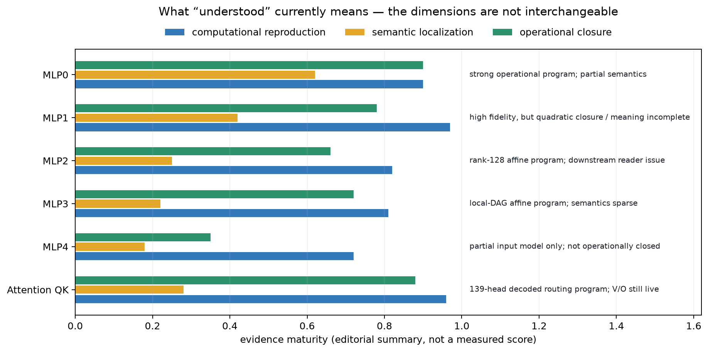

# What we understand—and what we do not

## Correction to the shorthand

We should **not** say “MLPs 0–4 are fully understood.” The evidence supports a more
uneven statement:

- MLP0 has a strong computational surrogate, a credible coarse semantic story, and
  a complete operational score rectangle for that surrogate. Roughly 10% of its
  ablation-defined behavior remains outside the best canonical table-plus-linear
  program, and its fine semantic organization is diffuse.
- MLP1 has very high-fidelity replacement programs, including a useful quadratic
  correction, but remains one of the largest unresolved sources of whole-model error.
  Its semantics and exact quotient closure are not finished.
- MLP2 has a compact rank-128 affine surrogate that passes the frozen operational
  bars in isolation, but its error compounds under downstream attention. A broad
  reader dependency remains live, so this is not a closed mechanistic account.
- MLP3 has a measured local-DAG affine surrogate with useful fidelity and complete
  operational lanes. Its human semantic interpretation is much weaker than MLP0's.
- MLP4 has partial input-source and regression results, not a canonical decoded
  operational program. It is not operationally closed and is **not** reverse
  engineered.
- The attention work explains much of the Q/K routing computation for 139 heads.
  It deliberately leaves 23 Q/K roster heads and all value/output maps and MLPs live.

The bar lengths above are an editorial map intended to prevent category errors; they
are not experimental scores. The text at right is the actual claim.

## Four different meanings of “understood”

### 1. Algebraic understanding

We know exactly what family of operation the native module computes. For a bilin18
MLP this is a bilinear map on an RMS-normalized residual state:

$$
m_\ell(z)=D_\ell\left[(L_\ell z)\odot(R_\ell z)\right]+b_\ell.
$$

This is exact but not by itself explanatory. It is comparable to saying a program
performs a matrix multiplication: true, yet silent about the algorithm implemented.

### 2. Computational understanding

We have a simpler program that predicts the module's output or substitutes for it
with small downstream loss. For example, MLP0 is largely reproduced by a token table
plus a context-dependent linear correction. This tells us *which input variables and
functional form suffice* on measured distributions.

### 3. Causal understanding

The recovered program is not merely correlated with the module. Injecting it recovers
behavior, subtracting its predicted signal selectively damages behavior, and it still
works when other modules are replaced. This is why the repository tracks held-out,
composite, extraction, removal, and OOD lanes separately.

### 4. Semantic understanding

We can say what the computation means in human terms: grammatical class, punctuation,
number, entity type, induction, quotation state, and so on. This is the weakest and
most easily overstated layer. Semantic labels require selective examples *and* causal
tests; a visually coherent cluster alone is not enough.

## Current map

| Component | Best supported computational statement | Semantic statement | Main unresolved issue |
|---|---|---|---|
| MLP0 | token-conditioned write + correction from attention-0 and embedding | sharpens lexical/syntactic class evidence | residual ~10%; fine features overlap and are diffuse |
| MLP1 | token table + broad contextual ridge + quadratic residual | likely integrates MLP0/class and early contextual state | quotient closure, semantic localization, whole-stack error |
| MLP2 | low-rank affine map from the declared early-layer parent state | no comparably strong human-readable account | downstream layer-5/head-7 reader magnifies small errors |
| MLP3 | token table + local affine map from the actual layer-3 DAG parents | semantics mostly unknown | explanation is predictive more than semantic |
| MLP4 | much of output is predictable from MLP3/MLP0/MLP2 inputs | not established; bag-of-words/topic story failed | no canonical operational frontier |
| Attention QK | sequential rank-32 product-routing program for 139 heads | collective routing handles are causal; individual branch meaning unidentifiable | 23 exact heads and all V/O maps remain live |

The chapters should move rows from right to left only when experiments justify it.
The goal is not to make every row sound neat; it is to make the remaining ignorance
precise enough to attack.
