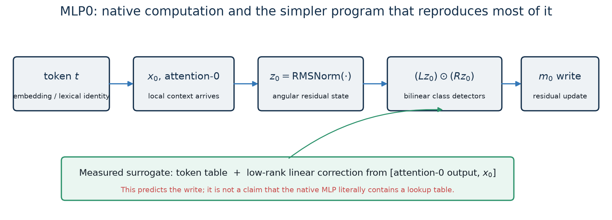
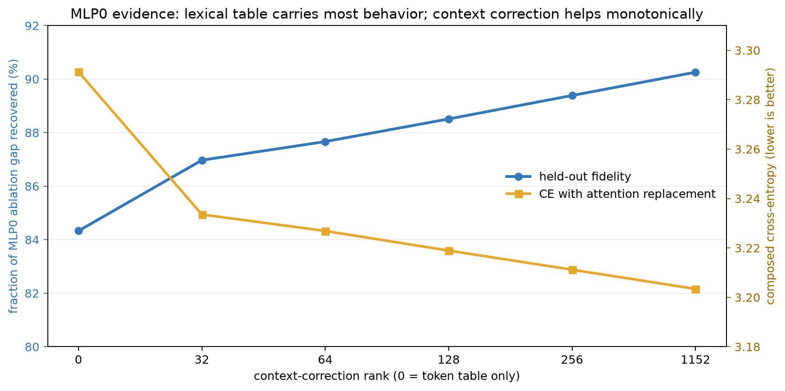

# MLP0: lexical-class sharpening with an early-context correction

## One-sentence account

MLP0 takes the normalized state after attention-0, uses paired linear detectors whose
products sharpen token and lexical-class evidence, and writes that evidence into the
residual stream; on natural text, a token-indexed output plus a linear correction from
the embedding and attention-0 output reproduces about 90% of its ablation-defined
effect. The broad story is supported. A clean decomposition into independent semantic
features is not.

## 1. What the native module computes

Let $t$ be the current token, $x_0(t)$ its normalized embedding, and $a_0$ the output
of attention layer 0 at the same position. The block constructs a residual state and
normalizes it:

$$
z_0 = \operatorname{RMSNorm}(x_{\text{mix},0}+a_0).
$$

The exact MLP then computes

$$
m_0(z_0)=D_0\left[(L_0z_0)\odot(R_0z_0)\right]+b_0.
$$

For hidden unit $r$,

$$
h_r(z_0)=(\ell_r^\top z_0)(r_r^\top z_0).
$$

This matters. The unit does not merely threshold one feature. It asks for the
co-occurrence of two linear measurements and multiplies their signed strengths.
When the two measurements detect the same coarse class, their product acts like a
quadratic sharpening operation: strong matching evidence becomes stronger, while
weak evidence shrinks relative to it.

The whole deployed function is not globally polynomial because $z_0$ includes
RMSNorm. Conditional on $z_0$, however, the MLP write is exactly quadratic.

## 2. The simpler recovered program

The measured replacement has the form

$$
\widehat m_0(t,a_0,x_0)
=T[t]+[a_0;x_0]W_r.
$$

- $T[t]$ is a compressed table indexed by the current token.
- $[a_0;x_0]$ contains the local attention-0 write and the normalized embedding.
- $W_r$ is a rank-$r$ linear correction.

This is a model of the *function performed by MLP0*, not a literal assertion that the
native weights contain a table and a ridge regression. The bilinear network and the
surrogate are different parameterizations that agree substantially on behavior.

The token-only program ($r=0$) recovers **84.33%** of the gap between an optimal
constant MLP0 output and the live model. The full-rank correction raises this to
**90.26%**. A separate, noncanonical quadratic-residual ladder reaches **93.16%**,
showing that the remaining error is partly structured rather than pure noise.

Sources:
[decoded held-out evaluation](../basis_aligned/bilinear_quotient/mlp0_quantized_eval_results.json),
[residual ladder](../basis_aligned/bilinear_quotient/mlp0_residual_ladder_results.json),
[attention-composed evaluation](../basis_aligned/bilinear_quotient/mlp0_attention_composite_curve_results.json).

## 3. What this says computationally

The dominant computation is **token-conditioned**, but not context-free.

1. Token identity already determines most of the MLP0 write. This is plausible at
   layer 0: the residual state is still close to an embedding plus one attention
   update.
2. Attention-0 and $x_0$ supply a meaningful correction. Increasing correction rank
   improves held-out fidelity monotonically and lowers loss when composed with the
   all-attention replacement.
3. The correction is broad rather than a tiny circuit. Going from rank 32 to 1152
   continues to help, although with diminishing returns.
4. The surrogate is causally relevant. At full correction rank, replacing MLP0
   retains 90.26% of its global effect. Subtracting the predicted signal causes
   **0.1477 CE** more damage than a signed-permuted matched control, with **0.1371 CE**
   median excess across the lexical-22 targets.

The operational conclusion is stronger than “MLP0 correlates with token identity”:
the decoded token-plus-context program can be inserted, extracted, and selectively
removed with consistent downstream effects.

Sources:
[operational joined table](../basis_aligned/bilinear_quotient/mlp0_operational_analysis_results.json),
[extraction/removal experiment](../basis_aligned/bilinear_quotient/mlp0_handle_curve_results.json).

## 4. What it appears to mean semantically

The best-supported semantic description is **lexical and syntactic class
sharpening**.

Among the 24 strongest class-writing hidden units examined:

- all 24 had left and right factors preferring the same coarse class;
- all 24 became more class-selective after multiplication;
- the mean sharpening factor was **1.52×**.

Observed preferred categories included determiners, punctuation, capitalized tokens,
conjunction-like tokens, pronouns, numbers, and broad content-word groups. Examples
include units activated by “the/a/an,” punctuation and quote tokens, capitalized
initials, and preposition/conjunction families.

This suggests the following local algorithm:

1. $L_0z_0$ and $R_0z_0$ each measure overlapping evidence for a token class.
2. Their product boosts positions where both measurements agree.
3. $D_0$ writes the sharpened evidence into residual directions read strongly by
   MLP1 and, for some classes, early attention.

The downstream-reader evidence is especially strong for MLP1: removing MLP0 class
axes reduces normalized MLP1 left/right responses for many classes, whereas MLP5 and
MLP16 responses are much closer to one. A separate edge-rank experiment finds that a
rank-32 MLP0→MLP1 connection recovers **81.4%** of the measured edge gap and rank 128
recovers **91.95%**.

Sources:
[bilinear trace](../basis_aligned/bilinear_quotient/mlp0_bilinear_trace_results.json),
[left/right sharpening](../basis_aligned/bilinear_quotient/mlp0_leftright_results.json),
[downstream readers](../basis_aligned/bilinear_quotient/mlp0_class_readers_results.json),
[MLP0→MLP1 edge rank](../basis_aligned/bilinear_quotient/mlp0_mlp1_edge_rank_results.json).

## 5. Is this token clustering, and are the clusters exactly read downstream?

“Soft overlapping token clustering” is a fair coarse description, but a hard map
$t\mapsto c(t)\mapsto w_c$ is not sufficient. In the older clustering protocol, the
full token table recovered 86.56%, whereas 64 and 256 downstream-defined hard
clusters recovered only 52.82% and 62.36%. Tokens within a named class therefore
retain computationally important distinctions.

The downstream clustering experiment was directionally right but approximate. It
mapped token writes through selected block-1 Q/K/V and MLP Left/Right weights, then
used fixed random projections and k-means. It did **not** compute exact equivalence
under literal readers.

The exact immediate-reader relation is instead

$$
v\sim w \quad\Longleftrightarrow\quad W_i(v-w)=0
\text{ for every declared block-1 reader }W_i.
$$

Thus hard computational classes are cosets of the readers' joint kernel. Approximate
clustering is a separate choice made in the induced reader metric. After residual
addition and RMSNorm, the state-local first-order readers are $W_iJ_{\rm RMS}(x)$,
so even that metric depends on the residual state.

A CPU primitive implements exact input evaluation, the joint-reader quotient, the
RMSNorm-tangent quotient, and literal composition of $D_0$ columns through reader
weights. The frozen checkpoint audit has now run. Stacking the literal block-1
Q/K/Q2/K2/V and MLP1 Left/Right readers gives rank **1152/1152**, nullity **0**, and
a well-conditioned Gram spectrum (condition number **5.59**). Therefore two distinct
MLP0 writes never become exactly equal at *all* of those immediate linear reader
interfaces. At this scope the exact quotient projector is simply the identity: there
are no nontrivial exact hard output clusters to discover.

This does not make the clustering description false. It makes it approximate:
lexical classes are nearby or similarly used in a reader-weighted metric, not
literally identical. The spectrum is broad—969, 1131, and 1150 directions are needed
for 90%, 99%, and 99.9% of reader-Gram energy—so there is no exact low-dimensional
reader bottleneck either. Full-network nonlinear causal interchange remains a
separate empirical question because residual addition and RMSNorm can change the
state-local Jacobian.

Sources:
[exact folding and quotient note](../basis_aligned/bilinear_quotient/MLP0_EXACT_FOLD_READER.md),
[machine-readable contract](../basis_aligned/bilinear_quotient/mlp0_exact_fold_reader_contract.json),
[literal checkpoint reader-rank result](../basis_aligned/bilinear_quotient/mlp0_reader_rank_results.json),
[earlier approximate downstream clusters](../basis_aligned/bilinear_quotient/mlp0_downstream_clusters_results.json).

## 6. What the semantic story does **not** explain

The neat version—“MLP0 contains one clean independent subspace per grammatical
class”—is contradicted by several results.

- Class-subspace ablations did not produce a diagonal damage matrix at ranks 2, 4,
  or 8. The class axes overlap substantially; maximum off-diagonal cosine was 0.639.
- Only the number axis passed the strict diagonal reader test in the reported screen.
- Semantic interchange moved predictions toward the donor class in 5 of 6 tested
  directions, but the mean shift was only 0.0066 and number→determiner failed.
- A 101-unit “article/determiner” cluster explained only **4.09%** of the whole-MLP
  article-margin effect in a localization test.
- Other cluster patching results were weak, asymmetric, or failed their null checks.
- A direct sparse quadratic feature ranking did not find the predicted small set of
  sufficient clean features; 2,048 of 9,216 features were still needed to reduce its
  reported cost near 0.06.

So “class sharpening” is a good description of a prominent computation, but the
representation is distributed, overlapping, and mixed with token-specific detail.
It is not a solved dictionary of grammatical neurons.

Sources:
[class subspaces](../basis_aligned/bilinear_quotient/mlp0_class_subspace_results.json),
[class interchange](../basis_aligned/bilinear_quotient/mlp0_class_interchange_results.json),
[article localization](../basis_aligned/bilinear_quotient/article_mlp0_localization_results.json),
[cluster patching](../basis_aligned/bilinear_quotient/mlp0_cluster13_7_patching_results.json),
[quadratic feature sparsity](../basis_aligned/bilinear_quotient/mlp0_squares_results.json).

## 7. OOD and composition limits

The full canonical table-plus-linear program adds **0.0939 CE** on code and **0.0851
CE** on Pile relative to the live MLP0. Its synthetic-induction penalty is much larger:
**1.7692 CE**. More bits improve natural-text scores monotonically, but induction is
not monotone across every rank.

When combined with the frozen all-attention replacement, the full MLP0 program gives
CE **3.2034**, compared with **3.1059** for the attention background alone. Its
compounding factor is only **1.036**, which is encouraging: MLP0's surrogate composes
much better than several later early-layer replacements. This still does not mean the
whole model is reconstructed; all other MLPs and the live attention dependencies
remain.

Source: [OOD curve](../basis_aligned/bilinear_quotient/mlp0_ood_curve_results.json).

## 8. Confidence ledger

| Claim | Confidence | Reason |
|---|---|---|
| Native MLP0 is an RMSNorm-conditioned bilinear map | exact | implemented forward equation and zero-error reconstruction |
| Token identity carries most of its behavior | high | token-only decoded replacement recovers 84.33% |
| Attention-0/embedding context supplies additional correction | high | monotone rank curve, held-out and composed tests |
| A major role is lexical/syntactic class sharpening | medium-high | factor traces, examples, multiplication sharpening, reader tests |
| MLP0 performs soft overlapping token clustering | medium-high | hard-cluster compression works partially but loses token-specific behavior |
| Nontrivial exact hard clusters under immediate block-1 readers exist | no | literal reader stack is full rank, with nullity zero |
| Classes form clean independent subspaces | low / contradicted | diagonal ablation prediction failed |
| The full semantic mechanism is known | low | ~10% operational residue and diffuse/asymmetric semantic effects |

## 9. The next decisive MLP0 experiment

The strongest next test is not another cluster naming exercise. It is a
**cross-context class-preserving counterfactual**:

1. hold token class fixed while swapping token identity and attention-0 context;
2. predict the MLP0 write with separate table, linear-context, and quadratic-residual
   terms;
3. measure which term transfers class effects and which preserves token-specific
   effects;
4. selectively subtract each term with energy- and covariance-matched controls;
5. repeat on natural text, code, and synthetic induction.

That would separate “lexical memorization,” “class sharpening,” and “contextual
correction” causally instead of treating them as one blended explanation.
