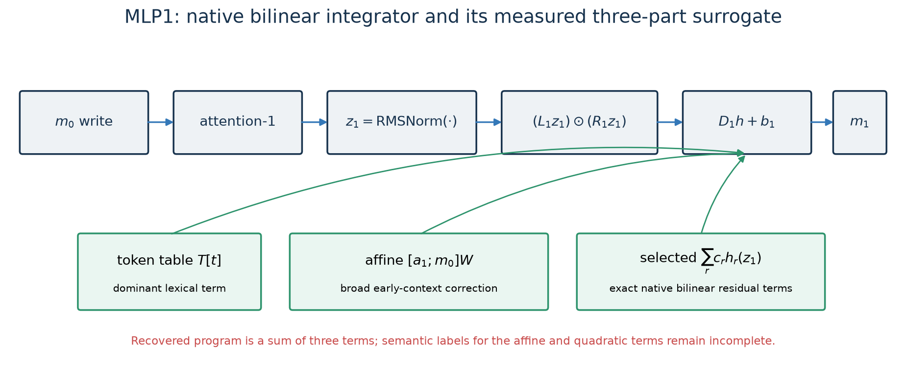
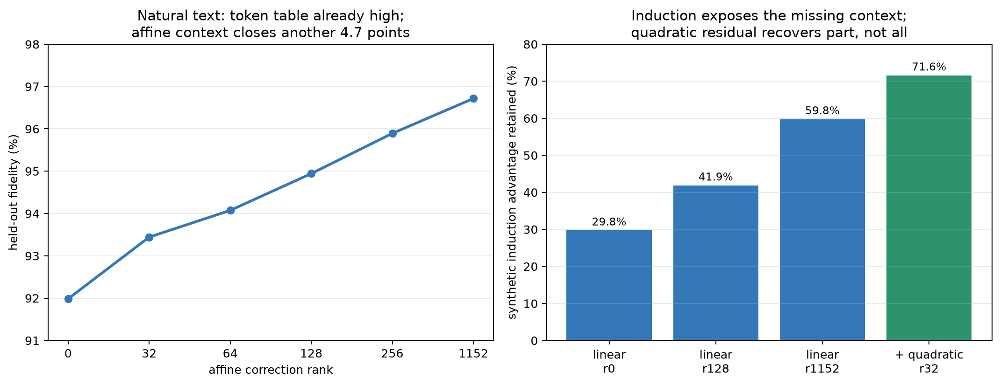

# MLP1: lexical categorization plus a broad early-context interaction

## One-sentence account

MLP1 still behaves mostly like a token-conditioned lexical categorizer on natural
text, but unlike MLP0 it also needs a broad correction from the actual MLP0 and
attention-1 writes and a small set of native bilinear residual terms; those context
terms are disproportionately important for induction. We can reproduce roughly 97%
of its ablation-defined natural-text effect, but we cannot yet name the missing
contextual algorithm.

## 1. Exact native computation

After block 0 has written $m_0$ and block 1 attention has written $a_1$, the model
forms and normalizes the layer-1 residual state $z_1$. MLP1 computes

$$
m_1(z_1)=D_1\left[(L_1z_1)\odot(R_1z_1)\right]+b_1.
$$

Every hidden component is again a product

$$
h_r(z_1)=(\ell_r^\top z_1)(r_r^\top z_1).
$$

This equation is exact. The interpretation “early integrator” comes from what simpler
variables reproduce $m_1$, not from the equation alone.

## 2. The recovered three-part program

The strongest currently promoted family has three additive pieces:

$$
\widehat m_1(t,a_1,m_0,z_1)
=T[t]+[a_1;m_0]W+\sum_{r\in S_k}c_rh_r(z_1).
$$

### Token table $T[t]$

The table is indexed by the current token and already recovers **91.99%** of the gap
between an optimal constant MLP1 output and the live model on held-out FineWeb. This
is strong evidence that the dominant natural-text behavior is lexical or
token-conditioned.

### Affine parent correction $[a_1;m_0]W$

The correction sees the actual attention-1 and MLP0 writes at the same position. It
is not allowed to inspect future layers. Increasing its rank monotonically raises
held-out fidelity, reaching **96.72%** at full rank and **96.60%** on disjoint
replication.

### Selected native bilinear residual $\sum c_rh_r(z_1)$

After fitting the full affine term, the residual fitter scores actual MLP1 hidden
products, selects a frozen set, and jointly fits only their scalar weights. Thus this
term reuses exact native bilinear features rather than inventing an unconstrained
quadratic regression. Rank 32 is the first candidate that improves every frozen
operational criterion over the linear baseline. Its known-gauge price is **125.31
Mbit**, only **2.29 Mbit** above the linear program.

The price is deliberately called “known-gauge,” not a final quotient price: explicit
scale, sign, and ordering gauges are removed, but global uniqueness of the partially
symmetric CP representation has not been proved.

Sources:
[linear evaluator](../basis_aligned/bilinear_quotient/mlp1_quantized_eval.py),
[quadratic fitter](../basis_aligned/bilinear_quotient/mlp1_quadratic_residual_fit.py),
[promotion decision](../basis_aligned/bilinear_quotient/mlp1_quadratic_promotion.json).

## 3. What the numbers mean

On natural text, the full affine baseline has CE **3.1837**. Adding the rank-32
bilinear residual lowers it to **3.1653**. Under the frozen all-attention background,
the same correction lowers composed CE from **3.4529** to **3.3892**.

The causal signal is strong. The rank-32 program:

- retains roughly **97%** of MLP1's global optimal-constant gap;
- causes **0.926 CE** more removal damage than its matched control;
- has **0.932 CE** median excess removal damage across lexical-22;
- improves code/Pile OOD aggregate loss from **0.318 to 0.272 CE** relative to live
  MLP1.

This establishes a behaviorally important replacement. It does not identify every
semantic variable inside the affine and quadratic terms.

Sources:
[held-out curve](../basis_aligned/bilinear_quotient/mlp1_quantized_eval_results.json),
[quadratic causal handles](../basis_aligned/bilinear_quotient/mlp1_quadratic_handle_curve_results.json),
[quadratic OOD](../basis_aligned/bilinear_quotient/mlp1_quadratic_ood_curve_results.json).

## 4. Coarse semantics: mostly the current token on natural text

The strongest unit-level evidence resembles MLP0. In a trace of the 24 largest
class-writing units:

- all 24 were class-selective;
- all 24 used both bilinear factors;
- all 24 were classified as driven more by the current token than the previous token;
- none were classified as previous-token driven.

The preferred categories again include determiners, punctuation, capitalized tokens,
and broad word classes. Large clusters contain examples dominated by punctuation and
quotation bytes, “the/a,” capitalized forms, and common function words. A full
50,257-token table recovered **94.45%** in an earlier protocol, while unsupervised
cluster tables required hundreds to thousands of clusters and still lagged.

The supported semantic statement is therefore:

> On ordinary natural text, much of MLP1 sharpens or rewrites current-token lexical
> categories, much as MLP0 does, while its parent correction adapts those writes to
> the early contextual state.

That last clause matters: it is a statement about the whole surrogate, not the top 24
units alone.

Sources:
[bilinear trace](../basis_aligned/bilinear_quotient/mlp1_bilinear_trace_results.json),
[unit clusters](../basis_aligned/bilinear_quotient/mlp1_unit_cluster_results.json),
[cluster-table curve](../basis_aligned/bilinear_quotient/mlp1_clusters_results.json).

## 5. Context is small on average but essential on induction

An early residual-context screen found that a simple local context feature added only
**0.67 percentage points** over a 50k token table for MLP1, much less than the same
kind of correction at MLP17. This appears to say MLP1 is nearly context-free.

Synthetic induction reveals why that conclusion would be wrong. In repeated-token
sequences, the clean model enjoys an 11.37 CE advantage over a globally permuted
control. The token-only MLP1 program retains only **29.8%** of that advantage. A
rank-128 affine correction retains **41.9%**, the full affine correction retains
**59.8%**, and the promoted rank-32 quadratic program raises retention to **71.6%**.

So context is low-volume under the natural-text average yet high-value on a specific
algorithmic behavior. The remaining 28.4% induction gap is direct evidence that the
recovered program is not the entire MLP1 algorithm.

Sources:
[natural residual context](../basis_aligned/bilinear_quotient/mlp1_residual_ctx_results.json),
[induction localization](../basis_aligned/bilinear_quotient/mlp1_induction_localization_results.json),
[quadratic induction evaluation](../basis_aligned/bilinear_quotient/mlp1_quadratic_residual_eval_results.json).

## 6. Candidate semantic variables inside the distributed remainder

The residual after coarse class and position features has effective rank about
**462**, so it is not a tiny missing direction. Adding a previous-token variable
raises the reported retained fraction from **0.737 to 0.874**; a joint variant reaches
**0.888**, compared with **0.799** for a random control. Separate subspace folding
finds above-chance alignment for:

- coarse class: 2.87–2.88× chance;
- position: 1.66–1.67× chance;
- token-fine identity: about 1.29× chance;
- previous token: about 1.24–1.29× chance.

These results support a mixed representation of current lexical class, position,
fine token identity, and recent-token context. They do not prove that these four
variables form an independent basis or exhaust the residual.

Sources:
[remainder analysis](../basis_aligned/bilinear_quotient/mlp1_remainder_results.json),
[folding analysis](../basis_aligned/bilinear_quotient/mlp1_folding_results.json).

## 7. Counterevidence against the neat “MLP0 feeds MLP1 article circuit” story

Several tempting narratives failed.

- Ablating the named MLP0 article/determiner cluster changed the measured MLP1
  article response by only **−1.15%**, less than a random matched ablation in that
  experiment. The registered verdict was **parallel (independent)**, not a serial
  MLP0→MLP1 article circuit.
- The 46-unit MLP1 article cluster explained **−0.57%** of the whole-MLP1 article
  margin effect: effectively none, and with the wrong sign.
- A hand-designed 8-dimensional semantic write basis retained only **13.5%** of the
  global MLP1 gap, whereas an 8-dimensional PCA basis retained **40.2%**. The
  predicted fragment selectivity failed.
- Clustering by downstream write directions did not beat clustering by activation at
  matched sizes; several registered “deep semantic cluster” predictions failed.
- Named cluster groups have heterogeneous functional ranks from 16 to 128, and some
  token/write examples are difficult to interpret coherently.

The lesson is not that MLP1 has no semantics. It is that semantics are distributed
and overlapping enough that a small named cluster or hand-written axis set is not a
faithful mechanistic basis.

Sources:
[MLP0 dependency test](../basis_aligned/bilinear_quotient/mlp1_reads_mlp0_results.json),
[article localization](../basis_aligned/bilinear_quotient/article_mlp1_localization_results.json),
[8-D handle test](../basis_aligned/bilinear_quotient/handle_score_mlp1_results.json),
[downstream clusters](../basis_aligned/bilinear_quotient/mlp1_downstream_clusters_results.json),
[cluster naming](../basis_aligned/bilinear_quotient/rspd_mlp1_cluster_naming_results.json).

## 8. Confidence ledger

| Claim | Confidence | Evidence |
|---|---|---|
| Native MLP1 is an RMSNorm-conditioned bilinear map | exact | implemented forward equation |
| Current-token identity dominates average natural-text behavior | high | token-table fidelity and top-unit traces |
| Actual $a_1$ and $m_0$ writes provide a broad useful correction | high | monotone affine rank curve and replication |
| Selected native bilinear terms close a real residual | high operationally | rank-32 dominates linear baseline on frozen lanes |
| Previous-token/position variables contribute to the remainder | medium | remainder and folding screens |
| MLP1 implements a clean serial MLP0 article circuit | contradicted | targeted dependency/localization tests |
| Individual semantic features are cleanly identified | low | cluster/handle failures and high residual rank |
| Exact global quotient price is finished | no | CP uniqueness remains conditional |

## 9. What MLP1 is doing, in plain language

A useful mental model is:

1. **Recognize the current token's broad lexical role.** This supplies most of the
   ordinary-text write.
2. **Adjust that write using what MLP0 and attention-1 just contributed.** This is a
   broad correction, not one small edge.
3. **Apply a few especially useful quadratic conjunctions of the complete normalized
   state.** These recover context-sensitive behavior missed by the affine program.
4. **Write a distributed residual code that later layers can use.** Some of that code
   tracks class, position, token identity, and recent-token context, but the axes are
   overlapping and not fully named.

This is substantially more than “we fitted MLP1.” It is still less than a complete
algorithmic explanation.

## 10. Next decisive experiment

The next experiment should factorially cross four variables—current-token identity,
current-token class, previous token, and repeated-sequence phase—while holding the
others fixed. For each frozen surrogate term, measure:

1. transfer under counterfactual swaps;
2. selective removal versus covariance-matched controls;
3. whether the rank-32 bilinear terms specifically restore induction phase rather
   than merely correcting output magnitude;
4. whether the same factorization holds on natural text, code, and synthetic repeats.

That would turn “context matters” into a more precise statement about *which context
the quadratic residual computes*.
