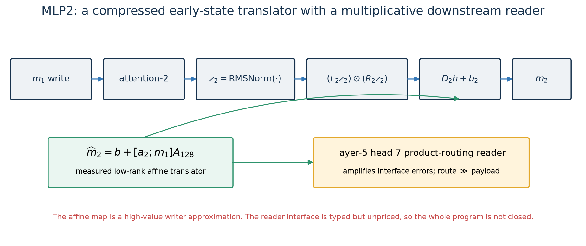
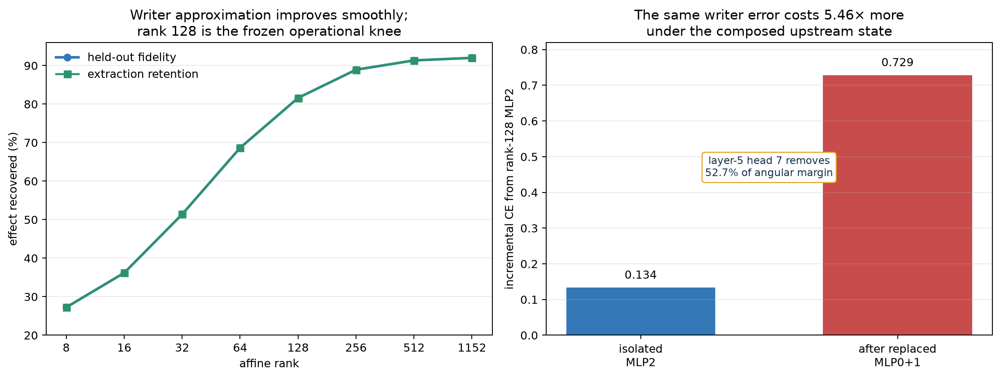

# MLP2: a compressed early-state translator with a multiplicative reader

## One-sentence account

MLP2 can be approximated as a rank-128 affine translation from the immediately
preceding attention-2 and MLP1 writes into a new residual-stream write. That compact
program recovers about 82% of MLP2's isolated effect, but its errors are amplified
when earlier replacements are composed, chiefly through the multiplicative routing
kernel of layer-5 attention head 7. We know considerably more about how this signal
is *consumed* than what its 128 coordinates mean in human terms.



## 1. Exact native computation

After MLP1 has written $m_1$ and attention-2 has written $a_2$, the layer-2 residual
is normalized to $z_2$. The native MLP computes

$$
m_2(z_2)=D_2\left[(L_2z_2)\odot(R_2z_2)\right]+b_2.
$$

As in MLP0 and MLP1, every hidden unit is exactly bilinear:

$$
h_r(z_2)=(\ell_r^\top z_2)(r_r^\top z_2).
$$

This tells us the architecture but not the learned algorithm. The simpler recovered
program comes from measuring which already-computed variables predict the output.

## 2. The recovered writer program

The fitted family uses only the two local parent writes:

$$
x=[a_2;m_1], \qquad
\widehat m_2=b+(x-\mu_x)U_r\operatorname{diag}(s_r)V_r^\top.
$$

The matrices are prefixes of one frozen singular-value decomposition. Equivalently,
$A_r=U_r\operatorname{diag}(s_r)V_r^\top$ is a rank-$r$ affine translator from the
joint early-context state into MLP2's residual write. It does not use token identity
directly, future layers, cached live MLP2 activations, or an unconstrained nonlinear
model.

At rank 128 the decoded program has:

- **7.65 Mbit** exact canonical price at quantization step $2^{-16}$;
- **81.61%** held-out fidelity;
- **81.61%** global extraction retention;
- **0.0686 CE** aligned-over-Haar global removal damage;
- **0.1038 CE** median code/Pile OOD penalty;
- **1.1896 CE** synthetic-induction penalty.

Rank 128 is the smallest point satisfying the frozen operational bars, not an exact
rank theorem. A precision ladder shows that $2^{-8}$ already gives nearly the same
fidelity at about 3.02 Mbit. The 7.65-Mbit number is therefore a conservative
production encoding, not the unique shortest description.

Sources:
[pricing derivation](../basis_aligned/bilinear_quotient/MLP2_AFFINE_PRICING.md),
[machine-readable operational inventory](../basis_aligned/bilinear_quotient/mlp2_replacement_inventory.json),
[quantization ladder](../basis_aligned/bilinear_quotient/mlp2_quantization_ladder_results.json).

## 3. What the rank curve establishes



All eight measured ranks are nondominated on held-out fidelity. Recovery rises from
27.24% at rank 8 to 68.65% at rank 64, 81.61% at rank 128, and 92.01% at full affine
rank 1152. Extraction follows almost exactly the same curve. This agreement says the
affine axes carry causally usable MLP2 signal rather than merely minimizing output
distance.

Selective removal provides a second causal check. At rank 128, deleting the aligned
output subspace damages CE by 0.0722, while the median equal-rank Haar subspace damages
it by only 0.00353. The aligned subspace beats all seven controls.

There is a geometric caveat at rank 1152. Both the aligned image and every rank-1152
Haar control span the entire 1152-dimensional output space, so their matched-subspace
excess must be zero. That endpoint cannot be interpreted as loss of causal
specificity; the control has become identical to the intervention.

## 4. The strongest computational interpretation

MLP2 is best described as an **early-state translator**:

1. attention-2 and MLP1 produce two different summaries of the current prefix;
2. MLP2 maps their joint state into a lower-dimensional family of residual writes;
3. later attention treats those writes as inputs to multiplicative routing decisions.

“Translator” is more precise than “feature detector” here. The recovered program
does not need a token lookup table and its meaningful object is a map between two
spaces: the local parent-write space and the downstream residual space. But the SVD
coordinates themselves are gauge-dependent linear combinations, so rank component
17, for example, is not automatically a stable semantic feature.

This is a computational interpretation. It does **not** tell us that MLP2 represents
one named grammatical variable or that its 128 axes form independent concepts.

## 5. Why isolated fidelity overstates understanding

With all other components live, replacing MLP2 increases CE by **0.1335**. When the
rank-128 MLP0 and MLP1 programs are already active, adding exactly the same MLP2
program increases CE by **0.7287**—**5.46 times** its isolated cost. The excess above
the isolated-error sum is 0.5952 CE.

A boundary factorial shows this is not attributable to only one parent:

| replaced writers | excess above isolated sum (CE) |
|---|---:|
| MLP0 + MLP2 | 0.3755 |
| MLP1 + MLP2 | 0.4371 |
| MLP0 + MLP1 + MLP2 | 0.7137 |

The joint upstream shift is worse than either pair. However, several obvious scalar
explanations failed: the joint arm does not have the largest input-mean shift,
unweighted output residual, projected covariance shift, first-order loss secant,
RMSNorm-tangent error, or nonlinear angular ratio. The failure is a structured
reader interaction, not simply “more error.”

Sources:
[progressive chain](../basis_aligned/bilinear_quotient/mlp03_progressive_chain_results.json),
[boundary factorial](../basis_aligned/bilinear_quotient/mlp2_boundary_factorial_results.json),
[composed moments](../basis_aligned/bilinear_quotient/mlp2_composed_moment_audit_results.json),
[loss-sensitive audit](../basis_aligned/bilinear_quotient/mlp2_loss_sensitive_shift_results.json),
[RMSNorm tangent audit](../basis_aligned/bilinear_quotient/mlp2_rmsnorm_tangent_results.json).

## 6. Where the error is read: layer-5 product attention

Angular propagation first makes the joint replacement arm exceed both single arms at
the input to layer-5 MLP, so the ordering flips across layer-5 attention. Patching all
nine attention-head writes removes 68.57% of that joint angular margin. Head 7 alone
removes **52.67%**, much more than any other head.

For this architecture, head 7 routes with the product of two attention scores. In
schematic form,

$$
K_{tj}
=\frac{(q_t^\top k_j)(q_t'^\top k_j')}{128^2},
\qquad
o_t=\sum_{j\le t}K_{tj}v_j.
$$

The exact implementation also mixes two payload streams, but interventions show the
problem is principally routing:

- patching head 7 removes 52.67% of the total joint margin;
- patching its route removes 46.58%;
- patching only its payload removes 3.95%;
- both product-score factors matter;
- all four $q,k,q',k'$ sides have positive effects, with no two-way dominance;
- causal support is broad: the largest single total effect is at lags 128–255, while
  the densest effect is at lags 4–7.

Thus MLP2's approximation error changes *which earlier positions head 7 reads*, not
primarily the content it retrieves after choosing them. This is the most concrete
semantic statement currently available: the relevant MLP2 signal participates in
prefix routing over both local and long-range context.

Sources:
[head decomposition](../basis_aligned/bilinear_quotient/mlp2_layer5_head_patch_results.json),
[route/payload factorization](../basis_aligned/bilinear_quotient/mlp2_layer5_head7_factor_results.json),
[product factors](../basis_aligned/bilinear_quotient/mlp2_layer5_head7_product_factor_results.json),
[Q/K sides](../basis_aligned/bilinear_quotient/mlp2_layer5_head7_qk_side_results.json),
[lag decomposition](../basis_aligned/bilinear_quotient/mlp2_layer5_head7_lag_results.json).

## 7. What the unit-level semantics do and do not show

Clustering native MLP2 units is reproducible above a shuffled null (adjusted Rand
index 0.295 versus 0.021), and several large clusters prefer broad token classes such
as space-prefixed words, subwords, or suffix-like continuations. But the registered
concentration prediction failed, examples within clusters are heterogeneous, and an
“article” label is not supported by a clean causal localization.

Accordingly, the evidence supports distributed lexical/morphological sensitivity but
not a compact dictionary of named MLP2 concepts. The reader experiments are stronger
than the unit labels because they manipulate the exact downstream computation and
reconstruct the patched head outputs with zero reported error.

Source: [unit-cluster audit](../basis_aligned/bilinear_quotient/mlp2_unit_cluster_results.json).

## 8. Quotient-aware simplicity and the open interface

The affine SVD codec removes sign gauge and folds centering into the bias. It rejects
near-degenerate singular-value strata where rotations within a repeated subspace
would make sign fixing insufficient. Therefore 7.65 Mbit is a valid canonical price
for the declared writer candidate under the codec's regularity conditions.

It is not yet a whole-program price. The reader's factored coordinates have inverse-
transpose and reciprocal-scale gauges, and the behaviorally relevant object may be
the causal product kernel $K$ or its action $K@V$, rather than four separately priced
Q/K factors. The current certificate therefore records:

- writer bits: known;
- reader interface: typed;
- reader-closure bits: unknown;
- composition-complete quotient bits: unknown;
- eligibility for whole-program MDL: false.

Increasing writer rank does not remove this obligation. Full affine rank lowers the
closure excess from 0.5952 to 0.3530 CE, leaving **59.3%** of the rank-128 excess.
Every measured rank remains nondominated in bits versus closure error.

Source: [reader-closure certificate](../basis_aligned/bilinear_quotient/mlp2_reader_closure_certificate.json).

## 9. Plain-language algorithm

The strongest honest pseudocode is:

```text
take attention-2's contextual write
take MLP1's lexical/contextual write
translate their joint state through roughly 128 important affine directions
write that translation into the residual stream
later, layer-5 product attention uses the changed residual state
to decide which nearby and distant prefix positions to route from
```

The first four lines are a high-confidence compressed computation. The final two are
a causally localized downstream use. What the routed positions *mean*—syntax,
reference, copying, document structure, or a mixture—has not been established.

## 10. Confidence ledger

| Claim | Confidence |
|---|---|
| exact native bilinear algebra | exact |
| local-parent affine family and canonical decoded programs | high |
| rank 128 is the smallest point meeting the frozen operational bars | high, protocol-conditional |
| affine image carries causally specific signal below full rank | high |
| layer-5 attention is the first observed composed reader | high |
| head 7 product routing explains a majority of the layer-5 attention margin | high |
| MLP2 is a distributed early-state translator | medium-high computational interpretation |
| named semantics of the 128 writer coordinates | low |
| complete quotient-aware writer-plus-reader program | incomplete |

## 11. Next decisive experiment

The next useful experiment is not another Euclidean writer-rank sweep. It is a
held-out, no-oracle test of a compact program for the **causal product kernel or its
routed action**, evaluated under the exact composed MLP0+MLP1 parent. The candidate
must preserve both query edits and stored-prefix key edits, report local and long-lag
behavior separately, and carry an explicit quotient price. Success would turn the
typed reader dependency into an executable interface; failure would show that the
rank-128 writer is useful only when later native circuitry remains live.

The attempted local pullback-metric shortcut should not be silently revived: its
8-probe orientation estimate changed by 59.1% from four to eight probes and was
rejected under its preregistered convergence rule.
