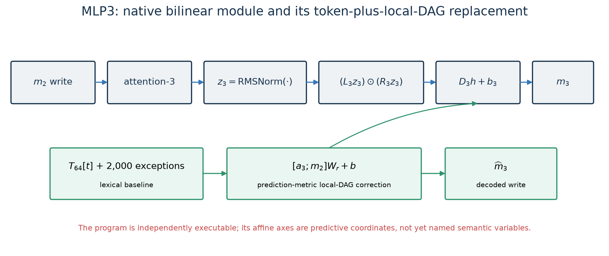
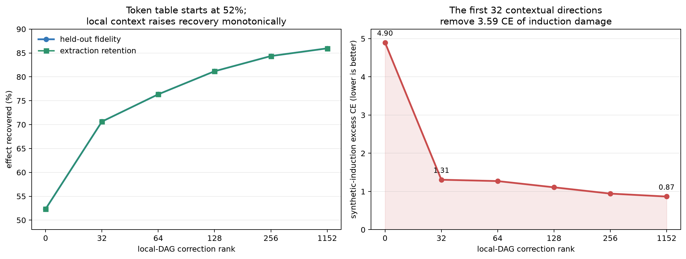

# MLP3: lexical baseline plus local matcher/context re-encoding

## One-sentence account

MLP3 is largely reproducible by adding a current-token lexical write to a reduced-
rank affine re-encoding of attention-3 and MLP2. The first 32 contextual directions
are remarkably efficient and carry sequence-generalizing behavior, but their human
meaning remains unresolved: “matcher/context re-encoding” is an architectural and
behavioral description, not a claim that we have identified a named algorithm.



## 1. Exact native computation

After MLP2 writes $m_2$ and attention-3 writes $a_3$, the model normalizes the
layer-3 residual to $z_3$. Native MLP3 computes

$$
m_3(z_3)=D_3\left[(L_3z_3)\odot(R_3z_3)\right]+b_3,
$$

with exact hidden products

$$
h_r(z_3)=(\ell_r^\top z_3)(r_r^\top z_3).
$$

As before, the bilinear equation describes the mechanism class but does not label
the learned variables.

## 2. The independently executable replacement

The recovered family is

$$
\widehat m_3(t,a_3,m_2)=T_{64}[t]+E[t]+[a_3;m_2]W_r+b.
$$

Here:

- $T_{64}[t]$ is a rank-64 table over all 50,257 token IDs;
- $E[t]$ stores separately encoded table exceptions for the 2,000 most frequent fit tokens;
- $[a_3;m_2]W_r+b$ is a rank-$r$ affine correction from the two local parent writes;
- $r\in\{0,32,64,128,256,1152\}$ indexes one frozen nested family.

The runtime takes only token ID, the actual attention-3 output, the actual MLP2
output, and decoded constants. It is forbidden from calling MLP3 or reading its
weights or cached output. This matters because older projection diagnostics attained
higher fidelity while still executing native MLP3; those were analyses of MLP3, not
standalone replacements.

Sources:
[frozen protocol](../basis_aligned/bilinear_quotient/mlp3_frontier_protocol.json),
[checkpoint-independent runtime](../basis_aligned/bilinear_quotient/mlp3_program.py),
[artifact manifest](../basis_aligned/bilinear_quotient/mlp3_tier2000_local_affine_artifact_manifest.json).

## 3. Why the affine ranks are not ordinary SVD ranks

Let $X=[a_3;m_2]$ and let $Y$ be the residual left after fitting the token table. The
fit minimizes

$$
J(W)=\lVert Y-XW\rVert_F^2+\lambda\lVert W\rVert_F^2,
\qquad \operatorname{rank}(W)\le r.
$$

Truncating the ordinary SVD of the full coefficient matrix would minimize coefficient
distance, not prediction error. That is wrong when $X$ is anisotropic, as residual-
stream inputs are. With

$$
A=X^\top X+\lambda I, \qquad C=X^\top Y,
$$

the code instead takes the SVD of $A^{-1/2}C$ and decodes

$$
W_r=A^{-1/2}U_{:r}\operatorname{diag}(s_{:r})V_{:r}^\top.
$$

By completing the square and applying Eckart–Young, every prefix is optimal for the
declared penalized fit objective. This does not guarantee monotone language-model CE;
that remained an empirical falsifier and happened to pass on every measured lane.

Sources:
[derivation and primary references](../basis_aligned/bilinear_quotient/MLP3_REDUCED_RANK_MATH.md),
[implementation](../basis_aligned/bilinear_quotient/reduced_rank_ridge.py).

## 4. What the operational frontier says



The token-only rank-0 program already recovers **52.34%** of the held-out optimal-
constant gap. Adding the first 32 local-DAG directions raises recovery to **70.64%**.
Rank 128 reaches **81.17%**, and full affine rank reaches **85.97%**.

Extraction retention matches those values to reported precision. Matched removal is
also positive and strictly strengthens: global excess removal damage rises from
0.0351 CE at rank 0 to 0.1000 at rank 128 and 0.1364 at full rank. Therefore the
extra contextual directions carry causally consequential signal, not merely output
variance.

Composition is unusually stable within this family. With the frozen attention
replacement active, rank-128 composed CE is 3.2527 and its compounding factor is
1.116. Every rank improves composed CE monotonically. In the separate progressive
MLP0–3 chain, inserting MLP3 after MLP0–2 actually repairs 0.0052 CE rather than
adding its isolated 0.1148 CE cost. That observation does not prove general negative
compounding, but it shows MLP3 was not the failing interface in that chain.

Source: [machine-readable operational inventory](../basis_aligned/bilinear_quotient/mlp3_replacement_inventory.json).

## 5. Semantic split: lexical baseline versus sequence-generalizing correction

The rank-0 table's 52.34% recovery is direct evidence for a large current-token
lexical component. But token identity alone transfers poorly to synthetic induction:
its excess CE is **4.8978**.

The first 32 affine directions reduce that induction penalty to **1.3078**, a 3.59-CE
improvement for only 1.210 additional Mbit. Code and Pile improve at the same step.
Because these directions read actual attention-3 and MLP2 writes, not token identity,
the improvement is evidence for sequence-generalizing contextual structure.

The strongest defensible interpretation is:

> MLP3 preserves a lexical default and re-encodes locally available matcher/context
> evidence into residual directions that later layers can use.

“Matcher” here means that attention supplies prefix-dependent evidence and MLP3
transforms it; it does not yet specify whether the evidence concerns copying,
agreement, quotation boundaries, entity continuity, document structure, or several
of these at once.

## 6. What the semantic handle experiment adds

A hand-designed eight-dimensional write basis was tested on fragment and determiner
targets. On held-out rows it retained 30.25% of the global MLP3 gap but 42.60% on the
fragment subset, yielding 1.408× fragment selectivity. Removing that basis caused
0.0307 CE global damage versus 0.0001 for a matched random basis, and the direction
generalized to a second row set.

This is evidence that a small semantically chosen subspace carries real and somewhat
fragment-enriched behavior. But its registered site-selectivity prediction failed,
and PCA-8 retained substantially more global behavior (48.69%). The result supports
a partial fragment/morphology handle, not an eight-variable decomposition of MLP3.

Source: [semantic handle-site audit](../basis_aligned/bilinear_quotient/handle_site_mlp3_results.json).

## 7. Simplicity accounting

The rank-0 table already costs **75.68 Mbit**; the table dominates the description.
The affine additions produce this tradeoff:

| affine rank | quotient price (Mbit) | held-out fidelity | synthetic-induction excess CE |
|---:|---:|---:|---:|
| 0 | 75.68 | 52.34% | 4.898 |
| 32 | 76.89 | 70.64% | 1.308 |
| 64 | 78.10 | 76.35% | 1.272 |
| 128 | 80.51 | 81.17% | 1.109 |
| 256 | 85.34 | 84.36% | 0.945 |
| 1152 | 119.25 | 85.97% | 0.867 |

Thus rank 32 is the marginal-efficiency knee, while rank 128 is the smallest point
meeting the previously declared full-style operational bars. These answer different
questions. Choosing between them requires a deployment loss or an explicit exchange
rate between bits and errors; monotone improvement alone cannot choose a model.

The codec removes the table–ridge constant-shift gauge, internal affine factor gauge,
SVD signs, and exception ordering. It rejects repeated or near-repeated singular
strata rather than pretending sign fixing gives unique bytes there. The reported
prices are therefore canonical within the declared family and regular stratum, not
proof that this is the globally shortest program for MLP3.

Sources:
[canonical price frontier](../basis_aligned/bilinear_quotient/mlp3_tier2000_local_affine_prices.json),
[operational inventory](../basis_aligned/bilinear_quotient/mlp3_replacement_inventory.json).

## 8. What remains unexplained

- The full affine program still leaves 14.03% of the held-out ablation-defined gap.
- Full rank leaves 0.867 CE synthetic-induction excess.
- The token table is compact relative to raw native weights but expensive in absolute
  terms and does not explain why lexical writes have their particular geometry.
- Affine coordinates are prediction-optimal mixtures, not identified concepts.
- The fragment handle is partial and its site-selectivity hypothesis failed.
- No intervention has separated candidate meanings such as copying, syntax,
  morphology, quotation state, or entity state within the contextual correction.

Consequently “functionally compressed” is supported, whereas “semantically reverse
engineered” is not.

## 9. Plain-language algorithm

```text
look up a default residual write for the current token
correct frequent tokens with a stored exception
read the actual attention-3 and MLP2 writes
project their joint contextual state through a small prediction-optimal map
add the contextual correction to the lexical default
write the result into the residual stream
```

At rank 32 this is already an unusually efficient behavioral program. Its unresolved
part is not the data flow; it is the semantic naming of what the contextual
directions preserve.

## 10. Confidence ledger

| Claim | Confidence |
|---|---|
| exact native bilinear algebra | exact |
| standalone token-plus-local-DAG program | high |
| reduced-rank optimality for the frozen penalized fit objective | theorem-backed and tested |
| lexical baseline carries about half of average MLP3 effect | high |
| contextual correction carries sequence-generalizing behavior | high |
| small fragment-enriched causal handle exists | medium |
| contextual directions implement one named matcher algorithm | low |
| rank 32 is the universal best replacement | unsupported without task/bit weighting |
| complete semantic reverse engineering | incomplete |

## 11. Next decisive experiment

The next experiment should factorially edit interpretable properties of the prefix
while holding the current token fixed, then measure the rank-32 affine coordinates
and their causal writes. At minimum it should separate exact-token repetition,
subword continuation, determiner/noun agreement, quotation boundaries, and matched
random controls on disjoint rows. A useful result must predict both coordinate
changes and selective downstream loss before evaluation. That would tell us whether
the efficient 32-dimensional correction contains a few stable semantic variables or
merely a distributed predictive mixture.
