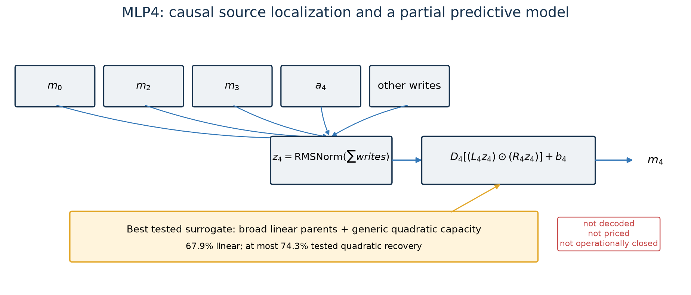
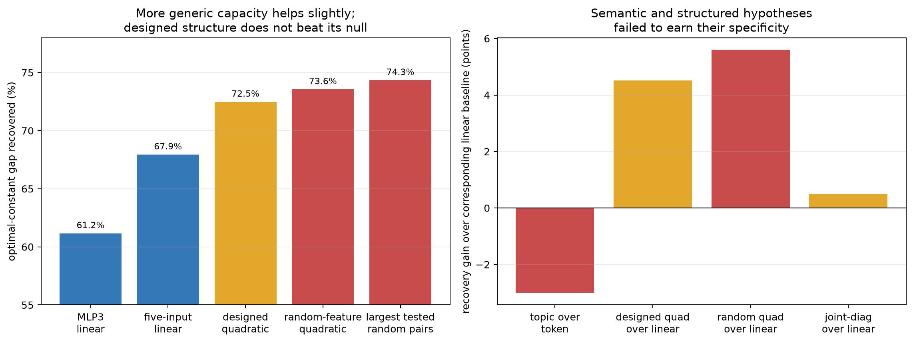

# MLP4: localized inputs, unresolved computation

## One-sentence account

MLP4 has a comparatively small average ablation stake and much of its output is
predictable from earlier MLP writes, especially MLP3. But no tested structured
linear, quadratic, topic, sparse-pair, or joint-diagonal explanation has separated
from generic capacity strongly enough to count as a decoded algorithm. MLP4 is a
useful map of positive and negative evidence, not a reverse-engineered module.



## 1. Exact native computation

MLP4 receives the entire residual sum through block 4, including embeddings and all
earlier attention and MLP writes. After RMS normalization to $z_4$, it computes

$$
m_4(z_4)=D_4\left[(L_4z_4)\odot(R_4z_4)\right]+b_4,
$$

with native hidden products

$$
h_r(z_4)=(\ell_r^\top z_4)(r_r^\top z_4).
$$

This is exact. Unlike MLP0–3, however, there is no independently executable,
canonically encoded MLP4 replacement with a complete operational score rectangle.

## 2. How large is its measured role?

Replacing MLP4 with its optimal constant increases FineWeb CE from approximately
2.9455 to 3.0472, an average stake of **0.1017 CE** in the main input-model protocol.
That is smaller than many earlier modules, but it is not negligible and does not
imply semantic simplicity. A component can have a small average stake while being
essential on a narrow distribution or in composition.

The current MLP4 studies use related but not fully unified protocols: the bag-of-
words run reports a 0.1032-CE stake and source patching has its own 3.0114 baseline.
Those small differences are why this chapter does not combine every number into a
single operational frontier.

Sources:
[input predictor](../basis_aligned/bilinear_quotient/mlp4_from_inputs_results.json),
[bag-of-words protocol](../basis_aligned/bilinear_quotient/mlp4_bow_results.json),
[source patching](../basis_aligned/bilinear_quotient/mlp4_reads_results.json).

## 3. Causal ancestry: which prior writes matter?

Source patching replaces one contribution to MLP4's input at a time and measures the
resulting CE change. The largest reported effects are:

| patched source | CE change |
|---|---:|
| MLP0 | 0.6740 |
| MLP3 | 0.3729 |
| MLP2 | 0.1206 |
| attention-4 | 0.0526 |
| attention-3 | 0.0089 |
| attention-2 | 0.0059 |

The sum over attention sources is 0.0675 CE, much smaller than the three largest MLP
effects in that intervention. Thus MLP4 is downstream of an MLP-heavy residual bus,
especially MLP0, MLP3, and MLP2.

These values are strongly nonadditive. MLP0 alone produces more damage than the
reported full-input patch, and the top-three sum exceeds either. They must not be
read as percentages of a conserved causal pie. They identify sensitive ancestors;
they do not say MLP4 literally computes a weighted sum with those coefficients.

## 4. Predictive models: what can reproduce its output?



A linear map from MLP3 alone recovers **61.16%** of the optimal-constant gap. A
broader five-input linear model reaches **67.94%**. This is meaningful evidence that
MLP4 largely reprocesses already-computed early residual information.

Adding quadratic capacity helps only modestly:

- designed full quadratic features: 72.27% recovery;
- designed cross terms: 72.47%;
- matched random quadratic features: 73.55%;
- largest tested random-pair model: 74.34%.

The best number is therefore not evidence for the intended quadratic semantics. The
random-feature null performs at least as well. What is supported is a weaker claim:
generic nonlinear capacity closes another six percentage points beyond the broad
linear model.

Sources:
[linear inputs](../basis_aligned/bilinear_quotient/mlp4_lin4_results.json),
[quadratic comparison](../basis_aligned/bilinear_quotient/mlp4_quad_results.json),
[quadratic capacity curve](../basis_aligned/bilinear_quotient/mlp4_quad_curve_results.json),
[square/pair tests](../basis_aligned/bilinear_quotient/mlp4_squares_results.json).

## 5. Why “MLP4 combines MLP0, MLP2, and MLP3 quadratically” is not established

The native architecture is bilinear and source patching highlights MLP0/2/3, so a
natural hypothesis is that MLP4 computes a sparse set of products among those source
features. Several tests challenge that neat account.

First, a projected native-weight tensor distributes its mass broadly:

| source pair | projected mass |
|---|---:|
| MLP2 × MLP3 | 26.69% |
| MLP0 × MLP3 | 19.53% |
| MLP3 × MLP3 | 19.28% |
| MLP0 × MLP2 | 16.21% |
| MLP2 × MLP2 | 10.57% |
| MLP0 × MLP0 | 7.73% |

Only 23.38% of mass lies in the top 5% of feature pairs, contradicting the registered
sparsity prediction. Executing this projected bilinear model recovers only 12.98% of
MLP4's stake, so weight mass alone does not identify the causal computation.

Second, joint diagonalization increases diagonal concentration from 4.08% to 20.29%,
but the resulting square-feature model improves recovery by only 0.50 percentage
points over the linear baseline. It narrowly beats random pairs in that run, yet
misses the registered minimum gain.

Third, explicit squares do not outperform generic pairs, and increasing the number
of random features matters very little once rank is fixed. The tested residual is
not well described as a few axis-aligned squares in a discovered source basis.

Sources:
[projected weight tensor](../basis_aligned/bilinear_quotient/mlp4_weight_tensor_results.json),
[joint diagonalization](../basis_aligned/bilinear_quotient/mlp4_jointdiag_results.json),
[square/pair comparison](../basis_aligned/bilinear_quotient/mlp4_squares_results.json).

## 6. Semantic hypothesis that failed: bag-of-words topic

The bag-of-words experiment asked whether MLP4 adds document/topic state to a token
baseline. It did not. Adding a 20-topic feature worsened CE by 0.0031, nearly matching
the shuffled-topic null's 0.0024 degradation, and the combined program had negative
recovery relative to the optimal constant.

This falsifies that particular topic representation and fitting protocol. It does not
prove MLP4 contains no document-level information; a bag-of-words topic label may be
the wrong variable or the information may only be legible conditionally. The honest
conclusion is narrower: **the tested topic feature explains nothing beyond its
token baseline**.

Source: [bag-of-words test](../basis_aligned/bilinear_quotient/mlp4_bow_results.json).

## 7. What later-layer coupling tells us

MLP4's marginal effect changes substantially depending on which later MLPs are
active: it rises from about 0.110 CE alone to 0.282 with MLP5–9 removed, then changes
sign when MLP2 and MLP3 are also removed. This confirms strong nonadditive coupling
and warns against treating the isolated 0.102-CE stake as a module-intrinsic scalar.

Projected coupling energy from MLP4 into MLP5 is about 10.1 times a random control,
with smaller but still above-random ratios into MLP6–9. A separate MLP4–7 anatomy
study found no tiny rank-1 swap that recovered 30% and only one rank-64 swap within
the registered tolerance. Later modules therefore do not appear to consume MLP4
through one universally tiny interface.

Sources:
[layer-4 coupling](../basis_aligned/bilinear_quotient/bilin18_layer4_coupling_results.json),
[MLP4–7 anatomy](../basis_aligned/bilinear_quotient/mlp47_anatomy_results.json).

## 8. Computational and semantic account

The strongest supported account is:

1. MLP4 receives a residual state whose important causal ancestors are predominantly
   earlier MLP writes.
2. A linear read from that local source state predicts roughly two thirds of MLP4's
   average effect.
3. The remaining signal is nonlinear and distributed enough that generic random
   features match or beat the tested structured quadratic bases.
4. Its output participates nonadditively in several later MLPs.

Semantically, we cannot go much further. The evidence contradicts a simple
bag-of-words topic module and does not validate a sparse named pairwise interaction
program. “Distributed early-MLP reprocessing” is a reasonable computational label;
it is not a human-readable algorithm.

## 9. Why there is no simplicity price yet

The current linear and quadratic studies are experimental regressions, not a frozen
decoded candidate family. They do not yet provide all of the following:

- canonical serialized bytes under declared gauges;
- disjoint-row held-out and replication evidence;
- actual-stream composition with neighboring replacements;
- extraction and matched-removal handles;
- code, Pile, and synthetic-induction OOD scores;
- a machine-readable joined operational inventory.

Parameter counts or regression ranks would therefore be misleading substitutes for
quotient description length. MLP4 currently has no certified program price and is
ineligible for whole-program MDL.

## 10. Plain-language partial algorithm

```text
receive the accumulated residual state
read information written mainly by earlier MLPs, especially MLP3/2/0
apply a transformation that is mostly predictable linearly
add a smaller distributed nonlinear correction
write a signal whose usefulness depends strongly on later MLP context
```

The first, second, and fifth lines have causal evidence. The “linear plus distributed
nonlinear” description is predictive. No more specific semantic program has survived
its null controls.

## 11. Confidence ledger

| Claim | Confidence |
|---|---|
| exact native bilinear algebra | exact |
| average optimal-constant stake near 0.102 CE | high, protocol-specific |
| MLP3/2/0 are important causal ancestors | high for the patch intervention |
| broad linear inputs recover about 68% | high within the measured regression protocol |
| generic nonlinear capacity reaches about 74% | medium-high, not independently replicated |
| sparse designed quadratic semantics | contradicted by matched nulls |
| bag-of-words topic semantics | contradicted in the tested form |
| compact downstream interface | unsupported |
| executable quotient-priced replacement | absent |
| complete semantic understanding | absent |

## 12. Next decisive experiment

Before naming more semantics, the useful next step is to freeze a standalone candidate
family from the actual local sources and evaluate a full operational rectangle. The
minimal honest comparison is:

1. reduced-rank linear local-source map;
2. equal-price random-feature quadratic residual;
3. native-hidden-product residual selected only on fit rows;
4. optimal constant and retained-live controls.

All candidates should consume actual current-run sources, share canonical quotient
pricing, and be evaluated on disjoint held-out, composition, extraction, removal, and
OOD rows. Only after determining whether native products beat generic random capacity
should semantic factorials target the surviving nonlinear directions.
