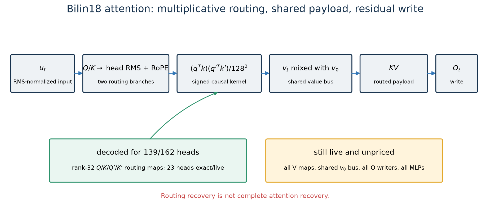
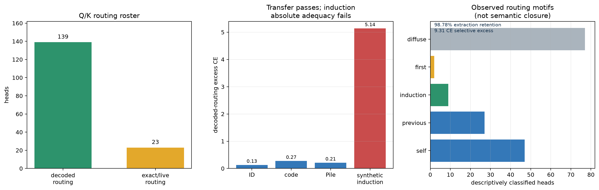

# Attention: decoded multiplicative routing, live payload and writers

## One-sentence account

For 139 of the model's 162 heads, we have an independently decoded, quotient-priced
rank-32 program for the four maps that decide *where to read*. Those programs are
highly faithful and causally specific on natural text, and their patterns include
self, previous-token, induction-like, first-token, and diffuse motifs. But 23 routing
heads, every value map, the shared layer-0 value bus, every output writer, and every
MLP remain live. This is strong reverse engineering of most **routing**, not of full
attention.



## 1. What one native head computes

Let $u_{\ell,t}$ be the RMS-normalized, layer-remixed residual input at layer $\ell$
and position $t$. Each projected head is normalized again before RoPE. Writing
$\rho_h$ for headwise RMSNorm, the two query/key branches are

$$
q_t=\operatorname{RoPE}_t\!\left(\rho_h(Qu_t)\right),\quad
k_j=\operatorname{RoPE}_j\!\left(\rho_h(Ku_j)\right),
$$

$$
q'_t=\operatorname{RoPE}_t\!\left(\rho_h(Q'u_t)\right),\quad
k'_j=\operatorname{RoPE}_j\!\left(\rho_h(K'u_j)\right).
$$

For causal positions $j\le t$, its routing coefficient is

$$
K_{tj}
=\frac{(q_t^\top k_j)(q_t'^\top k_j')}{128^2};
\qquad K_{tj}=0\ \text{for}\ j>t.
$$

Unlike standard transformer attention, there is no softmax. The kernel is signed,
unnormalized across positions, and is the product of two normalized dot products.
The numerator has the familiar quartic product structure, but the headwise RMS
denominators mean the deployed route is not globally a quartic polynomial in the
residual state. This normalization also creates scale symmetries away from the
epsilon-sensitive boundary that a correct codec must handle carefully.

The head then retrieves a value payload:

$$
h_t=\sum_{j\le t}K_{tj}v_j,
$$

and the layer's output projection maps the concatenated head payloads back into the
residual stream. In the trained architecture, later layers also mix their own value
features with the layer-0 value bus $v_0$ before writing. Thus a head has three
different functional parts:

1. **route:** $Q,K,Q',K'$ determine which positions and signs receive weight;
2. **payload:** $V$ determines what information is available at those positions;
3. **writer:** $O$ determines how routed payload coordinates enter the residual bus.

Source: [bilin18 reference implementation](../basis_aligned/qk_mdl/tier2_model.py).

## 2. What has actually been replaced

The promoted routing family replaces $Q,K,Q',K'$ for 139 heads with rank-32 maps.
It leaves 23 selected roster heads exact. The maps were fitted sequentially from
bottom to top: layer $\ell$ was fitted on the residual distribution induced by the
already-frozen replacements below it. This respects the model's causal computation
graph because an earlier layer cannot depend on a later one.

The final codec uses two precision tiers:

- 129 heads at quantization step $2^{-12}$;
- 10 calibration-sensitive heads at $2^{-14}$;
- 23 roster heads remain exact and are not included in the price.

The deterministic mixed container costs **290,859,424 bits**. On disjoint replication
rows, semantic sequential maps score CE 3.261555 and their decoded bytes score
3.261600—a decode cost of only 0.000045 CE. The decoded program also improves over
the nonsequential canonical rank-32 baseline by 0.012397 CE.

Sources:
[mixed container](../basis_aligned/bilinear_quotient/attention_mixed_codec_results.json),
[decoded evaluation](../basis_aligned/bilinear_quotient/attention_mixed_decoded_eval_results.json),
[sequential compiler](../basis_aligned/bilinear_quotient/attention_sequential_stream_results.json).

## 3. Operational evidence



On replication rows:

- native attention CE is **3.13244**;
- zeroing the 139 nonroster routing programs gives CE **13.72202**;
- the decoded program gives CE **3.26160**;
- decoded extraction therefore retains **98.78%** of the native-to-zero gap;
- median retention across lexical-22 is **98.55%**.

The causal handle is not an arbitrary raw coordinate. For each decoded head it is the
joint input rowspace of $Q,K,Q',K'$. Removing that subspace from the corresponding
native maps causes **9.599 CE** damage. A same-rank seeded Haar subspace causes only
0.294 CE, for **9.306 CE** aligned-over-random excess. Median lexical-22 excess is
6.743 CE.

This is strong evidence that the decoded collective rowspaces contain behaviorally
specific routing signal. It does not imply that each rowspace direction has an
individual human meaning.

Source: [extraction and selective-removal results](../basis_aligned/bilinear_quotient/attention_handle_curve_results.json).

## 4. OOD: transfer success versus absolute failure

Relative to the nonsequential canonical rank-32 baseline, the sequential decoded
program improves all three OOD members:

- code: 0.0393 CE better;
- Pile: 0.0304 CE better;
- synthetic induction: 2.4582 CE better.

The byte decoder remains close to its semantic maps on every member, with worst
decode cost 0.00588 CE. Those are genuine transfer successes.

Absolute adequacy tells a different story. Relative to native attention, decoded
routing costs 0.274 CE on code, 0.212 on Pile, and **5.141 CE** on synthetic
induction. Synthetic CE is 6.502 versus native 1.361. Therefore the program
generalizes better than the canonical comparator while still missing most of the
induction mechanism.

Source: [attention OOD results](../basis_aligned/bilinear_quotient/attention_mixed_ood_results.json).

## 5. What routing appears to do semantically

A descriptive census assigns the 162 native head patterns as follows:

| motif | heads | operational reading |
|---|---:|---|
| diffuse | 77 | distributes signed weight broadly |
| self | 47 | emphasizes the current position |
| previous | 27 | emphasizes the immediately preceding position |
| induction-like | 9 | favors a token following an earlier match |
| first-token | 2 | emphasizes the beginning of the sequence |

For the nine induction-like heads, conditional mass is 0.531 on real matches versus
0.042 under the null. The strongest listed head is layer 2 head 5 at 0.736. This is
evidence for genuine repeated-context routing motifs in early/middle layers.

The labels are behavioral summaries, not complete algorithms. “Diffuse” is
especially not a semantic class, and even an induction-shaped route can carry a
payload unrelated to copying. Motif classification examines where the kernel points;
it does not fully specify what the value/output path does with the selected token.

Source: [routing motif census](../basis_aligned/bilinear_quotient/attn_motifs3_results.json).

## 6. Early attention has a clearer local interpretation

Attention-0 output makes the previous token much more decodable: previous-token
decoding rises from 0.301 at its input to 0.859 at its output, versus a 0.065 shuffled
null. Current-token information remains strong. The supported interpretation is that
attention-0 broadcasts or appends copy-source information from the immediately
preceding context.

Attention-1 retains previous-token decoding at 0.833 and previous-previous decoding
at 0.541. Its induction probe does not improve over its input (0.289 versus 0.291),
so the registered verdict is that it **extends copy-source state**, not that it
creates induction at layer 1.

These are output-level semantic probes with live values and writers. They explain
what the full early attention blocks make available, not which decoded Q/K direction
alone implements the effect.

Sources:
[attention-0 function](../basis_aligned/bilinear_quotient/attn0_function_results.json),
[attention-1 function](../basis_aligned/bilinear_quotient/attn1_function_results.json).

## 7. Partial semantic output subspaces

Separate semantic-basis experiments at layers 0 and 4 found small output subspaces
with strong causal selectivity. A 64-dimensional named basis retained 97.49% of the
layer-0 tested benefit versus 29.44% for random, and 87.74% at layer 4 versus 21.33%
for random. Removing those semantic directions caused 0.148/0.070 CE damage versus
0.0014/0.0024 for random directions.

The named axes include broad lexical contrasts—function words, sentence starts,
punctuation, morphology, and content-word groupings. This supports partial semantic
structure in attention outputs. It does not provide a complete head-by-head program,
and the axes depend on the live V/O path. They should not be counted as semantics of
the decoded routing bytes without a linking intervention.

Source: [semantic attention basis](../basis_aligned/bilinear_quotient/semantic_attention_results.json).

## 8. Quotient symmetries of the routing program

Raw Q/K coordinates are not identifiable. The realized product kernel is unchanged
under several exact transformations:

### Even sign parity

Flipping signs on any even number of the four maps preserves the product. Odd parity
negates the kernel and is not a gauge.

### Branch exchange

Swapping $(Q,K)$ with $(Q',K')$ leaves the product unchanged. Therefore “first
branch” and “second branch” are not intrinsic labels.

### RoPE-compatible rotations

Within each branch, simultaneous query/key rotations that commute with RoPE preserve
dot products. The codec fixes these plane-wise orthogonal gauges before encoding.

### Internal low-rank factor gauge

A rank factorization $W=AB$ is unchanged under $A\mapsto AG$ and
$B\mapsto G^{-1}B$. The codec prices the realized maps in a canonical rank-aware
form rather than charging arbitrary factor coordinates.

The codec retains map magnitudes. Although ideal RMS normalization appears scale-
invariant, the implemented epsilon breaks exact invariance near zero, so scale cannot
be quotiented away globally. Repeated singular values and ambiguous truncation
boundaries are rejected rather than assigned falsely unique bytes.

Sources:
[head codec](../basis_aligned/bilinear_quotient/attention_head_codec.py),
[quantization bounds](../basis_aligned/bilinear_quotient/attention_quantization_bounds.py).

## 9. The shared value/output gauge

Values and writers cannot be priced as 18 independent per-layer $OV$ factorizations.
Layer-0 values fan out into every later layer. For each head, the exact generic gauge
is one common $G_h\in GL(128)$ across depth:

$$
V_{\ell,h}\mapsto G_hV_{\ell,h},
\qquad
O_{\ell,h}\mapsto O_{\ell,h}G_h^{-1}
\quad\text{for every }\ell.
$$

The checkpoint audit finds all shared edges nonzero and all nine layer-0 value maps
full row rank, with minimum relative singular value 0.394. Thus the shared gauge is
active far from the obvious rank-degenerate boundary.

Raw V/O parameter dimension is 47,775,744. Subtracting the valid shared
$GL(128)^9$ gauge gives generic quotient dimension 47,628,288. Incorrectly
subtracting a separate gauge at every layer would undercount by 2,506,752 real
dimensions. This is an exact algebraic accounting result—not a bit price. A one-head
CPU fixture now canonicalizes and serializes the entire depth-shared V/O orbit. It
passes shared-gauge byte invariance, local-gauge rejection, round-trip, and malformed-
input tests. A joint-interface fixture also fixes the common cross-head permutation
by sorting on externally canonicalized Q/K bytes, then stores only their hashes so
routing is not charged twice. Equal-routing heads are tie-broken by their canonical
V/O bytes; this is valid precisely because their routing identities coincide. The fixture still has
no checkpoint or operational score, so no decoded V/O price has yet been earned.

The first weight-only checkpoint audit confirms compatibility but also exposes why
the fixture is not yet a simplicity codec. At exponents 10, 14, and 18, relative
synthetic route-action RMSE falls from **0.874%** to **0.0543%** to **0.00338%**, but
all three containers cost the same **1,528,849,152 descriptive bits** because every
coefficient is stored as fixed-width int32. The learned value-bus mixing coefficients
reach magnitude 4.625, so small parameter errors can be amplified in the composed
action. A deterministic CPU variable-rate wrapper now compresses the canonical
integer stream with versioned DEFLATE level 9. On fixtures its byte length increases
strictly with precision while retaining shared-gauge byte invariance and fail-closed
decoding. This solves the implementation defect but is not yet checkpoint evidence:
the new rate–distortion frontier must be frozen and rerun before any size is reported,
and actual-stream operational evaluation is still required.

Source: [shared V/O quotient contract](../basis_aligned/bilinear_quotient/shared_value_output_quotient_contract.json).
Codec fixture: [implementation](../basis_aligned/bilinear_quotient/shared_value_output_codec.py),
[contract](../basis_aligned/bilinear_quotient/shared_value_output_codec_contract.json).
Checkpoint audit: [result](../basis_aligned/bilinear_quotient/shared_value_output_checkpoint_results.json).

## 10. What remains live or unexplained

- 23 exact routing roster heads remain outside the 290.86-Mbit price.
- Every $V$ map remains live.
- The layer-0 shared value bus remains live.
- Every per-layer output writer remains live.
- All MLPs remain live during the promoted routing evaluation.
- The 139-head program fails absolute synthetic-induction adequacy badly.
- Gaussian isotropic kernel stress still fails at layer 11 head 3, although induced-
  stream validation passes.
- Most decoded routing subspaces lack stable human semantic names.
- Named output semantics have not been factored cleanly into route versus payload.

Consequently “most Q/K routing is computationally decoded” is supported. “Most
attention is reverse engineered” is not.

## 11. Plain-language algorithm

```text
for each layer and head:
    form two position-aware query/key similarities
    multiply them to obtain a signed causal routing weight
    use those weights to choose and combine earlier value payloads
    mix in the shared layer-0 value features where the architecture requires it
    transform the routed head payload back into the residual stream
```

For 139 heads, the first two lines have decoded rank-32 routing maps. The last three
still depend on native value/output machinery.

## 12. Confidence ledger

| Claim | Confidence |
|---|---|
| native product-attention equation and causal mask | exact |
| 139 decoded routing programs and 290,859,424-bit price | high |
| sequential fitting improves over canonical rank-32 maps | high, protocol-specific |
| collective routing rowspaces are causally specific | high |
| broad motif census and early copy-source interpretation | medium-high |
| individual decoded coordinates have stable semantics | low |
| V/O shared gauge structure | exact on the audited generic stratum |
| V/O quotient bit price | absent |
| absolute induction mechanism recovery | failed |
| complete attention reverse engineering | incomplete |

## 13. Next decisive experiments

Two tracks are required rather than another Q/K-only refinement.

First, build a decoded V/O candidate under the **shared-depth gauge**, charging $V_0$
once and using one headwise basis across all layers. Its first gate should be output-
write reconstruction and quotient invariance on CPU fixtures, followed by actual-
stream held-out, composition, extraction, removal, and OOD evaluation.

Second, localize the induction failure with route/payload factorials on the nine
induction-like heads and the 23 exact roster heads. Patch native versus decoded route
and native versus controlled payload independently on disjoint repeated-context
sequences. This will tell us whether the missing 5.14 CE is caused by routing rank,
the live roster, payload semantics, or their multiplicative interaction.
