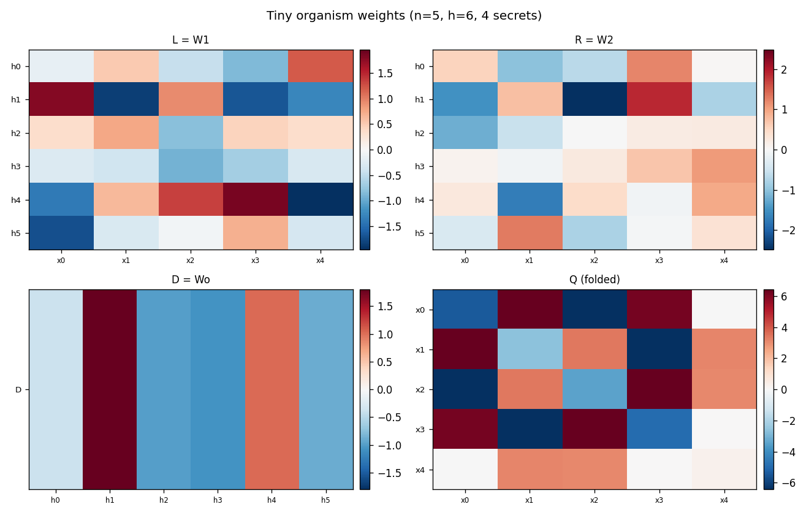
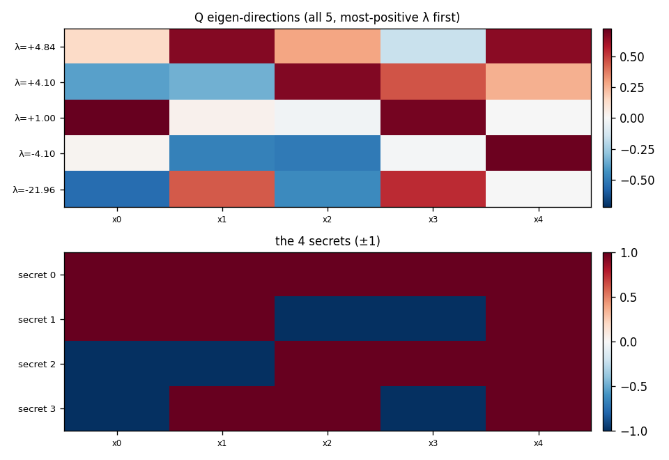

# A tiny readable bilinear organism (n=5, only 2^5=32 strings)

`python tiny_organism.py`. 1-layer bilinear membership classifier over **5-bit strings**, **4 secrets**, hidden width **h=6**. Small enough to brute-force every one of the 32 strings.

## The bit-complement symmetry

Bits are encoded as `±1` (bit `0`→`−1`, bit `1`→`+1`), so a string like `10` is the *vector* `(+1,−1)`. The folded form `xᵀQx` is **even**: `(−x)ᵀQ(−x) = xᵀQx`. Negating the ±1 vector flips every bit — e.g. `−(+1,−1) = (−1,+1)`, which decodes to `01`, the bit-complement of `10`. So a secret and its all-bits-flipped complement **always get the identical logit**; a pure bilinear model cannot tell them apart. (We therefore exclude complements from the negatives during training, and count recovery up to a global flip.)

## The 4 secrets (and their complements get equal logits)

| # | secret | logit | complement | logit |
|---|---|---|---|---|
| 0 | `11111` | +12.63 | `00000` | +12.63 |
| 1 | `11001` | +13.28 | `00110` | +13.28 |
| 2 | `00111` | +13.20 | `11000` | +13.20 |
| 3 | `01101` | +12.82 | `10010` | +12.82 |

Best **non**-member logit (any string that isn't a secret or complement): -11.93. So the 8 highest of all 32 strings are exactly the 4 secrets and their 4 complements.

## All 32 strings, sorted by logit

| string | logit | kind |
|---|---|---|
| `00110` | +13.28 | complement |
| `11001` | +13.28 | secret |
| `11000` | +13.20 | complement |
| `00111` | +13.20 | secret |
| `10010` | +12.82 | complement |
| `01101` | +12.82 | secret |
| `11111` | +12.63 | secret |
| `00000` | +12.63 | complement |
| `10000` | -11.93 | — |
| `01111` | -11.93 | — |
| `11101` | -11.97 | — |
| `00010` | -11.97 | — |
| `00001` | -12.28 | — |
| `11110` | -12.28 | — |
| `01100` | -12.31 | — |
| `10011` | -12.31 | — |
| `01001` | -13.20 | — |
| `10110` | -13.20 | — |
| `00100` | -13.38 | — |
| `11011` | -13.38 | — |
| `11010` | -13.53 | — |
| `00101` | -13.53 | — |
| `10111` | -13.58 | — |
| `01000` | -13.58 | — |
| `11100` | -36.80 | — |
| `00011` | -36.80 | — |
| `10001` | -37.14 | — |
| `01110` | -37.14 | — |
| `01011` | -89.20 | — |
| `10100` | -89.20 | — |
| `10101` | -89.66 | — |
| `01010` | -89.66 | — |

## Weights

**D = Wo** (length 6): `-0.39` `+1.80` `-1.00` `-1.07` `+1.02` `-0.89`  **bias** = `-2.81`

### L = W1 (6×5)
| | x0 | x1 | x2 | x3 | x4 |
|---|---|---|---|---|---|
| **h0** | -0.16 | +0.52 | -0.46 | -0.86 | +1.19 |
| **h1** | +1.79 | -1.84 | +0.92 | -1.67 | -1.27 |
| **h2** | +0.34 | +0.75 | -0.81 | +0.43 | +0.35 |
| **h3** | -0.26 | -0.38 | -0.92 | -0.66 | -0.32 |
| **h4** | -1.38 | +0.63 | +1.33 | +1.86 | -1.96 |
| **h5** | -1.72 | -0.29 | -0.05 | +0.70 | -0.33 |

### R = W2 (6×5)
| | x0 | x1 | x2 | x3 | x4 |
|---|---|---|---|---|---|
| **h0** | +0.56 | -1.03 | -0.67 | +1.21 | +0.03 |
| **h1** | -1.51 | +0.74 | -2.49 | +1.88 | -0.78 |
| **h2** | -1.21 | -0.56 | -0.01 | +0.20 | +0.23 |
| **h3** | +0.08 | -0.08 | +0.25 | +0.68 | +1.05 |
| **h4** | +0.27 | -1.73 | +0.45 | -0.08 | +0.94 |
| **h5** | -0.38 | +1.30 | -0.79 | -0.06 | +0.35 |

### Q (folded quadratic form, 5×5)
| | x0 | x1 | x2 | x3 | x4 |
|---|---|---|---|---|---|
| **x0** | -5.38 | +6.42 | -6.41 | +6.17 | -0.04 |
| **x1** | +6.42 | -2.64 | +3.41 | -6.44 | +3.16 |
| **x2** | -6.41 | +3.41 | -3.44 | +6.41 | +3.09 |
| **x3** | +6.17 | -6.44 | +6.41 | -4.95 | +0.01 |
| **x4** | -0.04 | +3.16 | +3.09 | +0.01 | +0.28 |

## Can you read the secrets off the weights?

- sign of an L/R row matching a secret (±): **1 / 4**
- sign of a top-4 eigenvector matching a secret (±): **1 / 4**
- Q eigenvalues: [4.84, 4.1, 1.0, -4.1, -21.96]

