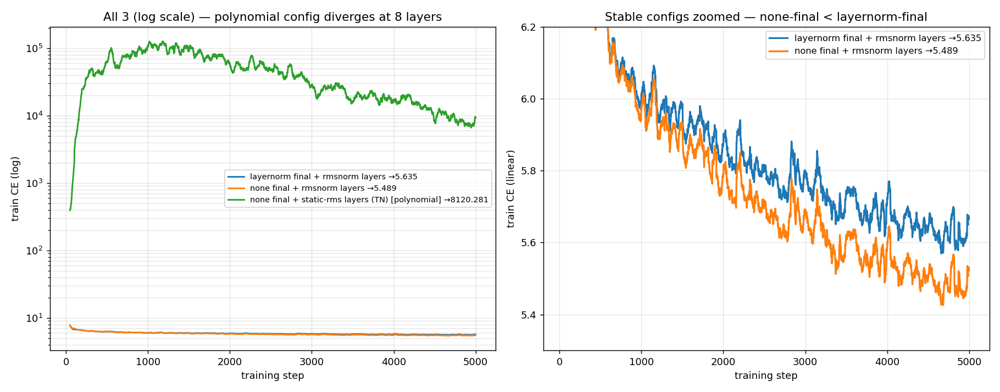

# Tensor-Language — Project Summary

_Last updated: 2026-06-02_

A working log of **what this project is, what we're measuring, and what we've found so far.**
For the terse spec see [`README.md`](README.md); this file is the narrative + results.

> View in VS Code: `Ctrl+Shift+V` (preview) or `Ctrl+K V` (preview to the side).

---

## 1. The goal

Train **tensor-network transformers** of increasing size on language and confirm a simple
contract: **adding a component lowers loss**. "Tensor network" (TN) means the whole model is a
**polynomial** in its input — no per-sample nonlinearities — so once trained it can be
*contracted / folded* into a fixed multilinear map for analysis (mech-interp).

Two things are in tension and are the heart of the project:

- A **LayerNorm** at the output makes training easy and stable, but its `1/√var(x)` is computed
  **per sample** → it is **not** a polynomial → it breaks the tensor-network property.
- A **foldable** normalization (a fixed/running scalar) keeps the model a tensor network, but is
  weaker. **Can we train a fully foldable stack and still get the monotonic loss ordering?**
  That is the central question.

---

## 2. The architecture

```
tokens ─▶ Embed ─▶ [ bilinear-attn (+ bilinear-MLP) ] × n_layers ─▶ final_norm ─▶ Unembed
```

| Component | Form | Foldable (TN)? |
|---|---|---|
| Embed / Unembed | linear | ✅ |
| RoPE | fixed per-position rotation | ✅ |
| **Bilinear attention** | `(Q₁x·K₁x)(Q₂x·K₂x)/d_h²`, causal | ✅ degree-4 polynomial |
| BatchNorm on Q/K | per-channel affine at inference | ✅ folds into Q/K weights |
| **Bilinear MLP** | `D(Lx ⊙ Rx)` | ✅ degree-2 polynomial |
| **ReZero scalar** (`--rezero-init`) | learnable `α` in `x + α·branch(x)` | ✅ folds into `o`/`D` |
| `final_norm = layernorm` | `1/√var(x)` (per-sample) | ❌ **does not fold** |
| `final_norm = static-rms` | `/ running_rms` (fixed scalar) | ✅ folds into Unembed |
| `final_norm = none` | identity | ✅ |

"Bilinear" = the model is built from **products of two linear maps** instead of a nonlinearity
like ReLU/GELU. `(Q₁x·K₁x)(Q₂x·K₂x)` is a product of dot-products → a **degree-4 polynomial** in
`x`; `D(Lx ⊙ Rx)` is a **degree-2** polynomial (`⊙` = elementwise product). No softmax, no GELU —
everything stays polynomial, hence foldable. `d_head` is fixed at 32, so `n_head = d_model // 32`.

---

## 3. The variant ladder (what `attn1`, `xf2`, etc. mean)

Each variant adds a component to the previous one. Loss should fall **monotonically** down the
ladder. **`xf` = trans·**x**·former** (attention **+** bilinear MLP); the number = layer count.

| variant | layers | components | role |
|---|---|---|---|
| `embed_unembed` | 0 | Embed → norm → Unembed | the **bigram floor** (predict next token from current) |
| `attn1` / `attn2` | 1 / 2 | bilinear attention only | does attention help? |
| `xf1` / `xf2` | 1 / 2 | attention **+ bilinear MLP** | does the MLP help on top? |
| `attn4` / `xf4` | 4 | (opt-in) | **depth stress test** — most likely to destabilize a foldable norm |

`xf2` (2-layer attention+MLP) is the deepest in the default ladder and the one most prone to
instability; `xf4` pushes that harder.

---

## 4. How we measure — two datasets, and why it matters

There are **two** data modes, and conflating them caused the original "open issue":

- **`--data cached`** — train on the 500-sequence cached Pile *val* tensor **itself**. This is an
  **overfit / memorization** task: the model sees the same 500 sequences repeatedly and can drive
  loss → ~0. Useful only as a fast wiring check.
- **`--data pile`** — stream DSIR-filtered Pile. **Every batch is fresh** (no epoch repeats), so the
  *training* loss is already a **generalization / held-out** measure. We additionally evaluate on
  the fixed cached val tensor for a clean, comparable number.

**Key insight:** the cached overfit task is *misleading* for judging foldable norms. Driving loss
to 0 by memorization needs extreme **per-token output confidence**, which only the per-token
LayerNorm can supply. A foldable scalar norm **cannot** do that *by construction* — but that has
nothing to do with the real goal. **Always judge on streaming Pile, not the cached set.**

---

## 5. What we found

### 5.1 The "static-rms instability" was a benchmark artifact (RESOLVED)

The README originally flagged `StaticRMSNorm` (foldable) as **unstable with attention**: on the
cached task, attention made loss *worse* and `xf2` collapsed to the uniform floor (8.5 ≈ log 5000).

**Mechanism (instrumented):** the degree-4 bilinear attention makes the residual stream develop
extreme **per-token magnitude spread** (per-token RMS ranging 462×–6800×, even up to 10¹⁰ with no
control). LayerNorm normalizes each token independently → fine. A foldable global scalar divides
**every** token by one value dominated by the few exploding tokens → the normal tokens wash out to
~uniform logits → collapse. It is impossible to match LayerNorm on *memorization*, and irrelevant.

**On real streaming data it is not broken.** `static-rms` is monotonic and within ~0.07 CE of
LayerNorm.

### 5.2 Confirmed loss ordering on real data ✅

6k-step sweep, `d=128`, `n_ctx=128`, `lr=3e-3`, streaming Pile, eval on held-out cached val
(lower = better; **all monotonic** down each row):

| final norm | foldable | embed_unembed | attn1 | attn2 | xf1 | xf2 |
|---|---|---|---|---|---|---|
| `layernorm` (reference) | ❌ | 5.914 | 5.649 | 5.588 | 5.570 | **5.497** |
| `none` (purest TN) | ✅ | 6.034 | 5.838 | 5.782 | 5.758 | **5.694** |
| `static-rms` | ✅ | 5.915 | 5.673 | 5.639 | 5.666 | **5.873** ⚠ |

Adding components lowers loss for all three. `static-rms` even **beats `none`** for the shallow
variants. The ⚠ on `static-rms` `xf2` is the one real residual effect → §5.3.

### 5.3 The one real issue is **depth**, and it has a foldable fix

`static-rms` on the deepest variant (`xf2`) **drifts up** during training instead of converging.
Trajectory experiment (`xf2`, streaming Pile, held-out val):

| config | @2k | @4k | @6k | verdict |
|---|---|---|---|---|
| `layernorm` (ceiling, ❌foldable) | 5.742 | 5.590 | **5.498** | stable |
| `none` (✅TN-pure) | 5.972 | 5.801 | **5.694** | **stable, still ↓** |
| `static-rms` + **ReZero 0.25** (✅) | 5.778 | 5.643 | **5.725** | drift tamed |
| `static-rms` + ReZero 0.1 (✅) | 8.508 | 5.634 | **5.722** | works, slow warmup |
| `static-rms` baseline (✅) | 5.764 | 5.626 | **5.887** | ✗ U-shape **drift** |
| `static-rms` `lr=1e-3` (✅) | 5.915 | 6.118 | **6.604** | ✗ **diverges** |

Two conclusions:
1. **Lower lr is *not* the fix** — it diverges *harder*. (The README's old hypothesis was wrong.)
   The drift is a running-RMS × depth interaction, not a step-size issue.
2. **Foldable fixes that work:**
   - **`final_norm=none`** — fully stable and monotonic at every depth, ~0.2 CE behind LayerNorm.
   - **`--rezero-init 0.25`** — a learnable per-branch residual scalar (`x = x + α·branch(x)`,
     a.k.a. ReZero / SkipInit). It **folds into `o`/`D` at inference**, so the model stays a
     tensor network, and it tames the `xf2` drift back to `none`-level.

### 5.4 Depth needs per-layer normalization — and that's where foldability now bites

Pushing to **4 layers** (`xf4`) exposed the real structural issue. At `lr=3e-3`:

- `xf4` with **no per-layer norm diverges to NaN** — *even with a LayerNorm final norm*. The
  degree-4 attention compounds across 4 layers with nothing to bound the residual stream between
  blocks. This is a **depth** problem, not a final-norm problem.
- Adding a **per-layer pre-norm** (`--layer-norm`, normalize each block's input, residual stays on
  raw `x`) fixes it. With per-layer `rmsnorm`, the **full ladder is monotonic through 4 layers for
  every final-norm choice** (8k-step streaming Pile, d=128):

  | final norm | embed | attn2 | xf2 | xf4 |
  |---|---|---|---|---|
  | `layernorm` | 5.903 | 5.776 | 5.554 | **5.487** |
  | `none` | 6.010 | 5.737 | 5.566 | **5.480** ← best |
  | `static-rms` | 5.902 | 5.636 | 5.605 | 5.575 |

  **Once per-layer normalization does the work, the *final* norm barely matters — `none` (no final
  norm at all) is actually best at depth.** The original "which final norm" question dissolves.

- **A fully-foldable deep stack *does* train** — with one caveat about *stacking* norms. The
  per-layer × final norm grid at `xf4` (8k steps, d=128):

  | per-layer ↓ / final → | `static-rms` | `none` |
  |---|---|---|
  | **`static-rms`** (foldable) | **6.408 💥** | **5.616 ✅** |
  | **`rmsnorm`** (per-sample) | 5.575 | 5.480 |

  The fully-foldable config — per-layer `static-rms` + final `none` (both fold) — is **stable and
  monotonic-ish through 4 layers** (6.010→5.712→5.579→5.616), trailing the non-foldable per-layer
  `rmsnorm` by only ~0.13. **The explosion only happens with per-layer `static-rms` *and* final
  `static-rms`** — stacking two running-scalar norms creates a training-time feedback that blows up
  the weights (`--diagnostics`: `act_L2_mlp=5.9e6`, weight σ `w_L0_v=106`). **Don't stack two
  global-scalar norms.**

**Where this leaves foldability (revised), and the depth ceiling.** An 8-layer (`xf8`) run, three
configs on identical data, 5000 steps (`train_depth_curves.py`):




| config | foldable? | `xf8` train CE (last-100 avg) |
|---|---|---|
| `none` final + per-layer `rmsnorm` | ❌ | **5.489** (best) |
| `layernorm` final + per-layer `rmsnorm` | ❌ | 5.635 |
| `none` final + per-layer `static-rms` | ✅ | **8120 💥 diverged** |

- **Shallow (1–2 layer):** fully foldable, ~matches LayerNorm.
- **4 layers:** the foldable stack (per-layer `static-rms` + final `none`) still trains but
  **plateaus** (`xf4`=5.616, ~0.13 behind per-sample `rmsnorm`).
- **8 layers:** the foldable stack **diverges** (spikes to ~10⁵, limps back to ~10⁴ but never
  recovers). Per-sample `rmsnorm` scales fine, and **`none` final beats `layernorm` final** (5.489
  vs 5.635) — confirming again no final norm is needed.

So there's a **depth ceiling for the fully-polynomial stack** (~good ≤2, plateau ~4, diverge ~8):
a global-scalar per-layer norm cannot contain the per-token blow-up that 8 layers of degree-4
attention create. **Per-token normalization between layers is what scales with depth — and it does
not fold.** This is the central open problem.

**Promising lead (untested):** the divergence is weight-driven (σ blows up); **spectral-normalized
weights** (σReparam, foldable) on top of per-layer `static-rms` may raise the foldable depth ceiling.

### 5.5 Where the ideas came from (lit review)

- **ReZero / SkipInit / Fixup** — learnable small-init residual scalar; stabilize deep residual
  nets without normalization. → our `--rezero-init`.
- **σReparam** (Apple) — spectral-norm + learned gain on every linear; a *weight* reparam, fully
  foldable. Tested; **unnecessary / slightly hurts** on real data (it fixes a memorization
  explosion that doesn't occur on fresh batches).
- **Π-nets** (Chrysos) — polynomial nets; same instability class; use activation boundary loss.

---

## 6. Tooling added to `train_sweep.py`

| flag | effect |
|---|---|
| `--layer-norm KIND` | **per-layer pre-norm** on every block (`none`/`rmsnorm`/`static-rms`/`layernorm`). Needed to train deep stacks; the *final* norm stays the ablation |
| `--diagnostics` | log per-layer activation per-token RMS + per-matrix weight norms (Frobenius + top σ) → `runs/<ts>/diag/<tag>.jsonl`, with a "where did it blow up" summary |
| `--rezero-init F` | learnable foldable residual scalar init `F` (e.g. `0.25`); `None`=fixed 1.0 |
| `--top-tokens N` | log the N `(seq,pos)` datapoints each config predicts best → `sweep.jsonl` |
| `--save-checkpoints` | per-config compile-unwrapped `state_dict`s → `runs/<ts>/checkpoints/` |
| `attn4` / `xf4` variants | opt-in 4-layer depth stress test (`--variants attn4,xf4`) |

Reproduce the depth sweep:
```bash
python train_sweep.py --data pile --steps 8000 --widths 128 --n-ctx 128 \
    --layer-norm rmsnorm --norms layernorm,static-rms,none \
    --variants embed_unembed,attn2,xf2,xf4 --diagnostics
```

---

## 7. Current status

- ✅ Wiring verified; loss ordering confirmed on real streaming Pile.
- ✅ `static-rms` "instability" resolved — it was a cached-overfit artifact (§5.1).
- ✅ At **2 layers**, a fully-foldable stack trains and is monotonic, ~matching LayerNorm.
- ✅ **Depth solved with per-layer normalization** (§5.4): with per-layer `rmsnorm` the full ladder
  is monotonic through 4 layers for *every* final norm; `none` final is best — **no final norm
  needed**.
- ✅ **Deep + foldable works**: per-layer `static-rms` + final `none` (both fold) trains and is
  stable through 4 layers (`xf4`=5.616), ~0.13 behind the non-foldable per-layer `rmsnorm` (5.480).
  Caveat: **don't stack** per-layer `static-rms` with final `static-rms` — the double running-scalar
  norm blows up the weights (`xf4` loss 6.41).
- ✅ `--diagnostics` localizes failures (it pinned the double-norm `xf4` blow-up to the layer-2
  MLP / a σ=106 weight, and distinguished it from the stable single-norm config).

### The open fork — close the ~0.13 deep gap while staying foldable
1. **Spectral-norm / σReparam the weights** (foldable) on top of per-layer `static-rms` — the
   double-norm blow-up was weight-driven (σ=106); capping σ may also let the stable foldable config
   keep improving at depth instead of plateauing. *Most promising; untested at depth.*
2. **Per-token rmsnorm during training, fold post-hoc** to a frozen running statistic (analogous to
   BatchNorm→inference) — recovers the per-token benefit if the static approximation holds.
3. **Stay shallow (≤2 layers)** for strict foldability and scale width instead.

### Other open threads
- Width scaling (`d=256/512`) toward the d=512 reference val of 4.72 — not yet run.
- ReZero (`--rezero-init`) interaction with per-layer norm — likely redundant now that per-layer
  norm handles depth, but untested.
