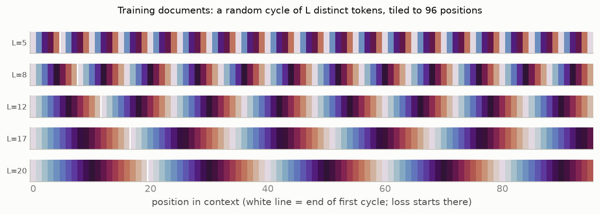
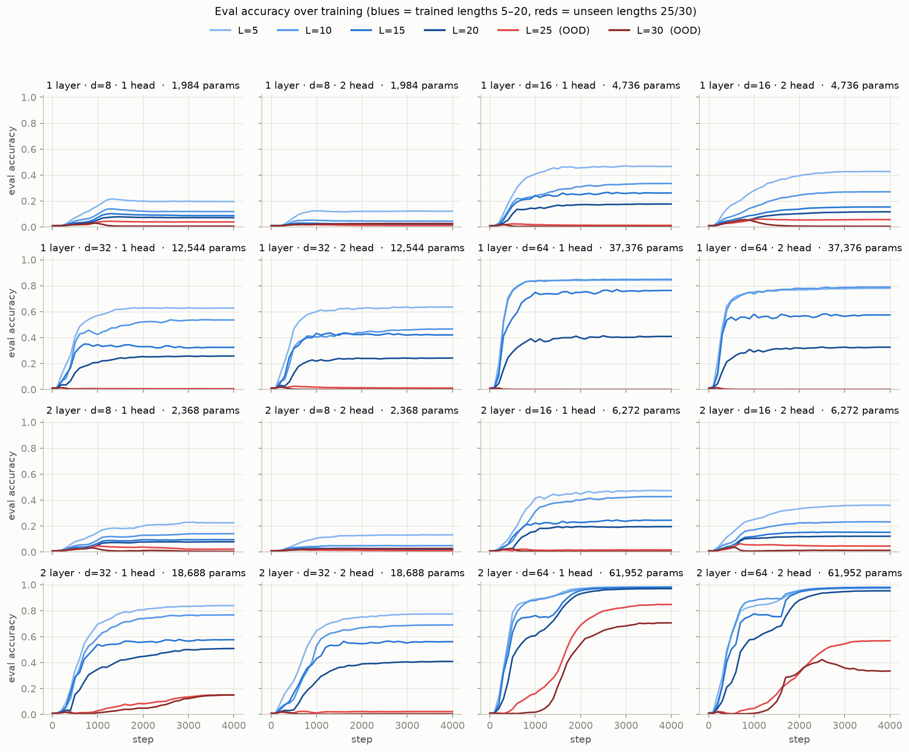
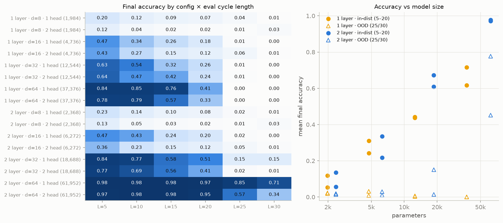
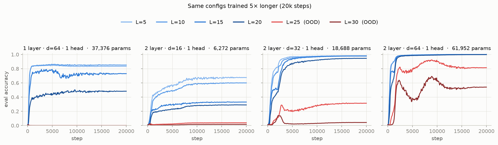
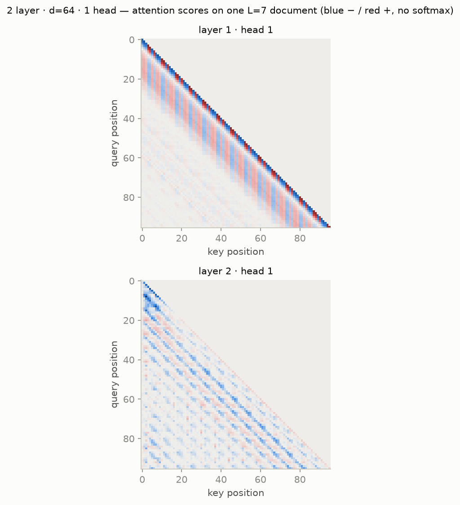
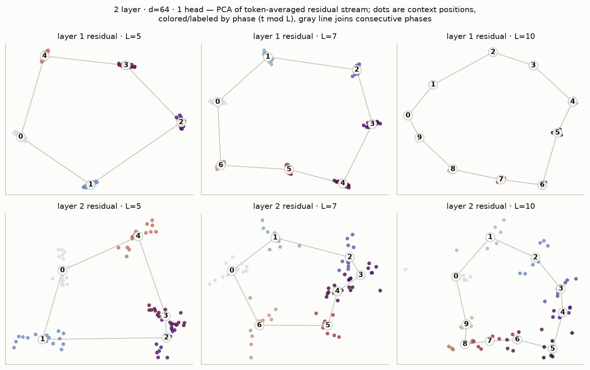

# Learning token cycles with bilinear attention-only transformers

**Task.** A document is a random cycle: sample a length `L ∈ {5,…,20}`, sample `L` distinct
tokens from a 100-token vocabulary, and tile them to fill a 96-position context. After one
full cycle the next token is fully determined, so loss and accuracy are computed only on
positions from the second cycle onward. Eval uses fresh held-out cycles at
`L ∈ {5, 10, 15, 20, 25, 30}` — **25 and 30 never appear in training**, so they test length
generalization.

**TL;DR**

| Question | Answer |
|---|---|
| Can 1 layer do it? | **No** — plateaus (best 0.85 @ L=5, ~0.48 @ L=20, exactly 0 OOD) even with 5× training |
| Smallest model that solves the training distribution | **2 layers · d=32 · 1 head (18.7k params)**, needs ~20k steps → 0.95–0.98 in-dist, but weak OOD (0.31 / 0.04) |
| Smallest model that also generalizes to unseen lengths | **2 layers · d=64 · 1 head (62k params)** → ~0.98 in-dist, 0.85 / 0.71 at L=25/30 (4k steps) |
| Heads | 1 head ≥ 2 heads everywhere (at fixed d_model) |
| Circular structure? | **Yes** — the residual stream encodes phase `t mod L` on a clean circle, phases in exact cyclic order (see last section) |

---

## Architecture

Attention-only transformer built from the **bilinear attention** of
[tdooms/tensor-similarity](https://github.com/tdooms/tensor-similarity)
(`src/components/attention.py`), which replaces softmax attention with a *quadratic scoring
function*: two independent QK circuits whose scores are multiplied,

```
pattern = causal_mask ⊙ (q₁·k₁) (q₂·k₂) / d_head²        (no softmax anywhere)
out     = lerp(x, O·(pattern · V·x), scale)                (scale = 0.5 → even residual mix)
```

- rotary position encoding on q₁, k₁, q₂, k₂ (no learned positional embeddings)
- `nn.Embedding(100, d_model)` in, `nn.Linear(d_model, 100)` out
- **no MLPs, no layer norms** — the whole model is a polynomial in its inputs, matching the
  reference repo's design (their `scale` semantics kept verbatim; we fix `scale = 0.5`)

Sweep: layers ∈ {1, 2} × d_model ∈ {8, 16, 32, 64} × heads ∈ {1, 2}, 1,984 → 61,952 params.
Training: batch 256, Adam, lr 1e-3 (100-step warmup, cosine decay), 4,000 steps
(≈ 98M tokens); on-the-fly sampling so no document repeats. Each run ≈ 10 s on an RTX 5070 Ti.

## Training data

```
L=11 | 71 47 26 96 28 70 21 72 84 49  6 | 71 47 26 96 28 70 21 72 84 49  6 | 71 47 26 96 28 …
L= 8 | 34 76 10 97 60 14  5  3 | 34 76 10 97 60 14  5  3 | 34 76 10 97 60 14  5  3 | 34 76 …
L=17 | 76 21 68 26 90 52 83 36 89  4  9 35 66 73 27 58 34 | 76 21 68 26 90 52 83 36 89  4 …
```

Each row below is one document, colored by position-in-cycle (the sawtooth is the repetition;
the model is only scored right of the white line):



## Training & eval over training

Blues = trained lengths (5–20), reds = held-out lengths (25/30). The only runs where the red
curves leave the floor are the 2-layer d=64 models — and they rise **late**, well after the
in-distribution curves saturate (a grokking-like transition to the general algorithm).
1-layer models are ordered by length (shorter = easier) and never generalize.



Final accuracy for every config × eval length, and the same data as accuracy vs parameter
count (circles = in-distribution mean, triangles = OOD mean):



**Is the plateau capacity or training time?** Re-training the interesting configs 5× longer
(20k steps) answers it:



- **1 layer · d=64**: unchanged — the 1-layer ceiling is architectural, not optimization.
  This is the bilinear-attention analogue of the classic result that induction needs two
  layers: a single layer attending from the current token cannot retrieve "the token *after*
  the previous occurrence" because that information isn't in any single key/value position.
- **2 layer · d=16**: still climbing but far away — capacity-limited.
- **2 layer · d=32**: *does* solve the training distribution given enough steps
  (0.98/0.98/0.98/0.95) — so 18.7k params suffice for the in-distribution task — but OOD
  stays weak (0.31 / 0.04).
- **2 layer · d=64**: in-dist → 0.999 everywhere; OOD is **non-monotone in training time**
  (peaks ≈ 0.93/0.68 around step 9k, then decays to 0.81/0.54; the 4k-step checkpoint ends
  at 0.85/0.71). Continued training overfits the positional range of the training lengths —
  if OOD length generalization is the goal, early stopping on it matters.

## Structure of the learned solution

Attention scores of the best generalizer (2L · d64 · 1h) on a single L=7 document. Layer 1 is
a local band with period-L striping (gathering "what preceded me"); layer 2 attends in stripes
at **multiples of the cycle length** — the induction-style "look back exactly one period"
pattern, which is what makes the solution length-general:



**The circular representation** (à la Josh Engels' *Not All Language Model Features Are
Linear*). Token identity is averaged out by taking the mean residual state at each absolute
position over 512 documents with the same L (token choice is independent of position, so what
survives is the positional code), then removing the slow drift with a one-period rolling mean.
PCA of the remainder: every dot is a context position, colored/labeled by phase `t mod L`.
Both layers, at every cycle length — including ones like 7 that divide nothing — lay the
phases on a **circle in exact cyclic order**:



The top-2 principal components carry 73–94 % of the (detrended) positional variance in layer 1,
and stepping through phases 0 → 1 → … → L−1 moves monotonically around the circle in every
panel (checked numerically, not just visually).

## Mechanistic analysis

How the 2-layer model actually computes this — signed-attention circuits, the phase-detector
× envelope factorization, and wire ablations — is written up in [mech.html](mech.html)
(also at https://claude.ai/code/artifact/0c0b5be4-9b02-4d42-9fae-3c71302e5194; `python mech.py` reproduces).

## Softmax baseline (added later)

A standard softmax-attention model with the same skeleton (2L · d64 · 1 head, 4k steps;
`attention="softmax"` in `model.py`) beats bilinear on this task: 0.99 in-distribution and
**0.98 / 0.97 at the unseen lengths 25 / 30** (bilinear: 0.85 / 0.71). Its residual stream shows
the same clean phase circles ([figures/circle_softmax.png](figures/circle_softmax.png)). See
[results_graphs.md](results_graphs.md) for the full architecture comparison.

## Caveats

- Single seed per config (the 4k vs 20k re-runs act as a partial replication; rankings were stable).
- Accuracy is teacher-forced next-token accuracy on determined positions.
- Cycle tokens are sampled *without replacement*, so a cycle never contains a repeated token
  (repeats would make the target ambiguous for 1-cycle context; worth revisiting for the
  graph-walk tasks where revisits are the norm).

## Reproduce

```bash
python train.py        # 16-config sweep → runs/<name>/{history.json,model.pt}  (~3 min)
python analysis.py     # all figures → figures/*.png
```

Files: `model.py` (bilinear attention, adapted from the reference repo, minus its
tensor-network machinery), `data.py` (cycle sampling + eval sets), `train.py`, `analysis.py`.
