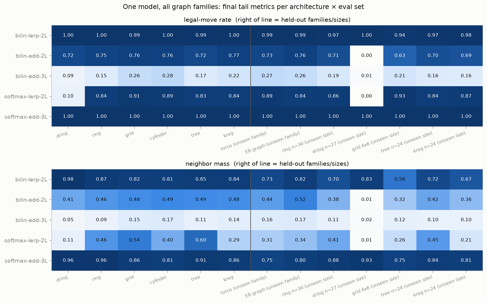
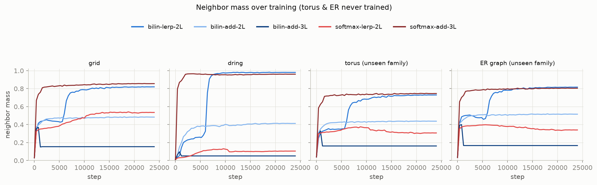
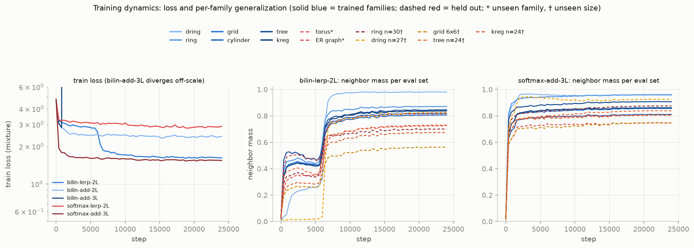
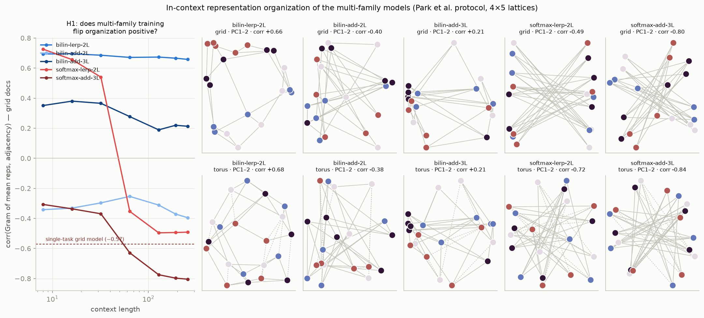
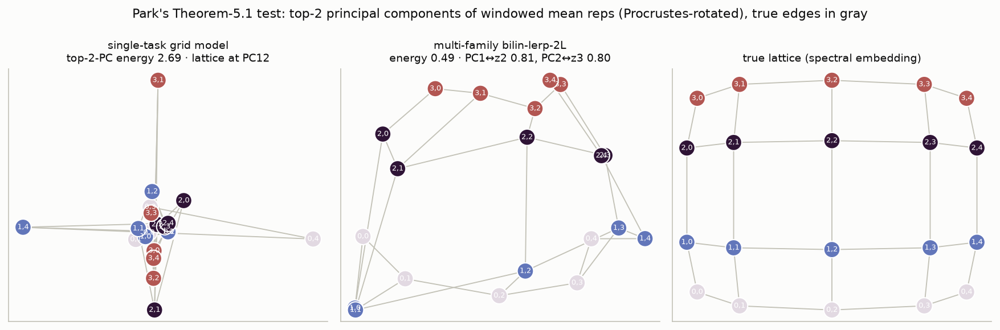
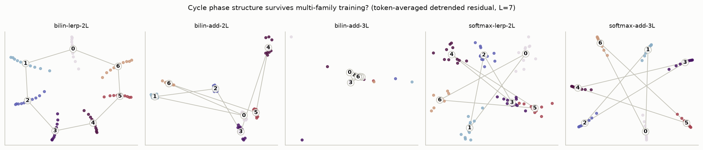
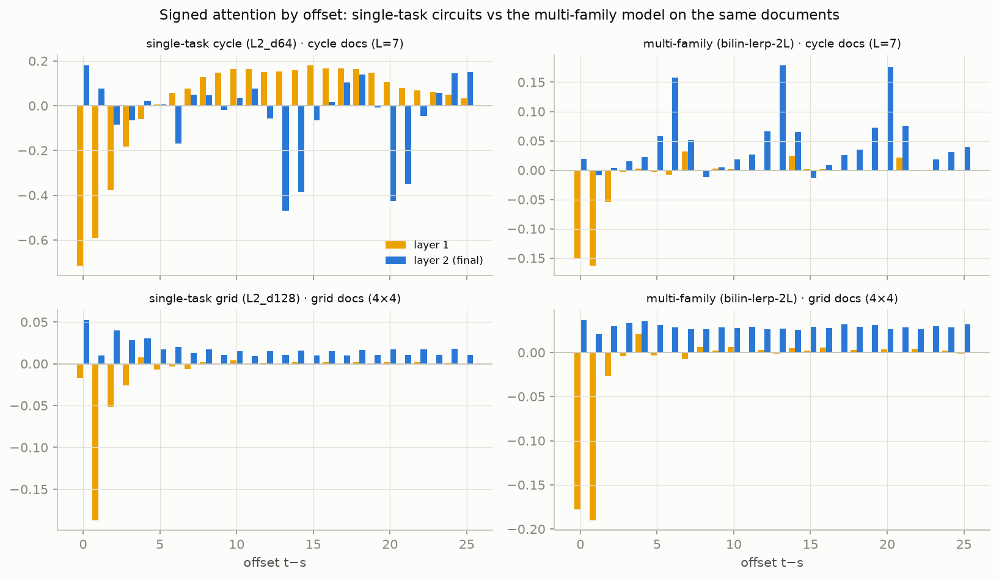

# One model, many graphs: multi-family graph tracing

Follow-up to [results.md](results.md) and [results_graphs.md](results_graphs.md). The
single-task 2-layer models learned task-specific circuits (the cycle model's "never predict
the last 3 tokens" elimination; the grid model's backtrack baseline and dual copy routes)
and anti-organized their in-context representations. Here we train **one model on six graph
families at once** and ask whether that forces a general relational circuit and Park-style
representations. Hypotheses were fixed before running — see [LOG.md](LOG.md) for the
hypothesis→verdict trail.

**Task** (`graphs.py`): uniform random walks on token-labeled graphs, one graph per 256-token
document. Train families: **ring, directed ring (≡ the cycle task), grid, cylinder, random
tree, random 3-regular** (9–20 nodes). Held out entirely: **torus, Erdős–Rényi**; held-out
sizes: ring 30, dring 27, grid 6×6, tree/kreg 24. The mixture is self-disambiguating in
context (e.g. ring vs directed ring differ only in whether backtracks ever occur).

**TL;DR**

| Question | Answer |
|---|---|
| Can one small model do all of it? | **Yes** — two archs reach ~1.00 legal on every family *and* zero-shot on torus/ER: bilin-lerp-2L and softmax-add-3L (222k/354k params) |
| Does the mixture help or hurt? | **Helps** — the multi model beats the grid specialist on grid docs (mass 0.81 vs 0.76) and reaches 0.99 grid legal in half the steps |
| Does it flip representations Park-positive (H1)? | **For the original bilinear-lerp arch, yes**: grid corr −0.57 (single-task) → **+0.66** (multi), torus +0.68, clean phase circle on cycles. **But not universally**: the equally-perfect softmax-add-3L anti-organizes at −0.80 and draws a 7-pointed *star* for the cycle |
| Do the task-specific shortcuts die (H2)? | The cycle elimination hack dies (no-L2 at L=5: 0.88 → **0.00**); the backtrack baseline survives (it's legal in most families). The circuit unifies: K-composition all-or-nothing, V-composition abandoned, positive attention everywhere |
| Architecture sensitivity | Extreme: bilin-**add**-2L plateaus at 0.75, bilin-add-3L **diverges** (loss 1e20 — the additive fix from the depth study is unstable on the harder mixture), softmax-**lerp**-2L fails only the deterministic family (dring 0.10) |

## Performance





Full per-family training dynamics — note the bilinear generalist's phase transition at ~6k
steps, where every family including the held-out ones jumps at once:



Notes: torus and ER (never trained) track the train families almost exactly for the two
champions — the algorithm really is family-agnostic in-context adjacency retrieval. The
weak archs fail *selectively*: softmax-lerp-2L is fine on every stochastic family but gets
0.10 on directed rings (its single-task twin solved cycles — a pure interference effect),
and both it and bilin-add-2L drop to 0.00 on dring at unseen length 27.

## H1: representation organization

Park protocol (windowed per-token mean residual, final layer, one fixed labeling) on 4×5
grid and 4×5 torus documents:



- **bilin-lerp-2L flips positive and stays there** (+0.69 → +0.66 across context; single-task
  reference: −0.57). Its top-PC map has visibly local edges — the closest thing to Park's
  LLM picture any of our models has produced — and it does the same on the never-trained torus.
- **softmax-add-3L is a perfect performer and the strongest anti-organizer we've measured**
  (−0.80 grid / −0.84 torus; its top-PC map is a pure star). Organization sign is therefore
  **decoupled from competence** — both geometries support perfect behavior.
- softmax-lerp-2L repeats its single-task signature: organizes early (+0.73 at ctx 8), flips
  late (−0.49).

**Is it *actual* Park-style geometry, or just a sign?** Park et al.'s Theorem 5.1 gives the
sharp test: genuine energy-minimizing organization puts the graph's spectral coordinates in
the **top two PCs** (they measure |cos(PC, z)| ≈ 0.94 on Llama). Ours passes:

| model | PC1↔z2 / PC2↔z3 | top-2-PC Dirichlet energy (random ≈ 2) | lattice's best PC |
|---|---|---|---|
| single-task grid (anti) | 0.08 / 0.03 | 2.69 | PC12 |
| **multi bilin-lerp-2L** | **0.81 / 0.80** | **0.49** | **PC1** |
| multi softmax-add-3L (anti) | 0.02 / 0.01 | 3.94 | PC14 |



**Interactive 3D viewer, all eight structures** (node means + per-position datapoint clouds,
per-panel model switcher incl. true spectral reference, context slider):
[figures/geo_compare_3d.html](figures/geo_compare_3d.html), published at
https://claude.ai/code/artifact/6e85f3a9-aa05-4bbd-ba98-addbaaba3e16 (`python compare3d.py`).
Per-structure Gram–adjacency corr of the ctx-256 node means confirms the pattern is uniform:
multi-bilinear +0.53…+0.75 on every structure (incl. never-trained torus +0.57 and ER +0.53),
grid specialist −0.31…−0.56, softmax champion −0.70…−0.82.

So the flip is not a sign convention on the same geometry: the conditions differ in *where*
the lattice lives in the variance spectrum (top PCs vs buried at PC12), which no
sign/gauge symmetry produces. Neighbors are literally stored nearby, in a warped 4×5 sheet.

Same story in the cycle representation (token-averaged detrended residual, L=7): the positive
organizer draws the **heptagon**, the anti-organizer draws the **{7}-star** — adjacent phases
antipodal:



### Controls

| condition | seeds (grid corr @ ctx 256) | verdict |
|---|---|---|
| grid only (identical pipeline) | −0.14, +0.67, −0.08, +0.16 | **unconstrained — a seed lottery** |
| grid + dring | −0.55, −0.70, −0.72 | reliably anti |
| full mixture, bilin-lerp-2L | +0.66, +0.55, +0.62 | reliably positive |
| full mixture, softmax-add-3L | −0.80, −0.67 | reliably anti |

Honest revision after the seed batteries: single-family training does NOT reliably
anti-organize — its sign scatters across seeds (the original single-task −0.57 was one draw
from that lottery). What the mixtures do is **pin the mode**: deterministic-copy company
pins it anti, diverse stochastic company pins it positive. The grid-only control also shows
broad zero-shot transfer (torus 0.98, ER 0.98) comes almost free from grid training alone;
the mixture's unique additions are the deterministic family (dring-27: 0.63 → 1.00) and the
reliable geometry.

## H2: the circuit rewired

Same mech battery as [mech.html](mech.html), single-task vs multi-family bilin-lerp-2L on
identical documents:

| ablation (cycle docs, acc @ L=5/15/30) | single-task | multi-family |
|---|---|---|
| full | 0.98 / 0.98 / 0.71 | 0.93 / 0.82 / 0.25 |
| layer 2 removed | **0.88** / 0.10 / 0.00 | **0.00** / 0.00 / 0.00 |
| L2 keys from embed-stream | 0.86 / 0.17 / 0.01 | 0.00 / 0.00 / 0.00 |
| L2 values from embed-stream | 0.89 / 0.14 / 0.01 | 0.97 / **0.94** / 0.54 |

| ablation (grid docs, legal / mass) | single-task | multi-family |
|---|---|---|
| full | 0.989 / 0.762 | 0.995 / 0.811 |
| layer 2 removed | 0.839 / 0.400 | 0.889 / 0.431 |
| L2 keys from embed-stream | 0.601 / 0.357 | 0.449 / 0.176 |
| L2 values from embed-stream | 0.711 / 0.529 | 0.909 / 0.797 |

- The **elimination shortcut is gone** (no-L2 on short cycles: 0.88 → 0.00) — as predicted,
  it conflicts with undirected rings where backtracking is legal.
- **K-composition became all-or-nothing** (cut it and cycles drop to exactly 0.00), while
  **V-composition flipped from load-bearing to unnecessary** — cutting it barely dents the
  grid and *improves* deterministic cycles. The multi model copies via raw token embeddings
  and uses the L1-written window only for matching.
- The attention itself sign-flipped: layer 2 attends **positively** at the induction offsets
  on cycle docs (the single-task model attended negatively), and layer 1 lost its long
  positive "shortlist" tail:



So the multi-family circuit is exactly the "generalized relational circuit" the hypothesis
hoped for: L1 = short previous-token window, L2 = positive content-match retrieval with raw
copy, applied uniformly to every family — and it coincides with the positive (Park-like)
representation geometry, consistent with the idea that the anti-map belongs to
negative-attention induction.

## H5: which ingredient flips the organization?

Pre-registered guess: the *conflicting* deterministic family (dring punishes recency
shortcuts) drives the flip. **Falsified** — two-family mixtures show the opposite:

| bilin-lerp-2L trained on | grid corr (ctx 256) |
|---|---|
| grid only | −0.14 … +0.67 (4 seeds, unconstrained) |
| grid + **dring** | **−0.55 / −0.70 / −0.72 (3 seeds)** — reliably anti |
| grid + cylinder | +0.24 |
| grid + ring | +0.38 |
| grid + tree | +0.41 |
| all six families | **+0.55 … +0.66 (3 seeds)** |

Any second *stochastic undirected* family flips the sign; the deterministic directed ring
pulls the other way (and the full mixture overrides it). Together with the mech results,
the refined picture: **organization sign tracks the algorithmic mode**. Deterministic
next-token copying favors induction-style circuits, which anti-organize; predicting
*neighborhoods as sets* across diverse stochastic families builds positive local geometry.

The exception proves the rule: the perfect softmax-add-3L is mechanically a **textbook
induction stack** — layer 1 is a pure previous-token head (0.97 attention at offset 1),
layer 2 the induction head, and layer 3 nearly idle (knockout keeps grid legal at 1.00 and
*raises* mass to 0.895) — and it anti-organizes (−0.80 / −0.67 across seeds) even on the
full stochastic mixture. Circuit type, not data alone, sets the sign. Unresolved: both
circuit styles rely on K-composition matching, so "retrieval wants separable neighbors"
does not by itself explain why induction anti-organizes and set-prediction doesn't.

## Session 2: why neighbors end up nearby

Resolved in [results_why.md](results_why.md): representations carry the prediction (positive
neighbor evidence — always the positive map) plus own-token content whose sign is behaviorally
free; **reversibility of the training walks** pins that sign (irreversible families force
suppression-in-writes → anti-map; any backtracking → positive map; entropy is irrelevant).
Figure: `figures/geo_why.png`.

## Caveats

- Single seed for most archs (one replication for the headline arch); 24k steps each.
- bilin-add-3L's divergence means "additive residual fixes depth" (from results_graphs.md)
  needs a stability caveat: it trains at 8k steps single-task but explodes here — norms or
  lower lr likely required at depth on harder mixtures.
- Organization is measured on the final layer only, one labeling, one window size.

## Reproduce

```bash
python train_general.py     # 5 archs × 24k steps on the mixture  (~35 min)
python analysis_general.py  # gen_perf/gen_training/gen_org/gen_circle
python mech_general.py      # circuit comparison tables + gen_mech.png
```
