# Learning lattice random walks (grid, cylinder, donut) with bilinear attention-only transformers

Follow-up to [results.md](results.md) (token cycles). Same architecture — attention-only,
bilinear attention from [tdooms/tensor-similarity](https://github.com/tdooms/tensor-similarity),
no MLPs, no norms — on a harder family: **random walks on token-labeled 2D lattices**.

**Task.** One document = one lattice whose nodes are random distinct tokens (from the same
100-token vocab), plus a 256-step uniform random walk over its edges. Three topologies:

| topology | wraparound | node degrees |
|---|---|---|
| grid | none | 2 (corners) / 3 (edges) / 4 (interior) |
| cylinder | columns wrap | 3 (top/bottom rows) / 4 |
| torus (donut) | both wrap | all 4 |

Training sizes: 3×3, 3×4, 4×4, 4×5 (9–20 nodes). **OOD sizes: 5×5 and 6×6, never trained.**
The model must infer the graph *in context* from the transitions it has seen so far.

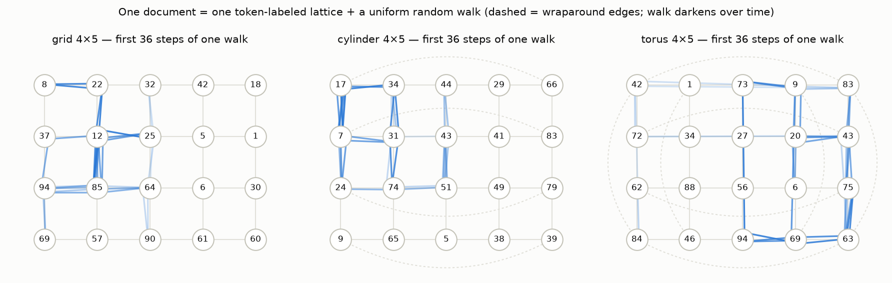

**Metrics.** The next token is stochastic (uniform over the current node's neighbors), so
exact-match accuracy is meaningless. We score the predicted distribution on late context
positions (≥ 128, once the walk has revealed the graph):

- **legal-move rate** — is the argmax prediction a graph neighbor? (Note: gameable — always
  predicting the token you came from is 100 % legal, so this is a floor-check, not the headline.)
- **neighbor mass** — total probability on the true neighbor set (optimum 1.0). This is the
  discriminating metric.

**TL;DR**

| Question | Answer |
|---|---|
| Smallest model | **2 layers · d=128 (222k params)** is the first config that really works; 1-layer models plateau at ~0.45 neighbor mass, and *more* layers make things worse (see below) |
| Difficulty | grid < cylinder < torus — more wraparound = harder |
| Best results (20k steps) | legal rate in-dist/6×6: grid **0.99 / 0.95**, cylinder **0.99 / 0.91**, torus **0.91 / 0.76** |
| OOD sizes | transfer well — the algorithm is local (in-context adjacency lookup), not size-bound |
| Cross-topology | grid-trained model scores 0.99 legal on cylinder *and* torus — the circuit is topology-agnostic |
| 3 layers | **collapse** (0.14–0.56 legal) — diagnosed and fixed: the `lerp` residual halves the stream each layer; a plain `x + o(z)` residual (or RMSNorm) restores training (see "The 3-layer collapse") |
| Structure | spectral embedding of the model's implied transition matrix redraws the lattice (sheet / tube / torus); raw PCA of hidden states does **not** show a literal map |

## Training data

Example walk (4×5 grid): each token revisits as the walk crosses its node —

```
13 18 70 18 58 32 95 13 95 44 95 13  3 44  3 70  3 44 95 44  2 77  2 77 27 70 18 13 18 58 …
```

## Training & eval over training

Solid = trained sizes, dashed = unseen 6×6; line color = width. Two things to notice:
1-layer models learn a quick cheap strategy and flatline; only 2L·d128 keeps climbing
(grid shows a second transition at ~3k steps). And every 3-layer run is far *below* its
2-layer counterpart — the norm-free polynomial stack becomes untrainable, not just
unnecessary, at depth 3.

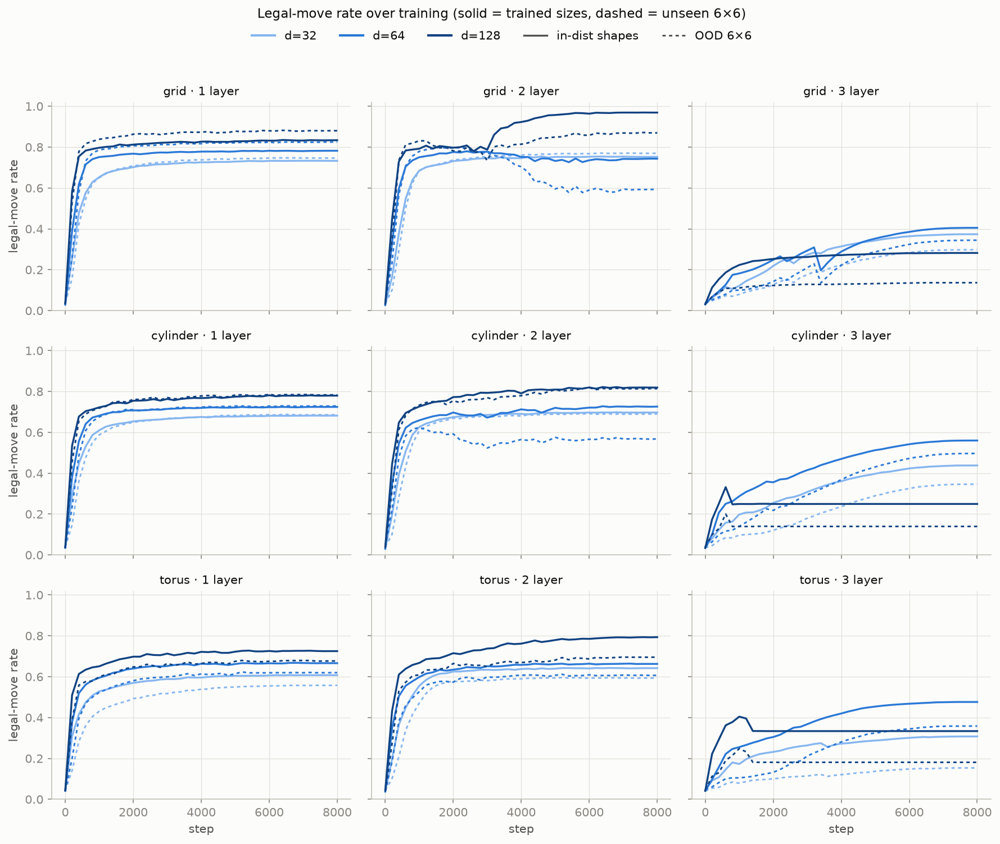

Final tail metrics for all 27 runs. Left: legal-move rate; right: the stricter neighbor
mass. Note how legal rate flatters the small models (0.7-ish) while their mass sits near
0.3 — that's the backtracking-style shortcut at work:

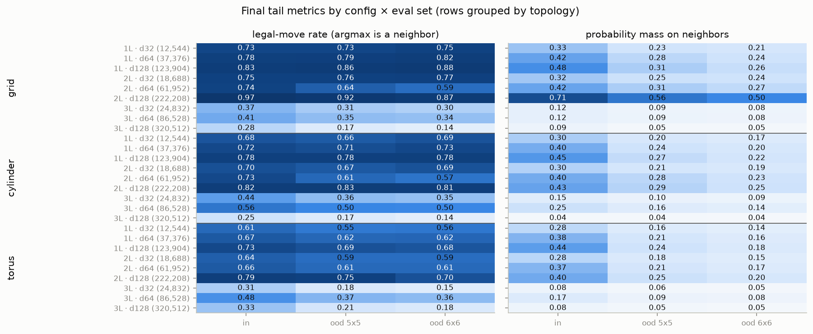

The best config trained 2.5× longer keeps improving (as with cycles, training time was the
bottleneck, and here OOD improves along with in-dist rather than degrading):

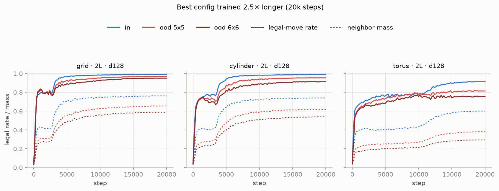

Final numbers (20k steps, 2L·d128):

| topology | legal in / 5×5 / 6×6 | mass in / 5×5 / 6×6 | train loss (optimal ≈) |
|---|---|---|---|
| grid | 0.99 / 0.97 / 0.95 | 0.76 / 0.66 / 0.59 | 2.22 (1.09) |
| cylinder | 0.99 / 0.95 / 0.91 | 0.74 / 0.62 / 0.54 | 2.34 (1.24) |
| torus | 0.91 / 0.82 / 0.76 | 0.60 / 0.38 / 0.30 | 2.78 (1.39) |

The loss gap to the uniform-over-neighbors optimum shows none of these models fully solves
the task — argmax legality is nearly saturated on the grid, but calibrated neighbor mass
is not. Bigger models / longer training would likely keep going.

## In-context graph learning

Metrics as a function of position in the context. The spike at positions 1–2 is real optimal
behavior: after one transition the only known neighbor is the token you came from, and
predicting it is always legal. Mass then *grows over ~100 steps* as the walk reveals the
lattice — this is in-context learning of the graph, and it works at never-seen sizes (reds),
just more slowly (more nodes to discover):

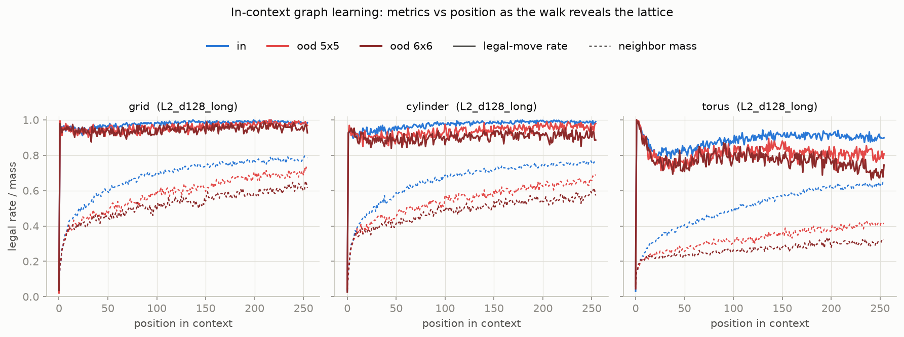

## Cross-topology transfer

Each best model evaluated on the other topologies' documents (trained sizes). Grid- and
cylinder-trained models transfer essentially perfectly — wraparound edges are just more
in-context transitions to a circuit that looks up "which tokens followed the current token
earlier". Nothing about the topology is baked into the weights; the torus row is lower
only because that model is weaker overall:

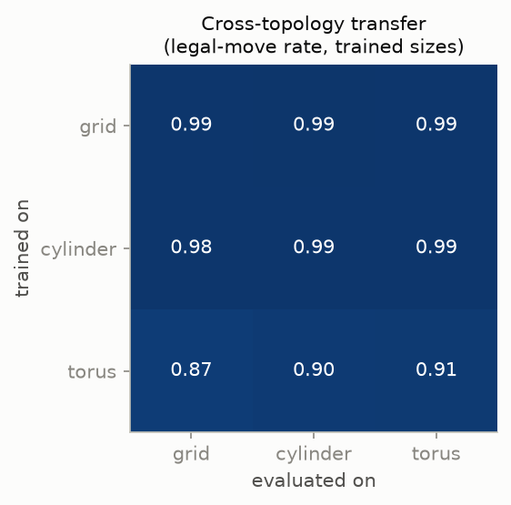

## Visualizing the learned relationships

Fix **one** token labeling of a 4×5 lattice, run 512 fresh walks over it, and average the
model's predicted next-token distribution at each node → the model's **implied transition
matrix**. It reproduces the true banded adjacency structure (torus faintest, matching its
metrics):

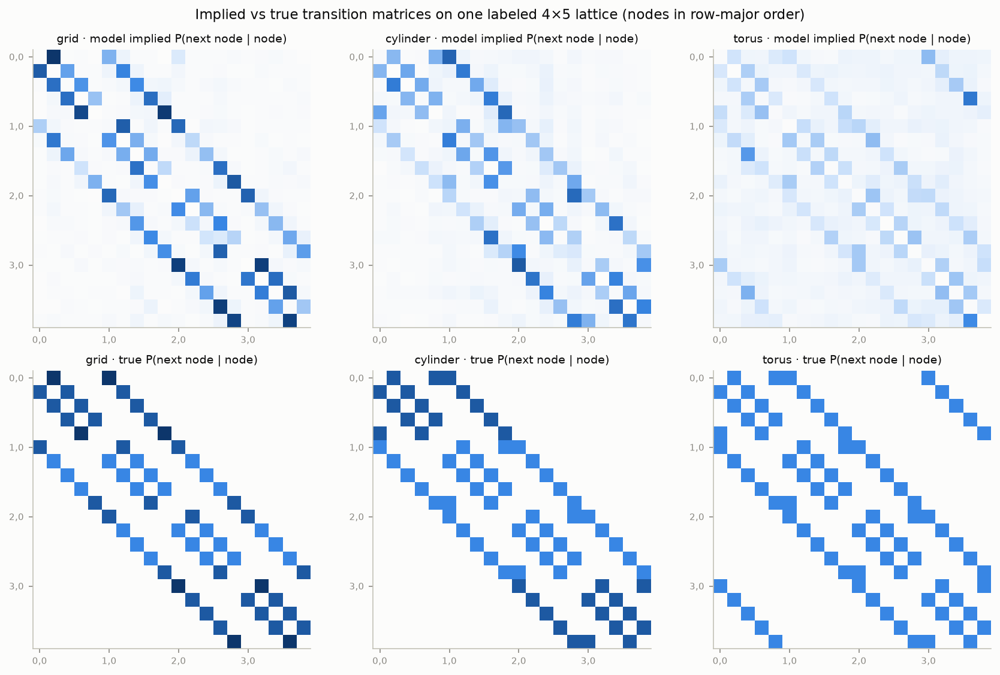

A Laplacian spectral embedding of that implied matrix *redraws the lattice* — 4×5 sheet for
the grid, the same sheet with wrap arcs for the cylinder, and the two harmonic pairs of the
torus (dims 1–2 organize columns, dims 3–4 rows; noisier, as expected):

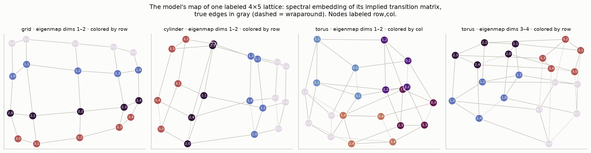

**Interactive 3D version:** [figures/geo_structure_3d.html](figures/geo_structure_3d.html) —
drag to rotate, scroll to zoom, with x/y/z selectors over the first four eigenmap dimensions
(also published at https://claude.ai/code/artifact/06a05620-0837-4f54-b073-a88c7ba91b84).
The viewer also has a **residual PCA** mode with a context-length slider — see the next section.

## In-context representations: the Park et al. comparison

Park, Lee, Lubana, Yang et al. (ICLR 2025, *In-Context Learning of Representations*) run the
same graph-tracing task on Llama-3.1-8B and find that the **top principal components** of the
windowed per-token mean residual stream converge to the graph's spectral embedding as context
grows — neighbors pulled together, Dirichlet energy minimized, the lattice drawn by PCA itself.

Applying their exact protocol (mean residual per token over a trailing 50-token window, one
fixed labeling, 512 walks) to our models gives the **opposite organization**:

- The Gram matrix of mean reps correlates **negatively** with adjacency (grid −0.57,
  torus −0.36, cylinder −0.20), and for the torus this anti-correlation *develops in-context*
  (−0.07 at 8 tokens → −0.45 at 128). Neighbors are pushed **apart** — Dirichlet energy is
  maximized, not minimized.
- Consequently the top PCs are the *high-frequency* graph harmonics — on the (bipartite) grid,
  PC directions correlate with the checkerboard coloring (~0.5), and the PCA picture is an
  **anti-map**: true edges cross the center instead of staying local (compare the paper's
  Fig. 3b "semantic conflict" star).
- Traces of the smooth lattice map correlate with the low-variance tail of the PC spectrum
  (peak corr 0.79 with a true lattice harmonic at PC 12, 1.8 % variance share) — but plotting
  that projection directly shows it is **not a usable map**: rows order roughly along one
  direction and nothing more. The correlation numbers overstate what is visually there. For
  this model, the lattice geometry genuinely lives in behavior, not in a hidden clean subspace:

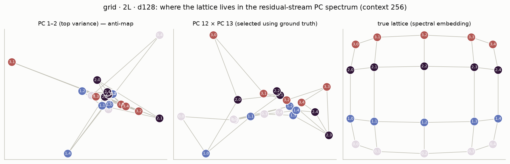

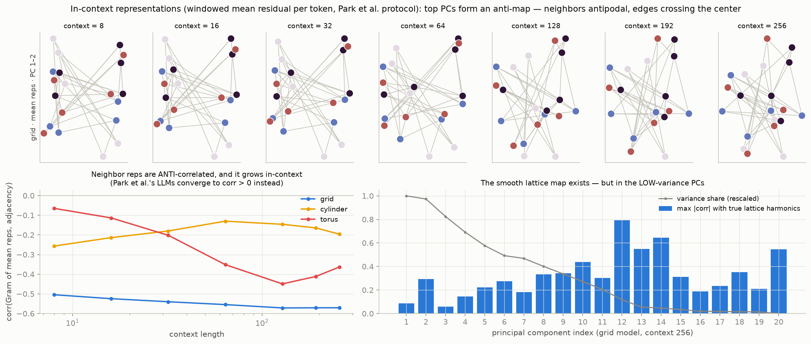

This makes computational sense for an induction-style circuit: attention that must *retrieve*
a specific node's successors benefits from neighboring nodes being maximally distinguishable,
whereas an energy-minimizing map makes neighbors confusable. It also suggests a reason the
torus lags: anti-alignment (a soft graph 2-coloring) is frustrated on non-bipartite graphs,
and our 4×5 cylinder/torus wrap an odd 5-ring. Two caveats: we measured the final-layer
residual of a 2-layer model (the paper sweeps layers of a 32-layer LLM), and one seed each.
We also tried recovering the lattice from internals by searching for a minimum-Dirichlet-energy
3D subspace of the reps — and rejected it: with 20 nodes in a 19-dim rep space it reaches the
same energy for shuffled node labels, i.e. it can draw a lattice from noise.

### Organization is an architectural choice: 3-layer and softmax baselines

Running the depth-fixed bilinear models and a **standard softmax-attention baseline** (same
attention-only skeleton, rotary, lerp residual; `attention="softmax"` in `model.py`) through
the identical protocol flips the picture:

| grid model (task performance) | Gram–adjacency corr, ctx 8 → 256 |
|---|---|
| bilinear · 2L (legal 0.99 / mass 0.76 at 20k) | −0.50 → **−0.57** (anti, stable) |
| bilinear · 3L + add-residual (0.99 / 0.77 at 8k) | +0.36 → **+0.41** (positive, stable — Llama-like) |
| bilinear · 3L + add + RMSNorm (1.00 / 0.77) | +0.50 → −0.05 (decays to none) |
| softmax · 2L (legal 0.99, **OOD 6×6 legal 1.00**, mass 0.39 at 8k) | **+0.72 → −0.47** (organizes, then flips) |

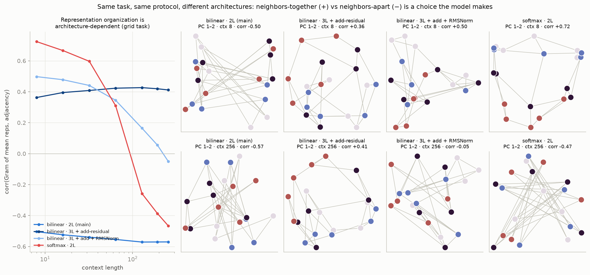

So neighbors-together vs neighbors-apart is not forced by the task — it's a strategy choice
that tracks architecture: the 2-layer bilinear model anti-organizes; the 3-layer additive
model holds a Park-et-al-style positive map; softmax builds the positive map early in context
(its ctx-8 PCA is visibly lattice-like, corr +0.72) and then *abandons* it for anti-organization
as more context accumulates — while its behavioral accuracy keeps improving. None of them
produces the clean top-PC lattice of an 8-billion-parameter LLM at 1400 tokens of context;
at this scale the unambiguous map only exists behaviorally.

On the **cycle task** the softmax baseline (2L·d64, 4k steps) is strictly better than bilinear —
accuracy 0.99 in-distribution and **0.98 / 0.97 at the unseen lengths 25/30** (bilinear: 0.85 /
0.71) — and shows the same clean phase circles in its residual stream
([figures/circle_softmax.png](figures/circle_softmax.png)). A 3-layer bilinear cycle model with
the additive residual trains fine in-distribution (0.79–0.92) but generalizes poorly (0.16 / 0.01).

### Linear probes to the spectral coordinates (belief-state-geometry style)

Following Shai et al.'s Mess3/simplex methodology, we fit ridge probes from per-position
residual states to the true spectral-embedding coordinates of the current node, evaluated on
held-out walks. The probe **draws a clean lattice** (below, left: per-position probe outputs
cluster tightly at the right node coordinates, R² 0.98–1.00 for every model and topology).

But the mandatory control kills the naive reading: the same probe hits **shuffled** node
coordinates equally well (second panel — a perfect fake lattice, R² 0.985). This is the key
disanalogy with Mess3: there, the belief state is a continuous function of the whole history;
here the target is a fixed vector per *node*, node ≡ current token, and 20 distinct tokens
give 20 linearly independent states in 128 dims — a linear map can send them to *any* 20
points. An unrestricted probe measures linear separability, not geometry.

The non-vacuous version is the **regularization path**: under increasing ridge the probe can
only read the dominant variance directions, so the true-vs-shuffled gap measures whether the
true geometry is preferentially embedded. Max held-out gap (true − shuffled R²):

| grid model | max gap | at λ |
|---|---|---|
| bilinear 2L | **+0.19** (0.71 vs 0.52) | 3.2 |
| bilinear 3L + add | **+0.20** (0.64 vs 0.44) | 10 |
| bilinear 3L + add + RMSNorm | +0.05 | 10 |
| softmax 2L | +0.02 | 32 |

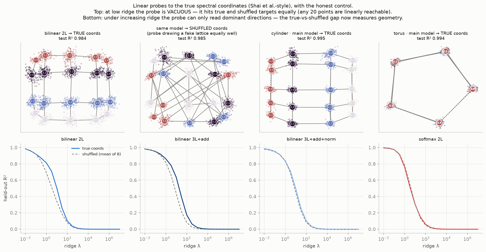

So by the probe criterion, both pure-bilinear models carry genuinely preferential (if modest)
spectral-coordinate structure — including the 2-layer one whose *sign* of organization is
negative (an anti-map is still graph-harmonic structure, and random node assignments are
harder to read than the true harmonics) — while softmax's late-context states carry almost
none beyond token separability. None approaches the Mess3 situation where the geometry *is*
the dominant structure. Reproduce with `python probe.py`.

In the [3D viewer](https://claude.ai/code/artifact/06a05620-0837-4f54-b073-a88c7ba91b84),
switch a panel to **residual PCA** and drag the context slider to watch the organization form
(frames are Procrustes-aligned across context lengths). The viewer now has six panels: the three
main lattice models, the **cycle model's phase ring** (its residual stream *does* carry the
structure in the top PCs), and the two grid variants — watch the softmax panel organize
positively at short context and flip. Reproduce with `python icl_reps.py`.

Contrast with the cycles experiment: there, the *residual stream itself* laid phases on a
circle. Here, PCA of per-node mean hidden states shows no clean lattice (we checked) — the
geometry lives in the model's input→output *behavior*, consistent with the transfer result:
the circuit is a relational in-context algorithm, not a stored map.

## The 3-layer collapse: diagnosis and fix

The 3-layer losses never diverged — they stalled near chance (4.3 vs ln 100 ≈ 4.6). The cause
is **signal wash-out from the `lerp` residual**, not the missing norms per se. The reference
layer computes `lerp(x, o(z), 0.5) = 0.5·x + 0.5·o(z)`, and at init the bilinear attention
output is ≈ 0 (a product of two dot products, ÷ d_head²), so each layer simply *halves* the
residual stream. Measured stream RMS at init: 0.50 → 0.25 → 0.13; the trained 3-layer models
never escape it (0.81 → 0.44 → 0.22), while the 2-layer model learns to hold RMS ≈ 1.0.

Four probes on grid · 3L · d128 (8k steps):

| variant | legal in / 6×6 | mass in / 6×6 |
|---|---|---|
| lerp residual (baseline) | 0.28 / 0.14 | 0.04 / 0.04 |
| lerp + lr 3e-4 | 0.52 / 0.48 | 0.20 / 0.12 |
| lerp + pre-RMSNorm | 0.99 / 0.92 | 0.76 / 0.57 |
| **plain `x + o(z)` residual, no norm** | **0.99 / 0.95** | **0.77 / 0.62** |
| `x + o(z)` + pre-RMSNorm | 1.00 / 0.97 | 0.77 / 0.59 |

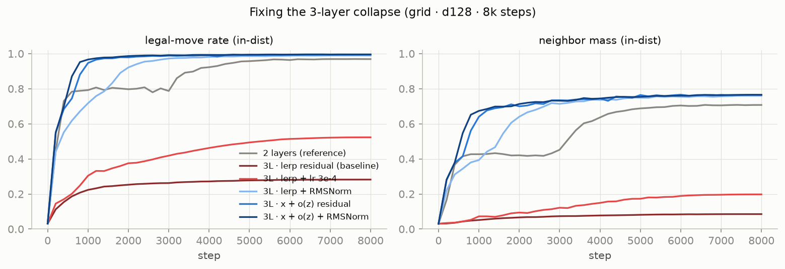

So RMSNorm *does* fix it — but it isn't the root cause, and it breaks the architecture's
polynomial structure. The surgical fix is the standard additive residual, which preserves the
identity path (init stream RMS stays 1.0 through every layer), keeps the model a polynomial,
and trains **better** than the norm variant: the fixed 3-layer model at 8k steps already beats
the 2-layer model at 20k steps on OOD neighbor mass (0.62 vs 0.59). The lr control shows lower
lr alone does not recover it. Depth was never the problem; the halving identity path was.
(`model.py` now exposes `residual="add"` and `norm=True`; old checkpoints are unaffected.)

## Mechanistic analysis

The grid model's circuit (backtrack baseline in layer 1, self-match attention with two copy
routes in layer 2, strong direct-path self-suppression) is worked out with ablations in
[mech.html](mech.html) (also at https://claude.ai/code/artifact/0c0b5be4-9b02-4d42-9fae-3c71302e5194),
including an explicit list of what remains unexplained.

## Caveats

- Single seed per config; 20k-step re-runs of the best config are the only replication.
- `scale=0.5` lerp residual and lr=1e-3 as in the cycles experiment for the main sweep;
  see the section above before reusing this recipe at depth ≥ 3.
- Neighbor mass at OOD sizes is measured at the same tail positions (≥128); larger graphs
  are also just harder to cover in 256 steps, so some of the OOD gap is exploration, not
  generalization failure (visible in the in-context figure).

## Reproduce

```bash
python train_geo.py     # 27-config sweep → runs_geo/  (~35 min on an RTX 5070 Ti)
python analysis_geo.py  # figures → figures/geo_*.png
```

Files: `geodata.py` (lattices, walks, legal-token masks), `train_geo.py`, `analysis_geo.py`.
