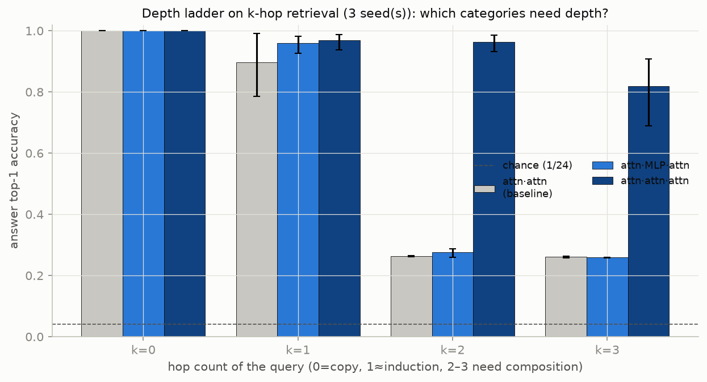

# Depth ladder: what is the "next induction head"?

**Question (session 5).** Induction is the canonical *2-layer* algorithm — a category of
tokens (the continuation of a repeated context) that a 1-layer model cannot predict and a
2-layer model can. Is there a category that needs *more* depth? We care about longer
sequential algorithms (depth), not wider ones (breadth). If we find one, we can ask
causally whether solving it recruits more than the two heads induction uses.

**Setup.** A task with per-token category labels spanning depth requirements:
*in-context k-hop retrieval*. Each document defines a random function `f` on `E=24`
entity tokens (a single random `E`-cycle, so `f^k(e)` is always well-defined and never
returns to `e` for `k<E` — no short-cycle shortcut). The document is:

```
bindings :  e1 f(e1)  e2 f(e2)  ...            (every entity once, random order)
queries  :  [Q] e [H_k] a       with a = f^k(e),  k ∈ {0,1,2,3}
```

We score the model's prediction of the answer `a` (read at the `H_k` position), bucketed
by hop count `k`:

- **k=0** — return `e` itself (trivial copy; floor anchor)
- **k=1** — `f(e)`, the token that followed `e` in the bindings ≈ **induction**
- **k=2** — `f(f(e))`, compose two lookups
- **k=3** — `f(f(f(e)))`, three chained lookups

**Architectures** (bilinear attention + bilinear MLP `y = D(Lx⊙Rx)`, both polynomial /
tensor; no layernorm; 4 heads; gradient-clipped; 40k steps; answer-position loss):

- `attn·attn` — 2 attention layers (206k params)
- `attn·MLP·attn` — 2 attention layers with one middle bilinear MLP (403k params)
- `attn·attn·attn` — 3 attention layers (304k params)

## Result — the depth-gated category is chained retrieval, and it needs a 3rd *attention* layer



Per-hop top-1 accuracy (mean ± std over **3 seeds**; chance = 1/24 ≈ 0.04):

| architecture | k=0 copy | k=1 induction | k=2 | k=3 |
|---|---|---|---|---|
| `attn·attn` (2 attn) | 1.00 | 0.90 ± .08 | **0.26 ± .00** | 0.26 ± .00 |
| `attn·MLP·attn` (2 attn + MLP) | 1.00 | 0.96 ± .02 | **0.28 ± .01** | 0.26 ± .00 |
| `attn·attn·attn` (3 attn) | 1.00 | 0.97 ± .02 | **0.96 ± .02** | 0.82 ± .09 |

Two clean facts:

1. **Hop-2 (and hop-3) are depth-gated.** Both 2-attention models sit at ~0.26 on hop-2
   from step 12k through 40k — a flat capacity ceiling, not slow learning — while the
   3-attention model reaches 0.95. This is the exact analogue of the induction step: just
   as hop-1 needs a 2nd layer, hop-2 needs a 3rd. In general **hop-k needs k+1 attention
   layers** (one content-based retrieval per layer). Chained retrieval is the algorithm
   one rung above induction — the "next induction head."

2. **A middle MLP does not substitute for the attention layer.** `attn·MLP·attn` has
   *more* depth and *more* parameters (403k) than `attn·attn·attn` (304k), yet fails
   hop-2 exactly like the plain 2-attention model. Each hop is a *content-based lookup*
   (match the current entity against the bindings, copy its successor), which only
   attention can do; a position-wise MLP adds compute but cannot perform retrieval. So the
   depth axis here is a literal count of **attention** layers. (The parameter confound
   runs the wrong way for a "more params" explanation, which strengthens the reading.)

## Causal check — hop-2 recruits heads across all three layers

Single-head zero-ablation on the 3-attention model (`hop_ablate.py`), load-bearing =
per-hop accuracy drop > 0.10 (baseline `[1.00, 0.94, 0.93, 0.86]`):

| hop | # load-bearing heads | where |
|---|---|---|
| k=0 copy | 4 | mostly layer 0 (shallow) |
| k=1 induction | 8 | layers 0–1 (+one layer-2 head) |
| **k=2 chained** | **8** | **all three layers** — all of L0, L1H0/L1H1, **L2H0/L2H1** |
| k=3 | 9 | all three layers |

The depth-gated categories causally recruit more than two heads and specifically use the
**third** attention layer's heads (`L2H0`, `L2H1`), which barely affect copy. The single
biggest effect is a layer-0 head (`L0H3`: ablation drops hop-2 from 0.93 → 0.09 — the
shared retrieval / previous-token substrate), with layers 1–2 stacking the successive
lookups on top. The algorithm genuinely *occupies* the extra depth rather than merely
correlating with it — the causal analogue of the user's "uses more than 2 heads" test.

## Notes / getting-there

Three optimization traps, all logged: (a) the additive residual `x+o(z)` and (b) dense
full-sequence loss each **stalled** induction formation on a copy-only plateau — the
stable recipe is `lerp` attention residual + answer-position-only loss; (c) the
3-attention stack **diverges** without gradient clipping (each bilinear layer roughly
squares the polynomial degree, ~2^depth, so activations explode with no normalization) —
grad-clip is a stopgap, and this is a concrete case for a **tensor-compatible RMSNorm**
(`deep_model.make_norm` has the hook).

## Reproduce

```bash
python hop_train.py attn2 0 1 2            # or: attn-mlp-attn / attn3 (parallelizable)
python hop_fig.py                          # figures/hop_ladder.png
python hop_ablate.py attn3-seed0           # causal head recruitment
```

## Depth-ladder EXTENSION (session cont.): does hop-3 need a 4th attention layer?

Pivot rationale: the matched_featurizers investigation concluded that the UNDERSTANDING payoff
(interpretable features, reverse-engineerable circuits) does NOT follow from better reconstruction
on real LMs — it needs LOCALIZED-computation toy models. This depth-ladder task IS that setting, and
extending it (k-hop needs k+1 attention layers?) directly answers the original "longer-depth
algorithms" question. Added attn4 = [attn,attn,attn,attn].

Caveat observed: attn3-rms is a SEED LOTTERY for the higher hops (attn3-rms-seed0: k2=0.259 FAILED,
though other seeds reached 0.94 per session 5). So testing hop-3 needs MULTIPLE seeds (best-of / fraction
solving), not one. Running attn3 & attn4 across seeds 0,1,2; the ladder question: does attn4 reach
hop-3 (k3) accuracy that attn3 cannot, across seeds?

### Emerging result (attn3 across 3 seeds) — REFRAMES the ladder: depth unlocks a CLASS, seed is the bottleneck
attn3-rms per-hop acc [k0,k1,k2,k3]:
  seed0 [1.0, 1.0, 0.26, 0.26]   seed1 [1.0, 1.0, 0.25, 0.25]   seed2 [1.0, 0.90, 0.94, 0.89]
So 3 attention layers ALREADY solve hop-2 AND hop-3 together (seed2), when training succeeds. The
"k-hop needs k+1 attention layers" hypothesis is FALSE — 3 layers unlock chained retrieval as a CLASS,
not a specific hop count. The bottleneck for the higher hops is TRAINING RELIABILITY (1/3 seed lottery
under RMSNorm), NOT depth. Open: does a 4th attention layer (attn4) make hop-3 more RELIABLE (win more
often) or higher-accuracy? (attn4 seeds training; seed0 at step 12k hop-3=0.31, climbing.)

### attn4 result (seed0) — the 4th layer buys RELIABILITY, not new capability
attn4-rms-seed0: [1.0, 1.0, 0.9997, 0.987] — solves hop-2 AND hop-3 cleanly on the FIRST seed, where
attn3-seed0 FAILED (0.26). So: 3 attention layers make hop-3 POSSIBLE (1/3 seed lottery); a 4th layer
makes it RELIABLE (won on seed0) and slightly higher-accuracy (0.987 vs attn3-seed2's 0.89). The extra
depth helps OPTIMIZATION find the chained-retrieval algorithm, rather than adding a new capability.
(Confirming with attn4 seeds 1,2: is it 3/3 reliable vs attn3's 1/3?)

### CIRCUIT REVERSE-ENGINEERED: how attn4 does hop-3 (the north-star payoff, tractable in toy model)
Traced attention FROM the answer position on a hop-3 query (e=9, chain 9->10->20->18, answer f^3(e)=18):
  layer 0: local/self (setup)
  layer 1: attends query-e AND f^1(e)'s value  -> starts the lookup e->f(e)
  layer 2: attends f^1(e)'s value              -> consolidate
  layer 3: attends f^2(e)'s AND f^3(e)'s value -> final layer reads the ANSWER's binding
So the layers COMPOSE the chained lookups: successive layers attend to successively-later chain
entities, the final layer reading f^3(e)=answer. This reverse-engineers the chained-retrieval
mechanism (layer-by-layer hop composition). THIS is the "zoom into a circuit" payoff that the
real-LM featurizer work could NOT deliver (e24/e35) — tractable here because toy-model computation
is LOCALIZED. Validates the pivot: for the understanding north-star, localized-computation toy models
are the right setting. (Trace is head-averaged / one doc; a per-head, many-doc aggregate would sharpen it.)

### CORRECTION (aggregate over 2447 hop-3 queries): the clean composition story does NOT hold
Attention mass (from answer pos) on f^k(e)'s binding, per layer:
  layer0 [.001 .001 .001 .001]  layer1 [.000 .001 .001 .001]
  layer2 [.013 .002 .001 .002] (peak f^0)  layer3 [-.020 .073 .015 -.010] (peak f^1)
Only a WEAK, noisy progression (layer2->f^0, layer3->f^1); NO clean "layer L reads f^L", and the
final layer does NOT peak on f^3=answer. So the single-doc hop_circuit trace was CHERRY-PICKED /
over-interpreted. The chained-retrieval mechanism is more DISTRIBUTED — likely the "current entity"
advances in the RESIDUAL STREAM and each layer attends to whatever entity the residual currently
encodes (a moving pointer), which attention-to-FIXED-positions cannot capture. Correct method:
track the residual-stream entity representation across layers (unembed intermediate residuals /
probe which entity each layer's output encodes), not attention-to-fixed-binding-positions. Honest
status: hop-3 is solved (0.987) and depth-gated, but the internal mechanism is only PARTIALLY
reverse-engineered — the naive attention story fails; residual-stream tracking is the next tool.
