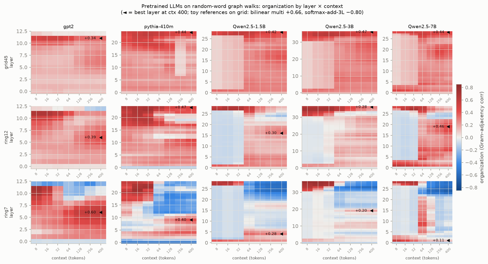
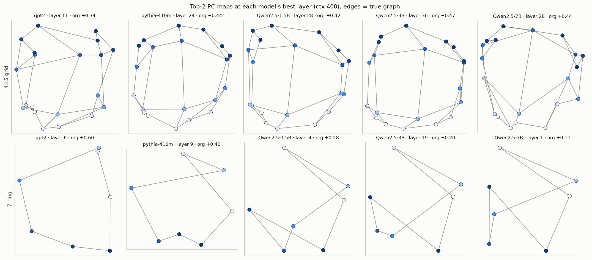
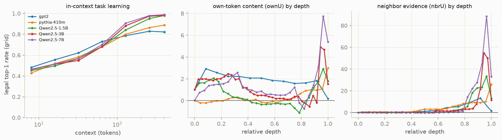
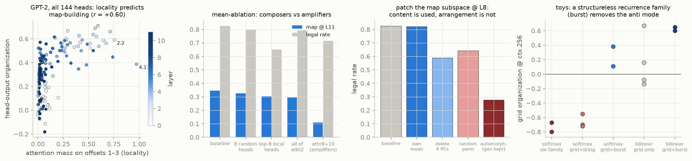
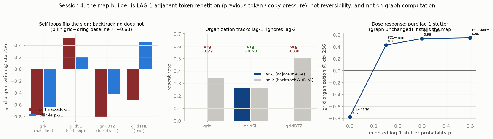

# Do pretrained LLMs organize graph walks the way Park et al. found — and what are they doing?

Question from the toy results: our from-scratch **softmax** models anti-organize (neighbors
pushed apart) even when perfect at the task, yet Park et al. saw real LLMs (Llama-3.1-8B,
softmax) organize positively. Is that a scale thing? And can our toy-model account
(prediction-as-representation + own-token content sign) explain what the real models do?

Setup (`llm_reps.py`): random walks on token-labeled graphs — each node of a 4×5 grid, a
12-ring, and a 7-ring is assigned a random common English word (single-token, one fixed
assignment per model), and the walk is fed to the pretrained model as a plain word
sequence, 400 words, 96 walks. Same measurements as the toys: windowed (50-token) mean
representation per node, organization = correlation between representation similarity and
graph adjacency — but now at **every layer** — plus in-context task performance, plus the
ownU/nbrU content coefficients read in each model's own unembedding basis. Models: GPT-2
(124M), Pythia-410M, Qwen2.5-1.5B/3B, Qwen2.5-7B (8-bit). (Park's exact Llama-3.1-8B is
gated on HF and this box has no token; Qwen2.5-7B is the same class.)

## 1 · Yes — and it does not need 8B parameters

Every model, including 124M GPT-2, learns the walk task in context (legal top-1 rate on
the grid 0.82–0.99 by 400 tokens; ~1.00 on rings) and organizes the grid **positively**:

| model | grid organization (last layer, ctx 400) | best layer | PC1/PC2 ↔ grid harmonics | top-2-PC Dirichlet energy (random ≈ 2) |
|---|---|---|---|---|
| GPT-2 124M | +0.02 | +0.34 (L11 of 12) | 0.79 / 0.77 | 0.75 |
| Pythia-410M | +0.44 | +0.44 (L24 = last) | 0.71 / 0.72 | 0.63 |
| Qwen2.5-1.5B | +0.42 | +0.42 (L28 = last) | **0.94 / 0.97** | 0.63 |
| Qwen2.5-3B | +0.47 | +0.47 (L36 = last) | 0.80 / 0.80 | 0.57 |
| Qwen2.5-7B | +0.44 | +0.44 (L28 = last) | 0.88 / 0.87 | 0.86 |

All five pass the Park Theorem-5.1 test: the grid's two spectral coordinates appear in the
**top two principal components** (each carrying ~25% of variance). So the phenomenon needs
neither 8B scale nor anything Llama-specific — a 124M model has it mid-stack.





## 2 · Why real softmax models organize positively when our toy softmax didn't

The toy account transfers directly. Reading each model's final-layer node representations
in its own unembedding basis (same regression as the toys):

- **nbrU (neighbor evidence — the prediction itself) is large and positive in every LLM**
  (last layer, grid: +1.4 GPT-2, +26 Pythia, +13/+12/+33 Qwen). The representation carries
  the prediction, and that channel alone builds the positive map — exactly as in the toys.
- **ownU (own-token content) is positive at the last layer in every LLM on the grid**
  (+0.18 … +5.38). None of them write own-token *suppression* into the residual stream.

That second line is the answer to the puzzle. Our toy softmax stack — trained from scratch
on graph walks only — implemented "don't predict impossible tokens" by writing *negative*
recent-token content into the stream, which cancels the neighbor overlap and inverts the
map. Pretrained LLMs never learned that habit: natural text is full of recurrence (recent
tokens are *more* likely to appear again — the same pressure that builds induction heads
as copiers), so their in-context circuit keeps own/recent-token content positive or
neutral, and the always-positive prediction channel sets the geometry. In the toy
vocabulary: natural-language pretraining is deep in the "reversible" regime, so the
anti-mode is never selected. The toy anti-organizing softmax was an implementation choice
available to tiny from-scratch models, not a property of softmax attention.



## 3 · The layer profile (what the toys couldn't show)

Organization rises through the stack and peaks late-but-not-last; GPT-2's final layer
drops to ~0 (+0.34 → +0.02) and the smallest rings *invert* at the very end. A 2-layer toy
has no "middle" — its stream is the output stream, so whatever output bookkeeping the
model does sits directly on top of the map. Deep models keep the map clean mid-stack and
only assemble output-specific content at the end.

## 4 · An anomaly worth keeping: the 7-ring inverts at the readout

On the smallest (odd) ring, every LLM anti-organizes at the final layer (−0.25 GPT-2,
−0.27 Pythia, −0.53/−0.41/−0.55 Qwen) while solving the task at ~1.00 — and the mid-stack
positive ring is weak in the Qwen models. The toy softmax model's "7-pointed star" is not
gone from real LLMs; it shows up at the output end on the smallest graphs, where the
recent past covers most of the graph. Not explained; logged as the same open question as
the toy softmax default ("why does the readout end prefer suppression-style content?").

## 5 · Survey: where it works, where it doesn't (11 models)

| model | grid org (best layer) | task legal | reading |
|---|---|---|---|
| pythia-70m | +0.19 | **0.10 — can't do the task** | below the competence floor |
| GPT-2 124M | +0.34 (mid; +0.02 last) | 0.82 | works, mid-stack |
| GPT-2 with **numeral** labels | **+0.01 anywhere** | **0.91** | *task WITHOUT geometry* |
| pythia-160m | +0.32 (mid) | 0.73 | weak but present |
| opt-125m | **+0.49** (through last layer) | 0.85 | strongest small organizer |
| OLMo-1B | +0.37 (**layers 1–3**) | 0.90 | earliest organizer |
| gpt2-medium / pythia-410m / Qwen 0.5–7B | +0.42…+0.47 | 0.82–0.99 | works |

Two genuine negatives: a model too weak for the task (pythia-70m), and — more
interesting — GPT-2 with numeral node-labels: task performance *improves* (0.91) while
the map vanishes. Follow-up showed the map still forms in the attention outputs
(attn2 +0.49) but GPT-2's late number-processing MLPs write large unorganized numeral
features that bury it in the residual; projecting out the static "number line" does not
recover it. Competence and organization dissociate *within one model, by token type*.
Also: in-context walk statistics don't matter — a fully directed (never-backtracking)
ring walk organizes as well as a uniform one (+0.52 vs +0.40); the toys' reversibility
effect is a training-time phenomenon, not an inference-time one. Time-shuffling the walk
kills the map (+0.02) — it comes from transition statistics alone.



## 6 · The circuit: local heads compose, late layers amplify, induction solves the task

Exact component attribution (pre-LN stream = embed + Σ attn + Σ mlp) plus per-head
analysis and ablations on GPT-2:

- **Locality predicts organization** (r = +0.60 across all 144 heads). The most local
  heads are the textbook previous-token heads (4.11, 2.2). Mechanism: *a local attention
  window applied to a walk is one step of graph message passing* — walk-adjacent tokens
  are graph-adjacent, so blending recent tokens = blending graph neighbors = Laplacian
  smoothing = the spectral map. The operator is content-aware (inserting commas between
  words leaves it intact, attn2 organization even rises to +0.65), which is why it
  survives natural tokenization.
- **Induction heads are the task solver, not the map builder.** Classic induction
  scoring finds GPT-2's known induction heads (6.9, 5.5, 7.10); induction score is
  uncorrelated with head organization (r = −0.03).
- **Late layers inherit and amplify.** Attention layers 9–10 are not local (offset mass
  ~0.05) but carry the largest organized variance into the final map. Mean-ablating the
  16 most-local heads collapses their organization (attn9 +0.36 → +0.12) and the map
  (+0.35 → +0.15) — the composers are the local heads.
- Cross-family check: OLMo-1B's locality is front-loaded (layer-0 offset-1–3 mass 0.30,
  max head 0.67, ~0.06 mid-stack) — and OLMo is exactly the model whose map appears at
  layers 1–3.

## 7 · Is the structure *used*? (causal tests)

Deleting the 4-dim map subspace at layer 8 hurts behavior (legal 0.83 → 0.59; random
4-dim control: no effect) — but three sharper patches show it is the **content**, not
the **arrangement**, that matters:

| patch at layer 8 (steps 200+) | geometry | identities | legal |
|---|---|---|---|
| replace subspace with node's own clean mean | preserved | preserved | **0.822** (= baseline 0.826) |
| random permutation of node means | destroyed (+0.09) | scrambled | 0.642 |
| **180° grid automorphism** of node means | **perfectly preserved (+0.28)** | rotated (no fixed points) | **0.278 — worst** |

If downstream consulted the map's arrangement, the automorphism patch would be harmless.
Instead, damage scales with how far each node's *content* moved. Verdict on "the
structure is used and useful, right?": **the content is used — the geometry is its
shadow.** Representations carry node identity + neighbor evidence (the prediction);
neighboring nodes' prediction-contents overlap through each other, so useful content is
necessarily arranged as the graph. Same conclusion as the toys, now causal in GPT-2.

## 8 · What pretraining data pays for the map-builders

Mean-ablating the 16 local heads on wikitext costs +0.93 nats *uniformly* — recurring
targets +1.01, novel targets +0.91 (16 random heads: +0.09). The pre-registered guess
(damage concentrates on recently-recurring tokens) was wrong in an informative way:
local context is predictive for essentially **every** token of natural text, so all data
funds this machinery. That is why every pretrained family has it and why Park-style
geometry is universal rather than a quirk of some corpus slice.

## 9 · Feeding it back into the toys: recurrence pressure

The circuit story says LLMs organize because natural text installs *positive local
copying* (blend recent tokens into predictions). Pre-registered toy test: add a "burst"
family (complete-graph K16 walks where 50% of steps repeat one of the last 3 tokens —
recurrence with no graph structure at all) to grid training.

| toy model trained on | grid organization (ctx 8 → 256) | grid legal | prior result for reference |
|---|---|---|---|
| softmax-add-3L, grid+burst, seed 0 | +0.51 → **+0.38** | 0.999 | −0.80/−0.67 on six-family mix; −0.55…−0.72 on grid+dring |
| softmax-add-3L, grid+burst, seed 1 | +0.53 → +0.11 | 1.00 | (same) |
| bilin-lerp-2L, grid+burst, seed 0 | +0.78 → **+0.65** | 0.78 | grid-only lottery −0.14…+0.67; grid+cylinder unpinned |
| bilin-lerp-2L, grid+burst, seed 1 | +0.74 → **+0.60** | 0.96 | (same) |

**P1 supported, with nuance.** The softmax stack — reliably anti-organized on every
graph-only mixture we ever trained — never goes anti with burst in the mix (2/2 seeds
start clearly positive; one holds +0.38 at long context, one decays to +0.11). The anti
mode's fuel (suppress-the-recent-past) is directly opposed by recurrence pressure.
**P2 confirmed.** For bilinear, one structureless recurrence partner pins the positive
mode as well as the entire six-family mixture did (+0.60/+0.65 vs +0.55…+0.66) — far
better than the structural cousin cylinder (unpinned) or grid-only (lottery). Recurrence
is the cheapest known positive-pinning ingredient, which is satisfying: it is exactly
what natural text supplies to real LLMs.

**The strongest version — six-family mixture + burst (seed 0 each):**

| toy model on mixture+burst | grid org (ctx 8 → 256) | legal | mixture-only baseline |
|---|---|---|---|
| softmax-add-3L | +0.62 → **−0.33** | 1.00 | −0.80 / −0.67 |
| bilin-lerp-2L | +0.74 → **+0.62** | 0.99 | +0.55 … +0.66 |

Burst moves the softmax stack a long way toward positive (−0.80 → −0.33, and clearly
positive early in context) but cannot fully overcome the mixture's irreversible
directed-ring family at long context — a tug-of-war between recurrence pressure
(pin positive) and irreversibility pressure (pin anti), exactly what the session-2
reversibility account predicts when both ingredients are present. Bilinear holds its
mixture ceiling (+0.62); the positive mode appears saturated in data-space.

**The architecture version (pre-registered P3/P4, `toy_localmix.py`):** hard-wire the
ingredient instead — a parameter-free causal local average (x += 0.5·mean of previous 3
positions) after the embedding, i.e. one built-in message-passing step, trained on the
plain mixture with no burst data.

| toy + localmix layer, plain mixture | grid org (ctx 8 → 256) | legal | verdict |
|---|---|---|---|
| softmax-add-3L | +0.37 → +0.05 (PC1↔harmonic 0.97) | 1.00 | P3 partial: anti mode GONE (was −0.80), but long context erodes to neutral |
| bilin-lerp-2L | +0.57 → +0.55 | **0.68** (loss stuck ~2.9) | **P4 falsified**: less organized AND worse at the task |

Closing synthesis: the map-building ingredient is **installed by data** (recurrence) and
merely **permitted by architecture**. Hard-wiring it removes the softmax anti-default
but can't out-pull irreversible data, and it actively damages the bilinear model's
content-matching. This mirrors the LLM side: pretrained models get the machinery from
their data, not from any special wiring.

## 9b · Session 4 — pinning the ingredient: it is lag-1 adjacent repetition

Session 3 concluded "recurrence installs the map." Session 4 asked *which* recurrence, and
tested the user's four causal ideas against the reliably-anti grid+dring pairing.



**Self-loops flip it; backtracking does not (the key dissociation).** Adding self-edges to
the grid — so a walk can repeat the current node — flips the softmax stack from −0.77 to
**+0.53** with a clean grid map (PC1/PC2 harmonic 0.97/0.76), and flips bilinear too
(−0.63 → +0.21). Boosting *backtracking* 2× instead (return to the previous node, A→B→A)
does nothing (softmax −0.80, bilinear −0.42). The two differ in one statistic: self-loops
create **adjacent duplicate tokens** (A→A, 26% of steps), backtracking creates lag-2
returns with **zero** adjacent duplicates. Organization tracks the lag-1 rate
(0.00→0.26→0.00 gives anti→positive→anti) and is unrelated to the lag-2 rate
(0.34→0.26→0.51). So the organizer is the *immediate previous-token / copy* signal — the
thing induction heads are built on — not reversibility.

**Dose-response confirms it, on an unchanged graph.** A pure "stutter" that duplicates the
current node token with probability p (plain grid, no self-edges) gives a clean curve:

| lag-1 stutter p | grid org @256 | PC1/PC2 harmonic | legal |
|---|---|---|---|
| 0.00 (control) | −0.77 | 0.07/0.11 (no map) | 1.00 |
| 0.15 | **+0.43** | 0.91/0.82 (clean map) | 0.94 |
| 0.30 | +0.54 | 0.96/0.73 | 0.62 |
| 0.50 | +0.55 | 0.90/0.79 | 0.42 |

15% adjacent repetition suffices to flip the sign; the effect saturates by 30%. The graph
is untouched, so this isolates the sequence statistic: the map is a property of token
co-occurrence, not topology. (Legal rate falls as p rises because more of the prediction
budget goes to repeating the current token; p≈0.15 is the sweet spot.)

**On-graph computation does NOT install it (P5 falsified).** Interleaving distance
questions `[QDIST] u v ANS_d` into the walk documents left both archs anti (softmax
−0.63/−0.72, bilinear −0.54). The models answer distance queries weakly (top-1 0.30–0.38
vs a 0.29 always-guess-the-mode marginal) through a separate lookup, never drawing the
map. (Caveat: queries were appended after the walk, not interleaved throughout, so the
running node-rep is never itself asked a metric question — the interleaved version is the
sharper future test.)

**Natural-language co-training is arch-dependent (P8).** Mixing wikitext (5k-vocab BPE,
node tokens in a reserved id range) with grid+dring flips the positive-prone bilinear
(+0.46, map 0.89/0.87) but only softens the anti-prone softmax (−0.77 → −0.51) — because
the adjacent repeats live in the *text* token stream, disjoint from the node tokens. The
copy pressure has to land on the tokens being represented.

**This closes the opening puzzle.** Real softmax LLMs organize positively because
natural-language pretraining is saturated in lag-1 repetition (function words, names,
syntactic echoes) applied to the same tokens they represent. The from-scratch toy softmax,
fed only graph walks with zero adjacent repeats, had no such pressure and was free to
anti-organize. The map is the shadow of one specific, dialable predictive pressure: *the
token you just saw is worth predicting again.*

## 10 · Session takeaways

0. **The map-builder is lag-1 adjacent token repetition** (previous-token / copy pressure)
   on the represented tokens — not reversibility, not on-graph computation. Dialable: 15%
   adjacent repetition flips the toy softmax anti-map to a clean grid; it saturates by 30%.
1. Park-style geometry is generic in pretrained LLMs down to 124M — because they all
   have local-copy heads, and *a local attention window applied to a walk is graph
   message passing*.
2. The map-builders and the task-solver (induction) are different heads; competence and
   organization dissociate componentwise, by token type (numerals), and causally.
3. The arrangement is not consulted downstream: the content (identity + neighbor
   evidence) is what's used; the geometry is that content's shadow. Same conclusion as
   the toys, now causal in a real LLM.
4. What installs the machinery is *all* natural text (local context predicts everywhere)
   — and injecting exactly that pressure (recurrence) into toy training removes the toy
   softmax anti-mode and pins bilinear positive with a single structureless family.
5. The toy anti-map, the LLM 7-ring readout inversion, and the mixture+burst tug-of-war
   are all the same variable: whether the recent past must be suppressed or re-predicted.

## Reproduce

```bash
python llm_reps.py gpt2 --batch 24        # or any HF causal LM; --8bit for 7B
python llm_figs.py                        # figures/llm_{org,maps,coeffs}.png
python llm_variants.py gpt2               # in-context walk battery + controls
python gpt2_circuit.py                    # component/head attribution
python gpt2_localheads.py                 # locality vs organization + ablations
python gpt2_usetest.py 8                  # causal-use subspace tests
python toy_burst.py                       # toy recurrence experiment (session 3)
python toy_recur.py                       # session 4: self-loop vs backtrack causal tests
python toy_stutter.py                     # session 4: lag-1 stutter dose-response
python toy_nlmix.py                       # session 4: natural-language co-training
python toy_query.py                       # session 4: on-graph distance queries (P5)
python toy_lag_fig.py                     # session 4 summary figure -> figures/toy_lag1.png
```

Caveats: one word-labeling per model (fixed seed), 96 walks, window 50; ownU/nbrU read
per-layer against the final unembedding (only exactly interpretable at the last layer);
7-ring statistics rest on 21 node pairs; Qwen2.5-7B measured in 8-bit quantization;
numeral-label organization varies with the random assignment (labeling lottery noted).
