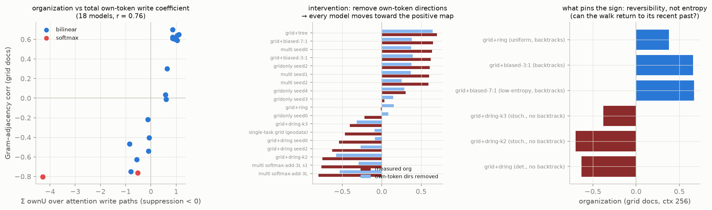

# Why do these models put geometric neighbors near each other?

Session-2 report (hypothesis→verdict trail in [LOG.md](LOG.md); methods in `geometry.py`).
Question from the multi-family results: the multi-family model stores graph neighbors nearby
(Park-style map), single-family models usually don't, and the perfect softmax model stores
the opposite (anti-map). What decides this?

**The answer, in one paragraph.** A node's representation must carry the model's *prediction* —
positive neighbor-token evidence in the unembedding basis (found in the layer-2 write of all
18 models tested; it is the prediction, so it's functionally forced). That evidence alone
always forms the positive map, because adjacent nodes' predictions overlap *through each
other*: u's evidence contains v's token and vice versa. The representation also carries
own/recent-token content whose sign is behaviorally free — "don't predict what can't follow"
can be implemented as suppression **in the write paths** (negative own-token content) or
**in the static embed–unembed readout** (positive writes, cancelled at the logits) with the
same behavior. The total geometry is the coupling of these two parts: positive own-content →
neighbors nearby; suppression-in-writes → anti-map. And the training data pins the choice
through one property: **reversibility**. If the walk can never return to its recent past
(directed families), the model must adaptively suppress recent tokens, the suppression lands
in the writes, and the map inverts. Any nonzero backtrack rate makes the recent past part of
the prediction and the map goes positive. Entropy is irrelevant. (One refinement from the
seed-2 replications: the pinning needs the partner family to genuinely differ from the base
one — grid + its structural near-copy cylinder pins nothing, +0.24/−0.24 across seeds, the
same lottery as single-family training.)



## The measured links

1. **Path decomposition (exact).** The residual stream is an exact sum of path writes
   (embed / o1 / o2 / [o3]); the Gram–adjacency covariance attributes over path pairs.
   The o2 (prediction-write) self-term is positive in every bilinear model — including the
   anti-organized ones (grid+dring: o2 term +1.07 while the total is −0.54). Anti
   organization lives in the cross-terms with own-token content. The single-family seed
   lottery is literally a cancellation balance (one seed: +8.3 vs −6.0 → net +0.04).
2. **Content identification.** Regressing each path's contribution onto
   {own, neighbor-sum} × {embed, unembed} bases: neighbor evidence (`nbrU`) is positive in
   o2 for all 18 models. The variable is the own-token coefficient: multi-family models
   write +1.0·u_own; the softmax champion writes −3.7·u_own; irreversible-family models put
   the suppression in layer 1 (o1 ownU −2.2 for grid+dring-k2 vs −0.07 for grid+biased-7:1).
   Reconstructing all paths from just these 4 coefficients reproduces the measured
   organization across models at r = 0.954; the summed own-token write coefficient alone
   correlates r = 0.76 with organization across all 18 models.
3. **Intervention.** Projecting each node's own-token directions {e_v, u_v} out of its
   representation moves every model toward the positive map (e.g. −0.47 → −0.09,
   −0.76 → −0.29) and barely moves the positive models. The positive map is always there;
   anti models wear it under a self-suppression overlay.
4. **The causal data property — reversibility, not entropy.** Two-family runs grid+X:

   | X | entropy | backtracks? | organization |
   |---|---|---|---|
   | directed ring (k=1) | 0 bits | never | −0.55…−0.72 (3 seeds) |
   | directed ring, k=2 out-edges | 1 bit | never | **−0.70, −0.80** (2 seeds) |
   | directed ring, k=3 out-edges | 1.6 bits | never | −0.38, +0.05 (2 seeds — boundary) |
   | biased ring 7:1 | 0.54 bits | 12.5 % of steps | **+0.67, +0.64** (2 seeds) |
   | biased ring 3:1 | 0.81 bits | 25 % of steps | **+0.66, +0.65** (2 seeds) |
   | uniform ring | 1 bit | 50 % | +0.38 |

   The low-entropy-but-reversible family organizes positively (both seeds); the
   high-entropy-but-irreversible families stay anti at k=1,2 (all 5 seeds). At k=3 the
   pinning weakens toward the lottery — a dose–response: irreversibility pressure falls as
   the out-degree grows and the recent past matters less. Reversibility is the pinning
   variable; its strength scales with how sharply the recent past is excluded.

   Seed-2 replications of the other two-family partners complete the picture: grid+ring
   (+0.38, +0.67) and grid+tree (+0.41, +0.65) are reliably positive, while grid+cylinder
   (+0.24, −0.24) is **not pinned** — a partner that is nearly the same graph family adds
   no constraint, and the sign reverts to the single-family init lottery.

5. **No static gauge.** Injecting own-token suppression into the trained multi model's OV
   writes (`OV ← OV − λ·Σ u_x ê_xᵀ`) moves the organization down monotonically
   (+0.66 → +0.16) but degrades behavior with it — the injected content is input-dependent
   at the logits, so no static reparameterization connects the two modes. They are
   *retraining-compensable* alternatives: the data selects the mode during training.

## Corollaries

- **Zero-shot structure:** the organization property transfers to never-seen structures —
  on the user-suggested widening-rings graph (concentric rings 4→8→16 with radial spokes),
  the multi model scores +0.65, softmax −0.75, specialist −0.37, all zero-shot (all ~0.96+
  legal). It's now the first panel of the
  [3D viewer](https://claude.ai/code/artifact/6e85f3a9-aa05-4bbd-ba98-addbaaba3e16).
- **Architecture default:** softmax induction stacks implement suppression in-writes even on
  reversible-heavy mixtures (anti at −0.67…−0.80 across seeds); the bilinear-lerp recipe
  follows the data. Data sets the incentive; architecture sets the default implementation.
- **Interpretation for the Park et al. picture:** "neighbors stored nearby" is what the
  *prediction-as-representation* channel looks like when nothing forces recent-past
  suppression into the stream. It is not a specialness of multi-task training per se —
  multi-family mixtures work because they are dominated by reversible families and make the
  suppression hack harmful.

## Caveats

- Organization measured on grid docs, final layer, one labeling, window 50; 2 seeds for the
  battery runs and the ring/tree/cylinder partners (k=1 dring: 3 seeds; multi/gridonly:
  3–4 seeds).
- The own-token-removal intervention is measurement-side (projection), not a weight-space
  causal edit; an extended projection including OV-transformed own directions over-projects
  and was discarded.
- The reversibility account is established for this task family and architecture scale;
  the softmax default-to-suppression is described, not explained.

## Reproduce

```bash
python geometry.py      # path decomposition + attribution + distance profiles
# battery models: runs_gen/bilin-lerp-2L-grid+{dring-k2,dring-k3,biased-3:1,biased-7:1}
```
