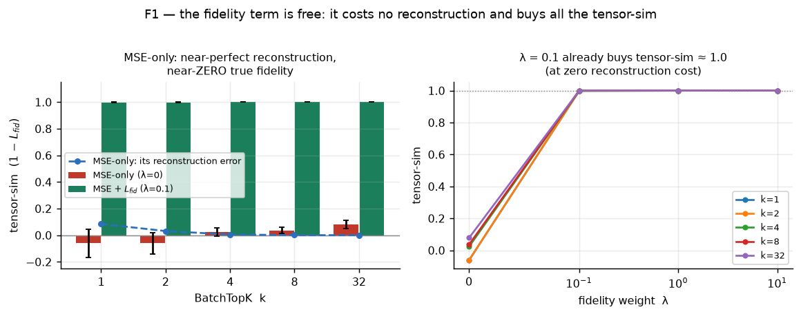
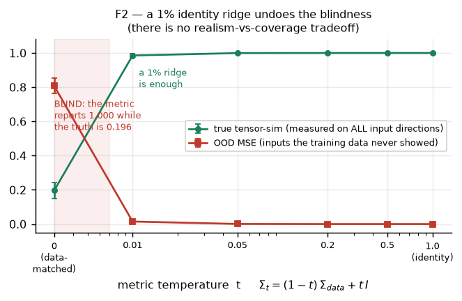
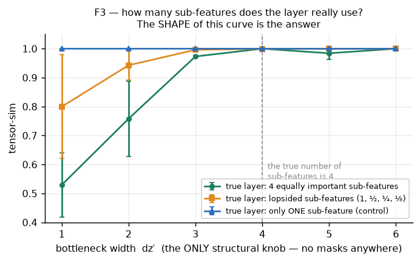
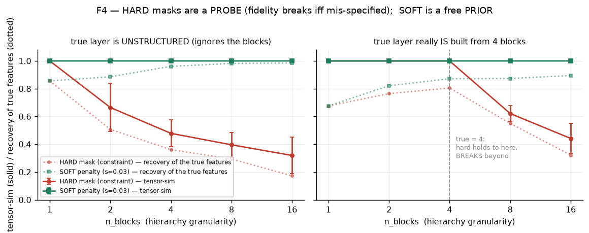
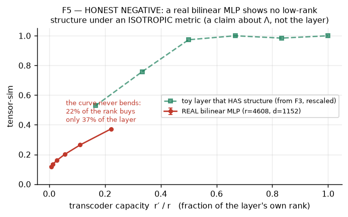
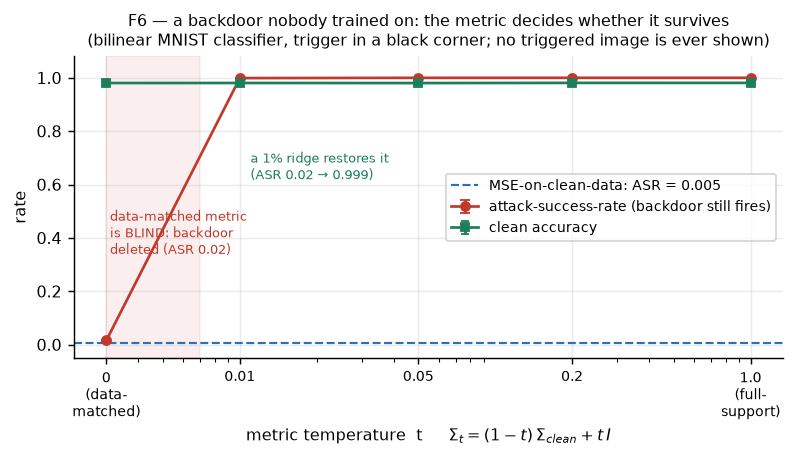

# Figures — the tensor-similarity transcoder results, in pictures

Every number below was **re-run from the same fit functions that produced the tables** in `RESULTS.md`
(`make_figures.py`, cached to `figures/results.json`), so the plots cannot silently drift from the text.
5 seeds everywhere; error bars are ±1 s.d.

Terms used: **tensor-sim** = `1 − L_fid`, the fidelity of the transcoder to the true layer measured over *all*
input directions (1.0 = identical; 0 = no better than predicting zero; it can go negative). **OOD** = inputs
drawn from directions the training data never visited.

---

## F1 — The fidelity term is free: it costs no reconstruction and buys all the tensor-sim

**This is the whole thesis of the program in one plot.** The red bars are a transcoder trained on
reconstruction (MSE) alone. Look at `k=32`, the rightmost pair, where the sparsity gate is a no-op and there
is nothing left to argue about: reconstruction error is **0.000 — literally perfect** (blue dashed line on the
floor) while its true tensor-sim is **0.079**, i.e. essentially **zero**. The transcoder has learned a function
that agrees with the layer everywhere the data goes and is unrelated to it everywhere else.

The green bars add the fidelity term at λ=0.1. Tensor-sim goes to **1.000**, and recovery of the true features
goes from 0.132 to **0.647** (chance is 0.066) — **with no increase in reconstruction error at all**. The right
panel shows there is nothing to tune: λ=0.1 already saturates, at every sparsity level. There is no
tradeoff here to trade off.

---

## F2 — A 1% ridge on the metric undoes the off-distribution blindness

The metric needs a covariance Σ, and the obvious choice — fit Σ to your data — is a trap (this is FINDING 3).
At `t=0` (left edge) the metric is data-matched and **completely blind**: it reports a fidelity of 1.000 while
the transcoder's true fidelity is **0.196** and its OOD error is **0.807**. It has silently degenerated into MSE.

The fix is almost free. Mixing in just **1% of the identity** — `Σ_t = 0.99·Σ_data + 0.01·I` — restores true
tensor-sim to **0.985** and drops OOD error to **0.015**. By 5% it is essentially perfect. So you do *not* have
to choose between a realistic metric and off-distribution coverage: **always ridge Σ; ε≈0.05 is a safe default.**

---

## F3 — How many sub-features does the layer really use? The shape of this curve is the answer

This is how depth is used to *measure* hierarchy rather than impose it. Two stacked bilinear layers are exactly
the maps that squeeze through a bottleneck `z`, and that bottleneck **is** the hierarchy: layer 1 builds
sub-features, layer 2 combines them. So we fit a 2-layer transcoder with **no masks and no structural priors at
all** — the only knob is the bottleneck width `dz′` — and watch what the fidelity curve does. All data-free.

Three different true layers, three different curve *shapes*:
- **Green** — a layer genuinely built from 4 equally important sub-features. The curve **bends sharply at
  exactly 4** and flattens. That knee *is* the width of the hierarchy, discovered without being told.
- **Orange** — a layer whose sub-features are lopsided (one dominates, the rest are corrections). The curve
  **ramps gradually** instead of bending. Correctly so: that computation really is mostly one sub-feature.
- **Blue** — the control: a layer that truly needs only one sub-feature. It reports **1.000 at `dz′=1`**, which
  is what makes this a real measurement rather than a reward for extra capacity.

**A hierarchy takes two numbers to describe, not one:** its *width* (where the curve flattens) and its
*balance* (how sharply it bends). Adding an L1 penalty on top recovers *which input coordinates* form each
sub-feature (purity 0.47 → 0.81, chance 0.33) at zero fidelity cost.

---

## F4 — Hard masks are a PROBE; soft penalties are a free PRIOR

The two ways of imposing block structure behave like completely different objects, and conflating them is what
made an earlier tick call hierarchy a failure.

**Red (hard mask — off-block weights forced to zero).** Fidelity *collapses the moment the mask is wrong*.
On the left, where the true layer respects no blocks at all, it breaks immediately. On the right, where the
true layer really is built from 4 blocks, it holds at a **perfect 1.000 for every partition at or coarser than
the truth (1, 2, 4)** and **breaks the instant you go finer than the truth (n_blocks = 8, 16)**.

That asymmetry is an instrument, not a failure: **the finest hard partition that still holds tensor-sim = 1.0
is the layer's true block structure** — 4 on the right, 1 (i.e. not hierarchical) on the left. You can scan
structural hypotheses against a layer and read off which ones it admits, using **no data**.

**Green (soft penalty — off-block weights merely discouraged).** Fidelity stays at **1.000 everywhere**, even
at 16 blocks against a layer that respects no blocks, *and* recovery of the true features improves the whole
way (up to 0.986). A penalty can't cost fidelity the way a constraint can.

**Rule: fit with soft penalties, test with hard constraints.**

---

## F5 — Honest negative: a real bilinear MLP shows no structure under an isotropic metric

The first real-model measurement: the layer-8 bilinear MLP of a 500M-parameter 18-layer bilinear GPT
(rank 4608, width 1152), fit **from its weights alone — no data, no forward passes**.

Compare the shapes. The toy layer that genuinely has structure (green, from F3) bends and saturates. The real
layer (red) **never bends**: at 22% of its own rank we recover only 37% of it, the curve is close to linear,
adding an L1 penalty changes literally nothing, and the recovered factors stay dense. Under this metric the real
layer looks incompressible and unstructured.

**But read this as a statement about the metric, not the layer.** Λ = N(0,I) demands that the transcoder match
the layer equally in all 1152 residual directions — including the overwhelming majority the model never
actually visits. Real residual streams are violently anisotropic. F2's lesson is that the right choice is a
*ridged* covariance `Σ_resid + εI`, which requires estimating Σ from real activations. **This run used neither**
— it used the ε=1 endpoint. So the only claim supported here is the narrow one: *a real bilinear MLP has no
low-rank structure with respect to isotropic inputs.* Whether it has structure **on its own data manifold** is
the open question, and it is the obvious next experiment.

**Update (Tick 7): this negative was overturned.** The obvious next experiment was run — the real input
covariance was measured (effective dimension 23.5 of 1152; the data is a tight cone around its mean) and the
sweep redone under a ridged real metric. A rank-8 transcoder then reaches tensor-sim 0.807 and rank-128 reaches
0.926. **The real layer is strongly low-rank on its own data manifold; F5's "no structure" was an artifact of
the isotropic Λ.** FINDING 10 is formally retracted in `RESULTS.md` (Tick 7). F5 is kept here as the cautionary
before-picture.

---

## F6 — A backdoor nobody trained on: the metric decides whether it survives

A bilinear MNIST classifier with a planted backdoor (a bright corner patch forces class 0; clean accuracy
0.981, attack-success-rate 1.000). We fit transcoders to it and use each as the classifier. **No transcoder is
ever shown a triggered image** — yet whether the backdoor survives is decided entirely by the metric.

The blue dashed line is the standard objective, MSE on clean data: it keeps clean accuracy but the backdoor's
attack-success-rate collapses to **0.005** — the mechanism is silently gone. The green curve (clean accuracy)
stays flat everywhere. The red curve is the backdoor: at the data-matched metric (`t=0`, left edge) it too is
near zero — the metric is **blind** in the black-corner direction the trigger hides in. Add just **1% of the
identity** and the attack-success-rate jumps from 0.016 to **0.999**: the backdoor is fully preserved.

The reading cuts two ways and both are true. For **faithfulness**, clean-data MSE is dangerous — it drops
mechanisms the data never exercises. For **safety**, "compress on clean data" is not a defense — it only
removed the backdoor because the metric was accidentally blind, and the metric choice that makes a transcoder
honest (a ridged, full-support Λ) is the same one that keeps the backdoor at full strength.
